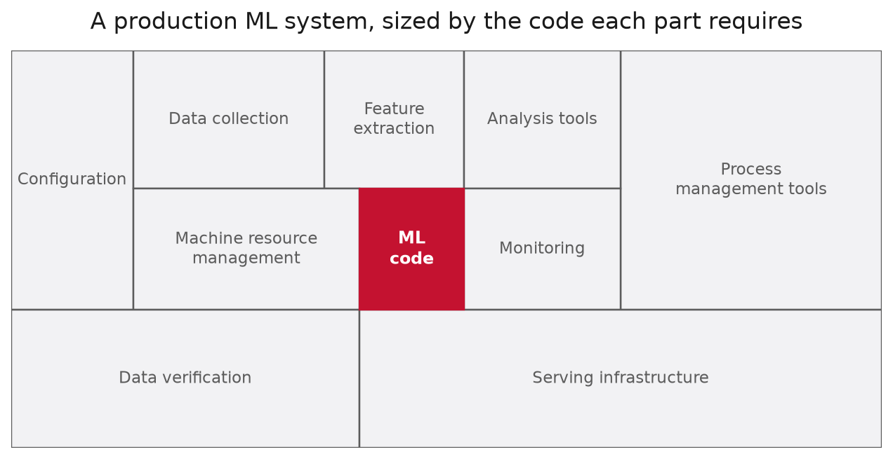
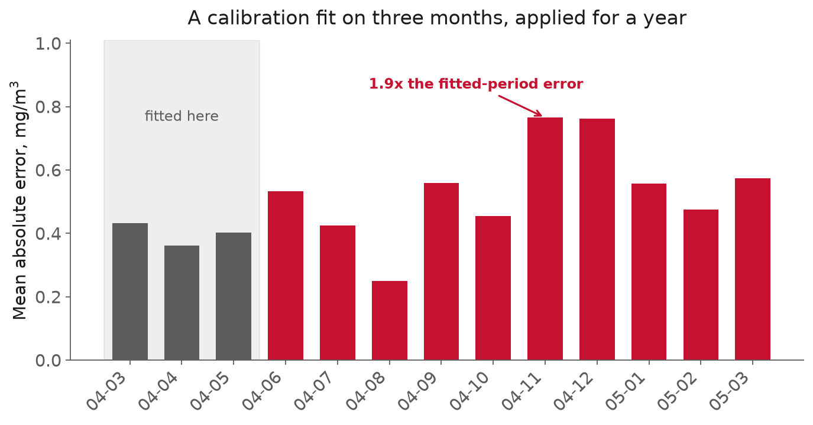
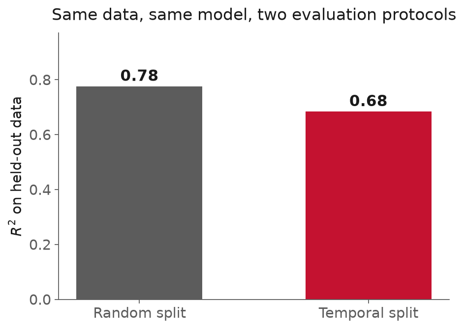

<!-- _class: title -->

# Lecture 1: The system view

## Week 1, Foundations

**Systems and Toolchains for AI Engineers**

---

## Roadmap

1. Why the model is the small box
2. Three failures that were not modeling failures
3. What makes engineering data different
4. **A tour of the stack**, the whole semester in 40 minutes
5. The toolchain, and why each piece is there

<!-- 110 minutes. Budget: 10 / 30 / 20 / 35 / 10, leaving ~5 slack.
     The tour is the part students actually need today. If you are running long,
     cut MCAS detail, not the tour. -->

---

<!-- _class: section -->

# Why the model is the small box

---

## Why the model is the small box

> "The box labeled 'ML Code' is actually tiny
> in proportion to the rest of the system."

Sculley et al., NeurIPS 2015

[Read the paper](https://papers.nips.cc/paper_files/paper/2015/file/86df7dcfd896fcaf2674f757a2463eba-Paper.pdf), 9 pages

---

Redrawn after Sculley et al. (2015). Our own artwork, not the paper's figure.

---

## Why the model is the small box, the number that is not in the paper

You will see this cited as **"less than 10% is ML code."**

That number is **not in the paper.**

- The paper says "tiny in proportion"
- The 10% is invented precision, spread by repetition

<!-- Worth 60 seconds. Sets the tone for citation discipline all semester. -->

---

## Why the model is the small box, the stages

**data → storage → pipelines → features → training → evaluation → deployment → monitoring**

- Reading it as linear is the first thing to unlearn
- Monitoring feeds back into acquisition

---

## Why the model is the small box, where failures cluster

Not in the model class. In the joints:

- Upstream schema changed, nobody told you
- Feature computed one way in training, another in serving
- A source silently starts returning nulls

**Integration failure**: a fault in the joints between components, not inside any one of them. Cross-validation cannot see it.

---

<!-- _class: section -->

# Case 1: Public Health England

---

## Case 1: Public Health England

Pipeline: commercial labs → PHE → contact tracing

- Labs sent **CSV**, no problem
- PHE consolidated into Excel templates
- Developers picked legacy **`.xls`**

`.xls` caps a sheet at **65,536 rows**

---

## Case 1: Public Health England, what that meant

- Several rows per test result
- So ~**1,400 cases** per template
- Hit the ceiling → remaining rows **silently absent**

No error. No rejection. Just gone.

[BBC: how it happened](https://www.bbc.co.uk/news/technology-54423988)

---

## Case 1: Public Health England, the cost

**15,841** positive cases, 25 Sep to 2 Oct 2020

- Never passed to contact tracers
- >75% of them in the final three days
- Patients told their results; **contacts never traced**
- By Monday, ~half still not reached

[PHE statement](https://www.gov.uk/government/news/phe-statement-on-delayed-reporting-of-covid-19-cases)

---

## Case 1: Public Health England, read the failure carefully

Every model downstream computed **correctly**
on the data it received.

The missing control was the least glamorous
thing in the pipeline:

> Did the number of records I sent
> equal the number that arrived?

---

## Case 1: Public Health England, three names worth carrying

**Glue code**: connective tissue that only moves data between components. It dominates the codebase.

**Undeclared consumer**: someone depends on your output and you do not know they exist.

**Pipeline jungles**: glue accreting without redesign.

Hold onto the undeclared consumer.

---

<!-- _class: section -->

# Case 2: Google Flu Trends

---

## Case 2: Google Flu Trends

The premise was good: flu surveillance ran on a **1 to 2 week lag**,
search queries are available immediately. See the epidemic sooner.

The validation was good too:

- 50M candidate queries screened to **45**
- Held-out data, excluded from every prior step
- Mean correlation **0.97** across nine regions

Stricter than most deployed ML gets today.

[Ginsberg et al., *Nature* 2009](https://static.googleusercontent.com/media/research.google.com/en//archive/papers/detecting-influenza-epidemics.pdf)

---

## Case 2: Google Flu Trends, then

- **2012-13 season:** more than **double** the CDC figure
- Too high in **100 of 108 weeks** (Aug 2011 to Sep 2013)

Wrong, in the same direction, for two years.

[Lazer et al., *Science* 2014](https://gking.harvard.edu/files/gking/files/0314policyforumff.pdf)

---

## Case 2: Google Flu Trends, big data hubris

Search 50M terms against ~1,000 points
→ you *will* find winter.

They were already deleting terms like
*high school basketball* by hand.

> "part flu detector, part winter detector"

Missed the non-seasonal **2009 H1N1** entirely.

---

## Case 2: Google Flu Trends, algorithm dynamics

Google shipped **86 search changes** in Jun-Jul 2012

- Suggested related searches
- Surfaced diagnoses for symptom queries

Every one an improvement to *search*.
None of those engineers knew a flu model
consumed their output.

**The undeclared consumer, in-house.**

---

## Case 2: Google Flu Trends, what should bother you

100 wrong weeks out of 108, same direction.

- Visible for two years
- 3-week-old CDC data already beat it

The failure was not the model.
It was the **absence of a baseline comparison** in production.

---

<!-- _class: section -->

# Engineering data is different

---

## Engineering data is different, units and calibration

Raw sensor voltage ≠ calibrated concentration

- Same weights, different model
- Your validation metric **will not** tell you

Surfaces when someone recalibrates.

---

## Engineering data is different, drift measured not asserted

UCI Air Quality: metal-oxide sensors, Italian roadside,
hourly for ~13 months, 9,357 records

Fit a calibration on **March to May 2004 only**.
Apply it for the rest of the deployment.

[Dataset](https://archive.ics.uci.edu/dataset/360/air+quality)

---

---

## Engineering data is different, that is season not decay

- **Best** in August, *below* the fitted-period error
- **Worst** in Nov-Dec, ~**1.9x** the fitted-period error

The model learned spring, so it is worst
exactly when conditions are least like spring.

Same failure as Flu Trends, on a gas sensor.

---

## Engineering data is different, the protocol matters as much as the model

Same data. Same model. Two ways of scoring it.

---

## Engineering data is different, why that gap is the dangerous kind

Random split → $R^2 = 0.78$
Temporal split → $R^2 = 0.68$

The gap is small enough to pass unnoticed.

If you only ever saw 0.78, nothing would look wrong.
This is how the error survives review.

---

## Engineering data is different, provenance

**Provenance**: the record of which data, which code, and which parameters produced a given number.

If the answer is "a notebook run out of order
on a laptop that has been reimaged,"
there is no answer.

---

<!-- _class: section -->

# Case 3: MCAS

---

## Case 3: MCAS

Control function commanding nose-down stabilizer trim.

- Aircraft carried **two** angle-of-attack sensors
- MCAS used **one at a time**, alternating by flight
- No cross-comparison. No voting.

One bad sensor was sufficient.

---

## Case 3: MCAS, Lion Air 610

Left AoA sensor biased by **~21°**

Traced to a replacement sensor
**mis-calibrated during an earlier repair**

- Undetected at the repair
- Undetected by the installation test

A measurement channel nobody had validated,
driving a flight control surface.

---

## Case 3: MCAS, the analysis modeled the wrong failure

Boeing's hazard assessment evaluated
erroneous data from **both** air data channels
→ "beyond extremely improbable"

But the MCAS path was exposed to a **single** failure.

[House T&I Committee report](https://www.govinfo.gov/content/pkg/GOVPUB-Y4_T68_2-PURL-gpo144993/pdf/GOVPUB-Y4_T68_2-PURL-gpo144993.pdf), p. 106

---

## Case 3: MCAS, what the investigations concluded

Incorrect assumptions about flight crew response,
plus incomplete review of flight deck effects,
are what made single-sensor reliance **appear acceptable**.

JT610, Oct 2018: 189 killed.
ET302, Mar 2019: 157 killed.

---

## Case 3: MCAS, three questions for any input you trust

1. Where did this measurement come from?
2. Is it independently corroborated?
3. What happens downstream when it is wrong?

If (3) is "an operator will compensate,"
that needs **evidence**, not assumption.

---

<!-- _class: section -->

# A tour of the stack

## The rest of the semester, in one pass

---

## A tour of the stack, storage

A CSV has no schema, no types, no constraints,
and no way to read one column without reading all of them.
PHE is the far end of that road.

| Model | Example | Good at |
|---|---|---|
| Relational | PostgreSQL | continuous writes, joins, correctness |
| Columnar file | Parquet | scanning few columns of many |
| Embedded analytical | DuckDB | SQL over Parquet, no server |

A fourth, the **vector store**, indexes by similarity.

---

## A tour of the stack, the practitioner question

Not *"which database is best"* but
**"what is my access pattern?"**

- One row at a time, many concurrent readers → relational
- Three columns across ten years → columnar

[DuckDB](https://duckdb.org/docs/stable/index), [Parquet format](https://parquet.apache.org/docs/file-format/)

---

## A tour of the stack, pipelines

**Batch** runs on a schedule over bounded data. Most engineering work needs only this.
**Streaming** processes records as they arrive: buys latency, costs correctness.

A pipeline that silently passes bad data
is worse than one that crashes.

Declare what you expect:
column types, physical ranges, null rates, **row counts**

Fail loudly when reality disagrees.

[pandera](https://pandera.readthedocs.io/en/stable/)

---

## A tour of the stack, training

It is an optimization loop.

1. Model with adjustable parameters
2. Loss function measuring wrongness
3. Gradient of loss w.r.t. every parameter
4. Step downhill. Repeat.

**Automatic differentiation**: frameworks record the operations you perform, then replay them backwards for exact gradients.

You never hand-derive anything. That is the whole trick behind PyTorch.

[torch.autograd, gently](https://docs.pytorch.org/tutorials/beginner/blitz/autograd_tutorial.html)

---

## A tour of the stack, when deep learning earns its place

Where there is structure to exploit:

- **CNNs** for spatial fields and images
- **Sequence models** for time series
- **GPUs** because it is all matrix multiplication

But: a boosted tree on good features beats
a neural net on bad ones, most of the time.

**Beat the baseline first.**

---

## A tour of the stack, evaluation and tracking

Both failures today were evaluation failures.

- A protocol that reflects deployment (temporal, grouped)
- Metrics that reflect the **decision**
- A baseline you are required to beat

After a hundred runs, *"which config produced this?"*
is unanswerable from memory. **One run = one reproducible fact.**

[MLflow quickstart](https://mlflow.org/docs/latest/ml/tracking/quickstart/)

---

## A tour of the stack, deployment

Making it run **somewhere else, repeatedly,
for someone who is not you.**

**Container**: an image bundling code, dependencies and system libraries into one artifact that runs anywhere the runtime exists.

A VM virtualizes hardware and boots an OS; a container shares the host kernel
and isolates the process. Milliseconds, not tens of seconds.

[What is a container?](https://www.docker.com/resources/what-container/)

---

## A tour of the stack, being called

**FastAPI**: your model as an HTTP endpoint,
with typed request and response schemas.

That schema is also a **data contract** with your callers.

Then the questions turn operational:
latency budget, throughput, cost per prediction, behavior under load

[FastAPI](https://fastapi.tiangolo.com/)

---

## A tour of the stack, monitoring

Most courses stop at deployment.

Models degrade because the world moves,
exactly as the calibration figure showed.

Watch: input distributions, prediction distributions,
the gap against ground truth once labels arrive

**MLOps** automates that loop: CI that tests **data and models** and not only
code, reproducible retraining, staged rollout so a bad model does not reach
everyone, and the ability to **roll back**.

Flu Trends is what absence looks like.

---

## A tour of the stack, language models

A next-token predictor trained on a very large corpus.

What matters operationally:

- Text splits into **tokens**
- Bounded **context window**
- You pay per token, in money *and* latency
- Outputs are **sampled**, not deterministic

Three integration patterns:

- **Prompting**: instructions and data in the context
- **RAG**: search your own corpus, put hits in the context
- **Fine-tuning**: adjust the weights

Fine-tuning is the right answer far less often
than people expect.

---

## A tour of the stack, what an agent actually is

1. Give the model descriptions of functions it may call
2. It emits a structured request to call one
3. **Your code** executes it, returns the result
4. Repeat until done

That is the whole idea. Frameworks are conveniences.

For engineering: agents over your database,
your simulation, your instrument.

---

## A tour of the stack, security

**Prompt injection**: untrusted text reaching the context window carries instructions, and the model has no reliable way to tell data from commands.

An agent that both **reads untrusted input** and
**holds a capability to act** is exposed by construction.

Capability scoping > clever prompting.

[OWASP Top 10 for LLM Apps](https://owasp.org/www-project-top-10-for-large-language-model-applications/)

---

## A tour of the stack, and the older questions

- Who may see this data?
- What if the model is wrong in the direction that hurts?
- Does the training data license this use?
- Are the failure modes documented well enough
  to sign a safety case?

MCAS is a reminder these have consequences.

[NIST AI RMF](https://www.nist.gov/itl/ai-risk-management-framework)

---

<!-- _class: section -->

# The toolchain

---

## The toolchain, one stack all semester

| Layer | Tool | Prevents |
|---|---|---|
| Environments | `uv` | merely-probable rebuilds |
| Storage | Postgres/DuckDB/Parquet | CSV sprawl, truncation |
| Dataframes | pandas/Polars | OOM, unreadable transforms |
| Validation | pandera | bad data passing silently |
| Tracking | MLflow | unattributable results |
| Deep learning | PyTorch | hand-derived gradients |
| Serving | FastAPI/Docker | "works on my machine" |

**LLM and agent frameworks** are deliberately not standardized:
that ecosystem turns over faster than a semester, so we teach interfaces
and evaluation discipline rather than a vendor's abstractions.

---

<!-- _class: demo -->

# Demo

## `l01-reproducibility.ipynb`

UCI Air Quality → plot → naive split → fresh checkout

**Diagnose each break before I do.**

---

## What broke

1. **Absolute path** that existed only on my machine
2. **Unpinned split**, a different R2 every run, no error
3. **NumPy version**, and *which* cell failed told you which version you have

Compare failures with your neighbor on 3.
**None of the three announces itself while you are making it.**

---

## Recap

- The model is a small component; the system is the work
- **PHE**: infrastructure, not modeling
- **GFT**: validation is not evidence
- **MCAS**: provenance is part of the safety case
- Everything else today is a week of this course

---

## Next

**Install before next class** `git`, Python 3.11+, [`uv`](https://docs.astral.sh/uv/getting-started/)
**Assignment 1** released next session

Full notes, with all sources: `lectures/l01/notes.md`
