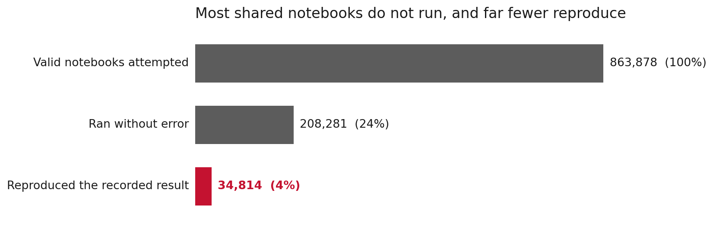

<!-- _class: title -->

# Lecture 2: Reproducible environments

## Week 1, Foundations

**Systems and Toolchains for AI Engineers**

---

## Roadmap

1. Why reproducibility: a cancer trial
2. Environments you can rebuild: `uv`
3. A project layout that scales
4. Versioning code, data, and models
5. Notebook to module, and tracking runs
6. Where reproducibility pushes back
7. Live demo: an empty folder to a tracked run

---

<!-- _class: section -->

# Why reproducibility

## a model nobody could rebuild

---

## Why reproducibility, a model in the clinic

2006, Duke, in *Nature Medicine*:
read a tumor's gene expression, predict which chemotherapy will work.

By 2007 the predictors were **assigning patients** in clinical trials.

[Nature Medicine, 2006](https://www.nature.com/articles/nm1491)

---

## Why reproducibility, the check that failed

Two researchers tried to rebuild the analysis from the **published data**. The numbers **did not match**.

Two ordinary errors, both invisible in the papers:

- a gene list **shifted down by one row**
- the **labels swapped**: responds vs resists

[Deriving chemosensitivity from cell lines (2009)](https://projecteuclid.org/journals/annals-of-applied-statistics/volume-3/issue-4/Deriving-chemosensitivity-from-cell-lines--Forensic-bioinformatics-and-reproducible/10.1214/09-AOAS291.full)

---

## Why reproducibility, how far it went

Three trials at Duke. **117 patients** enrolled.

- a [National Academies review](https://www.ncbi.nlm.nih.gov/books/NBK475955/) traced how it reached patients
- [retracted](https://www.nature.com/articles/nm0111-135) in 2011: the authors could not reproduce it either
- a [federal inquiry](https://retractionwatch.com/2015/11/07/its-official-anil-potti-faked-data-say-feds/) later found research misconduct

1. Intent is not this course's subject.
2. However, the engineering "lesson" is still important: reproducibility!

---

<!-- _class: definition -->

## Reproducibility

A result is **reproducible** when someone else can take your data and your code, run them, and get the same numbers you reported.

If they cannot, nobody can check it, including **you**, six months later.

---

## Why reproducibility?

> "There is computer code that evaluates the algorithm.
> There is data. And when you plug the data into that code,
> you should be able to get the answers back
> that you have reported."

An NCI statistician, reviewing the case.
[On the Duke case](https://pmc.ncbi.nlm.nih.gov/articles/PMC3474449/)

---

## Why reproducibility, simple questions...

Someone points at a number your system produced:

1. **Which data** made it?
2. **Which code** made it?
3. Can you make it **again, exactly**?

In any regulated or safety-critical setting, this is required.

---

<!-- _class: section -->

# Environments you can rebuild

## `uv`

---

## Environments you can rebuild

<div class="definition">

**Environment**: the exact Python interpreter and set of packages a project needs to run.

</div>

More than the packages you named:

- the version of **Python** (the interpreter)
- every **package** you installed
- each at a **specific version**, transitive ones included

---

## Environments you can rebuild, small differences and real bugs

The Lecture 1 demo broke because a version was never recorded.

- a function changes between two releases
- a default value moves
- a **hidden** dependency resolves differently today

<div class="definition">

**Dependency**: a package your project needs to run. Each one usually pulls in more of its own, so three dependencies/packages can become 50 very quickly!

</div>

---

## Environments you can rebuild, three files

- `pyproject.toml`: what you **asked for** (loose)
- `uv.lock`: what you **got**, every package, exact
- `.python-version`: the **interpreter**, pinned

Together they make a rebuild come out the same.

---

## Environments you can rebuild, pin Python too

`.python-version` fixes the interpreter.

Python **3.11** and **3.13** are not the same environment:
syntax, defaults, and C extensions differ.

`uv` installs and manages the version for you.

---

## Environments you can rebuild, start a project

```bash
uv init sensorlab && cd sensorlab
uv add pandas scikit-learn mlflow
```

`uv init` writes `pyproject.toml` and `.python-version`.
`uv add` resolves the whole graph into `uv.lock`.

---

## Environments you can rebuild, run and rebuild

```bash
uv run python -m sensorlab.train --seed 0   # checks the lock first
uv sync                                      # rebuild from the lock
```

`uv run` verifies the lockfile is current before it runs.
You rarely touch the virtual environment by hand.

---

## Environments you can rebuild, one command for a teammate

A colleague clones the repo and runs one command:

```bash
uv sync
```

Same interpreter, same packages, same versions.
This ends "works on my machine" as an answer.

---

## Environments you can rebuild, the lockfile

<div class="definition">

**Lockfile**: the complete set of packages your project resolved to, every one pinned to an exact version. Install from it and you get identical packages every time. `uv` writes `uv.lock` for you; never edit it by hand.

</div>

| `requirements.txt` | `uv.lock` |
|---|---|
| packages, often loose | the whole graph, exact |
| two installs → two sets | two installs → identical |
| you edit it | the tool maintains it |

[uv: working on projects](https://docs.astral.sh/uv/guides/projects/)

---

## Environments you can rebuild, common misconceptions or simplifications

Treating `uv` as a faster `pip` (which is true!) and stopping at `uv add` misses the pin.

The pin that buys reproducibility is
the **lockfile + the interpreter**, together.

**The test:** delete `.venv`, run `uv sync`,
get the same thing back. We do this live.

---

<!-- _class: section -->

# A project layout

## that scales

---

## A project layout that scales

<div class="definition">

**Scaffolding**: the project's skeleton set up before you write much code, the folders, the config, and an empty importable package.

</div>

A notebook and loose files cannot be
**imported**, **tested**, or **run** by someone else.
A small standard layout gives all three.

It costs almost nothing on day 1 and is tedious to do it later. Do it early!

---

## A project layout that scales, the src layout

Your code is a **package**, imported by name:

- imported the same way from anywhere
- no "works only from this folder" bug

A common failure comes from launching a script
from one specific directory. This removes it.

---

## A project layout that scales, the manifest

`pyproject.toml` declares the project:

- its **dependencies**
- its **entry points**
- its metadata

`uv` keeps it in step with the lockfile.

---

## A project layout that scales, a place for each thing

```text
sensorlab/
├── pyproject.toml   uv.lock   .python-version
├── src/sensorlab/   # load, clean, featurize, train
├── data/            # raw data, kept out of git
├── notebooks/       # exploration
└── tests/
```

The line between **exploration** and **the code that runs** is drawn in the folder layout, so it does not live in your memory.

We will use this exact structure all semester.

---

<!-- _class: section -->

# Versioning

## code, data, and models

---

## Versioning, three different problems

Code, data, and models differ in 
- **size**,
- how often they **change**,
- and in what is worth **recording** about them.

So they belong in **different tools**.

| Artifact | Tool | What you version |
|---|---|---|
| Code | git | the source, as commits |
| Data | git-ignored + a hash (git-lfs/DVC) | a pointer, not the bytes |
| Models | an MLflow run | the inputs that made it |

---

## Versioning, code to git

Code changes are small, in text and hence **diffable.**
Each **commit** is a labeled save point.
It answers the question: which version of the code produced this number?

<div class="definition">

**Provenance**: the record of where a result came from, which data, which code, which settings. Reproducibility is making the result again; provenance is saying how it was made.

</div>

---

## Versioning, data is not plain git

- git keeps **every version forever**.
- A 200 MB file bloats the repo permanently.
- Raw data may also carry **license or privacy** limits.

<div class="definition">

**Content hash**: a "fingerprint" of a file's bytes. Change one byte and it changes, so two runs can be checked for using the same data.

</div>

Set up `.gitignore` **first**: track a small sample plus the hash,
keep the raw bytes out. Removing a committed big file rewrites history.

---

## Versioning, big data gets its own tools

git is the wrong home for large binaries.

Tools that version data **by content**:
`git-lfs` and data version control **DVC**.

For now: a hash and a source, not the bytes.

---

## Versioning, models version the inputs

A model is an **output**.

Worth saving is what produced it:
the **code hash (SHA)**, the **data hash**, the **settings**.

---

<!-- _class: section -->

# Notebook to module

## and tracking runs

---

## Notebook to module, notebooks do not rerun

Great for looking at data.
Wrong tool for code that must run again.

- cells run in whatever order you clicked
- hidden state builds up between runs
- "it worked a minute ago" is not shippable

---

## Notebook to module, the normal case

[One study](https://leomurta.github.io/papers/pimentel2019a.pdf) ran ~**864k** valid notebooks from GitHub:

- only ~**24%** ran to the end without an error
- only ~**4%** reproduced their saved results

[A separate audit](http://reproducibility.cs.arizona.edu/v2/RepeatabilityTR.pdf): under a third of code-backed
papers could even be **built** in half an hour.

---



<span class="source">Pimentel et al. (2019): of 863,878 valid Python notebooks that could be run.</span>

---

## Notebook to module, extract functions

Pull the logic out of the cells:

```python
def load(path): ...
def clean(df): ...
def featurize(df): ...
def train(X, y, seed): ...
```

Arguments in, values out. Now you can **import and test** them.

---

## Notebook to module, add an entry point

```python
if __name__ == "__main__":
    args = parse_args()
    train(X, y, seed=args.seed)
```

Run it from the command line, not by clicking cells:

```bash
uv run python -m sensorlab.train --seed 0
```

---

## Notebook to module, the notebook stays

It becomes a **thin front-end**
that imports the same functions.

Exploration and the real run share **one code path**,
so they cannot drift apart.

---

## Notebook to module, pin the randomness

<div class="definition">

**Seed**: the starting number for a pseudo-random process. Fix it and the "random" choices, such as a train/test split, repeat on every run.

</div>

Lecture 1's problem two: the seed was never fixed,
so the score moved every run.

**The habit:** run from a clean start (Restart and Run All).

---

## Tracking runs, why track at all

Run the trainer a hundred times,
changing seeds and settings.
By tomorrow, *"which run made this number?"*
is gone from memory.

<div class="definition">

**Experiment tracking**: infrastructure that records each run as it happens, so the run becomes a fact you can point to.

</div>

---

## Tracking runs, MLflow

MLflow records, per run:
**parameters**, **metrics**, **artifacts**.

Local, no server to stand up.
Recent MLflow keeps runs in a small **SQLite** file.

[MLflow tracking quickstart](https://mlflow.org/docs/latest/ml/tracking/quickstart/)

---

## Tracking runs, the interface is small

```python
import mlflow
mlflow.set_tracking_uri("sqlite:///mlflow.db")  # local, no server

with mlflow.start_run():
    mlflow.log_params({"seed": seed})
    mlflow.log_metric("r2", train(X, y, seed=seed))
```

Run it with two seeds → two rows to compare.

---

## Tracking runs, compare the two runs

Same data, same code, two seeds:

| seed | R² |
|---|---|
| 0 | 0.786 |
| 1 | 0.785 |

The gap is tiny (0.786 vs 0.785).
Without the logged seed, neither number is reconstructible.

---

## Tracking runs, one run one fact

Log enough to **rebuild** the run:

> the git **SHA**, a data **hash**, the **seed**,
> next to the metric.

That triple is the provenance the Duke work lacked in their methodology.

---

<!-- _class: section -->

# Where reproducibility "pushes back"

---

## Where it pushes back, reproducible is not correct

Re-run a buggy pipeline and you get
the **same wrong answer**.

Reproducibility makes a result **checkable**.
Correctness is a separate step.
The Duke errors surfaced only when outsiders
**re-implemented** the analysis and compared.

---

## Where it pushes back, a lockfile pins Python, not the machine/operating system

`uv.lock` pins every package version.
It does **not** pin the system libraries, the OS,
or the platform-specific wheels underneath.

Whole-stack reproducibility is a **container**.

---

## Where it pushes back, pay in proportion

This "discipline" has a cost. For a throwaway script, it can be overkill though

The moment a result is **rerun, shared, or believed**,
it needs this. Results cross that line quietly.

When in doubt, **scaffold:** retrofitting (that is, structuring your project afterwards) is the expensive direction.

---

<!-- _class: demo -->

# Demo

## `l02-scaffold.ipynb`

Empty folder → tracked run in ~15 minutes:
`uv init sensorlab` → add deps → cells into `src/sensorlab/`
→ CLI → two seeds → MLflow UI

---

## Demo, what to watch

1. Delete `.venv`, rebuild from the lockfile.
   That is a reproducible environment.

2. Two seeded runs become **two comparable facts**.

---

## Recap

- Reproducible = your data + your code → your numbers
- Reproducible means **checkable**; correctness is separate
- `uv`: the **lockfile + interpreter** make the rebuild come out the same
- Code in git; data and models elsewhere; `.gitignore` first
- Notebook → module: functions, a CLI, a **fixed seed**
- MLflow: one run = one fact, with SHA + hash + seed

---

## Next

**Assignment 1** released this week, due ~1 week: scaffold `sensorlab`
**Reading** uv docs; Pro Git ch. 1-2; MLflow quickstart.

**Practice module** ~10 min, ends in a PDF you upload: [https://kitchingroup.cheme.cmu.edu/f26-06763/game/#/l02](https://kitchingroup.cheme.cmu.edu/f26-06763/game/#/l02)

Full notes, with all sources in our course website as usual :)
