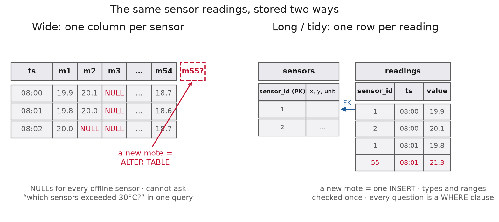
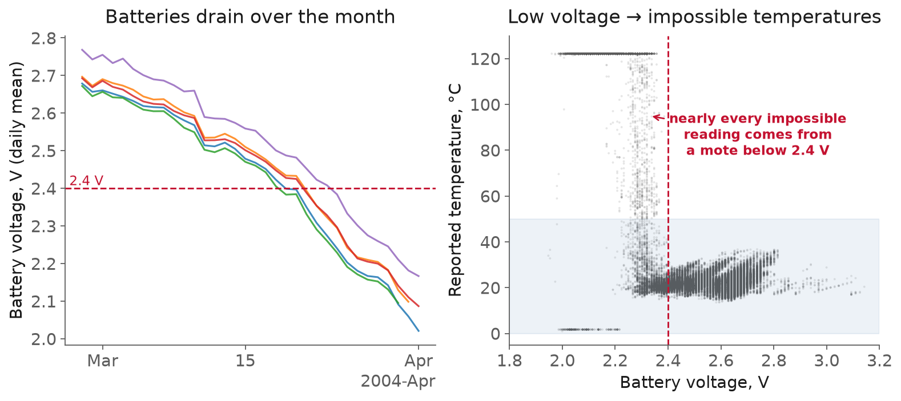
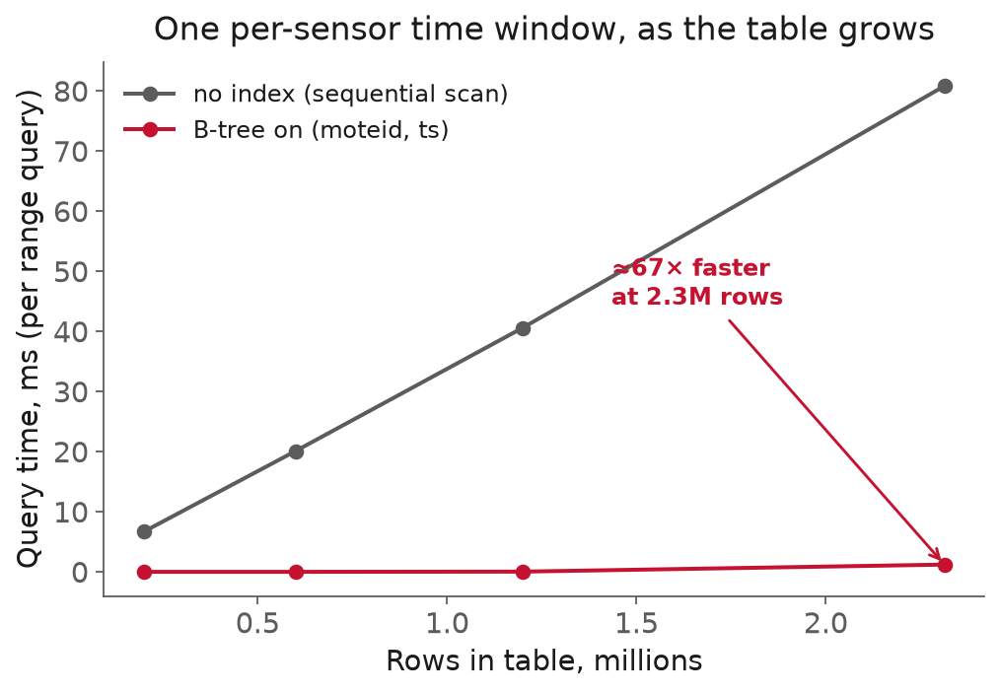

<!-- _class: title -->

# Lecture 3: Relational data & SQL

## Week 2, Data Systems

**Systems and Toolchains for AI Engineers**

---

## Roadmap

1. Why a database, not a spreadsheet
2. The relational model: long beats wide
3. Types that carry physical meaning
4. SQL that answers engineering questions
5. Loading, indexes, and `EXPLAIN ANALYZE`
6. Live demo: a month of sensor data

<!-- 110 min. Budget: 15 / 20 / 20 / 20 / 15 / 20 demo, ~ leave slack.
     Dataset is the Intel Berkeley Lab motes, ~2.3M readings. The demo is
     the payoff; if running long, cut the numeric-vs-double slide, not the demo.

     Six clicker questions, one at the end of each section. Each is a minute of
     voting plus whatever the discussion costs, so budget 12 to 15 minutes for
     the set. They come out of the section they close, not out of the demo.

     The two to protect are PARTITION BY and the index column order: both are
     mistakes students make in Assignment 2, and both fail quietly. If time is
     short, drop the first question (the wide table) and the last (OLTP), which
     are the two the room is most likely to walk in already knowing. -->

---

<!-- _class: section -->

# Why a database

---

## Why a database

- Which sensor ran hottest last Tuesday?
- How many readings did node 12 drop overnight?
- What was the hourly average across the floor?

The arithmetic is trivial.
The **shape of the data** is the hard part.

---

## Why a database, the obvious shape: one column per sensor

| ts | m1 | m2 | m3 | … | m54 |
|---|---|---|---|---|---|
| 08:00 | 19.9 | 20.1 | NULL | … | 18.7 |

Looks tidy with four sensors.
Falls apart on a real deployment.

---

## Why a database, why wide falls apart

- New node → **add a column** → every query breaks
- Node offline → column of blanks (offline? or zero?)
- *"Which sensors exceeded 30°C?"* → **no answer**

You cannot put a `WHERE` clause on a **column name**.

---

## Why a database, the quieter failure

A CSV has no opinion about what belongs in a cell.

This week's data: **2.3M** readings, 54 motes,
Intel Berkeley Lab, February to April 2004.

Hiding in it: temperatures of **122°C** and **386°C**,
in the same column as the honest 19°C ones.

Nothing marks them impossible.

[Intel Lab Data](https://db.csail.mit.edu/labdata/labdata.html)

---

## Why a database, a schema is a contract

A database lets you state, once and **enforceably**:

- this column is a timestamp **with a time zone**
- this one is a number
- this `sensor_id` **must** refer to a sensor that exists

A contract you can query turns a pile of numbers
into something you can **answer questions from and defend**.

---
## Why a database, a question

<div class="clicker" data-tag="l03-wide-columns" data-seconds="45" data-answer="B" data-hint="Three of these name a single mote. Look hard at the one that does not." data-why="B. A, C and D each name one column, so each is a filter or an aggregate on that column. B has to range over 54 column names, and SQL filters rows, never names. In long format it is one WHERE value > 30." data-read="https://clicker.f26-06763.workers.dev">
<div class="clicker-main">

**You kept the wide table, one column per mote, m1 through m54. Which question can you *not* answer with a `WHERE` clause?**

<ol class="clicker-opts">
<li>What was mote 12's average temperature on 3 March?</li>
<li>Which motes ever exceeded 30&deg;C?</li>
<li>How many rows have no value for mote 12?</li>
<li>What was the highest reading mote 7 ever produced?</li>
</ol>

</div>
<aside class="clicker-panel">

<div class="clicker-url">clicker.f26-06763.workers.dev</div>
<button class="clicker-start">Start voting</button>
<div class="clicker-timer">45</div>
<div class="clicker-count">no votes yet</div>
</aside>
</div>

<!--
Closes the wide-versus-long argument by making them use it rather than nod at it.

Expect B to win but not by much. The common wrong answer is C, from students who
read NULL as unanswerable rather than as an ordinary IS NULL test.

If the room lands in the middle band, ask a defender of C to say the query out loud.
It takes about ten seconds to write, which settles it.
-->

---


<!-- _class: section -->

# The relational model

---

## The relational model

<div class="definition">

**Long format**: one row per (entity, time, quantity) measurement, rather than one column per sensor.

</div>

<div class="definition">

**Primary key**: a column, or a small set, whose value uniquely identifies a row, so there is exactly one row per key.

</div>

**Keys**

- *Primary key*: uniquely identifies a row `(sensor_id, ts, …)`
- *Foreign key*: must match a key elsewhere

A reading for sensor 5 **cannot exist** unless sensor 5 does.
Enforced on every insert.

---

## The relational model, integrity, enforced for you

```sql
INSERT INTO readings VALUES (999, now(), 'temperature', 21.0);
-- ERROR: violates foreign key constraint "readings_sensor_id_fkey"
```

<div class="definition">

**Foreign key**: a column whose value must already exist in another table, so a reading cannot name a mote that does not exist.

</div>

A mote that isn't in `sensors` is rejected, not silently stored.
And `(sensor_id, ts, variable)` as the primary key means
the **same reading twice** is a duplicate the database refuses.

---

## The relational model, normalization

<div class="definition">

**Normalization**: storing each fact once, in the place it belongs, and referring to it by key everywhere else.

</div>


- Location & unit don't change per reading → `sensors` table
- Readings carry only a `sensor_id` pointer

Fix a calibration in **one row**, not two million.

---



---

## The relational model, the long form, in SQL

```sql
CREATE TABLE sensors (             -- static per-mote metadata
    sensor_id int PRIMARY KEY,
    x_m double precision, y_m double precision
);
CREATE TABLE readings (            -- one row per (mote, time, quantity)
    sensor_id int NOT NULL REFERENCES sensors (sensor_id),
    ts        timestamptz NOT NULL,
    variable  text NOT NULL,       -- 'temperature', 'voltage', …
    value     double precision,
    PRIMARY KEY (sensor_id, ts, variable)
);
```

Units and plausible ranges live in a small `variables` table.

---

## The relational model, tidy vs typed

| Fully tidy | Typed columns |
|---|---|
| `variable, value` | `temperature`, `humidity`, … |
| new channel = new **rows** | new channel = **ALTER TABLE** |
| one type for all | a type per channel |

Both beat wide. Pick deliberately; justify it in Assignment 2.

---

## The relational model, the pitfall to resist

Column names should never be **entities**
(sensor ids, machine ids, run numbers).

> A column is a **kind** of thing you measure,
> never a **particular** thing you measured it from.

Entities go in **rows**.

<!-- This is THE recurring mistake. Worth 90 seconds and a show of hands. -->

---
## The relational model, a question

<div class="clicker" data-tag="l03-primary-key" data-seconds="45" data-answer="B" data-hint="Write out the two rows one mote produces on a single tick, and compare them column by column." data-why="B. The key is the pair, so a second row with the same mote and the same instant is a duplicate whatever sits in variable. That is why the schema keys on (sensor_id, ts, variable). C is the mirror-image misreading: the key constrains the pair, so two different motes at the same instant are fine." data-read="https://clicker.f26-06763.workers.dev">
<div class="clicker-main">

**A classmate declares `PRIMARY KEY (sensor_id, ts)` on `readings`. Every mote reports temperature *and* humidity on the same 31-second tick. What happens?**

<ol class="clicker-opts">
<li>Nothing, the key is fine</li>
<li>Humidity is rejected, because temperature already claimed that (mote, instant)</li>
<li>Two motes can no longer report at the same instant</li>
<li>Inserts slow down as the table grows</li>
</ol>

</div>
<aside class="clicker-panel">

<div class="clicker-url">clicker.f26-06763.workers.dev</div>
<button class="clicker-start">Start voting</button>
<div class="clicker-timer">45</div>
<div class="clicker-count">no votes yet</div>
</aside>
</div>

<!--
Tests whether a composite key is understood as a constraint on the TUPLE rather
than on each column.

C is the productive wrong answer, and it is worth drawing out: a student who picks it
believes a key constrains its columns one at a time. Ask them which existing row
collides, and the tuple falls out of the answer.

Point back at the CREATE TABLE on the schema slide once the vote is in.
-->

---


<!-- _class: section -->

# Types that carry meaning

---

## Types that carry meaning

<div class="definition">

**timestamptz**: an instant in time stored in UTC, so it means the same thing wherever it is read.

</div>

`timestamp` = wall clock, no zone → **ambiguous**
`timestamptz` = an instant, stored UTC → **well defined**

`2004-03-14 02:30:00` on a clock-change night
happened twice, or never.

**Store instants in UTC. Always.**

[PostgreSQL: date/time types](https://www.postgresql.org/docs/current/datatype-datetime.html)

---

## Types that carry meaning, the leap second of 2012

Case: the leap second of **30 June 2012**

- Last minute of the day ran to `23:59:60`
- A Linux kernel bug → servers spun at **100% CPU**

---

## Types that carry meaning, who fell over and who didn't

Reddit, LinkedIn, Mozilla, Yelp, Foursquare, StumbleUpon

**Amadeus Altea** reservation system offline ~1 hour
→ Qantas & Virgin Australia checked in passengers **by hand**

[The Register, 2 Jul 2012](https://www.theregister.com/2012/07/02/leap_second_crashes_airlines/)

Google saw it coming: spread the extra second across
many tiny clock adjustments. A **"leap smear."**

Lesson at every scale:

> Calendar arithmetic is full of edge cases.
> Don't be the one reimplementing it.

Store UTC, use `timestamptz`, let tested code do the math.

---

## Types that carry meaning, `numeric` vs `double precision`

| `double precision` | `numeric` |
|---|---|
| 64-bit float, inexact | exact decimal |
| fast, compact | slow, large |
| **sensor values** | money, exact calibration |

Measurement uncertainty ≫ float error.
`double precision` is the right **default** for physical data.

[PostgreSQL: numeric types](https://www.postgresql.org/docs/current/datatype-numeric.html)

---

## Types that carry meaning, `interval`: a real duration

`ts - lag(ts)` yields an **`interval`**, not a bare number.

Compare it straight to `'1 hour'` or `'31 seconds'`.
No juggling epoch seconds by hand.

---

## Types that carry meaning, a typed column is not a validated one

<div class="definition">

**Type versus constraint**: a type says what shape a value has; a CHECK constraint says which values are allowed. Only the second one knows the instrument.

</div>

`double precision` accepts **386°C** as happily as 19.

386 is a perfectly good float.

You need a `CHECK` constraint or a range filter,
and a threshold that knows the instrument.

---

## Types that carry meaning, push the check into the schema

```sql
ALTER TABLE readings ADD CONSTRAINT plausible_value
  CHECK (value BETWEEN -50 AND 500);
```

A `CHECK` makes the database **refuse** the bad row on write.
Set the bound from the instrument, not from hope.

---



---

## Types that carry meaning, voltage is a data-quality signal

- Batteries drain past **~2.4 V** over the month
- Below that, the temperature channel **lies**
- ~18% of temps are impossible (outside 0 to 50°C)
- **Essentially all** of them: motes already below 2.4 V

The cleaning rule isn't a guess. It's in the data.

---

## Types that carry meaning, so store the context

Units and calibration live in the `sensors` table,
**beside** the values they explain.

> A number without its provenance
> cannot be validated, only believed.

---
## Types that carry meaning, a question

<div class="clicker" data-tag="l03-type-vs-check" data-seconds="45" data-answer="B" data-hint="Three of these are ill-formed. One is well-formed and wrong." data-why="B. 386 is a perfectly good float, so nothing in the type system objects. The other three are all refused: the foreign key rejects mote 999, 2004-02-30 fails as a date, and n/a fails to parse as a float. A type says what shape a value has; only a CHECK knows the instrument." data-read="https://clicker.f26-06763.workers.dev">
<div class="clicker-main">

**Every column is typed properly: `ts timestamptz`, `value double precision`, `sensor_id int REFERENCES sensors`. Which bad row does the database still accept?**

<ol class="clicker-opts">
<li>A reading from mote 999</li>
<li>A temperature of 386&deg;C</li>
<li>A <code>ts</code> of 2004-02-30</li>
<li>A <code>value</code> of 'n/a'</li>
</ol>

</div>
<aside class="clicker-panel">

<div class="clicker-url">clicker.f26-06763.workers.dev</div>
<button class="clicker-start">Start voting</button>
<div class="clicker-timer">45</div>
<div class="clicker-count">no votes yet</div>
</aside>
</div>

<!--
The single most transferable idea in this section, so give it the full window even
if the room is quick.

C is the interesting distractor. Students who have only ever parsed dates in Python
are often unsure whether 30 February is caught, and it is: the date type rejects it
outright.

If they sail through, say the one line that generalizes it: a type constrains the
shape of a value, a constraint constrains its meaning, and only you know the
instrument.
-->

---


<!-- _class: section -->

# SQL for engineering questions

---

## SQL for engineering questions

You describe the **result** you want.
The database decides **how** to compute it.

Same query, different plan as the data grows,
with no rewrite from you. (That's what an index changes.)

---

## SQL for engineering questions, the vocabulary

- `SELECT` the columns
- `FROM` the table, `JOIN` another by key
- `WHERE` keeps rows
- `GROUP BY` combines rows, `HAVING` keeps groups

Almost every sensor question is a short combination of these.

---

## SQL for engineering questions, time bucketing with `date_trunc`

Hourly average temperature per sensor:

```sql
SELECT sensor_id,
       date_trunc('hour', ts) AS hour,
       avg(value)             AS avg_temp
FROM   readings
WHERE  variable = 'temperature'
GROUP  BY sensor_id, hour;
```

`date_trunc` collapses irregular readings into regular buckets.

[PostgreSQL: date/time functions](https://www.postgresql.org/docs/current/functions-datetime.html)

---

## SQL for engineering questions, `HAVING`: filter the groups

Dropped motes = motes with too few readings.

```sql
SELECT sensor_id, count(*) AS n
FROM   readings
WHERE  variable = 'temperature'
GROUP  BY sensor_id
HAVING count(*) < 30000
ORDER  BY n;
```

`WHERE` filters rows; `HAVING` filters aggregates.

---

## SQL for engineering questions, window functions

<div class="definition">

**Window function**: a computation across neighboring rows that does not collapse them, so each row keeps its identity and sees its neighbors.

</div>


Each reading keeps its identity **and** sees its neighbors.

`lag`, `avg(...) OVER (...)`, `rank`, …

The part of SQL that makes time-series tractable.

[PostgreSQL: window functions](https://www.postgresql.org/docs/current/tutorial-window.html)

---

## SQL for engineering questions, `lag`: turn gaps into a column

```sql
SELECT sensor_id, ts,
       ts - lag(ts) OVER (
         PARTITION BY sensor_id ORDER BY ts
       ) AS gap
FROM   readings
WHERE  variable = 'temperature';
```

Motes report ~every 31 s.
Any `gap` ≫ 31 s is a dropout, located in time.

---

## SQL for engineering questions, rolling average, by time not rows

```sql
avg(value) OVER (
    PARTITION BY sensor_id ORDER BY ts
    RANGE BETWEEN INTERVAL '1 hour' PRECEDING
              AND CURRENT ROW
)
```

Sampling is irregular → a **time** frame is the honest one.
PostgreSQL writes it almost as you'd say it.

---
## SQL for engineering questions, a question

<div class="clicker" data-tag="l03-partition-by" data-seconds="60" data-answer="B" data-hint="Sort all 54 motes together by timestamp, then ask which mote the row above yours came from." data-why="B. With no partition the window is the whole table in timestamp order, so 54 motes interleave and the previous row almost never belongs to your mote. The query runs, returns plausible small intervals, and every dropout disappears." data-read="https://clicker.f26-06763.workers.dev">
<div class="clicker-main">

**You compute `ts - lag(ts) OVER (ORDER BY ts)` and forget `PARTITION BY sensor_id`. What comes back?**

<ol class="clicker-opts">
<li>An error, <code>lag</code> requires a partition</li>
<li>Gaps near zero, because each row's predecessor is usually a different mote</li>
<li>The same answer, <code>ORDER BY ts</code> already groups each mote together</li>
<li>NULL in every row</li>
</ol>

</div>
<aside class="clicker-panel">

<div class="clicker-url">clicker.f26-06763.workers.dev</div>
<button class="clicker-start">Start voting</button>
<div class="clicker-timer">60</div>
<div class="clicker-count">no votes yet</div>
</aside>
</div>

<!--
The most expensive bug in the section, because it fails quietly: no error, no
warning, and a column of small plausible intervals with every dropout erased.

Expect a real split between B and C. A student who picks C is thinking of ORDER BY as
a grouping, which is exactly the confusion PARTITION BY exists to resolve.

This one is worth a re-vote after they argue. Then show it live in the demo: run the
lag query with and without the partition and put the two gap columns side by side.
-->

---


## SQL for engineering questions, `WHERE` + `CASE`: flag, don't just drop

```sql
WHERE r.value < 0 OR r.value > 50   -- impossible indoors
```

```sql
CASE WHEN value BETWEEN 0 AND 50
     THEN 'ok' ELSE 'suspect' END
```

Label rather than discard, when that's what you want.

---

## SQL for engineering questions, `JOIN`: attach the context

```sql
SELECT r.sensor_id, s.x_m, s.y_m, avg(r.value)
FROM   readings r
JOIN   sensors  s USING (sensor_id)
WHERE  r.variable = 'temperature'
GROUP  BY r.sensor_id, s.x_m, s.y_m;
```

The reading's value, placed where it was measured.

---

## SQL for engineering questions, aggregates summarize a sensor

```sql
SELECT sensor_id,
       count(*), min(value), max(value),
       avg(value), stddev(value)
FROM   readings
WHERE  variable = 'temperature'
GROUP  BY sensor_id;
```

`DISTINCT` when you want the set, not the count:
`SELECT DISTINCT sensor_id FROM readings;`

---

<!-- _class: section -->

# Loading, indexes, query cost

---

## Loading, indexes, query cost

<div class="definition">

**`COPY`**: PostgreSQL's bulk loader, one file into a table in a single operation, orders of magnitude faster than a loop of `INSERT`s.

</div>

2M single-row `INSERT`s = 2M round trips = an afternoon.

**`COPY`** streams a whole file in one operation:

```sql
COPY readings (sensor_id, ts, variable, value)
FROM '/data/readings.csv'
WITH (FORMAT csv, HEADER true);
```

Orders of magnitude faster.

[PostgreSQL: COPY](https://www.postgresql.org/docs/current/sql-copy.html)

---

## Loading, indexes, query cost, the paths from Python

- **`psql`**: interactive client, `\copy` from the client side
- **[`psycopg`](https://www.psycopg.org/psycopg3/docs/)**: direct driver, `cursor.copy()`
- **[SQLAlchemy](https://www.sqlalchemy.org/)**: portable layer, pairs with pandas

---

## Loading, indexes, query cost, real data resists the loader

This file has:

- truncated rows (a few fields only)
- sub-second timestamps
- mote ids **outside** 1 to 54 (corrupt id field)

**Staging table** pattern: `COPY` raw → clean with SQL → insert.
Cleaning rules become **queries**, and the FK catches the rest.

---

## Loading, indexes, query cost, the dominant query: a range scan

One sensor, one window of time.

Naively: read **every row**, discard misses.
A **sequential scan** costs the whole table
even for a 100-row answer.

---

## Loading, indexes, query cost, the B-tree index

<div class="definition">

**B-tree index**: an ordered structure that keeps keys sorted, so a range lookup is a descent plus a walk and its cost tracks the result size, not the table size.

</div>


For per-sensor time ranges:

```sql
CREATE INDEX ON readings (sensor_id, ts);
```

Composite, **in that order**: cluster by sensor, sort by time.

---



<span class="source">One sensor, one-hour window, as the table grows to 2.3M rows. ~67× at full size. Measured in SQLite (B-trees, like Postgres).</span>

---
## Loading, indexes, query cost, a question

<div class="clicker" data-tag="l03-index-order" data-seconds="60" data-answer="C" data-hint="The index is a phone book. Which of these looks somebody up without knowing the surname?" data-why="C. A composite B-tree is sorted by its first column first, so a query that does not constrain sensor_id has nowhere to start its descent and the planner falls back to a scan. Reverse the column order in the index and C becomes the fast one while B becomes the slow one." data-read="https://clicker.f26-06763.workers.dev">
<div class="clicker-main">

**You created `CREATE INDEX ON readings (sensor_id, ts)`. Which `WHERE` clause does it fail to help?**

<ol class="clicker-opts">
<li><code>sensor_id = 5 AND ts BETWEEN $1 AND $2</code></li>
<li><code>sensor_id = 5</code></li>
<li><code>ts BETWEEN $1 AND $2</code>, every mote</li>
<li><code>sensor_id IN (5, 12) AND ts &gt; $1</code></li>
</ol>

</div>
<aside class="clicker-panel">

<div class="clicker-url">clicker.f26-06763.workers.dev</div>
<button class="clicker-start">Start voting</button>
<div class="clicker-timer">60</div>
<div class="clicker-count">no votes yet</div>
</aside>
</div>

<!--
Column order in a composite index, which is the one thing about indexes that a
practitioner gets wrong repeatedly.

The phone-book analogy in the hint is the whole explanation, so hold it back unless
they need it.

Good bridge into EXPLAIN ANALYZE: the answer to 'which query does this index help' is
something you confirm rather than reason about, and the demo runs exactly this
comparison.
-->

---


## Loading, indexes, query cost, `EXPLAIN ANALYZE`: read two things

<div class="definition">

**`EXPLAIN ANALYZE`**: runs the query and prints the plan the database actually chose, annotated with real timings.

</div>

Run the query; print the real plan and timings.

1. The **scan at the base**, the strategy
   (`Seq Scan` vs `Index Only Scan`)
2. The **total execution time** at the bottom

```sql
EXPLAIN ANALYZE
SELECT count(*) FROM readings
WHERE sensor_id = 5
  AND ts BETWEEN '2004-03-15' AND '2004-03-16';
```

[PostgreSQL: using EXPLAIN](https://www.postgresql.org/docs/current/using-explain.html)

---

## Loading, indexes, query cost, reading the plan

Before the index (9.1M rows):

```text
Aggregate
  -> Gather  (Workers Planned: 2)
       -> Parallel Seq Scan on readings
            Filter: (sensor_id = 5 AND ts BETWEEN ...)
Execution Time: ~190 ms
```

After `CREATE INDEX ... (sensor_id, ts)`:

```text
Aggregate
  -> Index Only Scan using readings_sensor_ts
Execution Time: ~0.04 ms
```

---

## Loading, indexes, query cost, indexes are not free

- Each one costs **space**
- Each one slows every **write** (maintained on insert)
- An index the planner never uses is pure overhead

Index the access patterns you **have**;
confirm with `EXPLAIN ANALYZE`.

[PostgreSQL: indexes](https://www.postgresql.org/docs/current/indexes.html)

---

## Loading, indexes, query cost, when time-access dominates: hypertables

**[TimescaleDB](https://docs.timescale.com/use-timescale/latest/hypertables/)** auto-partitions a table into
time **chunks**.

- Query last week → touch only last week's chunks
- Compress or drop old data a chunk at a time

Same SQL, same relational model, tuned for time-series.

---

## Loading, indexes, query cost, today's database is OLTP

Optimized for **many correct writes** and **point/range reads**:
transactions, joins, constraints, one row at a time.

<div class="definition">

**Row store**: PostgreSQL keeps all of a row's columns together on disk, ideal for whole rows, poor for scanning one column across the whole table.

</div>

Scanning three columns across ten years is a **different** job.

That's **OLAP**, and it wants a different store.

---
## Loading, indexes, query cost, a question

<div class="clicker" data-tag="l03-oltp-olap" data-seconds="45" data-answer="C" data-hint="Which one reads a lot of rows and very few columns?" data-why="C. A is the range scan the index was built for, and B and D are what an OLTP store is tuned for, transactions and constraints on the write path. C touches every row but only three of its columns, so a row store reads the full width of the table to answer it." data-read="https://clicker.f26-06763.workers.dev">
<div class="clicker-main">

**PostgreSQL, with the B-tree on `(sensor_id, ts)`. Which job is it worst at?**

<ol class="clicker-opts">
<li>Mote 5's readings for last Tuesday</li>
<li>Accepting 200 readings a second with the foreign key checked on each</li>
<li>Averaging three columns over all 2.3M rows, redrawn ten times a day for a dashboard</li>
<li>Refusing a reading from a mote that does not exist</li>
</ol>

</div>
<aside class="clicker-panel">

<div class="clicker-url">clicker.f26-06763.workers.dev</div>
<button class="clicker-start">Start voting</button>
<div class="clicker-timer">45</div>
<div class="clicker-count">no votes yet</div>
</aside>
</div>

<!--
The closer, and the one that earns the OLTP slide they just saw.

Everything on the list is something PostgreSQL will do. The question is which one it
does badly, which is the shape of the answer they need for the rest of the course.

Keep this one short, five minutes at most, because the demo is what matters next.
-->

---


<!-- _class: demo -->

# Demo

## `l03-sql-timeseries.ipynb`

PostgreSQL in Docker → schema → `COPY` 2.3M rows
→ answer engineering questions live

---

## What to watch

- `date_trunc` hourly averages
- windowed `lag` for dropouts, rolling voltage
- the impossible temps low voltage predicts
- **`EXPLAIN ANALYZE` before vs after the index**

Watch the top node flip: `Seq Scan` → `Index Only Scan`.

---

## Recap

- Long form: new sensor = `INSERT`, every question = `WHERE`
- Types with meaning: `timestamptz` UTC, `double precision`
- A type is **not** a validation (386°C)
- `date_trunc` + window functions answer time-series
- B-tree on `(sensor_id, ts)`; confirm with `EXPLAIN ANALYZE`

---

## Standings

Nicknames only. Everyone who skipped one still counted in every bar you saw.

<div class="clicker-leaderboard"
     data-read="https://clicker.f26-06763.workers.dev"
     data-top="8"
     data-hours="6"
     data-title="Standings"></div>

---

## Next

**Assignment 2** released today, due ~1 week
**Reading** PostgreSQL window functions; Kleppmann Ch. 3

Full notes, with all sources: `lectures/l03/notes.md`

<script src="clicker-slide.js"></script>
