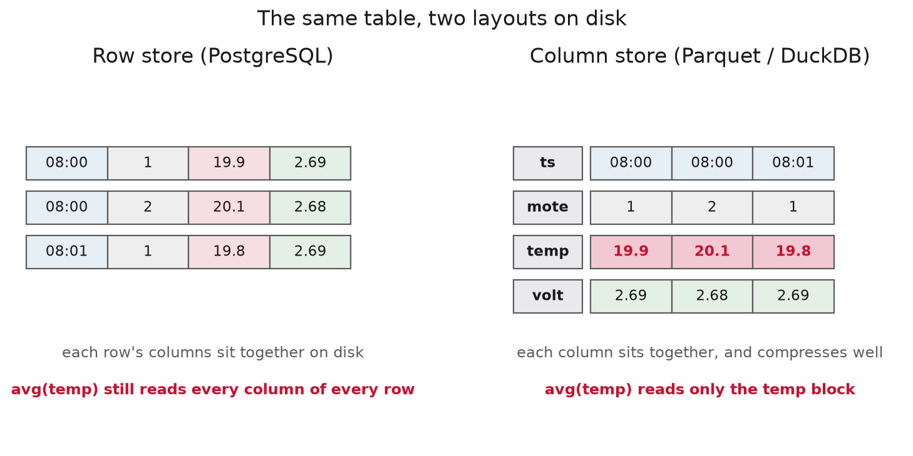
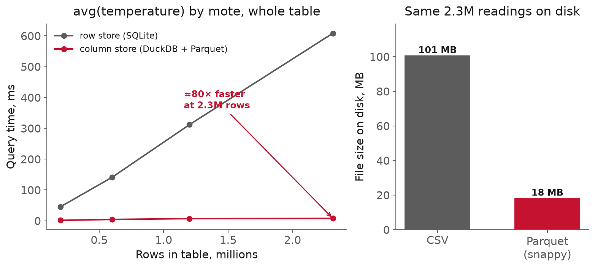

<!-- _class: title -->

# Lecture 4: Columnar storage, Parquet, DuckDB

## Week 2, Data Systems

**Systems and Toolchains for AI Engineers**

---

## Roadmap

1. Why columns
2. Row stores and column stores
3. Parquet
4. DuckDB
5. The wider landscape
6. Where columns stop helping
7. Live demo: the same data, columnar

---

<!-- _class: section -->

# Why columns

## the query the index could not help

---

## Why columns

Lecture 3 left the Intel Lab readings in PostgreSQL, indexed on `(sensor_id, ts)`.

- one sensor, one hour → a few hundredths of a ms
- that is the dashboard query, and the row store is superb at it

---

## Why columns, the analyst's question

- average temperature of **every** mote, **all** month
- daily energy across the floor, **all** year
- distribution of one channel over **all** history

Nothing to narrow. The index has nothing to prune, so the database reads the whole table.

---

## Why columns, the row store reads everything

In a **row store**, reading every row means reading every column.

- `readings` has six columns; to average one, it drags all six off disk
- for all **2.3M** rows, then throws almost all of it away
- cost grows with the **width** and **height** of the table

The answer, an average of one column, depends on neither.

---

## Why columns, the fix is the layout

Store each **column** together instead of each **row**.

Then `avg(temperature)` reads only the temperature values, in one run, already compressed.

Same data, different bytes. Measured today: **~80× faster, ~5× smaller.**

---

<!-- _class: section -->

# Row stores and column stores

---

## Row stores and column stores

- **Row store**: keeps the values of each row together on disk, one whole row after another.

<div class="definition">

**Column store**: keeps the values of each column together on disk, every row's value for one column in a run.

</div>

Same logical table. Different values sit next to each other.

---



---

## Row stores and column stores, OLTP and OLAP

- **OLTP**: online transaction processing, many small operations that insert, update, or fetch whole rows by key.

<div class="definition">

**OLAP**: online analytical processing, scanning a few columns across many rows to compute an aggregate or trend.

</div>

The question is which workload this is. A serious platform runs both.

---

## Row stores and column stores, OLTP vs OLAP

| OLTP (row store) | OLAP (column store) |
|---|---|
| small reads/writes of whole rows | scan few columns over many rows |
| insert, update, fetch by key | aggregate, trend, report |
| PostgreSQL (Lecture 3) | Parquet + DuckDB (today) |

---

## Row stores and column stores, the query

```sql
SELECT mote_id, avg(temperature)
FROM readings
GROUP BY mote_id;
```

One column, aggregated over every row. The whole session is about making this cheap.

---

## Row stores and column stores, the wins

<div class="definition">

**Column projection**: reads only the columns a query names, so cost scales with columns asked for, not table width.

</div>

- **Compression**: a column holds one type of similar values (a temperature near the last, a mote id repeated thousands of times), which shrinks far harder than a row's mixed bytes.

---

## Row stores and column stores, predicate pushdown

- **Predicate pushdown**: each block carries its min and max, so a block whose range cannot match your `WHERE` is skipped without being read.

The three wins compound. Smaller data is also less to read.

---

## Row stores and column stores, when to use which

Columns win the wide analytical scan:

- aggregate one channel across all history
- scan a few columns of a very wide table
- compress cold data you rarely rewrite

Rows win the point write and lookup: one whole row, or one update, touches every column block.

A column store complements the Lecture 3 row store; each handles the workload the other is slow at.

---

<!-- _class: section -->

# Parquet

## the columnar file

---

<!-- _class: definition -->

## Parquet

**Parquet** is the standard on-disk file format for a column store: a self-contained file, not a server, that any tool can read.

---

## Parquet, inside the file

- **Row group**: a horizontal slice of the rows, a few hundred thousand at a time.
- **Column chunk**: one column's values within a row group, encoded and compressed on its own.

A **footer** written last carries the schema and per-column min/max, so the file needs no external definition and a reader can skip row groups that cannot match a filter.

---

## Parquet, compression and encoding

Measured on the Intel Lab readings:

**101 MB CSV → 18 MB Parquet.** About 5× smaller, which is also less data to read from disk.

Per column, Parquet applies **dictionary** encoding for repeated values and **run-length** encoding for runs, then compresses on top. A mote id repeated thousands of times nearly vanishes.

[Apache Parquet, file format](https://parquet.apache.org/docs/file-format/)

---

## Parquet, partitioning

- **Partition pruning**: a directory tree encodes a column's value in folder names, so a filtered query opens only the matching folders.

```text
readings/date=2004-03-01/part.parquet
readings/date=2004-03-02/part.parquet
```

Partition on what you filter by; keep partitions from getting tiny.

---

## Parquet, writing it

```python
df.to_parquet("readings.parquet", compression="snappy")
```

From pandas or PyArrow. Read it back the same way.

---

## Parquet, a file not a database

- no indexes you build
- no transactions
- no in-place update: rewrite the file, or write new files

Great for batch analytics. Point-updated data belongs in the row store.

---

<!-- _class: section -->

# DuckDB

## SQL analytics in your process

---

<!-- _class: definition -->

## DuckDB

**DuckDB** is an in-process OLAP SQL engine that runs inside your program, with no server to start and no connection to manage. Roughly: SQLite, but for analytics.

`import duckdb` and you are querying. [Why DuckDB](https://duckdb.org/why_duckdb)

---

## DuckDB, queries Parquet directly

```sql
SELECT mote_id, avg(temperature)
FROM 'readings/*.parquet'
GROUP BY mote_id;
```

No `CREATE TABLE`, no load. It reads the files where they sit, with projection and row-group skipping.

[DuckDB: reading Parquet](https://duckdb.org/docs/stable/data/parquet/overview)

---

## DuckDB, prunes partitions

```sql
FROM read_parquet('readings/**/*.parquet', hive_partitioning = true)
WHERE date = '2004-03-01'
```

The folder name becomes a column; the filter opens one folder.

---

## DuckDB, write results back

```sql
COPY (SELECT mote_id, avg(temperature) AS avg_temp
      FROM 'readings/*.parquet' GROUP BY mote_id)
TO 'mote_avg.parquet' (FORMAT parquet);
```

Query in, Parquet out. DuckDB can also read a pandas dataframe in place and hand results back as one.

---



---

## DuckDB, read the figure

- row store: cost **climbs with the table** (reads everything)
- columnar: **nearly flat** (reads 2 columns of 6, vectorized)
- and the file is several times smaller

`≈80×` on the whole-table aggregate at 2.3M rows.

---

## DuckDB, which tool

| Tool | Reach for it when |
|---|---|
| pandas | it fits in memory, you want Python |
| DuckDB | bigger than memory, SQL, query files/DBs in place |
| PostgreSQL | live writes, transactions, many clients |

They interoperate. The choice is rarely exclusive.

---

<!-- _class: section -->

# The wider landscape

## not everything is a table

---

## The wider landscape, the other stores

Recognize these; you will not build them here. Each drops a relational guarantee (the schema, the joins, or the transactions) for a fit to one access pattern.

- **Document store** (MongoDB): flexible, JSON-like records, fields vary per record. For irregular experiment metadata, not uniform readings.
- **Key-value store** (Redis): a value under a key, often in memory. For caches and hot lookups, not queries.
- **Time-series database** (InfluxDB): high-rate timestamped writes, bucketing built in.

Reach for one because your access pattern demands it, not to dodge a schema.

[MongoDB](https://www.mongodb.com/resources/basics/databases/document-databases) · [Redis](https://redis.io/about/) · [InfluxDB](https://docs.influxdata.com/influxdb/v2/get-started/)

---

<!-- _class: section -->

# Where columns stop helping

---

## Where columns stop helping, writes and lookups

Parquet is effectively **immutable**: add data = write new files, change a row = rewrite its file.

Columns are fast for "average this one column" and **slow** for "give me this whole row," which gathers from every column block.

Constantly-corrected data and point lookups are the row store's home turf.

---

## Where columns stop helping, DuckDB is an engine

One process. Superb for one analyst, one pipeline.

It is not a shared backend that many clients write to concurrently with transactions. That is still PostgreSQL's job; DuckDB complements it rather than replacing it.

---

## Where columns stop helping, size and composition

- the 80× shows at millions of rows; at in-memory sizes, a pandas `groupby` is simpler and fast enough
- real platforms run **both**: Postgres takes live writes, Parquet + DuckDB scan history, and you move data across the seam
- reach for a document, key-value, or time-series store because your **access pattern** demands it, not to dodge designing a schema

---

<!-- _class: demo -->

# Demo

## `l04-storage.ipynb`

Intel Lab data → Parquet → the same query in pandas, a SQLite row store, and DuckDB. Then zero-import queries straight over the Parquet files.

---

## What to watch

1. The analytical scan: the row store **climbs**, DuckDB over Parquet stays **flat**.

2. DuckDB answering a query over Parquet it **never loaded**.

---

## Recap

- Layout should match the access pattern
- Row store / OLTP for writes and point reads (Lecture 3)
- Column store / OLAP for wide scans: Parquet + DuckDB
- Measured: `≈80×` faster, `≈5×` smaller on the scan
- DuckDB queries files and databases with zero import
- Document, key-value, time-series: each fits one pattern

---

## Next

**Assignment 2** released today: PostgreSQL (Lecture 3) + Parquet/DuckDB (today)
