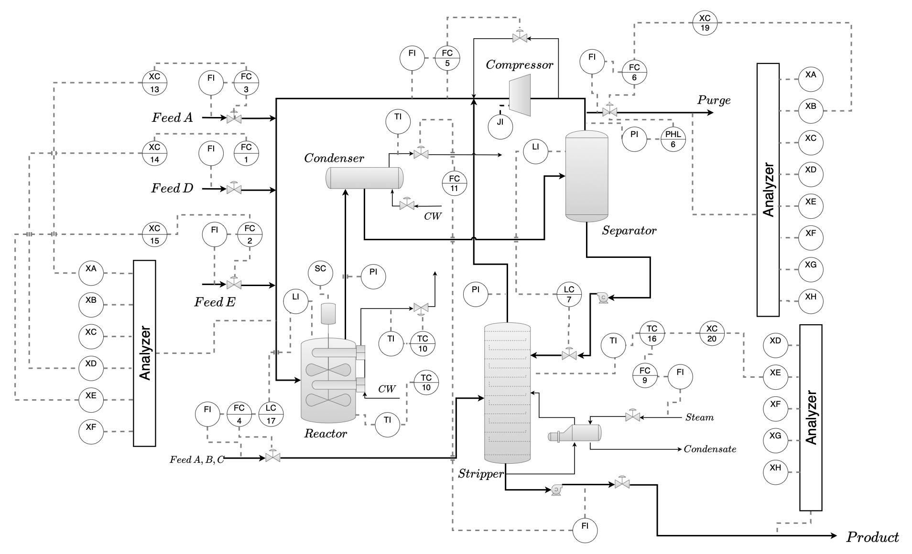
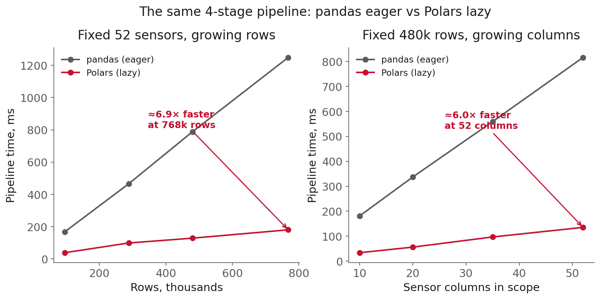

<!-- _class: title -->

# Lecture 5: Dataframes and batch pipelines

## Week 3, Data Systems

**Systems and Toolchains for AI Engineers**

---

## Roadmap

1. Why dataframes and pipelines
2. Your SQL habits, typed differently
3. Getting DuckDB's trick without DuckDB
4. Making it safe to rerun
5. Where this pushes back
6. Live demo: the same pipeline, two ways

---

<!-- _class: section -->

# Why dataframes and pipelines

## from a raw sensor log to one row per fault

---

## Why dataframes and pipelines

Lecture 3 gave you SQL: describe the result, the planner works out how. Lecture 4 gave you a faster layout for that same idea, still inside a database.

This session moves both ideas into your own Python code, because cleaning and reshaping this data needs logic SQL does not comfortably express.

---

## Why dataframes and pipelines, a plant's log

The Tennessee Eastman process: a simulated chemical plant.

- 52 measurements (reactor, separator, stripper, feeds, cooling water)
- sampled every 3 minutes, across hundreds of runs
- millions of rows before anyone asks a question

The question: the average sensor **signature of each fault**.

[Tennessee Eastman data, CC0](https://doi.org/10.7910/DVN/6C3JR1) · [Downs and Vogel, 1993](https://doi.org/10.1016/0098-1354(93)80018-I)

<!--
speaker: TEP is a Downs and Vogel 1993 benchmark, a real Eastman plant disguised. faultNumber 0 is normal, 1 to 20 are disturbances. Turning the raw log into per-fault means is a pipeline: load, clean, reshape, aggregate.
-->

---



<span class="source">Reactor, condenser, compressor, separator, stripper: the plant behind this session's 52 columns. Lyu, Botcha, Kulkarni, Pagaria, Alves, Sunshine, and Kitchin (2026). Run it yourself: <a href="https://kitchingroup.cheme.cmu.edu/tep-rust/studio/">TEP Studio</a></span>

---

## Why dataframes and pipelines, the two things you lose

Write the cleanup logic as one long script, and a database's guarantees go with it:

- **slow**: a Python loop is about **100x** slower than a whole-column operation
- **unsafe**: dies halfway through, and there is no record of what it finished

**Polars** gets the speed back. **Small, restartable stages** get the safety back.

---

<!-- _class: section -->

# Your SQL habits, typed differently

---

## Your SQL habits, typed differently

You have been handling a dataframe since Lecture 3's `read_sql` and Lecture 4's `.df()`.

Two moves carry over from Lecture 3. The `GROUP BY`, the `JOIN`, and the long-vs-wide argument: same ideas, dataframe syntax.

```python
readings.group_by("faultNumber").agg(pl.col("^xmeas_.*$").mean())  # every measured column
```

- **group-by / join**: a method chain instead of a clause
- **long / wide**: one operation apart, where Lecture 3 made it a permanent schema choice; `pivot`/`melt` convert

[pandas, group by](https://pandas.pydata.org/docs/user_guide/groupby.html) · [pandas, reshaping](https://pandas.pydata.org/docs/user_guide/reshaping.html)

---

## Your SQL habits, typed differently, vectorization

The third one is new. SQL never let you handle rows one at a time; you described the result and the database walked the rows. Python will let you write the loop.

<div class="definition">

**Vectorization**: express a computation on whole columns, so the loop runs once inside compiled code instead of once per element in Python.

</div>

`readings["xmeas_7"] > threshold` checks the reactor-pressure column once. A loop checks it once per row, routinely **100x** slower.

The database enforced this habit for you. In Python it is yours to keep.

---

<!-- _class: section -->

# Getting DuckDB's trick without DuckDB

---

## Getting DuckDB's trick without DuckDB

pandas runs each line the moment you write it, on one core. That is **eager** execution.

<div class="definition">

**Polars**: a table library like pandas, but built to use every core at once. If you ask it to, it will also plan the whole computation before running any of it.

</div>

---

## Getting DuckDB's trick without DuckDB, lazy evaluation

Lecture 3: you describe the result in SQL, the query planner decides the mechanism. Same idea, now in Python.

<div class="definition">

**Lazy evaluation**: writing an instruction does not run it. It adds a step to a plan. Nothing touches the data until `.collect()`, which runs the whole plan in one pass.

</div>

```python
pipeline = (pl.scan_parquet("data/tep.parquet")   # reads nothing yet
            .group_by("faultNumber")
            .agg(pl.col("^xmeas_.*$").mean()))
result = pipeline.collect()                        # optimize, then run
```

---

## Getting DuckDB's trick without DuckDB, the same tricks, no server

You met these in Lecture 4, when DuckDB applied them to Parquet:

- **projection pushdown**: read only the columns you asked for
- **predicate pushdown**: a filter moves into the scan

Because pandas and Polars both lay columns out the same way in memory (**Arrow**, Parquet's in-memory cousin from Lecture 4), converting between them is cheap too: prototype in whichever you know, convert only if it turns out to matter.

[Polars, Lazy API](https://docs.pola.rs/user-guide/lazy/) · [Apache Arrow](https://arrow.apache.org/overview/)

---

<!-- _class: section -->

# Making it safe to rerun

---

## Making it safe to rerun

A pipeline written as one function has no seam: nothing to test, nothing to re-run, on its own. Break it into stages.

<div class="definition">

**Pure stage**: output depends only on its input, and it changes nothing else. Same input, same output.

</div>

load, clean, aggregate: each stage a Parquet file in, a Parquet file out.

---

## Making it safe to rerun, idempotency

Your laptop sleeps mid-write to `tep_clean.parquet`. Now what?

<div class="definition">

**Idempotency**: running a stage twice has the same effect as running it once, so a failed stage can be safely retried.

</div>

If clean is idempotent: rerun it. Same input, same output, whether it died at row 100 or row 100,000.

This is what Lecture 3's transactions gave you for free. You rebuild it by hand once the logic is your own Python.

---

## Making it safe to rerun, the caching trap

- cache a stage's output to Parquet, so expensive early work runs once
- **trap**: a cache keyed only on the stage name is not invalidated when a parameter changes, so a stale result is reused

Name the cache after the inputs that determine it, not just the stage.

---

<!-- _class: section -->

# Where this pushes back

---

## Where this pushes back

- **stricter has a cost**: more of your mistakes become real errors, and lazy moves errors away from the line that caused them
- **a fill value is a choice**: it shapes every number downstream, so decide it deliberately and report how much you filled
- **one machine goes further than you think**: exhaust a laptop with Polars or DuckDB before adding a cluster

---

## Where this pushes back, measure first



A benchmark is one workload on one machine. Measure your own pipeline; do not rewrite on reputation.

---

<!-- _class: demo -->

# Demo

## `l05-pipelines.ipynb`

The Tennessee Eastman readings, one 4-stage pipeline built twice: pandas eager and Polars lazy, then timed.

A labeled cell injects the defects (dropped readings, one stuck sensor) so the cleaning stages have real work.

---

## What to watch

1. pandas materializes a new table after **every** stage.

2. Polars builds a plan and runs it in **one** pass at `.collect()`.

3. Print that plan with `.explain()`: the column selection is folded into the read. Lecture 4's DuckDB trick, no server.

---

## Recap

- Lecture 3 and 4's ideas, now in Python: describe first, structure so failure is safe
- Vectorize first: about **100x**, before any bigger machine
- Polars: every core, plans ahead, no server needed for the trick
- Small, pure, idempotent stages that cache to Parquet
- Measure your own workload before you rewrite it

---

## Next

- **Practice module** for this session (participation credit)
- No assignment is released this session
- **Reading**: Polars Lazy API guide; pandas group-by and reshaping

Full notes, with all sources: `lectures/l05/notes.md`
