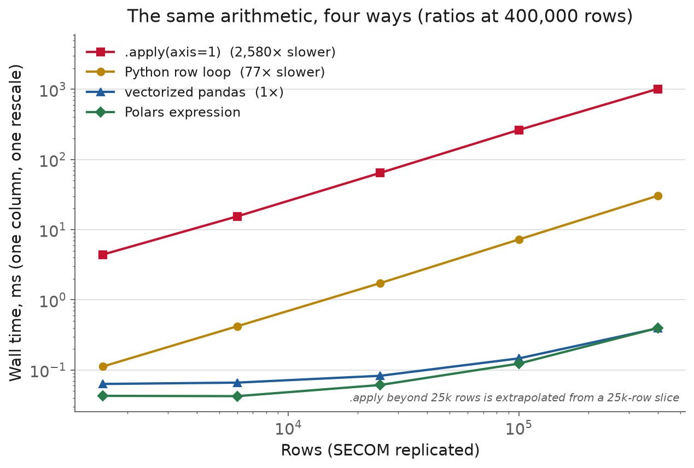
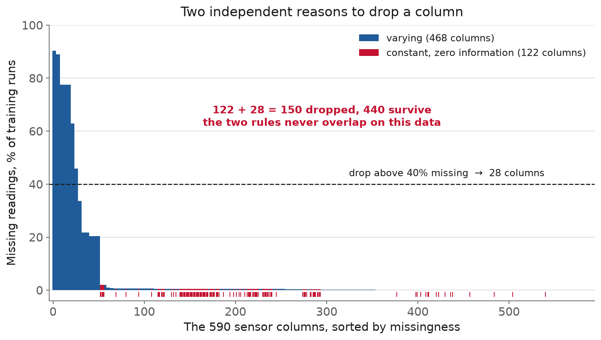
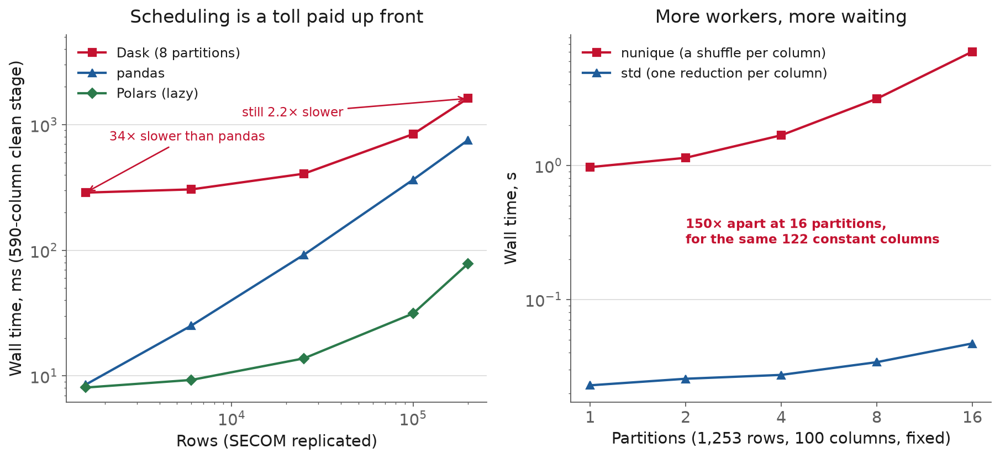

<!-- _class: title -->

# L5 · Dataframes & scalable processing

## Week 3 · Data Systems

**Systems & Toolchains for AI in Engineering**

---

## Roadmap

1. Why this matters: the loop vs. the column
2. Dataframe fundamentals, vectorized
3. Polars and the lazy execution model
4. Designing a batch pipeline
5. Orchestration: when a plain DAG is enough
6. Scaling out: Dask, Spark, and when not to
7. Live demo: one pipeline, three ways

<!-- 110 min. Budget roughly 15 / 15 / 20 / 15 / 10 / 15 / 20 demo.
     SECOM: 1,567 runs x 590 sensors. If running long, cut the
     orchestration section, not the demo. -->

---

<!-- _class: section -->

# Why this matters

---

## The spreadsheet the engineer gets handed

1,567 manufacturing runs. 590 sensor columns.

Somewhere in there: the difference between a wafer
that ships and one that gets scrapped.

```python
for row in data:            # the first working version
    for sensor in row:
        clean(sensor)
```

It runs. It even finishes, on 1,567 rows.

---

## Then the data grows

Next month: 15,670 rows. A second fab line.

The "quick script" goes from 4 seconds to 7 minutes.

Nothing about this is a modeling problem.

---

## It's an architecture problem

A Python loop pays interpreter overhead
**590 times a row, every row.**

The honest description of the work is a handful
of whole-column operations.

---

## Judgment cuts both ways

- Loop instead of vectorizing → too slow, needlessly
- Spark instead of a laptop → too complex, needlessly

SECOM is a few **megabytes**. It fits on a phone.

Same mistake twice: not matching the tool to the data.

---

## Hear it from the source

2013 talk, revisited in a 2017 post by
Wes McKinney, who started pandas in 2008:

**"10 Things I Hate About Pandas"** (there are 11)

[wesmckinney.com/blog/apache-arrow-pandas-internals](https://wesmckinney.com/blog/apache-arrow-pandas-internals/)

<!-- The list is from a Nov 2013 talk; the 2017 post walks it item by item and
     explains what he built instead. Don't say "he published a list in 2017". -->

---

## Three of the eleven, verbatim

- "No support for memory-mapped datasets"
- "'Slow', limited multicore algorithms for large datasets"
- **"Eager evaluation model, no query planning"**

Hold that last one. It's what "lazy" answers.

---

## And the memory number

> you should have **5 to 10 times as much RAM**
> as the size of your dataset

"a dataset that is 5GB on disk take up 20GB
or more in memory."

That post is the design document for **Apache Arrow**.

<!-- The author of the dominant tool wrote down where it strains, then built the
     replacement for its internals. That's why the list is worth reading.
     Blame the BlockManager (2011) and the tight NumPy coupling. -->

---

<!-- _class: section -->

# Dataframe fundamentals
## vectorized

---

## Vectorization

```python
df['temp_c'] = (df['temp_f'] - 32) * 5 / 9
```

Runs as a tight loop over contiguous memory, **in C**.
No per-element Python dispatch.

---

## So we measured it



<!-- 400k rows, one column, one rescale. Walk the four lines bottom to top.
     Ask them to predict where .apply lands BEFORE showing the top line. -->

---

## The numbers, at 400,000 rows

| | vs vectorized |
|---|---|
| vectorized pandas / Polars | 1× |
| Python row loop | **~100× slower** |
| `.apply(axis=1)` | **~3,000× slower** |

590 columns each paying that tax independently, if you loop.

<!-- Exact ratios move ~20% run to run; the plot carries the measured values
     from the last regeneration. Don't defend a specific digit.
     Also point at the bottom two lines: vectorized pandas and a Polars
     expression are nearly identical here. Polars' win is not per-operation
     speed, it's the optimizer, and it needs a bigger query to show. -->

---

## The same idea, twice more

**`groupby`**: "mean reading per run, per shift, per lot"
= one groupby + one aggregate. Don't hand-roll the buckets.

**Joins**: attach calibration or recipe metadata by key.
Same rule as [L3](https://pandas.pydata.org/docs/user_guide/merging.html): a column is a *kind* of measurement,
never a particular sensor or run.

---

## Reshaping: wide ↔ long

SECOM arrives **wide**: one column per sensor.
Right shape for a model. Wrong shape for
"which sensors are most often missing?"

```python
long = wide.melt(id_vars=['run_id', 'label'],
                 var_name='sensor', value_name='reading')
```

Reshape explicitly. Don't keep two copies that drift.
[pandas reshaping docs](https://pandas.pydata.org/docs/user_guide/reshaping.html)

---

## The pitfall: `.apply` isn't vectorized

```python
df.apply(lambda row: row['a'] + row['b'], axis=1)
```

Looks like one line. It is **~30× slower than
writing the loop by hand.**

---

## Why it's worse than the loop

`axis=1` builds a **whole `Series` per row**
just to pass into your function.

Allocate, populate, call, discard. 400,000 times.

Legitimate uses: an external library per row, or
irregular logic with no column expression. Not arithmetic.

<!-- This surprises people every year: the one-line idiom that LOOKS like the
     vectorized style is the slowest thing on the plot. Reach for .apply when
     you've run out of alternatives, not first. -->

---

<!-- _class: section -->

# Polars and the
## lazy execution model

---

## Why a new dataframe library

pandas (2008): NumPy arrays, often boxed objects
for strings/nulls, mostly single-threaded.

Polars: Rust, built on Arrow, **typed columnar
storage, multithreaded by default.**

---

## The key distinction: eager vs. lazy

**Eager** (`pl.read_csv`): every step runs immediately.

**Lazy** (`pl.scan_csv`): you get a plan, a `LazyFrame`.

```python
(pl.scan_parquet("sensors/*.parquet")
   .filter(pl.col("run_id") > 1000)
   .select(["run_id", "sensor_12", "sensor_87"])
   .collect())          # nothing ran until here
```

[docs.pola.rs/user-guide/lazy/using](https://docs.pola.rs/user-guide/lazy/using/)

---

## What the optimizer does with it

**Predicate pushdown**: move `filter` as early as possible,
often into the file reader itself.

**Projection pushdown**: only read the columns
the final `.select()` actually needs.

Not faster at the same computation. Faster because
it computes **less**, having seen the whole query first.

---

## Expressions are what make this possible

```python
pl.col("sensor_12").mean()          # not a value

df.select([pl.col(c).mean() for c in sensor_cols])
```

An **object describing a computation**, which Polars can
inspect, combine, and compile.

590 of them run together, in parallel, **in one pass.**
[Polars expressions](https://docs.pola.rs/user-guide/expressions/)

---

## So how much does lazy actually buy you?

| rows | Polars vs pandas | Dask vs pandas |
|---|---|---|
| 1,567 | ~2× faster | **34× slower** |
| 200,000 | ~7× faster | 2× slower |

Every performance claim here has a **regime**.
"Which is faster" is incomplete until someone says how big.

---

## Where the 2× comes from

- The read: ~40 ms vs pandas' ~75 ms
- The stats: **3 passes → 1 pass**, ≈4× on that portion

pandas asks each column for distinct count, then
missing count, then mean. Three walks over the frame.

---

## The trap: schema inference

```
ComputeError: could not parse `4.1955`
as dtype `i64` at column 'column_75'
```

Polars samples **100 rows**, picks `i64`.
The decimal shows up on row **1,458** of 1,567.

---

## Two fixes, not equally good

| approach | read | outcome |
|---|---|---|
| default (100 rows) | – | **raises** |
| `infer_schema_length=None` | ~110 ms | scans everything |
| `schema_overrides=...` | **~38 ms** | decides nothing |
| pandas, for reference | ~75 ms | silently upcasts |

Declaring beats inferring: 3× faster **and** unsurprisable.

<!-- Then say it out loud, it's the setup for Monday: a declared schema is a
     belief written down, and a belief written down is one you can check.
     That's pandera. -->

---

## Interop: Arrow ≠ Parquet

**Arrow** = in-memory, uncompressed, CPU reads it directly.
**Parquet** = on-disk, compressed, must be decoded.

> "Arrow and Parquet complement each other" ([Arrow FAQ](https://arrow.apache.org/faq/))

So: **Parquet between stages, Arrow within one.**
Polars ↔ pandas ↔ DuckDB share the layout, so crossing
a library boundary is cheap. Pick each stage's tool on merit.

[parquet.apache.org](https://parquet.apache.org/docs/file-format/) · [duckdb.org](https://duckdb.org/)

---

<!-- _class: section -->

# Designing a
## batch pipeline

---

## Four stages

**ingest** → **clean** → **transform** → **persist**

Each one a pure function: typed input, typed output.

Testable and cacheable **one stage at a time**.
Debug stage 3 without rerunning stages 1–2.

---

## What `clean` actually removes



<!-- Ask: how many of the 590 columns do you think survive? Nobody guesses low
     enough. 440. A quarter of the matrix is gone before any modelling. -->

---

## Two independent failure modes

| reason | columns |
|---|---|
| constant, one distinct value | **122** |
| more than 40% missing | **28** |
| overlap | 0 |
| **survive** | **440 of 590** |

A sensor wired up but never varying, and a sensor
that reports intermittently. Different bugs.

---

## Idempotency

Running a stage twice on the same input
produces the **same output, byte for byte.**

- Pin random seeds
- Sort before order-dependent operations

"Same input, same output" is a **correctness**
requirement, not a nicety.

<!-- Sounds minor until you're recovering from a partial failure. If clean is
     idempotent, rerunning after a crash is free. The demo hashes its Parquet
     output twice and compares: cheapest reconciliation check there is. -->

---

## Case: one server out of eight

**Knight Capital Americas, 1 August 2012.**
\$460M lost in ~45 minutes.

~10% of all trading in listed US equities, at the time.

[SEC Release No. 70694](https://www.sec.gov/litigation/admin/2013/34-70694.pdf)

---

## The deployment

New code for **SMARS**, its order router, to support
NYSE's Retail Liquidity Program launching that day.

Staged across **8 servers** from 27 July.
One technician did not copy it to the eighth.

> "Knight did not have a second technician review
> this deployment... Knight had no written
> procedures that required such a review."

---

## Mistake 1: the repurposed flag

The new code reused a flag that used to activate
an old feature, **Power Peg**.

Unused since 2003. Never deleted.
Still "present and callable."

---

## Mistake 2: dead code nobody retested

2005: Knight moved the function counting
already-filled shares to an earlier point.

> "did not retest the Power Peg code after moving
> the cumulative quantity function"

Dead **and** broken, for seven years.

---

## The result

**212** parent orders into the eighth server.

**4 million** executions, **154** stocks,
**397 million** shares, ~45 minutes.

\$3.5B unintended long, \$3.15B short.

---

## The signal that existed

**8:01 a.m.**, 90 minutes before the open:
97 automated emails, "Power Peg disabled."

> "Knight did not design these types of messages
> to be system alerts, and Knight personnel
> generally did not review them."

---

## Three habits, all of them A3

A rollout across 8 machines **is** a batch job whose
"rows" are servers. 7-of-8 looked exactly like 8-of-8.

1. **Reconcile**: count, hash, version read back
2. **Delete dead code**; distrust dormant code
3. **A signal is something or nothing**:
   97 unread emails are worse than zero

<!-- The demo hashes its Parquet twice and compares: habit 1, small version.
     On habit 2: Power Peg was harmless until a flag made it reachable, and code
     nobody calls is code nobody tests. A pipeline stage switched off by config
     is in exactly that category. -->

---

## Caching to Parquet between stages

Rerunning `ingest` + `clean` every time you
iterate on `transform` wastes minutes,
thousands of times over a semester.

Persist each stage. Check the cache before recomputing.

---

<!-- _class: section -->

# Orchestration
## when a plain DAG is enough

---

## Every multi-stage pipeline is a DAG

Steps, dependencies, no step depends on its own output.
The oldest tool that takes this seriously:

```makefile
clean.parquet: ingest.parquet clean.py
	python clean.py ingest.parquet clean.parquet
```

`make` compares timestamps. Reruns only what changed.

<!-- Ten lines per stage buys you incremental caching for free. -->


---

## What Prefect / Dagster add

For one author on one machine, that Makefile is often
**enough.** Correctly sized, not under-powered.

- Automatic retries on transient failure
- A scheduler and a UI: which run failed, why
- Alerting
- Dagster: each output as a lineage-tracked **asset**

Not the graph. **Who can operate it**, and what
happens when a stage fails at 3 a.m.

[Prefect](https://docs.prefect.io/) · [Dagster](https://docs.dagster.io/)

---

<!-- _class: section -->

# Scaling out
## without a cluster

---

## Where this all comes from

**[MapReduce](https://research.google.com/archive/mapreduce-osdi04.pdf)** (Dean & Ghemawat, OSDI 2004):
split into partitions, map each independently, reduce.

The framework handles parallelism and failures.

Its weak spot: wrote intermediate results to disk
between **every** stage. Awkward for anything iterative.

---

## Spark's fix

Zaharia et al., UC Berkeley AMPLab, 2012:
**[Resilient Distributed Datasets](https://www.usenix.org/system/files/conference/nsdi12/nsdi12-final138.pdf).**

Keep intermediate data in memory across stages.

---

## Lineage-based fault tolerance

Record the transformations that produced a partition.

Lost a partition? **Recompute it from lineage**:
durability without copying the data upfront.

---

## Two mechanics that recur everywhere

**Partitioning**: split data into independent chunks.
Choose the key so related rows land together.

**Shuffle**: rows scattered across partitions
have to be gathered, expensive, over the network.

---

## Ask this of every operation: `mean` or `nunique`?

`mean` → **reduction.** Each partition reports a sum
and a count. Cheap, parallel, no talking.

exact `nunique` → **shuffle.** No partition knows if
its `7.2` appears elsewhere. Dask builds one per column.

590 columns = 590 shuffles.

---

## Measured, on 1,253 rows

| 590 columns | time | tasks (100 cols) |
|---|---|---|
| Dask `nunique` | **tens of s** | **9,908** |
| Dask `std` | **< 0.1 s** | **18** |

Same 122 constant columns. `std == 0` ⟺ constant.
You wait on the scheduler, not the arithmetic.

---

## How you know it's overhead, not work



<!-- Right panel: MORE partitions is SLOWER. That's the tell. And in the demo,
     4× the rows takes the same time. A cost that ignores data size is not the
     cost of processing data. -->

---

## Dask DataFrame, and Spark

Dask partitions a big table into many ordinary
pandas frames. Lazy graph; nothing runs until `.compute()`.

> Dask DataFrame is **pandas that spills**
> to disk or to a cluster.

Spark: same role, larger scale. JVM runtime, its own
Catalyst optimizer, much bigger operational footprint.

---

## The question that actually matters

Partitioning, shuffles, a scheduler:
all overhead paid **before** one useful byte is processed.

On data that fits in memory: pure cost.

SECOM is a few megabytes.

> Just use [DuckDB](https://duckdb.org/) or Polars
> on one big machine.

---

## Don't take it from me

Dask's own best-practices page.
First section title, in full:

# "Use Pandas"

[docs.dask.org/en/stable/dataframe-best-practices](https://docs.dask.org/en/stable/dataframe-best-practices.html)

---

## Their words

> For data that fits into RAM, pandas can often be
> faster and easier to use than Dask DataFrame.
> While "Big Data" tools can be exciting, they are
> almost always worse than normal data tools
> while those remain appropriate.

**Distributed is a phase of a pipeline, not an identity.**

<!-- Their second section is "Reduce, and then use pandas": even on genuinely
     large data there's a step where a filter or aggregate cuts it down to one
     machine. Call .compute() there and go back to normal tools. -->

---

<!-- _class: section -->

# Where this
## pushes back

---

## Polars vs. pandas

| pandas | Polars |
|---|---|
| forgiving types | stricter, less forgiving |
| huge ecosystem | younger, thinner ecosystem |
| eager only | eager **and** lazy, one more concept |
| everyone already knows it | migration cost if collaborators don't |

---

## When pandas is still the right call

Collaborators, codebase, or the next library
in the chain only speaks pandas.

Shared Arrow layout → converting later is cheap.
**Prototype in what you know; convert if profiling says so.**

<!-- The ecosystem argument is the real one. Nobody migrates for 2x. -->

---

## Distributed systems: what you're really paying for

- A scheduler to reason about
- A new failure mode: a worker dying mid-shuffle
- Real wall-clock overhead building the task graph

**Fixed cost, size-independent**: dominates on small data.

---

## Lazy evaluation moves the error

A bad expression in a lazy chain often doesn't
raise until `.collect()` / `.compute()`,
lines away from the mistake.

Eager pandas fails **at the line**. Genuinely easier to debug.

---

## Caching isn't free either

"Delete the cache when anything upstream changes"
is easy to state, easy to get wrong.

A stale cache that returns yesterday's answer
is worse than no cache: it fails **quietly**.

---

## What a practitioner should take from this

Reach for Polars when profiling shows a real,
columnar bottleneck.

Reach for Dask/Spark when data stops fitting
in memory, not in anticipation of it.

**"It should be faster" is a hypothesis.**
Today's demo lets you test it in five minutes.

---

## And check when the benchmark last ran

The much-linked `h2oai.github.io/db-benchmark` says
it "runs regularly... and automatically updates."

Its repo's last commit: **June 2023.**

Maintained fork: [duckdblabs.github.io/db-benchmark](https://duckdblabs.github.io/db-benchmark/)

<!-- Small thing, but it's the whole course in miniature: a page claiming to be
     live is not evidence that it is live. Check the code, not the copy. -->

---

<!-- _class: demo -->

# Demo

## `l05-pipelines.ipynb`

One 4-stage pipeline: pandas, Polars lazy, and Dask.

---

## What to watch

- pandas vs. Polars: same numbers to 1e-12, ~2× the speed
- A **direct port** of `nunique` into Dask: painfully slow
- The `std`-based fix: correct **and** fast
- Final Dask vs. pandas: at this size, distributed loses

---

## Three bugs that never raised

1. Quoted timestamp → **whole column `NaT`**,
   "daily" mean over one meaningless group
2. Schema inference → breaks on row 1,458
3. `nunique` port → 800× slower than pandas

All three caught by **a number that didn't match
an expectation.** That's Monday's whole lecture.

---

## Recap

- Vectorize; `.apply(axis=1)` is worse than the loop it hides
- Polars: typed, columnar, lazy, an optimizer that sees the whole query
- Declare schemas; don't let the library guess
- 4 pure pipeline stages: ingest → clean → transform → persist
- Knight Capital: partial success that looked like success
- Dask/Spark: real tools, real overhead. Know your crossover point

---

## The one transferable habit

Every number in this session came from measuring,
and two of them **contradicted** the first draft.

`.apply` is worse than the loop, not equal to it.
Scanning to be "safe" cost more than declaring.

**Measure. Then write it down.**

---

## Next

**Assignment** A3, out today, due at L7, Wed 16 Sep
**Reading** [Polars lazy API](https://docs.pola.rs/user-guide/lazy/using/) · [Dask best practices](https://docs.dask.org/en/stable/dataframe-best-practices.html) · Kleppmann Ch. 10
**L6** Same SECOM matrix, a different question: not how fast
you can clean it, but how you *prove* it's clean, automatically,
before a bad value reaches a model

Full notes, with all sources: `lectures/l05/notes.md`
