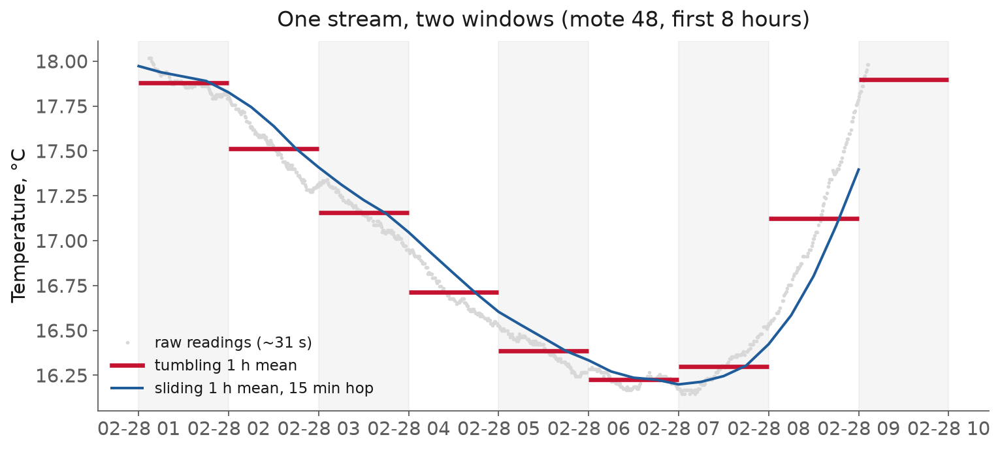
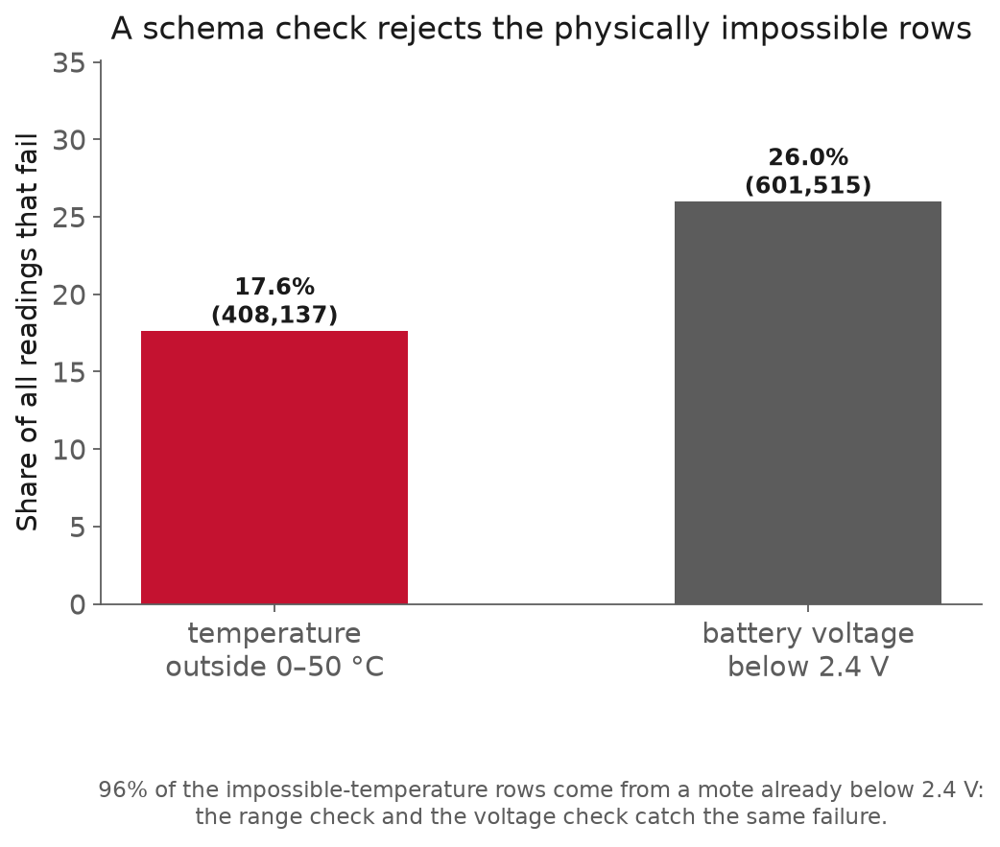

<!-- _class: title -->

# L6 · Streaming and data validation

## Week 3 · Data Systems

**Systems & Toolchains for AI in Engineering**

---

## Roadmap

1. Two facts that break a batch pipeline
2. Batch, streaming, and the log
3. Windows, event time, watermarks
4. Validation: checks as a gate
5. Where this pushes back
6. Live demo: a gate that fails loudly

---

<!-- _class: section -->

# Two facts that break a batch pipeline

---

## Two facts that break a batch pipeline

L5 built a batch pipeline: a clean sequence of stages over a **fixed, finished** dataset.

The right picture most of the time.

Two facts about real sensor data sit just outside it.

---

## Two facts that break a batch pipeline, unbounded and out of order

<div class="definition">

**Unbounded stream**: a feed with no last row, only the row that has not arrived yet.

</div>

Readings also arrive jumbled in time. In the Intel Lab feed, watched as it lands:

- **79.5%** of readings are out of event-time order
- normal behavior over a lossy network, not corruption

---

## Two facts that break a batch pipeline, dirty data

The same feed carries physically impossible values.

- ~**18%** of temperatures outside 0 to 50 °C
- ~**26%** from motes below a trustworthy battery voltage

Hundreds of thousands of rows. Nothing announces them.

---

## Two facts that break a batch pipeline, two disciplines

<div class="definition">

**Streaming**: compute over data that never stops and arrives late, with windows, event time, and watermarks.

</div>

- **Data validation**: stop bad data before it enters, with executable checks that run as a gate and fail loudly.

---

<!-- _class: section -->

# Batch, streaming, and the log

---

## Batch, streaming, and the log

| Batch | Streaming |
|---|---|
| bounded input, has an end | unbounded input, never ends |
| rerun, inspect, reason about | long-lived stateful service |
| start here | adopt when latency demands |

- **Micro-batch**: run a batch job every few seconds over whatever has accumulated.

---

## Batch, streaming, and the log, the log

<div class="definition">

**Log**: an append-only sequence of records, the abstraction Kafka is built around.

</div>

- a topic is split into **partitions**
- producers append; consumers read forward at their own **offset**
- order is guaranteed **per partition**, not per topic

[Kafka: introduction](https://kafka.apache.org/intro)

---

## Batch, streaming, and the log, why a log

- a queue deletes a message once consumed; a log keeps it and lets many readers replay from any **offset**
- push, not poll: each record is handed to the consumer as it lands
- reset the offset to reprocess history through new code, no separate backfill
- a **consumer group** splits the partitions; throughput scales with partition count

---

## Batch, streaming, and the log, delivery semantics

| Guarantee | Meaning |
|---|---|
| at most once | may be lost, never redelivered |
| at least once | never lost, may be redelivered |
| exactly once | processed once and only once |

Kafka is **at-least-once by default**. Exactly-once is opt-in: an idempotent producer plus transactions, or Kafka Streams `exactly_once_v2`. Assume at-least-once and tolerate a duplicate.

[Kafka: semantics](https://kafka.apache.org/documentation/#semantics)

---

## Batch, streaming, and the log, on devices and under load

MQTT is a "lightweight publish/subscribe messaging transport" for microcontrollers and lossy networks. [MQTT](https://mqtt.org/)

- **Backpressure**: when a consumer cannot keep up, signal upstream to slow down rather than dropping data or exhausting memory.

State is the hard part: a running average, an open window, or a dedup set must survive restarts, the real reason a stream is heavier than a batch job. [Reactive Streams](https://www.reactive-streams.org/)

---

<!-- _class: section -->

# Windows, event time, watermarks

---

## Windows, event time, watermarks

You cannot average an infinite sequence.

<div class="definition">

**Window**: "slices up a dataset into finite chunks for processing as a group."

</div>

Akidau's frame for any streaming computation:

- **What** result (a sum, an average)
- **Where** in event time (windows)
- **When** to emit (watermarks, triggers)
- **How** refinements relate (accumulation)

[Akidau et al., The Dataflow Model (VLDB 2015)](https://www.vldb.org/pvldb/vol8/p1792-Akidau.pdf)

---

## Windows, event time, watermarks, three shapes

- **Tumbling** (fixed): static size, no overlap, one mean per clock hour.
- **Sliding** (hopping): a size and a shorter step, so windows overlap.
- **Session**: groups activity separated by gaps of inactivity.

Fixed is the special case of sliding where size = step.

---



---

## Windows, event time, watermarks, tumbling in code

```python
(readings
 .set_index("ts")        # event time
 .resample("1h")         # tumbling: fixed, no overlap
 .agg(mean_temp=("temperature", "mean")))
```

One hour in, one row out. This produces the red steps in the figure.

---

## Windows, event time, watermarks, event and processing time

- **Event time**: "the time at which the event itself actually occurred," stamped by the sensor.
- **Processing time**: "the time at which an event is observed at any given point during processing."

For a live stream they diverge constantly. A processing-time window mixes events from wildly different real times, and with **79.5%** out of order it is meaningless. Group readings by when they were measured.

---

## Windows, event time, watermarks, watermarks and triggers

<div class="definition">

**Watermark**: "a lower bound (often heuristically established) on event times that have been processed by the pipeline."

</div>

When it passes a window's end, the window closes.

A **trigger** decides when to emit: at the watermark once, early on a timer, or late on each straggler.

---

## Windows, event time, watermarks, late data

- **Late data**: a reading that arrives after its window has already closed.

The watermark is a guess and can be wrong. You need a policy: drop it, hold windows open, or re-emit a corrected result.

Accumulation decides what a correction means: discard the old value and replace it, or accumulate the straggler onto it. "The hourly mean is 24.1 °C. Correction: 24.3 °C." Downstream must expect updates.

[Streaming 102](https://www.oreilly.com/radar/the-world-beyond-batch-streaming-102/)

---

<!-- _class: section -->

# Validation: checks as a gate

---

## Validation: checks as a gate

<div class="definition">

**Data validation**: write down what you expect of the data as executable checks.

</div>

- **Gate**: a stage the data must pass before the pipeline will act on it.

Every pipeline, batch or streaming, has data entering it that some upstream process swears is fine.

---

## Validation: checks as a gate, three kinds of check

- **Schema check**: asserts structure (column exists, is a timestamp, is or is not nullable).
- **Statistical check**: asserts distributions (null rate, uniqueness, drift).
- **Physical-plausibility check**: asserts what the domain knows (temperature in range, time not backwards).

The physical checks earn their keep: the impossible temperatures from L3 come from motes whose batteries drained, and a range check and a voltage check reject the same rows.

---



---

## Validation: checks as a gate, pandera

<div class="definition">

**pandera**: declare a `DataFrameSchema` as code, from `Column` objects carrying a dtype, a nullability flag, and `Check`s.

</div>

```python
import pandera.pandas as pa

schema = pa.DataFrameSchema({
    "moteid":      pa.Column(int, pa.Check.isin(range(1, 55))),
    "temperature": pa.Column(float, pa.Check.in_range(0, 50), nullable=True),
    "voltage":     pa.Column(float, pa.Check.ge(2.4), nullable=True),
})
schema.validate(df, lazy=True)   # collect every failure
```

[pandera: checks](https://pandera.readthedocs.io/en/stable/checks.html)

---

## Validation: checks as a gate, how it fails

- `schema.validate(df)` raises `SchemaError` on the **first** break
- `lazy=True` raises `SchemaErrors` with **every** failing row

Fail fast to stop a pipeline; fail lazy to clean a dirty dump.

[pandera: lazy validation](https://pandera.readthedocs.io/en/stable/lazy_validation.html)

---

## Validation: checks as a gate, a failure report

```text
column       check                          failure_case
temperature  in_range(0, 50)                122.15
voltage      greater_than_or_equal_to(2.4)  1.91
```

`lazy=True` hands you which row, which check, which value.

---

## Validation: checks as a gate, Great Expectations

<div class="definition">

**Great Expectations**: a heavier validation framework aimed at teams who want results as living documentation.

</div>

- **Expectation**: a verifiable assertion about data
- **Suite**: a collection of them
- **Checkpoint**: runs a suite in production
- **Data Docs**: human-readable reports

[GX overview](https://docs.greatexpectations.io/docs/core/introduction/gx_overview/)

---

## Validation: checks as a gate, pandera or Great Expectations

| pandera | Great Expectations |
|---|---|
| a schema in your code | a framework with a project |
| inline, unit-test feel | suites, checkpoints, Data Docs |
| one script, one dev | a pipeline, a team, an audit trail |

Prefer pandera for a single script; use Great Expectations when a team needs an audit trail.

---

## Validation: checks as a gate, drift and contract

Statistical checks ask whether the **distribution** moved:

- a null rate creeping up
- a sensor's mean sliding month to month

The seam into **monitoring** (L20): the same checks, run forever. A written schema is also documentation, the shape the next person or service can rely on.

---

## Validation: checks as a gate, what a failure does

| Policy | Use when |
|---|---|
| **block** | bad data must never reach a model/report |
| **warn** | you monitor it but won't act now |
| **quarantine** | route bad rows aside, let good ones flow |

Inject bad data on purpose and prove the gate halts, because an untested check gives false confidence.

---

<!-- _class: section -->

# Where this pushes back

---

## Where this pushes back, streaming is a cost to defer

A batch job is a function you rerun. A stream is a long-lived stateful service.

Exactly-once is hard, watermarks are heuristics, late data forces a policy.

Start batch or micro-batch. Adopt streaming only when latency demands it.

---

## Where this pushes back, event-time windows trust your clocks

Everything rested on the event-time stamp.

A wrong or drifting sensor clock makes event-time windows group by a **lie**.

The monotonic-timestamp check lets you trust them.

---

## Where this pushes back, validation confirms plausibility

A value that passes every check can still be wrong.

24 °C is plausible whether or not it is what happened.

Validation catches impossible and malformed values. It misses a sensor that is miscalibrated but reading plausibly. It gives the same false comfort as a passing test or a reproducible result.

---

## Where this pushes back, a schema is a brittle burden

- too tight: cries wolf, until the team ignores it
- too loose: passes the data it should catch
- only tests the expectations you **thought to write**

Validation improves the baseline of data quality, and problems it did not anticipate still pass through.

---

<!-- _class: demo -->

# Demo

## `l06-validation.ipynb`

A pandera gate on the sensor data: dtypes, a mote-id set,
temperature range, a voltage floor. Inject corrupt rows,
watch it fail loudly. Then a windowed replay of the stream.

---

## What to watch

With the gate: the pipeline **halts** with a precise complaint.

Without it: the pipeline runs to completion and produces a **confident, wrong number**.

The gate turns silent corruption into a loud failure.

---

## Recap

- Real sensor data is **unbounded, out of order, and dirty**
- Streaming: windows in **event time**, closed by **watermarks**
- 79.5% out of order is *why* event time and watermarks exist
- Validation: schema, statistical, and **physical** checks, as a **gate**
- pandera for code, Great Expectations for team-readable reports
- Block, warn, or quarantine, and prove the gate halts

---

## Next

**Assignment** A3 (from L5): its validation half is now unblocked
**Reading** Akidau, "The Dataflow Model"; pandera docs
**L7** From guarding data to shaping it: features for time-series
and physical data, and the trap of **leakage**

Full notes, with all sources: `lectures/l06/notes.md`
