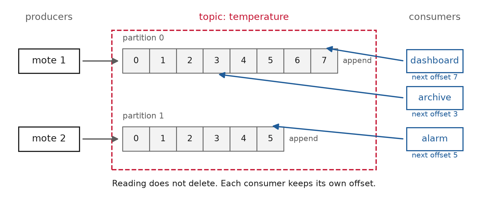

<!-- _class: title -->

# Lecture 6: Streaming and data validation

## Week 3, Data Systems

**Systems and Toolchains for AI Engineers**

---

## Roadmap

1. Two facts that break a batch pipeline
2. Batch, streaming, and the log
3. Windows, event time, watermarks
4. Validation: checks as a gate
5. Where this pushes back
6. Live demo: a gate that fails loudly

---

<!-- _class: section -->

# Two facts that break a batch pipeline

---

## Two facts that break a batch pipeline

Lecture 5 built a batch pipeline: a clean sequence of stages over a **fixed, finished** dataset.

The right picture most of the time.

Two facts about real sensor data sit just outside it.

---

## Two facts that break a batch pipeline, unbounded and out of order

<div class="definition">

**Unbounded stream**: a feed with no last row, only the row that has not arrived yet.

</div>

Readings also arrive jumbled in time. In the Intel Lab feed, watched as it lands:

- **79.5%** of readings are out of event-time order
- normal behavior over a lossy network, not corruption

[Intel Lab Data](https://db.csail.mit.edu/labdata/labdata.html), 2.3 M readings, 54 motes

---

## Two facts that break a batch pipeline, dirty data

The same feed carries physically impossible values.

- ~**18%** of temperatures outside 0 to 50 °C
- ~**26%** from motes below a trustworthy battery voltage
- **96%** of the impossible temperatures come from a mote already under 2.4 V

Hundreds of thousands of rows. Nothing announces them, and the two checks are
mostly finding one failure.

---

## Two facts that break a batch pipeline, two disciplines

<div class="definition">

**Streaming**: compute over data that never stops and arrives late, with windows, event time, and watermarks.

</div>

- **Data validation**: stop bad data before it enters, with executable checks that run as a gate and fail loudly.

---

<!-- _class: section -->

# Batch, streaming, and the log

---

## Batch, streaming, and the log

| Batch | Streaming |
|---|---|
| bounded input, has an end | unbounded input, never ends |
| rerun, inspect, reason about | long-lived stateful service |
| start here | adopt when latency demands |

- **Micro-batch**: run a batch job every few seconds over whatever has accumulated.

---

## Batch, streaming, and the log, a broker

<div class="definition">

**Message broker**: a server between the programs that write data and the programs that read it.

</div>

- **producers** write records to a named **topic**: a mote, a plant historian
- **consumers** subscribe to the topic: a dashboard, an archive, an alarm
- producers and consumers never talk to each other, only to the broker
- **Apache Kafka** is the common broker for large streams; **MQTT** is the light one for devices, and A3's plant stream uses it

[Kafka: introduction](https://kafka.apache.org/intro)

<!--
Nobody in the room is assumed to have seen a broker. Draw the three boxes before
saying the word Kafka: sensors on the left, readers on the right, one server in
the middle. The point of the middle box is that adding a fourth reader changes
nothing for the sensors.
-->

---

## Batch, streaming, and the log, the log

<div class="definition">

**Log**: an append-only sequence of records, the abstraction Kafka is built around.

</div>

- a topic is split into **partitions**, each one a log
- producers append to the end; nothing in the middle changes
- each consumer keeps an **offset**: the number of the next record it will read
- order is guaranteed **per partition**, not per topic

---

## Batch, streaming, and the log, the log



Three consumers, three offsets. The archive is behind the dashboard, and neither slows the other.

---

## Batch, streaming, and the log, why a log

- a queue deletes a message once consumed; a log keeps it and lets many readers replay from any **offset**
- push, not poll: each record is handed to the consumer as it lands
- reset the offset to reprocess history through new code, no separate backfill
- a **consumer group** splits the partitions; throughput scales with partition count

---

## Batch, streaming, and the log, delivery semantics

| Guarantee | Meaning |
|---|---|
| at most once | may be lost, never redelivered |
| at least once | never lost, may be redelivered |
| exactly once | processed once and only once |

Kafka is **at-least-once by default**. Exactly-once is opt-in: an idempotent producer plus transactions, or Kafka Streams `exactly_once_v2`. Assume at-least-once and tolerate a duplicate.

[Kafka: semantics](https://kafka.apache.org/documentation/#semantics)

---

## Batch, streaming, and the log, a question

<div class="clicker" data-tag="l06-at-least-once" data-seconds="45" data-answer="B" data-hint="Look at the table on the last slide. What does at least once allow?" data-why="B. At least once means a reading is never lost but can arrive again, and a repeat gets added to the total twice. The fix is a consumer that skips a reading it has already counted." data-read="https://clicker.f26-06763.workers.dev">
<div class="clicker-main">

**Kafka delivers at least once. Your consumer adds each reading to a running total. What can go wrong?**

<ol class="clicker-opts">
<li>A reading is lost, so the total is too low</li>
<li>A reading arrives twice, so the total is too high</li>
<li>Nothing, because Kafka never repeats a reading</li>
<li>Nothing, because Kafka stores the total for you</li>
</ol>

</div>
<aside class="clicker-panel">

<div class="clicker-url">clicker.f26-06763.workers.dev</div>
<button class="clicker-start">Start voting</button>
<div class="clicker-timer">45</div>
<div class="clicker-count">no votes yet</div>
</aside>
</div>

<!--
Tests whether at-least-once is read as "may repeat" rather than a vague promise
of reliability. The table on the previous slide has the answer in its middle row.

A is at-most-once, the opposite trade. If someone defends it, ask which row of the
table it describes.

Land on the word idempotent, because A3 asks them to make a pipeline idempotent
under exactly this delivery model.
-->

---

## Batch, streaming, and the log, on devices and under load

MQTT is a "lightweight publish/subscribe messaging transport" for microcontrollers and lossy networks. [MQTT](https://mqtt.org/)

- **Backpressure**: when a consumer cannot keep up, signal upstream to slow down rather than dropping data or exhausting memory.

State is the hard part: a running average, an open window, or a dedup set must survive restarts, the real reason a stream is heavier than a batch job. [Reactive Streams](https://www.reactive-streams.org/)

---

<!-- _class: section -->

# Windows, event time, watermarks

---

## Windows, event time, watermarks

You cannot average an infinite sequence.

<div class="definition">

**Window**: "slices up a dataset into finite chunks for processing as a group."

</div>

Akidau's frame for any streaming computation:

- **What** result (a sum, an average)
- **Where** in event time (windows)
- **When** to emit (watermarks, triggers)
- **How** refinements relate (accumulation)

[Akidau et al., The Dataflow Model (VLDB 2015)](https://www.vldb.org/pvldb/vol8/p1792-Akidau.pdf)

---

## Windows, event time, watermarks, three shapes

- **Tumbling** (fixed): static size, no overlap, one mean per clock hour.
- **Sliding** (hopping): a size and a shorter step, so windows overlap.
- **Session**: groups activity separated by gaps of inactivity.

Fixed is the special case of sliding where size = step.

---


---

## Windows, event time, watermarks, tumbling in code

```python
(readings
 .set_index("ts")        # event time
 .resample("1h")         # tumbling: fixed, no overlap
 .agg(mean_temp=("temperature", "mean")))
```

One hour in, one row out. This produces the red steps in the figure.

---

## Windows, event time, watermarks, event and processing time

- **Event time**: "the time at which the event itself actually occurred," stamped by the sensor.
- **Processing time**: "the time at which an event is observed at any given point during processing."

Measured at 3:10, arrives at 4:20: event time 3:10, processing time 4:20.

For a live stream they diverge constantly. A processing-time window mixes events from wildly different real times, and with **79.5%** out of order it is meaningless. Group readings by when they were measured.

---

## Windows, event time, watermarks, a question

<div class="clicker" data-tag="l06-processing-time" data-seconds="45" data-answer="B" data-hint="Processing time is the clock when the reading reaches you." data-why="B. Processing time is when the reading arrived, 4:20, so it lands in the 4:00 window. Windowed by event time it would land in the 3:00 window, where it was measured." data-read="https://clicker.f26-06763.workers.dev">
<div class="clicker-main">

**A reading is measured at 3:10 and arrives at 4:20. You use one-hour windows in processing time. Which window gets it?**

<ol class="clicker-opts">
<li>3:00 to 4:00, when it was measured</li>
<li>4:00 to 5:00, when it arrived</li>
<li>Neither, because it is dropped as late</li>
<li>Both, split between the two windows</li>
</ol>

</div>
<aside class="clicker-panel">

<div class="clicker-url">clicker.f26-06763.workers.dev</div>
<button class="clicker-start">Start voting</button>
<div class="clicker-timer">45</div>
<div class="clicker-count">no votes yet</div>
</aside>
</div>

<!--
The one question in this deck that decides whether the rest of the section lands.
A student who cannot answer it is not ready for watermarks. The 3:10 / 4:20 line
on the previous slide is the same example.

A is the event-time answer. If it wins, ask which clock the window was told to use.

C is worth a sentence: a processing-time window never has late data, because a
reading cannot arrive before it arrives.

Once it lands, extend it: a mote offline for two hours uploads everything at once,
so processing time shows two empty hours and then a spike that never happened.
-->

---

## Windows, event time, watermarks, watermarks and triggers

<div class="definition">

**Watermark**: "a lower bound (often heuristically established) on event times that have been processed by the pipeline."

</div>

When it passes a window's end, the window closes.

A **trigger** decides when to emit: at the watermark once, early on a timer, or late on each straggler.

---

## Windows, event time, watermarks, late data

- **Late data**: a reading that arrives after its window has already closed.

The watermark is a guess and can be wrong. You need a policy: drop it, hold windows open, or re-emit a corrected result.

Wait longer: fewer late readings, but every result comes out later.

Accumulation decides what a correction means: discard the old value and replace it, or accumulate the straggler onto it. "The hourly mean is 24.1 °C. Correction: 24.3 °C." Downstream must expect updates.

[Streaming 102](https://www.oreilly.com/radar/the-world-beyond-batch-streaming-102/)

---

## Windows, event time, watermarks, a question

<div class="clicker" data-tag="l06-watermark-tradeoff" data-seconds="45" data-answer="A" data-hint="A window cannot give its result until the watermark passes its end." data-why="A. Waiting longer lets more stragglers in before a window closes, and every window closes that much later. You trade speed for completeness, and no setting avoids the trade." data-read="https://clicker.f26-06763.workers.dev">
<div class="clicker-main">

**You make the watermark wait 2 hours instead of 10 minutes. What changes?**

<ol class="clicker-opts">
<li>Fewer late readings, but results come out later</li>
<li>Fewer late readings, and nothing else changes</li>
<li>More late readings, but results come out sooner</li>
<li>Nothing, because the watermark only labels readings</li>
</ol>

</div>
<aside class="clicker-panel">

<div class="clicker-url">clicker.f26-06763.workers.dev</div>
<button class="clicker-start">Start voting</button>
<div class="clicker-timer">45</div>
<div class="clicker-count">no votes yet</div>
</aside>
</div>

<!--
This is A3 task 4 in one slide: the sweep asks them to price several allowances
and defend one, and this is the shape of the answer. The last line of the
previous slide states it.

B is the answer a student gives who has only heard watermarks described as a way
to catch late data. Ask what the window is doing for those two hours.

Worth saying out loud that there is no correct number, only a stated reason.
-->

---

<!-- _class: section -->

# Validation: checks as a gate

---

## Validation: checks as a gate

<div class="definition">

**Data validation**: write down what you expect of the data as executable checks.

</div>

- **Gate**: a stage the data must pass before the pipeline will act on it.

Every pipeline, batch or streaming, has data entering it that some upstream process swears is fine.

---

## Validation: checks as a gate, three kinds of check

- **Schema check**: asserts structure (column exists, is a timestamp, is or is not nullable).
- **Statistical check**: asserts distributions (null rate, uniqueness, drift).
- **Physical-plausibility check**: asserts what the domain knows (temperature in range, time not backwards).

The physical checks earn their keep: the impossible temperatures from Lecture 3 come from motes whose batteries drained, and a range check and a voltage check reject the same rows.

---


---

## Validation: checks as a gate, pandera

<div class="definition">

**pandera**: declare a `DataFrameSchema` as code, from `Column` objects carrying a dtype, a nullability flag, and `Check`s.

</div>

```python
import pandera.pandas as pa

schema = pa.DataFrameSchema({
    "moteid":      pa.Column(int, pa.Check.isin(range(1, 55))),
    "temperature": pa.Column(float, pa.Check.in_range(0, 50), nullable=True),
    "voltage":     pa.Column(float, pa.Check.ge(2.4), nullable=True),
})
schema.validate(df, lazy=True)   # collect every failure
```

[pandera: checks](https://pandera.readthedocs.io/en/stable/checks.html)

---

## Validation: checks as a gate, how it fails

- each check tests **one row at a time**, with no memory of earlier rows
- `schema.validate(df)` raises `SchemaError` on the **first** break
- `lazy=True` raises `SchemaErrors` with **every** failing row

Fail fast to stop a pipeline; fail lazy to clean a dirty dump.

[pandera: lazy validation](https://pandera.readthedocs.io/en/stable/lazy_validation.html)

---

## Validation: checks as a gate, a failure report

```text
column       check                          failure_case
temperature  in_range(0, 50)                122.15
voltage      greater_than_or_equal_to(2.4)  1.91
```

`lazy=True` hands you which row, which check, which value.

---

## Validation: checks as a gate, a question

<div class="clicker" data-tag="l06-range-check-drift" data-seconds="45" data-answer="A" data-hint="The check looks at one row at a time." data-why="A. A range check tests each row by itself, so 24, 35 and 48 pass even though the mote is clearly drifting. Catching the climb needs a statistical check, or the voltage check that sees the dying battery." data-read="https://clicker.f26-06763.workers.dev">
<div class="clicker-main">

**Your schema checks that `temperature` is between 0 and 50. One mote reads 24, 35, 48, then 122. Which readings fail?**

<ol class="clicker-opts">
<li>Only 122</li>
<li>All four, because the mote is faulty</li>
<li>48 and 122, because 48 is near the limit</li>
<li>None of them, once you pass <code>lazy=True</code></li>
</ol>

</div>
<aside class="clicker-panel">

<div class="clicker-url">clicker.f26-06763.workers.dev</div>
<button class="clicker-start">Start voting</button>
<div class="clicker-timer">45</div>
<div class="clicker-count">no votes yet</div>
</aside>
</div>

<!--
Ties the failure report on the previous slide to the pandera schema two before it,
and sets up the pushback section on validation confirming plausibility.

The first bullet on the "how it fails" slide is the answer.

B is the productive wrong answer: students read the gate as rejecting the mote
rather than the row. Ask what pandera was handed.

Once it lands, say the uncomfortable part: the mote was drifting the whole time,
and the gate passed three of its four readings.
-->

---

## Validation: checks as a gate, Great Expectations

<div class="definition">

**Great Expectations**: a heavier validation framework aimed at teams who want results as living documentation.

</div>

- **Expectation**: a verifiable assertion about data
- **Suite**: a collection of them
- **Checkpoint**: runs a suite in production
- **Data Docs**: human-readable reports

[GX overview](https://docs.greatexpectations.io/docs/core/introduction/gx_overview/)

---

## Validation: checks as a gate, pandera or Great Expectations

| pandera | Great Expectations |
|---|---|
| a schema in your code | a framework with a project |
| inline, unit-test feel | suites, checkpoints, Data Docs |
| one script, one dev | a pipeline, a team, an audit trail |

Prefer pandera for a single script; use Great Expectations when a team needs an audit trail.

---

## Validation: checks as a gate, drift and contract

Statistical checks ask whether the **distribution** moved:

- a null rate creeping up
- a sensor's mean sliding month to month

The seam into **monitoring**: the same checks, run forever.

A written schema is a **data contract**, the shape a consumer is entitled to assume, and documentation that fails the build when it goes stale.

---

## Validation: checks as a gate, what a failure does

| Policy | Use when |
|---|---|
| **block** | bad data must never reach a model/report |
| **warn** | you monitor it but won't act now |
| **quarantine** | route bad rows aside, let good ones flow |

Inject bad data on purpose and prove the gate halts, because an untested check gives false confidence.

---

<!-- _class: section -->

# Where this pushes back

---

## Where this pushes back, streaming is a cost to defer

A batch job is a function you rerun. A stream is a long-lived stateful service.

Exactly-once is hard, watermarks are heuristics, late data forces a policy.

Start batch or micro-batch. Adopt streaming only when latency demands it.

---

## Where this pushes back, event-time windows trust your clocks

Everything rested on the event-time stamp.

A wrong or drifting sensor clock makes event-time windows group by a **lie**.

The monotonic-timestamp check lets you trust them.

---

## Where this pushes back, validation confirms plausibility

A value that passes every check can still be wrong.

24 °C is plausible whether or not it is what happened.

Validation catches impossible and malformed values. It misses a sensor that is miscalibrated but reading plausibly. It gives the same false comfort as a passing test or a reproducible result.

---

## Where this pushes back, a schema is a brittle burden

- too tight: cries wolf, until the team ignores it
- too loose: passes the data it should catch
- only tests the expectations you **thought to write**

Validation improves the baseline of data quality, and problems it did not anticipate still pass through.

---

<!-- _class: demo -->

# Demo

## `l06-validation.ipynb`

A pandera gate on the sensor data: dtypes, a mote-id set,
temperature range, a voltage floor. Inject corrupt rows,
watch it fail loudly. Then a windowed replay of the stream.

---

## What to watch

With the gate: the pipeline **halts** with a precise complaint.

Without it: the pipeline runs to completion and produces a **confident, wrong number**.

The gate turns silent corruption into a loud failure.

---

## Recap

- Real sensor data is **unbounded, out of order, and dirty**
- Streaming: windows in **event time**, closed by **watermarks**
- 79.5% out of order is *why* event time and watermarks exist
- Validation: schema, statistical, and **physical** checks, as a **gate**
- pandera for code, Great Expectations for team-readable reports
- Block, warn, or quarantine, and prove the gate halts

---

## Standings

Nicknames only. Everyone who skipped one still counted in every bar you saw.

<div class="clicker-leaderboard"
     data-read="https://clicker.f26-06763.workers.dev"
     data-top="8"
     data-hours="6"
     data-title="Standings"></div>

---

## Next

**Assignment 3** is released today: collect ten minutes of a live plant stream, then make it trustworthy
**Reading** Akidau, "The Dataflow Model"; pandera docs

Full notes, with all sources: `lectures/l06/notes.md`

<script src="clicker-slide.js"></script>
