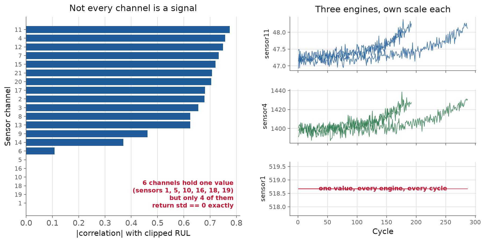
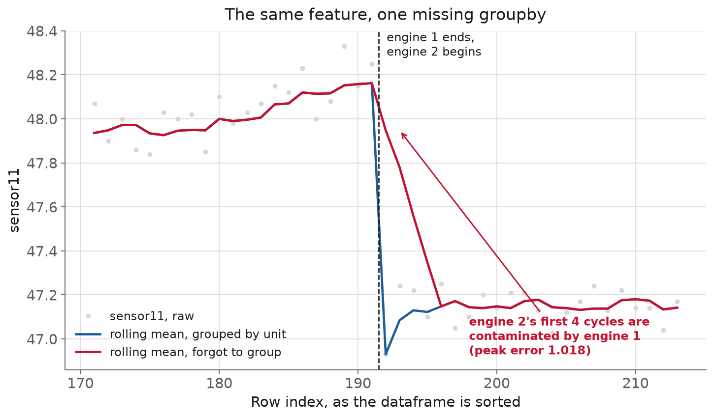
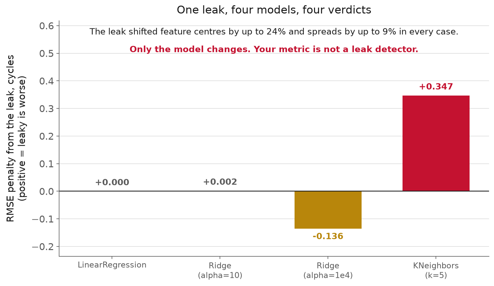

<!-- _class: title -->

# L7 · Features for time-series & physical data

## Week 4 · Data Systems

**Systems and Toolchains for AI Engineers**

---

## Roadmap

1. Why this matters: where meaning gets lost
2. Time-series features from a per-unit trajectory
3. Physical and domain features
4. Scaling, encoding, and fitting on train only
5. A leakage-safe pipeline
6. Live demo: the leak a scaler can hide

<!-- 110 min. Budget roughly 15 / 20 / 15 / 20 / 10 / 20 demo, slack for questions.
     C-MAPSS FD001: 100 engines, run-to-failure, 21 sensors + 3 settings.
     If running long, cut the spectral-features slides, not the demo. -->

---

<!-- _class: section -->

# Why this matters

---

## Why this matters

Physical measurement in. A number a model
can multiply out.

Feels mechanical. That's exactly why it's
where meaning goes missing unnoticed.

---

## Why this matters, nothing crashes when it goes wrong

Wrong units. A leaked statistic. A raw value
with no physical context.

The pipeline still runs. The model still trains.
Predictions look exactly as plausible.

<!-- And the clearest illustration isn't an ML example at all: feature
     engineering has always meant turning physical quantities into numbers some
     system consumes. The consumer used to be a guidance algorithm. -->


---

## Why this matters, the second failure: leakage

Quieter. No units mismatch required.

A statistic computed to describe "training data"
quietly peeked at "data I'll be judged on."

**The question that decides everything.**

Every transform, a mean, a std, a category list,
is a statistic computed over **some set of rows**.

Which rows, is the whole question.

---

<!-- _class: section -->

# Time-series features

---

## Time-series features


<div class="definition">

**Lag feature**: the value of a channel some fixed number of steps earlier in the same unit's history.

</div>
**NASA C-MAPSS**: simulated turbofan engines,
run-to-failure, one row per engine per cycle.

21 sensors + 3 operating settings.
Failure cycle known in train, withheld in test.

FD001: 100 train / 100 test engines, median life 199 cycles.
[NASA PCoE repository](https://www.nasa.gov/intelligent-systems-division/discovery-and-systems-health/pcoe/pcoe-data-set-repository/)

---

## Time-series features, first: look at what you actually have



<!-- SIX of 21 channels hold one constant value. Ask how many they'd have
     noticed by eye. -->

---

## Time-series features, six dead channels of twenty-one

A rolling mean of a constant is a constant.
Its rolling std is 0. Its delta-from-cycle-1 is 0.

**Four columns of nothing, per dead channel.**

**And the trap in detecting them.**

L5 said: constant ⟺ `std == 0`. True in arithmetic.

```
sensor5:  one value (14.62),  std() = 5.3e-15
sensor16: one value (0.03),   std() = 3.5e-18
```

`std == 0` misses **2 of the 6.** Use `nunique()`,
or a tolerance. Never `== 0` on a computed float.

---

## Time-series features, the structural rule

Every feature must respect: data is
**grouped by engine**, **ordered by cycle**.

Get the grouping wrong, and you fabricate
a feature without an error ever firing.

**The vocabulary: lag & difference.**

**Lag**: `sensor.shift(k)`, what was this doing
k steps ago.

**Difference**: `sensor.diff()`, how much did
it change since last cycle.

---

## Time-series features, the vocabulary: rolling & expanding

<div class="definition">

**Rolling window feature**: a statistic over the last k samples, recomputed at every step, and never reaching forward in time.

</div>

**Rolling** mean/std/min/max: smooths noise,
surfaces trend. Window length is a real choice.

**Expanding**: an all-history-so-far statistic,
no fixed length.

---

## Time-series features, the vocabulary: rate-of-change & time-since-event

**Rate-of-change**: a difference, normalized by
elapsed time.

**Time-since-event**: cycles since a condition
last held, exactly what an alarm model needs.

**Always inside a group.**

```python
g = df.groupby('unit', group_keys=False)
df['sensor4_roll_mean_5'] = (
    g['sensor4'].transform(lambda x: x.rolling(5).mean())
)
```

---

## Time-series features, what that looks like, measured



<!-- 5-cycle rolling mean across the engine 1 / engine 2 boundary. The red line
     spends 4 rows blending in engine 1's end-of-life readings. Peak error ~1.0
     on a channel whose whole fleet range is ~1.7. -->

---

## Time-series features, why it's worse than noise

pandas **will not complain.** The contamination is
worst at each engine's **first** cycles, where RUL
is longest, and it always drags them toward the
previous engine's **end of life.**

**Bias with the shape of your signal.**

---

## Time-series features, resampling irregular data

C-MAPSS is a clean, regular grid. Real sensors
often aren't: recall the Intel Lab motes (L3),
~31s cadence, unpredictable dropouts.

Resample to a fixed cadence; choose a policy
for the gap: forward-fill, interpolate, or leave null.

**The policy is itself a feature decision.**

Forward-filling a dropout invents continuity
that wasn't there.

A model that never sees the gap can't learn
that dropouts predict anything.

---

<!-- _class: section -->

# Physical and domain features

---

## Physical and domain features

<div class="definition">

**Dimensionless group**: a ratio of physical quantities whose units cancel, so it transfers across scales.

</div>

Ratios engineered to be independent of scale:
Reynolds number, power factor.

Collapse a nuisance dimension instead of asking
the model to learn it away from raw values.

---

## Physical and domain features, energy & power features

Usually **derived**, not measured: kinetic energy
from shaft speed, specific power from pressure
ratio and mass flow.

Grounded in a known physical law, not a
coincidental correlation.

---

## Physical and domain features, calibration corrections

A channel's raw output degrades over an
instrument's lifetime (L1's drift argument, again).

The correction belongs in the pipeline,
applied consistently, not patched in after.

**Unit consistency.**

The discipline tying all of this together.

Not a habit of careful people.
An engineering requirement.

---

## Physical and domain features, case: a specification nobody checked

**Mars Climate Orbiter**, launched 11 Dec 1998.
Signal lost 09:04:52 UTC, 23 September 1999.

A Software Interface Specification **required
newton-seconds**. The code wrote **pound-seconds**.

[Mishap Investigation Board report](https://llis.nasa.gov/llis_lib/pdf/1009464main1_0641-mr.pdf)

---

## Physical and domain features, the error had a number

> underestimated the effect on the spacecraft
> trajectory by **a factor of 4.45**

1 lbf = 4.45 N. Every firing modeled as
four and a half times too weak.

**Why "small forces" weren't small.**

The solar array was **asymmetric**, unlike Mars
Global Surveyor's.

Desaturation firings happened **10-14× more often
than the navigation team expected.**

4.45× error × 10-14× more often × 9 months.

---

## Physical and domain features, the altitudes, from the report

| | km |
|---|---|
| planned first periapsis | **226** |
| a week out | 150-170 |
| one hour out | 110 |
| **minimum survivable** | **80** |
| reconstructed actual | **57** |

<!-- Popular retellings say "planned 150 km". They're quoting an already-degraded
     intermediate estimate as if it were the plan. 226 km was the plan. -->

---

## Physical and domain features, about that $327 million

The MIB report **never mentions cost.**

\$327.6M was the **two-spacecraft** Mars Surveyor '98
program. The orbiter itself: nearer \$125M.

The verified facts are damning enough.

<!-- Same discipline as L1's "<10% of code is ML code" non-claim. Check whether
     the source you're citing contains the number you're citing it for. -->

---

## Physical and domain features, the mechanism is a feature engineering failure

A physical quantity, computed correctly in one
team's units, consumed by a system expecting another.

Nothing marked which convention the number was in.
Both are just a float.

**The part that should worry you more.**

> concerns existed at the working level regarding
> discrepancies observed between navigation solutions

Noted "**only informally reported**."
Doppler solutions consistently disagreed.

> These discrepancies were not resolved.

---

## Physical and domain features, months, not minutes

The discrepancy was visible **spring and summer 1999.**

Root cause identified **29 September**:
six days *after* the spacecraft was gone.

Same shape as L5's 97 unread "Power Peg disabled" emails.

<!-- This is the through-line of the whole course. Say it explicitly: an anomaly
     that is "noted informally" is not monitoring. -->

---

## Physical and domain features, what a practitioner should take from this

Never let a column imply its own units.
`thrust_lbf`, not `thrust`.

But note: MCO **had** a written spec requiring N-s.
It didn't help, because nothing checked compliance.

**A data contract that isn't executed is a comment.**

**Spectral features.**

Vibration/acoustic data: the information isn't
in the level, it's in **which frequencies** carry energy.

**FFT** decomposes a windowed signal into
frequency components.

---

## Physical and domain features, band energy

<div class="definition">

**Band energy**: the power in a named frequency band, which turns a spectrum into a small number of features.

</div>

```python
def band_energy(signal, fs, f_lo, f_hi):
    freqs = np.fft.rfftfreq(len(signal), d=1/fs)
    spectrum = np.abs(np.fft.rfft(signal)) ** 2
    return spectrum[(freqs >= f_lo) & (freqs <= f_hi)].sum()
```

Which bands matter is a physical judgment
(bearing geometry, shaft speed). The transform is 3 lines.

---

<!-- _class: section -->

# Scaling, encoding, fitting on train only

---

## Scaling, encoding, fitting on train only

| Method | Use when |
|---|---|
| Standardize | roughly symmetric, no natural bound |
| Min-max | need a fixed bounded range |
| Robust (median/IQR) | heavy-tailed outliers, fault spikes |
| Log / Box-Cox | naturally skewed physical quantities |

[sklearn preprocessing](https://scikit-learn.org/stable/modules/preprocessing.html) · [Box-Cox (NIST)](https://www.itl.nist.gov/div898/handbook/eda/section3/eda336.htm)

---

## Scaling, encoding, fitting on train only, categorical encoding

One-hot or target encoding for an equipment ID
or an operating regime.

Same idea, non-numeric columns. The encoding
determines generalization to an unseen regime.

---

## Scaling, encoding, fitting on train only, every transform is fit from data

<div class="definition">

**Data leakage**: any path by which information from outside the training fold reaches the model fit on it.

</div>

A mean. A standard deviation. A Box-Cox lambda.
A category list.

Every one is a statistic. Every one can leak.

---

## Scaling, encoding, fitting on train only, the rule, stated once

> Fit every transform on the training split only.
> Apply the already-fitted transform to
> validation/test, unchanged.

A statistic computed with test rows included
has already seen something it shouldn't.

---

## Scaling, encoding, fitting on train only, today's demo tests this directly

`StandardScaler` fit on **training engines only**
vs. the same scaler fit on **train + test combined**.

Compare RUL error.

**Encoding, fitting on train only, the honest result.**

Gap in RMSE: **+0.002 cycles.** Out of ~19.

Not a typo. Not a scare number.

---

## Scaling, encoding, fitting on train only, but the leak definitely happened

The two scalers disagree about where a feature sits by
**up to 23%**, and about its spread by **up to 9%**.

So: the transform was badly contaminated,
and the metric reported ~nothing.

---

## Scaling, encoding, fitting on train only, the actual lesson

# Your metric is not a leak detector.

---

## Scaling, encoding, fitting on train only, one leak, four models



<!-- Ask them to predict the ordering before revealing. Nobody predicts that the
     alpha=1e4 bar goes NEGATIVE. -->

---

## Scaling, encoding, fitting on train only, read the third bar again

| model | gap |
|---|---|
| `LinearRegression` | exactly **0** |
| `Ridge(alpha=10)` | +0.002 |
| `Ridge(alpha=1e4)` | **−0.14** ← leak *helps* |
| `KNeighbors(k=5)` | **+0.35** |

A leak doesn't reliably inflate your score.
It makes your score **meaningless**.

---

## Scaling, encoding, fitting on train only, so you cannot audit this with metrics

You have to audit the **code**:

find every `.fit()` and check what was
in scope when it ran.

**Encoding, fitting on train only, fit on train only, on principle.**

You cannot know in advance which model,
which dataset, which year, is the one
where the shortcut costs you.

---

<!-- _class: section -->

# A leakage-safe pipeline

---

## A leakage-safe pipeline

<div class="definition">

**scikit-learn pipeline**: a single estimator holding every transform and the model, so fitting it can only ever see the training fold.

</div>

Not for convenience. For making the rule
**structurally hard to break**.

`pipeline.fit(X_train, y_train)`: every step fits
using only what you handed it.

---

## A leakage-safe pipeline, no path back to the leak

```python
pipeline = Pipeline([
    ('scale', StandardScaler()),
    ('model', Ridge(alpha=10.0)),
]).fit(X_train, y_train)

pipeline.predict(X_test)   # only ever .transform()'d
```

No `.fit()` call anywhere has `X_test` in scope.

---

## A leakage-safe pipeline, persist the whole pipeline

`joblib.dump(pipeline, ...)` saves weights **and**
every transform's fitted statistics, together.

Reload it a month later: exact same predictions.
Not a script's best attempt at reconstructing them.

**Feature stores (concept, not built here).**

Centralize feature **definitions** so training
and serving compute the same feature the same way.

A well-built `Pipeline` already gives you this,
at the scale of one project.

---

<!-- _class: section -->

# Where this pushes back

---

## Where this pushes back

A hundred engines, a few hundred generated
lag/rolling/delta columns: a recipe for
overfitting the training fleet.

**Automated extraction raises the stakes.**

[tsfresh](https://tsfresh.readthedocs.io/) can generate hundreds of
candidate features from one signal, one call.

Test enough candidates against one target,
some correlate **by chance alone**.

---

## Where this pushes back, a clipped RUL target is an assumption

Capping at 125 cycles assumes health is
roughly constant, then declines late.

Reasonable here. Not universal:
a sudden-fault mode would break it.

---

## Where this pushes back, transforms complicate the number you report

Predict log-RUL, and RMSE in that space
isn't cycles until you exponentiate back.

Easy to report a wrong number that
looks exactly like a right one.

**A safe pipeline defends one leak, not every leak.**

Fitting on the training fold stops **this**
session's bug.

It does nothing about a row-level split
that puts cycle 150 in train, 151 in test.

---

## Where this pushes back, that's next session

No `Pipeline` catches a split-level leak:
the split happens before the pipeline
ever sees the data.

L8: the full leakage taxonomy, grouped
and temporal splits.

**What a practitioner should take from this.**

Fewer features you can explain physically >
many you generated and hope correlate.

Fit inside a `Pipeline`, on the training fold,
as a structural habit, not a remembered rule.

---

<!-- _class: demo -->

# Demo

## `l07-features.ipynb`

Rolling/delta/rate-of-change features on C-MAPSS FD001.
`Ridge` RUL model, two scalers.

---

## What to watch

- 6 of 21 channels screened out as constant
- Scalers disagree by 23%; `Ridge` gap is 0.002
- Same leak across 4 models: 0, 0.002, **−0.14**, **+0.35**
- `Pipeline` saved with `joblib`, reloaded, reproduces itself exactly

---

## Two bugs that were in this notebook

1. `sensor5` promoted to "key degradation channel."
   It is **constant.**
2. `startswith('sensor2')` also matched
   `sensor20`, `sensor21`.

Bug 2 **improved** the score. That's the hard kind.

<!-- Both documented in the notebook in place. Neither raised. -->

---

## Recap

- A feature translates physical measurement into a model input, silently, if you let it
- Units are an engineering requirement; MCO had a spec and nobody checked it
- Group before every window, or you bias each engine's earliest cycles
- Every transform is a statistic; fit it on the training split only
- The gap was 0.002 and the leak was still real: **audit code, not metrics**
- `Pipeline`/`ColumnTransformer` make the rule structural, not remembered

---

## Three things measurement changed today

- `.apply`-style reasoning: the leak was **0.002**, not dramatic
- `std == 0` misses 2 of 6 constant channels
- A strong penalty made the leaky pipeline score **better**

Every one of those was a draft claim that a run corrected.

---

## Next

**Assignment** [A4](../../course/assignments/a04.md), out today, due ~1 week
**Reading** [sklearn pitfalls & leakage](https://scikit-learn.org/stable/common_pitfalls.html) · [Pipelines](https://scikit-learn.org/stable/modules/compose.html) · Saxena et al. 2008
**L8** Same C-MAPSS fleet: the full leakage taxonomy, correct
grouped/temporal splits, and versioning the pipeline with DVC

Full notes, with all sources: `lectures/l07/notes.md`
