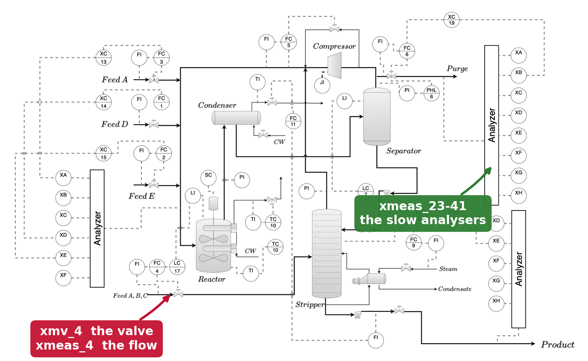
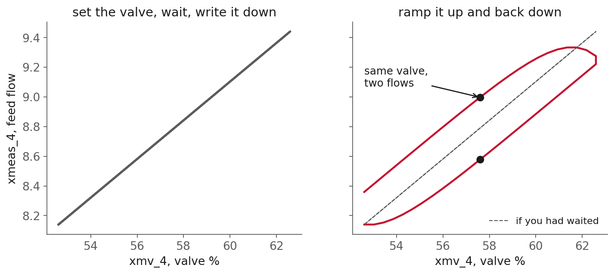
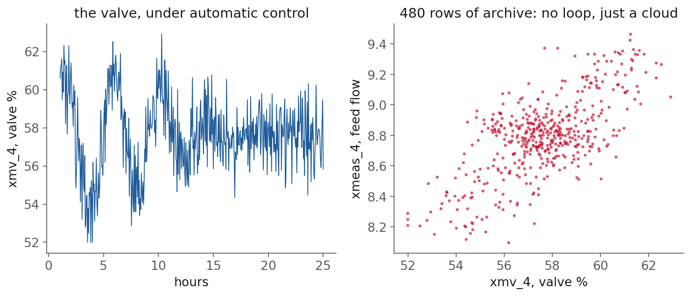
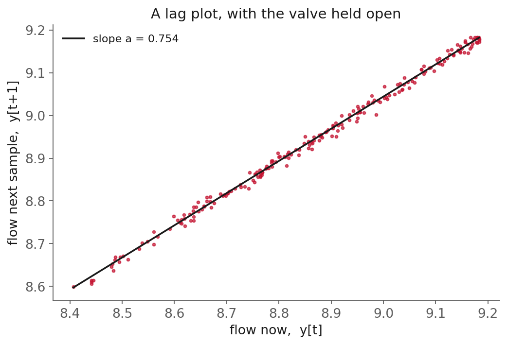
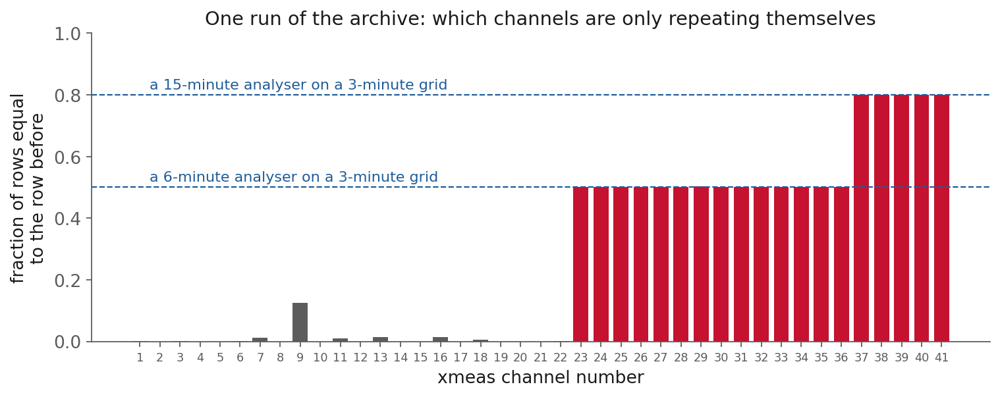

<!-- _class: title -->

# Lecture 7: Features for time-series models

## Week 4, Data Systems

**Systems and Toolchains for AI Engineers**

---

## What today is about

**Features for time-series data**: which columns belong in the table when the rows came from a process that changes over time.

| in chemical engineering | other |
|---|---|
| a flow responding to its valve | a bearing's vibration as wear accumulates |
| a concentration falling through a batch | a battery's state of charge |
| a historian logging a unit for years | a room chasing its thermostat |
| a channel drifting before it alarms | a request queue, given how long it already was |

All of them share one property: **what you measure now depends on what the system was doing a moment ago.**

---

## What today is about, what is being stored

| in chemical engineering | other |
|---|---|
| heat stored in a vessel | damage stored in a bearing |
| mass held up in a drum | charge stored in a cell |

Every one of those has something **stored** in it, which is why its past belongs in the table.

---

## How would you know your feature table is right?

You build a table, fit a model, and it reports **R-squared 0.94**.

That number is just as high for a table that:

- quietly used a value from the future
- grouped on the wrong column
- leaned on a sensor that was only repeating its last reading

**The score cannot see any of those.** It goes up either way.

<!--
speaker: this is the slide the whole session hangs on. Ask the room how they would catch
any of those three from a score alone. Let the silence sit.
-->

---

## So we pick a problem whose answer is checkable

One loop all class: the **A and C feed** of the Tennessee Eastman plant, from Lecture 5.
`xmv_4` is the valve, `xmeas_4` is the flow it sets.

The process behind it is **first order**, so the two fitted coefficients convert into:

- a **time constant**, in minutes
- a **gain**, in flow per percent of valve

A plant engineer who knows that line can tell you whether ten minutes is credible. **Nobody can tell you whether an R-squared is credible.**


---

## The plant, and where these channels are



<span class="source">P&ID from <a href="https://chemrxiv.org/doi/abs/10.26434/chemrxiv.10001628/v1">Lyu, Botcha, Kulkarni, Pagaria, Alves, Sunshine and Kitchin (2026)</a></span>

<!--
speaker: point at FC-4 on the Feed A,B,C line. That single loop is the whole session. Then
point at the three Analyzer blocks on the edges, because those come back in the channel screen.
-->

---

## Textbook time-series vs real data

The textbook way to get a time constant is a **step test**: move the valve, wait for it to settle, read the response off the chart.

Now go and schedule one.

| a step test | the logged data |
|---|---|
| gives you tau directly | 3-minute samples, already recorded |
| needs a production unit off setpoint | already on disk, nobody to ask |
| hours of somebody's shift | free |

<!--
speaker: ask the room who has actually been told no. Then wait for it.
-->

---

## The logged data has a problem?



At 57.6 % the flow is **8.578** going up and **8.997** coming down. If you had waited: **8.790**.

<span class="source">Simulated at the time constant and gain measured from the plant's own data. No operator will ramp a live feed valve so you can draw this.</span>

---

## The logged data has a problem?

None of the three is a measurement error.

The loop is **dynamic**: it takes time to respond, so it is almost never at steady state.

<div class="definition">

**Dynamic**, as opposed to at **steady state**: the measurement right now depends on the input *and* on where the measurement already was.

</div>

Flow depends on the valve **and** on where the flow was three minutes ago. A table with one column for each has thrown the second one away.

---

## Structuring data for time series modeling

The valve alone cannot tell you which branch of the loop you are on. One extra column can: **the previous flow**.

<div class="definition">

**Lag feature** (lagged variable, or one entry of the regression vector in system identification): a column holding an earlier value of a series, lined up on the row where you would use it.

</div>


---

## Roadmap

1. The loop, and the data we have of it
2. From differential equations to discrete columns
3. Leakage: could you have known this at the time?
4. Four more things you do to time series tables
5. Live demo
6. Fitting, and converting to physics
7. More than one past value
8. ARX systems
9. Two things the record cannot tell you

<!--
TIMING, 110 minutes. 60 slides, of which 8 are dividers.
  opening through "the answer is a column"   ~14 min
  one loop / continuous vs discrete          ~22 min
  leakage                                    ~10 min
  data preparation (rapid fire)              ~ 8 min
  demo                                       ~35 min
  fitting, more lags, model structures       ~15 min
  what the data cannot answer                ~ 8 min
  recap                                      ~ 4 min

NO clicker questions now. All three were cut, and the leaderboard slide went with them.
clicker-slide.js is still loaded at the end of the deck, deliberately: CI copies it beside
every deck anyway, and leaving the tag means a clicker slide pasted back in just works.

ABORT SEQUENCE, in this order of preference:
  1. "Data preparation, rolling window statistics", replaced by its one sentence
  2. "Model structures, the same arithmetic" (the family table carries the bridge alone)
  3. "Data preparation, what the plateaus are" (the screen slide before it carries the number)
NEVER cut the closed-loop block. The logged-data cloud early on is its setup.

NOTE: the run-boundary and group-key slides were cut from the deck on 2026-09-16. That
content (the .over("simulationRun") half-key bug, and the null-count check) now lives only
in the notes and in the demo, where it is run live. Do not let it drop out of the demo.
-->

---

<!-- _class: section -->

# The loop, and the data we have of it

---

## The loop, the column naming

The logged data uses two column families:

- `xmv_*` are the **manipulated variables** (MVs): what the operator or the controller moves
- `xmeas_*` are the **measurements**: what the plant reports back

Here: `xmv_4` is the valve, `xmeas_4` is the A and C feed flow. Samples every **3 minutes**.

<span class="source">Rieth et al. 2017, <a href="https://doi.org/10.7910/DVN/6C3JR1">Harvard Dataverse, CC0</a> / <a href="https://doi.org/10.1016/0098-1354(93)80018-I">Downs and Vogel, 1993</a></span>

---

## The loop, what the recorded data looks like



The valve is under automatic control, so it rattles instead of ramping. No loop, just a cloud.

<!--
speaker: do NOT explain this yet. Say you will come back to it and move on. It is the setup for
the closed-loop block at the end. There is no callback slide any more, so when you reach
"Limitations, closed-loop identification", say out loud that this cloud was the evidence.
-->

---

<!-- _class: section -->

# Continuous-time and discrete-time models

---

## Continuous and discrete, two kinds of model

Most models you have written are probably in **continuous time**. Mole balances, energy balances, rate laws, forces acting on a structure: all differential equations, all describing an instant.

<div class="definition">

**Continuous-time model**: the process at every instant, as a differential equation.
$\tau\,dy/dt = -y + Ku$

</div>

<div class="definition">

**Discrete-time model**: the process only at the instants you sampled, as a recipe for the next sample.
$y[t+1] = a\,y[t] + b\,u[t]$

</div>

---

## Continuous vs discrete?

Your **data is discrete**. One row every 3 minutes, nothing in between. A dataframe has rows, not a continuum.

So a model you can fit to a table has to be in discrete time.

And the discrete model is what tells you **which columns the table needs**.

---

## Continuous vs discrete? the continuous model

A vessel or line with one place to store something (heat, mass, momentum):

$$\tau \frac{dy}{dt} = -y + K u$$

<div class="definition">

**Time constant** $\tau$: how long to cover 63 % of the distance to the new steady state.
**Steady-state gain** $K$: how far it finally moves per unit of input.

</div>

---

## Continuous vs discrete?, discretizing it

We need sample $t+1$ from sample $t$. That needs an assumption about the input in between, and the plant gives it to us free: **the valve holds its position between samples**.

That is **zero-order hold** (ZOH). Integrate across one interval with `u` held constant:

$$y[t+1] = a\, y[t] + b\, u[t] \qquad a = e^{-\Delta t / \tau} \quad b = K(1-a)$$

---

## Continuous and discrete, the model gives the feature list

Read that equation as a table specification, not as physics.

To predict row $t+1$ you need exactly two numbers from row $t$:

| the model asks for | the column |
|---|---|
| $y[t]$ | the previous measurement, `xmeas_4_prev` |
| $u[t]$ | the valve at that row, `xmv_4` |

**That is where the features come from.** Not a guess, not everything in the file. The discretized model names them.

---

## Continuous and discrete, terminology (ARX)

<!-- _class: definition -->

**ARX(1,1)**: autoregressive with exogenous input. One lag of the output, one of the input. The simplest model structure in system identification.

---

## Continuous and discrete, the lag plot



A straight line whose slope is `a`, simulated with the valve held steady. Read the coefficient off the chart before you fit anything.

<!--
speaker: the cheapest diagnostic in the course. Do not cut. A curved lag plot says the model is
wrong; a fat cloud says the signal is mostly noise.
-->

---

## Continuous and discrete, getting the physics back

$$\tau = \frac{-\Delta t}{\ln a} \qquad K = \frac{b}{1-a}$$

<div class="definition">

**Time constant**: how long the loop takes to cover about 63 % of the distance to its new steady state.

</div>

<div class="definition">

**Steady-state gain**: how far the output finally moves per unit of input.

</div>

---

<!-- _class: section -->

# Leakage

---

## Leakage, the definition

<div class="definition">

**Data leakage**: a model is trained on information that would not be available at the time it has to make a prediction.

</div>

---

## Leakage, the credit card example

Predict **fraudulent transactions**. The file has: customer, amount, location, fraud found, **chargeback received**.

A chargeback is the customer disputing the charge. It happens *after* somebody decided it was fraud.

- the model learns "chargeback means fraud". Validation looks excellent
- it goes live. There is no chargeback column yet, because you are trying to catch the fraud first
- accuracy collapses

Nothing about the data was wrong. That column just did not exist yet.

<span class="source"><a href="https://www.ibm.com/think/topics/data-leakage-machine-learning">IBM, data leakage in machine learning</a></span>

---

## Leakage, the same thing in our plant data

| the chargeback | our version |
|---|---|
| filled in after fraud is decided | **`faultNumber`**: what was wrong during the run, written down afterwards |
| not available at prediction time | in production it is the thing you are predicting |

And the subtle one: **`xmeas_23` to `xmeas_41`**, the slow analysers.

---

## Leakage, two ways it gets in

1. **Target leakage.** A column holds information from after the row's timestamp. The chargeback, `faultNumber`, the analysers. A property of the **table**. Ours today.

2. **Train-test contamination.** Training rows come from after the test rows. Shuffle a time series at random and every test row has its neighbours in training.

The second needs a held-out score to show, so it belongs with the sessions that fit models. Carry the fix: **split on time, not at random.**

---

<!-- _class: section -->

# Common data preparation operations

---

## Data preparation, build the clock and check it

No timestamps in this file. Just `sample`, an integer counter. Build the clock, then check it:

```python
ts = start + sample * 3 minutes
df.select(pl.col("ts").diff().value_counts())
```

**Why bother:** `shift(1)` reaches back one **row**, not three minutes. If one row is missing, that lag quietly spans six minutes instead, and the fitted time constant is wrong.

---

## Data preparation, putting rows back on the grid

Rows are missing. Put them back, so every row is 3 minutes apart:

```python
df.upsample("ts", every="3m")
```

That creates empty rows. Do you fill them?

| `xmv_4`, the valve | `xmeas_4`, the flow |
|---|---|
| **fill it** with the last value | **leave it empty** |
| the valve really did hold that position | nobody measured the flow then |
| filling records what happened | filling invents a measurement |

---

## Data preparation, rolling window statistics

```python
pl.col("xmeas_4").rolling_std(window_size=10).over(GROUP)
```

- rolling **standard deviation** screens for a sticking valve or a chattering transmitter
- rolling **min and max** find a channel sitting at its range limit
- longer than your lag depth adds something new.

---

## Data preparation, channel screening

```python
run.select(pl.col("^xmeas.*$").diff().eq(0).mean())
```



**19 of 41** channels, at exactly **0.500** and **0.800**.

---

## Data preparation, what the plateaus are

Composition analysers running on their own cycle, with the historian holding the last result in between. Zero-order hold, again.

| analyser | cycle | on a 3-minute grid |
|---|---|---|
| feed and purge, `xmeas_23-36` | 6 min | 1 repeat in 2 = **0.500** |
| product, `xmeas_37-41` | 15 min | 4 repeats in 5 = **0.800** |

<span class="source">Cycles from <a href="https://doi.org/10.1016/0098-1354(93)80018-I">Downs and Vogel 1993</a>, table 5.</span>

---

<!-- _class: demo -->

# Demo

## `l07-timeseries.ipynb`

Four steps, and nothing else:

1. load one run and build the clock
2. build the **regressor matrix**, twice, at two lag depths
3. solve with `lstsq`, convert to a time constant
4. freeze the valve and refit

---

## What to watch

1. **The matrix, printed.** Read one row across: these were the flow and the valve at this moment, and that is what the flow did next.

2. **It loses rows.** 480 in; one lag leaves 479, three lags leave 477. A row needs all of its past *and* its answer.

3. **The coefficient splits.** With one lag, `y[t]` gets **0.753**. With three, it gets **0.417** and the rest lands on `y[t-1]` and `y[t-2]`.

4. **The gain goes to zero** when the valve is frozen.

---

<!-- _class: section -->

# Fitting, and converting to physics

---

## Fitting, deviation variables

```python
y = y - y.mean()      # xmeas_4 sits at 8.79
u = u - u.mean()      # xmv_4 sits at 57.6
```

Both columns are almost entirely **offset**. A model with no constant term spends both coefficients explaining that offset and gets `a` badly wrong.

In process control this is working in **deviation variables**. 

---

## Fitting, what came back

| | fitted |
|---|---|
| a | 0.7529 |
| b | 0.0322 |
| **tau** | **10.6 min** |
| **K** | **0.1304** kscmh per % of valve |

Two coefficients in, minutes and flow-per-percent out.

Minutes, and flow per percent of valve. A plant engineer understands this.

---

<!-- _class: section -->

# Multiple lags and the regression vector

---

## Multiple lags, the general form

One lag is where you start, not a rule. There are situations you may need more lag/regressors.

$$y[t+1] = a_1 y[t] + a_2 y[t-1] + \dots + b_1 u[t] + b_2 u[t-1] + \dots$$

```python
df.with_columns([
    pl.col("xmeas_4").shift(k).over(GROUP).alias(f"xmeas_4_lag{k}")
    for k in (1, 2, 3)
])
```

Nothing about the method changes.

---

## Multiple lags, the regression vector

Collect the right-hand side into one row, the **regression vector** $\varphi(t)$:

$$\varphi(t) = [\, y[t],\ y[t-1],\ \dots,\ u[t],\ u[t-1],\ \dots \,]$$

Stack one row per sample and you have the **design matrix** $\Phi$. The whole model is

$$y = \Phi\,\theta$$

`lstsq` solves that for $\theta$ at any width of $\Phi$.

---

<!-- _class: section -->

# Model structures: ARX, NARX, state space, RNN

---

## Model structures, the family

| | |
|---|---|
| **ARX(1,1)** | what you just built |
| **ARX($n_a$, $n_b$)** | more lags, same `lstsq` |
| **FOPDT** | add dead time; what PID rules are written against |
| **NARX** | same $\varphi(t)$, nonlinear function on it |
| **state-space** | $x[t+1] = Ax[t] + Bu[t]$; ours is the 1x1 case |
| **RNN / LSTM** | vector state, nonlinear update, gates |

---

## Model structures, the same arithmetic

Ours:

$$y[t+1] = a\, y[t] + b\, u[t]$$

An RNN cell:

$$h[t+1] = \tanh(W h[t] + U u[t] + b)$$

Some of where you were, plus some of the input. An **LSTM** adds gates deciding how much of $h[t]$ to keep, which is why its name says memory.

What changes across the family is how much state you carry and how nonlinear the update is.

---

## Model structures, why the table came first

Every model in that list uses **the same feature table** you just built.

If the past is missing from the table, or a column leaked, no amount of capacity further down the list repairs it.

<div class="definition">

A bigger model cannot recover information the table never contained.

</div>

---

<!-- _class: section -->

# Limitations: what the data cannot answer

---

## Limitations, the valve that never moved

Same code, same clean table, one different day: the operator left the valve alone all day.

```
rank of the design matrix: 2  ->  1
b = 0.0000      K = 0.000      (the truth is K = 0.130)
```

The data really does contain no evidence about the valve. It never moved, so the data cannot say what it would have done.

---

## Limitations, persistent excitation

<div class="definition">

**Persistent excitation**: the input has to move over enough distinct frequencies to make the parameters **identifiable**. A constant input is persistently exciting of order zero.

</div>

How much is enough? A single step is **plenty**. What matters is the **rank**: a constant input gives rank 1 and no gain, a single step gives rank 2 and a usable fit.

The fix is an experiment, not an algorithm. Move the setpoint, or add a small deliberate wiggle (a PRBS).

---

## Limitations, closed-loop identification

```
   open loop     valve  ->  measurement

   closed loop   valve  ->  measurement
                   ^              |
                   +-- controller +
```

The controller moves the valve **because** the measurement moved. In the record, the effect arrives first and the cause follows.

This is **closed-loop identification**, and it is the normal condition of historian data.

---

## Limitations, what to do

- log the **setpoint** as well as the valve, so the thing that moved on its own is in the table
- fit on days where the setpoint stepped, not where the plant held still
- ask for a deliberate wiggle: minutes of a small perturbation buys a number no logged data contains

<!--
speaker: NEVER CUT THIS BLOCK.
-->

---

## Recap

- A **dynamic** loop draws a loop, so its past has to become a column
- **Leakage**: every value in a row was knowable at that row's timestamp
- The group key travels with the shift, and here it is two columns, not one
- Two coefficients convert to a **time constant** and a **gain**: 10.7 min on our record, 10.6 on the plant's
- A valve that never moved, and a controller in the loop, both return confident wrong numbers

---

## Recap, the names you can now look up

You built an **ARX(1,1)** model by **zero-order hold** discretization, widened it to a **regression vector**, and met two reasons the data refuses to answer.

None of this is new. **Process control has been identifying models from plant data for over fifty years**, and the ARX structure you just built is where that field starts. What changed is the size and "nature" of the models, not the table underneath them.

- Nelles, *Nonlinear System Identification: From Classical Approaches to Neural Networks, Fuzzy Models, and Gaussian Processes*, 2nd ed., [Springer 2020](https://link.springer.com/book/10.1007/978-3-030-47439-3). Goes from simple ARX to neural networks.

---

## Next

**Practice module** for this session, for participation credit

**Assignment 4** is released at the next session, on 2026-09-21

<script src="clicker-slide.js"></script>
