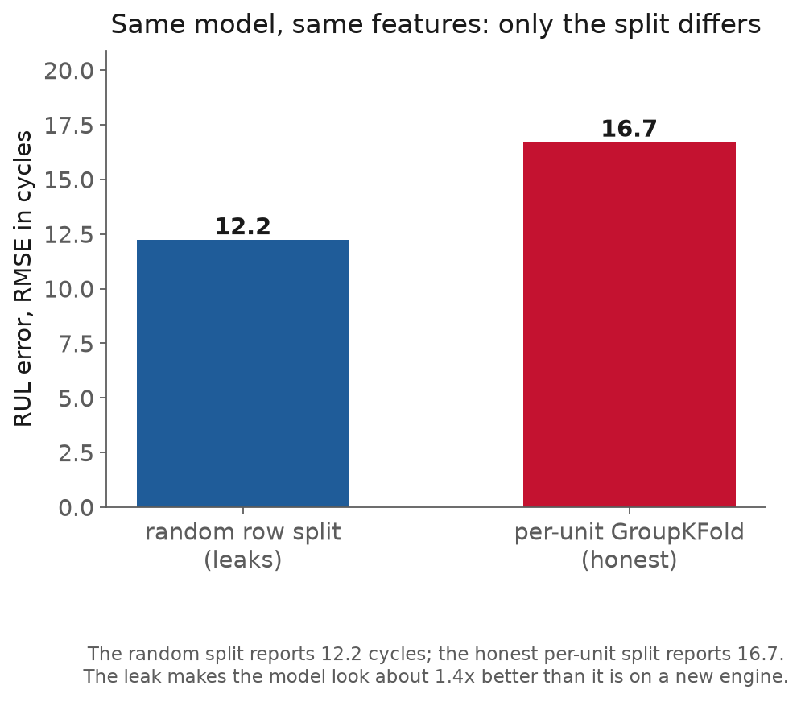
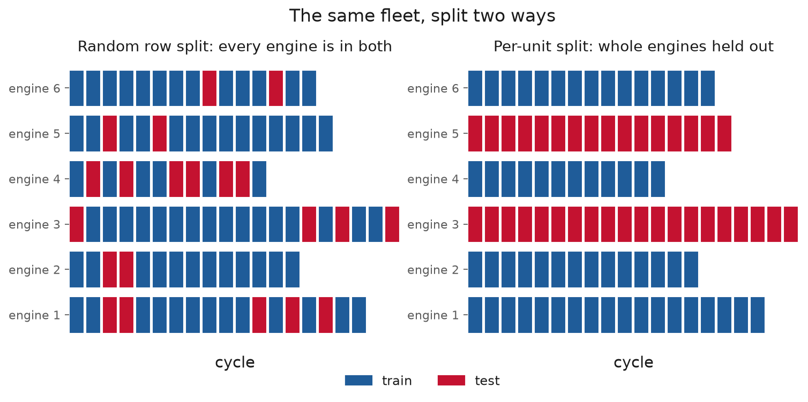

<!-- _class: title -->

# Lecture 8: Data quality, versioning, and leakage-free splits

## Week 4, Data Systems

**Systems and Toolchains for AI Engineers**

---

## Roadmap

1. The split that inflates a score
2. Splits done right
3. A taxonomy of leakage
4. Versioning data and features
5. Documenting a dataset, and iterating on it
6. Where this pushes back
7. Live demo: the leak, then versioning and tracking

---

<!-- _class: section -->

# The split that inflates a score

---

## The split that inflates a score

Lecture 7's scaler leak moved the error by 0.002 cycles, almost invisible.

This one is the opposite: a leak that makes a model look **37% better** than it is, and that you would ship, because the number looks good.

The leak is not in the features or the model. It is in the **split**.

---

## The split that inflates a score, measured

Same C-MAPSS data, same features, same RandomForest. Only the split changes.



Random split: **12.2** cycles. Honest per-unit split: **16.7**. The 12.2 is the score on a problem the model never faces.

---

## The split that inflates a score, why

Consecutive cycles of one engine are almost identical.

A random split drops cycle 150 of an engine into training and cycle 151 into test, so the model is graded on rows it has effectively seen.

The test set has to stand in for **deployment**, which always means a new engine.

---

<!-- _class: section -->

# Splits done right

---

## Splits done right, the one job

A split has one job: make the test set a fair sample of what the model meets in deployment.

C-MAPSS breaks a random shuffle two ways at once:

- **grouped**: every row belongs to one of 100 engines; the question is a new engine
- **temporal**: rows are ordered by cycle; the question is the future

---

## Splits done right, grouped

<div class="definition">

**Grouped split**: assign whole entities (an engine, a patient, a site) entirely to train or to test, so no entity is in both.

</div>

`GroupKFold` "ensures that the same group is not represented in both testing and training sets." `GroupShuffleSplit` holds out a random subset of groups.

[sklearn: cross-validation](https://scikit-learn.org/stable/modules/cross_validation.html)

---



---

## Splits done right, temporal

<div class="definition">

**Temporal split**: train on earlier data, test on later data, so the model is never scored on a time it could have learned from.

</div>

scikit-learn's `TimeSeriesSplit` grows the training window forward; its "successive training sets are supersets of those that come before them."

---

## Splits done right, tuning honestly

Hold out whole engines, and within them respect cycle order.

Tuning hyperparameters needs **nested cross-validation**: an outer split to estimate performance, an inner split (from the outer training data only) to choose the model.

Tuning on the data you report is a milder version of the same leak.

---

<!-- _class: section -->

# A taxonomy of leakage

---

## A taxonomy of leakage, the definition

<div class="definition">

**Leakage**: "the introduction of information about the target of a data mining problem, which should not be legitimately available to mine from" (Kaufman et al., 2012).

</div>

The leaked information will not exist in deployment, so the score does not survive it.

[Kaufman et al., Leakage in Data Mining](https://www.cs.umb.edu/~ding/history/470_670_fall_2011/papers/cs670_Tran_PreferredPaper_LeakingInDataMining.pdf)

---

## A taxonomy of leakage, four shapes

| Kind | What it is | Audit |
|---|---|---|
| target | a feature encodes the label | is its value known at prediction time? |
| contamination | a statistic fit over all data | was test in scope at `.fit()`? |
| temporal | using the future | does feature at *t* use only *t* or earlier? |
| group | same entity in train and test | is the split key the entity? |

---

## A taxonomy of leakage, the metric will not warn you

Your validation score is supposed to tell you the model works.

When the data leaks, it tells you how well the model used information it will not have.

A higher score is then worse news. You find leakage by reasoning about each feature, not by reading the metric.

---

<!-- _class: section -->

# Versioning data and features

---

## Versioning data and features, DVC

Lecture 2 versioned code with git and kept raw data out behind a hash. DVC closes the gap for the data itself.

<div class="definition">

**DVC**: versions large data and model files alongside code. For each file it writes a small `.dvc` metafile holding the content hash and path; git tracks the metafile, the bytes go to a cache and a remote.

</div>

A DVC "remote" can be "just a directory in the local file system," so no cloud is needed. [DVC](https://dvc.org/doc/start/data-management/data-versioning)

---

## Versioning data and features, pin data like code

`dvc add features.parquet` hashes the file, caches it, and writes `features.parquet.dvc`:

```yaml
outs:
  - md5: 22a1a2931c8370d3aeedd7183606fd7f
    path: features.parquet
```

git tracks the hash; checking out an old commit plus `dvc checkout` restores the exact data that went with the code.

---

## Versioning data and features, the pipeline

```yaml
# dvc.yaml
stages:
  featurize:
    cmd: python featurize.py
    deps: [raw/, featurize.py]
    outs: [features.parquet]
```

`dvc repro` re-runs only the stages whose inputs changed. "Rebuild the features from raw data" becomes one reproducible command. [DVC: pipelines](https://dvc.org/doc/user-guide/pipelines)

---

## Versioning data and features, one run one fact

Log the data version next to the run that used it.

An MLflow run should carry:

- the git **SHA** of the code
- the DVC **hash** of the data
- the **seed**

Recreate those three and you recreate the result, from raw inputs to reported number.

---

<!-- _class: section -->

# Documenting a dataset, and iterating on it

---

## Documenting a dataset

<div class="definition">

**Datasheet**: a structured record of a dataset's motivation, composition, collection process, and recommended uses (Gebru et al., 2021): 57 questions across seven sections.

</div>

For engineering data, write down provenance, units, sample rate, calibration, and known issues: C-MAPSS has six constant channels and a withheld test target. [Datasheets for Datasets](https://arxiv.org/abs/1803.09010)

---

## Iterating on the data

<div class="definition">

**Data-centric iteration**: improve the data, labels, and features while holding the model fixed, so any score change is attributable to the data.

</div>

Fix the model and split, change one thing (drop dead channels, correct a label, add a physical feature), and log before and after as two MLflow runs tagged with the two data versions. [MIT: Data-Centric AI](https://dcai.csail.mit.edu/)

---

<!-- _class: section -->

# Where this pushes back

---

## Where this pushes back, a split is not shift

An honest split makes the test set a fair sample of the **same** process.

C-MAPSS FD001 is one simulated condition, so even the honest 16.7 is optimistic for a new site with a different sensor vendor and duty cycle.

Distribution shift is a monitoring problem, later in the course.

---

## Where this pushes back, splits cost data

Holding out whole engines means fewer training entities; a strict temporal split discards the most recent data.

Affordable on 100 engines, painful on 8 patients.

The split still has to be honest, so collect more entities rather than relaxing it.

---

## Where this pushes back, the rest

- **Versioning is bookkeeping**: DVC will faithfully version corrupt data; a hash proves same bytes, not good bytes.
- **A datasheet is unenforced prose**: it can be stale or silent; it is not a pandera schema.
- **Data-centric iteration can overfit the validation set**: many changes against one split slowly tunes the data to it. Keep a rarely-touched test set.

---

<!-- _class: demo -->

# Demo

## `l08-splits-versioning.ipynb`

One RandomForest scored two ways: a random row split (~12 cycles) and a per-unit `GroupKFold` (~17). Count the engines in both halves. Hash the feature file, narrate the DVC workflow, log both runs to MLflow, and run one data-centric change.

---

## What to watch

The two scores.

The leaky split gives the lower error, so it is the one a careless review would ship.

The per-unit split reports the number the model will actually earn on a new engine.

---

## Recap

- The test set must stand in for deployment; a random shuffle breaks that for grouped and time data
- Measured leak on C-MAPSS: 12.2 cycles (random) vs 16.7 (honest), a 37% illusion
- Leakage has four shapes; the metric it corrupts will not warn you
- DVC versions data by content; log the data hash with the code SHA and seed
- A datasheet records what a hash cannot; iterate on the data against a fixed model

---

## Next

**Assignment 4** (from Lecture 7): its dataset-versioning half is now unblocked
**Reading** sklearn cross-validation; Kaufman "Leakage in Data Mining"; DVC docs
**Lecture 9** From trustworthy data to trustworthy models: model selection
and evaluation, standing on an honest split

Full notes, with all sources: `lectures/l08/notes.md`
