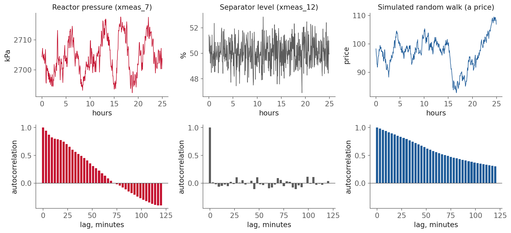
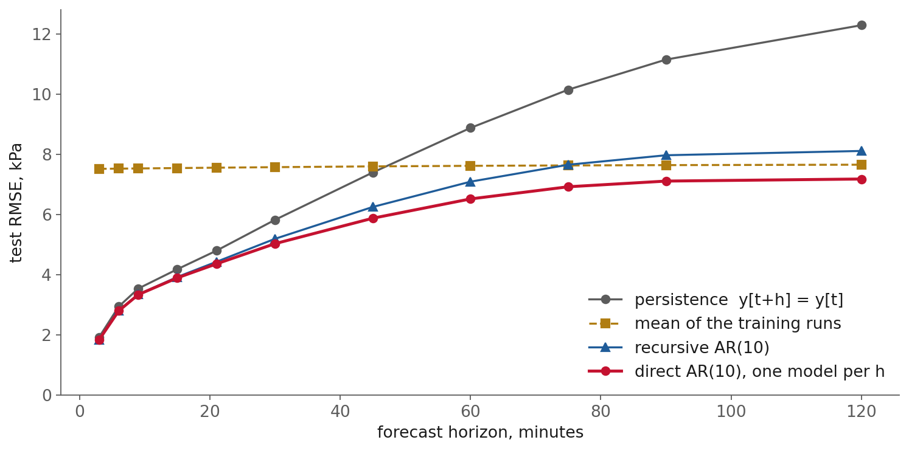
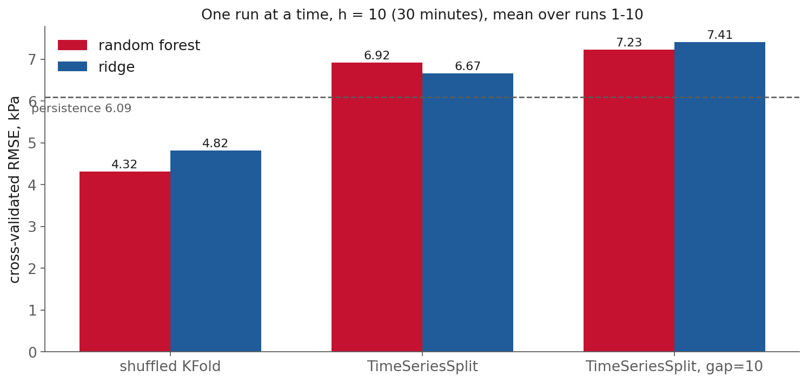
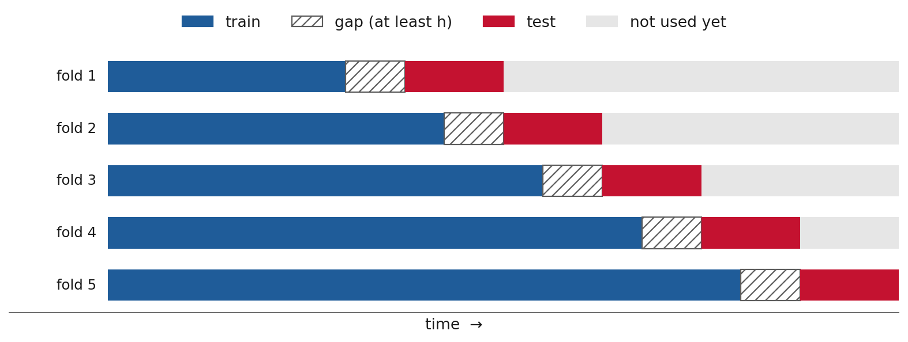
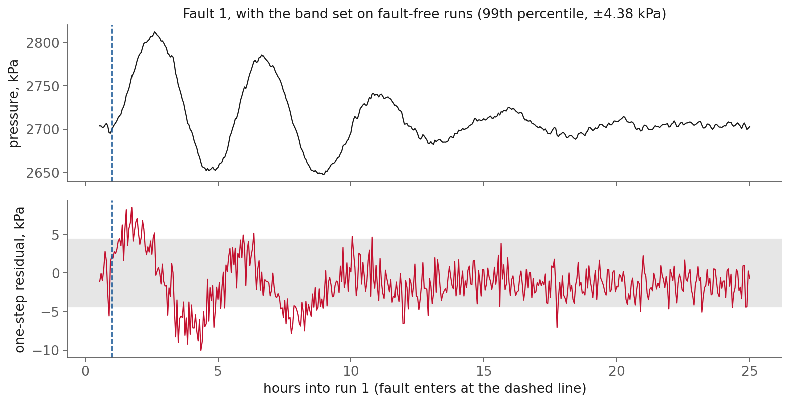

<!-- _class: title -->

# Lecture 8: The machine learning workflow I, time series

## Week 4, Machine learning and deep learning

**Systems and Toolchains for AI Engineers**

<!--
Budget: 90 minutes of lecture, then 20 for the notebook and questions.
Lecture: opening 6, supervised 9, forecastable 14, baselines 17, models 13,
evaluation 15, residuals 8, limitations 5. About 87, with recap and standings
after the notebook.
Abort order if running long: window-features slide, look-ahead/survivorship slide,
the second residual slide.
-->

---

## What today is about

Lecture 7 built a table and fitted a model. **It never asked whether the model was any good.**

Today:

1. Time series as **supervised learning**, with a **horizon**
2. What makes a series **forecastable** at all
3. **Baselines**: better than what?
4. **Direct** and **recursive** forecasts
5. **Evaluating on time**
6. **Residuals** as a detector, and the limits
7. The notebook, then questions

<!--
Roadmap, 1 minute. Say where the demo sits: the lecture runs to the recap, then the last
20 minutes are the notebook and questions.
-->

---

## Why this matters

Fit a one-step model on reactor pressure: predictions hug the data, **R-squared near 0.99**.

- "nothing changes in 3 minutes" is already close to right (Lecture 7)
- most of that score belongs to the free guess
- an operator needs **30 to 60 minutes** of warning, not 3

A model is worth keeping only if it beats the free guesses, **at the horizon somebody needs, on data it never saw.**

<!--
The hook. A one-step model on pressure reports R-squared near 0.99 and is mostly the free
guess. Ask who would sign off on that model. Do not give numbers yet; slide 21 has them.
-->

---

## Why this matters, beyond the plant

| field | the forecast | the free guess that is hard to beat |
|---|---|---|
| process plant | pressure in 30 min | pressure now |
| electricity | load tomorrow at 6 PM | load today at 6 PM |
| finance | price tomorrow | price today |
| weather | temperature tomorrow | the seasonal average |

Same three questions everywhere: **how far ahead, better than what, scored how.**

<!--
One minute. Ask the room for the free guess in their own field before reading the table.
The finance row returns in the clicker on slide 16.
-->

---

<!-- _class: section -->

# Time series as supervised learning

<!--
About 9 minutes for this arc. No new mathematics: L7 already solved a least-squares problem.
-->

---

## Supervised learning

<div class="definition">

**Supervised learning**: fit a function from **features** (what you know) to a **target** (what you want), using rows where both are known.

</div>

- Lecture 7 already did this: `lstsq` on a design matrix
- scikit-learn: every model has `fit(X, y)` and `predict(X)`
- linear model, random forest, boosting: **swap in one line**

<!--
Point back at L7's lstsq. Same step, better bookkeeping. fit/predict is the only new vocabulary,
and the one-line swap between model families is what makes the rest of the course possible.
-->

---

## Supervised learning, two kinds of number

<div class="definition">

**Parameter**: chosen by the fit (the ARX `a` and `b`). **Hyperparameter**: chosen by you before the fit (how many lags, how much penalty).

</div>

- a dataset you used to **choose** hyperparameters is no longer a fair test of them
- so: train fits parameters, **validation** picks hyperparameters, **test** is touched once
- **held-out score**: the error on rows the fit never saw. Lecture 7 never computed one.
- honest only if the held-out rows **look like the future the model will face**, the hard part for a time series

<!--
The consequence is the part students miss: a dataset used to CHOOSE a setting can no longer
measure it. A4 makes them do this for real, nine settings scored on runs 301 to 400.
-->

---

## Supervised learning, the horizon

<div class="definition">

**Forecast horizon** $h$: how many samples ahead the model predicts. At 3 minutes per sample, $h = 10$ is thirty minutes.

</div>

```python
cols = {f"y[t-{k}]": pl.col("xmeas_7").shift(k).over(RUN) for k in range(10)}
cols["target"] = pl.col("xmeas_7").shift(-h).over(RUN)   # the only new line
```

`.over(RUN)`: Lecture 7's run-boundary rule, still required.

<!--
Write y[t+h] on the board. The only code change from L7 is shift(-h). Ask what .over(RUN)
protects against, and let someone say the run boundary.
-->

---

## Supervised learning, what is known at time t

| known at $t$ | not known at $t$ |
|---|---|
| the channel's own past | its future (that is the target) |
| valve positions **now** | valve positions **later** |
| a written setpoint schedule | where the operator will move it |
| tomorrow's **weather forecast** | tomorrow's weather |

Anything in the right column is **leakage**, stretched across $h$ rows.

<!--
The weather row is the one that lands: you may use tomorrow's FORECAST, not tomorrow's weather.
Ask for the plant equivalent; a written setpoint schedule is the answer.
-->

---

<!-- _class: section -->

# What makes a series forecastable

<!--
About 14 minutes. This section decides whether a model is possible at all, before any fitting.
-->

---

## Forecastability, autocorrelation

<div class="definition">

**Autocorrelation** at lag $k$: the correlation between a series and itself shifted by $k$ samples. Near 1, rows $k$ apart are nearly the same.

</div>

- plot it against $k$: the **ACF**
- tells you **before fitting** whether the past can help
- `statsmodels.graphics.tsaplots.plot_acf`, or three lines of numpy

<!--
Ask them to sketch the ACF of a constant series and of pure noise before the next slide.
Thirty seconds, and it makes the next figure readable.
-->

---

## Forecastability, three kinds of series



<span class="source">Pressure and separator level: run 1, <a href="https://doi.org/10.7910/DVN/6C3JR1">Rieth et al. (2017)</a>. Random walk: simulated. <code>figures/make_figures.py</code></span>

<!--
speaker: ask the room to say, for each column, what they would guess for the next sample.
-->

---

## Forecastability, what each one calls for

| series | lag-1 ACF | best simple forecast |
|---|---|---|
| reactor pressure | 0.94, decays by ~75 min | recent past, then the mean |
| separator level | 0.02 | **the mean**: the controller removes every deviation |
| random walk (a price) | 0.98, stays high | **the last value** |
| its changes (returns) | -0.01 | nothing beats zero |

**7 of 22** continuous TEP channels look like separator level: **white noise**.

<!--
Ask the third row before revealing it: the random walk's ACF is 0.98, so is it the easiest to
forecast? The returns line answers it. Same trap as the R-squared of 0.99 in the opening.
-->

---

## Forecastability, stationarity

<div class="definition">

**Stationary**: mean, spread and autocorrelation do not change over time. A plant at an operating point is roughly stationary; a random walk is not.

</div>

- every model here assumes the future looks like the past
- fix for a drifting level: **differencing**, model `y[t] - y[t-1]`
- finance: prices to **returns**; the "I" in **ARIMA**

<!--
Differencing is the fix, and prices to returns is the same move. ARIMA is named here, not
taught; say so, so nobody waits for it.
-->

---

## Forecastability, trend and seasonality

- **Trend**: a sustained change in level (demand growing year on year)
- **Seasonality**: a repeating calendar pattern (load peaks every weekday evening)
- Standard fixes: seasonal differencing, calendar features

A plant at an operating point has **mostly neither**.
A daily cycle there usually has a measured cause (cooling water temperature): **put that column in the table, not the hour.**

<span class="source"><a href="https://otexts.com/fpp3/stationarity.html">Hyndman and Athanasopoulos, FPP3, section 9.1</a></span>

<!--
A continuous plant has no weekly seasonality. Its daily cycle is usually cooling water
temperature, so put the measured channel in the table rather than the hour of the day.
-->

---

## Forecastability, a question

<div class="clicker" data-tag="l08-random-walk" data-seconds="45" data-answer="B" data-hint="Look at the random walk column on the table three slides back. What is its best simple forecast?" data-why="B. A random walk's changes are white noise, so the last value is already close to the best possible forecast. Losing to persistence there says the price is hard to predict, not that the code is wrong." data-read="https://clicker.f26-06763.workers.dev">
<div class="clicker-main">

**A stock price behaves like a random walk. On a held-out year, persistence beats your fitted model. What is the most likely explanation?**

<ol class="clicker-opts">
<li>The model has a bug</li>
<li>The price changes are close to unpredictable</li>
<li>The model needs more lags</li>
<li>Persistence is the wrong baseline for prices</li>
</ol>

</div>
<aside class="clicker-panel">

<div class="clicker-url">clicker.f26-06763.workers.dev</div>
<button class="clicker-start">Start voting</button>
<div class="clicker-timer">45</div>
<div class="clicker-count">no votes yet</div>
</aside>
</div>

<!--
Tests whether a random walk is read as "persistence is near optimal". A tempts students
who assume a loss to a baseline means broken code; D tempts those who think the mean
should be used, which is useless on a drifting level.
-->

---

<!-- _class: section -->

# Baselines and skill

<!--
About 17 minutes. The core of the session: everything here is what makes a score mean something.
-->

---

## Baselines

<div class="definition">

**Persistence** (the naive forecast): `y[t+h] = y[t]`. Lecture 7 used it without the name.

</div>

| baseline | forecast | where it is strong |
|---|---|---|
| persistence | the last value | short horizons, random walks |
| mean | the training average | long horizons, white noise |
| seasonal naive | the value one season ago | load, retail |
| drift | the average past change, extended | trending series |

<span class="source"><a href="https://otexts.com/fpp3/simple-methods.html">FPP3, section 5.2</a></span>

<!--
L7 used persistence without naming it. Ask which baseline they would pick for a stock price,
a load curve, and a controlled level, and let the disagreement stand until the next slide.
-->

---

## Baselines, which one wins

For a stationary series with spread $\sigma$ and autocorrelation $\rho_h$:

$$\text{RMSE}_{\text{mean}} = \sigma \qquad \text{RMSE}_{\text{persistence}}(h) = \sigma\sqrt{2(1-\rho_h)}$$

- persistence wins **exactly when $\rho_h > 0.5$**
- white noise ($\rho_h = 0$): persistence is $\sqrt{2} = 1.41\times$ worse; separator level measures **1.415**
- negative $\rho_h$: persistence bets on the wrong side of the swing

<!--
speaker: the ACF you just looked at tells you the crossover before any fitting.
-->

---

## Baselines, reactor pressure



<span class="source">Train runs 1 to 300, test runs 401 to 500. Test standard deviation 7.51 kPa. <code>figures/make_figures.py</code></span>

<!--
Walk the four curves, do not just show them. Persistence rises 1.92 to 12.29 kPa; the mean is
flat at about 7.5; they cross between 45 and 60 minutes. The model sits under both and is
closest to them at the two ends. Recursive passes the mean past about 75 minutes, which sets
up the next section.
-->

---

## Baselines, reactor pressure, the numbers

| horizon | persistence | mean | direct model | skill |
|---|---|---|---|---|
| 3 min | **1.92** | 7.51 | 1.83 | 5 % |
| 30 min | 5.82 | 7.57 | 5.02 | 14 % |
| 45 min | 7.39 | 7.59 | 5.87 | **21 %** |
| 120 min | 12.29 | **7.65** | 7.17 | 6 % |

RMSE in kPa. The model earns most **where neither free guess is good**.

<!--
Read the 5 % row and the 21 % row aloud. The model earns least where a free guess is already
good, and most where neither one is.
-->

---

## Baselines, skill scores

<div class="definition">

**Skill score**: $1 - \text{RMSE}_{\text{model}} / \text{RMSE}_{\text{reference}}$. Zero is no better than the reference; negative is worse.

</div>

- reference = the **better** baseline at that horizon
- **MASE**: mean absolute error divided by the in-sample one-step naive error; below 1 beats naive, unitless, averages across series
- also report **kPa**: an operator can judge 5.0 kPa, not 0.14

<span class="source"><a href="https://robjhyndman.com/papers/mase.pdf">Hyndman and Koehler (2006)</a>, author's copy</span>

<!--
The reference is the BETTER baseline at that horizon. MASE if asked: scale-free, below 1 beats
the naive forecast. Always say the kPa as well; an operator can judge 5 kPa, not 0.14.
-->

---

## Baselines, a question

<div class="clicker" data-tag="l08-r2-baseline" data-seconds="45" data-answer="C" data-hint="Which free forecast is strongest three minutes out?" data-why="C. At one step, persistence is already within 1.92 kPa on pressure, so an R-squared near 0.99 is mostly persistence. The model is only as good as its margin over that." data-read="https://clicker.f26-06763.workers.dev">
<div class="clicker-main">

**Your one-step pressure model scores R-squared 0.99 on held-out runs. What should you compare it with first?**

<ol class="clicker-opts">
<li>The R-squared on the training runs</li>
<li>A larger model with more lags</li>
<li>Persistence at the same horizon</li>
<li>The mean of the training runs</li>
</ol>

</div>
<aside class="clicker-panel">

<div class="clicker-url">clicker.f26-06763.workers.dev</div>
<button class="clicker-start">Start voting</button>
<div class="clicker-timer">45</div>
<div class="clicker-count">no votes yet</div>
</aside>
</div>

<!--
D is a real baseline but the weak one at 3 minutes (7.51 against 1.92), which is the point.
-->

---

## Baselines, case study: Meese and Rogoff

Exchange-rate models of the 1970s (money supply, interest rates, trade balances):

- forecast 1 to 12 months ahead, re-fit with **rolling regressions** (only past data)
- reference: a **random walk**
- "a random walk model would have **outperformed all the other models**"
- also lost: univariate models, a VAR, optimal combinations of the forecasts

They fitted history well. **Only the baseline comparison showed they could not forecast.**

<span class="source"><a href="https://www.federalreserve.gov/pubs/ifdp/1981/184/ifdp184.pdf">Meese and Rogoff, Fed IFDP 184 (1981)</a>, the working paper of the 1983 J. Int. Econ. article</span>

<!--
The quote is the slide. Note the rolling regressions: rolling-origin evaluation, in 1983.
Ask why beating a random walk on exchange rates is so hard, and link back to slide 13.
-->

---

## Baselines, case study: the M4 competition

100,000 real series, every team scored the same way. Benchmarks included **Naïve2** and **Comb** (three simple exponential smoothers).

- 12 of the 17 most accurate methods: combinations of mostly statistical methods
- the six pure ML methods: **none beat Comb, one beat Naïve2**
- best surprise: a statistical/ML **hybrid**, about 10 % better than Comb

<span class="source"><a href="https://econpapers.repec.org/RePEc:eee:intfor:v:34:y:2018:i:4:p:802-808">Makridakis, Spiliotis and Assimakopoulos (2018), IJF 34, abstract</a></span>

<!--
speaker, the takeaway for both case studies: report persistence and the mean at every
horizon you claim, beat the better one or say you did not, and if you did not, ship the
baseline. It is cheap, cannot overfit, and needs no maintenance.
-->

---

<!-- _class: section -->

# Model families and multi-step strategies

<!--
About 13 minutes.
-->

---

## Model families

| route | examples | strengths |
|---|---|---|
| statistics and control | AR, ARX, **ARIMA**, state space | small, well understood, standard errors |
| reduction to regression | lag table + ridge, forest, boosting | any regressor, many inputs, nonlinear |

- they meet at the linear model: ridge on 10 lags **is** an AR(10)
- `statsmodels` for the first route, scikit-learn and `skforecast` for the second

<span class="source"><a href="https://www.statsmodels.org/stable/tsa.html">statsmodels tsa</a> · <a href="https://scikit-learn.org/stable/auto_examples/applications/plot_time_series_lagged_features.html">scikit-learn lagged features</a></span>

<!--
Two routes that meet at the linear model: ridge on ten lags IS an AR(10). ARIMA is named only.
-->

---

## Model families, ridge and scaling

- lag columns are near-copies (0.996 on pressure, Lecture 7)
- **ridge** penalizes coefficient size, which stabilizes the fit
- the penalty is unit-dependent: **scaling now changes the answer**
- fit the scaler on training rows only, so put it in the pipeline

```python
model = make_pipeline(StandardScaler(), Ridge(alpha=1.0))
model.fit(X_train, y_train)     # scaler sees training rows only
```

<!--
Contrast with L7: plain least squares does not care about scale, ridge does, because the penalty
is in the coefficients' units. The pipeline makes the rule structural rather than remembered.
-->

---

## Multi-step strategies

<div class="definition">

**Direct**: one model per horizon, trained on `y[t+h]`. **Recursive**: one model for `y[t+1]`, applied $h$ times, feeding each prediction back in.

</div>

- recursive: one model, the whole path, **but it runs on its own guesses**
- errors compound: this is "running free" from Lecture 7
- recursive needs the whole future input path `u[t+1] ... u[t+h-1]`; **direct needs only what is known at t**

<!--
Ask how to reach 10 steps with a one-step model. Someone will say iterate. That is the recursive
strategy, and the question of what it is standing on at step 7 follows by itself.

The input line needs saying out loud, because the bullet is compressed. Write the two steps up:
  y[t+1] = f(y[t], y[t-1], ..., u[t])
  y[t+2] = f(y[t+1], y[t], ..., u[t+1])   <- u[t+1] does not exist yet
You have the prediction for y[t+1]; you do not have the valve positions three minutes from now,
because the controller has not moved them. Four ways out, and we take the last: forecast the
valves too (a second model, errors compounding twice, and the controller reacts to exactly what
you are forecasting); freeze them at u[t] (assumes the controller does nothing for two hours,
and it is no longer the model you fitted); use a plan, which is legitimate when a setpoint
schedule or a recipe exists, the same exception as tomorrow's weather forecast; or drop the
inputs, which is what our recursive model does, lags of pressure only.

That is why direct can take the valves and gain something real: 5.02 kPa to 4.71 at 30 minutes.
A4 section 4 asks students for this argument.
-->

---

## Multi-step strategies, measured

| horizon | direct | recursive | mean |
|---|---|---|---|
| 3 min | 1.83 | 1.83 | 7.51 |
| 30 min | 5.02 | 5.19 | 7.57 |
| 60 min | 6.51 | 7.08 | 7.61 |
| 120 min | **7.17** | 8.11 | 7.65 |

Test RMSE in kPa, runs 401 to 500. Same 10 lags, same ridge.
At two hours, **recursive is worse than the mean**.
Adding the 11 current valve positions to direct: 5.02 to **4.71** kPa at 30 min.

<!--
Say the units: every number in the table is a test RMSE in kPa, on the held-out runs, against a
channel whose own spread is 7.51 kPa. At two hours the recursive forecast (8.11) is worse than
simply predicting the mean (7.65). Direct costs one model per horizon, which for a linear model
is nothing.
-->

---

## Multi-step strategies, not a law

On the 111 series of the NN5 competition, **recursive beat direct**.

- best there: **multi-output** strategies that predict the whole horizon at once
- seasonal adjustment helped in 38 of 39 models
- so: **measure both on your data**

<span class="source"><a href="https://arxiv.org/abs/1108.3259">Taieb, Bontempi, Atiya and Sorjamaa (2012)</a>, arXiv preprint</span>

<!--
Hold this line: our data says direct, the NN5 competition says recursive. The transferable rule
is to measure both, not to memorize a winner.
-->

---

## Multi-step strategies, window features

Lecture 7 showed `rolling_mean`. The open question was the **window length**.

| window | follows | costs |
|---|---|---|
| short | the latest move | carries the noise |
| long | the level | lags behind a change |

The horizon is the criterion: try two or three lengths, **keep what lowers the held-out error at your $h$.**

<!-- speaker: first slide to cut if running long -->

---

<!-- _class: section -->

# Evaluating on time

<!--
About 15 minutes, and the notebook runs it again afterwards.
-->

---

## Evaluating on time, why shuffling leaks

- **K-fold**: shuffle rows, hold out a fifth, repeat
- neighbouring rows are near-copies (the ACF)
- shuffled, each test row has neighbours **before and after** it in training
- a flexible model recalls them

The score measures **how densely you sampled**, not how well you forecast. Lecture 7 named this **train-test contamination**.

<!--
Ask where a test row's neighbours end up after shuffling. Three minutes either side, in the
training set. The ACF from slide 12 is why that matters.
-->

---

## Evaluating on time, measured



<span class="source">One run at a time, $h = 10$, pressure lags and valves, mean of runs 1 to 10. <code>figures/make_figures.py</code></span>

<!--
Let the room read the bars before you say anything.
-->

---

## Evaluating on time, what the bars say

- shuffled: forest **4.32**, ridge 4.82, both far below persistence (~6.1)
- time-ordered: forest **6.92**, ridge 6.67, **both worse than persistence**
- one says "ship it", the other says "don't"

**The boundary**: pooled over 200 independent runs, ridge scores 4.74 shuffled and 4.71 by run. K-fold is valid for a purely autoregressive model with uncorrelated errors.
Shuffling bites hardest on **one short series, a flexible model, correlated errors**.

<span class="source"><a href="https://robjhyndman.com/papers/cv-wp.pdf">Bergmeir, Hyndman and Koo (2018)</a>, author's copy</span>

<!--
The honest split says do not ship this model. Then give the boundary immediately: pooled over
200 runs, ridge scores 4.74 shuffled against 4.71 by run. Nobody should leave thinking a shuffled
split is always fatal; it bites on one short series with a flexible model.
-->

---

## Evaluating on time, rolling origin

<div class="definition">

**Rolling origin** (forward chaining, backtesting): train up to a cutoff, test on the block after it, move the cutoff forward, repeat.

</div>



<!--
Point at the training block growing fold by fold. Every test block lies after its training block.
-->

---

## Evaluating on time, the gap

- a row at $t$ has target `y[t+h]`
- the last training rows have targets **inside** the test block
- fix: skip at least $h$ samples

```python
from sklearn.model_selection import TimeSeriesSplit
cv = TimeSeriesSplit(n_splits=5, gap=h)
```

Many series (runs, meters, stocks): **hold whole series out**, as with runs 401 to 500.

<span class="source"><a href="https://scikit-learn.org/stable/modules/generated/sklearn.model_selection.TimeSeriesSplit.html"><code>TimeSeriesSplit</code>, the <code>gap</code> parameter</a></span>

<!--
Derive it rather than assert it: a row at t has its target at t+h, so the last h training rows
have targets inside the test block. The clicker on the next slide asks exactly this.
-->

---

## Evaluating on time, a question

<div class="clicker" data-tag="l08-gap" data-seconds="60" data-answer="D" data-hint="Row t has target y[t+10]. Which t put that target at 301 or later?" data-why="D. A row at t has target y[t+10], which reaches sample 301 or later when t is at least 291. Those ten training targets sit inside the test block, so the gap must be at least h = 10." data-read="https://clicker.f26-06763.workers.dev">
<div class="clicker-main">

**Horizon $h = 10$. Training rows end at sample 300; test rows start at 301, with no gap. Which training rows have targets inside the test block?**

<ol class="clicker-opts">
<li>None of them</li>
<li>Only row 300</li>
<li>All of them</li>
<li>Rows 291 to 300</li>
</ol>

</div>
<aside class="clicker-panel">

<div class="clicker-url">clicker.f26-06763.workers.dev</div>
<button class="clicker-start">Start voting</button>
<div class="clicker-timer">60</div>
<div class="clicker-count">no votes yet</div>
</aside>
</div>

<!--
B tempts students who picture h = 1. A tempts students who think a time-ordered split is
automatically clean.
-->

---

## Evaluating on time, names from finance

| bias | in a backtest | in a plant |
|---|---|---|
| **look-ahead** | using data not available on the decision date | a shuffled split, a future valve |
| **survivorship** | testing on today's index members only | keeping only the runs where nothing went wrong |

Both inflate the score. Neither raises an error.

<!-- speaker: second slide to cut if running long -->

---


<!-- _class: section -->

# Residuals: diagnosis and detection

<!--
speaker, say this over the divider: a residual is measurement minus prediction. A good
forecaster leaves white noise, so plot the residual ACF. A spike at one lag means a missing
feature at that lag; a slow decay means a missing input. The notes carry the details.
-->

---

## Residuals, as a detector

<div class="definition">

**Anomaly detection**: flag observations that do not fit normal data. A residual detector alarms when the forecast error leaves its normal range.

</div>

1. fit on normal data
2. set the threshold on **other** normal data (99th percentile of the absolute residual)
3. alarm when a new residual exceeds it

Pressure, one step: residual sd **1.70 kPa**, threshold **4.38 kPa**. No fault examples needed.

<!--
The threshold comes from held-out fault-free runs, never from the training residuals. Residual
sd 1.70 kPa, 99th percentile 4.38. No fault examples are needed anywhere in this recipe.
-->

---

## Residuals, false alarms

<div class="definition">

**False-alarm rate**: how often it fires on normal data. **Detection delay**: time from fault onset to first alarm. Lowering one raises the other.

</div>

- 99th percentile means **1 %** of normal samples exceed it
- 480 samples a day, so **4.8 false alarms a day**
- require 3 in a row: **0.01 a day**, at the cost of delay

<!--
Do the arithmetic out loud: 1 % of 480 samples a day is 4.8 false alarms a day, and an operator
will mute that within a week. Three in a row drops it to 0.01 a day, for at least six minutes of delay.
-->

---

## Residuals, one fault



<span class="source">Fault 1 (A/C feed ratio step), run 1, faulty training file of <a href="https://doi.org/10.7910/DVN/6C3JR1">Rieth et al. (2017)</a>. 3-in-a-row alarm 45 min after onset.</span>

<!--
Fault 1 is a step in the A/C feed ratio, one hour into the run. The three-in-a-row detector fires
45 minutes after onset. Let them look before you explain the residual returning to the band.
-->

---

## Residuals, what the fault shows

- pressure swings **100 kPa**; the residual only 5 to 10: it reacts to **surprise**, not distance
- the residual returns to the band while the fault is **still there**: the controller compensated
- across 20 faults on this channel: alarm within an hour for **1, 7, 12**; never for **2, 3, 4, 9, 10, 11, 15, 16**

One channel sees only what that channel sees.

<!-- speaker: third cut if running long -->

---

## Limitations, when a forecaster fails

| failure | what happens | what helps |
|---|---|---|
| **regime change** | new grade, catalyst, market | watch residuals, retrain |
| **feedback** | controller (Lecture 7), traders acting on forecasts | log setpoints, retrain after retuning |
| **unseen faults** | extrapolation from a regime never trained on | detect, do not forecast through |
| **horizon ceiling** | pressure skill 6 % at two hours | the ACF shows it before fitting |

Each one returns a **confident number**, not an error.

<!--
Every row of this table returns a confident number and no error message. The feedback row is
L7's closed-loop case arriving again.
-->

---

<!-- _class: demo -->

# Demo

## `l08-forecasting.ipynb`

Reactor pressure, 500 runs. Build the horizon table, score persistence and the mean,
fit direct and recursive, then shuffle and don't.

<!--
The last 20 minutes, notebook then questions. Pause at "stop and predict" before
the baseline table prints. The last cell takes about 15 seconds.
-->

---

## Recap

- A forecast is supervised learning with a **horizon**: features at $t$, target at $t+h$
- The **ACF** says whether the past can help; white noise and random walks have simple best forecasts
- Beat the **better** of persistence and the mean, at every $h$; persistence wins while $\rho_h > 0.5$
- **Direct** beat **recursive** on pressure; measure both
- **TimeSeriesSplit(gap=h)**, or split by series; a shuffled score flattered two models past persistence
- Residuals are a detector; the threshold sets the **false alarms**

<!--
Land these six lines fast, then go to the notebook. The last 20 minutes are demo plus questions.
-->

---

## Standings

Nicknames only. Everyone who skipped one still counted in every bar you saw.

<div class="clicker-leaderboard"
     data-read="https://clicker.f26-06763.workers.dev"
     data-top="8"
     data-hours="6"
     data-title="Standings"></div>

<!--
Skip this slide if no clicker questions were run.
-->

---

## Next

**Assignment 4** is released today, due **2026-09-28**: an h-step forecaster for stripper temperature
**Practice module** for this session, for participation credit
**Reading** FPP3 chapter 5, <https://otexts.com/fpp3/toolbox.html>

Full notes, with all sources: `lectures/l08/notes.md`

<script src="clicker-slide.js"></script>

<!--
A4 is released today and due 09-28. The data is a 25 MB Parquet from kitchin-services; the link
is in the assignment, and the checksum check is one line.
-->
