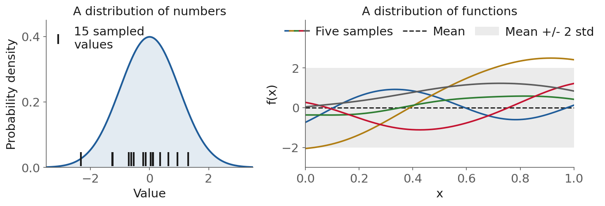
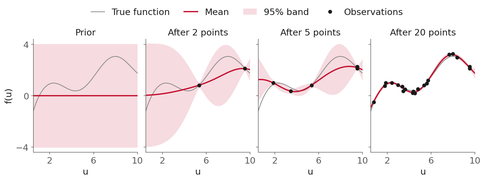

<style>
/* L9: a figure alone in its paragraph is centered, and so is every table. */
section p:has(> img:only-child) { text-align: center; }
section table { margin-left: auto; margin-right: auto; }

/* the regularization slider */
.reg-widget { font-size: 22px; }
.reg-controls { display: flex; gap: 1.4em; align-items: center; justify-content: center; margin: 0.2em 0; }
.reg-controls input[type=range] { width: 360px; accent-color: #c41230; }
.reg-readout { text-align: center; color: #5c5c5c; margin-top: 0.2em; }
.reg-widget svg { display: block; margin: 0 auto; }

/* the annotated optimization problem */
.opt-ann { position: relative; width: 1100px; height: 390px; margin: 0 auto; }
.opt-ann svg.opt-svg { position: absolute; left: 0; top: 0; }
.opt-ann ul { list-style: none; margin: 0; padding: 0; }
.opt-ann li { position: absolute; font-size: 21px; line-height: 1.3; background: #f7f7f7;
  border-left: 5px solid #5c5c5c; border-radius: 0 6px 6px 0; padding: 6px 12px; margin: 0; }
.opt-ann li:nth-child(1) { left: 0; top: 262px; width: 270px; border-color: #1f5c99; }
.opt-ann li:nth-child(2) { left: 655px; top: 40px; width: 430px; border-color: #c41230; }
.opt-ann li:nth-child(3) { left: 655px; top: 170px; width: 430px; border-color: #2e7d32; }
.opt-ann li:nth-child(4) { left: 655px; top: 285px; width: 430px; border-color: #b07d12; }
.opt-ann .arr { opacity: 0; transition: opacity 0.3s; }
section:not(:has([data-bespoke-marp-fragment])) .opt-ann .arr { opacity: 1; }
section:has(.opt-ann li[data-marpit-fragment="1"][data-bespoke-marp-fragment="active"]) .opt-ann .arr1,
section:has(.opt-ann li[data-marpit-fragment="2"][data-bespoke-marp-fragment="active"]) .opt-ann .arr2,
section:has(.opt-ann li[data-marpit-fragment="3"][data-bespoke-marp-fragment="active"]) .opt-ann .arr3,
section:has(.opt-ann li[data-marpit-fragment="4"][data-bespoke-marp-fragment="active"]) .opt-ann .arr4 { opacity: 1; }

/* the network, with the previous slide's equation built beside it one unit at a time */
.nn-ann { position: relative; width: 1100px; height: 390px; margin: 0 auto; }
.nn-ann svg.nn-svg { position: absolute; left: 20px; top: 0; }
.nn-ann ul { list-style: none; margin: 0; padding: 0; }
.nn-ann li { position: absolute; left: 690px; margin: 0; font-size: 30px; line-height: 1.2; white-space: nowrap; }
.nn-ann li:nth-child(1) { top: 50px; color: #1f5c99; }
.nn-ann li:nth-child(2) { top: 145px; color: #b07d12; }
.nn-ann li:nth-child(3) { top: 240px; color: #2e7d32; }
.nn-ann li:nth-child(4) { top: 290px; color: #c41230; }
.nn-ann li:nth-child(5) { top: 334px; width: 360px; padding-top: 4px; border-top: 2px solid #1a1a1a; color: #1a1a1a; }
/* only the unit whose term was just written glows, as a neuron firing; a static render shows none */
.nn-ann .lit { opacity: 0; transition: opacity 0.3s; }
section:has(.nn-ann li[data-marpit-fragment="1"][data-bespoke-marp-fragment="active"]):not(:has(.nn-ann li[data-marpit-fragment="2"][data-bespoke-marp-fragment="active"])) .nn-ann .lit1,
section:has(.nn-ann li[data-marpit-fragment="2"][data-bespoke-marp-fragment="active"]):not(:has(.nn-ann li[data-marpit-fragment="3"][data-bespoke-marp-fragment="active"])) .nn-ann .lit2,
section:has(.nn-ann li[data-marpit-fragment="3"][data-bespoke-marp-fragment="active"]):not(:has(.nn-ann li[data-marpit-fragment="4"][data-bespoke-marp-fragment="active"])) .nn-ann .lit3,
section:has(.nn-ann li[data-marpit-fragment="4"][data-bespoke-marp-fragment="active"]):not(:has(.nn-ann li[data-marpit-fragment="5"][data-bespoke-marp-fragment="active"])) .nn-ann .lit4,
section:has(.nn-ann li[data-marpit-fragment="5"][data-bespoke-marp-fragment="active"]) .nn-ann .lit5 { opacity: 1; }

/* layouts used by this deck */
.cols { display: grid; gap: 1.1em; align-items: center; }
.cols-xkcd { grid-template-columns: 1.35fr 1fr; font-size: 0.86em; }
.cols-xkcd p:has(> img:only-child) { margin: 0; }
.cols-even { grid-template-columns: 1fr 1fr; }
.cols-hook { grid-template-columns: 1.1fr 1fr; font-size: 0.88em; }
.cols-lc { grid-template-columns: 1.2fr 1fr; }
.cards { display: grid; grid-template-columns: repeat(4, 1fr); gap: 16px; margin-top: 0.3em; }
.card { background: #f7f7f7; border-top: 5px solid #c41230; border-radius: 6px; padding: 10px 12px; font-size: 0.66em; }
.card:nth-child(2) { border-top-color: #1f5c99; }
.card:nth-child(3) { border-top-color: #b07d12; }
.card:nth-child(4) { border-top-color: #2e7d32; }
.card img { width: 100%; display: block; margin: 0 auto 4px; }
.card h4 { margin: 4px 0 2px; font-size: 1.25em; }
.card ul { margin: 0; padding-left: 1.1em; }
.card li { margin: 2px 0; }
.cards-defs .card { font-size: 0.6em; }
.toys { display: flex; align-items: center; justify-content: center; gap: 18px; margin-top: 14px; font-size: 0.68em; color: #5c5c5c; }
.toys img { height: 96px; margin: 0; }
</style>

<!-- _class: title -->

# Lecture 9: The machine learning workflow II, regression

## Week 5, Machine learning and deep learning

**Systems and Toolchains for AI Engineers**

<!--
Budget (110 minutes): lecture 90, then questions for 20. The notebook is a worked example the
students run after class, not shown live. The miniproject problem statement is shown from the
course site, not from this deck.
Plan, by slide: opening and the examples (2-7) 9, types (9-12) 5, workflow (14-17) 6, training as
optimization (19-23) 9, regression families (25-52) 36, cross-validation (54-59) 7, capacity
(61-63) 5, limitations and the close (65-69) 5.
That is about 82 minutes at a steady pace. If it runs long, cut in this order: the optimizer paths
(23, one sentence), what each training solves (48), the kernel and prediction slide (43, the notes
carry it), the NARX forecast figure (52).
-->

---

## What today is about

<div class="cols cols-xkcd">
<div>

Lecture 8: a time series, where **order in time** decided everything. Today: mostly rows with **no time order**, one experiment each.

1. Four **examples**, and the **types** of machine learning
2. The **workflow**, and **training as optimization**
3. **Regression**: linear, trees, neural networks, Gaussian processes, NARX
4. **Cross-validation** and **model capacity**
5. **Limitations**, and one question left open
6. The **worked example**, to run after class

</div>
<div>


<span class="source"><a href="https://xkcd.com/1838/">xkcd 1838</a>, Randall Munroe, CC BY-NC 2.5</span>

</div>
</div>

<!--
Let them read the comic. "Just stir the pile until they start looking right" is the failure this
session is about. ML: building models that learn patterns from data; instead of explicitly
programming rules of physics/nature, we train algorithms to generalize from examples.
-->

---

## Why this matters, what stirring the pile looks like

Water sealed in a rigid container: how fast does its pressure rise as it heats? Data from **NIST** (National Institute of Standards and Technology)

<div class="cols cols-hook">
<div>


</div>
<div>

- Fit a third-degree polynomial, $P = a_3 T^3 + a_2 T^2 + a_1 T + a_0$, to 16 of the 21 points
- Training $R^2$ = **0.9999975**
- At 300 °C it says **223 MPa**; NIST says **517.7 MPa**
- The score only measured the model **where the data is**

</div>
</div>

<span class="source"><a href="https://webbook.nist.gov/chemistry/fluid/">NIST Chemistry WebBook</a>, from the IAPWS-95 equation of state for water</span>

<!--
"Constant density" is the physics: a fixed mass of liquid water in a sealed, rigid container, so
its density stays at 1000 kg/m3. It cannot expand when heated, so the pressure climbs steeply,
from about 0.4 MPa near 0 C to about 100 MPa (roughly 1000 atm) at 100 C. This is the first of
today's examples; it comes back for feature engineering, regularization, the first tree, and at
the end for what every family does outside its data.
-->

---

## Today's examples, surfactant viscosity

<style scoped>.cols { font-size: 0.8em; grid-template-columns: 0.9fr 1fr; }</style>

<div class="cols cols-even">
<div>


</div>
<div>

- **Wormlike micelles**: a surfactant with a salt self-assembles into long, tangled micelles that behave like polymer chains
- **Zero-shear viscosity**: the viscosity at rest, as the shear rate goes to zero
- It sets how thick the fluid is: shampoos, fracturing fluids, drag reduction
- As salt is added the viscosity climbs **about 400-fold** to a sharp peak, then falls
- 16 experiments: our **Gaussian process** case study

</div>
</div>

<span class="source"><a href="https://doi.org/10.1021/j100327a031">Rehage and Hoffmann (1988)</a>, cetylpyridinium chloride with sodium salicylate; points from a GP design of experiments (<a href="https://kitchingroup.cheme.cmu.edu/s20-06681/08-nonlinear-sklearn/08-nonlinear-sklearn.html">Kitchin group</a>)</span>

<!--
Why the peak: salt binding screens the headgroup charges, so spherical micelles grow into long
worms and the viscosity climbs; beyond the peak the viscosity falls, commonly attributed to the
worms branching or shortening (which of the two is still debated, Ziserman et al. 2009). The
concentration axis is most likely the salt, in mmol/L, at a fixed surfactant concentration; the
course notes that supply the data label it salt concentration.
-->

---

## Today's examples, concrete strength

<style scoped>.cols { font-size: 0.78em; grid-template-columns: 0.9fr 1fr; }</style>

<div class="cols cols-even">
<div>


</div>
<div>

- **Compressive strength**: the stress (MPa) at which a cured cylinder crushes in a test machine; designs specify it at **28 days**
- **The data** (Yeh 1998): 1,030 lab tests; each row is **one mix, crushed at one age** (1 to 365 days)
- **Inputs**: 7 ingredients (kg/m³: cement, slag, fly ash, water, superplasticizer, coarse and fine aggregate) and the age
- **The figure**: a gray dot is one crushed specimen; a colored line follows one mix as it ages

</div>
</div>

<span class="source"><a href="https://archive.ics.uci.edu/dataset/165/concrete+compressive+strength">Yeh (1998), UCI, CC BY 4.0</a> / <a href="https://www.nrmca.org/wp-content/uploads/2021/01/35pr.pdf">NRMCA, testing compressive strength</a></span>

<!--
Only 428 distinct mixes: most were crushed at several ages, which matters for the folds in the
cross-validation section. High-performance concrete: concrete meeting performance and uniformity
requirements that conventional ingredients and practice cannot always achieve (ACI).
-->

---

## Today's examples, the Tennessee Eastman process (TEP)


- Lecture 8's simulated plant: **52 channels**; each row is one 3-minute sample of a run, so rows are **split by run**
- Today's job: **forecast** the reactor pressure 30 minutes ahead (**NARX**, Lecture 7's model on lagged outputs and inputs)

<span class="source"><a href="https://doi.org/10.7910/DVN/6C3JR1">Rieth et al. (2017)</a>, CC0</span>

---

## Today's examples

<div class="cards">
<div class="card"><h4>Water</h4><ul><li>NIST, 21 temperatures</li><li>Feature engineering, extrapolation</li></ul></div>
<div class="card"><h4>Surfactant</h4><ul><li>16 experiments</li><li>Gaussian processes</li></ul></div>
<div class="card"><h4>Concrete</h4><ul><li>1,030 rows, 428 mixes</li><li>Comparing models, cross-validation</li></ul></div>
<div class="card"><h4>Tennessee Eastman</h4><ul><li>Lecture 8's plant</li><li>NARX forecasts</li></ul></div>
</div>

<div class="toys">
<span><b>Plus one synthetic set</b>, where the truth is known: <b>y = x<sup>1/3</sup> + noise</b>, for neural networks</span>
</div>

---

<!-- _class: section -->

# Types of machine learning

---

## Types of machine learning


<span class="source"><a href="https://doi.org/10.3389/fphar.2021.720694">Peng, Jury, Dönnes and Ciurtin (2021)</a>, Front. Pharmacol., CC BY 4.0</span>

<!--
Supervised: labels (target outputs). Unsupervised: no labels, find hidden structure
(clustering, dimensionality reduction). Reinforcement: actions, state updates, feedback.
Today is all supervised. The miniproject is the unsupervised case.
-->

---

## Types of machine learning, two supervised tasks

<div class="definition">

**Classification** predicts discrete categories (faulty/not faulty). **Regression** predicts continuous values (temperature, pressure, flow rates).

</div>

- Most engineering problems: **supervised regression**
- Process control: reinforcement learning and **classification** (fault diagnosis) are common too
- The miniproject: **unsupervised**, no fault is ever labeled

---

## Types of machine learning, some terminology

| Term | Also called | What it is |
|---|---|---|
| Sample | Observation, row | One data point |
| Feature | Input, $X$ | What the model is given |
| Target | Output, label, $y$ | What the model predicts |
| Model | | The function from features to target |
| Training set | | Data used to fit the parameters |
| Test set | | Data held back to check the fit |
| Prediction | $\hat{y}$ | The model's output for new features |
| Residual | Error | Actual minus predicted |

<!--
"ML is a bit jargonized. Let's clarify most of the terms used before we move on."
-->

---

## Today's examples, in this vocabulary

<div class="cards cards-defs">
<div class="card"><h4>Water</h4><ul><li><b>Sample</b>: one temperature</li><li><b>Feature</b>: temperature</li><li><b>Target</b>: pressure</li><li><b>Task</b>: regression</li></ul></div>
<div class="card"><h4>Surfactant</h4><ul><li><b>Sample</b>: one solution</li><li><b>Feature</b>: log concentration</li><li><b>Target</b>: log viscosity</li><li><b>Task</b>: regression</li></ul></div>
<div class="card"><h4>Concrete</h4><ul><li><b>Sample</b>: one mix at one age</li><li><b>Features</b>: 7 ingredients, age</li><li><b>Target</b>: strength</li><li><b>Task</b>: regression</li></ul></div>
<div class="card"><h4>Tennessee Eastman</h4><ul><li><b>Sample</b>: one 3-minute step</li><li><b>Features</b>: 10 past pressures, 11 valves</li><li><b>Target</b>: pressure in 30 min</li><li><b>Task</b>: regression (NARX)</li></ul></div>
</div>

<!--
Go round the four cards: what is one row, what goes in, what comes out, which task.
-->

---

<!-- _class: section -->

# The machine learning workflow

---

## The workflow

Fitting the model is one step of four:


<!--
1 Feature engineering: select or transform the inputs (polynomial features of T, or the lagged
columns of a NARX table: Lecture 7's regressors are features). Anything fitted to data, such as a
scaler, is fitted after the split, on the training rows only.
2 Data splitting: training set to fit, test set to evaluate on unseen data.
3 Model selection: choose the algorithms.
4 Model validation: prevent overfitting, with metrics. Then the test set, once.
-->

---

## The workflow, three sets

<div class="definition">

The **training set** fits each model. The **validation set** compares models and chooses hyperparameters. The **test set** is used **once**, at the end, on the one model you chose.

</div>

- Look at the test score and change something: it has become validation data
- The test number is the number you report, even when you do not like it

```python
X_train, X_test, y_train, y_test = train_test_split(
    X, y,
    test_size=0.2,
    random_state=42,
)
```

---

## The workflow, scoring a regression model

<style scoped>table { font-size: 0.74em; }</style>

| Metric | Name | Formula | What it tells you |
|---|---|---|---|
| $R^2$ | Coefficient of determination | $1 - \sum (y_i - \hat{y}_i)^2 / \sum (y_i - \bar{y})^2$ | Share of the variance explained; 1 is perfect, 0 is the mean |
| MSE | Mean squared error | $\frac{1}{n}\sum (y_i - \hat{y}_i)^2$ | Punishes large errors; squared units |
| RMSE | Root mean squared error | $\sqrt{\text{MSE}}$ | Same penalty, in the **units of the target** |
| MAE | Mean absolute error | $\frac{1}{n}\sum \lvert y_i - \hat{y}_i \rvert$ | Robust to outliers; same units |

- RMSE much larger than MAE: a few large errors among many small ones
- **Parity plot**: predicted against measured; the diagonal is the perfect model

---

## The workflow, where is the training here?

`.fit` on a linear model solves **least squares** (Lecture 7's `lstsq`); other models solve other problems behind the same `.fit`.

```python
models = {
    "linear": LinearRegression(),
    "tree": DecisionTreeRegressor(),
    "neural network": MLPRegressor(),        # multi-layer perceptron
    "Gaussian process": GaussianProcessRegressor(),
}
for name, model in models.items():
    model.fit(X_train, y_train)        # each learns its own parameters
    y_pred = model.predict(X_valid)    # validation rows, split off X_train
```

Four **separate** models, fitted and scored the same way so we can **compare** them; nothing is averaged or combined.

<!--
scikit-learn testimonials (https://scikit-learn.org/stable/testimonials/testimonials.html): is it
used in real applications? Yes. Then: what does each .fit solve? That is the next section.
-->

---

<!-- _class: section -->

# Training is an optimization problem

---

## Training as optimization, the problem you already know

<div class="opt-ann">

<svg class="opt-svg" viewBox="0 0 1100 390" width="1100" height="390">
<defs><marker id="opt-head" viewBox="0 0 10 10" refX="9" refY="5" markerWidth="8" markerHeight="8" orient="auto-start-reverse"><path d="M0,0 L10,5 L0,10 z" fill="#5c5c5c"/></marker></defs>
<g font-family="'Times New Roman', Times, serif" fill="#1a1a1a">
<text x="300" y="130" font-size="52">min</text>
<text x="330" y="172" font-size="34" font-style="italic">z</text>
<text x="430" y="130" font-size="52"><tspan font-style="italic">f</tspan>(<tspan font-style="italic">z</tspan>)</text>
<text x="300" y="235" font-size="44">s.t.</text>
<text x="430" y="235" font-size="52"><tspan font-style="italic">h</tspan>(<tspan font-style="italic">z</tspan>) = 0</text>
<text x="430" y="325" font-size="52"><tspan font-style="italic">g</tspan>(<tspan font-style="italic">z</tspan>) ≤ 0</text>
</g>
<path class="arr arr1" d="M 200 262 C 250 230, 300 205, 332 180" fill="none" stroke="#1f5c99" stroke-width="3" marker-end="url(#opt-head)"/>
<path class="arr arr2" d="M 650 75 C 600 80, 560 95, 520 105" fill="none" stroke="#c41230" stroke-width="3" marker-end="url(#opt-head)"/>
<path class="arr arr3" d="M 650 205 C 630 212, 625 216, 612 218" fill="none" stroke="#2e7d32" stroke-width="3" marker-end="url(#opt-head)"/>
<path class="arr arr4" d="M 650 318 C 630 314, 625 312, 612 310" fill="none" stroke="#b07d12" stroke-width="3" marker-end="url(#opt-head)"/>
</svg>

* **Decision variables** $z$: flows, temperatures, a design
* **Objective** $f(z)$: cost, energy, lost yield
* **Equality constraints** $h(z) = 0$: mass and energy balances, equilibrium
* **Inequality constraints** $g(z) \le 0$: bounds, purity, safety limits

</div>

<!--
Click through: each click adds one label and its arrow.
-->

---

## Training as optimization, a model is f(x; θ)

<style scoped>
.opt-ann { height: 330px; }
.opt-ann li:nth-child(1) { left: 0; top: 235px; width: 330px; border-color: #1f5c99; }
.opt-ann li:nth-child(2) { left: 0; top: 0; width: 330px; border-color: #c41230; }
.opt-ann li:nth-child(3) { left: 770px; top: 0; width: 330px; border-color: #2e7d32; }
.opt-ann li:nth-child(4) { left: 770px; top: 235px; width: 330px; border-color: #b07d12; }
</style>

<div class="opt-ann">

<svg class="opt-svg" viewBox="0 0 1100 330" width="1100" height="330">
<defs><marker id="ann20-head" viewBox="0 0 10 10" refX="9" refY="5" markerWidth="8" markerHeight="8" orient="auto-start-reverse"><path d="M0,0 L10,5 L0,10 z" fill="#5c5c5c"/></marker></defs>
<g font-family="'Times New Roman', Times, serif" fill="#1a1a1a">
<text x="238" y="170" font-size="52">min</text>
<text x="268" y="210" font-size="34" font-style="italic">θ</text>
<text x="352" y="170" font-size="52"><tspan font-style="italic">L</tspan>(<tspan font-style="italic">θ</tspan>) =</text>
<text x="512" y="180" font-size="70">Σ</text>
<text x="528" y="214" font-size="30" font-style="italic">i</text>
<text x="570" y="170" font-size="52">(<tspan font-style="italic">y</tspan><tspan font-size="32" font-style="italic" dy="12">i</tspan><tspan dy="-12"> − </tspan><tspan font-style="italic">f</tspan>(<tspan font-style="italic">x</tspan><tspan font-size="32" font-style="italic" dy="12">i</tspan><tspan dy="-12">; </tspan><tspan font-style="italic">θ</tspan>))<tspan font-size="32" dy="-24">2</tspan></text>
</g>
<path class="arr arr1" d="M 250 262 C 262 245, 268 232, 272 218" fill="none" stroke="#1f5c99" stroke-width="3" marker-end="url(#ann20-head)"/>
<path class="arr arr2" d="M 334 60 C 362 80, 372 100, 376 128" fill="none" stroke="#c41230" stroke-width="3" marker-end="url(#ann20-head)"/>
<path class="arr arr3" d="M 766 60 C 745 85, 728 105, 722 130" fill="none" stroke="#2e7d32" stroke-width="3" marker-end="url(#ann20-head)"/>
<path class="arr arr4" d="M 766 262 C 710 240, 665 215, 630 192" fill="none" stroke="#b07d12" stroke-width="3" marker-end="url(#ann20-head)"/>
</svg>

* **Decision variables** $\theta$: the model's parameters (coefficients, weights)
* **Objective** $L(\theta)$: the **loss**, how badly the model misses the training data
* **The model** $f(x;\theta)$: turns the inputs $x_i$ into a prediction
* **The data** $(x_i, y_i)$: fixed numbers, the constants of the problem

</div>

No constraints: the parameters are free. Most training problems are unconstrained; the Gaussian process will add bounds.

<!--
Click through: each click adds one label and its arrow. Compare it with the previous slide: same
shape, but now the decision variables are the model's parameters and the data are constants.
Regularization adds a penalty term to this objective, later in the regression section.
-->

---

## Training as optimization, how an optimizer moves

<style scoped>
.opt-ann { height: 350px; }
.opt-ann li:nth-child(1) { left: 0; top: 245px; width: 320px; border-color: #1f5c99; }
.opt-ann li:nth-child(2) { left: 0; top: 0; width: 320px; border-color: #c41230; }
.opt-ann li:nth-child(3) { left: 740px; top: 225px; width: 360px; border-color: #2e7d32; }
.opt-ann li:nth-child(4) { left: 740px; top: 0; width: 360px; border-color: #b07d12; }
</style>

<div class="opt-ann">

<svg class="opt-svg" viewBox="0 0 1100 350" width="1100" height="350">
<defs><marker id="ann21-head" viewBox="0 0 10 10" refX="9" refY="5" markerWidth="8" markerHeight="8" orient="auto-start-reverse"><path d="M0,0 L10,5 L0,10 z" fill="#5c5c5c"/></marker></defs>
<g font-family="'Times New Roman', Times, serif" fill="#1a1a1a" font-size="60">
<text x="330" y="190"><tspan font-style="italic">θ</tspan><tspan font-size="36" font-style="italic" dy="14">k</tspan><tspan font-size="36" dy="0">+1</tspan><tspan dy="-14"> = </tspan><tspan font-style="italic">θ</tspan><tspan font-size="36" font-style="italic" dy="14">k</tspan><tspan dy="-14"> − </tspan><tspan font-style="italic">η</tspan><tspan font-size="36" font-style="italic" dy="14">k</tspan><tspan dy="-14"> </tspan><tspan font-style="italic">H</tspan><tspan font-size="36" font-style="italic" dy="14">k</tspan><tspan dy="-14"> </tspan><tspan font-style="italic">g</tspan><tspan font-size="36" font-style="italic" dy="14">k</tspan></text>
</g>
<path class="arr arr1" d="M 322 275 C 420 260, 470 235, 490 205" fill="none" stroke="#1f5c99" stroke-width="3" marker-end="url(#ann21-head)"/>
<path class="arr arr2" d="M 324 60 C 520 80, 580 110, 598 142" fill="none" stroke="#c41230" stroke-width="3" marker-end="url(#ann21-head)"/>
<path class="arr arr3" d="M 736 260 C 736 240, 745 220, 752 205" fill="none" stroke="#2e7d32" stroke-width="3" marker-end="url(#ann21-head)"/>
<path class="arr arr4" d="M 736 60 C 700 90, 690 115, 688 140" fill="none" stroke="#b07d12" stroke-width="3" marker-end="url(#ann21-head)"/>
</svg>

* **Current point** $\theta_k$: where the parameters are now, at iteration $k$
* **Step length** $\eta_k$: how far to move
* **Gradient** $g_k = \nabla L(\theta_k)$: the uphill direction, so we step against it; computed from **all** the rows, or from a random **mini-batch** of a few rows
* **Step shaping** $H_k$: a matrix that rescales the step using the curvature of the loss; the **identity** matrix means no reshaping, plain gradient descent

</div>

<!--
Click through the four terms. This one update covers every method on the next slide: they differ
only in where g comes from and what H is.
-->

---

## Training as optimization, four methods

<style scoped>table { font-size: 0.7em; }</style>

| Method | Gradient $g_k$ from | Step shaping $H_k$ |
|---|---|---|
| Gradient descent | All the rows | The identity |
| Stochastic gradient descent (SGD) | A random **mini&#8209;batch** | The identity |
| Adam | A mini&#8209;batch, averaged over steps (momentum) | Diagonal: a step size per parameter, from the running average of $g^2$ |
| L-BFGS | All the rows | Inverse-Hessian estimate from the last $m$ steps, line search |

- In scikit-learn: `MLPRegressor` defaults to **Adam**; `solver="lbfgs"` for small data; every Gaussian process (GP) fit is **L-BFGS-B**, L-BFGS with bounds

<span class="source"><a href="https://doi.org/10.1007/BF01589116">Liu and Nocedal (1989)</a> / <a href="https://arxiv.org/abs/1412.6980">Kingma and Ba (2015)</a> / <a href="https://arxiv.org/abs/1606.04838">Bottou, Curtis and Nocedal (2018)</a></span>

<!--
One update for all of them: step = -eta H g. Gradient descent: H = I and the full gradient.
SGD: H = I and the gradient of a random mini-batch, a noisy estimate of the full one; cheap steps,
and the step length has to shrink for the iterates to settle. Adam: SGD plus two running
averages, of g (momentum) and of g squared (a step size per parameter), bias-corrected because
both start at zero; defaults 0.001, 0.9, 0.999. L-BFGS: quasi-Newton; keeps the last m pairs
(s = the step, y = the change in gradient) instead of a Hessian, builds H g from them, line
search; needs an exact full gradient, so small and medium data. scikit-learn's MLPRegressor docs:
adam "works pretty well on relatively large datasets (with thousands of training samples or
more)"; "for small datasets, however, 'lbfgs' can converge faster and perform better". The GP:
L-BFGS-B, with bounds on every hyperparameter.
-->

---

## Training as optimization, four optimizers on one problem


A straight line on the water data, one start: three optimizers reach the minimum, SGD bounces around it. L-BFGS takes **6** steps.

<!--
A least squares problem, so the loss is a quadratic bowl, but a long narrow one: intercept and
slope trade off (condition number 37.7). L-BFGS learns the shape of the valley in its first
steps. SGD (4 rows per step, fixed step) reaches the floor fast and keeps bouncing: every
mini-batch points somewhere slightly different. Adam is run on the full gradient here, so only its
update differs from gradient descent; its momentum overshoots (the loop), then it settles.
-->

---

<!-- _class: section -->

# Regression models

---

## Linear regression and feature engineering

$y = \sum_i a_i x_i$, and "learn" the coefficients $a_i$

Water's pressure curve is not a straight line in $T$, so we give the model more columns:

```python
X = np.array([T**3, T**2, T, T**0]).T    # columns: T³, T², T, 1
```

$P = a_3 T^3 + a_2 T^2 + a_1 T + a_0$: a third-degree polynomial, still **linear in the coefficients**, so `.fit` is still least squares.

<div class="definition">

**Feature engineering**: transforming raw inputs into a form that makes the relationship easier for the model to capture.

</div>

---

## Linear regression, the water data


<span class="source">Data: <a href="https://webbook.nist.gov/chemistry/fluid/">NIST Chemistry WebBook</a></span>

<!--
"Merely a polynomial model, so you should not use it for extrapolation." Fitted with a library
that implies ML, but no physics in it. At -50 C: 45.6 MPa. At 300 C: 223 against 517.7. Within
the data range, a reasonable estimation.
-->

---

## Regularization, why

Many candidate features, few rows: the curve **chases the noise**. Add a penalty to the loss:

$$ \min_{a} \;\; \sum_{i} \big(y_i - \hat{y}_i\big)^2 \; + \; \alpha \sum_{j} a_j^2 $$

<div class="definition">

**Regularization**: a penalty on the coefficients, added to the loss; its weight **α** sets how much they cost.

</div>

- **Ridge**, $\alpha \sum a_j^2$: shrinks weak coefficients, rarely to zero
- **Lasso**, $\alpha \sum \lvert a_j \rvert$: sets weak coefficients to **exactly zero**
- A **penalty method**: the penalty replaces the constraint $\sum a_j^2 \le c$ (ESL 3.4.1)

<!--
Large alpha: a simpler model, and a risk of underfitting. Small alpha: plain least squares.
-->

---

## Regularization, live

15 noisy points of $y = x^{1/3}$, fitted with a 12th-degree polynomial: 12 candidate features.

<div class="reg-widget">
<div class="reg-controls">
<label><input type="radio" name="regk" value="ridge" checked> Ridge</label>
<label><input type="radio" name="regk" value="lasso"> Lasso</label>
<span>log<sub>10</sub> α</span>
<input type="range" id="reg-alpha" min="-12" max="2" step="0.1" value="-12">
<span id="reg-value">α = 1e-12</span>
</div>
<svg id="reg-svg" viewBox="0 0 1120 330" width="1120" height="330"></svg>
<div class="reg-readout" id="reg-readout"></div>
</div>

<script>
(() => {
  const svg = document.getElementById("reg-svg");
  if (!svg || svg.dataset.ready) return;
  svg.dataset.ready = "1";
  let seed = 7;
  const rand = () => { seed = (seed * 1664525 + 1013904223) % 4294967296; return seed / 4294967296; };
  const gauss = () => Math.sqrt(-2 * Math.log(Math.max(rand(), 1e-12))) * Math.cos(2 * Math.PI * rand());
  const N = 15, NT = 80, DEG = 12, SIG = 0.05;
  const xs = Array.from({length: N}, rand).sort((a, b) => a - b);
  const ys = xs.map(x => Math.cbrt(x) + SIG * gauss());
  const xt = Array.from({length: NT}, rand);
  const yt = xt.map(x => Math.cbrt(x) + SIG * gauss());
  const J = [...Array(DEG).keys()];
  const feats = x => J.map(j => Math.pow(x, j + 1));
  const F = xs.map(feats);
  const mu = J.map(j => F.reduce((a, r) => a + r[j], 0) / N);
  const sd = J.map(j => Math.sqrt(F.reduce((a, r) => a + (r[j] - mu[j]) ** 2, 0) / N));
  const Z = F.map(r => r.map((v, j) => (v - mu[j]) / sd[j]));
  const ym = ys.reduce((a, b) => a + b, 0) / N;
  const yc = ys.map(y => y - ym);
  const solve = (A, b) => {
    const n = b.length; A = A.map(r => r.slice()); b = b.slice();
    for (let c = 0; c < n; c++) {
      let p = c;
      for (let r = c + 1; r < n; r++) if (Math.abs(A[r][c]) > Math.abs(A[p][c])) p = r;
      [A[c], A[p]] = [A[p], A[c]]; [b[c], b[p]] = [b[p], b[c]];
      for (let r = c + 1; r < n; r++) {
        const f = A[r][c] / A[c][c];
        for (let k = c; k < n; k++) A[r][k] -= f * A[c][k];
        b[r] -= f * b[c];
      }
    }
    const w = Array(n).fill(0);
    for (let r = n - 1; r >= 0; r--) {
      let v = b[r];
      for (let k = r + 1; k < n; k++) v -= A[r][k] * w[k];
      w[r] = v / A[r][r];
    }
    return w;
  };
  const ZtZ = J.map(i => J.map(j => Z.reduce((a, r) => a + r[i] * r[j], 0)));
  const Zty = J.map(i => Z.reduce((a, r, k) => a + r[i] * yc[k], 0));
  const ridge = alpha => solve(ZtZ.map((r, i) => r.map((v, j) => v + (i === j ? alpha : 0))), Zty);
  const lasso = (alpha, w0) => {
    const w = w0 ? w0.slice() : Array(DEG).fill(0);
    const res = yc.map((y, k) => y - Z[k].reduce((a, v, j) => a + v * w[j], 0));
    for (let it = 0; it < 4000; it++) {
      let dmax = 0;
      for (const j of J) {
        let rho = 0;
        for (let k = 0; k < N; k++) rho += Z[k][j] * (res[k] + Z[k][j] * w[j]);
        const nw = Math.sign(rho) * Math.max(Math.abs(rho) - alpha / 2, 0) / ZtZ[j][j];
        if (nw !== w[j]) {
          for (let k = 0; k < N; k++) res[k] -= Z[k][j] * (nw - w[j]);
          dmax = Math.max(dmax, Math.abs(nw - w[j]));
          w[j] = nw;
        }
      }
      if (dmax < 1e-8) break;
    }
    return w;
  };
  const predict = (w, x) => ym + feats(x).reduce((a, v, j) => a + (v - mu[j]) / sd[j] * w[j], 0);
  const rmse = (w, X, Y) => Math.sqrt(X.reduce((a, x, k) => a + (Y[k] - predict(w, x)) ** 2, 0) / X.length);
  const grid = [];
  for (let g = -12; g <= 2.0001; g += 0.1) grid.push(Math.round(g * 10) / 10);
  const path = {ridge: {}, lasso: {}};
  let warm = null;
  for (const g of grid) path.ridge[g] = ridge(10 ** g);
  for (const g of [...grid].reverse()) { warm = lasso(10 ** g, warm); path.lasso[g] = warm.slice(); }
  const NS = "http://www.w3.org/2000/svg";
  const el = (tag, attrs, text) => {
    const e = document.createElementNS(NS, tag);
    for (const k in attrs) e.setAttribute(k, attrs[k]);
    if (text !== undefined) e.textContent = text;
    return e;
  };
  const L = {x0: 70, x1: 520, y0: 20, y1: 290}, Rp = {x0: 640, x1: 1100, y0: 20, y1: 290};
  const lx = x => L.x0 + x * (L.x1 - L.x0), ly = y => L.y1 - (y - 0.1) / 1.1 * (L.y1 - L.y0);
  const rx = g => Rp.x0 + (g + 12) / 14 * (Rp.x1 - Rp.x0), ry = e => Rp.y1 - Math.min(e, 0.3) / 0.3 * (Rp.y1 - Rp.y0);
  const axes = (P, xlab, ylab) => {
    svg.appendChild(el("rect", {x: P.x0, y: P.y0, width: P.x1 - P.x0, height: P.y1 - P.y0, fill: "none", stroke: "#bbb"}));
    svg.appendChild(el("text", {x: (P.x0 + P.x1) / 2, y: P.y1 + 32, "text-anchor": "middle", "font-size": 20, fill: "#1a1a1a"}, xlab));
    svg.appendChild(el("text", {x: P.x0 - 44, y: (P.y0 + P.y1) / 2, "text-anchor": "middle", "font-size": 20, fill: "#1a1a1a",
      transform: `rotate(-90 ${P.x0 - 44} ${(P.y0 + P.y1) / 2})`}, ylab));
  };
  axes(L, "x", "y");
  axes(Rp, "log\u2081\u2080 \u03b1", "RMSE");
  [[L, "0", "1"], [Rp, "10\u207b\u00b9\u00b2", "10\u00b2"]].forEach(([P, a, b]) => {
    svg.appendChild(el("text", {x: P.x0, y: P.y1 + 32, "text-anchor": "start", "font-size": 18, fill: "#5c5c5c"}, a));
    svg.appendChild(el("text", {x: P.x1, y: P.y1 + 32, "text-anchor": "end", "font-size": 18, fill: "#5c5c5c"}, b));
  });
  svg.appendChild(el("clipPath", {id: "reg-clip"})).appendChild(el("rect", {x: L.x0, y: L.y0, width: L.x1 - L.x0, height: L.y1 - L.y0}));
  xt.forEach((x, k) => svg.appendChild(el("circle", {cx: lx(x), cy: ly(yt[k]), r: 3, fill: "#c9c9c9"})));
  xs.forEach((x, k) => svg.appendChild(el("circle", {cx: lx(x), cy: ly(ys[k]), r: 5, fill: "#1a1a1a"})));
  const curve = svg.appendChild(el("polyline", {fill: "none", stroke: "#c41230", "stroke-width": 3, "clip-path": "url(#reg-clip)"}));
  const trainLine = svg.appendChild(el("polyline", {fill: "none", stroke: "#1a1a1a", "stroke-width": 2.5}));
  const testLine = svg.appendChild(el("polyline", {fill: "none", stroke: "#c41230", "stroke-width": 2.5}));
  const marker = svg.appendChild(el("line", {y1: Rp.y0, y2: Rp.y1, stroke: "#b07d12", "stroke-width": 2, "stroke-dasharray": "6 4"}));
  svg.appendChild(el("text", {x: Rp.x1 - 10, y: Rp.y0 + 24, "text-anchor": "end", "font-size": 18, fill: "#1a1a1a", stroke: "#fff", "stroke-width": 6, "paint-order": "stroke"}, "Training RMSE"));
  svg.appendChild(el("text", {x: Rp.x1 - 10, y: Rp.y0 + 48, "text-anchor": "end", "font-size": 18, fill: "#c41230", stroke: "#fff", "stroke-width": 6, "paint-order": "stroke"}, "Test RMSE (80 new points)"));
  svg.appendChild(el("text", {x: L.x0 + 10, y: L.y0 + 24, "font-size": 18, fill: "#5c5c5c", stroke: "#fff", "stroke-width": 6, "paint-order": "stroke"}, "Black: 15 training points, gray: test points"));
  const slider = document.getElementById("reg-alpha");
  const readout = document.getElementById("reg-readout");
  const value = document.getElementById("reg-value");
  slider.addEventListener("keydown", e => e.stopPropagation());
  const kind = () => document.querySelector("input[name=regk]:checked").value;
  const draw = () => {
    const k = kind(), g = Math.round(parseFloat(slider.value) * 10) / 10, w = path[k][g];
    const pts = [];
    for (let i = 0; i <= 200; i++) { const x = i / 200; pts.push(`${lx(x)},${ly(predict(w, x))}`); }
    curve.setAttribute("points", pts.join(" "));
    trainLine.setAttribute("points", grid.map(h => `${rx(h)},${ry(rmse(path[k][h], xs, ys))}`).join(" "));
    testLine.setAttribute("points", grid.map(h => `${rx(h)},${ry(rmse(path[k][h], xt, yt))}`).join(" "));
    marker.setAttribute("x1", rx(g)); marker.setAttribute("x2", rx(g));
    const nnz = w.filter(v => Math.abs(v) > 1e-10).length;
    value.textContent = `α = ${(10 ** g).toExponential(0)}`;
    readout.textContent = `Training RMSE ${rmse(w, xs, ys).toFixed(3)} · Test RMSE ${rmse(w, xt, yt).toFixed(3)} · Nonzero coefficients ${nnz} of ${DEG}`;
  };
  slider.addEventListener("input", draw);
  // a focused slider or radio keeps the presentation clicker's keys from the deck
  slider.addEventListener("change", () => slider.blur());
  document.querySelectorAll("input[name=regk]").forEach(r => r.addEventListener("change", () => { draw(); r.blur(); }));
  draw();
})();
</script>

<!--
Drag from small alpha to large. Small alpha: the curve chases the noise near the edges, training
RMSE low, test RMSE higher. Large alpha: the curve flattens, both RMSEs rise. Lasso: watch the
nonzero count fall. The right panel is a validation curve.
-->

---

## Regression models, four families

<style scoped>table { font-size: 0.7em; }</style>

| Family | The idea | Good at | Bad at |
|---|---|---|---|
| Linear, with features | A weighted sum of chosen features | Little data, known physics | Shapes its features miss |
| Decision tree | Yes/no splits, a constant per region | Nonlinear, interacting effects; no scaling | Smooth functions, memorizing |
| Neural network | Layers of weights and activations | Any shape, large data | Small data, scaling, tuning |
| Gaussian process | A distribution over functions | Small data, an uncertainty | $\mathcal{O}(N^3)$, the kernel choice |

**No free lunch** (Wolpert 1996), loosely: for any two learning algorithms there are as many problems where the first wins as where the second does. A family wins when its **assumptions match the problem**, so choose it per problem, by validation.

<span class="source"><a href="https://doi.org/10.1162/neco.1996.8.7.1341">Wolpert (1996), Neural Computation 8(7)</a> / <a href="https://arxiv.org/abs/2007.10928">Wolpert (2020), free overview</a></span>

<!--
Linear regression first, because it is the one they know; this is why the other three exist.
The surprise in Wolpert's abstract: it holds even for cross-validation against
"anti-cross-validation" (pick the model with the largest validation error), averaged over every
conceivable problem. Real problems are not every conceivable problem: a family wins when its
assumptions (smoothness, boxes, the right features) match the one in front of you.
-->

---

## Decision trees

<div class="definition">

A **decision tree** splits the data into regions with yes/no questions on the inputs, and predicts one constant in each region.

</div>


**How a tree is grown**: at each node, try every input and threshold, keep the split that lowers the squared error most, and repeat in each half. Each split is chosen once, never revisited: a **greedy** search.

<!--
"Something interesting is happening here." Each split is the boundary that gives the minimum
MSE. Depth 2 means four leaves, four values, a staircase. Test R2 0.911. Trees capture
nonlinearity but overfit if the depth is too large, so max_depth is crucial. Finding the optimal
tree is NP-complete (Hyafil and Rivest 1976), which is why it is grown greedily: no gradient, no
starting point. Laird group: linear model decision trees inside optimization (OMLT).
-->

---

## Neural networks

- In chemical engineering we often face **nonlinear models** (kinetics, transport, thermodynamics), where linear and polynomial regression are limited
- Neural networks emerged in the 1940s and 1950s, inspired by biological neurons, were revived in the 1980s, and became dominant in the 2010s
- Today we use them as <a href="https://en.wikipedia.org/wiki/Universal_approximation_theorem">universal function approximators</a>

Just as we expanded features with polynomials, a network **expands the feature space adaptively**, by learning nonlinear transformations.

<div class="trivia">

**Trivia**: the 2024 Nobel Prize in Physics went to Hopfield and Hinton for foundational work on artificial neural networks; Hinton was on the CMU faculty from 1982 to 1987 (<a href="https://www.cmu.edu/news/stories/archives/2024/october/former-cmu-faculty-geoffrey-hinton-awarded-2024-nobel-prize-in-physics">CMU News</a>).

</div>

---

## Neural networks, a flexible nonlinear regression

Noisy data from a true function, $y = x^{1/3} + \epsilon$, with $\epsilon \sim \mathcal{N}(0, \sigma^2)$:


Try a function with **three nonlinear units**, and fit its 10 parameters by curve fitting (optimization) on 80% of the points:

$$ f(x) = b_1 + w_{10}\tanh(w_{00}x+b_{00}) + w_{11}\tanh(w_{01}x+b_{01}) + w_{12}\tanh(w_{02}x+b_{02}) $$

---

## Neural networks, the structure

<div class="definition">

A **neural network** is layers of: multiply by **weights**, add **biases**, apply a nonlinear **activation function**. Training adjusts the weights and biases.

</div>

<div class="nn-ann">

<svg class="nn-svg" viewBox="0 0 620 390" width="620" height="390">
<circle class="lit lit1" cx="290" cy="70" r="33" fill="none" stroke="#1f5c99" stroke-width="4" stroke-opacity="0.45"/>
<circle class="lit lit2" cx="290" cy="165" r="33" fill="none" stroke="#b07d12" stroke-width="4" stroke-opacity="0.45"/>
<circle class="lit lit3" cx="290" cy="260" r="33" fill="none" stroke="#2e7d32" stroke-width="4" stroke-opacity="0.45"/>
<rect class="lit lit4" x="500" y="199" width="60" height="28" rx="8" fill="#c41230" fill-opacity="0.16"/>
<circle class="lit lit5" cx="530" cy="165" r="33" fill="none" stroke="#c41230" stroke-width="4" stroke-opacity="0.45"/>
<line x1="90" y1="165" x2="260" y2="70" stroke="#9a9a9a" stroke-width="2"/>
<line x1="320" y1="70" x2="500" y2="165" stroke="#1f5c99" stroke-width="3.2"/>
<line x1="90" y1="165" x2="260" y2="165" stroke="#9a9a9a" stroke-width="2"/>
<line x1="320" y1="165" x2="500" y2="165" stroke="#b07d12" stroke-width="3.2"/>
<line x1="90" y1="165" x2="260" y2="260" stroke="#9a9a9a" stroke-width="2"/>
<line x1="320" y1="260" x2="500" y2="165" stroke="#2e7d32" stroke-width="3.2"/>
<text x="60" y="20" text-anchor="middle" font-size="18" font-weight="bold" fill="#1f5c99">Input</text>
<text x="290" y="20" text-anchor="middle" font-size="18" font-weight="bold" fill="#2e7d32">Hidden layer (tanh)</text>
<text x="530" y="20" text-anchor="middle" font-size="18" font-weight="bold" fill="#c41230">Output (linear)</text>
<circle cx="60" cy="165" r="30" fill="#dce8f5" stroke="#1f5c99" stroke-width="2.6"/>
<circle cx="530" cy="165" r="30" fill="#f7dde1" stroke="#c41230" stroke-width="2.6"/>
<circle cx="290" cy="70" r="30" fill="#dce8f5" stroke="#1f5c99" stroke-width="2.6"/>
<path d="M 273 80 C 286 80, 294 60, 307 60" fill="none" stroke="#1f5c99" stroke-width="2.6"/>
<circle cx="290" cy="165" r="30" fill="#f5ebd5" stroke="#b07d12" stroke-width="2.6"/>
<path d="M 273 175 C 286 175, 294 155, 307 155" fill="none" stroke="#b07d12" stroke-width="2.6"/>
<circle cx="290" cy="260" r="30" fill="#e6f2e6" stroke="#2e7d32" stroke-width="2.6"/>
<path d="M 273 270 C 286 270, 294 250, 307 250" fill="none" stroke="#2e7d32" stroke-width="2.6"/>
<g font-family="'Times New Roman', Times, serif" fill="#1a1a1a">
<text x="60" y="175" text-anchor="middle" font-size="30" font-style="italic">x</text>
<text x="530" y="175" text-anchor="middle" font-size="30" font-style="italic">y</text>
<text x="163" y="110" text-anchor="middle" font-size="24" fill="#1f5c99"><tspan font-style="italic">w</tspan><tspan font-size="14" dy="6">00</tspan></text>
<text x="392" y="99" text-anchor="middle" font-size="24" fill="#1f5c99"><tspan font-style="italic">w</tspan><tspan font-size="14" dy="6">10</tspan></text>
<text x="290" y="122" text-anchor="middle" font-size="21" fill="#1f5c99">+<tspan font-style="italic">b</tspan><tspan font-size="13" dy="6">00</tspan></text>
<text x="170" y="156" text-anchor="middle" font-size="24" fill="#b07d12"><tspan font-style="italic">w</tspan><tspan font-size="14" dy="6">01</tspan></text>
<text x="410" y="156" text-anchor="middle" font-size="24" fill="#b07d12"><tspan font-style="italic">w</tspan><tspan font-size="14" dy="6">11</tspan></text>
<text x="290" y="217" text-anchor="middle" font-size="21" fill="#b07d12">+<tspan font-style="italic">b</tspan><tspan font-size="13" dy="6">01</tspan></text>
<text x="185" y="206" text-anchor="middle" font-size="24" fill="#2e7d32"><tspan font-style="italic">w</tspan><tspan font-size="14" dy="6">02</tspan></text>
<text x="420" y="187" text-anchor="middle" font-size="24" fill="#2e7d32"><tspan font-style="italic">w</tspan><tspan font-size="14" dy="6">12</tspan></text>
<text x="290" y="312" text-anchor="middle" font-size="21" fill="#2e7d32">+<tspan font-style="italic">b</tspan><tspan font-size="13" dy="6">02</tspan></text>
<text x="530" y="219" text-anchor="middle" font-size="21" fill="#c41230">+<tspan font-style="italic">b</tspan><tspan font-size="13" dy="6">1</tspan></text>
</g>
</svg>

* $\phantom{+}\; w_{10}\tanh(w_{00}x + b_{00})$
* $+\; w_{11}\tanh(w_{01}x + b_{01})$
* $+\; w_{12}\tanh(w_{02}x + b_{02})$
* $+\; b_1$
* $=\; f(x)$

</div>

<!--
Click through: each click lights one hidden unit and writes its term beside it, at the same
height, in its color; then the output bias; then the sum. It is the previous slide's equation,
one row per unit. The input weight w0k and bias b0k sit inside the tanh, the output weight w1k
outside it. The deep version, several hidden layers, is on the hyperparameters slide.
-->

---

## Neural networks, how the terms add up


Each unit adds one tanh-shaped piece: unit 3 makes the steep early rise, unit 1 a steady slope, unit 2 a small kink at the end. The output adds them and $b_1$; the colors match the network diagram.

<!--
Point at one colored curve and its unit on the previous slide: w0k and b0k set where the curve
bends and how sharply, w1k sets how tall it is and its sign. The fitted terms are large and nearly
cancel (offsets near -37, -23 and +64), so each is drawn shifted to start at zero; the offsets and
b1 fold into one constant. The sum is the fit.
-->

---

## Neural networks, why "neural"


- Neurons combine input signals and "fire" if strong enough; an activation function is the model of that
- Far from real brains, but the language stuck

<span class="source"><a href="https://commons.wikimedia.org/wiki/File:Neuron3.png">Neuron3.png</a>, Egm4313.s12 (Prof. Loc Vu-Quoc), CC BY-SA 3.0</span>

---

## Neural networks, neurons firing

A **ReLU** unit, $\max(0, z)$, fires once its weighted input passes zero. Five of them, fitted to $y = x^{1/3}$ plus noise:

<style>
/* the ReLU network, neurons firing */
.relu-widget { font-size: 22px; }
.relu-controls { display: flex; gap: 0.9em; align-items: center; justify-content: center; margin: 0.1em 0 0.2em; }
.relu-controls input[type=range] { width: 460px; accent-color: #c41230; }
.relu-controls button { font: inherit; font-size: 20px; min-width: 5.4em; padding: 0.1em 0.6em; color: #c41230; background: #fff; border: 2px solid #c41230; border-radius: 6px; cursor: pointer; }
.relu-readout { text-align: center; color: #5c5c5c; margin-top: 0.1em; }
.relu-widget svg { display: block; margin: 0 auto; }
</style>
<div class="relu-widget">
<div class="relu-controls">
<button type="button" id="relu-play">Play</button>
<span><i>x</i> = 0</span>
<input type="range" id="relu-x" min="0" max="1" step="0.005" value="0.05">
<span>1</span>
</div>
<svg id="relu-svg" viewBox="0 0 1120 348" width="1120" height="348"></svg>
<div class="relu-readout" id="relu-readout"></div>
</div>

<script>
(() => {
  const svg = document.getElementById("relu-svg");
  if (!svg || svg.dataset.ready) return;
  svg.dataset.ready = "1";
  // MLPRegressor(hidden_layer_sizes=(5,), activation="relu", solver="lbfgs", random_state=970),
  // fitted to the 96 training rows of y = x^(1/3) + noise; printed by figures/make_figures.py widgets
  const W1 = [0.609271, -0.828327, 0.728873, 0.884397, -0.906241];
  const B1 = [-0.55295, 0.273953, 0.84125, -0.587186, 0.144694];
  const W2 = [0.832218, -0.690028, 0.654005, -0.197721, -0.753277];
  const B2 = 0.011019;
  const PTS = [[0.0084,0.1993],[0.0168,0.2754],[0.0252,0.2964],[0.042,0.3585],[0.0504,0.4086],[0.0588,0.4173],[0.0672,0.3855],[0.0756,0.3849],[0.1008,0.3957],[0.1092,0.4715],[0.1176,0.4526],[0.1261,0.4794],[0.1345,0.496],[0.1429,0.5133],[0.1597,0.5738],[0.1681,0.548],[0.1765,0.6019],[0.1849,0.5497],[0.1933,0.5887],[0.2017,0.6135],[0.2101,0.5973],[0.2269,0.5823],[0.2353,0.6036],[0.2437,0.6312],[0.2521,0.6014],[0.2689,0.6407],[0.2773,0.6683],[0.2857,0.6651],[0.2941,0.6757],[0.3109,0.6736],[0.3193,0.707],[0.3277,0.7343],[0.3445,0.7465],[0.3529,0.7471],[0.3613,0.7357],[0.3866,0.7722],[0.4034,0.7929],[0.4118,0.7834],[0.4202,0.7597],[0.4286,0.7177],[0.437,0.7587],[0.4454,0.7834],[0.4538,0.7298],[0.4706,0.7907],[0.479,0.8033],[0.4874,0.7515],[0.4958,0.7716],[0.5042,0.7828],[0.5126,0.7652],[0.5294,0.7941],[0.5546,0.8691],[0.563,0.8653],[0.5714,0.8488],[0.5798,0.7678],[0.5966,0.8624],[0.605,0.8759],[0.6218,0.9082],[0.6303,0.8178],[0.6387,0.8413],[0.6471,0.893],[0.6555,0.8701],[0.6639,0.9324],[0.6723,0.8817],[0.6807,0.8607],[0.6891,0.8719],[0.6975,0.8541],[0.7059,0.8521],[0.7143,0.9128],[0.7227,0.9148],[0.7311,0.9397],[0.7563,0.9025],[0.7731,0.9048],[0.7815,0.899],[0.7899,0.9319],[0.7983,0.9586],[0.8067,0.9357],[0.8151,0.9166],[0.8235,0.8971],[0.8319,0.8985],[0.8403,0.9587],[0.8487,0.9765],[0.8571,0.945],[0.8655,0.9208],[0.8824,0.9207],[0.8908,0.9408],[0.9076,0.9007],[0.9244,0.9567],[0.9328,0.9803],[0.9412,0.9777],[0.9496,0.989],[0.958,1.0066],[0.9664,0.9659],[0.9748,1.0342],[0.9832,1.0161],[0.9916,1.0225],[1.0,1.0349]];
  const U = [0, 1, 2, 3, 4];
  const pre = x => U.map(k => W1[k] * x + B1[k]);
  const f = x => pre(x).reduce((s, z, k) => s + W2[k] * Math.max(z, 0), B2);
  const amax = U.map(k => Math.max(B1[k], W1[k] + B1[k], 1e-9));
  const cmax = Math.max(...U.map(k => Math.abs(W2[k]) * amax[k]));
  const kink = U.map(k => -B1[k] / W1[k]);
  const inside = U.filter(k => kink[k] > 0 && kink[k] < 1);
  const NS = "http://www.w3.org/2000/svg";
  const el = (tag, attrs, text) => {
    const e = document.createElementNS(NS, tag);
    for (const k in attrs) e.setAttribute(k, attrs[k]);
    if (text !== undefined) e.textContent = text;
    return e;
  };
  const add = (tag, attrs, text) => svg.appendChild(el(tag, attrs, text));
  const IN = {x: 52, y: 190, r: 30}, OUT = {x: 452, y: 190, r: 34}, HX = 255, PW = 124, PH = 42;
  const HY = [58, 124, 190, 256, 322];
  add("text", {x: IN.x, y: 22, "text-anchor": "middle", "font-size": 18, fill: "#5c5c5c"}, "Input");
  add("text", {x: HX, y: 22, "text-anchor": "middle", "font-size": 18, fill: "#5c5c5c"}, "ReLU units");
  add("text", {x: OUT.x, y: 22, "text-anchor": "middle", "font-size": 18, fill: "#5c5c5c"}, "Output");
  const e1 = U.map(k => add("line", {x1: IN.x + IN.r, y1: IN.y, x2: HX - PW / 2, y2: HY[k], "stroke-width": 2.5, "stroke-linecap": "round"}));
  const e2 = U.map(k => add("line", {x1: HX + PW / 2, y1: HY[k], x2: OUT.x - OUT.r, y2: OUT.y, "stroke-linecap": "round"}));
  add("circle", {cx: IN.x, cy: IN.y, r: IN.r, fill: "#fff", stroke: "#1a1a1a", "stroke-width": 2.5});
  add("text", {x: IN.x, y: IN.y + 8, "text-anchor": "middle", "font-size": 24, "font-style": "italic", fill: "#1a1a1a"}, "x");
  const pill = [], num = [], val = [];
  U.forEach(k => {
    pill.push(add("rect", {x: HX - PW / 2, y: HY[k] - PH / 2, width: PW, height: PH, rx: PH / 2, "stroke-width": 2.5}));
    num.push(add("text", {x: HX - 38, y: HY[k] + 7, "text-anchor": "middle", "font-size": 20, "font-weight": 700}, String(k + 1)));
    val.push(add("text", {x: HX + 16, y: HY[k] + 7, "text-anchor": "middle", "font-size": 20}));
  });
  add("circle", {cx: OUT.x, cy: OUT.y, r: OUT.r, fill: "#fff", stroke: "#c41230", "stroke-width": 2.5});
  const outText = add("text", {x: OUT.x, y: OUT.y + 7, "text-anchor": "middle", "font-size": 20, fill: "#c41230"});
  const P = {x0: 620, x1: 1100, y0: 38, y1: 292};
  const px = x => P.x0 + x * (P.x1 - P.x0), py = y => P.y1 - (y - 0.1) / 1.0 * (P.y1 - P.y0);
  add("rect", {x: P.x0, y: P.y0, width: P.x1 - P.x0, height: P.y1 - P.y0, fill: "none", stroke: "#bbb"});
  [0, 0.5, 1].forEach(t => add("text", {x: px(t), y: P.y1 + 22, "text-anchor": "middle", "font-size": 18, fill: "#5c5c5c"}, String(t)));
  [0.2, 0.6, 1.0].forEach(t => add("text", {x: P.x0 - 10, y: py(t) + 6, "text-anchor": "end", "font-size": 18, fill: "#5c5c5c"}, t.toFixed(1)));
  add("text", {x: (P.x0 + P.x1) / 2, y: P.y1 + 48, "text-anchor": "middle", "font-size": 20, "font-style": "italic", fill: "#1a1a1a"}, "x");
  add("text", {x: P.x0 - 56, y: (P.y0 + P.y1) / 2, "text-anchor": "middle", "font-size": 20, fill: "#1a1a1a",
    transform: `rotate(-90 ${P.x0 - 56} ${(P.y0 + P.y1) / 2})`}, "Output f(x)");
  PTS.forEach(([x, y]) => add("circle", {cx: px(x), cy: py(y), r: 3.5, fill: "#c4c4c4"}));
  const klab = {};
  inside.forEach(k => {
    add("line", {x1: px(kink[k]), x2: px(kink[k]), y1: P.y0, y2: P.y1, stroke: "#9a9a9a", "stroke-width": 1.5, "stroke-dasharray": "5 4"});
    klab[k] = add("text", {x: px(kink[k]), y: P.y0 - 10, "text-anchor": "middle", "font-size": 18}, `Unit ${k + 1}`);
  });
  const pts = [];
  for (let i = 0; i <= 400; i++) { const x = i / 400; pts.push(`${px(x).toFixed(1)},${py(f(x)).toFixed(1)}`); }
  add("polyline", {points: pts.join(" "), fill: "none", stroke: "#c41230", "stroke-width": 3});
  const halo = {"text-anchor": "end", "font-size": 18, stroke: "#fff", "stroke-width": 6, "paint-order": "stroke", "stroke-linejoin": "round"};
  const notes = ["Gray: training points", "Red: the network's output"];
  U.filter(k => !inside.includes(k)).forEach(k =>
    notes.push(W1[k] * 0.5 + B1[k] > 0 ? `Unit ${k + 1} is on across the whole range` : `Unit ${k + 1} never switches on`));
  notes.forEach((t, i) => add("text", {...halo, x: P.x1 - 12, y: P.y1 - 16 - 24 * (notes.length - 1 - i), fill: i === 1 ? "#c41230" : "#5c5c5c"}, t));
  const dot = add("circle", {r: 8, fill: "#c41230", stroke: "#fff", "stroke-width": 2.5});
  const slider = document.getElementById("relu-x");
  const btn = document.getElementById("relu-play");
  const readout = document.getElementById("relu-readout");
  let xv = parseFloat(slider.value);
  const draw = () => {
    const x = xv, z = pre(x), y = f(x);
    U.forEach(k => {
      const on = z[k] > 0, a = Math.max(z[k], 0), op = 0.15 + 0.7 * a / amax[k];
      pill[k].setAttribute("fill", on ? "#2e7d32" : "#eeeeee");
      pill[k].setAttribute("fill-opacity", on ? op.toFixed(3) : "1");
      pill[k].setAttribute("stroke", on ? "#2e7d32" : "#bdbdbd");
      const ink = on ? (op > 0.55 ? "#fff" : "#1a1a1a") : "#8a8a8a";
      num[k].setAttribute("fill", ink);
      val[k].setAttribute("fill", ink);
      val[k].textContent = a.toFixed(3);
      e1[k].setAttribute("stroke", on ? "#1a1a1a" : "#d4d4d4");
      e2[k].setAttribute("stroke", on ? "#1a1a1a" : "#d4d4d4");
      e2[k].setAttribute("stroke-width", (1.5 + 9 * Math.abs(W2[k] * a) / cmax).toFixed(2));
      if (klab[k]) klab[k].setAttribute("fill", on ? "#2e7d32" : "#5c5c5c");
    });
    outText.textContent = y.toFixed(3);
    dot.setAttribute("cx", px(x));
    dot.setAttribute("cy", py(y));
    const onList = U.filter(k => z[k] > 0).map(k => k + 1);
    readout.textContent = `x = ${x.toFixed(3)}, units on: ${onList.length ? onList.join(", ") : "none"}, prediction ${y.toFixed(3)}`;
  };
  let playing = false, dir = 1, last = null, raf = 0;
  const tick = t => {
    if (!playing) return;
    if (last !== null) {
      let v = xv + dir * 0.22 * Math.min(t - last, 100) / 1000;
      if (v >= 1) { v = 1; dir = -1; } else if (v <= 0) { v = 0; dir = 1; }
      xv = v;
      slider.value = v;
      draw();
    }
    last = t;
    raf = requestAnimationFrame(tick);
  };
  const setPlaying = p => {
    playing = p;
    btn.textContent = p ? "Pause" : "Play";
    cancelAnimationFrame(raf);
    if (p) { last = null; raf = requestAnimationFrame(tick); }
  };
  // blur after the click: a focused button keeps the arrow keys from the deck
  btn.addEventListener("click", () => { setPlaying(!playing); btn.blur(); });
  slider.addEventListener("keydown", e => e.stopPropagation());
  slider.addEventListener("input", () => { setPlaying(false); xv = parseFloat(slider.value); draw(); });
  slider.addEventListener("change", () => slider.blur());
  window.addEventListener("hashchange", () => setPlaying(false));
  draw();
})();
</script>

<!--
Press Play, or drag x. A unit lights up when it is on. Every kink in the curve is one unit
switching on or off, so a ReLU network is piecewise linear. Unit 3 is on over the whole range, so
it only adds a straight line.
-->

---

## Neural networks, hyperparameters

Choices made before training, not fitted by it: the **activation**, the number of **layers**, the **units** per layer

<style scoped>.cols { grid-template-columns: 1.75fr 1fr; } pre { font-size: 0.6em; }</style>

<div class="cols">
<div>


</div>
<div>

```python
MLPRegressor(
    hidden_layer_sizes=(3,),
    activation="tanh",
    solver="lbfgs",
    alpha=0.0,
    max_iter=5000,
    random_state=0,
)
```

</div>
</div>

---

## Neural networks, the same model twice


The parameters `minimize` found **are** the weights and biases of a one-hidden-layer network: `MLPRegressor` scores $R^2$ = **0.950** on the same test points. **Just math, not magic.**

---

## Neural networks, what training solves

$\min_{W,b} \sum_i \big(y_i - f(x_i;W,b)\big)^2$: non-convex, local minima, sensitive to the start


Ten starts: training sum of squared errors (SSE) **0.0796 to 0.1177**, test $R^2$ 0.920 to 0.950. Always set `random_state`.

<!--
Gradients by backpropagation. The worked example silences a ConvergenceWarning from the concrete
network: the optimizer ran out of iterations (5,000) before it declared convergence.
-->

---

## Neural networks, scaling!

Two inputs that both matter, on very different scales: $x_1 \in [0,1]$ and $x_2 \in [0, 10^6]$


**Scale your inputs.** The same network on the same data scores $R^2 = -0.006$ unscaled, worse than predicting the average, and $0.9999$ once each input has mean 0 and standard deviation 1.

<!--
With x2 in the millions, all 20 tanh units saturate at plus or minus 1 on every training row,
the gradients vanish, and the network predicts the training mean (0.128) for every sample.
Standardize: zero mean, unit variance, fitted on training rows only.
-->

---

## Gaussian processes

A distribution of numbers describes uncertain **values**; a Gaussian process, an uncertain **function**:



<div class="definition">

A **Gaussian process**: a probability distribution over functions, $f \sim \mathcal{GP}\big(m(x), k(x, x')\big)$, set by a **mean function** $m$ and a **kernel** $k$ (how similar two inputs are).

</div>

<!--
The instructor's picture from the F25 GP slides: the same way we generalize data as a Gaussian
distribution of numbers, we can generalize a function (a process model) as a distribution of
functions. Parametric (a network): fix theta and fit f(x; theta). Nonparametric (a GP): a
distribution over functions, and every prediction comes with an uncertainty.
-->

---

## Gaussian processes, from prior to posterior

$$ \text{posterior} = \frac{\text{likelihood} \times \text{prior}}{\text{marginal likelihood}} $$



Each new point pulls the mean toward it and **shrinks the band** near it; far from the data the band stays wide

<!--
The instructor's animation, as four panels: f(u) = sin(u) + log(u) - exp(-0.1 u^2). Prior: every
function the kernel allows. Bayesian inference conditions on the data. The prediction is a
weighted average of the observed outputs, and the variance is what the data have not pinned down.
-->

---

## Gaussian processes, the kernel and the prediction

<div class="cols cols-even">
<div>


</div>
<div>

$$ k(x, x') = \sigma_f^2 \exp\!\Big(-\frac{(x - x')^2}{2\ell^2}\Big) $$

- The **length scale** $\ell$: how far apart two inputs can be and still be similar
- Prediction at a new $x_*$, with $K$ the similarity of the training points (noise included):

$$ \mu(x_*) = \mathbf{k}_*^\top K^{-1}\mathbf{y} \qquad \sigma^2(x_*) = k(x_*, x_*) - \mathbf{k}_*^\top K^{-1}\mathbf{k}_* $$

</div>
</div>

<span class="source"><a href="https://distill.pub/2019/visual-exploration-gaussian-processes/">A Visual Exploration of Gaussian Processes (Distill)</a> / <a href="https://www.cs.toronto.edu/~duvenaud/cookbook/">Duvenaud, the Kernel Cookbook</a></span>

<!--
The squared exponential (RBF) kernel. The mean is a weighted average of the known outputs, with
weights set by similarity; the variance starts at the prior variance and drops by what the data
explain, so it grows far from the data. Other kernels: Matern (rougher), periodic, sums and
products.
-->

---

## Gaussian processes, surfactant viscosity


RBF: length scale 0.235 (standardized, 12 training points), test $R^2$ = 0.783 / Matérn: 0.836

<span class="source">16 points from a GP design of experiments (<a href="https://kitchingroup.cheme.cmu.edu/s20-06681/08-nonlinear-sklearn/08-nonlinear-sklearn.html">Kitchin group</a>), after <a href="https://doi.org/10.1021/j100327a031">Rehage and Hoffmann (1988)</a></span>

<!--
Strengths: probabilistic predictions, interpretable kernels, automatic Occam's razor.
Weaknesses: O(N^3), kernel choice matters, needs scaling.
-->

---

## Gaussian processes, what training solves

<style scoped>.cols { align-items: start; }</style>

<div class="cols cols-even">
<div>

**Neural network**

$$
\begin{aligned}
\min_{W,\,b} \quad & \sum_{i=1}^{N} \big(y_i - f(x_i; W, b)\big)^2
\end{aligned}
$$

No constraints: the weights and biases are free

</div>
<div>

**Gaussian process**, in scikit-learn

$$
\begin{aligned}
\min_{\boldsymbol{\theta}} \quad & -\log p(\mathbf{y} \mid X, \boldsymbol{\theta}) \\
\text{s.t.} \quad & \log 10^{-5} \le \theta_j \le \log 10^{5}
\end{aligned}
$$

$\boldsymbol{\theta} = \log(\sigma_f^2, \ell, \sigma_n^2)$: a few kernel hyperparameters, **bounded**

</div>
</div>

- In scikit-learn the GP runs **L-BFGS-B** with those bounds; the network's `lbfgs` runs the same routine **with no bounds**
- GPflow and GPyTorch keep the hyperparameters positive with a transform (softplus) and optimize freely

<!--
Checked in the scikit-learn source (1.6 and 1.9): GaussianProcessRegressor calls
scipy.optimize.minimize(method="L-BFGS-B", bounds=kernel.bounds), where theta and the bounds are
log-transformed, default (1e-5, 1e5) for the length scale, the constant (signal variance) and the
white-noise level; alpha is added to the diagonal and not optimized; restarts are drawn
log-uniformly inside the bounds. MLPRegressor(solver="lbfgs") calls the same routine without
bounds, and adam/sgd apply none. GPflow: L-BFGS-B on softplus-transformed parameters. GPyTorch:
Adam on raw parameters with a softplus positivity constraint.
-->

---

## Gaussian processes, the marginal likelihood

<style scoped>
.opt-ann { height: 350px; }
.opt-ann li:nth-child(1) { left: 0; top: 0; width: 360px; border-color: #1f5c99; }
.opt-ann li:nth-child(2) { left: 380px; top: 0; width: 340px; border-color: #c41230; }
.opt-ann li:nth-child(3) { left: 250px; top: 245px; width: 380px; border-color: #2e7d32; }
.opt-ann li:nth-child(4) { left: 760px; top: 245px; width: 340px; border-color: #b07d12; }
</style>

<div class="opt-ann">

<svg class="opt-svg" viewBox="0 0 1100 350" width="1100" height="350">
<defs><marker id="ann43-head" viewBox="0 0 10 10" refX="9" refY="5" markerWidth="8" markerHeight="8" orient="auto-start-reverse"><path d="M0,0 L10,5 L0,10 z" fill="#5c5c5c"/></marker></defs>
<g font-family="'Times New Roman', Times, serif" fill="#1a1a1a" font-size="44">
<text x="40" y="185">−log <tspan font-style="italic">p</tspan>(<tspan font-weight="bold">y</tspan> | <tspan font-style="italic">X</tspan>, <tspan font-style="italic">θ</tspan>) =</text>
<text x="400" y="185"><tspan font-size="32" dy="-14">1</tspan><tspan font-size="32" dy="14">/</tspan><tspan font-size="32" dy="14">2</tspan><tspan dy="-14"> </tspan><tspan font-weight="bold">y</tspan><tspan font-size="30" dy="-18">T</tspan><tspan font-style="italic" dy="18" dx="4">K</tspan><tspan font-size="30" dy="-18" dx="6">−1</tspan><tspan font-weight="bold" dy="18" dx="4">y</tspan></text>
<text x="638" y="185">+</text>
<text x="676" y="185"><tspan font-size="32" dy="-14">1</tspan><tspan font-size="32" dy="14">/</tspan><tspan font-size="32" dy="14">2</tspan><tspan dy="-14"> log |</tspan><tspan font-style="italic">K</tspan>|</text>
<text x="870" y="185">+</text>
<text x="905" y="185"><tspan font-size="32" dy="-14" font-style="italic">N</tspan><tspan font-size="32" dy="14">/</tspan><tspan font-size="32" dy="14">2</tspan><tspan dy="-14"> log 2π</tspan></text>
</g>
<path class="arr arr1" d="M 180 90 C 180 110, 175 125, 170 145" fill="none" stroke="#1f5c99" stroke-width="3" marker-end="url(#ann43-head)"/>
<path class="arr arr2" d="M 510 90 C 512 110, 514 125, 514 145" fill="none" stroke="#c41230" stroke-width="3" marker-end="url(#ann43-head)"/>
<path class="arr arr3" d="M 700 245 C 740 235, 760 220, 770 205" fill="none" stroke="#2e7d32" stroke-width="3" marker-end="url(#ann43-head)"/>
<path class="arr arr4" d="M 960 245 C 965 235, 968 220, 970 205" fill="none" stroke="#b07d12" stroke-width="3" marker-end="url(#ann43-head)"/>
</svg>

* **What training minimizes**: minus the log of the **marginal likelihood**, the probability of the measured data for these kernel settings $\theta$
* **Misfit**: large when the kernel explains the data poorly
* **Complexity penalty**: large when the kernel is flexible enough to explain almost any data
* **A constant**: $N$ is the number of points; it does not change training

</div>

$K$ is the kernel's similarity matrix, noise included. Minimizing the sum picks the **simplest kernel that still explains the data**: Occam's razor, built in.

<!--
Click through. The marginal likelihood averages over every function the GP prior allows, so a
very flexible kernel spreads its probability over many possible datasets and gives little to the
one you measured: that is the log-determinant term. The instructor's F25 slide: "GP estimation
balances data fit and complexity of the predicted model: Occam's razor is automatic".
-->

---

## Gaussian processes, the length scale

The surfactant data, with the signal and noise variances fixed at their fitted values; only the length scale $\ell$ (in log concentration) moves.

<style>
/* the GP length-scale slider */
.gpl-widget { font-size: 22px; }
.gpl-controls { display: flex; gap: 0.8em; align-items: center; justify-content: center; margin: 0.1em 0 0.2em; }
.gpl-controls input[type=range] { width: 460px; accent-color: #c41230; }
.gpl-readout { text-align: center; color: #5c5c5c; margin-top: 0.1em; }
.gpl-widget svg { display: block; margin: 0 auto; }
</style>
<div class="gpl-widget">
<div class="gpl-controls">
<span>Length scale: short</span>
<input type="range" id="gpl-ell" min="-1.7" max="0.5" step="0.005" value="-1.4">
<span>Long</span>
</div>
<svg id="gpl-svg" viewBox="0 0 1120 338" width="1120" height="338"></svg>
<div class="gpl-readout" id="gpl-readout"></div>
</div>

<script>
(() => {
  const svg = document.getElementById("gpl-svg");
  if (!svg || svg.dataset.ready) return;
  svg.dataset.ready = "1";
  // 16 surfactant solutions, (log concentration, log zero-shear viscosity), logzsv.csv.
  // SF2 and SN2 are the fitted signal and noise variances (figures/make_figures.py widgets), held fixed here.
  const D = [[0.587787, 0.295331], [2.014903, 6.153262], [3.453157, 1.587648], [4.893352, 2.270814],
    [6.332036, 0.461759], [1.150572, 0.325801], [1.65058, 1.512481], [2.399712, 4.058127],
    [2.899772, 2.084774], [4.099995, 2.050035], [1.401183, 0.435005], [2.085672, 6.286403],
    [3.150169, 1.766722], [4.549975, 2.477512], [5.689988, 1.293671], [3.78009, 1.759563]];
  const SF2 = 2.251841, SN2 = 0.002066;
  const X = D.map(d => d[0]), N = X.length;
  const YM = D.reduce((s, d) => s + d[1], 0) / N, YC = D.map(d => d[1] - YM);
  const kern = (a, b, ell) => SF2 * Math.exp(-((a - b) ** 2) / (2 * ell * ell));
  const chol = A => {
    const n = A.length, L = A.map(() => Array(n).fill(0));
    for (let i = 0; i < n; i++)
      for (let j = 0; j <= i; j++) {
        let s = A[i][j];
        for (let k = 0; k < j; k++) s -= L[i][k] * L[j][k];
        L[i][j] = i === j ? Math.sqrt(s) : s / L[j][j];
      }
    return L;
  };
  const lower = (L, b) => {
    const z = b.slice();
    for (let i = 0; i < z.length; i++) { for (let k = 0; k < i; k++) z[i] -= L[i][k] * z[k]; z[i] /= L[i][i]; }
    return z;
  };
  const upper = (L, z) => {
    const w = z.slice();
    for (let i = w.length - 1; i >= 0; i--) { for (let k = i + 1; k < w.length; k++) w[i] -= L[k][i] * w[k]; w[i] /= L[i][i]; }
    return w;
  };
  const fit = ell => {
    const L = chol(X.map((a, i) => X.map((b, j) => kern(a, b, ell) + (i === j ? SN2 : 0))));
    const z = lower(L, YC);
    const misfit = 0.5 * z.reduce((s, v) => s + v * v, 0);
    const cplx = L.reduce((s, r, i) => s + Math.log(r[i]), 0);
    return {L, alpha: upper(L, z), misfit, cplx, sum: misfit + cplx};
  };
  const G0 = -1.7, GS = 0.005, NG = 440;
  const grid = Array.from({length: NG + 1}, (_, i) => Math.round((G0 + i * GS) * 1000) / 1000);
  const fits = grid.map(g => fit(10 ** g));
  const NS = "http://www.w3.org/2000/svg";
  const el = (tag, attrs, text) => {
    const e = document.createElementNS(NS, tag);
    for (const k in attrs) e.setAttribute(k, attrs[k]);
    if (text !== undefined) e.textContent = text;
    return e;
  };
  const add = (tag, attrs, text) => svg.appendChild(el(tag, attrs, text));
  const LP = {x0: 80, x1: 520, y0: 12, y1: 282, xa: 0, xb: 7, ya: -2, yb: 8};
  const RP = {x0: 650, x1: 1100, y0: 12, y1: 282, xa: G0, xb: G0 + NG * GS, ya: -10, yb: 25};
  const sx = (P, v) => P.x0 + (v - P.xa) / (P.xb - P.xa) * (P.x1 - P.x0);
  const sy = (P, v) => P.y1 - (v - P.ya) / (P.yb - P.ya) * (P.y1 - P.y0);
  const line = (P, pts) => {
    // keep a polyline's box inside its plot: cut each segment where it leaves the frame
    const lo = P.y0 - 4, hi = P.y1 + 4, out = [];
    pts.forEach(([x, y], i) => {
      if (i > 0) {
        const [xp, yp] = pts[i - 1];
        [lo, hi].map(b => [(b - yp) / (y - yp), b]).filter(([t]) => t > 0 && t < 1).sort((a, b) => a[0] - b[0])
          .forEach(([t, b]) => out.push([xp + t * (x - xp), b]));
      }
      out.push([x, Math.max(lo, Math.min(hi, y))]);
    });
    return out.map(([x, y]) => `${x.toFixed(1)},${y.toFixed(1)}`).join(" ");
  };
  const frame = (P, id, xlab, ylab, xt, yt) => {
    add("clipPath", {id}).appendChild(el("rect", {x: P.x0, y: P.y0, width: P.x1 - P.x0, height: P.y1 - P.y0}));
    add("rect", {x: P.x0, y: P.y0, width: P.x1 - P.x0, height: P.y1 - P.y0, fill: "none", stroke: "#bbb"});
    xt.forEach(([v, t]) => add("text", {x: sx(P, v), y: P.y1 + 22, "text-anchor": "middle", "font-size": 18, fill: "#5c5c5c"}, t));
    yt.forEach(v => add("text", {x: P.x0 - 10, y: sy(P, v) + 6, "text-anchor": "end", "font-size": 18, fill: "#5c5c5c"}, String(v)));
    add("text", {x: (P.x0 + P.x1) / 2, y: P.y1 + 48, "text-anchor": "middle", "font-size": 20, fill: "#1a1a1a"}, xlab);
    add("text", {x: P.x0 - 50, y: (P.y0 + P.y1) / 2, "text-anchor": "middle", "font-size": 20, fill: "#1a1a1a",
      transform: `rotate(-90 ${P.x0 - 50} ${(P.y0 + P.y1) / 2})`}, ylab);
  };
  frame(LP, "gpl-clip-l", "Log concentration", "Log viscosity", [0, 2, 4, 6].map(v => [v, String(v)]), [0, 2, 4, 6, 8]);
  frame(RP, "gpl-clip-r", "Length scale (log axis)", "Objective",
    [0.03, 0.1, 0.3, 1, 3].map(v => [Math.log10(v), String(v)]), [-10, 0, 10, 20]);
  add("line", {x1: RP.x0, x2: RP.x1, y1: sy(RP, 0), y2: sy(RP, 0), stroke: "#e2e2e2", "stroke-width": 1.5});
  const band = add("polygon", {fill: "#c41230", "fill-opacity": 0.15, stroke: "none", "clip-path": "url(#gpl-clip-l)"});
  const mean = add("polyline", {fill: "none", stroke: "#c41230", "stroke-width": 3, "clip-path": "url(#gpl-clip-l)"});
  D.forEach(([x, y]) => add("circle", {cx: sx(LP, x), cy: sy(LP, y), r: 5.5, fill: "#1a1a1a"}));
  const halo = {"text-anchor": "end", "font-size": 18, stroke: "#fff", "stroke-width": 6, "paint-order": "stroke", "stroke-linejoin": "round"};
  add("text", {...halo, x: LP.x1 - 12, y: LP.y0 + 26, fill: "#1a1a1a"}, "16 measurements");
  add("text", {...halo, x: LP.x1 - 12, y: LP.y0 + 50, fill: "#c41230"}, "GP mean and 2 std band");
  const curve = (key, color, width) => add("polyline", {fill: "none", stroke: color, "stroke-width": width, "clip-path": "url(#gpl-clip-r)",
    points: line(RP, grid.map((g, i) => [sx(RP, g), sy(RP, fits[i][key])]))});
  curve("misfit", "#1f5c99", 2.5);
  curve("cplx", "#b07d12", 2.5);
  curve("sum", "#c41230", 3.5);
  const marker = add("line", {y1: RP.y0, y2: RP.y1, stroke: "#5c5c5c", "stroke-width": 2, "stroke-dasharray": "6 4"});
  const lab = (i, key, dy, color, text) => add("text", {...halo, "text-anchor": "start", x: sx(RP, grid[i]), y: sy(RP, fits[i][key]) + dy, fill: color}, text);
  lab(8, "sum", -12, "#c41230", "Sum: what training minimizes");
  lab(8, "misfit", -12, "#1f5c99", "Misfit");
  lab(8, "cplx", 26, "#b07d12", "Complexity penalty");
  const dot = add("circle", {r: 7, fill: "#c41230", stroke: "#fff", "stroke-width": 2});
  const off = add("text", {...halo, y: RP.y0 + 24, fill: "#c41230"});
  const xs = [];
  for (let i = 0; i <= 700; i++) xs.push(LP.xa + i * (LP.xb - LP.xa) / 700);
  X.forEach(x => xs.push(x));
  xs.sort((a, b) => a - b);
  const slider = document.getElementById("gpl-ell");
  const readout = document.getElementById("gpl-readout");
  slider.addEventListener("keydown", e => e.stopPropagation());
  const draw = () => {
    const i = Math.max(0, Math.min(NG, Math.round((parseFloat(slider.value) - G0) / GS)));
    const g = grid[i], ell = 10 ** g, F = fits[i];
    const up = [], lo = [], mid = [];
    xs.forEach(x => {
      const k = X.map(a => kern(a, x, ell));
      const m = YM + k.reduce((s, v, j) => s + v * F.alpha[j], 0);
      const v = lower(F.L, k);
      const sd = Math.sqrt(Math.max(SF2 - v.reduce((s, t) => s + t * t, 0), 0));
      const cx = sx(LP, x);
      mid.push([cx, sy(LP, m)]);
      up.push([cx, sy(LP, m + 2 * sd)]);
      lo.push([cx, sy(LP, m - 2 * sd)]);
    });
    mean.setAttribute("points", line(LP, mid));
    band.setAttribute("points", line(LP, up) + " " + line(LP, lo.reverse()));
    marker.setAttribute("x1", sx(RP, g));
    marker.setAttribute("x2", sx(RP, g));
    dot.setAttribute("cx", sx(RP, g));
    dot.setAttribute("cy", sy(RP, F.sum));
    dot.setAttribute("visibility", F.sum <= RP.yb ? "visible" : "hidden");
    off.setAttribute("x", RP.x1 - 10);
    off.setAttribute("text-anchor", "end");
    off.textContent = F.sum > RP.yb ? `Sum ${F.sum.toFixed(0)} \u2191` : "";
    readout.textContent = `Length scale ${ell.toPrecision(2)}, misfit ${F.misfit.toFixed(1)},` +
      ` complexity penalty ${F.cplx.toFixed(1)}, sum ${F.sum.toFixed(1)}`;
  };
  slider.addEventListener("input", draw);
  slider.addEventListener("change", () => slider.blur());
  draw();
})();
</script>

<!--
Start short: the mean spikes through every point and falls back to the average between them;
complexity penalty large. Drag right: the sum falls to its minimum near l = 0.31 (the fitted
value on all 16 points; the 0.235 two slides back is in standardized units, on 12 points). Keep going: the curve cannot reach the peak, the misfit explodes. Short l:
the function may change between neighboring points. Long l: smooth over the whole range.
-->

---

## Regression models, what each training solves

<style scoped>table { font-size: 0.76em; }</style>

| Model | Variables | Objective | Kind of problem | Solved by |
|---|---|---|---|---|
| Linear | $a$ | Squared error | Convex, one minimum | One least squares solve |
| Ridge, lasso | $a$ | + $\alpha\sum a_i^2$, + $\alpha\sum\lvert a_i\rvert$ | Convex | A solve; coordinate descent |
| Decision tree | The splits | Squared error | Combinatorial | Greedy, split by split |
| Neural network | $W, b$ | Squared error | **Non-convex** | L-BFGS, Adam, SGD |
| Gaussian process | $\ell, \sigma_f, \sigma_n$ | $-\log p(\mathbf{y}\mid X,\theta)$ | Non-convex, bounded | L-BFGS-B, restarts |

---

## Training as optimization, with physics in it (spoiler alert! :) )

Start from the training problem, and keep adding terms:

* **Fit the data**: $\;\min_\theta \; \sum_i \big(y_i - f(x_i;\theta)\big)^2$
* **Add regularization**, prefer small weights: $\;+\;\alpha\,\lVert\theta\rVert^2$
* **What if the penalty is a law the model must obey**, a mass balance or an ODE? $\;+\;\lambda \sum_j \big\lVert \mathcal{F}[f](z_j) \big\rVert^2$
* We will see **later in the course** how to blend physics and machine learning: **scientific machine learning**

<span class="source"><a href="https://doi.org/10.1016/j.jcp.2018.10.045">Raissi, Perdikaris and Karniadakis (2019)</a></span>

<!--
Click four times. F is any residual you know must be zero: a balance, a rate law, an ODE
evaluated at collocation points z_j. One sentence, then move on.
-->

---

## Regression models, back to Lecture 8: NARX

Lecture 8 forecast the reactor pressure $y$ 30 minutes ahead, from the plant's recent past:

$$ \hat{y}(t + 30\,\text{min}) = f\big(\underbrace{y(t),\, y(t - 3),\, \dots,\, y(t - 27)}_{\text{the last 10 pressures}},\; \underbrace{u_1(t),\, \dots,\, u_{11}(t)}_{\text{the 11 valve positions}}\big) $$


Lecture 8's $f$ was linear (ridge): an **ARX** model. A network or a GP as $f$ makes it **NARX**, a nonlinear ARX.

---

## Regression models, NARX results

Trained on 300 fault-free runs, tested on 100 others (Lecture 8's split by run):

| Model | Test RMSE (kPa) |
|---|---|
| Baseline: repeat the last value | 5.82 |
| Baseline: predict the mean | 7.57 |
| ARX, ridge (Lecture 8) | 4.71 |
| NN-NARX, 32 tanh units | 4.73 |
| GP-NARX, on 1,000 rows | 4.76 |

- **Scale the target too**: pressure sits near 2,705 kPa with a spread of 7.7; an unscaled network just predicts the mean (7.57)
- The three tie: held at its operating point, the plant behaves **close to linearly**

<!--
Same fit/predict, on a lag table instead of a table of experiments. The GP-NARX got only 1,000
rows because its cost grows as N cubed: all 144,300 training rows would need a 167 GB kernel
matrix (the notes have a section on where scikit-learn stops). ARX on the same 1,000 rows: 4.76.
Lecture 7's deviation variables are the same idea as scaling the target.
-->

---

## Regression models, NARX forecasts


- All three forecasts lie on top of each other; the GP adds a band, with **94.8%** of test points inside 2 standard deviations

---

<!-- _class: section -->

# Choosing a model with cross-validation

---

## Cross-validation

<div class="definition">

**k-fold cross-validation**: split the training data into $k$ folds, train $k$ times holding out a different fold each time, and average the $k$ scores.

</div>


---

## Cross-validation, in scikit-learn

```python
cv = KFold(
    n_splits=5,
    shuffle=True,
    random_state=0,
)
scores = cross_val_score(
    model, X_train, y_train,
    cv=cv,
    scoring="neg_root_mean_squared_error",
)
rmse = -scores.mean()
```

- In scikit-learn every score is "higher is better", so error metrics come back **negated**: flip the sign to read the RMSE

---

## Cross-validation, back to concrete

<div class="cols cols-even">
<div>


</div>
<div>

- The 86 test mixes (195 rows) were **locked away first**; the models see the other **835 rows**
- A row is one mix crushed at one age, and **182 mixes** were crushed at several ages
- So rows are not independent experiments: two rows can be the **same mix**

</div>
</div>

---

## Cross-validation, the four families on concrete

5-fold cross-validation on the 835 rows, **rows assigned to folds at random**:

<style scoped>table { font-size: 0.74em; }</style>

| Model | RMSE (MPa) | MAE (MPa) | $R^2$ |
|---|---|---|---|
| Baseline: predict the mean | 16.8 | 13.6 | −0.01 |
| Linear | 10.6 | 8.46 | 0.60 |
| Linear, with physics features | 7.25 | 5.60 | 0.81 |
| Decision tree (no depth limit) | 6.92 | 4.52 | 0.83 |
| Neural network (16 tanh) | 5.96 | 4.20 | 0.87 |
| Gaussian process | 5.81 | 3.96 | 0.88 |

Physics features: log(age), and the water/cement ratio, since strength falls with it (<a href="http://www2.cement.org/pdf_files/ls001.pdf">Abrams 1918</a>).

---

## Cross-validation, grouped rows


<div class="definition">

**Grouped cross-validation** (`GroupKFold`): all the rows of a group (a mix, a batch, a run) are either all in training or all in validation.

</div>

- The engineer's question: how strong will a mix **nobody has made yet** be? Only grouped folds ask it

<!--
Random folds: the 28-day row of a mix trains and the 56-day row of the same mix validates, so the
model is asked about a mix it has already seen. Lecture 8's split by run, without the time axis.
-->

---

## Cross-validation, KFold against GroupKFold


- Random rows: the **tree beats** the line with physics features (6.92 against 7.25 MPa)
- Whole mixes: the tree **loses by 2 MPa** (9.42 against 7.43); the line is within 0.3 MPa of the GP

---

<!-- _class: section -->

# Model capacity, overfitting and learning curves

---

## Model capacity

<div class="definition">

**Capacity**: the range of functions a model can represent. More capacity fits more complicated relationships, and more of the noise.

</div>

- The knobs: polynomial degree, tree depth, hidden units, the penalty $\alpha$, a kernel's length scale
- **Overfitting**: training error much lower than validation error. **Underfitting**: both high, and close together

<div class="definition">

**Bias-variance trade-off**: more capacity lowers bias and raises variance, so validation error is lowest in between.

</div>

<span class="source"><a href="https://hastie.su.domains/ElemStatLearn/download.html">Hastie, Tibshirani and Friedman, section 7.3, eq. 7.9</a></span>

<!--
ESL eq. 7.9: Err(x0) = noise + Bias^2 + Var. Noise: no model removes it. Bias: the average model's distance from the truth. Variance: how
much the model moves when the training set changes. A straight line on concrete is the high-bias
end; a tree with no depth limit is the high-variance end.
-->

---

## Model capacity, validation curves

<div class="definition">

**Validation curve**: training and validation error against one capacity knob, with the data fixed.

</div>


<!--
Training error falls to 0.95 and never to zero: nine settings (same mix, same age) were crushed
more than once with different results, one from 22.9 to 55.9 MPa at 7 days. That is the noise
term, made visible. GroupKFold validation stops improving at depth 9 (9.10) and wobbles 9.2 to
9.6. "Looking only at the train score can be misleading!" Random folds keep rewarding depth
because they reward memorizing.
-->

---

## Model capacity, learning curves

<div class="definition">

**Learning curve**: training and validation error against training-set size, model fixed.

</div>

<style scoped>table { font-size: 0.6em; } table th, table td { padding: 4px 12px; } .cols-lc { grid-template-columns: 1.45fr 1fr; font-size: 0.74em; } .cols-lc p:has(> img:only-child) { margin: 0; } .cols-lc ul { margin: 0; }</style>

<div class="cols cols-lc">
<div>


</div>
<div>

- **Gap** is variance: the line's gap closes to 0.3 MPa, so it no longer overfits
- **Level** is bias plus noise: the line's validation ends at 7.4 MPa, more capacity reaches 6.1, so it underfits
- **The tree**: a gap of 8.5 MPa that more samples are not closing, so it overfits

</div>
</div>

| The curves show | Diagnosis | What helps | Here |
|---|---|---|---|
| Gap closed, error still high | Underfitting (high bias) | More capacity, better features | The line (left) |
| Gap closed, error low | A good fit | Stop, and test once | |
| Big gap: training low, validation much higher | Overfitting (high variance) | Less capacity, regularization | The tree (right) |
| Validation still falling at the right edge | Limited by data | More training samples | |

<!--
Read two things off each panel. The gap between the curves is the variance: the line's closes to
0.3 MPa as the training set grows, so it no longer overfits, and more samples can buy at most that
0.3. The level where the curves meet is bias plus noise. "High" needs a reference: gradient-boosted
trees on the same features and the same grouped folds reach 6.1 MPa, better than the line on all
five folds, so about 1.4 MPa of the line's 7.4 on validation is bias that more capacity removes; the
rest includes the replicate noise from the last slide. That is underfitting. The same closed gap at
a level nothing beats would be a good fit: stop and test once.
The tree: 0.95 on its training samples, 9.4 on validation, a gap of 8.5: overfitting. Its
validation curve is flat from about 400 samples on, so more samples of the same kind are not
closing the gap, which is why the "limited by data" row has no example here.
The curves average ten random orderings of the training rows. learning_curve does not shuffle by
default, and in file order the tree's curve showed a false late drop.
-->

---

<!-- _class: section -->

# Limitations

---

## Limitations, outside the data


All four refitted on the 21 points. At 300 °C, NIST: **517.7 MPa**. Polynomial 192, tree **flat** at 100.7, network **saturates** at 148, GP 162 ± 232: the band **still misses**.

<!--
A GP's uncertainty describes distance from the data under the kernel's smoothness assumption.
It says nothing about physics the data never showed it. The notes' four-families table has a row
for this: follows its features, flat, saturates, back to the mean. 192 here, not the 223 of the
opening slide: this polynomial is fitted on all 21 points, that one on 16.
-->

---

## But wait, we didn't discuss the hyperparameters?

Chosen by hand today: 16 hidden units, a tree with no depth limit, the ridge $\alpha = 1$ of the ARX, the kernel's form, and the depth-2 water tree

$$
\begin{aligned}
\min_{\lambda} \quad & L_{\text{val}}\big(\theta^*(\lambda)\big) \\
\text{s.t.} \quad & \theta^*(\lambda) = \arg\min_{\theta} \; L_{\text{train}}(\theta; \lambda)
\end{aligned}
$$

- An optimization problem with a training problem inside it
- Every evaluation of the outer objective trains a model
- The best of many validation scores is optimistic

How do you search over $\lambda$ without fooling yourself?

---

<!-- _class: demo -->

# Worked example

## `l09-regression.ipynb`

The workflow on concrete, one step per cell: lock the test mixes, fit four families, compare KFold with GroupKFold, test once. Then NARX on Lecture 8's table.

Run it after class, top to bottom. The first run downloads the data; the cross-validation cell takes a minute or two.

<a href="../../lectures/l09/l09-regression.html">Open the worked example</a>

<!--
Not run in class: the 20 minutes after the deck are for questions. Point at the notebook and say
what it is for: the concrete workflow and the NARX forecasts from today's slides, one step per
cell, on the real data. The first run downloads the concrete file (125 kB) and the fault-free TEP file (25 MB).
-->

---

## Recap

<style scoped>
.cards-recap { grid-template-columns: repeat(4, 1fr); }
.cards-recap .card { font-size: 0.62em; }
.cards-recap .card img { height: 118px; width: 100%; object-fit: contain; background: #fff; border-radius: 4px; }
.cards-recap .card h4 { font-size: 1.3em; margin: 6px 0 4px; min-height: 2.5em; }
.cards-recap .card p { margin: 0 0 6px; }
.cards-recap .card p.ev { color: #5c5c5c; }
p.recap-lead { margin: 0 0 0.2em; }
p.recap-close { font-size: 0.8em; margin-top: 0.7em; text-align: center; }
</style>

<p class="recap-lead">Four questions to ask of any model, today's or your own:</p>

<div class="cards cards-recap">
<div class="card"><h4>What does it know?</h4><p><b>Only its data.</b></p><p class="ev">The polynomial scored R<sup>2</sup> = 0.9999975 on the water data, and gave 223 MPa at 300 &deg;C, where NIST gives 517.7.</p></div>
<div class="card"><h4>What did training solve?</h4><p><b>An optimization problem, and the family picks it.</b></p><p class="ev">A line has one minimum and a network many; a GP tunes a few bounded hyperparameters.</p></div>
<div class="card"><h4>What did the score measure?</h4><p><b>The question your split asked.</b></p><p class="ev">The tree beat the line on random folds and lost to it by 2 MPa on grouped folds.</p></div>
<div class="card"><h4>What is holding it back?</h4><p><b>A gap is variance, a high level is bias.</b></p><p class="ev">The tree kept a gap of 8.5&nbsp;MPa. The line closed its gap but ended 1.4&nbsp;MPa above a model with more capacity.</p></div>
</div>

<p class="recap-close"><b>Start simple, and put what you know into the features:</b> a line with two physics features came within 0.3 MPa of a Gaussian process on grouped folds.</p>

<!--
Go round the four questions; each card's picture is the slide where the class saw the answer.
They work for any model the students fit this semester, which is the reason to end on questions
rather than a list. The habits under them: lock the test set and touch it once, scale the inputs
and the target, set random_state.
-->

---

## This week

**Practice module** for this session, for participation credit
**Worked example** `l09-regression.ipynb`, to run after class
**Miniproject** is released today, due Friday 10-09
