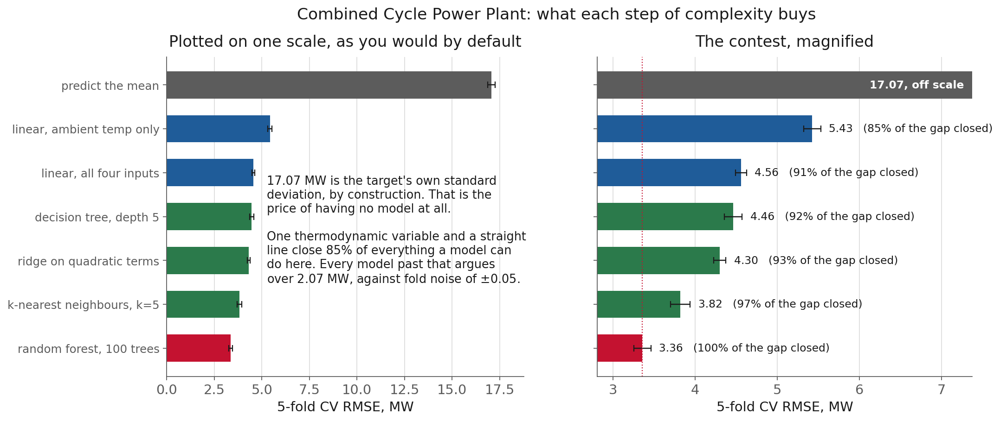
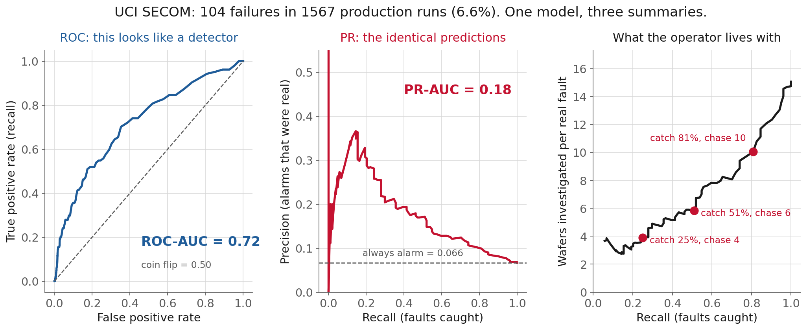
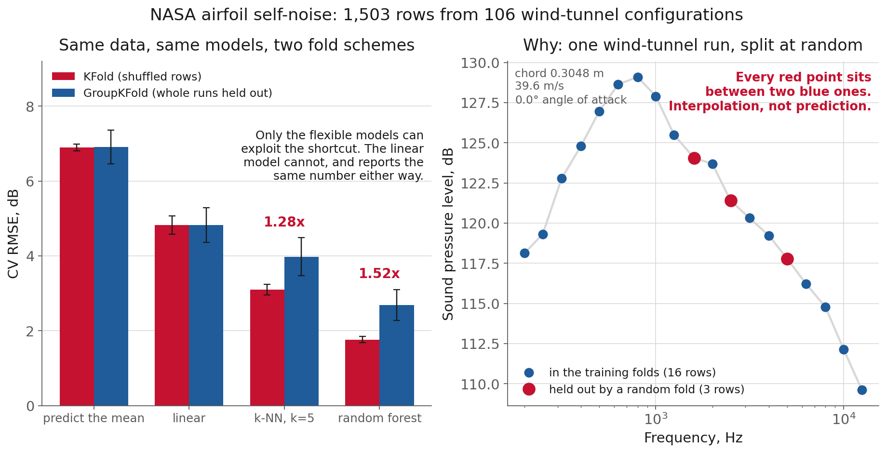
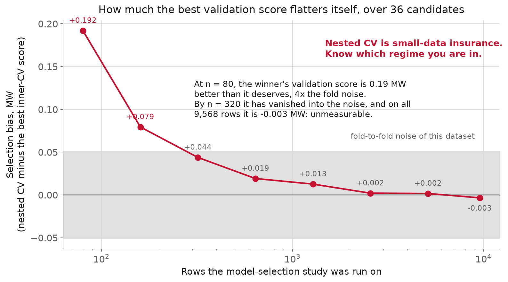
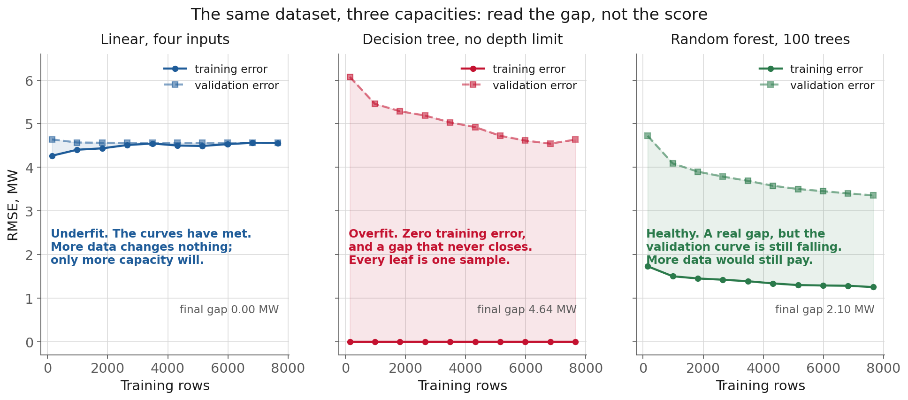

<!-- _class: title -->

# L9 · Train, validate, select

## Week 5 · Machine learning & deep learning

**Systems & Toolchains for AI in Engineering**

---

## Roadmap

1. The supervised workflow, and the number you compute once
2. Baselines that have to be beaten
3. Metrics, and the engineering cost of being wrong
4. Choosing a cross-validation scheme
5. The leakage catalogue, from the modelling side
6. Bias, variance, and learning curves
7. Live demo: a ladder, three leaks, one test set

<!-- 110 min. Budget roughly 8 / 18 / 22 / 20 / 14 / 8 / 20 demo.
     Datasets: UCI Combined Cycle Power Plant (9,568 rows) and NASA Airfoil
     Self-Noise (1,503 rows in 106 configurations).
     If running long, cut the learning-curve section, not the demo. -->

---

<!-- _class: section -->

# Why this matters

---

## Why this matters

"RMSE of 3.4 MW."
"92% of faults detected."

That is not a measurement of your model.
It is a **prediction about the future.**

**Nobody lies. The workflow leaks..**

- Try five models, report the best → a **maximum**, not a typical value
- Tune on the validation score → it is no longer independent
- Split rows at random → but the rows came in **batches**

No error message. Every number too small.
**And a smaller number looks like better work.**

---

## Why this matters, the engineering consequence

A surrogate promised ±3 MW. It delivers ±8.

It invalidates whatever downstream decision
was **sized against the ±3**.

<!-- If it feeds a dispatch optimisation, the optimiser was solved against a
     model of the error that was wrong by 3x. Same category of defect as an
     unverified tolerance. -->

---

<!-- _class: section -->

# The supervised workflow

---

## The supervised workflow

framing → **baseline** → model family → validation
→ selection → **held-out test** → error analysis

**Validation** is a tool you *consume*: look, decide,
repeat. Each decision moves information out of it
and into your model.

A test set is an **instrument**. It works once.

---

## The supervised workflow, the rule

# The test set is touched once,
# at the end.

Don't like the number? You do not get to
try again. There is no way to un-look.

<!-- The version of this that is not dishonest at all: reporting the BEST
     VALIDATION score as expected performance. It is the minimum over
     everything you tried, and the minimum of noisy numbers is systematically
     lower than any of them deserves. We measure how much in section 5. -->

---

## The supervised workflow, framing: this session's dataset

**UCI Combined Cycle Power Plant.** 9,568 hourly rows,
one plant at full load, 2006 to 2011. Ambient temp,
vacuum, pressure, humidity → net MW.

**Cheap-to-measure in, expensive-to-measure out.**
Pump curves, engine maps, yield: every surrogate.

[archive.ics.uci.edu/dataset/294](https://archive.ics.uci.edu/dataset/294/combined+cycle+power+plant)

<!-- Framing embeds assumptions worth surfacing: configuration fixed (true here,
     full load only); ambient CAUSES output (true, inlet density sets mass
     flow); and each hour is a separate question, which is the one to hold onto
     for the cross-validation section. -->

---

<!-- _class: section -->

# Baselines that must be beaten

---

## Baselines that must be beaten

**Baseline**: the simplest predictor you would accept, which every reported score must beat to mean anything.

| baseline | what it tells you |
|---|---|
| predict the mean | the floor; equals the target's std |
| **persistence** (last value) | the bar for anything time-ordered |
| linear / ridge | physical data is often locally linear |
| a single tree | lookup table, or smooth function? |
| **physics / correlation** | what is already known |

**A model that cannot beat persistence is not a model.**
It is an expensive way to describe the recent past.

<!-- Tomorrow's temperature is very nearly today's temperature. Persistence is
     far stronger than people expect, and it is the one they skip. -->

---

## Baselines that must be beaten, the ladder, measured

<!-- Left panel is what you get by default, and it says "all models are the
     same", which is false. Ask which panel they'd put in a report. -->

---

## Baselines that must be beaten, two numbers from that plot

**Predict the mean: 17.07 MW.** That is the target's
own standard deviation, to three figures,
by construction.

**Linear on ambient temperature alone: 5.43 MW.**
One variable, one straight line, and **85% of the
entire gap** is closed.

**Why: a gas turbine breathes air.**

Colder air is denser → more mass per unit volume
through the compressor → more power.

Ambient temperature is not one predictor of four.
It is **the** predictor; the rest are corrections.

Any engineer on that plant knew this before we fitted anything.

---

## Baselines that must be beaten, the rest of the ladder

| model | RMSE | gap closed |
|---|---|---|
| linear, all four | 4.56 | 91% |
| tree, depth 5 | 4.46 | 92% |
| ridge on quadratics | 4.30 | 93% |
| k-NN, k=5 | 3.82 | 97% |
| random forest | **3.36** | 100% |

The whole tournament is **2.07 MW** wide.

<!-- "The random forest achieves 3.36 MW" is a fact about nothing. The ladder
     is what tells a reader whether the last increment justifies a scikit-learn
     dependency in a control room. -->

**And keep the noise beside it.**

Refit the same linear model across the five
published shuffles: RMSE moves **±0.05 MW**.

The forest's 1.2 MW win is **20× the noise**: real.
A 0.03 MW win would not have been.

---

<!-- _class: section -->

# Case: Google Flu Trends

---

## Case: Google Flu Trends

Published in *Nature*, 2009, by Google + CDC.

> Each of the **50 million** candidate queries in
> our database was separately tested in this manner

> Combining the **N=45** highest-scoring queries
> was found to obtain the best fit

Fitted on 2003 to 2007: [1,152 observations](https://research.google.com/archive/papers/detecting-influenza-epidemics.pdf).

# ≈ 43,000 candidates per data point

---

## Case: Google Flu Trends, they saw the warning sign

Queries just outside the top 45 included
"**high school basketball**."

> A steep drop in model performance occurs after
> adding query 81, which is "**oscar nominations**"

**And they held out a season, correctly.**

> The final model was validated on 42 points per
> region of previously untested data from 2007-2008,
> which were **excluded from all prior steps**

> a mean correlation of **0.97** (min=0.92, max=0.99)

A real, clean, held-out test.

---

## Case: Google Flu Trends, it still failed

> predicting **more than double** the proportion of
> doctor visits for influenza-like illness than the
> Centers for Disease Control

> missed high for **100 out of 108 weeks**
> starting with August 2011

[Lazer, Kennedy, King & Vespignani, *Science* 343:1203 (2014)](https://gking.harvard.edu/files/gking/files/0314policyforumff.pdf)

---

## Case: Google Flu Trends, the diagnosis

> The odds of finding search terms that match the
> propensity of the flu but are **structurally
> unrelated**, and so do not predict the future,
> were quite high

> the initial version of GFT was
> **part flu detector, part winter detector**

<!-- Best one-line description of a confounded feature set anyone has written.
     Read it out loud twice. -->

**The baseline that ended it.**

| model | mean absolute error |
|---|---|
| Google Flu Trends | 0.486 |
| **lagged CDC data** | **0.311** |
| GFT + CDC combined | 0.232 |

> Even **3-week-old CDC data** do a better job of
> projecting current flu prevalence than GFT

---

## Case: Google Flu Trends, three things, and the third is the hard one

1. **Know your candidates-to-observations ratio.**
2. **The target's own history is the baseline to beat.**
   Nobody at GFT ever published that comparison.
3. **A correct holdout did not save them.** It was drawn
   from the same seasonal regime as the training data.

A test set answers one question: *how would this do on
more data like what I already have?*

<!-- Everything past that question is monitoring. Say it out loud. -->

---

<!-- _class: section -->

# Metrics and the cost of being wrong

---

## Metrics and the cost of being wrong

**RMSE and MAE**: RMSE penalizes large errors quadratically; MAE weights every error equally. Choosing between them is a statement about cost.

| metric | use it when | watch out |
|---|---|---|
| **RMSE** | one 20 MW miss > ten 2 MW misses | outlier-sensitive |
| **MAE** | billed per unit of imbalance | ignores tail risk |
| **R²** | comparing across problems | **hides the units** |
| **adj. R²** | feature counts differ | plain R² never falls |

If RMSE and MAE rank your models differently, **that is the finding.**

<!-- R² = 0.96 sounds excellent. It is 3.36 MW. Whether that is fine depends
     entirely on what consumes it. -->

---

## Metrics and the cost of being wrong, MAPE explodes near zero

Take C-MAPSS remaining useful life (L7).
Give a model a **flat, uniform 15-cycle error**
on every test engine.

| metric | reads |
|---|---|
| RMSE / MAE | 15 cycles |
| **MAPE** | **39.5%** |
| the engine with RUL = 7 | contributes **214%** |

It diverges exactly where the prediction must be right.

---

## Metrics and the cost of being wrong, residuals say what no scalar can

vs **fitted value** → unmodelled nonlinearity
vs **each input** → the variable it handles badly
vs **time** → drift, regime change, the sensor
recalibrated in March

A great RMSE with a smile-shaped residual plot
is a **correctable** deficiency.

**Fault detection changes the shape.**

**UCI SECOM** (from L5): 1,567 semiconductor runs,
590 process sensors, **104 failures = 6.6%**.

Accuracy is useless here by inspection.
Declare everything a pass and score **93.4%**.

[archive.ics.uci.edu/dataset/179](https://archive.ics.uci.edu/dataset/179/secom)

---

## Metrics and the cost of being wrong, one model, three summaries

<!-- Identical predictions in all three panels. Show only the ROC panel first
     and ask them to guess PR-AUC. Nobody guesses 0.18. -->

---

## Metrics and the cost of being wrong, ROC-AUC 0.72. PR-AUC 0.18.

**Same predictions.**

ROC's x-axis divides by the number of **negatives**.
At 14:1 imbalance, a lot of false alarms is
still a small false positive rate.

Precision divides by **alarms raised**.
No large denominator to hide in.

**The operator's units.**

| recall | wafers chased per real fault |
|---|---|
| 25% | 4 |
| 51% | 6 |
| 81% | **10** |

That trade is the product decision. Neither AUC states it.

<!-- This is the slide to linger on. Ask what recall they'd ship at, then ask
     who is doing the chasing and what else that person was supposed to do. -->

---

## Metrics and the cost of being wrong, case: Milford Haven, 24 July 1994

Lightning strike → process upset → explosion
about five hours later. 26 injured, ~£48 million.

HSE's first listed factor:
> There were **too many alarms** and they were
> poorly prioritised

> In the last **11 minutes** before the explosion
> the two operators had to recognise, acknowledge
> and act on **275 alarms**

[HSE, *Better alarm handling*, Chemicals Sheet No 6](https://www.hse.gov.uk/pubns/chis6.pdf)

**Against a published budget.**

> the long-term average alarm rate during normal
> operation should be **no more than one every ten
> minutes**; and no more than ten displayed in the
> first ten minutes following a major plant upset

25 alarms/minute against a target of 10 per 10 min.

---

## Metrics and the cost of being wrong, now do it for your detector

1,000 process tags, scored once a minute,
**1% false positive rate**.

Most people would call that excellent.

# 10 false alarms per minute
# = 100× the EEMUA budget

---

## Metrics and the cost of being wrong, so write the cost matrix first

What does a **missed fault** cost? Scrap, downtime, risk.
What does a **false alarm** cost? Investigation time, and
the credibility the system spends crying wolf.

Those set your operating point. Then report PR-AUC
alongside ROC-AUC, and the alert burden **in the
operator's units**.

"PR-AUC 0.18" is for you. "Ten wafers per fault" is for
the person deciding whether to switch it on.

---

<!-- _class: section -->

# Choosing a cross-validation scheme

---

## Choosing a cross-validation scheme

**Cross-validation**: repeatedly refitting on part of the data and scoring on the rest, to estimate how a procedure generalizes.

Partition into k parts, train k times, average.

Rests on **exchangeability**: any random partition
is as good as any other.

When that fails, k-fold does not warn you.
It returns a number, and the number is optimistic.

---

## Choosing a cross-validation scheme, two structural failures, two splitters

**GroupKFold and TimeSeriesSplit**: splitters that keep a group whole, or keep the future out of the past, where plain k-fold would not.

**Grouped**: rows share a physical unit. Cycles from one
engine, specimens from one batch, points from one
wind-tunnel run. → **`GroupKFold`**

**Time-ordered**: the future must not predict the past.
→ **`TimeSeriesSplit`**: every validation block strictly
*after* every training point.

[sklearn: Cross-validation](https://scikit-learn.org/stable/modules/cross_validation.html)

---

## Choosing a cross-validation scheme, the demonstration dataset

**NASA Airfoil Self-Noise.** 1,503 anechoic
wind-tunnel measurements.

Each row is one *frequency* in one configuration
(chord, velocity, angle of attack, thickness).

Group by configuration → **106 groups**, ~14 rows each.

[UCI 291](https://archive.ics.uci.edu/dataset/291/airfoil+self+noise) · [Brooks, Pope & Marcolini, NASA RP-1218 (1989)](https://ntrs.nasa.gov/citations/19890016302)

---

## Choosing a cross-validation scheme, same data, two fold schemes

<!-- Ask them to predict the ordering first. Most expect the linear model to
     move too. It does not, and that is the interesting part. -->

---

## Choosing a cross-validation scheme, the numbers

| model | KFold | GroupKFold | |
|---|---|---|---|
| predict the mean | 6.90 | 6.91 | 1.00× |
| linear | 4.83 | 4.83 | 1.00× |
| k-NN, k=5 | 3.10 | 3.98 | 1.28× |
| **random forest** | **1.76** | **2.69** | **1.52×** |

The number a paper would print is **52% too low.**

**Why, and which models it reaches.**

One configuration is a smooth SPL-vs-frequency curve,
~19 points. A random fold holds out 3 or 4 of them,
each **between two points it kept**. Interpolation.

Mean and linear: no capacity to memorise a run, **0%**.
k-NN, which is nothing but memorisation: **+28%**.
Forest, many memorising trees: **+52%**.

**A gap of zero is never evidence the split was sound.**

---

## Choosing a cross-validation scheme, what did *not* change

The **ranking survived**. The forest is still best,
the linear model still worse. What broke was the
number, not the decision.

That will not always be true, and it is
a poor thing to rely on.

**A scandal in our own dataset.**

`Folds5x2_pp.xlsx` has **five sheets**.

They are the same 9,568 rows in **five different
orders**. Verify it in three lines; the demo does.

> we provide the data **shuffled five times**
> (the dataset readme)

---

## Choosing a cross-validation scheme, which means you cannot check

Six years of hourly measurements, and: no plot against
time, no autocorrelation, no `TimeSeriesSplit`,
**no way to check what your k-fold rests on.**

2 p.m. and 3 p.m. ambient temperature are nearly the
same number, so consecutive rows are near-duplicates,
and a random k-fold splits those pairs across folds.

Unanswerable with the file as published. Which *is* the finding.

---

## Choosing a cross-validation scheme, the lesson is about publishing

# A row ordering is metadata.
# Shuffling is destructive.

Ship the index. Or ship a timestamp.
Otherwise every downstream user inherits
a question they cannot answer.

---

<!-- _class: section -->

# The leakage catalogue

---

## The leakage catalogue

1. Fitting a transform on all the data
2. Target leakage from the future
3. Group leakage across the split
4. Selecting on the test set

L7 saw these from the feature side.
Same failure, new vantage point.

**1. The scaler leak, measured.**

Fit `StandardScaler` on everything, then CV.

| model | gap |
|---|---|
| `LinearRegression` | 0.00000 |
| `Ridge(alpha=100)` | −0.00005 |
| `KNeighbors(k=5)` | −0.00107 |
| `RandomForest` | **+0.00145** |

Largest effect **0.0015 MW**, against fold noise of **±0.05**.

<!-- A mean over 9,568 rows vs 7,654 random ones barely moves. Same result L7
     got on C-MAPSS, for the same reason. In two of four cases the leaky
     pipeline scores very slightly BETTER. -->

---

## The leakage catalogue, so the leak is real and worth nothing

# You cannot audit leakage
# by looking at your metrics.

Read the code. Find every `.fit()`
and check what was in scope when it ran.

---

## The leakage catalogue, 2. Target leakage from the future

A feature that will not exist at prediction time.

A quality-lab result recorded *after* the batch.
A maintenance-log field populated *once the fault
is diagnosed*.

The tell is temporal, not statistical: *at the instant
the prediction is needed, does this value exist yet?*

**3. Group leakage: the one that hurts.**

**Group leakage**: the same entity appearing in both training and validation, so the model is scored on units it has already seen.

Measured: **+52%** on the airfoil forest.

**No `Pipeline` catches it.**
The split happens before any pipeline
ever sees the data.

---

## The leakage catalogue, 4. Selecting on the test set

Consult a score, change something, and that
score's data has been spent.

Doing it with the *test* set is obviously wrong.
Doing it with the *validation* set is normal practice,
and still costs you: you report the **minimum**.

**Nested CV**: inner loop selects, outer loop scores
the whole procedure on data the inner loop never saw.

---

## The leakage catalogue, how much is that worth?

<!-- 36-candidate grid. Both sides train on 4/5 of what they're handed, so the
     "refit on more data" confound is removed. Ask them to predict the shape
     before revealing: most expect a flat line. -->

---

## The leakage catalogue, read the shape

| rows | selection bias |
|---|---|
| 80 | **+0.19 MW** (4× the noise) |
| 320 | +0.04 (inside the noise) |
| 9,568 | **−0.003** |

Nested CV is **small-data insurance**, not a universal tax.
It is the **ratio of candidates to rows** that matters:
36 over 9,568 is safe, 36 over 106 runs is not.

---

## The leakage catalogue, the extreme case (ESL §7.10.2)

50 samples. 5,000 predictors. **All pure noise.**
Labels by coin flip. True error: 50%.

Screen to the 100 best columns, *then* CV a 1-NN
classifier: **0.9% error.**

Move the identical screen **inside** each fold:
**47.5%.** The coin flip it always was.

[Hastie, Tibshirani & Friedman, ESL ch. 7 (free)](https://hastie.su.domains/ElemStatLearn/download.html)

<!-- Four pages, and the single most useful thing they can read this week. The
     demo reproduces this exact experiment. -->

---

<!-- _class: section -->

# Bias, variance, learning curves

---

## Bias, variance, learning curves

**Learning curve**: score against training-set size, which separates a model that is too simple from one that needs more data.

<!-- The diagnosis is in the gap AND in whether the validation curve flattened.
     Point at the right panel: still descending at 7,654 rows. -->

---

## Bias, variance, learning curves, the diagnosis

| shape | verdict | action |
|---|---|---|
| curves met, both high | **underfit** | more capacity |
| train ≈ 0, big static gap | **overfit** | regularise |
| gap real, val still falling | healthy | **more data pays** |

Linear gap **0.002**. Tree gap **4.64**. Forest gap **2.10**.

Zero training error is a confession: every leaf holds one sample.

**Variance, learning curves, run it once, early.**

Cheapest diagnostic in this session,
and the most often skipped.

It answers **"collect more data, or build a better
model?"** before you spend a week tuning, and those
two answers have wildly different costs.

---

<!-- _class: section -->

# Where this pushes back

---

## Where this pushes back

Same linear model, five published shuffles:
range **0.21 MW**, std **0.05**.

A win smaller than ~2 std is not supported
by the experiment that produced it.

**One-standard-error rule:** among models within 1 SE
of the best, take the **simplest**. Report "3.36 ± 0.1",
not "3.3612". Bootstrap your test predictions.

**Nested CV: expensive, and about a *procedure*.**

5-fold outer × 5-fold inner × 36 candidates
= **900 model fits.** Minutes for a forest,
days for a network. k-fold is a small-data
technique that stopped scaling.

And the number describes **selecting-and-fitting**,
not the model it picked. You still need a final
fit and a held-out test for what you ship.

---

## Where this pushes back, everything assumes the future looks like the past

k-fold, `GroupKFold`, `TimeSeriesSplit`, nested CV:
all estimate performance **under the distribution
you sampled**.

None sees a new operating regime, a replaced sensor
vendor, a different fuel. GFT had a correct holdout and
was destroyed by **Google changing its own search suggestions**.

The answers are **monitoring** (L23), and keeping a
**dumb baseline running in production**.

---

<!-- _class: demo -->

# Demo

## `l09-model-selection.ipynb`

Power-plant ladder, three leakage experiments,
one test set touched once.

---

## What to watch

- The ladder: **17.07 → 5.43 → 3.36**
- Verify by hand that the five sheets are five shuffles
- Scale-before-split: **0.001 MW.** Nothing.
- Screen-before-CV on pure noise: **0.9% vs 47.5%**
- Group leak on the airfoil data: **1.76 vs 2.69 dB**
- 1-SE selection, one test evaluation, bootstrapped interval

**Come with a prediction:** are the rows i.i.d., and
**how would you check?**

<!-- Let them argue for two minutes before revealing the shuffle. The point
     lands much harder if they have already tried to design the check. -->

---

## Recap

- The number you report is a promise about data you have not seen
- Report a **ladder**: 17.07 → 5.43 (one variable!) → 3.36
- The metric declares what errors cost; MAPE diverges, ROC-AUC flatters
- Match the CV scheme to the data's **structure**, not to the default
- The famous leak was worth 0.0015 MW; the unmentioned one was worth 52%
- Nested CV is small-data insurance: +0.19 at n=80, −0.003 at n=9,568
- Every metric is a proxy for a cost you did not write down

---

## Three things measurement changed today

- The scale-before-split bug the module asks for is **0.0015 MW**. No scare number.
- The winner's curse is **real and small**, and dies by a few hundred rows
- The first draft of the baseline figure said "all models are the same." **That was the y-axis talking.**

Every one of those was a draft claim that a run corrected.

---

## Next

**Assignment** [A5](../../course/assignments/a05.md), out today, due ~1 week · A4 due now
**Reading** [ESL ch. 7](https://hastie.su.domains/ElemStatLearn/download.html) (esp. §7.10.2) · [sklearn CV](https://scikit-learn.org/stable/modules/cross_validation.html) · [sklearn pitfalls](https://scikit-learn.org/stable/common_pitfalls.html) · [Raschka arXiv:1811.12808](https://arxiv.org/abs/1811.12808)
**L10** The same study, made auditable: MLflow tracking
and hyperparameter search with Optuna

Full notes, with all sources: `lectures/l09/notes.md`
