<style>
/* L9: a figure alone in its paragraph is centered, and so is every table. */
section p:has(> img:only-child) { text-align: center; }
section table { margin-left: auto; margin-right: auto; }

/* the regularization slider */
.reg-widget { font-size: 22px; }
.reg-controls { display: flex; gap: 1.4em; align-items: center; justify-content: center; margin: 0.2em 0; }
.reg-controls input[type=range] { width: 360px; accent-color: #c41230; }
.reg-readout { text-align: center; color: #5c5c5c; margin-top: 0.2em; }
.reg-widget svg { display: block; margin: 0 auto; }

/* the annotated optimization problem */
.opt-ann { position: relative; width: 1100px; height: 390px; margin: 0 auto; }
.opt-ann svg.opt-svg { position: absolute; left: 0; top: 0; }
.opt-ann ul { list-style: none; margin: 0; padding: 0; }
.opt-ann li { position: absolute; font-size: 21px; line-height: 1.3; background: #f7f7f7;
  border-left: 5px solid #5c5c5c; border-radius: 0 6px 6px 0; padding: 6px 12px; margin: 0; }
.opt-ann li:nth-child(1) { left: 0; top: 262px; width: 270px; border-color: #1f5c99; }
.opt-ann li:nth-child(2) { left: 655px; top: 40px; width: 430px; border-color: #c41230; }
.opt-ann li:nth-child(3) { left: 655px; top: 170px; width: 430px; border-color: #2e7d32; }
.opt-ann li:nth-child(4) { left: 655px; top: 285px; width: 430px; border-color: #b07d12; }
.opt-ann .arr { opacity: 0; transition: opacity 0.3s; }
section:not(:has([data-bespoke-marp-fragment])) .opt-ann .arr { opacity: 1; }
section:has(.opt-ann li[data-marpit-fragment="1"][data-bespoke-marp-fragment="active"]) .opt-ann .arr1,
section:has(.opt-ann li[data-marpit-fragment="2"][data-bespoke-marp-fragment="active"]) .opt-ann .arr2,
section:has(.opt-ann li[data-marpit-fragment="3"][data-bespoke-marp-fragment="active"]) .opt-ann .arr3,
section:has(.opt-ann li[data-marpit-fragment="4"][data-bespoke-marp-fragment="active"]) .opt-ann .arr4 { opacity: 1; }

/* the network, with the previous slide's equation built beside it one unit at a time */
.nn-ann { position: relative; width: 1100px; height: 390px; margin: 0 auto; }
.nn-ann svg.nn-svg { position: absolute; left: 20px; top: 0; }
.nn-ann ul { list-style: none; margin: 0; padding: 0; }
.nn-ann li { position: absolute; left: 690px; margin: 0; font-size: 30px; line-height: 1.2; white-space: nowrap; }
.nn-ann li:nth-child(1) { top: 50px; color: #1f5c99; }
.nn-ann li:nth-child(2) { top: 145px; color: #b07d12; }
.nn-ann li:nth-child(3) { top: 240px; color: #2e7d32; }
.nn-ann li:nth-child(4) { top: 290px; color: #c41230; }
.nn-ann li:nth-child(5) { top: 334px; width: 360px; padding-top: 4px; border-top: 2px solid #1a1a1a; color: #1a1a1a; }
/* only the unit whose term was just written glows, as a neuron firing; a static render shows none */
.nn-ann .lit { opacity: 0; transition: opacity 0.3s; }
section:has(.nn-ann li[data-marpit-fragment="1"][data-bespoke-marp-fragment="active"]):not(:has(.nn-ann li[data-marpit-fragment="2"][data-bespoke-marp-fragment="active"])) .nn-ann .lit1,
section:has(.nn-ann li[data-marpit-fragment="2"][data-bespoke-marp-fragment="active"]):not(:has(.nn-ann li[data-marpit-fragment="3"][data-bespoke-marp-fragment="active"])) .nn-ann .lit2,
section:has(.nn-ann li[data-marpit-fragment="3"][data-bespoke-marp-fragment="active"]):not(:has(.nn-ann li[data-marpit-fragment="4"][data-bespoke-marp-fragment="active"])) .nn-ann .lit3,
section:has(.nn-ann li[data-marpit-fragment="4"][data-bespoke-marp-fragment="active"]):not(:has(.nn-ann li[data-marpit-fragment="5"][data-bespoke-marp-fragment="active"])) .nn-ann .lit4,
section:has(.nn-ann li[data-marpit-fragment="5"][data-bespoke-marp-fragment="active"]) .nn-ann .lit5 { opacity: 1; }

/* layouts used by this deck */
.cols { display: grid; gap: 1.1em; align-items: center; }
.cols-xkcd { grid-template-columns: 1.35fr 1fr; font-size: 0.86em; }
.cols-xkcd p:has(> img:only-child) { margin: 0; }
.cols-even { grid-template-columns: 1fr 1fr; }
.cols-hook { grid-template-columns: 1.1fr 1fr; font-size: 0.88em; }
.cols-lc { grid-template-columns: 1.2fr 1fr; }
.cards { display: grid; grid-template-columns: repeat(4, 1fr); gap: 16px; margin-top: 0.3em; }
.card { background: #f7f7f7; border-top: 5px solid #c41230; border-radius: 6px; padding: 10px 12px; font-size: 0.66em; }
.card:nth-child(2) { border-top-color: #1f5c99; }
.card:nth-child(3) { border-top-color: #b07d12; }
.card:nth-child(4) { border-top-color: #2e7d32; }
.card img { width: 100%; display: block; margin: 0 auto 4px; }
.card h4 { margin: 4px 0 2px; font-size: 1.25em; }
.card ul { margin: 0; padding-left: 1.1em; }
.card li { margin: 2px 0; }
.cards-defs .card { font-size: 0.6em; }
.toys { display: flex; align-items: center; justify-content: center; gap: 18px; margin-top: 14px; font-size: 0.68em; color: #5c5c5c; }
.toys img { height: 96px; margin: 0; }
</style>

<!-- _class: title -->

# Lecture 9: The machine learning workflow II, regression

## Week 5, Machine learning and deep learning

**Systems and Toolchains for AI Engineers**

<!--
110 minutes: lecture 90, questions 20. The notebook is a worked example students run after
class; it is not shown live.
Plan, by slide: opening and the examples (2-7) 9, types (9-12) 5, workflow (14-17) 6, training as
optimization (19-23) 9, regression families (25-52) 36, cross-validation (54-59) 7, capacity
(61-63) 5, limitations and the close (65-69) 5.
About 82 minutes at a steady pace. If it runs long, the first to go, in order: the optimizer paths
(23, one sentence), what each training solves (48), the kernel and prediction slide (43, the notes
carry it), the NARX forecast figure (52).
-->

---

## What today is about

<div class="cols cols-xkcd">
<div>

Lecture 8: a time series, where **order in time** decided everything. Today: mostly rows with **no time order**, one experiment each.

1. Four **examples**, and the **types** of machine learning
2. The **workflow**, and **training as optimization**
3. **Regression**: linear, trees, neural networks, Gaussian processes, NARX (nonlinear)
4. **Cross-validation** and **model capacity**
5. **Limitations**, and one question left open (hyperparameters)
6. A **worked example**, to run after class

</div>
<div>

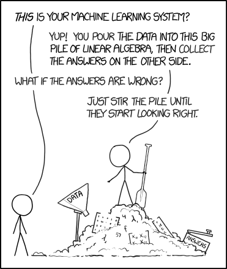

<span class="source"><a href="https://xkcd.com/1838/">xkcd 1838</a>, Randall Munroe, CC BY-NC 2.5</span>

</div>
</div>

<!--
A pause for the comic. "Just stir the pile until they start looking right" is the failure this
session is about. ML: building models that learn patterns from data; instead of explicitly
programming rules of physics/nature, we train algorithms to generalize from examples.
-->

---

## Why this matters, what stirring the pile looks like

Water sealed in a rigid container: how fast does its pressure rise as it heats? Data from **NIST** (National Institute of Standards and Technology)

<div class="cols cols-hook">
<div>

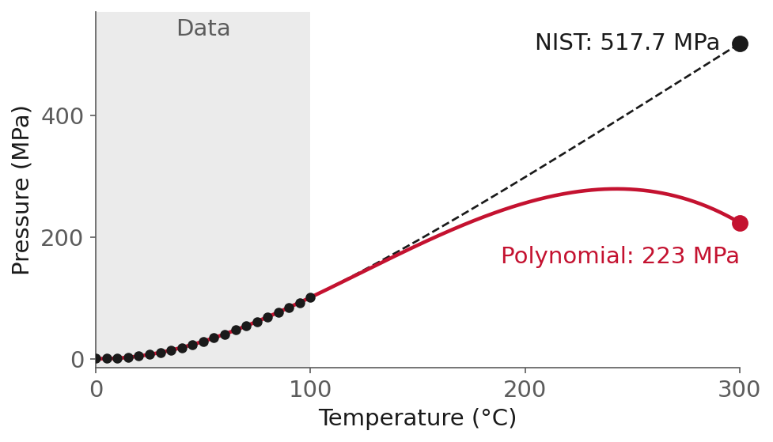

</div>
<div>

- Fit a third-degree polynomial, $P = a_3 T^3 + a_2 T^2 + a_1 T + a_0$, to 16 of the 21 points
- Training $R^2$ = **0.9999975**
- At 300 °C it says **223 MPa**; NIST says **517.7 MPa**
- The score only measured the model **where the data is**

</div>
</div>

<span class="source"><a href="https://webbook.nist.gov/chemistry/fluid/">NIST source</a>.</span>

<!--
"Constant density" is the physics: a fixed mass of liquid water in a sealed, rigid container, so
its density stays at 1000 kg/m3. It cannot expand when heated, so the pressure climbs steeply,
from about 0.4 MPa near 0 C to about 100 MPa (roughly 1000 atm) at 100 C. First of today's
examples; it comes back for feature engineering, regularization, the first tree, and at the end
for what every family does outside its data.
-->

---

## Today's examples, surfactant viscosity

<style scoped>.cols { font-size: 0.8em; grid-template-columns: 0.9fr 1fr; }</style>

<div class="cols cols-even">
<div>

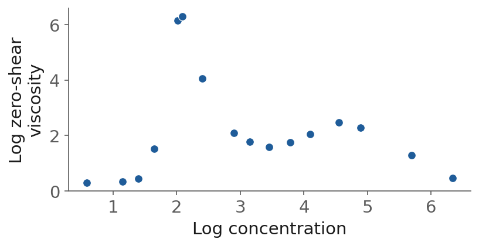

</div>
<div>

- **Surfactant**: a soap-like molecule; with salt, many join into long, tangled worms
- **Zero-shear viscosity**: how thick the liquid is at rest, in the bottle or your hand
- Salt is the knob: a little thickens shampoo, too much makes it runny again
- In our data, viscosity climbs **about 400-fold** with salt, then falls
- 16 experiments: our **Gaussian process** case study

</div>
</div>

<span class="source"><a href="https://doi.org/10.1021/j100327a031">Rehage and Hoffmann (1988)</a> / <a href="https://kitchingroup.cheme.cmu.edu/s20-06681/08-nonlinear-sklearn/08-nonlinear-sklearn.html">Kitchin group</a></span>

<!--
The paper's system: the surfactant cetylpyridinium chloride (also the antiseptic in some
over-the-counter mouthwashes) with the salt sodium salicylate. The long worms are wormlike
micelles, and they tangle like polymer chains. Zero-shear viscosity is the plateau the viscosity
reaches as the shear rate goes to zero: the thickness of the liquid sitting still.
Why the peak: the salt screens the charges on the surfactant heads, so small spherical micelles
grow into long worms and the viscosity climbs; past the peak it falls, commonly attributed to the
worms branching or shortening (which of the two is still debated, Ziserman et al. 2009). The
Kitchin group page labels the axis salt concentration and gives no units. The 16 points follow the
shape of the paper's curve (sharp peak, dip, smaller second peak, fall) on a compressed scale:
about 400-fold here, about five decades in the paper's own curve (replotted in Berret 2004, at
100 mmol/L of surfactant).
-->

---

## Today's examples, concrete strength

<style scoped>.cols { font-size: 0.78em; grid-template-columns: 0.9fr 1fr; }</style>

<div class="cols cols-even">
<div>

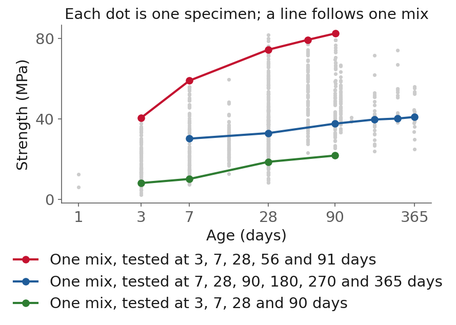

</div>
<div>

- **Concrete**: cement and water glue sand and gravel together; it keeps hardening for months
- **A mix**: one recipe, kg per m³ of 7 ingredients: cement, water, sand, gravel, slag, fly ash, superplasticizer
- **A test**: cast cylinders from a mix, crush them days later; **strength** is the breaking stress (MPa)
- **Each gray dot**: one test, at its age and strength; one row of the data (1,030 rows)
- **Each colored line**: one mix, its cylinders crushed at several ages, 3 days to a year

</div>
</div>

<span class="source"><a href="https://archive.ics.uci.edu/dataset/165/concrete+compressive+strength">Yeh (1998)</a>, UCI, CC BY 4.0 / NRMCA on <a href="https://www.nrmca.org/about-nrmca/about-concrete/">concrete</a> and <a href="https://www.nrmca.org/wp-content/uploads/2021/01/35pr.pdf">strength tests</a></span>

<!--
Sand and gravel are the file's fine and coarse aggregate. Slag (a byproduct of iron making) and
fly ash (from coal power plants) replace part of the cement; superplasticizer is an additive that
lets the fresh mix flow with less water. In standard practice a test result is the average of at
least two cylinders crushed at the same age (NRMCA CIP 35); the UCI files do not say how many
cylinders each row averages. Crushing destroys a cylinder, so a line is several cylinders of one
mix, one per age. Designs specify strength at 28 days, which is why 425 of the 1,030 rows are
28-day tests. Only 428 distinct mixes, and 182 of them were crushed at several ages, which
matters for the folds in the cross-validation section. High-performance concrete: concrete
meeting performance and uniformity requirements that conventional ingredients and practice
cannot always achieve (ACI).
-->

---

## Today's examples, the Tennessee Eastman process (TEP)


- Lecture 8's simulated plant: **52 channels**; each row is one 3-minute sample of a run, so rows are **split by run**
- Today's job: **forecast** the reactor pressure 30 minutes ahead (**NARX**, Lecture 7's model on lagged outputs and inputs)

<span class="source"><a href="https://doi.org/10.7910/DVN/6C3JR1">Rieth et al. (2017)</a>, CC0</span>

---

## Today's examples

<div class="cards">
<div class="card">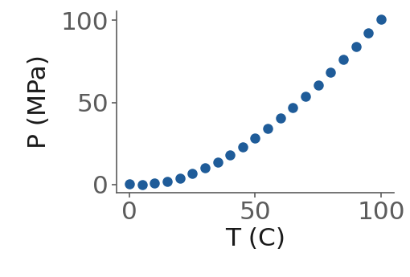<h4>Water</h4><ul><li>NIST, 21 temperatures</li><li>Feature engineering, extrapolation</li></ul></div>
<div class="card">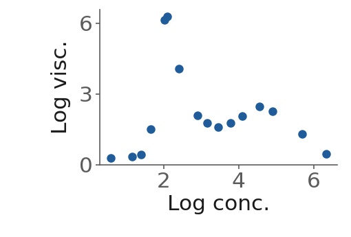<h4>Surfactant</h4><ul><li>16 experiments</li><li>Gaussian processes</li></ul></div>
<div class="card">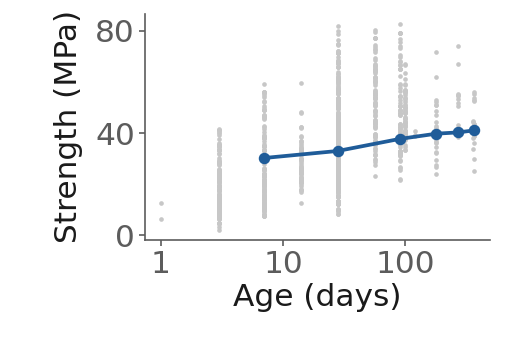<h4>Concrete</h4><ul><li>1,030 rows, 428 mixes</li><li>Comparing models, cross-validation</li></ul></div>
<div class="card">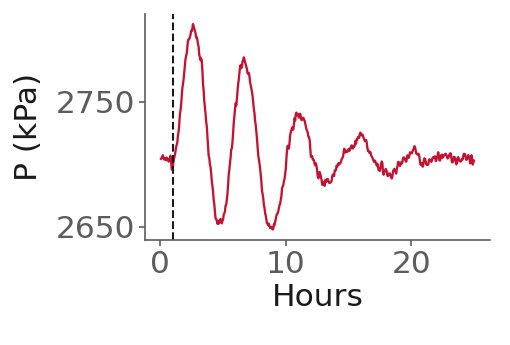<h4>Tennessee Eastman</h4><ul><li>Lecture 8's plant</li><li>NARX forecasts</li></ul></div>
</div>

<div class="toys">
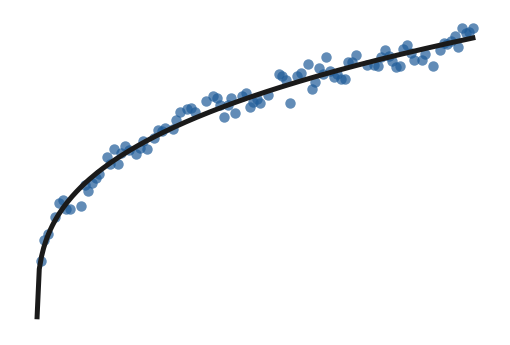<span><b>Plus one synthetic set</b>, where the truth is known: <b>y = x<sup>1/3</sup> + noise</b>, for neural networks</span>
</div>

---

<!-- _class: section -->

# Types of machine learning

---

## Types of machine learning

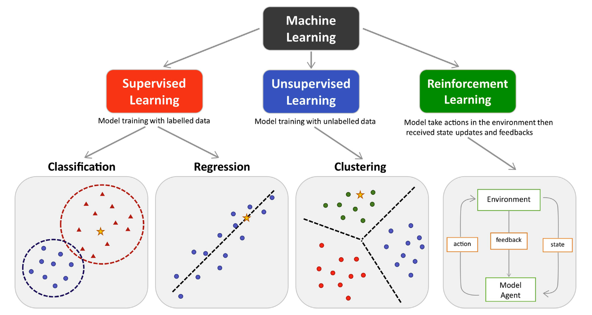

<span class="source"><a href="https://doi.org/10.3389/fphar.2021.720694">Peng, Jury, Dönnes and Ciurtin (2021)</a>, Front. Pharmacol., CC BY 4.0</span>

<!--
Supervised: labels (target outputs). Unsupervised: no labels, find hidden structure
(clustering, dimensionality reduction). Reinforcement: actions, state updates, feedback.
Today is all supervised.
-->

---

## Types of machine learning, two supervised tasks

<div class="definition">

**Classification** predicts discrete categories (faulty/not faulty). 
**Regression** predicts continuous values (temperature, pressure, flow rates).

</div>

- Most engineering problems: **supervised regression**
- Process control: reinforcement learning and **classification** (fault diagnosis) are common too

---

## Types of machine learning, some terminology

| Term | Also called | What it is |
|---|---|---|
| Sample | Observation, row | One data point |
| Feature | Input, $X$ | What the model is given |
| Target | Output, label, $y$ | What the model predicts |
| Model | | The function from features to target |
| Training set | | Data used to fit the parameters |
| Test set | | Data held back to check the fit |
| Prediction | $\hat{y}$ | The model's output for new features |
| Residual | Error | Actual minus predicted |

<!--
"ML is a bit jargonized. Let's clarify most of the terms used before we move on."
-->

---

## Today's examples, in this vocabulary

<div class="cards cards-defs">
<div class="card"><h4>Water</h4><ul><li><b>Sample</b>: one temperature</li><li><b>Feature</b>: temperature</li><li><b>Target</b>: pressure</li><li><b>Task</b>: regression</li></ul></div>
<div class="card"><h4>Surfactant</h4><ul><li><b>Sample</b>: one solution</li><li><b>Feature</b>: log concentration</li><li><b>Target</b>: log viscosity</li><li><b>Task</b>: regression</li></ul></div>
<div class="card"><h4>Concrete</h4><ul><li><b>Sample</b>: one mix at one age</li><li><b>Features</b>: 7 ingredients, age</li><li><b>Target</b>: strength</li><li><b>Task</b>: regression</li></ul></div>
<div class="card"><h4>Tennessee Eastman</h4><ul><li><b>Sample</b>: one 3-minute step</li><li><b>Features</b>: 10 past pressures, 11 valves</li><li><b>Target</b>: pressure in 30 min</li><li><b>Task</b>: regression (NARX)</li></ul></div>
</div>

<!--
Four cards: what is one row, what goes in, what comes out, which task.
-->

---

<!-- _class: section -->

# The machine learning workflow

---

## The workflow

Fitting the model is one step of four:

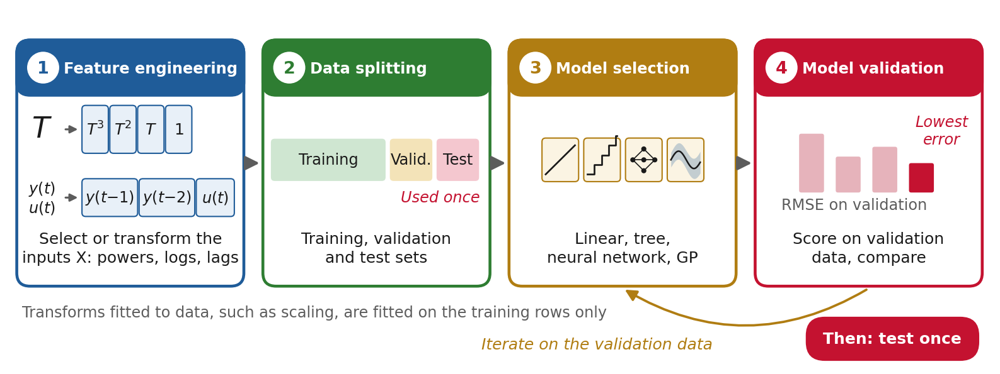

<!--
1 Feature engineering: select or transform the inputs (polynomial features of T, or the lagged
columns of a NARX table: Lecture 7's regressors are features). Anything fitted to data, such as a
scaler, is fitted after the split, on the training rows only.
2 Data splitting: training set to fit, test set to evaluate on unseen data.
3 Model selection: choose the algorithms.
4 Model validation: prevent overfitting, with metrics. Then the test set, once.
-->

---

## The workflow, three sets

<div class="definition">

The **training set** fits each model. The **validation set** compares models and chooses hyperparameters. The **test set** is used **once**, at the end, on the one model you chose.

</div>

- Look at the test score and change something: it has become validation data
- The test number is the number you report, even when you do not like it

```python
X_train, X_test, y_train, y_test = train_test_split(
    X, y,
    test_size=0.2,
    random_state=42,
)
```

---

## The workflow, scoring a regression model

<style scoped>table { font-size: 0.74em; }</style>

| Metric | Name | Formula | What it tells you |
|---|---|---|---|
| $R^2$ | Coefficient of determination | $1 - \sum (y_i - \hat{y}_i)^2 / \sum (y_i - \bar{y})^2$ | Share of the variance explained; 1 is perfect, 0 is the mean |
| MSE | Mean squared error | $\frac{1}{n}\sum (y_i - \hat{y}_i)^2$ | Punishes large errors; squared units |
| RMSE | Root mean squared error | $\sqrt{\text{MSE}}$ | Same penalty, in the **units of the target** |
| MAE | Mean absolute error | $\frac{1}{n}\sum \lvert y_i - \hat{y}_i \rvert$ | Robust to outliers; same units |

- RMSE much larger than MAE: a few large errors among many small ones
- **Parity plot**: predicted against measured; the diagonal is the perfect model

---

## The workflow, where is the training here?

`.fit` on a linear model solves **least squares** (Lecture 7's `lstsq`); other models solve other problems behind the same `.fit`.

```python
models = {
    "linear": LinearRegression(),
    "tree": DecisionTreeRegressor(),
    "neural network": MLPRegressor(),        # multi-layer perceptron
    "Gaussian process": GaussianProcessRegressor(),
}
for name, model in models.items():
    model.fit(X_train, y_train)        # each learns its own parameters
    y_pred = model.predict(X_valid)    # validation rows, split off X_train
```

Four **separate** models, fitted and scored the same way so we can **compare** them; nothing is averaged or combined.

<!--
scikit-learn testimonials (https://scikit-learn.org/stable/testimonials/testimonials.html): is it
used in real applications? Yes. The next section's question: what does each .fit solve?
-->

---

<!-- _class: section -->

# Training is an optimization problem

---

## Training as optimization, the problem you already know

<div class="opt-ann">

<svg class="opt-svg" viewBox="0 0 1100 390" width="1100" height="390">
<defs><marker id="opt-head" viewBox="0 0 10 10" refX="9" refY="5" markerWidth="8" markerHeight="8" orient="auto-start-reverse"><path d="M0,0 L10,5 L0,10 z" fill="#5c5c5c"/></marker></defs>
<g font-family="'Times New Roman', Times, serif" fill="#1a1a1a">
<text x="300" y="130" font-size="52">min</text>
<text x="330" y="172" font-size="34" font-style="italic">z</text>
<text x="430" y="130" font-size="52"><tspan font-style="italic">f</tspan>(<tspan font-style="italic">z</tspan>)</text>
<text x="300" y="235" font-size="44">s.t.</text>
<text x="430" y="235" font-size="52"><tspan font-style="italic">h</tspan>(<tspan font-style="italic">z</tspan>) = 0</text>
<text x="430" y="325" font-size="52"><tspan font-style="italic">g</tspan>(<tspan font-style="italic">z</tspan>) ≤ 0</text>
</g>
<path class="arr arr1" d="M 200 262 C 250 230, 300 205, 332 180" fill="none" stroke="#1f5c99" stroke-width="3" marker-end="url(#opt-head)"/>
<path class="arr arr2" d="M 650 75 C 600 80, 560 95, 520 105" fill="none" stroke="#c41230" stroke-width="3" marker-end="url(#opt-head)"/>
<path class="arr arr3" d="M 650 205 C 630 212, 625 216, 612 218" fill="none" stroke="#2e7d32" stroke-width="3" marker-end="url(#opt-head)"/>
<path class="arr arr4" d="M 650 318 C 630 314, 625 312, 612 310" fill="none" stroke="#b07d12" stroke-width="3" marker-end="url(#opt-head)"/>
</svg>

* **Decision variables** $z$: flows, temperatures, a design
* **Objective** $f(z)$: cost, energy, lost yield
* **Equality constraints** $h(z) = 0$: mass and energy balances, equilibrium
* **Inequality constraints** $g(z) \le 0$: bounds, purity, safety limits

</div>

<!--
The labels and their arrows come in one at a time.
-->

---

## Training as optimization, a model is f(x; θ)

<style scoped>
.opt-ann { height: 330px; }
.opt-ann li:nth-child(1) { left: 0; top: 235px; width: 330px; border-color: #1f5c99; }
.opt-ann li:nth-child(2) { left: 0; top: 0; width: 330px; border-color: #c41230; }
.opt-ann li:nth-child(3) { left: 770px; top: 0; width: 330px; border-color: #2e7d32; }
.opt-ann li:nth-child(4) { left: 770px; top: 235px; width: 330px; border-color: #b07d12; }
</style>

<div class="opt-ann">

<svg class="opt-svg" viewBox="0 0 1100 330" width="1100" height="330">
<defs><marker id="ann20-head" viewBox="0 0 10 10" refX="9" refY="5" markerWidth="8" markerHeight="8" orient="auto-start-reverse"><path d="M0,0 L10,5 L0,10 z" fill="#5c5c5c"/></marker></defs>
<g font-family="'Times New Roman', Times, serif" fill="#1a1a1a">
<text x="238" y="170" font-size="52">min</text>
<text x="268" y="210" font-size="34" font-style="italic">θ</text>
<text x="352" y="170" font-size="52"><tspan font-style="italic">L</tspan>(<tspan font-style="italic">θ</tspan>) =</text>
<text x="512" y="180" font-size="70">Σ</text>
<text x="528" y="214" font-size="30" font-style="italic">i</text>
<text x="570" y="170" font-size="52">(<tspan font-style="italic">y</tspan><tspan font-size="32" font-style="italic" dy="12">i</tspan><tspan dy="-12"> − </tspan><tspan font-style="italic">f</tspan>(<tspan font-style="italic">x</tspan><tspan font-size="32" font-style="italic" dy="12">i</tspan><tspan dy="-12">; </tspan><tspan font-style="italic">θ</tspan>))<tspan font-size="32" dy="-24">2</tspan></text>
</g>
<path class="arr arr1" d="M 250 262 C 262 245, 268 232, 272 218" fill="none" stroke="#1f5c99" stroke-width="3" marker-end="url(#ann20-head)"/>
<path class="arr arr2" d="M 334 60 C 362 80, 372 100, 376 128" fill="none" stroke="#c41230" stroke-width="3" marker-end="url(#ann20-head)"/>
<path class="arr arr3" d="M 766 60 C 745 85, 728 105, 722 130" fill="none" stroke="#2e7d32" stroke-width="3" marker-end="url(#ann20-head)"/>
<path class="arr arr4" d="M 766 262 C 710 240, 665 215, 630 192" fill="none" stroke="#b07d12" stroke-width="3" marker-end="url(#ann20-head)"/>
</svg>

* **Decision variables** $\theta$: the model's parameters (coefficients, weights)
* **Objective** $L(\theta)$: the **loss**, how badly the model misses the training data
* **The model** $f(x;\theta)$: turns the inputs $x_i$ into a prediction
* **The data** $(x_i, y_i)$: fixed numbers, the constants of the problem

</div>

No constraints: the parameters are free. Most training problems are unconstrained; the Gaussian process will add bounds.

<!--
The labels and their arrows come in one at a time. Same shape as the previous slide, now with the model's
parameters as the decision variables and the data as constants. Regularization adds a penalty
term to this objective, later in the regression section.
-->

---

## Training as optimization, how an optimizer moves

<style scoped>
.opt-ann { height: 350px; }
.opt-ann li:nth-child(1) { left: 0; top: 245px; width: 320px; border-color: #1f5c99; }
.opt-ann li:nth-child(2) { left: 0; top: 0; width: 320px; border-color: #c41230; }
.opt-ann li:nth-child(3) { left: 740px; top: 225px; width: 360px; border-color: #2e7d32; }
.opt-ann li:nth-child(4) { left: 740px; top: 0; width: 360px; border-color: #b07d12; }
</style>

<div class="opt-ann">

<svg class="opt-svg" viewBox="0 0 1100 350" width="1100" height="350">
<defs><marker id="ann21-head" viewBox="0 0 10 10" refX="9" refY="5" markerWidth="8" markerHeight="8" orient="auto-start-reverse"><path d="M0,0 L10,5 L0,10 z" fill="#5c5c5c"/></marker></defs>
<g font-family="'Times New Roman', Times, serif" fill="#1a1a1a" font-size="60">
<text x="330" y="190"><tspan font-style="italic">θ</tspan><tspan font-size="36" font-style="italic" dy="14">k</tspan><tspan font-size="36" dy="0">+1</tspan><tspan dy="-14"> = </tspan><tspan font-style="italic">θ</tspan><tspan font-size="36" font-style="italic" dy="14">k</tspan><tspan dy="-14"> − </tspan><tspan font-style="italic">η</tspan><tspan font-size="36" font-style="italic" dy="14">k</tspan><tspan dy="-14"> </tspan><tspan font-style="italic">H</tspan><tspan font-size="36" font-style="italic" dy="14">k</tspan><tspan dy="-14"> </tspan><tspan font-style="italic">g</tspan><tspan font-size="36" font-style="italic" dy="14">k</tspan></text>
</g>
<path class="arr arr1" d="M 322 275 C 420 260, 470 235, 490 205" fill="none" stroke="#1f5c99" stroke-width="3" marker-end="url(#ann21-head)"/>
<path class="arr arr2" d="M 324 60 C 520 80, 580 110, 598 142" fill="none" stroke="#c41230" stroke-width="3" marker-end="url(#ann21-head)"/>
<path class="arr arr3" d="M 736 260 C 736 240, 745 220, 752 205" fill="none" stroke="#2e7d32" stroke-width="3" marker-end="url(#ann21-head)"/>
<path class="arr arr4" d="M 736 60 C 700 90, 690 115, 688 140" fill="none" stroke="#b07d12" stroke-width="3" marker-end="url(#ann21-head)"/>
</svg>

* **Current point** $\theta_k$: where the parameters are now, at iteration $k$
* **Step length** $\eta_k$: how far to move
* **Gradient** $g_k = \nabla L(\theta_k)$: the uphill direction, so we step against it; computed from **all** the rows, or from a random **mini-batch** of a few rows
* **Step shaping** $H_k$: a matrix that rescales the step using the curvature of the loss; the **identity** matrix means no reshaping, plain gradient descent

</div>

<!--
Four terms, one at a time. This one update covers every method on the next slide; they differ
only in where g comes from and what H is.
-->

---

## Training as optimization, four methods

<style scoped>table { font-size: 0.7em; }</style>

| Method | Gradient $g_k$ from | Step shaping $H_k$ |
|---|---|---|
| Gradient descent | All the rows | The identity |
| Stochastic gradient descent (SGD) | A random **mini&#8209;batch** | The identity |
| Adam | A mini&#8209;batch, averaged over steps (momentum) | Diagonal: a step size per parameter, from the running average of $g^2$ |
| L-BFGS | All the rows | Inverse-Hessian estimate from the last $m$ steps, line search |

- In scikit-learn: `MLPRegressor` defaults to **Adam**; `solver="lbfgs"` for small data; every Gaussian process (GP) fit is **L-BFGS-B**, L-BFGS with bounds

<span class="source"><a href="https://doi.org/10.1007/BF01589116">Liu and Nocedal (1989)</a> / <a href="https://arxiv.org/abs/1412.6980">Kingma and Ba (2015)</a> / <a href="https://arxiv.org/abs/1606.04838">Bottou, Curtis and Nocedal (2018)</a></span>

<!--
One update for all of them: step = -eta H g. Gradient descent: H = I and the full gradient.
SGD: H = I and the gradient of a random mini-batch, a noisy estimate of the full one; cheap steps,
and the step length has to shrink for the iterates to settle. Adam: SGD plus two running
averages, of g (momentum) and of g squared (a step size per parameter), bias-corrected because
both start at zero; defaults 0.001, 0.9, 0.999. L-BFGS: quasi-Newton; keeps the last m pairs
(s = the step, y = the change in gradient) instead of a Hessian, builds H g from them, line
search; needs an exact full gradient, so small and medium data. scikit-learn's MLPRegressor docs:
adam "works pretty well on relatively large datasets (with thousands of training samples or
more)"; "for small datasets, however, 'lbfgs' can converge faster and perform better". The GP:
L-BFGS-B, with bounds on every hyperparameter.
-->

---

## Training as optimization, four optimizers on one problem

<style>
/* the four optimizers, animated */
.optw-widget { font-size: 22px; }
.optw-controls { display: flex; gap: 0.9em; align-items: center; justify-content: center; margin: 0 0 0.15em; }
.optw-controls input[type=range] { width: 460px; accent-color: #c41230; }
.optw-controls button { font: inherit; font-size: 20px; min-width: 5.4em; padding: 0.1em 0.6em; color: #c41230; background: #fff; border: 2px solid #c41230; border-radius: 6px; cursor: pointer; }
.optw-iter { min-width: 8.2em; color: #1a1a1a; font-variant-numeric: tabular-nums; }
.optw-widget svg { display: block; margin: 0 auto; }
</style>
<div class="optw-widget">
<div class="optw-controls">
<button type="button" id="optw-play">Play</button>
<input type="range" id="optw-clock" min="0" max="1" step="0.001" value="0">
<span class="optw-iter" id="optw-iter">Iteration 0</span>
</div>
<svg id="optw-svg" viewBox="0 0 1120 372" width="1120" height="372"></svg>
</div>

<script>
(() => {
  const svg = document.getElementById("optw-svg");
  if (!svg || svg.dataset.ready) return;
  svg.dataset.ready = "1";
  // The straight line P = a + b (T / 20 C) on the water data, the problem of opt-paths.png.
  // Printed by figures/make_figures.py widgets: the loss is LOSS_OPT + (w - W_OPT)' A (w - W_OPT),
  // and each path is that optimizer's own iterates, rounded to 0.01.
  const A = [[1.0,2.5005],[2.5005,8.544167]], W_OPT = [-15.562,20.78], LOSS_OPT = 53.010, START = [30.0,-10.0];
  const STEPS = {lbfgs: 6, gd: 305, adam: 249}, CAP = 2000;
  // L-BFGS, gradient descent and Adam up to the iterate from which each stays within 0.01 of
  // its last point; SGD at every iterate to SGD_FULL, then every SGD_EVERY-th, to the cap.
  const LBFGS = [[30.0,-10.0],[31.03,-5.11],[32.09,6.54],[25.71,9.24],[-10.57,20.51],[-15.55,20.8],[-15.57,20.78]];
  const GD = [[30.0,-10.0],[33.38,6.03],[32.08,6.42],[30.82,6.8],[29.59,7.17],[28.39,7.53],[27.23,7.89],[26.09,8.23],[24.99,8.56],[23.91,8.88],[22.87,9.2],[21.85,9.51],[20.86,9.81],[19.89,10.1],[18.95,10.38],[18.04,10.66],[17.14,10.92],[16.28,11.18],[15.43,11.44],[14.61,11.69],[13.81,11.93],[13.03,12.16],[12.28,12.39],[11.54,12.61],[10.82,12.83],[10.12,13.04],[9.44,13.25],[8.78,13.45],[8.13,13.64],[7.5,13.83],[6.89,14.01],[6.3,14.19],[5.72,14.37],[5.15,14.54],[4.6,14.7],[4.07,14.86],[3.55,15.02],[3.04,15.17],[2.55,15.32],[2.07,15.47],[1.6,15.61],[1.15,15.74],[0.7,15.88],[0.27,16.01],[-0.15,16.13],[-0.56,16.26],[-0.95,16.38],[-1.34,16.49],[-1.72,16.61],[-2.09,16.72],[-2.44,16.83],[-2.79,16.93],[-3.13,17.03],[-3.46,17.13],[-3.78,17.23],[-4.09,17.32],[-4.4,17.41],[-4.69,17.5],[-4.98,17.59],[-5.26,17.68],[-5.53,17.76],[-5.8,17.84],[-6.06,17.92],[-6.31,17.99],[-6.56,18.07],[-6.79,18.14],[-7.03,18.21],[-7.25,18.28],[-7.47,18.34],[-7.69,18.41],[-7.9,18.47],[-8.1,18.53],[-8.3,18.59],[-8.49,18.65],[-8.68,18.71],[-8.86,18.76],[-9.04,18.81],[-9.21,18.87],[-9.38,18.92],[-9.54,18.97],[-9.7,19.01],[-9.86,19.06],[-10.01,19.11],[-10.16,19.15],[-10.3,19.19],[-10.44,19.24],[-10.57,19.28],[-10.71,19.32],[-10.84,19.36],[-10.96,19.39],[-11.08,19.43],[-11.2,19.47],[-11.32,19.5],[-11.43,19.53],[-11.54,19.57],[-11.65,19.6],[-11.75,19.63],[-11.85,19.66],[-11.95,19.69],[-12.05,19.72],[-12.14,19.75],[-12.23,19.78],[-12.32,19.8],[-12.4,19.83],[-12.49,19.85],[-12.57,19.88],[-12.65,19.9],[-12.73,19.92],[-12.8,19.95],[-12.87,19.97],[-12.94,19.99],[-13.01,20.01],[-13.08,20.03],[-13.15,20.05],[-13.21,20.07],[-13.27,20.09],[-13.33,20.11],[-13.39,20.13],[-13.45,20.14],[-13.51,20.16],[-13.56,20.18],[-13.61,20.19],[-13.67,20.21],[-13.72,20.22],[-13.77,20.24],[-13.81,20.25],[-13.86,20.27],[-13.9,20.28],[-13.95,20.29],[-13.99,20.31],[-14.03,20.32],[-14.07,20.33],[-14.11,20.34],[-14.15,20.35],[-14.19,20.37],[-14.23,20.38],[-14.26,20.39],[-14.3,20.4],[-14.33,20.41],[-14.36,20.42],[-14.39,20.43],[-14.42,20.44],[-14.45,20.45],[-14.48,20.45],[-14.51,20.46],[-14.54,20.47],[-14.57,20.48],[-14.59,20.49],[-14.62,20.5],[-14.64,20.5],[-14.67,20.51],[-14.69,20.52],[-14.72,20.52],[-14.74,20.53],[-14.76,20.54],[-14.78,20.54],[-14.8,20.55],[-14.82,20.56],[-14.84,20.56],[-14.86,20.57],[-14.88,20.57],[-14.9,20.58],[-14.91,20.58],[-14.93,20.59],[-14.95,20.59],[-14.96,20.6],[-14.98,20.6],[-15.0,20.61],[-15.01,20.61],[-15.03,20.62],[-15.04,20.62],[-15.05,20.63],[-15.07,20.63],[-15.08,20.63],[-15.09,20.64],[-15.11,20.64],[-15.12,20.65],[-15.13,20.65],[-15.14,20.65],[-15.15,20.66],[-15.16,20.66],[-15.17,20.66],[-15.18,20.67],[-15.19,20.67],[-15.2,20.67],[-15.21,20.67],[-15.22,20.68],[-15.23,20.68],[-15.24,20.68],[-15.25,20.69],[-15.26,20.69],[-15.27,20.69],[-15.27,20.69],[-15.28,20.69],[-15.29,20.7],[-15.3,20.7],[-15.3,20.7],[-15.31,20.7],[-15.32,20.71],[-15.32,20.71],[-15.33,20.71],[-15.34,20.71],[-15.34,20.71],[-15.35,20.71],[-15.35,20.72],[-15.36,20.72],[-15.36,20.72],[-15.37,20.72],[-15.37,20.72],[-15.38,20.72],[-15.38,20.73],[-15.39,20.73],[-15.39,20.73],[-15.4,20.73],[-15.4,20.73],[-15.41,20.73],[-15.41,20.73],[-15.41,20.74],[-15.42,20.74],[-15.42,20.74],[-15.43,20.74],[-15.43,20.74],[-15.43,20.74],[-15.44,20.74],[-15.44,20.74],[-15.44,20.74],[-15.45,20.74],[-15.45,20.75],[-15.45,20.75],[-15.46,20.75],[-15.46,20.75],[-15.46,20.75],[-15.46,20.75],[-15.47,20.75],[-15.47,20.75],[-15.47,20.75],[-15.47,20.75],[-15.48,20.75],[-15.48,20.75],[-15.48,20.76],[-15.48,20.76],[-15.48,20.76],[-15.49,20.76],[-15.49,20.76],[-15.49,20.76],[-15.49,20.76],[-15.49,20.76],[-15.5,20.76],[-15.5,20.76],[-15.5,20.76],[-15.5,20.76],[-15.5,20.76],[-15.5,20.76],[-15.51,20.76],[-15.51,20.76],[-15.51,20.76],[-15.51,20.76],[-15.51,20.76],[-15.51,20.76],[-15.51,20.77],[-15.52,20.77],[-15.52,20.77],[-15.52,20.77],[-15.52,20.77],[-15.52,20.77],[-15.52,20.77],[-15.52,20.77],[-15.52,20.77],[-15.52,20.77],[-15.53,20.77],[-15.53,20.77],[-15.53,20.77],[-15.53,20.77],[-15.53,20.77],[-15.53,20.77],[-15.53,20.77],[-15.53,20.77],[-15.53,20.77],[-15.53,20.77],[-15.53,20.77],[-15.53,20.77],[-15.54,20.77],[-15.54,20.77],[-15.54,20.77],[-15.54,20.77],[-15.54,20.77],[-15.54,20.77],[-15.54,20.77],[-15.54,20.77],[-15.54,20.77],[-15.54,20.77],[-15.54,20.77],[-15.54,20.77],[-15.54,20.77],[-15.54,20.77],[-15.54,20.77],[-15.54,20.77],[-15.54,20.77],[-15.55,20.77],[-15.55,20.77],[-15.55,20.77],[-15.55,20.78],[-15.55,20.78],[-15.55,20.78],[-15.55,20.78],[-15.55,20.78],[-15.55,20.78],[-15.55,20.78],[-15.55,20.78],[-15.55,20.78],[-15.55,20.78],[-15.55,20.78],[-15.55,20.78],[-15.55,20.78],[-15.55,20.78],[-15.55,20.78],[-15.55,20.78],[-15.55,20.78],[-15.55,20.78],[-15.55,20.78]];
  const ADAM = [[30.0,-10.0],[31.0,-9.0],[32.0,-8.0],[32.98,-7.01],[33.95,-6.03],[34.9,-5.05],[35.83,-4.09],[36.71,-3.14],[37.55,-2.22],[38.33,-1.32],[39.04,-0.45],[39.66,0.39],[40.18,1.19],[40.59,1.95],[40.88,2.67],[41.06,3.34],[41.11,3.95],[41.04,4.51],[40.87,5.02],[40.58,5.46],[40.21,5.86],[39.74,6.2],[39.21,6.49],[38.61,6.73],[37.95,6.92],[37.24,7.07],[36.49,7.19],[35.71,7.27],[34.9,7.32],[34.07,7.35],[33.23,7.36],[32.37,7.36],[31.51,7.35],[30.65,7.33],[29.8,7.32],[28.95,7.31],[28.12,7.3],[27.3,7.31],[26.5,7.33],[25.71,7.37],[24.95,7.43],[24.22,7.5],[23.5,7.6],[22.81,7.72],[22.15,7.85],[21.51,8.01],[20.89,8.18],[20.3,8.37],[19.73,8.58],[19.17,8.8],[18.63,9.03],[18.11,9.28],[17.6,9.53],[17.1,9.78],[16.61,10.04],[16.13,10.3],[15.65,10.55],[15.17,10.81],[14.69,11.06],[14.21,11.3],[13.73,11.53],[13.25,11.76],[12.76,11.98],[12.27,12.18],[11.78,12.38],[11.28,12.57],[10.78,12.74],[10.28,12.91],[9.77,13.07],[9.27,13.22],[8.76,13.36],[8.26,13.49],[7.75,13.62],[7.25,13.74],[6.75,13.86],[6.26,13.98],[5.77,14.09],[5.29,14.21],[4.82,14.32],[4.36,14.44],[3.9,14.55],[3.46,14.67],[3.02,14.78],[2.6,14.9],[2.18,15.02],[1.77,15.14],[1.38,15.27],[0.99,15.39],[0.61,15.52],[0.24,15.64],[-0.12,15.77],[-0.48,15.9],[-0.82,16.02],[-1.16,16.15],[-1.5,16.27],[-1.83,16.39],[-2.15,16.51],[-2.47,16.62],[-2.78,16.74],[-3.09,16.84],[-3.4,16.95],[-3.7,17.05],[-3.99,17.15],[-4.29,17.25],[-4.58,17.34],[-4.86,17.43],[-5.14,17.52],[-5.42,17.6],[-5.69,17.68],[-5.96,17.76],[-6.22,17.84],[-6.48,17.91],[-6.73,17.99],[-6.98,18.06],[-7.22,18.13],[-7.45,18.2],[-7.68,18.27],[-7.91,18.33],[-8.13,18.4],[-8.34,18.47],[-8.55,18.53],[-8.76,18.6],[-8.95,18.66],[-9.15,18.72],[-9.34,18.78],[-9.52,18.84],[-9.7,18.9],[-9.87,18.96],[-10.04,19.02],[-10.21,19.07],[-10.37,19.13],[-10.53,19.18],[-10.68,19.23],[-10.83,19.28],[-10.98,19.33],[-11.12,19.38],[-11.26,19.42],[-11.4,19.47],[-11.54,19.51],[-11.67,19.55],[-11.79,19.59],[-11.92,19.63],[-12.04,19.67],[-12.16,19.7],[-12.27,19.74],[-12.38,19.77],[-12.49,19.81],[-12.6,19.84],[-12.7,19.87],[-12.8,19.9],[-12.9,19.93],[-12.99,19.96],[-13.08,19.99],[-13.17,20.02],[-13.26,20.04],[-13.34,20.07],[-13.42,20.1],[-13.5,20.12],[-13.57,20.14],[-13.64,20.17],[-13.71,20.19],[-13.78,20.21],[-13.85,20.24],[-13.91,20.26],[-13.98,20.28],[-14.04,20.3],[-14.09,20.31],[-14.15,20.33],[-14.21,20.35],[-14.26,20.37],[-14.31,20.38],[-14.36,20.4],[-14.41,20.41],[-14.45,20.43],[-14.5,20.44],[-14.54,20.46],[-14.58,20.47],[-14.63,20.48],[-14.66,20.49],[-14.7,20.51],[-14.74,20.52],[-14.77,20.53],[-14.81,20.54],[-14.84,20.55],[-14.87,20.56],[-14.9,20.57],[-14.93,20.58],[-14.96,20.59],[-14.98,20.6],[-15.01,20.6],[-15.04,20.61],[-15.06,20.62],[-15.08,20.63],[-15.1,20.63],[-15.13,20.64],[-15.15,20.65],[-15.16,20.65],[-15.18,20.66],[-15.2,20.67],[-15.22,20.67],[-15.24,20.68],[-15.25,20.68],[-15.27,20.69],[-15.28,20.69],[-15.3,20.7],[-15.31,20.7],[-15.32,20.7],[-15.33,20.71],[-15.35,20.71],[-15.36,20.71],[-15.37,20.72],[-15.38,20.72],[-15.39,20.72],[-15.4,20.73],[-15.41,20.73],[-15.41,20.73],[-15.42,20.74],[-15.43,20.74],[-15.44,20.74],[-15.45,20.74],[-15.45,20.74],[-15.46,20.75],[-15.46,20.75],[-15.47,20.75],[-15.48,20.75],[-15.48,20.75],[-15.49,20.76],[-15.49,20.76],[-15.49,20.76],[-15.5,20.76],[-15.5,20.76],[-15.51,20.76],[-15.51,20.76],[-15.51,20.76],[-15.52,20.77],[-15.52,20.77],[-15.52,20.77],[-15.53,20.77],[-15.53,20.77],[-15.53,20.77],[-15.53,20.77],[-15.54,20.77],[-15.54,20.77],[-15.54,20.77],[-15.54,20.77],[-15.54,20.77],[-15.54,20.77],[-15.55,20.77],[-15.55,20.78],[-15.55,20.78],[-15.55,20.78],[-15.55,20.78],[-15.55,20.78],[-15.55,20.78]];
  const SGD_FULL = 400, SGD_EVERY = 4;
  const SGD = [[30.0,-10.0],[32.48,0.77],[32.56,3.88],[31.26,2.61],[32.27,8.11],[30.86,6.24],[30.38,7.02],[29.08,5.72],[28.46,6.38],[28.77,8.82],[28.31,7.96],[27.88,8.22],[27.02,8.17],[27.01,8.88],[25.95,7.31],[25.54,8.38],[24.72,7.23],[24.58,8.45],[23.44,6.75],[22.48,5.61],[23.84,13.43],[22.63,11.52],[22.19,11.34],[21.62,11.11],[20.58,9.49],[20.04,10.04],[18.95,8.44],[18.74,10.21],[18.82,11.0],[17.58,9.9],[17.71,10.76],[17.4,11.77],[17.36,13.0],[16.79,11.99],[15.5,10.35],[15.24,10.6],[15.06,11.66],[13.99,10.2],[13.04,8.95],[14.1,13.91],[13.84,13.48],[13.08,12.19],[13.09,13.13],[12.58,13.45],[11.67,12.46],[11.16,11.45],[11.8,15.11],[10.86,13.33],[10.49,13.43],[9.82,12.47],[9.54,12.52],[8.81,11.41],[8.54,11.57],[9.76,17.34],[8.77,14.88],[8.05,13.71],[7.16,12.36],[6.7,11.58],[7.08,14.83],[7.05,15.3],[6.79,15.19],[6.43,14.73],[5.94,14.78],[5.21,13.48],[5.58,15.84],[5.02,14.68],[4.76,15.33],[4.32,14.59],[3.72,13.64],[3.7,14.2],[4.06,16.36],[4.05,17.16],[3.3,15.64],[2.67,14.7],[2.54,14.94],[2.43,15.34],[2.29,15.86],[2.09,15.93],[2.02,16.85],[1.45,15.17],[1.01,14.65],[1.08,16.1],[0.73,16.13],[0.21,15.04],[0.47,16.92],[0.15,16.14],[-0.08,16.32],[-0.18,17.13],[-0.53,16.18],[-0.58,16.72],[-0.98,15.87],[-0.76,17.7],[-0.84,18.17],[-1.53,17.08],[-1.79,16.4],[-2.11,15.65],[-1.48,18.96],[-2.02,17.81],[-2.49,16.71],[-2.55,16.9],[-3.21,15.77],[-3.1,16.78],[-3.23,17.01],[-3.55,16.2],[-3.52,17.06],[-3.94,16.1],[-4.1,15.73],[-4.31,15.55],[-4.42,15.76],[-3.64,19.43],[-4.39,17.6],[-4.68,17.0],[-4.36,19.12],[-4.81,18.05],[-5.27,17.28],[-5.32,17.39],[-5.18,18.09],[-5.07,18.76],[-5.43,18.2],[-5.83,17.58],[-6.1,17.05],[-6.23,16.93],[-5.6,19.89],[-6.16,18.84],[-6.44,18.27],[-6.58,18.24],[-6.62,18.66],[-6.84,18.25],[-7.07,17.48],[-7.2,17.58],[-6.93,19.2],[-7.32,18.26],[-7.06,19.39],[-7.18,19.23],[-7.77,18.06],[-7.95,17.87],[-7.77,18.57],[-8.07,18.18],[-7.82,19.78],[-8.05,19.24],[-8.38,18.45],[-8.29,18.7],[-8.37,18.7],[-8.2,19.89],[-8.7,18.81],[-8.89,18.48],[-9.01,18.07],[-9.02,18.35],[-9.0,18.94],[-8.86,19.63],[-9.34,18.63],[-9.37,18.44],[-9.4,18.4],[-9.43,18.96],[-9.48,19.42],[-9.59,19.37],[-10.02,18.26],[-9.97,18.65],[-10.13,18.76],[-9.97,19.69],[-9.93,19.63],[-10.01,19.03],[-10.31,18.42],[-10.3,19.02],[-10.27,19.68],[-10.41,19.25],[-10.48,19.27],[-10.68,18.7],[-10.75,19.1],[-10.64,20.13],[-10.82,19.74],[-11.07,19.45],[-11.19,19.93],[-11.44,19.24],[-11.19,19.68],[-11.16,19.62],[-11.16,19.36],[-11.51,18.63],[-11.2,19.4],[-11.45,19.03],[-11.19,20.5],[-11.25,20.3],[-11.73,19.17],[-11.4,20.16],[-11.85,19.25],[-11.93,18.79],[-12.11,18.42],[-11.99,18.91],[-11.83,19.99],[-11.71,19.88],[-11.82,19.84],[-11.63,19.81],[-11.94,19.14],[-12.07,19.44],[-12.06,19.9],[-11.98,20.24],[-12.34,19.5],[-12.29,19.93],[-11.89,20.58],[-12.26,19.72],[-12.54,19.04],[-12.35,19.31],[-12.32,19.84],[-12.43,19.17],[-12.57,19.08],[-12.58,19.35],[-12.68,19.13],[-12.57,19.39],[-12.51,20.17],[-12.64,19.9],[-12.51,20.14],[-12.46,19.53],[-12.08,21.31],[-12.61,20.14],[-12.75,19.69],[-12.83,19.82],[-12.83,20.31],[-13.2,19.51],[-13.11,19.72],[-12.84,20.34],[-13.0,20.14],[-13.11,20.02],[-13.05,19.66],[-13.09,19.36],[-12.93,20.34],[-13.2,20.01],[-13.24,19.64],[-13.18,19.91],[-13.26,19.39],[-13.37,19.21],[-13.19,20.44],[-13.13,20.73],[-13.15,21.11],[-13.42,20.42],[-13.39,20.23],[-13.63,19.39],[-13.93,18.77],[-13.67,20.25],[-13.59,20.82],[-13.79,20.16],[-13.44,20.57],[-13.77,19.95],[-13.83,19.87],[-13.67,21.06],[-13.88,20.39],[-13.78,20.68],[-13.5,21.37],[-13.66,20.7],[-14.05,19.86],[-14.21,19.48],[-13.95,20.33],[-13.95,19.94],[-13.4,22.0],[-13.86,20.51],[-13.98,20.27],[-14.26,19.54],[-14.38,19.37],[-14.08,20.36],[-14.06,20.6],[-14.32,19.93],[-13.99,20.73],[-14.15,20.54],[-14.01,20.3],[-14.24,19.73],[-14.24,20.17],[-14.21,20.09],[-14.35,19.97],[-14.45,19.48],[-14.25,20.14],[-13.87,21.08],[-14.31,19.98],[-14.33,20.2],[-14.19,20.17],[-14.29,20.35],[-14.34,20.03],[-14.2,20.61],[-14.19,20.46],[-14.09,20.92],[-14.36,20.29],[-14.53,20.28],[-14.44,20.06],[-14.39,20.46],[-14.55,20.07],[-14.47,20.97],[-14.67,20.12],[-14.58,20.68],[-14.74,20.18],[-14.92,19.67],[-14.91,20.16],[-14.78,20.78],[-14.63,21.43],[-14.89,20.63],[-15.06,20.69],[-14.77,21.27],[-14.67,21.21],[-14.89,20.7],[-15.29,19.79],[-14.95,20.91],[-14.78,20.85],[-15.06,20.16],[-14.72,21.37],[-14.9,20.45],[-14.73,20.71],[-14.75,20.94],[-14.92,20.47],[-14.94,20.92],[-14.93,21.37],[-15.0,21.14],[-14.67,21.65],[-15.12,20.55],[-15.2,20.11],[-14.97,20.73],[-15.01,21.0],[-14.89,20.79],[-14.91,20.99],[-15.38,19.89],[-15.35,19.82],[-15.05,20.58],[-15.19,20.25],[-15.09,20.72],[-15.22,20.44],[-15.03,20.18],[-14.8,21.14],[-14.91,20.8],[-15.09,20.87],[-15.35,20.13],[-15.27,19.85],[-14.97,21.45],[-15.06,21.34],[-15.46,20.29],[-15.53,19.97],[-15.66,19.53],[-15.36,21.04],[-15.13,20.75],[-15.15,21.08],[-15.38,20.55],[-15.12,22.06],[-15.57,20.6],[-15.74,20.08],[-15.67,19.84],[-15.55,19.71],[-15.33,20.64],[-14.87,21.08],[-15.1,20.7],[-15.47,19.96],[-15.26,20.95],[-15.32,21.09],[-14.99,21.03],[-15.02,21.08],[-15.19,20.84],[-15.4,20.41],[-14.98,20.9],[-15.18,20.31],[-15.23,20.45],[-15.38,19.95],[-15.29,20.83],[-15.13,20.97],[-15.37,20.35],[-15.15,20.6],[-15.14,21.16],[-15.31,20.8],[-15.21,20.72],[-14.89,21.49],[-14.88,21.66],[-15.21,20.82],[-15.51,20.2],[-15.49,19.72],[-15.4,19.66],[-15.4,19.52],[-15.2,20.58],[-15.18,21.03],[-15.26,21.18],[-15.26,20.59],[-15.55,19.9],[-15.35,20.35],[-15.05,21.36],[-15.39,20.43],[-15.07,21.12],[-15.41,20.39],[-15.42,20.93],[-15.19,21.01],[-15.3,20.68],[-15.0,21.73],[-15.48,20.46],[-15.45,21.13],[-15.33,20.71],[-15.17,20.67],[-15.38,20.08],[-15.36,20.58],[-15.47,20.19],[-15.1,21.59],[-14.79,21.88],[-14.81,21.9],[-15.22,20.89],[-15.33,20.58],[-15.57,20.05],[-15.5,20.54],[-15.3,21.11],[-15.47,21.02],[-15.56,20.85],[-15.41,20.55],[-15.32,20.78],[-15.58,19.82],[-14.95,22.16],[-15.63,19.65],[-15.25,21.19],[-15.43,20.73],[-15.43,19.99],[-15.56,19.61],[-15.22,20.85],[-15.22,21.4],[-15.46,20.66],[-15.18,21.3],[-15.3,21.24],[-15.72,20.43],[-15.59,20.56],[-15.68,20.47],[-15.5,20.87],[-15.63,21.02],[-15.9,20.5],[-15.58,21.99],[-16.0,20.86],[-15.61,21.61],[-15.97,21.01],[-16.28,21.32],[-16.18,20.88],[-15.93,21.4],[-15.75,21.94],[-15.99,21.54],[-16.29,20.43],[-15.88,21.23],[-15.73,21.78],[-15.66,21.72],[-16.12,20.2],[-16.12,20.75],[-15.96,20.88],[-15.97,21.31],[-15.93,20.31],[-15.7,20.03],[-15.54,20.97],[-15.52,21.33],[-15.69,20.51],[-15.66,20.02],[-15.97,20.03],[-15.58,20.97],[-15.68,20.71],[-15.5,20.68],[-15.78,21.23],[-16.06,20.38],[-15.84,20.55],[-15.61,21.01],[-15.79,20.99],[-15.41,21.58],[-15.72,20.34],[-15.79,20.71],[-15.59,21.09],[-15.37,21.34],[-15.61,21.0],[-15.73,20.5],[-15.56,20.86],[-15.72,20.38],[-15.61,20.43],[-15.3,21.0],[-15.24,21.84],[-15.54,20.31],[-15.36,21.37],[-15.59,20.82],[-15.23,20.72],[-15.84,20.18],[-15.51,20.41],[-15.29,21.58],[-16.11,20.22],[-15.72,20.47],[-15.39,20.68],[-15.7,20.5],[-15.61,20.99],[-15.65,21.99],[-15.66,21.4],[-15.58,20.77],[-15.69,20.67],[-15.8,20.72],[-16.04,20.84],[-16.03,20.01],[-15.95,20.27],[-15.53,21.34],[-15.67,20.75],[-15.77,20.2],[-15.32,21.41],[-15.84,20.57],[-15.68,21.3],[-15.74,20.45],[-15.5,20.78],[-15.52,20.26],[-15.65,20.89],[-16.0,20.41],[-15.81,20.89],[-15.78,20.44],[-15.36,21.33],[-15.86,21.17],[-15.98,20.27],[-15.69,20.67],[-15.79,21.07],[-15.87,20.18],[-15.75,21.27],[-15.7,20.42],[-15.77,20.55],[-15.63,20.91],[-15.82,20.51],[-15.95,20.0],[-15.4,21.68],[-15.48,20.96],[-15.53,21.22],[-15.48,20.5],[-15.26,20.59],[-15.7,20.16],[-15.24,21.61],[-15.19,21.33],[-15.54,20.89],[-15.52,20.56],[-15.49,21.35],[-15.46,21.4],[-15.5,21.2],[-15.3,21.73],[-15.63,21.62],[-15.53,20.83],[-15.64,20.98],[-15.64,20.86],[-15.62,20.44],[-15.81,20.33],[-15.56,21.43],[-15.76,20.31],[-15.64,19.98],[-15.6,20.58],[-15.44,21.0],[-15.52,20.65],[-15.77,20.42],[-15.64,20.46],[-15.74,20.66],[-15.54,20.93],[-15.61,20.23],[-15.65,20.46],[-15.87,20.62],[-15.74,20.2],[-15.64,20.7],[-15.79,20.87],[-15.78,20.24],[-15.49,21.05],[-15.63,20.55],[-15.84,20.52],[-15.49,20.59],[-15.55,20.67],[-15.51,21.72],[-15.62,21.01],[-15.54,21.17],[-15.25,21.55],[-15.41,21.24],[-15.49,20.91],[-15.1,22.36],[-15.49,20.33],[-16.0,20.36],[-15.95,20.79],[-15.75,21.55],[-16.13,20.24],[-15.84,20.93],[-15.48,22.14],[-15.98,20.51],[-15.77,20.78],[-15.54,21.11],[-15.93,20.44],[-15.98,20.32],[-15.51,21.86],[-15.6,21.24],[-15.71,20.17],[-16.03,20.08],[-15.31,21.81],[-15.8,20.66],[-15.84,19.92],[-15.62,20.69],[-16.16,20.12],[-15.49,21.76],[-15.76,21.54],[-16.02,20.43],[-15.59,20.84],[-15.76,21.36],[-16.03,19.75],[-15.77,21.16],[-15.54,21.86],[-15.9,21.01],[-16.09,20.42],[-15.6,21.49],[-16.0,20.26],[-15.84,20.4],[-15.82,20.58],[-15.54,21.1],[-15.89,20.18],[-15.56,21.63],[-15.75,20.27],[-15.65,20.31],[-15.86,20.64],[-16.06,19.9],[-15.31,22.04],[-15.32,21.73],[-15.78,20.95],[-15.85,20.9],[-15.76,20.0],[-15.68,20.65],[-15.64,20.51],[-15.94,20.39],[-15.2,22.22],[-16.03,20.16],[-15.82,20.73],[-15.7,20.84],[-15.58,21.19],[-15.72,21.03],[-16.07,20.22],[-15.67,21.21],[-15.82,21.5],[-15.89,20.65],[-15.89,20.49],[-15.44,21.5],[-15.63,21.16],[-15.62,21.09],[-15.57,20.62],[-15.4,21.33],[-15.74,21.06],[-15.66,20.79],[-15.9,20.62],[-15.71,20.79],[-15.5,21.03],[-15.46,20.39],[-15.75,20.48],[-15.51,20.83],[-15.89,20.31],[-15.89,21.06],[-16.08,20.14],[-15.82,20.7],[-16.0,20.83],[-15.77,20.46],[-15.42,21.08],[-16.03,20.16],[-15.25,22.3],[-15.59,20.8],[-15.64,20.5],[-15.58,20.57],[-15.43,21.66],[-15.95,20.35],[-15.88,20.03],[-15.75,20.34],[-15.5,21.01],[-15.79,20.4],[-15.39,21.51],[-15.67,20.24],[-15.24,21.14],[-15.93,20.48],[-15.47,20.78],[-15.57,21.04],[-15.39,21.33],[-16.05,20.84],[-15.51,20.72],[-15.7,21.05],[-15.33,21.77],[-15.8,21.2],[-15.66,20.78],[-15.95,20.77],[-15.73,20.89],[-15.85,20.71],[-15.71,21.27],[-15.69,20.53],[-15.76,21.57],[-15.53,20.65],[-15.83,20.74],[-15.71,20.62],[-15.79,20.95],[-15.67,21.23],[-15.86,20.63],[-15.64,20.99],[-15.8,21.22],[-15.68,20.95],[-15.83,20.23],[-15.7,20.44],[-15.62,20.92],[-15.94,20.33],[-15.7,21.04],[-15.73,20.62],[-15.56,20.63],[-15.28,21.88],[-15.63,20.05],[-15.45,21.47],[-15.49,21.09],[-15.72,20.02],[-15.74,20.58],[-15.44,21.39],[-15.59,20.3],[-15.7,20.8],[-15.66,21.22],[-15.54,21.13],[-15.58,20.26],[-15.62,20.92],[-16.01,20.02],[-15.53,21.35],[-15.82,20.33],[-15.65,21.72],[-15.75,21.19],[-15.43,21.19],[-15.5,20.8],[-15.89,20.0],[-15.68,20.36],[-15.8,20.93],[-15.67,20.36],[-15.46,20.72],[-15.52,21.35],[-15.56,21.39],[-15.67,20.74],[-15.69,20.96],[-15.82,19.74],[-15.57,20.72],[-15.54,20.46],[-15.69,20.85],[-15.81,20.45],[-15.71,20.49],[-15.47,20.92],[-15.34,21.54],[-15.58,20.71],[-15.33,20.8],[-15.57,20.65],[-15.54,20.88],[-15.69,20.63],[-15.87,20.4],[-15.76,20.61],[-15.63,21.75],[-15.83,20.65],[-15.93,19.86],[-15.45,21.42],[-15.64,21.12],[-15.5,21.42],[-16.0,20.38],[-15.74,21.38],[-16.06,20.56],[-15.94,20.06],[-15.67,21.15],[-15.81,20.52],[-15.48,21.24],[-15.93,20.32],[-15.53,20.77],[-15.99,20.14],[-15.85,20.79],[-16.12,19.7],[-15.9,21.12],[-15.82,19.97],[-16.21,20.13],[-15.71,21.33],[-15.54,21.53],[-15.82,20.76],[-15.7,20.99],[-16.1,19.74],[-15.66,20.99],[-15.72,20.56],[-15.44,20.92],[-15.61,21.66],[-16.03,20.73],[-15.66,21.31],[-15.68,20.82],[-16.12,19.77],[-15.9,20.32],[-15.45,21.36],[-15.74,20.92],[-15.75,20.71],[-15.9,21.26],[-15.66,20.63],[-15.7,21.16],[-15.8,20.84],[-15.41,21.85],[-15.67,21.27],[-15.71,19.92],[-15.83,20.94],[-15.89,20.35],[-15.55,21.91],[-15.72,21.08],[-15.65,21.68],[-16.07,20.81],[-15.96,20.84],[-15.84,21.35],[-16.12,20.49],[-15.81,21.5],[-15.8,21.5],[-16.1,20.19],[-15.54,21.85],[-15.5,21.95],[-15.75,20.46],[-15.68,20.87],[-15.83,20.83],[-15.88,21.61],[-15.87,21.16],[-15.48,21.21],[-15.59,21.61],[-15.74,20.87],[-15.5,21.46],[-15.65,20.5],[-15.38,21.94],[-15.42,20.95],[-15.94,19.85]];
  const NS = "http://www.w3.org/2000/svg";
  const el = (tag, attrs, text) => {
    const e = document.createElementNS(NS, tag);
    for (const k in attrs) e.setAttribute(k, attrs[k]);
    if (text !== undefined) e.textContent = text;
    return e;
  };
  const add = (tag, attrs, text, parent = svg) => parent.appendChild(el(tag, attrs, text));
  const P = {x0: 84, x1: 736, y0: 8, y1: 314, xa: -24, xb: 48, ya: -14, yb: 26.5};
  const sx = v => P.x0 + (v - P.xa) / (P.xb - P.xa) * (P.x1 - P.x0);
  const sy = v => P.y1 - (v - P.ya) / (P.yb - P.ya) * (P.y1 - P.y0);
  const xy = w => `${sx(w[0]).toFixed(1)},${sy(w[1]).toFixed(1)}`;
  add("clipPath", {id: "optw-clip"}).appendChild(el("rect", {x: P.x0, y: P.y0, width: P.x1 - P.x0, height: P.y1 - P.y0}));
  const plot = add("g", {"clip-path": "url(#optw-clip)"});
  // contours at the static figure's levels, LOSS_OPT times 10^-2 to 10^2.5 above the minimum:
  // with A = R'R, the ellipse (w - W_OPT)' A (w - W_OPT) = c is W_OPT + sqrt(c) R^-1 (cos t, sin t)
  const r11 = Math.sqrt(A[0][0]), r12 = A[0][1] / r11, r22 = Math.sqrt(A[1][1] - r12 * r12);
  // cut each contour at the frame, so no element's box runs outside the plot
  const cut = (a, b) => {
    let t0 = 0, t1 = 1;
    const d = [b[0] - a[0], b[1] - a[1]];
    for (const [q, r] of [[-d[0], a[0] - P.x0], [d[0], P.x1 - a[0]], [-d[1], a[1] - P.y0], [d[1], P.y1 - a[1]]]) {
      if (q === 0) { if (r < 0) return null; continue; }
      const t = r / q;
      if (q < 0) { if (t > t1) return null; t0 = Math.max(t0, t); } else { if (t < t0) return null; t1 = Math.min(t1, t); }
    }
    return {t0, t1, a: [a[0] + t0 * d[0], a[1] + t0 * d[1]], b: [a[0] + t1 * d[0], a[1] + t1 * d[1]]};
  };
  for (let i = 0; i < 10; i++) {
    const s = Math.sqrt(LOSS_OPT * 10 ** (-2 + 0.5 * i)), ring = [], runs = [];
    for (let j = 0; j < 360; j++) {
      const t = 2 * Math.PI * j / 360, v = s * Math.sin(t) / r22, u = (s * Math.cos(t) - r12 * v) / r11;
      ring.push([sx(W_OPT[0] + u), sy(W_OPT[1] + v)]);
    }
    let run = null;
    ring.forEach((a, j) => {
      const c = cut(a, ring[(j + 1) % ring.length]);
      if (!c) { run = null; return; }
      if (!run || c.t0 > 0) { run = [c.a]; runs.push(run); }
      run.push(c.b);
      if (c.t1 < 1) run = null;
    });
    runs.forEach(r => add("polyline", {points: r.map(q => `${q[0].toFixed(1)},${q[1].toFixed(1)}`).join(" "),
      fill: "none", stroke: "#c7c7c7", "stroke-width": 1.3}, undefined, plot));
  }
  add("rect", {x: P.x0, y: P.y0, width: P.x1 - P.x0, height: P.y1 - P.y0, fill: "none", stroke: "#bbb"});
  const minus = v => String(v).replace("-", "−");
  [-20, -10, 0, 10, 20, 30, 40].forEach(v => add("text", {x: sx(v), y: P.y1 + 24, "text-anchor": "middle", "font-size": 18, fill: "#5c5c5c"}, minus(v)));
  [-10, 0, 10, 20].forEach(v => add("text", {x: P.x0 - 10, y: sy(v) + 6, "text-anchor": "end", "font-size": 18, fill: "#5c5c5c"}, minus(v)));
  add("text", {x: (P.x0 + P.x1) / 2, y: P.y1 + 52, "text-anchor": "middle", "font-size": 20, fill: "#1a1a1a"}, "Intercept a (MPa)");
  add("text", {x: P.x0 - 52, y: (P.y0 + P.y1) / 2, "text-anchor": "middle", "font-size": 20, fill: "#1a1a1a",
    transform: `rotate(-90 ${P.x0 - 52} ${(P.y0 + P.y1) / 2})`}, "Slope b (MPa per 20 C)");
  // drawn bottom to top as in the static figure: SGD, gradient descent, Adam, L-BFGS
  const RUNS = [
    {path: SGD, color: "#b07d12", width: 1.4, steps: null, name: "SGD, batches of 4", sub: `(still jittering after ${CAP.toLocaleString("en-US")})`, row: 3},
    {path: GD, color: "#1f5c99", width: 3, steps: STEPS.gd, name: "Gradient descent", row: 1},
    {path: ADAM, color: "#2e7d32", width: 3, steps: STEPS.adam, name: "Adam, full batch", row: 2},
    {path: LBFGS, color: "#c41230", width: 2.6, steps: STEPS.lbfgs, name: "L-BFGS", row: 0, dots: true},
  ];
  RUNS.forEach(m => {
    m.pts = m.path.map(xy);
    m.index = m.path === SGD
      ? n => (n <= SGD_FULL ? n : SGD_FULL + Math.floor((n - SGD_FULL) / SGD_EVERY))
      : n => Math.min(n, m.path.length - 1);
    m.trail = add("polyline", {fill: "none", stroke: m.color, "stroke-width": m.width, "stroke-linejoin": "round", "stroke-opacity": m.path === SGD ? 0.9 : 1}, undefined, plot);
    m.marks = m.dots ? m.path.map(w => add("circle", {cx: sx(w[0]), cy: sy(w[1]), r: 5, fill: m.color}, undefined, plot)) : [];
    m.shown = -1;
  });
  add("circle", {cx: sx(START[0]), cy: sy(START[1]), r: 8, fill: "#1a1a1a"});
  const halo = {"font-size": 20, fill: "#1a1a1a", stroke: "#fff", "stroke-width": 6, "paint-order": "stroke", "stroke-linejoin": "round"};
  add("text", {...halo, x: sx(START[0]) + 14, y: sy(START[1]) + 7}, "Start");
  const star = [];
  for (let j = 0; j < 10; j++) {
    const rad = j % 2 ? 6 : 15, t = Math.PI / 2 + Math.PI * j / 5;
    star.push(`${(sx(W_OPT[0]) + rad * Math.cos(t)).toFixed(1)},${(sy(W_OPT[1]) - rad * Math.sin(t)).toFixed(1)}`);
  }
  add("polygon", {points: star.join(" "), fill: "#1a1a1a", stroke: "#fff", "stroke-width": 1.5});
  add("text", {...halo, x: sx(W_OPT[0]), y: sy(W_OPT[1]) - 22, "text-anchor": "middle"}, "Optimum");
  RUNS.forEach(m => { m.head = add("circle", {r: 7, fill: m.color, stroke: "#fff", "stroke-width": 2}); });
  // the legend, in the static figure's order, with each method's steps to converge
  const LX = 770;
  RUNS.forEach(m => {
    const y = 40 + 46 * m.row;
    add("line", {x1: LX, x2: LX + 36, y1: y - 7, y2: y - 7, stroke: m.color, "stroke-width": Math.max(m.width, 2.5)});
    if (m.dots) add("circle", {cx: LX + 18, cy: y - 7, r: 5, fill: m.color});
    m.label = add("text", {x: LX + 48, y, "font-size": 20, fill: "#1a1a1a"},
      m.steps === null ? m.name : `${m.name} (${m.steps.toLocaleString("en-US")} steps)`);
    if (m.sub) add("text", {x: LX + 48, y: y + 25, "font-size": 20, fill: "#1a1a1a"}, m.sub);
  });
  const note = ["Bold: reached the minimum", "The clock speeds up as it runs", `SGD is drawn at every step to ${SGD_FULL},`, `then every ${SGD_EVERY}th`];
  note.forEach((t, i) => add("text", {x: LX, y: 260 + 25 * i, "font-size": 18, fill: "#5c5c5c"}, t));
  // one clock for all four, the iteration number, on a log scale so the first steps can be seen
  const DUR = 14000, C = 2;
  const iterAt = p => (p >= 1 ? CAP : Math.floor(C * (Math.pow(1 + CAP / C, p) - 1) + 1e-9));
  const slider = document.getElementById("optw-clock");
  const btn = document.getElementById("optw-play");
  const readout = document.getElementById("optw-iter");
  let p = 0;
  const draw = () => {
    const n = iterAt(p);
    RUNS.forEach(m => {
      const i = m.index(n);
      if (i !== m.shown) {
        m.trail.setAttribute("points", m.pts.slice(0, i + 1).join(" "));
        m.marks.forEach((c, j) => c.setAttribute("visibility", j <= i ? "visible" : "hidden"));
        m.head.setAttribute("cx", sx(m.path[i][0]));
        m.head.setAttribute("cy", sy(m.path[i][1]));
        m.shown = i;
      }
      const done = m.steps !== null && n >= m.steps;
      m.head.setAttribute("visibility", n >= 1 && !done ? "visible" : "hidden");
      m.label.setAttribute("font-weight", done ? 700 : 400);
    });
    readout.textContent = `Iteration ${n.toLocaleString("en-US")}`;
  };
  let playing = false, last = null, raf = 0;
  const setPlaying = on => {
    playing = on;
    cancelAnimationFrame(raf);
    if (on) {
      if (p >= 1) { p = 0; slider.value = 0; draw(); }
      last = null;
      raf = requestAnimationFrame(tick);
    }
    btn.textContent = on ? "Pause" : p >= 1 ? "Replay" : "Play";
  };
  // the presentation template changes slides without a hashchange, so every frame also checks
  // that this slide is still the one shown (its classes are set after this script has run)
  const host = svg.closest("[data-marpit-svg]");
  const away = () => host && host.classList.contains("bespoke-marp-slide") && !host.classList.contains("bespoke-marp-active");
  const tick = t => {
    if (!playing) return;
    if (away()) { setPlaying(false); return; }
    if (last !== null) {
      p = Math.min(1, p + Math.min(t - last, 100) / DUR);
      slider.value = p;
      draw();
      if (p >= 1) { setPlaying(false); return; }
    }
    last = t;
    raf = requestAnimationFrame(tick);
  };
  // blur after the click: a focused button keeps the arrow keys from the deck
  btn.addEventListener("click", () => { setPlaying(!playing); btn.blur(); });
  slider.addEventListener("keydown", e => e.stopPropagation());
  slider.addEventListener("input", () => { setPlaying(false); p = parseFloat(slider.value); draw(); btn.textContent = p >= 1 ? "Replay" : "Play"; });
  slider.addEventListener("change", () => slider.blur());
  window.addEventListener("hashchange", () => setPlaying(false));
  draw();
})();
</script>

A straight line on the water data, one start: three optimizers reach the minimum, SGD bounces around it. L-BFGS takes **6** steps.

<!--
One clock for all four, the iteration number, on a log scale, so it speeds up as it runs:
L-BFGS's six steps fill the first three seconds and the last 1,600 iterations take about three.
A dot drops out when its method reaches the minimum, and its legend entry turns bold. SGD is
drawn at every step to 400, then every 4th.
A least squares problem, so the loss is a quadratic bowl, but a long narrow one: intercept and
slope trade off (condition number 37.7). L-BFGS learns the shape of the valley in its first
steps. SGD (4 rows per step, fixed step) reaches the floor fast and keeps bouncing: every
mini-batch points somewhere slightly different. Adam runs on the full gradient here, so only its
update differs from gradient descent; its momentum overshoots (the loop), then it settles.
-->

---

<!-- _class: section -->

# Regression models

---

## Linear regression and feature engineering

$y = \sum_i a_i x_i$, and "learn" the coefficients $a_i$

Water's pressure curve is not a straight line in $T$, so we give the model more columns:

```python
X = np.array([T**3, T**2, T, T**0]).T    # columns: T³, T², T, 1
```

$P = a_3 T^3 + a_2 T^2 + a_1 T + a_0$: a third-degree polynomial, still **linear in the coefficients**, so `.fit` is still least squares.

<div class="definition">

**Feature engineering**: transforming raw inputs into a form that makes the relationship easier for the model to capture.

</div>

---

## Linear regression, the water data

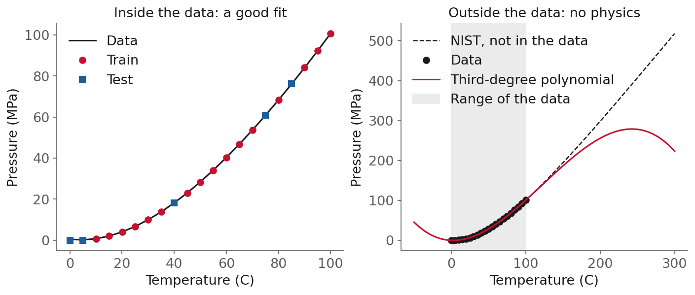

<span class="source">Data: <a href="https://webbook.nist.gov/chemistry/fluid/">NIST Chemistry WebBook</a></span>

<!--
"Merely a polynomial model, so you should not use it for extrapolation." Fitted with a library
that implies ML, but no physics in it. At -50 C: 45.6 MPa. At 300 C: 223 against 517.7. Within
the data range, a reasonable estimation.
-->

---

## Regularization, why

Many candidate features, few rows: the curve **chases the noise**. Add a penalty to the loss:

$$ \min_{a} \;\; \sum_{i} \big(y_i - \hat{y}_i\big)^2 \; + \; \alpha \sum_{j} a_j^2 $$

<div class="definition">

**Regularization**: a penalty on the coefficients, added to the loss; its weight **α** sets how much they cost.

</div>

- **Ridge**, $\alpha \sum a_j^2$: shrinks weak coefficients, rarely to zero
- **Lasso**, $\alpha \sum \lvert a_j \rvert$: sets weak coefficients to **exactly zero**
- A **penalty method**: the penalty replaces the constraint $\sum a_j^2 \le c$ (ESL 3.4.1)

<!--
Large alpha: a simpler model, and a risk of underfitting. Small alpha: plain least squares.
-->

---

## Regularization, live

15 noisy points of $y = x^{1/3}$, fitted with a 12th-degree polynomial: 12 candidate features.

<div class="reg-widget">
<div class="reg-controls">
<label><input type="radio" name="regk" value="ridge" checked> Ridge</label>
<label><input type="radio" name="regk" value="lasso"> Lasso</label>
<span>log<sub>10</sub> α</span>
<input type="range" id="reg-alpha" min="-12" max="2" step="0.1" value="-12">
<span id="reg-value">α = 1e-12</span>
</div>
<svg id="reg-svg" viewBox="0 0 1120 330" width="1120" height="330"></svg>
<div class="reg-readout" id="reg-readout"></div>
</div>

<script>
(() => {
  const svg = document.getElementById("reg-svg");
  if (!svg || svg.dataset.ready) return;
  svg.dataset.ready = "1";
  let seed = 7;
  const rand = () => { seed = (seed * 1664525 + 1013904223) % 4294967296; return seed / 4294967296; };
  const gauss = () => Math.sqrt(-2 * Math.log(Math.max(rand(), 1e-12))) * Math.cos(2 * Math.PI * rand());
  const N = 15, NT = 80, DEG = 12, SIG = 0.05;
  const xs = Array.from({length: N}, rand).sort((a, b) => a - b);
  const ys = xs.map(x => Math.cbrt(x) + SIG * gauss());
  const xt = Array.from({length: NT}, rand);
  const yt = xt.map(x => Math.cbrt(x) + SIG * gauss());
  const J = [...Array(DEG).keys()];
  const feats = x => J.map(j => Math.pow(x, j + 1));
  const F = xs.map(feats);
  const mu = J.map(j => F.reduce((a, r) => a + r[j], 0) / N);
  const sd = J.map(j => Math.sqrt(F.reduce((a, r) => a + (r[j] - mu[j]) ** 2, 0) / N));
  const Z = F.map(r => r.map((v, j) => (v - mu[j]) / sd[j]));
  const ym = ys.reduce((a, b) => a + b, 0) / N;
  const yc = ys.map(y => y - ym);
  const solve = (A, b) => {
    const n = b.length; A = A.map(r => r.slice()); b = b.slice();
    for (let c = 0; c < n; c++) {
      let p = c;
      for (let r = c + 1; r < n; r++) if (Math.abs(A[r][c]) > Math.abs(A[p][c])) p = r;
      [A[c], A[p]] = [A[p], A[c]]; [b[c], b[p]] = [b[p], b[c]];
      for (let r = c + 1; r < n; r++) {
        const f = A[r][c] / A[c][c];
        for (let k = c; k < n; k++) A[r][k] -= f * A[c][k];
        b[r] -= f * b[c];
      }
    }
    const w = Array(n).fill(0);
    for (let r = n - 1; r >= 0; r--) {
      let v = b[r];
      for (let k = r + 1; k < n; k++) v -= A[r][k] * w[k];
      w[r] = v / A[r][r];
    }
    return w;
  };
  const ZtZ = J.map(i => J.map(j => Z.reduce((a, r) => a + r[i] * r[j], 0)));
  const Zty = J.map(i => Z.reduce((a, r, k) => a + r[i] * yc[k], 0));
  const ridge = alpha => solve(ZtZ.map((r, i) => r.map((v, j) => v + (i === j ? alpha : 0))), Zty);
  const lasso = (alpha, w0) => {
    const w = w0 ? w0.slice() : Array(DEG).fill(0);
    const res = yc.map((y, k) => y - Z[k].reduce((a, v, j) => a + v * w[j], 0));
    for (let it = 0; it < 4000; it++) {
      let dmax = 0;
      for (const j of J) {
        let rho = 0;
        for (let k = 0; k < N; k++) rho += Z[k][j] * (res[k] + Z[k][j] * w[j]);
        const nw = Math.sign(rho) * Math.max(Math.abs(rho) - alpha / 2, 0) / ZtZ[j][j];
        if (nw !== w[j]) {
          for (let k = 0; k < N; k++) res[k] -= Z[k][j] * (nw - w[j]);
          dmax = Math.max(dmax, Math.abs(nw - w[j]));
          w[j] = nw;
        }
      }
      if (dmax < 1e-8) break;
    }
    return w;
  };
  const predict = (w, x) => ym + feats(x).reduce((a, v, j) => a + (v - mu[j]) / sd[j] * w[j], 0);
  const rmse = (w, X, Y) => Math.sqrt(X.reduce((a, x, k) => a + (Y[k] - predict(w, x)) ** 2, 0) / X.length);
  const grid = [];
  for (let g = -12; g <= 2.0001; g += 0.1) grid.push(Math.round(g * 10) / 10);
  const path = {ridge: {}, lasso: {}};
  let warm = null;
  for (const g of grid) path.ridge[g] = ridge(10 ** g);
  for (const g of [...grid].reverse()) { warm = lasso(10 ** g, warm); path.lasso[g] = warm.slice(); }
  const NS = "http://www.w3.org/2000/svg";
  const el = (tag, attrs, text) => {
    const e = document.createElementNS(NS, tag);
    for (const k in attrs) e.setAttribute(k, attrs[k]);
    if (text !== undefined) e.textContent = text;
    return e;
  };
  const L = {x0: 70, x1: 520, y0: 20, y1: 290}, Rp = {x0: 640, x1: 1100, y0: 20, y1: 290};
  const lx = x => L.x0 + x * (L.x1 - L.x0), ly = y => L.y1 - (y - 0.1) / 1.1 * (L.y1 - L.y0);
  const rx = g => Rp.x0 + (g + 12) / 14 * (Rp.x1 - Rp.x0), ry = e => Rp.y1 - Math.min(e, 0.3) / 0.3 * (Rp.y1 - Rp.y0);
  const axes = (P, xlab, ylab) => {
    svg.appendChild(el("rect", {x: P.x0, y: P.y0, width: P.x1 - P.x0, height: P.y1 - P.y0, fill: "none", stroke: "#bbb"}));
    svg.appendChild(el("text", {x: (P.x0 + P.x1) / 2, y: P.y1 + 32, "text-anchor": "middle", "font-size": 20, fill: "#1a1a1a"}, xlab));
    svg.appendChild(el("text", {x: P.x0 - 44, y: (P.y0 + P.y1) / 2, "text-anchor": "middle", "font-size": 20, fill: "#1a1a1a",
      transform: `rotate(-90 ${P.x0 - 44} ${(P.y0 + P.y1) / 2})`}, ylab));
  };
  axes(L, "x", "y");
  axes(Rp, "log\u2081\u2080 \u03b1", "RMSE");
  [[L, "0", "1"], [Rp, "10\u207b\u00b9\u00b2", "10\u00b2"]].forEach(([P, a, b]) => {
    svg.appendChild(el("text", {x: P.x0, y: P.y1 + 32, "text-anchor": "start", "font-size": 18, fill: "#5c5c5c"}, a));
    svg.appendChild(el("text", {x: P.x1, y: P.y1 + 32, "text-anchor": "end", "font-size": 18, fill: "#5c5c5c"}, b));
  });
  svg.appendChild(el("clipPath", {id: "reg-clip"})).appendChild(el("rect", {x: L.x0, y: L.y0, width: L.x1 - L.x0, height: L.y1 - L.y0}));
  xt.forEach((x, k) => svg.appendChild(el("circle", {cx: lx(x), cy: ly(yt[k]), r: 3, fill: "#c9c9c9"})));
  xs.forEach((x, k) => svg.appendChild(el("circle", {cx: lx(x), cy: ly(ys[k]), r: 5, fill: "#1a1a1a"})));
  const curve = svg.appendChild(el("polyline", {fill: "none", stroke: "#c41230", "stroke-width": 3, "clip-path": "url(#reg-clip)"}));
  const trainLine = svg.appendChild(el("polyline", {fill: "none", stroke: "#1a1a1a", "stroke-width": 2.5}));
  const testLine = svg.appendChild(el("polyline", {fill: "none", stroke: "#c41230", "stroke-width": 2.5}));
  const marker = svg.appendChild(el("line", {y1: Rp.y0, y2: Rp.y1, stroke: "#b07d12", "stroke-width": 2, "stroke-dasharray": "6 4"}));
  svg.appendChild(el("text", {x: Rp.x1 - 10, y: Rp.y0 + 24, "text-anchor": "end", "font-size": 18, fill: "#1a1a1a", stroke: "#fff", "stroke-width": 6, "paint-order": "stroke"}, "Training RMSE"));
  svg.appendChild(el("text", {x: Rp.x1 - 10, y: Rp.y0 + 48, "text-anchor": "end", "font-size": 18, fill: "#c41230", stroke: "#fff", "stroke-width": 6, "paint-order": "stroke"}, "Test RMSE (80 new points)"));
  svg.appendChild(el("text", {x: L.x0 + 10, y: L.y0 + 24, "font-size": 18, fill: "#5c5c5c", stroke: "#fff", "stroke-width": 6, "paint-order": "stroke"}, "Black: 15 training points, gray: test points"));
  const slider = document.getElementById("reg-alpha");
  const readout = document.getElementById("reg-readout");
  const value = document.getElementById("reg-value");
  slider.addEventListener("keydown", e => e.stopPropagation());
  const kind = () => document.querySelector("input[name=regk]:checked").value;
  const draw = () => {
    const k = kind(), g = Math.round(parseFloat(slider.value) * 10) / 10, w = path[k][g];
    const pts = [];
    for (let i = 0; i <= 200; i++) { const x = i / 200; pts.push(`${lx(x)},${ly(predict(w, x))}`); }
    curve.setAttribute("points", pts.join(" "));
    trainLine.setAttribute("points", grid.map(h => `${rx(h)},${ry(rmse(path[k][h], xs, ys))}`).join(" "));
    testLine.setAttribute("points", grid.map(h => `${rx(h)},${ry(rmse(path[k][h], xt, yt))}`).join(" "));
    marker.setAttribute("x1", rx(g)); marker.setAttribute("x2", rx(g));
    const nnz = w.filter(v => Math.abs(v) > 1e-10).length;
    value.textContent = `α = ${(10 ** g).toExponential(0)}`;
    readout.textContent = `Training RMSE ${rmse(w, xs, ys).toFixed(3)} · Test RMSE ${rmse(w, xt, yt).toFixed(3)} · Nonzero coefficients ${nnz} of ${DEG}`;
  };
  slider.addEventListener("input", draw);
  // a focused slider or radio keeps the presentation clicker's keys from the deck
  slider.addEventListener("change", () => slider.blur());
  document.querySelectorAll("input[name=regk]").forEach(r => r.addEventListener("change", () => { draw(); r.blur(); }));
  draw();
})();
</script>

<!--
Small alpha: the curve chases the noise near the edges, training RMSE low, test RMSE higher.
Large alpha: the curve flattens, both RMSEs rise. Lasso: the nonzero count falls as alpha grows.
The right panel is a validation curve.
-->

---

## Regression models, four families

<style scoped>table { font-size: 0.7em; }</style>

| Family | The idea | Good at | Bad at |
|---|---|---|---|
| Linear, with features | A weighted sum of chosen features | Little data, known physics | Shapes its features miss |
| Decision tree | Yes/no splits, a constant per region | Nonlinear, interacting effects; no scaling | Smooth functions, memorizing |
| Neural network | Layers of weights and activations | Any shape, large data | Small data, scaling, tuning |
| Gaussian process | A distribution over functions | Small data, an uncertainty | $\mathcal{O}(N^3)$, the kernel choice |

**No free lunch** (Wolpert 1996): averaged over every possible problem, every method has the same error on new inputs. Our reading: a family wins when its **assumptions match your problem**, so compare families on held-out data.

<span class="source"><a href="https://doi.org/10.1162/neco.1996.8.7.1341">Wolpert (1996)</a> / <a href="https://arxiv.org/abs/2007.10928">Wolpert (2020), free overview</a></span>

<!--
Linear regression first, because it is the one they know; this is why the other three exist.
"Every possible problem" means every input-output relationship, weighted equally, and "new
inputs" means points outside the training set (Wolpert's off-training-set error). Strictly, the
1996 theorem is proved for losses like zero-one, where a guess is right or wrong. For squared
error the companion paper finds an edge, but all of it comes from where a method's guesses sit in
the output range; on average, the way a method uses its data adds nothing.
The surprise in Wolpert's abstract: it holds even for cross-validation against
"anti-cross-validation" (pick the model with the largest validation error). So the second
sentence is our reading and goes beyond the theorem: trusting validation is itself an assumption,
that real problems have structure (smoothness, boxes, the right features) and that held-out
points resemble the ones you will predict.
-->

---

## Decision trees

<div class="definition">

A **decision tree** splits the data into regions with yes/no questions on the inputs, and predicts one constant in each region.

</div>

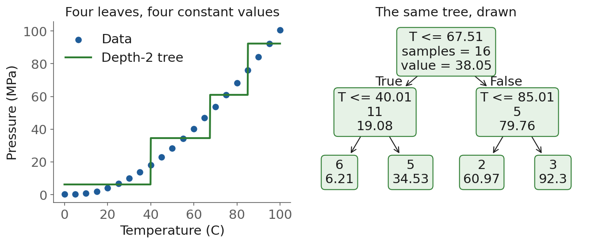

**How a tree is grown**: at each node, try every input and threshold, keep the split that lowers the squared error most, and repeat in each half. Each split is chosen once, never revisited: a **greedy** search.

<!--
"Something interesting is happening here." Each split is the boundary that gives the minimum
MSE. Depth 2 means four leaves, four values, a staircase. Test R2 0.911. Trees capture
nonlinearity but overfit if the depth is too large, so max_depth is crucial. Finding the optimal
tree is NP-complete (Hyafil and Rivest 1976), which is why it is grown greedily: no gradient, no
starting point. Laird group: linear model decision trees inside optimization (OMLT).
-->

---

## Neural networks

- In chemical engineering we often face **nonlinear models** (kinetics, transport, thermodynamics), where linear and polynomial regression are limited
- Neural networks emerged in the 1940s and 1950s, inspired by biological neurons, were revived in the 1980s, and became dominant in the 2010s
- Today we use them as <a href="https://en.wikipedia.org/wiki/Universal_approximation_theorem">universal function approximators</a>

Just as we expanded features with polynomials, a network **expands the feature space adaptively**, by learning nonlinear transformations.

<div class="trivia">

**Trivia**: the 2024 Nobel Prize in Physics went to Hopfield and Hinton for foundational work on artificial neural networks; Hinton was on the CMU faculty from 1982 to 1987 (<a href="https://www.cmu.edu/news/stories/archives/2024/october/former-cmu-faculty-geoffrey-hinton-awarded-2024-nobel-prize-in-physics">CMU News</a>).

</div>

---

## Neural networks, a flexible nonlinear regression

Noisy data from a true function, $y = x^{1/3} + \epsilon$, with $\epsilon \sim \mathcal{N}(0, \sigma^2)$:

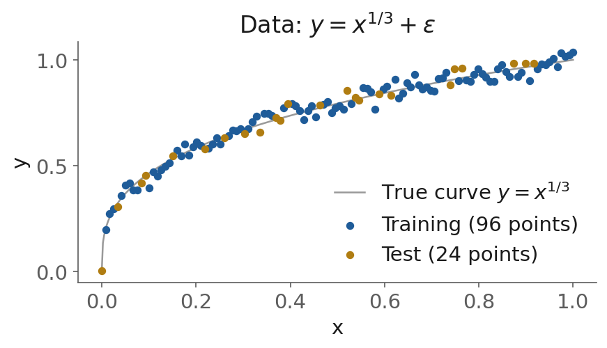

Try a function with **three nonlinear units**, and fit its 10 parameters by curve fitting (optimization) on 80% of the points:

$$ f(x) = b_1 + w_{10}\tanh(w_{00}x+b_{00}) + w_{11}\tanh(w_{01}x+b_{01}) + w_{12}\tanh(w_{02}x+b_{02}) $$

---

## Neural networks, the structure

<div class="definition">

A **neural network** is layers of: multiply by **weights**, add **biases**, apply a nonlinear **activation function**. Training adjusts the weights and biases.

</div>

<div class="nn-ann">

<svg class="nn-svg" viewBox="0 0 620 390" width="620" height="390">
<circle class="lit lit1" cx="290" cy="70" r="33" fill="none" stroke="#1f5c99" stroke-width="4" stroke-opacity="0.45"/>
<circle class="lit lit2" cx="290" cy="165" r="33" fill="none" stroke="#b07d12" stroke-width="4" stroke-opacity="0.45"/>
<circle class="lit lit3" cx="290" cy="260" r="33" fill="none" stroke="#2e7d32" stroke-width="4" stroke-opacity="0.45"/>
<rect class="lit lit4" x="500" y="199" width="60" height="28" rx="8" fill="#c41230" fill-opacity="0.16"/>
<circle class="lit lit5" cx="530" cy="165" r="33" fill="none" stroke="#c41230" stroke-width="4" stroke-opacity="0.45"/>
<line x1="90" y1="165" x2="260" y2="70" stroke="#9a9a9a" stroke-width="2"/>
<line x1="320" y1="70" x2="500" y2="165" stroke="#1f5c99" stroke-width="3.2"/>
<line x1="90" y1="165" x2="260" y2="165" stroke="#9a9a9a" stroke-width="2"/>
<line x1="320" y1="165" x2="500" y2="165" stroke="#b07d12" stroke-width="3.2"/>
<line x1="90" y1="165" x2="260" y2="260" stroke="#9a9a9a" stroke-width="2"/>
<line x1="320" y1="260" x2="500" y2="165" stroke="#2e7d32" stroke-width="3.2"/>
<text x="60" y="20" text-anchor="middle" font-size="18" font-weight="bold" fill="#1f5c99">Input</text>
<text x="290" y="20" text-anchor="middle" font-size="18" font-weight="bold" fill="#2e7d32">Hidden layer (tanh)</text>
<text x="530" y="20" text-anchor="middle" font-size="18" font-weight="bold" fill="#c41230">Output (linear)</text>
<circle cx="60" cy="165" r="30" fill="#dce8f5" stroke="#1f5c99" stroke-width="2.6"/>
<circle cx="530" cy="165" r="30" fill="#f7dde1" stroke="#c41230" stroke-width="2.6"/>
<circle cx="290" cy="70" r="30" fill="#dce8f5" stroke="#1f5c99" stroke-width="2.6"/>
<path d="M 273 80 C 286 80, 294 60, 307 60" fill="none" stroke="#1f5c99" stroke-width="2.6"/>
<circle cx="290" cy="165" r="30" fill="#f5ebd5" stroke="#b07d12" stroke-width="2.6"/>
<path d="M 273 175 C 286 175, 294 155, 307 155" fill="none" stroke="#b07d12" stroke-width="2.6"/>
<circle cx="290" cy="260" r="30" fill="#e6f2e6" stroke="#2e7d32" stroke-width="2.6"/>
<path d="M 273 270 C 286 270, 294 250, 307 250" fill="none" stroke="#2e7d32" stroke-width="2.6"/>
<g font-family="'Times New Roman', Times, serif" fill="#1a1a1a">
<text x="60" y="175" text-anchor="middle" font-size="30" font-style="italic">x</text>
<text x="530" y="175" text-anchor="middle" font-size="30" font-style="italic">y</text>
<text x="163" y="110" text-anchor="middle" font-size="24" fill="#1f5c99"><tspan font-style="italic">w</tspan><tspan font-size="14" dy="6">00</tspan></text>
<text x="392" y="99" text-anchor="middle" font-size="24" fill="#1f5c99"><tspan font-style="italic">w</tspan><tspan font-size="14" dy="6">10</tspan></text>
<text x="290" y="122" text-anchor="middle" font-size="21" fill="#1f5c99">+<tspan font-style="italic">b</tspan><tspan font-size="13" dy="6">00</tspan></text>
<text x="170" y="156" text-anchor="middle" font-size="24" fill="#b07d12"><tspan font-style="italic">w</tspan><tspan font-size="14" dy="6">01</tspan></text>
<text x="410" y="156" text-anchor="middle" font-size="24" fill="#b07d12"><tspan font-style="italic">w</tspan><tspan font-size="14" dy="6">11</tspan></text>
<text x="290" y="217" text-anchor="middle" font-size="21" fill="#b07d12">+<tspan font-style="italic">b</tspan><tspan font-size="13" dy="6">01</tspan></text>
<text x="185" y="206" text-anchor="middle" font-size="24" fill="#2e7d32"><tspan font-style="italic">w</tspan><tspan font-size="14" dy="6">02</tspan></text>
<text x="420" y="187" text-anchor="middle" font-size="24" fill="#2e7d32"><tspan font-style="italic">w</tspan><tspan font-size="14" dy="6">12</tspan></text>
<text x="290" y="312" text-anchor="middle" font-size="21" fill="#2e7d32">+<tspan font-style="italic">b</tspan><tspan font-size="13" dy="6">02</tspan></text>
<text x="530" y="219" text-anchor="middle" font-size="21" fill="#c41230">+<tspan font-style="italic">b</tspan><tspan font-size="13" dy="6">1</tspan></text>
</g>
</svg>

* $\phantom{+}\; w_{10}\tanh(w_{00}x + b_{00})$
* $+\; w_{11}\tanh(w_{01}x + b_{01})$
* $+\; w_{12}\tanh(w_{02}x + b_{02})$
* $+\; b_1$
* $=\; f(x)$

</div>

<!--
One hidden unit at a time lights up and its term appears beside it, at the same height, in its
color; then the output bias; then the sum. The previous slide's equation, one row per unit. The
input weight w0k and bias b0k sit inside the tanh, the output weight w1k outside it. The deep
version, several hidden layers, is on the hyperparameters slide.
-->

---

## Neural networks, how the terms add up

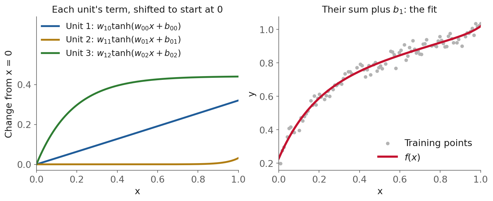

Each unit adds one tanh-shaped piece: unit 3 makes the steep early rise, unit 1 a steady slope, unit 2 a small kink at the end. The output adds them and $b_1$; the colors match the network diagram.

<!--
Each colored curve is one unit from the previous slide: w0k and b0k set where the curve bends
and how sharply, w1k sets how tall it is and its sign. The fitted terms are large and nearly
cancel (offsets near -37, -23 and +64), so each is drawn shifted to start at zero; the offsets and
b1 fold into one constant. The sum is the fit.
-->

---

## Neural networks, why "neural"

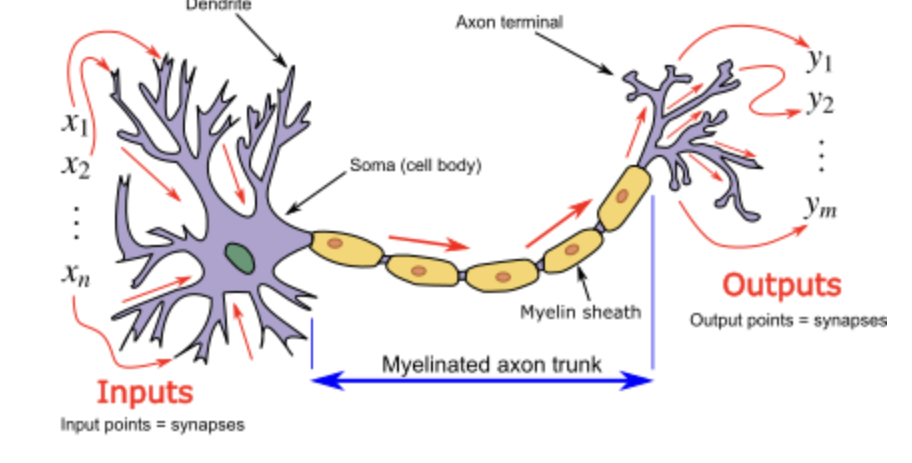

- Neurons combine input signals and "fire" if strong enough; an activation function is the model of that
- Far from real brains, but the language stuck

<span class="source"><a href="https://commons.wikimedia.org/wiki/File:Neuron3.png">Neuron3.png</a>, Egm4313.s12 (Prof. Loc Vu-Quoc), CC BY-SA 3.0</span>

---

## Neural networks, neurons firing

A **ReLU** unit, $\max(0, z)$, fires once its weighted input passes zero. Five of them, fitted to $y = x^{1/3}$ plus noise:

<style>
/* the ReLU network, neurons firing */
.relu-widget { font-size: 22px; }
.relu-controls { display: flex; gap: 0.9em; align-items: center; justify-content: center; margin: 0.1em 0 0.2em; }
.relu-controls input[type=range] { width: 460px; accent-color: #c41230; }
.relu-controls button { font: inherit; font-size: 20px; min-width: 5.4em; padding: 0.1em 0.6em; color: #c41230; background: #fff; border: 2px solid #c41230; border-radius: 6px; cursor: pointer; }
.relu-readout { text-align: center; color: #5c5c5c; margin-top: 0.1em; }
.relu-widget svg { display: block; margin: 0 auto; }
</style>
<div class="relu-widget">
<div class="relu-controls">
<button type="button" id="relu-play">Play</button>
<span><i>x</i> = 0</span>
<input type="range" id="relu-x" min="0" max="1" step="0.005" value="0.05">
<span>1</span>
</div>
<svg id="relu-svg" viewBox="0 0 1120 348" width="1120" height="348"></svg>
<div class="relu-readout" id="relu-readout"></div>
</div>

<script>
(() => {
  const svg = document.getElementById("relu-svg");
  if (!svg || svg.dataset.ready) return;
  svg.dataset.ready = "1";
  // MLPRegressor(hidden_layer_sizes=(5,), activation="relu", solver="lbfgs", random_state=970),
  // fitted to the 96 training rows of y = x^(1/3) + noise; printed by figures/make_figures.py widgets
  const W1 = [0.609271, -0.828327, 0.728873, 0.884397, -0.906241];
  const B1 = [-0.55295, 0.273953, 0.84125, -0.587186, 0.144694];
  const W2 = [0.832218, -0.690028, 0.654005, -0.197721, -0.753277];
  const B2 = 0.011019;
  const PTS = [[0.0084,0.1993],[0.0168,0.2754],[0.0252,0.2964],[0.042,0.3585],[0.0504,0.4086],[0.0588,0.4173],[0.0672,0.3855],[0.0756,0.3849],[0.1008,0.3957],[0.1092,0.4715],[0.1176,0.4526],[0.1261,0.4794],[0.1345,0.496],[0.1429,0.5133],[0.1597,0.5738],[0.1681,0.548],[0.1765,0.6019],[0.1849,0.5497],[0.1933,0.5887],[0.2017,0.6135],[0.2101,0.5973],[0.2269,0.5823],[0.2353,0.6036],[0.2437,0.6312],[0.2521,0.6014],[0.2689,0.6407],[0.2773,0.6683],[0.2857,0.6651],[0.2941,0.6757],[0.3109,0.6736],[0.3193,0.707],[0.3277,0.7343],[0.3445,0.7465],[0.3529,0.7471],[0.3613,0.7357],[0.3866,0.7722],[0.4034,0.7929],[0.4118,0.7834],[0.4202,0.7597],[0.4286,0.7177],[0.437,0.7587],[0.4454,0.7834],[0.4538,0.7298],[0.4706,0.7907],[0.479,0.8033],[0.4874,0.7515],[0.4958,0.7716],[0.5042,0.7828],[0.5126,0.7652],[0.5294,0.7941],[0.5546,0.8691],[0.563,0.8653],[0.5714,0.8488],[0.5798,0.7678],[0.5966,0.8624],[0.605,0.8759],[0.6218,0.9082],[0.6303,0.8178],[0.6387,0.8413],[0.6471,0.893],[0.6555,0.8701],[0.6639,0.9324],[0.6723,0.8817],[0.6807,0.8607],[0.6891,0.8719],[0.6975,0.8541],[0.7059,0.8521],[0.7143,0.9128],[0.7227,0.9148],[0.7311,0.9397],[0.7563,0.9025],[0.7731,0.9048],[0.7815,0.899],[0.7899,0.9319],[0.7983,0.9586],[0.8067,0.9357],[0.8151,0.9166],[0.8235,0.8971],[0.8319,0.8985],[0.8403,0.9587],[0.8487,0.9765],[0.8571,0.945],[0.8655,0.9208],[0.8824,0.9207],[0.8908,0.9408],[0.9076,0.9007],[0.9244,0.9567],[0.9328,0.9803],[0.9412,0.9777],[0.9496,0.989],[0.958,1.0066],[0.9664,0.9659],[0.9748,1.0342],[0.9832,1.0161],[0.9916,1.0225],[1.0,1.0349]];
  const U = [0, 1, 2, 3, 4];
  const pre = x => U.map(k => W1[k] * x + B1[k]);
  const f = x => pre(x).reduce((s, z, k) => s + W2[k] * Math.max(z, 0), B2);
  const amax = U.map(k => Math.max(B1[k], W1[k] + B1[k], 1e-9));
  const cmax = Math.max(...U.map(k => Math.abs(W2[k]) * amax[k]));
  const kink = U.map(k => -B1[k] / W1[k]);
  const inside = U.filter(k => kink[k] > 0 && kink[k] < 1);
  const NS = "http://www.w3.org/2000/svg";
  const el = (tag, attrs, text) => {
    const e = document.createElementNS(NS, tag);
    for (const k in attrs) e.setAttribute(k, attrs[k]);
    if (text !== undefined) e.textContent = text;
    return e;
  };
  const add = (tag, attrs, text) => svg.appendChild(el(tag, attrs, text));
  const IN = {x: 52, y: 190, r: 30}, OUT = {x: 452, y: 190, r: 34}, HX = 255, PW = 124, PH = 42;
  const HY = [58, 124, 190, 256, 322];
  add("text", {x: IN.x, y: 22, "text-anchor": "middle", "font-size": 18, fill: "#5c5c5c"}, "Input");
  add("text", {x: HX, y: 22, "text-anchor": "middle", "font-size": 18, fill: "#5c5c5c"}, "ReLU units");
  add("text", {x: OUT.x, y: 22, "text-anchor": "middle", "font-size": 18, fill: "#5c5c5c"}, "Output");
  const e1 = U.map(k => add("line", {x1: IN.x + IN.r, y1: IN.y, x2: HX - PW / 2, y2: HY[k], "stroke-width": 2.5, "stroke-linecap": "round"}));
  const e2 = U.map(k => add("line", {x1: HX + PW / 2, y1: HY[k], x2: OUT.x - OUT.r, y2: OUT.y, "stroke-linecap": "round"}));
  add("circle", {cx: IN.x, cy: IN.y, r: IN.r, fill: "#fff", stroke: "#1a1a1a", "stroke-width": 2.5});
  add("text", {x: IN.x, y: IN.y + 8, "text-anchor": "middle", "font-size": 24, "font-style": "italic", fill: "#1a1a1a"}, "x");
  const pill = [], num = [], val = [];
  U.forEach(k => {
    pill.push(add("rect", {x: HX - PW / 2, y: HY[k] - PH / 2, width: PW, height: PH, rx: PH / 2, "stroke-width": 2.5}));
    num.push(add("text", {x: HX - 38, y: HY[k] + 7, "text-anchor": "middle", "font-size": 20, "font-weight": 700}, String(k + 1)));
    val.push(add("text", {x: HX + 16, y: HY[k] + 7, "text-anchor": "middle", "font-size": 20}));
  });
  add("circle", {cx: OUT.x, cy: OUT.y, r: OUT.r, fill: "#fff", stroke: "#c41230", "stroke-width": 2.5});
  const outText = add("text", {x: OUT.x, y: OUT.y + 7, "text-anchor": "middle", "font-size": 20, fill: "#c41230"});
  const P = {x0: 620, x1: 1100, y0: 38, y1: 292};
  const px = x => P.x0 + x * (P.x1 - P.x0), py = y => P.y1 - (y - 0.1) / 1.0 * (P.y1 - P.y0);
  add("rect", {x: P.x0, y: P.y0, width: P.x1 - P.x0, height: P.y1 - P.y0, fill: "none", stroke: "#bbb"});
  [0, 0.5, 1].forEach(t => add("text", {x: px(t), y: P.y1 + 22, "text-anchor": "middle", "font-size": 18, fill: "#5c5c5c"}, String(t)));
  [0.2, 0.6, 1.0].forEach(t => add("text", {x: P.x0 - 10, y: py(t) + 6, "text-anchor": "end", "font-size": 18, fill: "#5c5c5c"}, t.toFixed(1)));
  add("text", {x: (P.x0 + P.x1) / 2, y: P.y1 + 48, "text-anchor": "middle", "font-size": 20, "font-style": "italic", fill: "#1a1a1a"}, "x");
  add("text", {x: P.x0 - 56, y: (P.y0 + P.y1) / 2, "text-anchor": "middle", "font-size": 20, fill: "#1a1a1a",
    transform: `rotate(-90 ${P.x0 - 56} ${(P.y0 + P.y1) / 2})`}, "Output f(x)");
  PTS.forEach(([x, y]) => add("circle", {cx: px(x), cy: py(y), r: 3.5, fill: "#c4c4c4"}));
  const klab = {};
  inside.forEach(k => {
    add("line", {x1: px(kink[k]), x2: px(kink[k]), y1: P.y0, y2: P.y1, stroke: "#9a9a9a", "stroke-width": 1.5, "stroke-dasharray": "5 4"});
    klab[k] = add("text", {x: px(kink[k]), y: P.y0 - 10, "text-anchor": "middle", "font-size": 18}, `Unit ${k + 1}`);
  });
  const pts = [];
  for (let i = 0; i <= 400; i++) { const x = i / 400; pts.push(`${px(x).toFixed(1)},${py(f(x)).toFixed(1)}`); }
  add("polyline", {points: pts.join(" "), fill: "none", stroke: "#c41230", "stroke-width": 3});
  const halo = {"text-anchor": "end", "font-size": 18, stroke: "#fff", "stroke-width": 6, "paint-order": "stroke", "stroke-linejoin": "round"};
  const notes = ["Gray: training points", "Red: the network's output"];
  U.filter(k => !inside.includes(k)).forEach(k =>
    notes.push(W1[k] * 0.5 + B1[k] > 0 ? `Unit ${k + 1} is on across the whole range` : `Unit ${k + 1} never switches on`));
  notes.forEach((t, i) => add("text", {...halo, x: P.x1 - 12, y: P.y1 - 16 - 24 * (notes.length - 1 - i), fill: i === 1 ? "#c41230" : "#5c5c5c"}, t));
  const dot = add("circle", {r: 8, fill: "#c41230", stroke: "#fff", "stroke-width": 2.5});
  const slider = document.getElementById("relu-x");
  const btn = document.getElementById("relu-play");
  const readout = document.getElementById("relu-readout");
  let xv = parseFloat(slider.value);
  const draw = () => {
    const x = xv, z = pre(x), y = f(x);
    U.forEach(k => {
      const on = z[k] > 0, a = Math.max(z[k], 0), op = 0.15 + 0.7 * a / amax[k];
      pill[k].setAttribute("fill", on ? "#2e7d32" : "#eeeeee");
      pill[k].setAttribute("fill-opacity", on ? op.toFixed(3) : "1");
      pill[k].setAttribute("stroke", on ? "#2e7d32" : "#bdbdbd");
      const ink = on ? (op > 0.55 ? "#fff" : "#1a1a1a") : "#8a8a8a";
      num[k].setAttribute("fill", ink);
      val[k].setAttribute("fill", ink);
      val[k].textContent = a.toFixed(3);
      e1[k].setAttribute("stroke", on ? "#1a1a1a" : "#d4d4d4");
      e2[k].setAttribute("stroke", on ? "#1a1a1a" : "#d4d4d4");
      e2[k].setAttribute("stroke-width", (1.5 + 9 * Math.abs(W2[k] * a) / cmax).toFixed(2));
      if (klab[k]) klab[k].setAttribute("fill", on ? "#2e7d32" : "#5c5c5c");
    });
    outText.textContent = y.toFixed(3);
    dot.setAttribute("cx", px(x));
    dot.setAttribute("cy", py(y));
    const onList = U.filter(k => z[k] > 0).map(k => k + 1);
    readout.textContent = `x = ${x.toFixed(3)}, units on: ${onList.length ? onList.join(", ") : "none"}, prediction ${y.toFixed(3)}`;
  };
  let playing = false, dir = 1, last = null, raf = 0;
  const tick = t => {
    if (!playing) return;
    // the presentation template changes slides without firing hashchange, so check visibility
    if (svg.checkVisibility && !svg.checkVisibility()) { setPlaying(false); return; }
    if (last !== null) {
      let v = xv + dir * 0.22 * Math.min(t - last, 100) / 1000;
      if (v >= 1) { v = 1; dir = -1; } else if (v <= 0) { v = 0; dir = 1; }
      xv = v;
      slider.value = v;
      draw();
    }
    last = t;
    raf = requestAnimationFrame(tick);
  };
  const setPlaying = p => {
    playing = p;
    btn.textContent = p ? "Pause" : "Play";
    cancelAnimationFrame(raf);
    if (p) { last = null; raf = requestAnimationFrame(tick); }
  };
  // blur after the click: a focused button keeps the arrow keys from the deck
  btn.addEventListener("click", () => { setPlaying(!playing); btn.blur(); });
  slider.addEventListener("keydown", e => e.stopPropagation());
  slider.addEventListener("input", () => { setPlaying(false); xv = parseFloat(slider.value); draw(); });
  slider.addEventListener("change", () => slider.blur());
  window.addEventListener("hashchange", () => setPlaying(false));
  draw();
})();
</script>

<!--
Play or the slider moves x. A unit lights up when it is on. Each kink is one unit switching on
or off, so a ReLU network is piecewise linear. Unit 3 is on over the whole range, so it only adds
a straight line.
-->

---

## Neural networks, hyperparameters

Choices made before training, not fitted by it: the **activation**, the number of **layers**, the **units** per layer

<style scoped>.cols { grid-template-columns: 1.75fr 1fr; } pre { font-size: 0.6em; }</style>

<div class="cols">
<div>

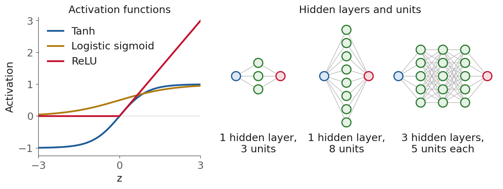

</div>
<div>

```python
MLPRegressor(
    hidden_layer_sizes=(3,),
    activation="tanh",
    solver="lbfgs",
    alpha=0.0,
    max_iter=5000,
    random_state=0,
)
```

</div>
</div>

---

## Neural networks, the same model twice

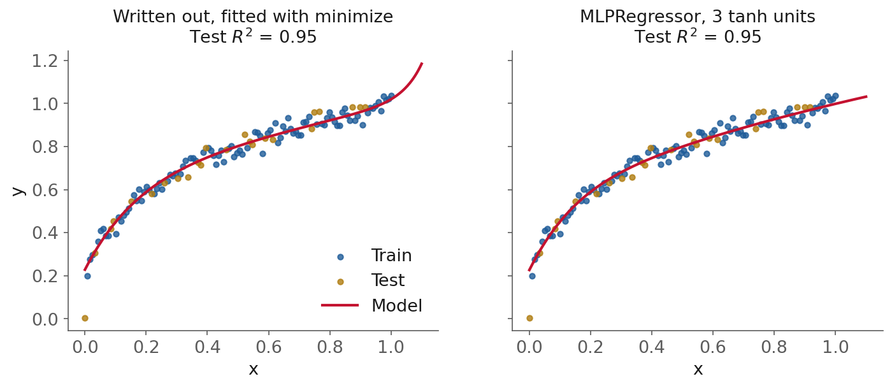

The parameters `minimize` found **are** the weights and biases of a one-hidden-layer network: `MLPRegressor` scores $R^2$ = **0.950** on the same test points. **Just math, not magic.**

---

## Neural networks, what training solves

$\min_{W,b} \sum_i \big(y_i - f(x_i;W,b)\big)^2$: non-convex, local minima, sensitive to the start

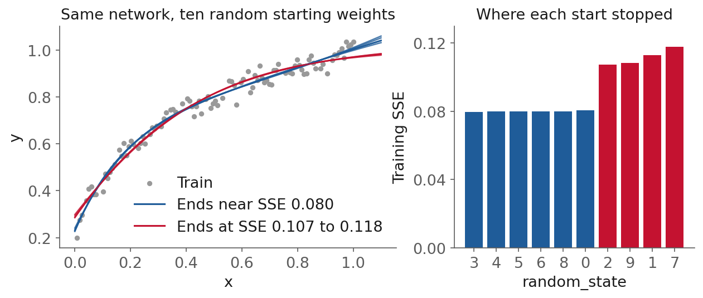

Ten starts: training sum of squared errors (SSE) **0.0796 to 0.1177**, test $R^2$ 0.920 to 0.950. Always set `random_state`.

<!--
Gradients by backpropagation. The worked example silences a ConvergenceWarning from the concrete
network: the optimizer hit its 5,000-iteration limit before declaring convergence.
-->

---

## Neural networks, scaling!

Two inputs that both matter, on very different scales: $x_1 \in [0,1]$ and $x_2 \in [0, 10^6]$

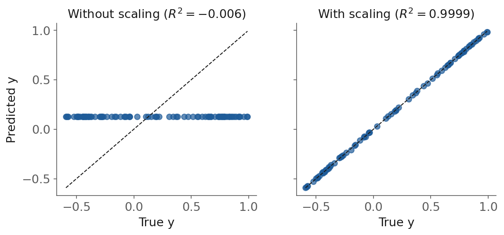

**Scale your inputs.** The same network on the same data scores $R^2 = -0.006$ unscaled, worse than predicting the average, and $0.9999$ once each input has mean 0 and standard deviation 1.

<!--
With x2 in the millions, all 20 tanh units saturate at plus or minus 1 on every training row,
the gradients vanish and the network predicts the training mean (0.128) everywhere.
Standardizing fixes it: zero mean, unit variance, fit on training rows only.
-->

---

## Gaussian processes

<style>
/* the Gaussian process build: a distribution of numbers, then of functions, one click at a time */
.gpi-widget svg { display: block; margin: 0 auto; }
.gpi-step { display: none; }
/* the definition fades in over half a second, as the F25 PowerPoint's layers did */
div.definition.gpi-def[data-bespoke-marp-fragment="active"] { animation: gpi-fade 0.5s ease-out; }
@keyframes gpi-fade { from { opacity: 0; } }
</style>
<div class="gpi-widget">
<svg id="gpi-svg" viewBox="0 0 1120 270" width="1120" height="270" role="img" aria-label="Left, a bell-shaped Gaussian density with fifteen values drawn from it, marked as ticks. Right, five smooth functions drawn from a Gaussian process over x from 0 to 1, with a dashed mean at zero and a gray band of two standard deviations."></svg>
<span class="gpi-step" data-marpit-fragment="1"></span>
<span class="gpi-step" data-marpit-fragment="2"></span>
<span class="gpi-step" data-marpit-fragment="3"></span>
</div>

<script>
(() => {
  const svg = document.getElementById("gpi-svg");
  if (!svg || svg.dataset.ready) return;
  svg.dataset.ready = "1";
  // gp-idea.png's draws (figures/make_figures.py, gp_intro_figures, seed 0): 15 values from N(0, 1),
  // then five functions from a GP prior with mean 0 and an RBF kernel of length scale 0.3, on the 200
  // values of np.linspace(0, 1, 200). Printed by figures/make_figures.py widgets; the functions are
  // rounded to 0.01, at most an eighth of a pixel here.
  const DRAWS = [0.12573, -0.132105, 0.640423, 0.1049, -0.535669, 0.361595, 1.304, 0.947081, -0.703735, -1.265421, -0.623274, 0.041326, -2.325031, -0.218792, -1.245911];
  const FS = [
    [-0.74, -0.71, -0.67, -0.64, -0.61, -0.57, -0.54, -0.5, -0.47, -0.43, -0.39, -0.36, -0.32, -0.28, -0.25, -0.21, -0.18, -0.14, -0.1, -0.07, -0.03, 0.0, 0.04, 0.07, 0.11, 0.14, 0.17, 0.21, 0.24, 0.27, 0.3, 0.34, 0.37, 0.4, 0.43, 0.45, 0.48, 0.51, 0.54, 0.56, 0.59, 0.61, 0.63, 0.66, 0.68, 0.7, 0.72, 0.74, 0.75, 0.77, 0.79, 0.8, 0.82, 0.83, 0.84, 0.86, 0.87, 0.88, 0.88, 0.89, 0.9, 0.9, 0.91, 0.91, 0.92, 0.92, 0.92, 0.92, 0.92, 0.92, 0.91, 0.91, 0.91, 0.9, 0.9, 0.89, 0.88, 0.87, 0.86, 0.85, 0.84, 0.83, 0.82, 0.8, 0.79, 0.77, 0.76, 0.74, 0.72, 0.7, 0.69, 0.67, 0.65, 0.63, 0.61, 0.58, 0.56, 0.54, 0.52, 0.49, 0.47, 0.45, 0.42, 0.4, 0.37, 0.35, 0.32, 0.29, 0.27, 0.24, 0.22, 0.19, 0.16, 0.14, 0.11, 0.08, 0.06, 0.03, 0.0, -0.02, -0.05, -0.07, -0.1, -0.12, -0.15, -0.17, -0.2, -0.22, -0.25, -0.27, -0.29, -0.31, -0.33, -0.35, -0.37, -0.39, -0.41, -0.43, -0.45, -0.46, -0.48, -0.49, -0.51, -0.52, -0.53, -0.54, -0.55, -0.56, -0.57, -0.58, -0.58, -0.59, -0.59, -0.6, -0.6, -0.6, -0.6, -0.6, -0.6, -0.6, -0.59, -0.59, -0.58, -0.57, -0.57, -0.56, -0.55, -0.54, -0.53, -0.51, -0.5, -0.49, -0.47, -0.46, -0.44, -0.42, -0.4, -0.38, -0.37, -0.35, -0.32, -0.3, -0.28, -0.26, -0.24, -0.21, -0.19, -0.17, -0.14, -0.12, -0.1, -0.07, -0.05, -0.02, 0.0, 0.03, 0.05, 0.08, 0.1, 0.13],
    [-2.05, -2.05, -2.04, -2.03, -2.02, -2.01, -2.01, -2.0, -1.99, -1.98, -1.97, -1.95, -1.94, -1.93, -1.92, -1.9, -1.89, -1.87, -1.86, -1.84, -1.83, -1.81, -1.79, -1.77, -1.75, -1.73, -1.71, -1.69, -1.67, -1.65, -1.62, -1.6, -1.57, -1.55, -1.52, -1.5, -1.47, -1.44, -1.41, -1.39, -1.36, -1.33, -1.3, -1.26, -1.23, -1.2, -1.17, -1.14, -1.1, -1.07, -1.03, -1.0, -0.96, -0.93, -0.89, -0.86, -0.82, -0.78, -0.75, -0.71, -0.67, -0.63, -0.6, -0.56, -0.52, -0.48, -0.44, -0.4, -0.36, -0.33, -0.29, -0.25, -0.21, -0.17, -0.13, -0.09, -0.05, -0.01, 0.03, 0.06, 0.1, 0.14, 0.18, 0.22, 0.26, 0.3, 0.33, 0.37, 0.41, 0.45, 0.48, 0.52, 0.56, 0.6, 0.63, 0.67, 0.7, 0.74, 0.78, 0.81, 0.85, 0.88, 0.92, 0.95, 0.98, 1.02, 1.05, 1.09, 1.12, 1.15, 1.18, 1.22, 1.25, 1.28, 1.31, 1.34, 1.37, 1.4, 1.43, 1.46, 1.49, 1.52, 1.55, 1.58, 1.61, 1.63, 1.66, 1.69, 1.72, 1.74, 1.77, 1.79, 1.82, 1.84, 1.87, 1.89, 1.92, 1.94, 1.96, 1.99, 2.01, 2.03, 2.05, 2.07, 2.09, 2.11, 2.13, 2.15, 2.17, 2.19, 2.21, 2.22, 2.24, 2.26, 2.27, 2.29, 2.3, 2.32, 2.33, 2.34, 2.36, 2.37, 2.38, 2.39, 2.4, 2.41, 2.42, 2.43, 2.44, 2.45, 2.45, 2.46, 2.46, 2.47, 2.48, 2.48, 2.48, 2.49, 2.49, 2.49, 2.49, 2.49, 2.49, 2.49, 2.49, 2.49, 2.49, 2.49, 2.48, 2.48, 2.47, 2.47, 2.46, 2.46, 2.45, 2.44, 2.44, 2.43, 2.42, 2.41],
    [-0.36, -0.36, -0.36, -0.36, -0.36, -0.36, -0.37, -0.37, -0.37, -0.37, -0.37, -0.37, -0.37, -0.37, -0.37, -0.37, -0.37, -0.37, -0.37, -0.37, -0.37, -0.37, -0.37, -0.37, -0.37, -0.36, -0.36, -0.36, -0.36, -0.36, -0.35, -0.35, -0.35, -0.35, -0.34, -0.34, -0.33, -0.33, -0.32, -0.32, -0.31, -0.31, -0.3, -0.29, -0.29, -0.28, -0.27, -0.26, -0.25, -0.25, -0.24, -0.23, -0.22, -0.21, -0.2, -0.19, -0.18, -0.17, -0.15, -0.14, -0.13, -0.12, -0.11, -0.09, -0.08, -0.07, -0.06, -0.04, -0.03, -0.02, -0.01, 0.01, 0.02, 0.03, 0.05, 0.06, 0.07, 0.09, 0.1, 0.11, 0.12, 0.14, 0.15, 0.16, 0.17, 0.19, 0.2, 0.21, 0.22, 0.23, 0.24, 0.26, 0.27, 0.28, 0.29, 0.3, 0.31, 0.32, 0.33, 0.34, 0.35, 0.35, 0.36, 0.37, 0.38, 0.39, 0.39, 0.4, 0.41, 0.42, 0.42, 0.43, 0.44, 0.44, 0.45, 0.45, 0.46, 0.46, 0.47, 0.47, 0.48, 0.48, 0.49, 0.49, 0.5, 0.5, 0.5, 0.51, 0.51, 0.52, 0.52, 0.52, 0.53, 0.53, 0.53, 0.53, 0.54, 0.54, 0.54, 0.55, 0.55, 0.55, 0.55, 0.56, 0.56, 0.56, 0.56, 0.57, 0.57, 0.57, 0.57, 0.57, 0.57, 0.58, 0.58, 0.58, 0.58, 0.58, 0.58, 0.58, 0.58, 0.58, 0.58, 0.58, 0.58, 0.58, 0.58, 0.58, 0.58, 0.58, 0.58, 0.58, 0.58, 0.57, 0.57, 0.57, 0.56, 0.56, 0.56, 0.55, 0.55, 0.55, 0.54, 0.54, 0.53, 0.53, 0.52, 0.51, 0.51, 0.5, 0.49, 0.49, 0.48, 0.47, 0.46, 0.46, 0.45, 0.44, 0.43, 0.42],
    [0.27, 0.26, 0.24, 0.23, 0.22, 0.2, 0.19, 0.17, 0.15, 0.14, 0.12, 0.1, 0.08, 0.07, 0.05, 0.03, 0.01, -0.01, -0.03, -0.05, -0.07, -0.1, -0.12, -0.14, -0.16, -0.18, -0.21, -0.23, -0.25, -0.27, -0.3, -0.32, -0.34, -0.37, -0.39, -0.41, -0.44, -0.46, -0.48, -0.51, -0.53, -0.55, -0.57, -0.6, -0.62, -0.64, -0.66, -0.68, -0.7, -0.72, -0.74, -0.76, -0.78, -0.8, -0.82, -0.84, -0.85, -0.87, -0.89, -0.9, -0.92, -0.93, -0.95, -0.96, -0.98, -0.99, -1.0, -1.01, -1.02, -1.03, -1.04, -1.05, -1.06, -1.07, -1.08, -1.08, -1.09, -1.09, -1.1, -1.1, -1.11, -1.11, -1.11, -1.11, -1.11, -1.11, -1.11, -1.11, -1.11, -1.11, -1.11, -1.1, -1.1, -1.09, -1.09, -1.08, -1.08, -1.07, -1.06, -1.05, -1.04, -1.03, -1.02, -1.01, -1.0, -0.99, -0.98, -0.97, -0.95, -0.94, -0.92, -0.91, -0.89, -0.88, -0.86, -0.85, -0.83, -0.81, -0.79, -0.77, -0.76, -0.74, -0.72, -0.7, -0.67, -0.65, -0.63, -0.61, -0.59, -0.56, -0.54, -0.52, -0.49, -0.47, -0.44, -0.42, -0.39, -0.37, -0.34, -0.32, -0.29, -0.26, -0.24, -0.21, -0.18, -0.15, -0.12, -0.1, -0.07, -0.04, -0.01, 0.02, 0.05, 0.08, 0.11, 0.13, 0.16, 0.19, 0.22, 0.25, 0.28, 0.31, 0.34, 0.37, 0.4, 0.43, 0.46, 0.49, 0.51, 0.54, 0.57, 0.6, 0.63, 0.65, 0.68, 0.71, 0.74, 0.76, 0.79, 0.81, 0.84, 0.86, 0.89, 0.91, 0.94, 0.96, 0.98, 1.0, 1.02, 1.04, 1.06, 1.08, 1.1, 1.12, 1.14, 1.16, 1.17, 1.19, 1.2, 1.22],
    [0.04, 0.05, 0.06, 0.06, 0.07, 0.08, 0.08, 0.09, 0.1, 0.1, 0.11, 0.12, 0.12, 0.13, 0.14, 0.15, 0.15, 0.16, 0.17, 0.17, 0.18, 0.19, 0.19, 0.2, 0.21, 0.22, 0.22, 0.23, 0.24, 0.25, 0.25, 0.26, 0.27, 0.28, 0.29, 0.29, 0.3, 0.31, 0.32, 0.33, 0.34, 0.35, 0.36, 0.37, 0.38, 0.39, 0.4, 0.41, 0.42, 0.43, 0.44, 0.45, 0.46, 0.47, 0.48, 0.49, 0.5, 0.51, 0.52, 0.53, 0.54, 0.56, 0.57, 0.58, 0.59, 0.6, 0.61, 0.62, 0.64, 0.65, 0.66, 0.67, 0.68, 0.7, 0.71, 0.72, 0.73, 0.74, 0.75, 0.77, 0.78, 0.79, 0.8, 0.81, 0.82, 0.84, 0.85, 0.86, 0.87, 0.88, 0.89, 0.9, 0.91, 0.92, 0.93, 0.94, 0.95, 0.97, 0.98, 0.98, 0.99, 1.0, 1.01, 1.02, 1.03, 1.04, 1.05, 1.06, 1.07, 1.08, 1.08, 1.09, 1.1, 1.11, 1.11, 1.12, 1.13, 1.13, 1.14, 1.15, 1.15, 1.16, 1.16, 1.17, 1.17, 1.18, 1.18, 1.19, 1.19, 1.2, 1.2, 1.2, 1.21, 1.21, 1.21, 1.22, 1.22, 1.22, 1.22, 1.22, 1.22, 1.22, 1.23, 1.23, 1.23, 1.23, 1.23, 1.23, 1.22, 1.22, 1.22, 1.22, 1.22, 1.22, 1.21, 1.21, 1.21, 1.2, 1.2, 1.2, 1.19, 1.19, 1.18, 1.18, 1.17, 1.17, 1.16, 1.16, 1.15, 1.15, 1.14, 1.13, 1.13, 1.12, 1.11, 1.1, 1.09, 1.09, 1.08, 1.07, 1.06, 1.05, 1.04, 1.03, 1.02, 1.01, 1.0, 0.99, 0.98, 0.97, 0.95, 0.94, 0.93, 0.92, 0.9, 0.89, 0.88, 0.86, 0.85, 0.84]
  ];
  const XS = FS[0].map((_, i) => i / (FS[0].length - 1));
  const COLORS = ["#1f5c99", "#b07d12", "#2e7d32", "#c41230", "#5c5c5c"];
  const NS = "http://www.w3.org/2000/svg";
  const el = (tag, attrs, text) => {
    const e = document.createElementNS(NS, tag);
    for (const k in attrs) e.setAttribute(k, attrs[k]);
    if (text !== undefined) e.textContent = text;
    return e;
  };
  const put = (parent, tag, attrs, text) => parent.appendChild(el(tag, attrs, text));
  const add = (tag, attrs, text) => put(svg, tag, attrs, text);
  const LP = {x0: 86, x1: 404, y0: 40, y1: 214, xa: -3.5, xb: 3.5, ya: 0, yb: 0.55};
  const RP = {x0: 594, x1: 1100, y0: 40, y1: 214, xa: 0, xb: 1, ya: -3, yb: 4.4};
  const sx = (P, v) => P.x0 + (v - P.xa) / (P.xb - P.xa) * (P.x1 - P.x0);
  const sy = (P, v) => P.y1 - (v - P.ya) / (P.yb - P.ya) * (P.y1 - P.y0);
  const pts = (P, xy) => xy.map(([x, y]) => `${sx(P, x).toFixed(1)},${sy(P, y).toFixed(1)}`).join(" ");
  const frame = (g, P, title, xlab, ylab, xt, yt, italic) => {
    put(g, "rect", {x: P.x0, y: P.y0, width: P.x1 - P.x0, height: P.y1 - P.y0, fill: "none", stroke: "#bbb"});
    put(g, "text", {x: (P.x0 + P.x1) / 2, y: P.y0 - 14, "text-anchor": "middle", "font-size": 21, "font-weight": 600, fill: "#1a1a1a"}, title);
    xt.forEach(v => put(g, "text", {x: sx(P, v), y: P.y1 + 22, "text-anchor": "middle", "font-size": 18, fill: "#5c5c5c"}, String(v)));
    yt.forEach(v => put(g, "text", {x: P.x0 - 10, y: sy(P, v) + 6, "text-anchor": "end", "font-size": 18, fill: "#5c5c5c"}, String(v)));
    put(g, "text", {x: (P.x0 + P.x1) / 2, y: P.y1 + 48, "text-anchor": "middle", "font-size": 20, fill: "#1a1a1a",
      "font-style": italic ? "italic" : "normal"}, xlab);
    put(g, "text", {x: P.x0 - 56, y: (P.y0 + P.y1) / 2, "text-anchor": "middle", "font-size": 20, fill: "#1a1a1a",
      transform: `rotate(-90 ${P.x0 - 56} ${(P.y0 + P.y1) / 2})`}, ylab);
  };
  const pdf = z => Math.exp(-z * z / 2) / Math.sqrt(2 * Math.PI);
  const bell = (a, b) => Array.from({length: 301}, (_, i) => a + i * (b - a) / 300).map(z => [z, pdf(z)]);
  // on arrival: the distribution of numbers, N(0, 1)
  frame(svg, LP, "A distribution of numbers", "Value", "Probability density", [-2, 0, 2], [0, 0.2, 0.4], false);
  add("polygon", {points: pts(LP, [[-3.5, 0], ...bell(-3.5, 3.5), [3.5, 0]]), fill: "#1f5c99", "fill-opacity": 0.12});
  // click 2 grays the part of the bell within 2 std of the mean: the band on the right, at one x
  const shade = add("polygon", {points: pts(LP, [[-2, 0], ...bell(-2, 2), [2, 0]]), fill: "#e3e3e3"});
  const lmean = add("line", {x1: sx(LP, 0), x2: sx(LP, 0), y1: sy(LP, 0), y2: sy(LP, pdf(0)),
    stroke: "#1a1a1a", "stroke-width": 2, "stroke-dasharray": "7 5"});
  add("polyline", {points: pts(LP, bell(-3.5, 3.5)), fill: "none", stroke: "#1f5c99", "stroke-width": 3});
  // click 1: the 15 values, one at a time, each tick falling onto the axis; the newest is red
  const ticks = DRAWS.map(v => add("line", {x1: sx(LP, v), x2: sx(LP, v), y1: LP.y1, y2: LP.y1 - 26,
    stroke: "#1a1a1a", "stroke-width": 2.5}));
  const LEG = LP.y0 + 24;
  const lkey = add("line", {x1: LP.x0 + 18, x2: LP.x0 + 18, y1: LEG - 16, y2: LEG + 4, stroke: "#1a1a1a", "stroke-width": 2.5});
  const lcount = add("text", {x: LP.x0 + 32, y: LEG, "font-size": 18, fill: "#1a1a1a"});
  // click 2: the same idea one level up, a distribution of functions
  const arrow = add("polygon", {points: "420,116 468,116 468,101 502,127 468,153 468,138 420,138",
    fill: "#d9d9d9", stroke: "#8c8c8c", "stroke-width": 1.5, "stroke-linejoin": "round"});
  const right = add("g", {});
  const band = put(right, "rect", {x: RP.x0, width: RP.x1 - RP.x0, fill: "#ebebeb"});
  frame(right, RP, "A distribution of functions", "x", "f(x)", [0, 0.2, 0.4, 0.6, 0.8, 1], [-2, 0, 2], true);
  const rmean = put(right, "line", {x1: RP.x0, x2: RP.x1, y1: sy(RP, 0), y2: sy(RP, 0),
    stroke: "#1a1a1a", "stroke-width": 2, "stroke-dasharray": "7 5"});
  const K = {x: RP.x0 + 14, y: RP.y0 + 24};
  const rkey = put(right, "g", {});
  put(rkey, "line", {x1: K.x, x2: K.x + 34, y1: K.y - 6, y2: K.y - 6, stroke: "#1a1a1a", "stroke-width": 2, "stroke-dasharray": "7 5"});
  put(rkey, "text", {x: K.x + 42, y: K.y, "font-size": 18, fill: "#1a1a1a"}, "Mean");
  put(rkey, "rect", {x: K.x + 106, y: K.y - 17, width: 34, height: 22, fill: "#ebebeb", stroke: "#cfcfcf"});
  put(rkey, "text", {x: K.x + 148, y: K.y, "font-size": 18, fill: "#1a1a1a"}, "Mean ± 2 std");
  // click 3: five functions, each traced left to right, one after another
  const CP = FS.map(f => XS.map((x, i) => `${sx(RP, x).toFixed(1)},${sy(RP, f[i]).toFixed(1)}`));
  const curves = FS.map((_, k) => put(right, "polyline", {fill: "none", stroke: COLORS[k], "stroke-width": 2.5,
    "stroke-linejoin": "round", "stroke-linecap": "round"}));
  const pens = FS.map((_, k) => put(right, "circle", {r: 5.5, fill: COLORS[k]}));
  const skeys = FS.map((_, k) => put(right, "line", {x1: K.x + 274 + 8 * k, x2: K.x + 280 + 8 * k, y1: K.y - 6, y2: K.y - 6,
    stroke: COLORS[k], "stroke-width": 4}));
  const scount = put(right, "text", {x: K.x + 320, y: K.y, "font-size": 18, fill: "#1a1a1a"});
  // timing, in ms: ticks land every GAP, falling for DROP; each function takes DRAW, the next STEP later
  const GAP = 170, DROP = 300, STEP = 620, DRAW = 700;
  const END = [0, (DRAWS.length - 1) * GAP + DROP + 250, 700, (FS.length - 1) * STEP + DRAW];
  const ramp = (t, a, b) => Math.max(0, Math.min(1, (t - a) / (b - a)));
  const show = (e, o) => { e.setAttribute("opacity", o.toFixed(3)); e.setAttribute("visibility", o > 0 ? "visible" : "hidden"); };
  const plural = (n, word) => `${n} sampled ${word}${n === 1 ? "" : "s"}`;
  // step s is playing at t ms; the steps before it are complete and the ones after it hidden
  const paint = (s, t) => {
    const at = k => (k < s ? Infinity : k === s ? t : -Infinity);
    const t1 = at(1), t2 = at(2), t3 = at(3);
    let n = 0;
    ticks.forEach((tk, i) => {
      const p = ramp(t1, i * GAP, i * GAP + DROP);
      const started = t1 >= i * GAP;
      if (started) n++;
      show(tk, started ? Math.min(1, 3 * p) : 0);
      tk.setAttribute("transform", `translate(0 ${(-48 * (1 - p * p)).toFixed(1)})`);
      const newest = started && Number.isFinite(t1) && (i === DRAWS.length - 1 || t1 < (i + 1) * GAP);
      tk.setAttribute("stroke", newest ? "#c41230" : "#1a1a1a");
    });
    show(lkey, n ? 1 : 0);
    show(lcount, n ? 1 : 0);
    lcount.textContent = plural(n, "value");
    show(arrow, ramp(t2, 0, 350));
    show(right, ramp(t2, 100, 450));
    show(shade, ramp(t2, 250, 600));
    show(lmean, ramp(t2, 250, 600));
    show(rmean, ramp(t2, 250, 500));
    show(rkey, ramp(t2, 250, 600));
    const g = ramp(t2, 250, 700), h = 2 * g * (2 - g);
    band.setAttribute("y", sy(RP, h).toFixed(1));
    band.setAttribute("height", (sy(RP, -h) - sy(RP, h)).toFixed(1));
    let c = 0;
    curves.forEach((cv, k) => {
      const p = ramp(t3, k * STEP, k * STEP + DRAW);
      const m = Math.max(2, Math.round(p * (XS.length - 1)) + 1);
      if (t3 >= k * STEP) c++;
      show(cv, t3 >= k * STEP ? 1 : 0);
      cv.setAttribute("points", CP[k].slice(0, m).join(" "));
      show(pens[k], p > 0 && p < 1 ? 1 : 0);
      const [px, py] = CP[k][m - 1].split(",");
      pens[k].setAttribute("cx", px);
      pens[k].setAttribute("cy", py);
      show(skeys[k], t3 >= k * STEP ? 1 : 0);
    });
    show(scount, c ? 1 : 0);
    scount.textContent = plural(c, "function");
  };
  // the steps follow the deck's fragments: each click plays the next one, going back undoes it,
  // and with no fragments (the static render, the PDF) or in the overview the build is complete
  const steps = [...svg.parentNode.querySelectorAll(".gpi-step")];
  const target = () => {
    if (document.body.dataset.bespokeView === "overview" || !steps[0].hasAttribute("data-bespoke-marp-fragment")) return steps.length;
    return steps.filter(e => e.getAttribute("data-bespoke-marp-fragment") === "active").length;
  };
  const still = window.matchMedia && matchMedia("(prefers-reduced-motion: reduce)").matches;
  let step = -1, t0 = 0, raf = 0;
  const finish = () => { cancelAnimationFrame(raf); paint(step, Infinity); };
  const run = now => {
    // stop once the slide is off screen: the presentation template changes slides with
    // history.replaceState, which fires no hashchange, and hides the old one from checkVisibility
    if (now - t0 >= END[step] || (svg.checkVisibility && !svg.checkVisibility())) { finish(); return; }
    paint(step, now - t0);
    raf = requestAnimationFrame(run);
  };
  const sync = () => {
    const s = target();
    if (s === step) return;
    const play = step >= 0 && s === step + 1 && !still;
    cancelAnimationFrame(raf);
    step = s;
    if (!play) { paint(step, Infinity); return; }
    t0 = performance.now();
    paint(step, 0);
    raf = requestAnimationFrame(run);
  };
  const watch = new MutationObserver(sync);
  steps.forEach(e => watch.observe(e, {attributes: true, attributeFilter: ["data-bespoke-marp-fragment"]}));
  watch.observe(document.body, {attributes: true, attributeFilter: ["data-bespoke-view"]});
  window.addEventListener("hashchange", finish);
  sync();
})();
</script>

<div class="definition gpi-def" data-marpit-fragment="4">

A **Gaussian process**: a probability distribution over functions, $f \sim \mathcal{GP}\big(m(x), k(x, x')\big)$, set by a **mean function** $m$ and a **kernel** $k$ (how similar two inputs are).

</div>

<span class="source"><a href="https://gaussianprocess.org/gpml/chapters/RW2.pdf">Rasmussen and Williams (2006)</a>, section 2.2</span>

<!--
The picture from my F25 GP slides, built in four steps. It starts on a distribution of numbers,
N(0, 1).
First, fifteen draws land one at a time, each one a number; the newest is red. One, at -2.33,
falls outside 2 std, where about 5% of draws should (4.55%).
Second, the same idea one level up: the arrow, then a distribution of functions, its mean (dashed)
and a band of 2 std. On the left the same range turns gray: at every x this GP's value is N(0, 1),
the bell on the left, so the band is that gray range repeated at every x.
Third, five draws, each a whole function, traced one after another. The gold one leaves the band
at both ends: the band covers about 95% of the values at each x, so a whole curve can still cross.
Fourth, the definition. How fast the curves wiggle is the kernel's length scale (0.3 here), two
slides on. Formally (Rasmussen and Williams, Definition 2.1): any finite set of the function's
values is jointly Gaussian. Parametric (a network): fix theta and fit f(x; theta). Nonparametric
(a GP): a distribution over functions, and every prediction comes with an uncertainty.
Going back a step undoes it; going forward again replays it.
-->

---

## Gaussian processes, from prior to posterior

$$ \text{posterior} = \frac{\text{likelihood} \times \text{prior}}{\text{marginal likelihood}} $$

<style>
/* the GP prior to posterior slider */
.gpp-widget { font-size: 22px; }
.gpp-controls { display: flex; gap: 0.9em; align-items: center; justify-content: center; margin: 0 0 0.1em; }
.gpp-controls input[type=range] { width: 460px; accent-color: #c41230; }
.gpp-controls button { font: inherit; font-size: 20px; min-width: 5.4em; padding: 0.1em 0.6em; color: #c41230; background: #fff; border: 2px solid #c41230; border-radius: 6px; cursor: pointer; }
.gpp-readout { text-align: center; color: #5c5c5c; margin-top: 0.1em; }
.gpp-widget svg { display: block; margin: 0 auto; }
</style>
<div class="gpp-widget">
<div class="gpp-controls">
<button type="button" id="gpp-play">Play</button>
<span>Prior</span>
<input type="range" id="gpp-n" min="0" max="20" step="1" value="0">
<span>20 points</span>
</div>
<svg id="gpp-svg" viewBox="0 0 1120 270" width="1120" height="270"></svg>
<div class="gpp-readout" id="gpp-readout"></div>
</div>

<script>
(() => {
  const svg = document.getElementById("gpp-svg");
  if (!svg || svg.dataset.ready) return;
  svg.dataset.ready = "1";
  // 20 noisy samples of f(u) = sin(u) + log(u) - exp(-0.1 u^2), in the order the slider adds them.
  // SF2, ELL and SN2 (signal variance, length scale, noise variance) were fitted once on all 20 and
  // are held fixed; the prior mean is 0. Printed by figures/make_figures.py widgets.
  const PTS = [[5.362305, 0.827682], [9.529405, 2.122272], [1.869516, 1.005766], [9.51217, 2.265846],
    [3.462399, 0.353964], [4.521601, 0.208663], [8.363175, 2.978582], [4.387392, 0.342977],
    [5.72114, 1.194727], [0.761812, -0.503707], [7.658375, 3.225677], [5.612361, 0.94928],
    [3.632451, 0.513487], [7.990073, 3.271543], [3.380351, 0.72719], [4.80823, 0.542153],
    [1.773396, 0.770884], [4.329573, 0.219616], [2.432825, 1.003403], [2.991977, 0.847365]];
  const SF2 = 4.252574, ELL = 2.141069, SN2 = 0.012645;
  const f = u => Math.sin(u) + Math.log(u) - Math.exp(-0.1 * u * u);
  const kern = (a, b) => SF2 * Math.exp(-((a - b) ** 2) / (2 * ELL * ELL));
  const chol = A => {
    const n = A.length, L = A.map(() => Array(n).fill(0));
    for (let i = 0; i < n; i++)
      for (let j = 0; j <= i; j++) {
        let s = A[i][j];
        for (let k = 0; k < j; k++) s -= L[i][k] * L[j][k];
        L[i][j] = i === j ? Math.sqrt(s) : s / L[j][j];
      }
    return L;
  };
  const lower = (L, b) => {
    const z = b.slice();
    for (let i = 0; i < z.length; i++) { for (let k = 0; k < i; k++) z[i] -= L[i][k] * z[k]; z[i] /= L[i][i]; }
    return z;
  };
  const upper = (L, z) => {
    const w = z.slice();
    for (let i = w.length - 1; i >= 0; i--) { for (let k = i + 1; k < w.length; k++) w[i] -= L[k][i] * w[k]; w[i] /= L[i][i]; }
    return w;
  };
  // the figure's grid, np.linspace(0.5, 10, 400); the readout's RMSE and average band are taken on it
  const UU = Array.from({length: 400}, (_, i) => 0.5 + i * 9.5 / 399);
  const TRUE = UU.map(f);
  const posterior = n => {
    if (n === 0) return {mu: UU.map(() => 0), sd: UU.map(() => Math.sqrt(SF2))};
    const X = PTS.slice(0, n).map(p => p[0]);
    const L = chol(X.map((a, i) => X.map((b, j) => kern(a, b) + (i === j ? SN2 : 0))));
    const alpha = upper(L, lower(L, PTS.slice(0, n).map(p => p[1])));
    const mu = [], sd = [];
    UU.forEach(x => {
      const k = X.map(a => kern(a, x));
      mu.push(k.reduce((s, v, j) => s + v * alpha[j], 0));
      const v = lower(L, k);
      sd.push(Math.sqrt(Math.max(SF2 - v.reduce((s, t) => s + t * t, 0), 0)));
    });
    return {mu, sd};
  };
  const S = Array.from({length: PTS.length + 1}, (_, n) => {
    const p = posterior(n);
    p.rmse = Math.sqrt(p.mu.reduce((s, m, i) => s + (m - TRUE[i]) ** 2, 0) / UU.length);
    p.half = 2 * p.sd.reduce((s, v) => s + v, 0) / UU.length;
    return p;
  });
  const NS = "http://www.w3.org/2000/svg";
  const el = (tag, attrs, text) => {
    const e = document.createElementNS(NS, tag);
    for (const k in attrs) e.setAttribute(k, attrs[k]);
    if (text !== undefined) e.textContent = text;
    return e;
  };
  const add = (tag, attrs, text) => svg.appendChild(el(tag, attrs, text));
  const P = {x0: 72, x1: 850, y0: 10, y1: 212, xa: 0.5, xb: 10, ya: -4.4, yb: 4.4};
  const sx = v => P.x0 + (v - P.xa) / (P.xb - P.xa) * (P.x1 - P.x0);
  const sy = v => P.y1 - (v - P.ya) / (P.yb - P.ya) * (P.y1 - P.y0);
  const line = pts => {
    // keep a polyline's box inside its plot: cut each segment where it leaves the frame
    const lo = P.y0 - 4, hi = P.y1 + 4, out = [];
    pts.forEach(([x, y], i) => {
      if (i > 0) {
        const [xp, yp] = pts[i - 1];
        [lo, hi].map(b => [(b - yp) / (y - yp), b]).filter(([t]) => t > 0 && t < 1).sort((a, b) => a[0] - b[0])
          .forEach(([t, b]) => out.push([xp + t * (x - xp), b]));
      }
      out.push([x, Math.max(lo, Math.min(hi, y))]);
    });
    return out.map(([x, y]) => `${x.toFixed(1)},${y.toFixed(1)}`).join(" ");
  };
  add("clipPath", {id: "gpp-clip"}).appendChild(el("rect", {x: P.x0, y: P.y0, width: P.x1 - P.x0, height: P.y1 - P.y0}));
  add("rect", {x: P.x0, y: P.y0, width: P.x1 - P.x0, height: P.y1 - P.y0, fill: "none", stroke: "#bbb"});
  [2, 4, 6, 8, 10].forEach(v => add("text", {x: sx(v), y: P.y1 + 22, "text-anchor": "middle", "font-size": 18, fill: "#5c5c5c"}, String(v)));
  [-4, -2, 0, 2, 4].forEach(v => add("text", {x: P.x0 - 10, y: sy(v) + 6, "text-anchor": "end", "font-size": 18, fill: "#5c5c5c"}, String(v)));
  add("text", {x: (P.x0 + P.x1) / 2, y: P.y1 + 48, "text-anchor": "middle", "font-size": 20, "font-style": "italic", fill: "#1a1a1a"}, "u");
  add("text", {x: P.x0 - 48, y: (P.y0 + P.y1) / 2, "text-anchor": "middle", "font-size": 20, fill: "#1a1a1a",
    transform: `rotate(-90 ${P.x0 - 48} ${(P.y0 + P.y1) / 2})`}, "f(u)");
  const clip = {"clip-path": "url(#gpp-clip)"};
  const band = add("polygon", {...clip, fill: "#c41230", "fill-opacity": 0.15, stroke: "none"});
  add("polyline", {...clip, points: line(UU.map((x, i) => [sx(x), sy(TRUE[i])])), fill: "none",
    stroke: "#8c8c8c", "stroke-width": 2.5, "stroke-dasharray": "8 6"});
  const mean = add("polyline", {...clip, fill: "none", stroke: "#c41230", "stroke-width": 3});
  const dots = PTS.map(([x, y]) => add("circle", {cx: sx(x), cy: sy(y), r: 6, fill: "#1a1a1a"}));
  const ring = add("circle", {r: 12, fill: "none", stroke: "#c41230", "stroke-width": 3});
  // the legend, beside the plot so it never covers the band
  const LX = 884, LY = [34, 72, 110, 148, 186];
  add("line", {x1: LX, x2: LX + 40, y1: LY[0], y2: LY[0], stroke: "#8c8c8c", "stroke-width": 2.5, "stroke-dasharray": "8 6"});
  add("line", {x1: LX, x2: LX + 40, y1: LY[1], y2: LY[1], stroke: "#c41230", "stroke-width": 3});
  add("rect", {x: LX, y: LY[2] - 11, width: 40, height: 22, fill: "#c41230", "fill-opacity": 0.15});
  add("circle", {cx: LX + 20, cy: LY[3], r: 6, fill: "#1a1a1a"});
  add("circle", {cx: LX + 20, cy: LY[4], r: 6, fill: "#1a1a1a"});
  add("circle", {cx: LX + 20, cy: LY[4], r: 12, fill: "none", stroke: "#c41230", "stroke-width": 3});
  ["True function", "Mean", "Mean ± 2 std", "Observations", "Newest point"].forEach((t, i) =>
    add("text", {x: LX + 54, y: LY[i] + 6, "font-size": 19, fill: "#1a1a1a"}, t));
  const slider = document.getElementById("gpp-n");
  const btn = document.getElementById("gpp-play");
  const readout = document.getElementById("gpp-readout");
  // each change of n glides from the curve on screen to the new posterior, unless motion is reduced
  const DUR = window.matchMedia && matchMedia("(prefers-reduced-motion: reduce)").matches ? 0 : 320;
  let cur = S[+slider.value], from = cur, goal = cur, t0 = 0, raf = 0;
  const paint = () => {
    const mid = [], up = [], lo = [];
    UU.forEach((x, i) => {
      const cx = sx(x), m = cur.mu[i], d = 2 * cur.sd[i];
      mid.push([cx, sy(m)]);
      up.push([cx, sy(m + d)]);
      lo.push([cx, sy(m - d)]);
    });
    mean.setAttribute("points", line(mid));
    band.setAttribute("points", line(up) + " " + line(lo.reverse()));
  };
  const glide = t => {
    const a = DUR ? Math.max(0, Math.min(1, (t - t0) / DUR)) : 1, e = a * (2 - a);
    cur = a < 1 ? {mu: from.mu.map((v, i) => v + (goal.mu[i] - v) * e), sd: from.sd.map((v, i) => v + (goal.sd[i] - v) * e)} : goal;
    paint();
    if (a < 1) raf = requestAnimationFrame(glide);
  };
  const show = n => {
    dots.forEach((d, i) => d.setAttribute("visibility", i < n ? "visible" : "hidden"));
    ring.setAttribute("visibility", n ? "visible" : "hidden");
    if (n) { ring.setAttribute("cx", sx(PTS[n - 1][0])); ring.setAttribute("cy", sy(PTS[n - 1][1])); }
    const s = S[n];
    readout.textContent = `${n ? n + (n === 1 ? " point" : " points") : "Prior, no points"}: RMSE of the mean against` +
      ` the true function ${s.rmse.toFixed(3)}, band half-width ${s.half.toFixed(2)} on average`;
    cancelAnimationFrame(raf);
    from = cur;
    goal = s;
    t0 = performance.now();
    raf = requestAnimationFrame(glide);
  };
  let playing = false, timer = 0;
  const setPlaying = p => {
    playing = p;
    btn.textContent = p ? "Pause" : "Play";
    clearInterval(timer);
    if (p) timer = setInterval(advance, 900);
  };
  const advance = () => {
    // pause once the slide is off screen: the presentation template changes slides with
    // history.replaceState, which fires no hashchange, and hides the old one from checkVisibility
    if (svg.checkVisibility && !svg.checkVisibility()) { setPlaying(false); return; }
    const n = Math.min(PTS.length, +slider.value + 1);
    slider.value = n;
    show(n);
    if (n >= PTS.length) setPlaying(false);
  };
  btn.addEventListener("click", () => {
    if (playing) setPlaying(false);
    else {
      // from the end, Play starts over at the prior; otherwise it adds the next point at once
      if (+slider.value >= PTS.length) { slider.value = 0; show(0); } else advance();
      if (+slider.value < PTS.length) setPlaying(true);
    }
    // blur after the click: a focused button keeps the arrow keys from the deck
    btn.blur();
  });
  slider.addEventListener("keydown", e => e.stopPropagation());
  slider.addEventListener("input", () => { setPlaying(false); show(+slider.value); });
  slider.addEventListener("change", () => slider.blur());
  window.addEventListener("hashchange", () => setPlaying(false));
  paint();
  show(+slider.value);
})();
</script>

Each new point pulls the mean toward it and **shrinks the band** near it; far from the data the band stays wide

<!--
Play or the slider adds the points one at a time. At 0 it is the prior, every function the
kernel allows: mean 0 and a band of plus or minus 4.12 (2 std) everywhere. Each point is a noisy
sample of f(u) = sin(u) + log(u) - exp(-0.1 u^2); the newest has a red ring. The band pinches at
each point and stays wide in the gaps: average half-width 4.12, then 2.22 after 2 points, 0.80
after 5 and 0.16 after 20. The RMSE of the mean falls unevenly: near 0.45 from 7 to 9 points,
then 0.083 at 10, when point 10 (u = 0.76) fills the gap at the left edge. The kernel (signal
std 2.06, length scale 2.14, noise std 0.112) was fitted once on all 20 points and held fixed,
so only the data change. Bayesian inference conditions on the data: the mean is a weighted
average of the observed outputs, and the variance is what the data have not pinned down.
-->

---

## Gaussian processes, the kernel and the prediction

<div class="cols cols-even">
<div>

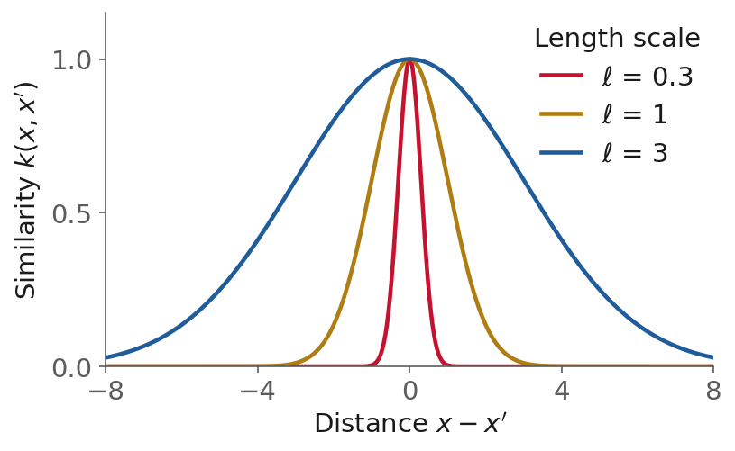

</div>
<div>

$$ k(x, x') = \sigma_f^2 \exp\!\Big(-\frac{(x - x')^2}{2\ell^2}\Big) $$

- The **length scale** $\ell$: how far apart two inputs can be and still be similar
- Prediction at a new $x_*$, with $K$ the similarity of the training points (noise included):

$$ \mu(x_*) = \mathbf{k}_*^\top K^{-1}\mathbf{y} \qquad \sigma^2(x_*) = k(x_*, x_*) - \mathbf{k}_*^\top K^{-1}\mathbf{k}_* $$

</div>
</div>

<span class="source"><a href="https://distill.pub/2019/visual-exploration-gaussian-processes/">A Visual Exploration of Gaussian Processes (Distill)</a> / <a href="https://www.cs.toronto.edu/~duvenaud/cookbook/">Duvenaud, the Kernel Cookbook</a></span>

<!--
The squared exponential (RBF) kernel. The mean is a weighted average of the known outputs, with
weights set by similarity; the variance starts at the prior variance and drops by what the data
explain, so it grows far from the data. Other kernels: Matern (rougher), periodic, sums and
products.
-->

---

## Gaussian processes, surfactant viscosity

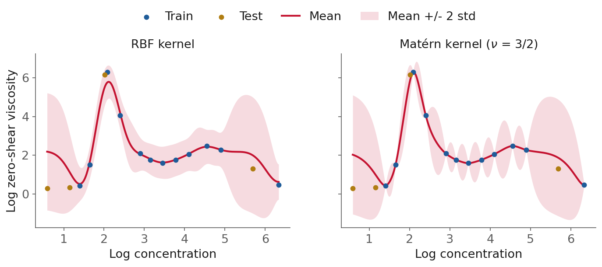

RBF: length scale 0.235 (standardized, 12 training points), test $R^2$ = 0.783 / Matérn: 0.836

<span class="source">16 points from a GP design of experiments (<a href="https://kitchingroup.cheme.cmu.edu/s20-06681/08-nonlinear-sklearn/08-nonlinear-sklearn.html">Kitchin group</a>), after <a href="https://doi.org/10.1021/j100327a031">Rehage and Hoffmann (1988)</a></span>

<!--
Strengths: probabilistic predictions, interpretable kernels, automatic Occam's razor.
Weaknesses: O(N^3), kernel choice matters, needs scaling.
-->

---

## Gaussian processes, what training solves

<style scoped>.cols { align-items: start; }</style>

<div class="cols cols-even">
<div>

**Neural network**

$$
\begin{aligned}
\min_{W,\,b} \quad & \sum_{i=1}^{N} \big(y_i - f(x_i; W, b)\big)^2
\end{aligned}
$$

No constraints: the weights and biases are free

</div>
<div>

**Gaussian process**, in scikit-learn

$$
\begin{aligned}
\min_{\boldsymbol{\theta}} \quad & -\log p(\mathbf{y} \mid X, \boldsymbol{\theta}) \\
\text{s.t.} \quad & \log 10^{-5} \le \theta_j \le \log 10^{5}
\end{aligned}
$$

$\boldsymbol{\theta} = \log(\sigma_f^2, \ell, \sigma_n^2)$: a few kernel hyperparameters, **bounded**

</div>
</div>

- In scikit-learn the GP runs **L-BFGS-B** with those bounds; the network's `lbfgs` runs the same routine **with no bounds**
- GPflow and GPyTorch keep the hyperparameters positive with a transform (softplus) and optimize freely

<!--
Checked in the scikit-learn source (1.6 and 1.9): GaussianProcessRegressor calls
scipy.optimize.minimize(method="L-BFGS-B", bounds=kernel.bounds). Theta and the bounds are
log-transformed, default (1e-5, 1e5) for the length scale, the constant (signal variance) and
the white-noise level. alpha goes on the diagonal and is not optimized. Restarts are drawn
log-uniformly inside the bounds. MLPRegressor(solver="lbfgs") calls the same routine without
bounds; adam and sgd apply none. GPflow: L-BFGS-B on softplus-transformed parameters. GPyTorch:
Adam on raw parameters with a softplus positivity constraint.
-->

---

## Gaussian processes, the marginal likelihood

<style scoped>
.opt-ann { height: 350px; }
.opt-ann li:nth-child(1) { left: 0; top: 0; width: 360px; border-color: #1f5c99; }
.opt-ann li:nth-child(2) { left: 380px; top: 0; width: 340px; border-color: #c41230; }
.opt-ann li:nth-child(3) { left: 250px; top: 245px; width: 380px; border-color: #2e7d32; }
.opt-ann li:nth-child(4) { left: 760px; top: 245px; width: 340px; border-color: #b07d12; }
</style>

<div class="opt-ann">

<svg class="opt-svg" viewBox="0 0 1100 350" width="1100" height="350">
<defs><marker id="ann43-head" viewBox="0 0 10 10" refX="9" refY="5" markerWidth="8" markerHeight="8" orient="auto-start-reverse"><path d="M0,0 L10,5 L0,10 z" fill="#5c5c5c"/></marker></defs>
<g font-family="'Times New Roman', Times, serif" fill="#1a1a1a" font-size="44">
<text x="40" y="185">−log <tspan font-style="italic">p</tspan>(<tspan font-weight="bold">y</tspan> | <tspan font-style="italic">X</tspan>, <tspan font-style="italic">θ</tspan>) =</text>
<text x="400" y="185"><tspan font-size="32" dy="-14">1</tspan><tspan font-size="32" dy="14">/</tspan><tspan font-size="32" dy="14">2</tspan><tspan dy="-14"> </tspan><tspan font-weight="bold">y</tspan><tspan font-size="30" dy="-18">T</tspan><tspan font-style="italic" dy="18" dx="4">K</tspan><tspan font-size="30" dy="-18" dx="6">−1</tspan><tspan font-weight="bold" dy="18" dx="4">y</tspan></text>
<text x="638" y="185">+</text>
<text x="676" y="185"><tspan font-size="32" dy="-14">1</tspan><tspan font-size="32" dy="14">/</tspan><tspan font-size="32" dy="14">2</tspan><tspan dy="-14"> log |</tspan><tspan font-style="italic">K</tspan>|</text>
<text x="870" y="185">+</text>
<text x="905" y="185"><tspan font-size="32" dy="-14" font-style="italic">N</tspan><tspan font-size="32" dy="14">/</tspan><tspan font-size="32" dy="14">2</tspan><tspan dy="-14"> log 2π</tspan></text>
</g>
<path class="arr arr1" d="M 180 90 C 180 110, 175 125, 170 145" fill="none" stroke="#1f5c99" stroke-width="3" marker-end="url(#ann43-head)"/>
<path class="arr arr2" d="M 510 90 C 512 110, 514 125, 514 145" fill="none" stroke="#c41230" stroke-width="3" marker-end="url(#ann43-head)"/>
<path class="arr arr3" d="M 700 245 C 740 235, 760 220, 770 205" fill="none" stroke="#2e7d32" stroke-width="3" marker-end="url(#ann43-head)"/>
<path class="arr arr4" d="M 960 245 C 965 235, 968 220, 970 205" fill="none" stroke="#b07d12" stroke-width="3" marker-end="url(#ann43-head)"/>
</svg>

* **What training minimizes**: minus the log of the **marginal likelihood**, the probability of the measured data for these kernel settings $\theta$
* **Misfit**: large when the kernel explains the data poorly
* **Complexity penalty**: large when the kernel is flexible enough to explain almost any data
* **A constant**: $N$ is the number of points; it does not change training

</div>

$K$ is the kernel's similarity matrix, noise included. Minimizing the sum picks the **simplest kernel that still explains the data**: Occam's razor, built in.

<!--
The labels and their arrows come in one at a time. The marginal likelihood averages over every function the GP
prior allows, so a flexible kernel spreads its probability over many possible datasets and gives
little to the one measured: that is the log-determinant term. My F25 slide: "GP estimation
balances data fit and complexity of the predicted model: Occam's razor is automatic".
-->

---

## Gaussian processes, the length scale

The surfactant data, with the signal and noise variances fixed at their fitted values; only the length scale $\ell$ (in log concentration) moves.

<style>
/* the GP length-scale slider */
.gpl-widget { font-size: 22px; }
.gpl-controls { display: flex; gap: 0.8em; align-items: center; justify-content: center; margin: 0.1em 0 0.2em; }
.gpl-controls input[type=range] { width: 460px; accent-color: #c41230; }
.gpl-readout { text-align: center; color: #5c5c5c; margin-top: 0.1em; }
.gpl-widget svg { display: block; margin: 0 auto; }
</style>
<div class="gpl-widget">
<div class="gpl-controls">
<span>Length scale: short</span>
<input type="range" id="gpl-ell" min="-1.7" max="0.5" step="0.005" value="-1.4">
<span>Long</span>
</div>
<svg id="gpl-svg" viewBox="0 0 1120 338" width="1120" height="338"></svg>
<div class="gpl-readout" id="gpl-readout"></div>
</div>

<script>
(() => {
  const svg = document.getElementById("gpl-svg");
  if (!svg || svg.dataset.ready) return;
  svg.dataset.ready = "1";
  // 16 surfactant solutions, (log concentration, log zero-shear viscosity), logzsv.csv.
  // SF2 and SN2 are the fitted signal and noise variances (figures/make_figures.py widgets), held fixed here.
  const D = [[0.587787, 0.295331], [2.014903, 6.153262], [3.453157, 1.587648], [4.893352, 2.270814],
    [6.332036, 0.461759], [1.150572, 0.325801], [1.65058, 1.512481], [2.399712, 4.058127],
    [2.899772, 2.084774], [4.099995, 2.050035], [1.401183, 0.435005], [2.085672, 6.286403],
    [3.150169, 1.766722], [4.549975, 2.477512], [5.689988, 1.293671], [3.78009, 1.759563]];
  const SF2 = 2.251841, SN2 = 0.002066;
  const X = D.map(d => d[0]), N = X.length;
  const YM = D.reduce((s, d) => s + d[1], 0) / N, YC = D.map(d => d[1] - YM);
  const kern = (a, b, ell) => SF2 * Math.exp(-((a - b) ** 2) / (2 * ell * ell));
  const chol = A => {
    const n = A.length, L = A.map(() => Array(n).fill(0));
    for (let i = 0; i < n; i++)
      for (let j = 0; j <= i; j++) {
        let s = A[i][j];
        for (let k = 0; k < j; k++) s -= L[i][k] * L[j][k];
        L[i][j] = i === j ? Math.sqrt(s) : s / L[j][j];
      }
    return L;
  };
  const lower = (L, b) => {
    const z = b.slice();
    for (let i = 0; i < z.length; i++) { for (let k = 0; k < i; k++) z[i] -= L[i][k] * z[k]; z[i] /= L[i][i]; }
    return z;
  };
  const upper = (L, z) => {
    const w = z.slice();
    for (let i = w.length - 1; i >= 0; i--) { for (let k = i + 1; k < w.length; k++) w[i] -= L[k][i] * w[k]; w[i] /= L[i][i]; }
    return w;
  };
  const fit = ell => {
    const L = chol(X.map((a, i) => X.map((b, j) => kern(a, b, ell) + (i === j ? SN2 : 0))));
    const z = lower(L, YC);
    const misfit = 0.5 * z.reduce((s, v) => s + v * v, 0);
    const cplx = L.reduce((s, r, i) => s + Math.log(r[i]), 0);
    return {L, alpha: upper(L, z), misfit, cplx, sum: misfit + cplx};
  };
  const G0 = -1.7, GS = 0.005, NG = 440;
  const grid = Array.from({length: NG + 1}, (_, i) => Math.round((G0 + i * GS) * 1000) / 1000);
  const fits = grid.map(g => fit(10 ** g));
  const NS = "http://www.w3.org/2000/svg";
  const el = (tag, attrs, text) => {
    const e = document.createElementNS(NS, tag);
    for (const k in attrs) e.setAttribute(k, attrs[k]);
    if (text !== undefined) e.textContent = text;
    return e;
  };
  const add = (tag, attrs, text) => svg.appendChild(el(tag, attrs, text));
  const LP = {x0: 80, x1: 520, y0: 12, y1: 282, xa: 0, xb: 7, ya: -2, yb: 8};
  const RP = {x0: 650, x1: 1100, y0: 12, y1: 282, xa: G0, xb: G0 + NG * GS, ya: -10, yb: 25};
  const sx = (P, v) => P.x0 + (v - P.xa) / (P.xb - P.xa) * (P.x1 - P.x0);
  const sy = (P, v) => P.y1 - (v - P.ya) / (P.yb - P.ya) * (P.y1 - P.y0);
  const line = (P, pts) => {
    // keep a polyline's box inside its plot: cut each segment where it leaves the frame
    const lo = P.y0 - 4, hi = P.y1 + 4, out = [];
    pts.forEach(([x, y], i) => {
      if (i > 0) {
        const [xp, yp] = pts[i - 1];
        [lo, hi].map(b => [(b - yp) / (y - yp), b]).filter(([t]) => t > 0 && t < 1).sort((a, b) => a[0] - b[0])
          .forEach(([t, b]) => out.push([xp + t * (x - xp), b]));
      }
      out.push([x, Math.max(lo, Math.min(hi, y))]);
    });
    return out.map(([x, y]) => `${x.toFixed(1)},${y.toFixed(1)}`).join(" ");
  };
  const frame = (P, id, xlab, ylab, xt, yt) => {
    add("clipPath", {id}).appendChild(el("rect", {x: P.x0, y: P.y0, width: P.x1 - P.x0, height: P.y1 - P.y0}));
    add("rect", {x: P.x0, y: P.y0, width: P.x1 - P.x0, height: P.y1 - P.y0, fill: "none", stroke: "#bbb"});
    xt.forEach(([v, t]) => add("text", {x: sx(P, v), y: P.y1 + 22, "text-anchor": "middle", "font-size": 18, fill: "#5c5c5c"}, t));
    yt.forEach(v => add("text", {x: P.x0 - 10, y: sy(P, v) + 6, "text-anchor": "end", "font-size": 18, fill: "#5c5c5c"}, String(v)));
    add("text", {x: (P.x0 + P.x1) / 2, y: P.y1 + 48, "text-anchor": "middle", "font-size": 20, fill: "#1a1a1a"}, xlab);
    add("text", {x: P.x0 - 50, y: (P.y0 + P.y1) / 2, "text-anchor": "middle", "font-size": 20, fill: "#1a1a1a",
      transform: `rotate(-90 ${P.x0 - 50} ${(P.y0 + P.y1) / 2})`}, ylab);
  };
  frame(LP, "gpl-clip-l", "Log concentration", "Log viscosity", [0, 2, 4, 6].map(v => [v, String(v)]), [0, 2, 4, 6, 8]);
  frame(RP, "gpl-clip-r", "Length scale (log axis)", "Objective",
    [0.03, 0.1, 0.3, 1, 3].map(v => [Math.log10(v), String(v)]), [-10, 0, 10, 20]);
  add("line", {x1: RP.x0, x2: RP.x1, y1: sy(RP, 0), y2: sy(RP, 0), stroke: "#e2e2e2", "stroke-width": 1.5});
  const band = add("polygon", {fill: "#c41230", "fill-opacity": 0.15, stroke: "none", "clip-path": "url(#gpl-clip-l)"});
  const mean = add("polyline", {fill: "none", stroke: "#c41230", "stroke-width": 3, "clip-path": "url(#gpl-clip-l)"});
  D.forEach(([x, y]) => add("circle", {cx: sx(LP, x), cy: sy(LP, y), r: 5.5, fill: "#1a1a1a"}));
  const halo = {"text-anchor": "end", "font-size": 18, stroke: "#fff", "stroke-width": 6, "paint-order": "stroke", "stroke-linejoin": "round"};
  add("text", {...halo, x: LP.x1 - 12, y: LP.y0 + 26, fill: "#1a1a1a"}, "16 measurements");
  add("text", {...halo, x: LP.x1 - 12, y: LP.y0 + 50, fill: "#c41230"}, "GP mean and 2 std band");
  const curve = (key, color, width) => add("polyline", {fill: "none", stroke: color, "stroke-width": width, "clip-path": "url(#gpl-clip-r)",
    points: line(RP, grid.map((g, i) => [sx(RP, g), sy(RP, fits[i][key])]))});
  curve("misfit", "#1f5c99", 2.5);
  curve("cplx", "#b07d12", 2.5);
  curve("sum", "#c41230", 3.5);
  const marker = add("line", {y1: RP.y0, y2: RP.y1, stroke: "#5c5c5c", "stroke-width": 2, "stroke-dasharray": "6 4"});
  const lab = (i, key, dy, color, text) => add("text", {...halo, "text-anchor": "start", x: sx(RP, grid[i]), y: sy(RP, fits[i][key]) + dy, fill: color}, text);
  lab(8, "sum", -12, "#c41230", "Sum: what training minimizes");
  lab(8, "misfit", -12, "#1f5c99", "Misfit");
  lab(8, "cplx", 26, "#b07d12", "Complexity penalty");
  const dot = add("circle", {r: 7, fill: "#c41230", stroke: "#fff", "stroke-width": 2});
  const off = add("text", {...halo, y: RP.y0 + 24, fill: "#c41230"});
  const xs = [];
  for (let i = 0; i <= 700; i++) xs.push(LP.xa + i * (LP.xb - LP.xa) / 700);
  X.forEach(x => xs.push(x));
  xs.sort((a, b) => a - b);
  const slider = document.getElementById("gpl-ell");
  const readout = document.getElementById("gpl-readout");
  slider.addEventListener("keydown", e => e.stopPropagation());
  const draw = () => {
    const i = Math.max(0, Math.min(NG, Math.round((parseFloat(slider.value) - G0) / GS)));
    const g = grid[i], ell = 10 ** g, F = fits[i];
    const up = [], lo = [], mid = [];
    xs.forEach(x => {
      const k = X.map(a => kern(a, x, ell));
      const m = YM + k.reduce((s, v, j) => s + v * F.alpha[j], 0);
      const v = lower(F.L, k);
      const sd = Math.sqrt(Math.max(SF2 - v.reduce((s, t) => s + t * t, 0), 0));
      const cx = sx(LP, x);
      mid.push([cx, sy(LP, m)]);
      up.push([cx, sy(LP, m + 2 * sd)]);
      lo.push([cx, sy(LP, m - 2 * sd)]);
    });
    mean.setAttribute("points", line(LP, mid));
    band.setAttribute("points", line(LP, up) + " " + line(LP, lo.reverse()));
    marker.setAttribute("x1", sx(RP, g));
    marker.setAttribute("x2", sx(RP, g));
    dot.setAttribute("cx", sx(RP, g));
    dot.setAttribute("cy", sy(RP, F.sum));
    dot.setAttribute("visibility", F.sum <= RP.yb ? "visible" : "hidden");
    off.setAttribute("x", RP.x1 - 10);
    off.setAttribute("text-anchor", "end");
    off.textContent = F.sum > RP.yb ? `Sum ${F.sum.toFixed(0)} \u2191` : "";
    readout.textContent = `Length scale ${ell.toPrecision(2)}, misfit ${F.misfit.toFixed(1)},` +
      ` complexity penalty ${F.cplx.toFixed(1)}, sum ${F.sum.toFixed(1)}`;
  };
  slider.addEventListener("input", draw);
  slider.addEventListener("change", () => slider.blur());
  draw();
})();
</script>

<!--
Short l: the mean spikes through every point and falls back to the average between them;
complexity penalty large. The function may change between neighboring points. The sum reaches
its minimum near l = 0.31 (the fitted value on all 16 points; the 0.235 two slides back is in
standardized units, on 12 points). Long l: smooth over the whole range; the curve cannot reach
the peak and the misfit explodes.
-->

---

## Regression models, what each training solves

<style scoped>table { font-size: 0.76em; }</style>

| Model | Variables | Objective | Kind of problem | Solved by |
|---|---|---|---|---|
| Linear | $a$ | Squared error | Convex, one minimum | One least squares solve |
| Ridge, lasso | $a$ | + $\alpha\sum a_i^2$, + $\alpha\sum\lvert a_i\rvert$ | Convex | A solve; coordinate descent |
| Decision tree | The splits | Squared error | Combinatorial | Greedy, split by split |
| Neural network | $W, b$ | Squared error | **Non-convex** | L-BFGS, Adam, SGD |
| Gaussian process | $\ell, \sigma_f, \sigma_n$ | $-\log p(\mathbf{y}\mid X,\theta)$ | Non-convex, bounded | L-BFGS-B, restarts |

---

## Training as optimization, with physics in it (spoiler alert! :) )

Start from the training problem, and keep adding terms:

* **Fit the data**: $\;\min_\theta \; \sum_i \big(y_i - f(x_i;\theta)\big)^2$
* **Add regularization**, prefer small weights: $\;+\;\alpha\,\lVert\theta\rVert^2$
* **What if the penalty is a law the model must obey**, a mass balance or an ODE? $\;+\;\lambda \sum_j \big\lVert \mathcal{F}[f](z_j) \big\rVert^2$
* We will see **later in the course** how to blend physics and machine learning: **scientific machine learning**

<span class="source"><a href="https://doi.org/10.1016/j.jcp.2018.10.045">Raissi, Perdikaris and Karniadakis (2019)</a></span>

<!--
Four bullets, one at a time. F is any residual known to be zero: a balance, a rate law, an ODE
evaluated at collocation points z_j. One sentence is enough.
-->

---

## Regression models, back to Lecture 8: NARX

Lecture 8 forecast the reactor pressure $y$ 30 minutes ahead, from the plant's recent past:

$$ \hat{y}(t + 30\,\text{min}) = f\big(\underbrace{y(t),\, y(t - 3),\, \dots,\, y(t - 27)}_{\text{the last 10 pressures}},\; \underbrace{u_1(t),\, \dots,\, u_{11}(t)}_{\text{the 11 valve positions}}\big) $$

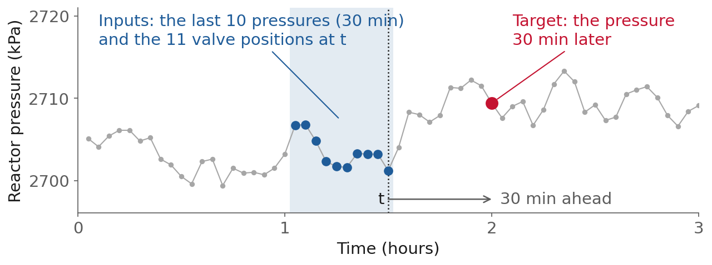

Lecture 8's $f$ was linear (ridge): an **ARX** model. A network or a GP as $f$ makes it **NARX**, a nonlinear ARX.

---

## Regression models, NARX results

Trained on 300 fault-free runs, tested on 100 others (Lecture 8's split by run):

| Model | Test RMSE (kPa) |
|---|---|
| Baseline: repeat the last value | 5.82 |
| Baseline: predict the mean | 7.57 |
| ARX, ridge (Lecture 8) | 4.71 |
| NN-NARX, 32 tanh units | 4.73 |
| GP-NARX, on 1,000 rows | 4.76 |

- **Scale the target too**: pressure sits near 2,705 kPa with a spread of 7.7; an unscaled network just predicts the mean (7.57)
- The three tie: held at its operating point, the plant behaves **close to linearly**

<!--
Same fit/predict, on a lag table instead of a table of experiments. The GP-NARX got only 1,000
rows because its cost grows as N cubed: all 144,300 training rows would need a 167 GB kernel
matrix (the notes have a section on where scikit-learn stops). ARX on the same 1,000 rows: 4.76.
Lecture 7's deviation variables are the same idea as scaling the target.
-->

---

## Regression models, NARX forecasts

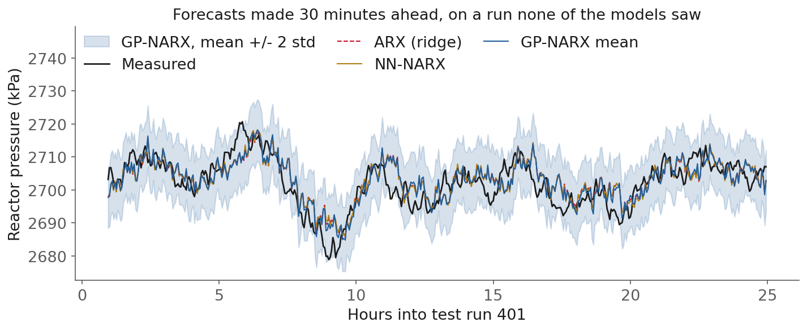

- All three forecasts lie on top of each other; the GP adds a band, with **94.8%** of test points inside 2 standard deviations

---

<!-- _class: section -->

# Choosing a model with cross-validation

---

## Cross-validation

<div class="definition">

**k-fold cross-validation**: split the training data into $k$ folds, train $k$ times holding out a different fold each time, and average the $k$ scores.

</div>

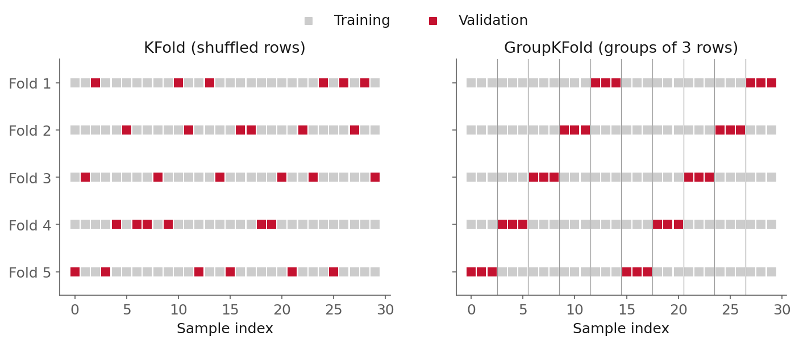

---

## Cross-validation, in scikit-learn

```python
cv = KFold(
    n_splits=5,
    shuffle=True,
    random_state=0,
)
scores = cross_val_score(
    model, X_train, y_train,
    cv=cv,
    scoring="neg_root_mean_squared_error",
)
rmse = -scores.mean()
```

- In scikit-learn every score is "higher is better", so error metrics come back **negated**: flip the sign to read the RMSE

---

## Cross-validation, back to concrete

<div class="cols cols-even">
<div>


</div>
<div>

- The 86 test mixes (195 rows) were **locked away first**; the models see the other **835 rows**
- A row is one mix crushed at one age, and **182 mixes** were crushed at several ages
- So rows are not independent experiments: two rows can be the **same mix**

</div>
</div>

---

## Cross-validation, the four families on concrete

5-fold cross-validation on the 835 rows, **rows assigned to folds at random**:

<style scoped>table { font-size: 0.74em; }</style>

| Model | RMSE (MPa) | MAE (MPa) | $R^2$ |
|---|---|---|---|
| Baseline: predict the mean | 16.8 | 13.6 | −0.01 |
| Linear | 10.6 | 8.46 | 0.60 |
| Linear, with physics features | 7.25 | 5.60 | 0.81 |
| Decision tree (no depth limit) | 6.92 | 4.52 | 0.83 |
| Neural network (16 tanh) | 5.96 | 4.20 | 0.87 |
| Gaussian process | 5.81 | 3.96 | 0.88 |

Physics features: log(age), and the water/cement ratio

---

## Cross-validation, grouped rows

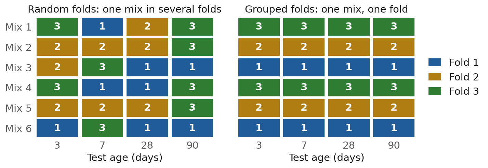

<div class="definition">

**Grouped cross-validation** (`GroupKFold`): all the rows of a group (a mix, a batch, a run) are either all in training or all in validation.

</div>

- The engineer's question: how strong will a mix **nobody has made yet** be? Only grouped folds ask it

<!--
Random folds: the 28-day row of a mix trains and the 56-day row of the same mix validates, so the
model is asked about a mix it has already seen. Lecture 8's split by run, without the time axis.
-->

---

## Cross-validation, KFold against GroupKFold

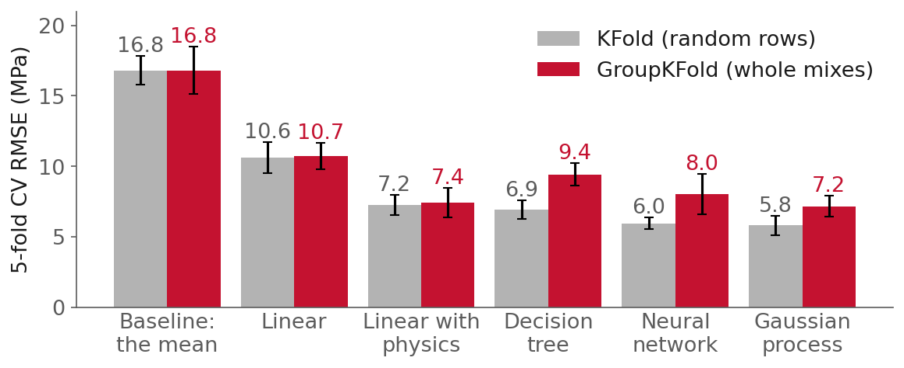

- Random rows: the **tree beats** the line with physics features (6.92 against 7.25 MPa)
- Whole mixes: the tree **loses by 2 MPa** (9.42 against 7.43); the line is within 0.3 MPa of the GP

---

<!-- _class: section -->

# Model capacity, overfitting and learning curves

---

## Model capacity

<div class="definition">

**Capacity**: the range of functions a model can represent. More capacity fits more complicated relationships, and more of the noise.

</div>

- The knobs: polynomial degree, tree depth, hidden units, the penalty $\alpha$, a kernel's length scale
- **Overfitting**: training error much lower than validation error. **Underfitting**: both high, and close together

<div class="definition">

**Bias-variance trade-off**: more capacity lowers bias and raises variance, so validation error is lowest in between.

</div>

<span class="source"><a href="https://hastie.su.domains/ElemStatLearn/download.html">Hastie, Tibshirani and Friedman, section 7.3, eq. 7.9</a></span>

<!--
ESL eq. 7.9: Err(x0) = noise + Bias^2 + Var. Noise: no model removes it. Bias: the average
model's distance from the truth. Variance: how much the model moves when the training set
changes. A straight line on concrete is the high-bias end; a tree with no depth limit is the
high-variance end.
-->

---

## Model capacity, validation curves

<div class="definition">

**Validation curve**: training and validation error against one capacity knob, with the data fixed.

</div>

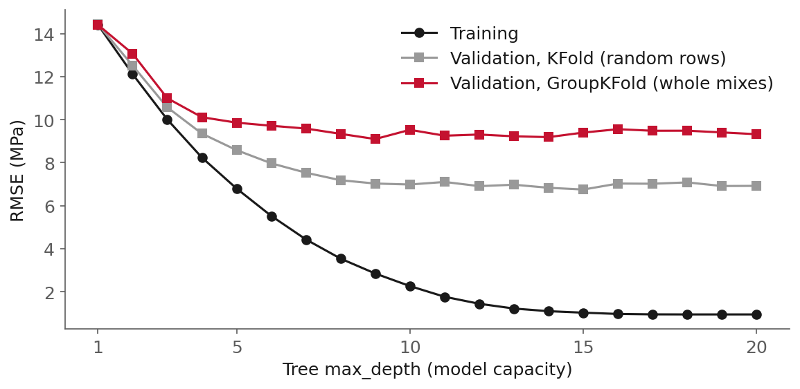

<!--
Training error falls to 0.95 and never to zero: nine settings (same mix, same age) were crushed
more than once with different results, one from 22.9 to 55.9 MPa at 7 days. Those replicates are
the noise term. GroupKFold validation stops improving at depth 9 (9.10) and wobbles 9.2 to 9.6.
"Looking only at the train score can be misleading!" Random folds keep rewarding depth because
they reward memorizing.
-->

---

## Model capacity, learning curves

<div class="definition">

**Learning curve**: training and validation error against training-set size, model fixed.

</div>

<style scoped>table { font-size: 0.6em; } table th, table td { padding: 4px 12px; } .cols-lc { grid-template-columns: 1.45fr 1fr; font-size: 0.74em; } .cols-lc p:has(> img:only-child) { margin: 0; } .cols-lc ul { margin: 0; }</style>

<div class="cols cols-lc">
<div>

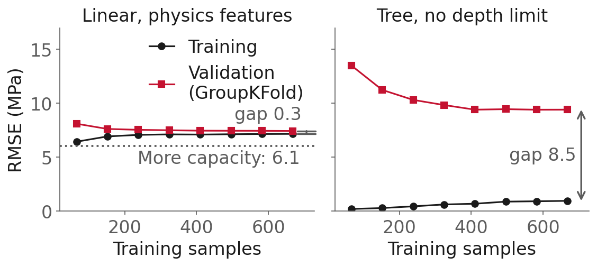

</div>
<div>

- **Gap** is variance: the line's gap closes to 0.3 MPa, so it no longer overfits
- **Level** is bias plus noise: the line's validation ends at 7.4 MPa, more capacity reaches 6.1, so it underfits
- **The tree**: a gap of 8.5 MPa that more samples are not closing, so it overfits

</div>
</div>

| The curves show | Diagnosis | What helps | Here |
|---|---|---|---|
| Gap closed, error still high | Underfitting (high bias) | More capacity, better features | The line (left) |
| Gap closed, error low | A good fit | Stop, and test once | |
| Big gap: training low, validation much higher | Overfitting (high variance) | Less capacity, regularization | The tree (right) |
| Validation still falling at the right edge | Limited by data | More training samples | |

<!--
Each panel shows two things. The gap between the curves is the variance: the line's closes to
0.3 MPa as the training set grows, so it no longer overfits, and more samples can buy at most 0.3.
The level where the curves meet is bias plus noise. "High" needs a reference: gradient-boosted
trees on the same features and grouped folds reach 6.1 MPa, better than the line on all five
folds. So about 1.4 MPa of the line's 7.4 on validation is bias that more capacity removes; the
rest includes the replicate noise from the last slide. The line underfits. The same closed gap at
a level nothing beats would be a good fit: stop and test once.
The tree: 0.95 on its training samples, 9.4 on validation, a gap of 8.5: overfitting. Its
validation curve is flat from about 400 samples on, so more samples of the same kind do not close
the gap; hence no example here for the "limited by data" row.
The curves average ten random orderings of the training rows. learning_curve does not shuffle by
default, and in file order the tree's curve showed a false late drop.
-->

---

<!-- _class: section -->

# Limitations

---

## Limitations, outside the data

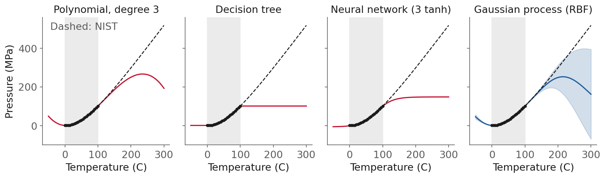

All four refitted on the 21 points. At 300 °C, NIST: **517.7 MPa**. Polynomial 192, tree **flat** at 100.7, network **saturates** at 148, GP 162 ± 232: the band **still misses**.

<!--
A GP's uncertainty describes distance from the data under the kernel's smoothness assumption.
It says nothing about physics the data never showed it. The notes' four-families table has a row
for this: follows its features, flat, saturates, back to the mean. 192 here, not the 223 of the
opening slide: this polynomial is fitted on all 21 points, that one on 16.
-->

---

## But wait, we didn't discuss the hyperparameters?

Chosen by hand today: 16 hidden units, a tree with no depth limit, the ridge $\alpha = 1$ of the ARX, the kernel's form, and the depth-2 water tree

$$
\begin{aligned}
\min_{\lambda} \quad & L_{\text{val}}\big(\theta^*(\lambda)\big) \\
\text{s.t.} \quad & \theta^*(\lambda) = \arg\min_{\theta} \; L_{\text{train}}(\theta; \lambda)
\end{aligned}
$$

- An optimization problem with a training problem inside it
- Every evaluation of the outer objective trains a model
- The best of many validation scores is optimistic

How do you search over $\lambda$ without fooling yourself?

---

<!-- _class: demo -->

# Worked example

## `l09-regression.ipynb`

The workflow on concrete, one step per cell: lock the test mixes, fit four families, compare KFold with GroupKFold, test once. Then NARX on Lecture 8's table.

Run it after class, top to bottom. The first run downloads the data; the cross-validation cell takes a minute or two.

<a href="../../lectures/l09/l09-regression.html">Open the worked example</a>

<!--
Not run in class; the 20 minutes after the deck are for questions. The notebook: the concrete
workflow and the NARX forecasts from today's slides, one step per cell, on the real data. The
first run downloads the concrete file (125 kB) and the fault-free TEP file (25 MB).
-->

---

## Recap

<style scoped>
.cards-recap { grid-template-columns: repeat(4, 1fr); }
.cards-recap .card { font-size: 0.62em; }
.cards-recap .card img { height: 118px; width: 100%; object-fit: contain; background: #fff; border-radius: 4px; }
.cards-recap .card h4 { font-size: 1.3em; margin: 6px 0 4px; min-height: 2.5em; }
.cards-recap .card p { margin: 0 0 6px; }
.cards-recap .card p.ev { color: #5c5c5c; }
p.recap-lead { margin: 0 0 0.2em; }
p.recap-close { font-size: 0.8em; margin-top: 0.7em; text-align: center; }
</style>

<p class="recap-lead">Four questions to ask of any model, today's or your own:</p>

<div class="cards cards-recap">
<div class="card"><h4>What does it know?</h4><p><b>Only its data.</b></p><p class="ev">The polynomial scored R<sup>2</sup> = 0.9999975 on the water data, and gave 223 MPa at 300 &deg;C, where NIST gives 517.7.</p></div>
<div class="card">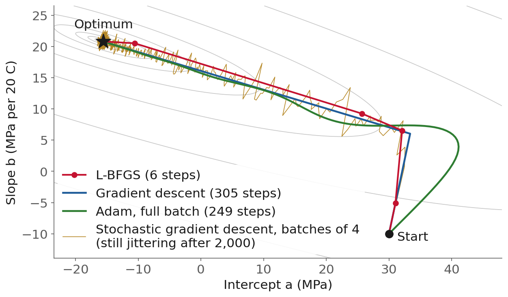<h4>What did training solve?</h4><p><b>An optimization problem, and the family picks it.</b></p><p class="ev">A line has one minimum and a network many; a GP tunes a few bounded hyperparameters.</p></div>
<div class="card"><h4>What did the score measure?</h4><p><b>The question your split asked.</b></p><p class="ev">The tree beat the line on random folds and lost to it by 2 MPa on grouped folds.</p></div>
<div class="card"><h4>What is holding it back?</h4><p><b>A gap is variance, a high level is bias.</b></p><p class="ev">The tree kept a gap of 8.5&nbsp;MPa. The line closed its gap but ended 1.4&nbsp;MPa above a model with more capacity.</p></div>
</div>

<p class="recap-close"><b>Start simple, and put what you know into the features:</b> a line with two physics features came within 0.3 MPa of a Gaussian process on grouped folds.</p>

<!--
Each card's picture is the slide where the class saw the answer. The four questions hold for any
model the students fit this semester, so the deck ends on them instead of a list. The habits
under them: lock the test set and touch it once, scale the inputs and the target, set
random_state.
-->

---

## This week

**Practice module** for this session, for participation credit
**Worked example** `l09-regression.ipynb`, to run after class
