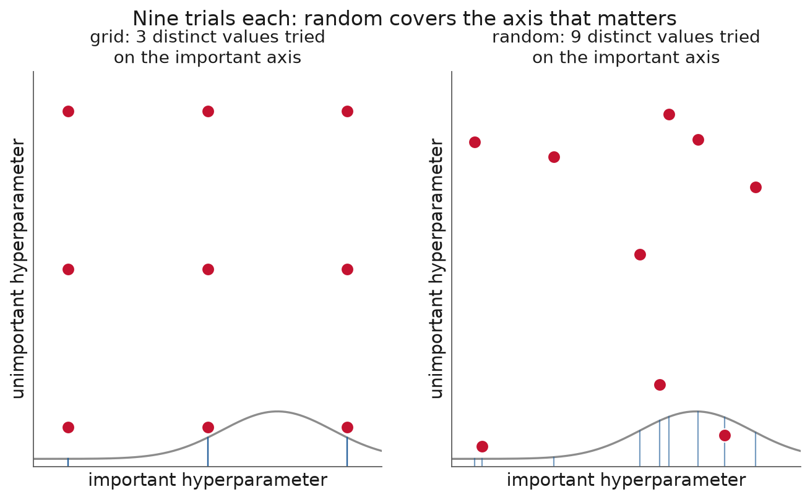
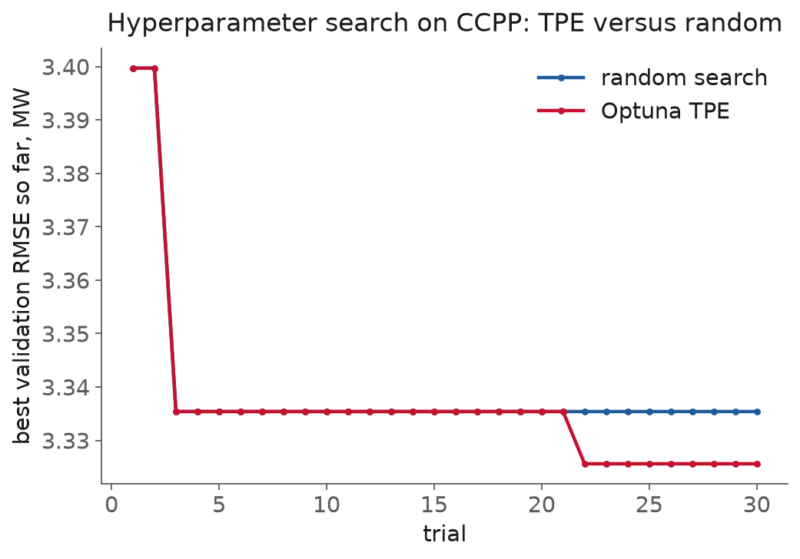

<!-- _class: title -->

# Lecture 10: Experiment tracking and hyperparameter search

## Week 5, Machine learning

**Systems and Toolchains for AI Engineers**

---

## Roadmap

1. Which run produced this number?
2. What every run records
3. MLflow: experiments, runs, registry
4. Searching the space: grid, random, Bayesian
5. The statistics of selection
6. Where this pushes back
7. Live demo: search, tracked, to a registered model

---

<!-- _class: section -->

# Which run produced this number?

---

## Which run produced this number?

A model-selection study runs the training script hundreds of times: features, model families, hyperparameters, seeds.

A week later: *which run gave the 3.2 MW error in your slide, and can you reproduce it?*

A folder of timestamped files and your memory is not an answer.

---

## Which run produced this number?, the two halves

Lecture 9 produced the runs (baselines, CV, metrics, test once). This session keeps the record and searches honestly.

They are one problem twice: a **search generates hundreds of runs and picks the best**, and picking the best is where an unrecorded study lies to you.

Same dataset as Lecture 9: CCPP, 9,568 rows, four ambient measurements to power output in MW.

---

<!-- _class: section -->

# What every run records

---

## What every run records

The record has to be enough to rebuild the run. Log:

- **hyperparameters** and **metrics** (per fold, not just the mean)
- the **git SHA** of the code
- the **data hash** (Lecture 8) and the **seed**
- the **environment** (`uv.lock`, Lecture 2)
- **artifacts**: the fitted pipeline, plots, importances

One run = one fact you can reproduce. A search multiplies runs by 100.

---

<!-- _class: section -->

# MLflow: experiments, runs, registry

---

## MLflow, experiments and runs

<div class="definition">

**Run**: one execution of training code. **Experiment**: a group of related runs that sort and compare together.

</div>

Inside a run: `log_param`, `log_metric`, `log_artifact`. **Autolog** records all of it, and builds a parent run with one nested child per search candidate.

---

## MLflow, the small interface

```python
import mlflow
mlflow.set_tracking_uri("sqlite:///mlflow.db")   # local, no server
mlflow.set_experiment("ccpp-search")

with mlflow.start_run(run_name="hgb-trial-7"):
    mlflow.log_params(params)
    mlflow.log_param("data_md5", data_hash)      # lineage, from Lecture 8
    mlflow.log_metric("val_rmse", rmse)
    mlflow.sklearn.log_model(model, name="model")
```

[MLflow Tracking](https://mlflow.org/docs/latest/ml/tracking/)

---

## MLflow, the local store

<div class="definition">

Recent MLflow deprecates the bare file store (`./mlruns`) and defaults to a local **SQLite** database: `sqlite:///mlflow.db`.

</div>

- set the SQLite URI explicitly so a demo does not stop on a warning
- UI: `mlflow ui` (older) or `mlflow server` (current), same store
- a local store is enough; do not stand up a server in class

---

## MLflow, the model registry

<div class="definition">

**Model Registry**: "a centralized model store, set of APIs and a UI designed to collaboratively manage the full lifecycle of a machine learning model."

</div>

Register under a name and version, load back by **model URI**:

- `models:/ccpp-hgb/3` for a fixed version
- `models:/ccpp-hgb@champion` for a moving alias

[MLflow Model Registry](https://mlflow.org/docs/latest/ml/model-registry/)

---

<!-- _class: section -->

# Searching the space

---

## Searching the space, grid vs random

<div class="definition">

**Hyperparameter search**: propose a configuration, train, log the result, repeat, with a strategy for what to propose next.

</div>

Grid tries every combination: exhaustive, and the wrong default. Random samples each parameter from a range.

Bergstra & Bengio (2012): "randomly chosen trials are more efficient ... than trials on a grid," because "only a few of the hyper-parameters really matter."

---



---

## Searching the space, grid vs random

If only the horizontal axis matters:

- grid tries **3** distinct values of it (nine trials, three repeated)
- random tries **9** distinct values (same budget)

The grid spends most of its budget on an axis that does not change the score.

[Bergstra & Bengio, JMLR 2012](https://www.jmlr.org/papers/v13/bergstra12a.html)

---

## Searching the space, Bayesian and Optuna

<div class="definition">

**Bayesian optimization** models the score as a function of the hyperparameters and proposes the next trial where it expects improvement. Optuna's default is **TPE** (Tree-structured Parzen Estimator).

</div>

```python
def objective(trial):
    lr = trial.suggest_float("learning_rate", 0.01, 0.5, log=True)
    ...
    return cross_val_rmse(params)

study = optuna.create_study(direction="minimize")
study.optimize(objective, n_trials=30)
```

---

## Searching the space, the honest result



TPE reaches a good config in fewer trials, but both finish close: **3.326** MW (TPE) vs **3.335** (random). On an easy problem the sampler matters less than searching at all.

---

## Searching the space, making it affordable

- **Pruning**: stop a trial early when its intermediate scores look hopeless (Optuna's median, successive-halving pruners)
- **Hyperband** (Li et al. 2018): random search plus "adaptive resource allocation and early-stopping"

Log every trial as a nested MLflow run, so the search is auditable, not a black box.

---

<!-- _class: section -->

# The statistics of selection

---

## The statistics of selection, the winner's curse

A search reports the best of many trials, and the best validation score is optimistic **by construction**.

Cawley & Talbot (2010): common practices "are susceptible to a form of selection bias ... and hence are unreliable."

You cannot find this by reading the metric; the metric is what is biased.

---

## The statistics of selection, three habits

<div class="definition">

**One-standard-error rule**: choose the most parsimonious model whose error is within one standard error of the best (ESL 7.10).

</div>

1. Report the validation **distribution**, not just its minimum
2. Touch the **test set once**, on the one selected model
3. Prefer the simplest model within **1 SE** of the best

---

## The statistics of selection, how big is the bias

Measured on CCPP over a 36-candidate grid, the optimism of the best validation score vs the honest test:

| training rows | optimism |
|---|---|
| 80 | +0.19 MW |
| ~320 | inside fold noise |
| 9,568 (all) | -0.003 MW |

Selection bias is a **small-data** problem. **Nested CV** is insurance when data is scarce, not a tax on every study.

---

<!-- _class: section -->

# Where this pushes back

---

## Where this pushes back

- **A tracker you do not read is overhead.** Autolog makes it easy to record everything and examine nothing. The value is in opening the UI and sorting.
- **Search can overfit the validation set.** Cap the budget, keep a locked test set, apply the 1-SE rule.
- **Sampler < search < data.** TPE beat random by 0.009 MW, below the fold noise. A better feature (Lecture 7/Lecture 8) moves the score more than any sampler.
- **The registry records a decision, not a good one.** A model from a leaky split is a well-organized mistake.

---

<!-- _class: demo -->

# Demo

## `l10-tracking-search.ipynb`

Optuna over gradient-boosting hyperparameters on CCPP, each trial a nested MLflow run (SQLite store). Sort the UI by validation RMSE, read which hyperparameters mattered, register the winner, load it by `models:/` URI, and compute the single test score.

---

## What to watch

The gap between the **best validation score** in the sorted list and the **final test number**.

The search optimizes the first.

Honesty reports the second.

---

## Recap

- Tracking answers "which run, and can I reproduce it?" only if each run logs params, metrics, SHA, data hash, seed, environment
- MLflow: experiments, runs, autolog, nested runs, registry + model URIs, SQLite store
- Prefer random or Bayesian search to grid; on easy problems the sampler barely beats random
- The best validation score is optimistic: report the distribution, use 1-SE, test once

---

## Next

**Assignment 5** (from Lecture 9): its tracking and search half is now unblocked
**Reading** MLflow + Optuna docs; Bergstra & Bengio (2012)

Full notes, with all sources: `lectures/l10/notes.md`
