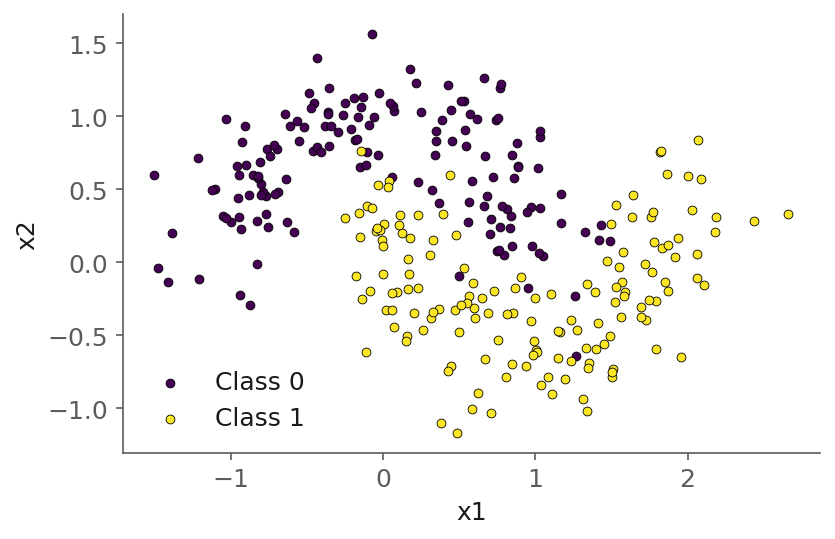
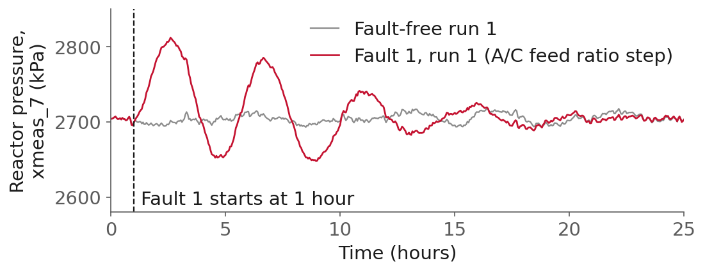
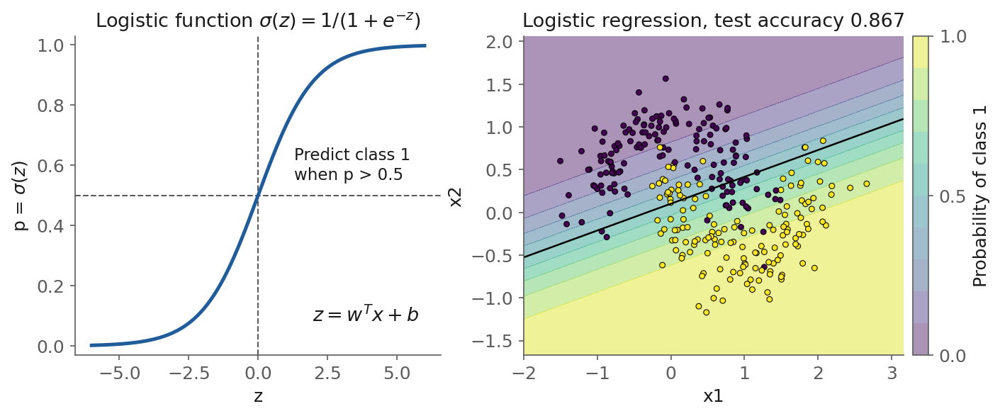
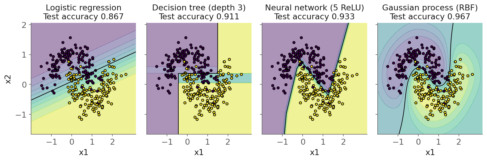
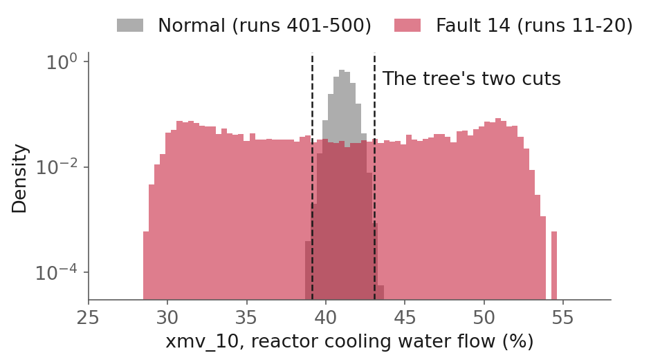
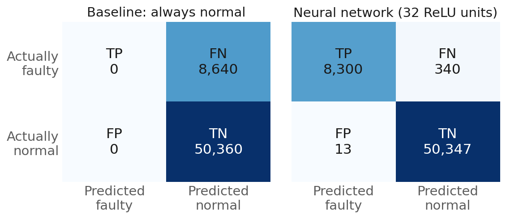
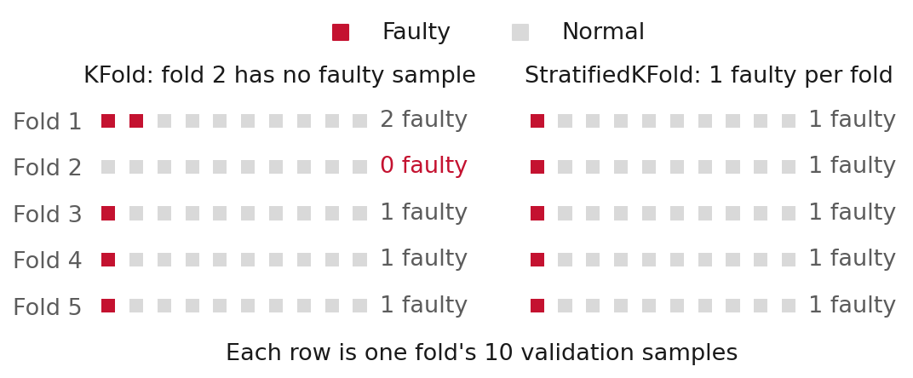
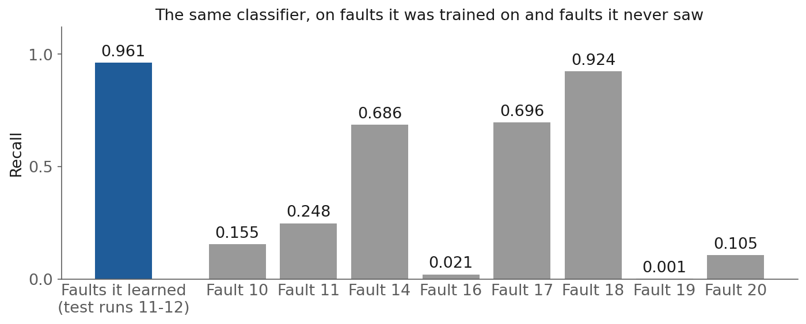

<style>
/* L10: a figure alone in its paragraph is centered, and so is every table. */
section p:has(> img:only-child) { text-align: center; }
section table { margin-left: auto; margin-right: auto; }
.cols { display: grid; gap: 1.1em; align-items: center; }
.cols-even { grid-template-columns: 1fr 1fr; }
.cmgrid { display: grid; grid-template-columns: 230px 330px 330px; grid-template-rows: auto 110px 110px; gap: 10px; justify-content: center; font-size: 0.78em; margin-top: 0.4em; }
.cmgrid ul { display: contents; }
.cmgrid li { list-style: none; margin: 0; padding: 10px 14px; border-radius: 8px; display: flex; align-items: center; justify-content: center; text-align: center; }
.cmgrid li:nth-child(1) { grid-row: 2; grid-column: 2; background: #e6f2e6; }
.cmgrid li:nth-child(2) { grid-row: 2; grid-column: 3; background: #f7dde1; }
.cmgrid li:nth-child(3) { grid-row: 3; grid-column: 2; background: #fbeed5; }
.cmgrid li:nth-child(4) { grid-row: 3; grid-column: 3; background: #eeeeee; }
.cm-col { grid-row: 1; text-align: center; font-weight: 700; align-self: end; }
.cm-c2 { grid-column: 2; } .cm-c3 { grid-column: 3; }
.cm-row { grid-column: 1; font-weight: 700; align-self: center; text-align: right; }
.cm-r2 { grid-row: 2; } .cm-r3 { grid-row: 3; }
</style>

<!-- _class: title -->

# Lecture 10: The machine learning workflow III, classification, tracking and search

## Week 5, Machine learning and deep learning

**Systems and Toolchains for AI Engineers**

<!--
Budget (110 minutes): lecture 90, then the two notebooks and questions for 20.
Plan: roadmap and the examples (2-5) 7, classification (6-17) 26, back to Lecture 9's question
(18) 2, tracking and search (19-43) about 45, recap and handoff (44-45) 3. That is about 83
minutes, which leaves about 7 for questions inside the 90.
The first half is Victor's classification material moved from Lecture 9 (2026-09-22); the second
half is the tracking and search draft. If it runs long, cut stratified folds and the four
decision regions first.
-->

---

## Roadmap

1. **Classification**: the four families of Lecture 9, on the moons and a plant fault
2. **Scoring a classifier**: the confusion matrix, precision and recall
3. Which run produced this number? What every run records
4. MLflow: experiments, runs, registry
5. Searching the space, and the statistics of selection
6. Where this pushes back
7. The two notebooks

---

## Today's examples, the moons

<style scoped>.cols { font-size: 0.92em; }</style>

<div class="cols cols-even">
<div>

`make_moons`: scikit-learn's "two interleaving half circles", one class each, plus Gaussian noise; 210 points to train, 90 to test

```python
X, y = make_moons(
    n_samples=300,    # 150 per class
    noise=0.25,       # std of the noise
    random_state=0,
)
```

- **Two inputs**: the whole plane can be colored by a model's prediction
- **No straight line** separates the classes

</div>
<div>



</div>
</div>

---

## Today's examples, the Tennessee Eastman process (TEP)



- Lecture 9 forecast its pressure; today's question: is this **3-minute sample** normal or **faulty**?
- Faulty: from a faulty run, after the fault starts (one hour in); rows are **split by run**

<span class="source"><a href="https://doi.org/10.7910/DVN/6C3JR1">Rieth et al. (2017)</a>, CC0 / faults 3, 9 and 15 never appear: the miniproject checks you find them</span>

---

## Today's examples, the power plant

- UCI Combined Cycle Power Plant (CCPP): **9,568** hourly records
- Four ambient measurements (temperature, exhaust vacuum, pressure, humidity) → net output in **MW**
- A steady-state surrogate, small and clean enough for a full search in class; the data for the second half

<span class="source"><a href="https://archive.ics.uci.edu/dataset/294/combined+cycle+power+plant">UCI, Tüfekci (2014)</a></span>

---

<!-- _class: section -->

# Classification

---

## Classification, predicting a category

- A **category** instead of a number, often with a **probability** for each class
- The same four families: `LogisticRegression`, `DecisionTreeClassifier`, `MLPClassifier`, `GaussianProcessClassifier`
- The same `fit` and `predict`

<div class="definition">

**Accuracy**: the fraction of predictions that are correct.

</div>

- Fine when the classes are balanced; misleading when one class is rare

---

## Classification, logistic regression

<div class="definition">

**Logistic regression**: the linear classifier. $p(y=1\mid x) = \sigma(w^\top x + b)$, with $\sigma(z) = 1/(1+e^{-z})$. Its boundary is a straight line.

</div>



<!--
Class 1 when p > 0.5, which is exactly when w.x + b > 0: a straight line in two dimensions, a
plane in more. It is the floor every classifier has to beat. Despite the name, a classifier.
-->

---

## Classification, what each family minimizes

<style scoped>table { font-size: 0.7em; }</style>

| Family | Regression minimizes | Classification minimizes |
|---|---|---|
| Linear | Squared error, linear output | Cross-entropy, logistic output |
| Decision tree | Squared error in the leaves | **Gini impurity** in the leaves |
| Neural network | Squared error, linear output | Cross-entropy, **softmax** output |
| Gaussian process | $-\log$ marginal likelihood | $-\log$ marginal likelihood of the labels, Laplace-approximated |

- Gini: $G = 1 - \sum_k p_k^2$; a node with 4 blue and 1 red: $G = 1 - (0.8^2 + 0.2^2) = 0.32$
- Cross-entropy: $-\sum_j y_j \log \hat p_j$; convex for logistic regression, not for a network
- Softmax: $e^{z_j}/\sum_k e^{z_k}$ turns $K$ output scores into probabilities

<span class="source">Gini example after <a href="https://victorzhou.com/blog/gini-impurity/">Victor Zhou</a></span>

---

## Classification, four decision regions



Same 210 training points for all four, scored on the other 90

<!--
Logistic: a straight line, 0.867. Tree: rectangles, 0.911. Network: a few straight pieces (the
ReLU kinks from Lecture 9's "neurons firing" slide), 0.933. GP: a smooth curve, 0.967, fading away from the
data.
-->

---

## Classification, fault 14 on the plant

<style scoped>.cols { font-size: 0.9em; }</style>

TEP fault 14, a **sticking reactor cooling water valve**:

<div class="cols cols-even">
<div>



</div>
<div>

* **What moves**: the cooling water flow `xmv_10` swings to **both sides** of normal (std 0.54 → 7.44); its mean barely moves
* **Why a line fails**: one straight cut removes one side; logistic regression catches **0%**
* **Why a tree works**: two cuts make a band around normal; a depth-8 tree catches **99.7%**

</div>
</div>

<!--
Data: the miniproject's two files, from Rieth et al. (2017), CC0, https://doi.org/10.7910/DVN/6C3JR1.
Mean 41.16 against 41.10%. The tree's first two splits are both on xmv_10, at 39.13 and 43.05.
-->

---

## Classification, the confusion matrix

Positive class = **faulty**. Every prediction lands in one of four cells:

<div class="cmgrid">
<div class="cm-col cm-c2">Predicted faulty (alarm)</div>
<div class="cm-col cm-c3">Predicted normal (quiet)</div>
<div class="cm-row cm-r2">Actually faulty</div>
<div class="cm-row cm-r3">Actually normal</div>

* <span><b>TP</b>, true positive: a fault, caught</span>
* <span><b>FN</b>, false negative: a fault, missed</span>
* <span><b>FP</b>, false positive: a false alarm</span>
* <span><b>TN</b>, true negative: normal, left alone</span>

</div>

<!--
Click four times: TP, FN, FP, TN. The same layout as the plant's matrix two slides on.
-->

---

## Classification, precision and recall

<div class="definition">

**Precision** = TP / (TP + FP): of the alarms, the fraction real. **Recall** = TP / (TP + FN): of the faults, the fraction caught.

</div>

- **F1** = 2PR / (P + R): one number for both, zero when either is zero
- Neither uses TN: a detector cannot look good by piling up normal samples
- A missed fault is costly (a runaway, a damaged catalyst): push **recall**; alarms cost trust: push **precision**

---

## Classification, the confusion matrix on the plant

TEP, 9 faults, split by run: 59,000 test samples, 14.6% faulty

- **Baseline: always normal**: the classification counterpart of predicting the mean; it never alarms, and scores **85.4% accuracy**, because 85.4% of the samples are normal



---

## Classification, four classifiers

| Classifier | Accuracy | Precision | Recall | F1 |
|---|---|---|---|---|
| Baseline: always normal | 0.854 | 0 | 0 | 0 |
| Logistic regression | 0.970 | 0.993 | 0.803 | 0.888 |
| Decision tree (depth 8) | 0.977 | 0.988 | 0.855 | 0.917 |
| Neural network (32 ReLU) | 0.994 | 0.998 | 0.961 | 0.979 |

- Accuracy 0.854 → 0.994 looks modest; **recall 0 → 0.961**: the baseline catches no faults, the network 96% of them
- A false positive is **Lecture 8's false alarm**: 13 in about 105 days of normal operation

---

## Classification, stratified folds

**Class fractions**: the share of each class, 12.5% faulty in the TEP training data

<div class="definition">

**Stratified k-fold** (`StratifiedKFold`): split each class into $k$ parts and put one part of each class in every fold, so each fold keeps the class fractions.

</div>



- 50 samples, 5 faulty: plain 5-fold leaves a fold with **no fault** in **95%** of shuffles

<!--
With no faulty sample in a fold, its recall is undefined. On 172,500 TEP samples plain KFold
already gives 12.4 to 12.7% faulty per fold, so stratifying matters little there. Grouped and
imbalanced: StratifiedGroupKFold.
-->

---

## Classification, unseen faults



- 96% recall on the 9 faults it learned; on new faults, **0.001 to 0.92**
- "Does this look like a fault I have seen?" against **"does this still look normal?"**

---

## Back to Lecture 9's question

Every model so far, in Lecture 9 and today, had hyperparameters chosen by hand. Choosing them is an optimization problem with a training problem inside it:

$$
\begin{aligned}
\min_{\lambda} \quad & L_{\text{val}}\big(\theta^*(\lambda)\big) \\
\text{s.t.} \quad & \theta^*(\lambda) = \arg\min_{\theta} \; L_{\text{train}}(\theta; \lambda)
\end{aligned}
$$

- Every evaluation of the outer objective trains a model: a **run**
- A search makes hundreds of runs, so before searching, **record**

---

<!-- _class: section -->

# Which run produced this number?

---

## Which run produced this number?

A model-selection study runs the training script hundreds of times: features, model families, hyperparameters, seeds.

A week later: *which run gave the 3.2 MW error in your slide, and can you reproduce it?*

A folder of timestamped files and your memory is not an answer.

---

## Which run produced this number?, recording and searching

Lecture 9 produced the runs (the split, CV, metrics, test once). This half keeps the record and searches honestly.

They are one problem twice: a **search generates hundreds of runs and picks the best**, and picking the best is where an unrecorded study lies to you.

---

<!-- _class: section -->

# What every run records

---

## What every run records

The record has to be enough to rebuild the run. Log:

- **Hyperparameters** and **metrics** (per fold, not just the mean)
- The **git SHA** of the code
- The **data hash** (Lecture 8) and the **seed**
- The **environment** (`uv.lock`, Lecture 2)
- **Artifacts**: the fitted pipeline, plots, importances

One run = one fact you can reproduce. A search multiplies runs by 100.

---

<!-- _class: section -->

# MLflow: experiments, runs, registry

---

## MLflow, experiments and runs

<div class="definition">

**Run**: one execution of training code. **Experiment**: a group of related runs that sort and compare together.

</div>

Inside a run: `log_param`, `log_metric`, `log_artifact`. **Autolog** records all of it, and builds a parent run with one nested child per search candidate.

---

## MLflow, the small interface

```python
import mlflow
mlflow.set_tracking_uri("sqlite:///mlflow.db")   # local, no server
mlflow.set_experiment("ccpp-search")

with mlflow.start_run(run_name="hgb-trial-7"):
    mlflow.log_params(params)
    mlflow.log_param("data_md5", data_hash)      # lineage, from Lecture 8
    mlflow.log_metric("val_rmse", rmse)
    mlflow.sklearn.log_model(model, name="model")
```

[MLflow Tracking](https://mlflow.org/docs/latest/ml/tracking/)

---

## MLflow, the local store

<div class="definition">

Recent MLflow deprecates the bare file store (`./mlruns`) and defaults to a local **SQLite** database: `sqlite:///mlflow.db`.

</div>

- Set the SQLite URI explicitly so a demo does not stop on a warning
- UI: `mlflow ui` (older) or `mlflow server` (current), same store
- A local store is enough; do not stand up a server in class

---

## MLflow, the model registry

<div class="definition">

**Model Registry**: "a centralized model store, set of APIs and a UI designed to collaboratively manage the full lifecycle of a machine learning model."

</div>

Register under a name and version, load back by **model URI**:

- `models:/ccpp-hgb/3` for a fixed version
- `models:/ccpp-hgb@champion` for a moving alias

[MLflow Model Registry](https://mlflow.org/docs/latest/ml/model-registry/)

---

<!-- _class: section -->

# Searching the space

---

## Searching the space, grid vs random

<div class="definition">

**Hyperparameter search**: propose a configuration, train, log the result, repeat, with a strategy for what to propose next.

</div>

Grid tries every combination: exhaustive, and the wrong default. Random samples each parameter from a range.

Bergstra & Bengio (2012): "randomly chosen trials are more efficient ... than trials on a grid," because "only a few of the hyper-parameters really matter."

---

## Searching the space, grid vs random


---

## Searching the space, grid vs random

If only the horizontal axis matters:

- Grid tries **3** distinct values of it (nine trials, three repeated)
- Random tries **9** distinct values (same budget)

The grid spends most of its budget on an axis that does not change the score.

[Bergstra & Bengio, JMLR 2012](https://www.jmlr.org/papers/v13/bergstra12a.html)

---

## Searching the space, Bayesian and Optuna

<div class="definition">

**Bayesian optimization** models the score as a function of the hyperparameters and proposes the next trial where it expects improvement. Optuna's default is **TPE** (Tree-structured Parzen Estimator).

</div>

```python
def objective(trial):
    params = dict(
        learning_rate=trial.suggest_float("learning_rate", 0.01, 0.5, log=True),
        ...
    )
    return cross_val_rmse(params)

study = optuna.create_study(direction="minimize")
study.optimize(objective, n_trials=30)
```

---

## Searching the space, the honest result


TPE reaches a good config in fewer trials, but both finish close: **3.326** MW (TPE) vs **3.335** (random). On an easy problem the sampler matters less than searching at all.

---

## Searching the space, making it affordable

- **Pruning**: stop a trial early when its intermediate scores look hopeless (Optuna's median, successive-halving pruners)
- **Hyperband** (Li et al. 2018): random search plus "adaptive resource allocation and early-stopping"

Log every trial as a nested MLflow run, so the search is auditable, not a black box.

---

<!-- _class: section -->

# The statistics of selection

---

## The statistics of selection, the winner's curse

A search reports the best of many trials, and the best validation score is optimistic **by construction**.

Cawley & Talbot (2010): common practices "are susceptible to a form of selection bias ... and hence are unreliable."

You cannot find this by reading the metric; the metric is what is biased.

---

## The statistics of selection, three habits

<div class="definition">

**One-standard-error rule**: choose the most parsimonious model whose error is within one standard error of the best (ESL 7.10).

</div>

1. Report the validation **distribution**, not just its minimum
2. Touch the **test set once**, on the one selected model
3. Prefer the simplest model within **1 SE** of the best

---

## The statistics of selection, how big is the bias

Measured on CCPP over a 36-candidate grid, the optimism of the best validation score vs the honest test:

| Training rows | Optimism |
|---|---|
| 80 | +0.19 MW |
| ~320 | Inside fold noise |
| 9,568 (all) | -0.003 MW |

Selection bias is a **small-data** problem. **Nested CV** is insurance when data is scarce, not a tax on every study.

---

<!-- _class: section -->

# Where this pushes back

---

## Where this pushes back

- **A tracker you do not read is overhead.** Autolog makes it easy to record everything and examine nothing. The value is in opening the UI and sorting.
- **Search can overfit the validation set.** Cap the budget, keep a locked test set, apply the 1-SE rule.
- **Sampler < search < data.** TPE beat random by 0.009 MW, below the fold noise. A better feature (Lecture 7/Lecture 8) moves the score more than any sampler.
- **The registry records a decision, not a good one.** A model from a leaky split is a well-organized mistake.

---

<!-- _class: demo -->

# Demo

## `l10-classification.ipynb`<br>`l10-tracking-search.ipynb`

Classification: the moons, the TEP fault classifier with its confusion matrix, and the faults it never saw.

Search: Optuna over gradient-boosting hyperparameters on CCPP, each trial a nested MLflow run (SQLite store). Sort the UI by validation RMSE, read which hyperparameters mattered, register the winner, load it by `models:/` URI, and compute the single test score.

---

## What to watch

The gap between the **best validation score** in the sorted list and the **final test number**.

The search optimizes the first.

Honesty reports the second.

---

## Recap

- The four families classify with a new objective: cross-entropy, Gini, a latent GP
- Accuracy rewards a detector that never alarms: use **precision and recall**
- A classifier knows only the classes it was shown
- Tracking answers "which run, and can I reproduce it?" only if each run logs params, metrics, SHA, data hash, seed, environment
- MLflow: experiments, runs, autolog, nested runs, registry + model URIs, SQLite store
- Prefer random or Bayesian search to grid; on easy problems the sampler barely beats random
- The best validation score is optimistic: report the distribution, use 1-SE, test once

---

## This week

**Practice module** for this session, for participation credit
**Assignment 5** is released today, due about a week later
**Miniproject**: due Friday 10-09
