<style>
/* a figure alone in its paragraph is centered, and so is every table */
section p:has(> img:only-child) { text-align: center; }
section table { margin-left: auto; margin-right: auto; }

/* layouts used by this deck, from Lecture 9's shared theme */
.cols { display: grid; gap: 1.1em; align-items: center; }
.cols-even { grid-template-columns: 1fr 1fr; }
.cols-lc { grid-template-columns: 1.2fr 1fr; }
.cards { display: grid; grid-template-columns: repeat(4, 1fr); gap: 16px; margin-top: 0.3em; }
.card { background: #f7f7f7; border-top: 5px solid #c41230; border-radius: 6px; padding: 10px 12px; font-size: 0.66em; }
.card:nth-child(2) { border-top-color: #1f5c99; }
.card:nth-child(3) { border-top-color: #b07d12; }
.card:nth-child(4) { border-top-color: #2e7d32; }
.card img { width: 100%; display: block; margin: 0 auto 4px; }
.card h4 { margin: 4px 0 2px; font-size: 1.25em; }
.card ul { margin: 0; padding-left: 1.1em; }
.card li { margin: 2px 0; }

/* a row of boxes joined by arrows */
.flow { display: flex; align-items: center; justify-content: center; gap: 0.45em; margin: 0.7em 0 0.3em; }
.flow .pair { display: flex; align-items: center; gap: 0.45em; }
.flow .step { flex: 1; max-width: 220px; text-align: center; background: #f7f7f7; border: 2px solid #5c5c5c;
  border-radius: 8px; padding: 0.35em 0.5em; line-height: 1.3; font-size: 0.7em; }
.flow .arrow { font-size: 1.2em; color: #5c5c5c; }

/* a box that says how to read a figure, and a closing line under it */
.readbox { background: #f7f7f7; border-left: 5px solid #1f5c99; border-radius: 0 6px 6px 0;
  padding: 0.35em 0.8em; font-size: 0.72em; line-height: 1.35; }
.readbox ul { margin: 0; padding-left: 1.1em; }
.readbox li { margin: 0.25em 0; }
.readbox p { margin: 0.2em 0; }
section p.takeaway { text-align: center; font-weight: 700; font-size: 0.82em; margin: 0.5em 0 0; }
</style>

<!-- _class: title -->

# Lecture 10: The machine learning workflow III, classification, tracking and search

## Week 5, Machine learning and deep learning

**Systems and Toolchains for AI Engineers**

<!--
Last time 10, classification 25, measuring a classifier 20, tracking and search 20, demos 10.
That is 85 minutes of deck, with 25 left after it.
-->

---

## What today is about

1. **Last time**, slower: model capacity, validation curves, learning curves
2. **Classification**: predicting a category, on the plant
3. **Measuring a classifier**: the confusion matrix, precision and recall, the threshold
4. **Tracking and search**: Optuna runs the search, MLflow records every trial

<!--
The plant carries classification and its measures. The concrete strength dataset comes back
for the search, with Lecture 9's own decision tree.
-->

---

<!-- _class: section -->

# Last time

<!--
Ten minutes before anything new. Same four questions, then capacity again, slower,
because I rushed the end of last time.
-->

---

## Last time, four questions to ask of any model

<style scoped>
.cards-recap { grid-template-columns: repeat(4, 1fr); }
.cards-recap .card { font-size: 0.62em; }
.cards-recap .card img { height: 118px; width: 100%; object-fit: contain; background: #fff; border-radius: 4px; }
.cards-recap .card h4 { font-size: 1.3em; margin: 6px 0 4px; min-height: 2.5em; }
.cards-recap .card p { margin: 0 0 6px; }
.cards-recap .card p.ev { color: #5c5c5c; }
p.recap-lead { margin: 0 0 0.2em; }
p.recap-close { font-size: 0.8em; margin-top: 0.7em; text-align: center; }
</style>

<p class="recap-lead">Four questions to ask of any model, last week's or your own:</p>

<div class="cards cards-recap">
<div class="card">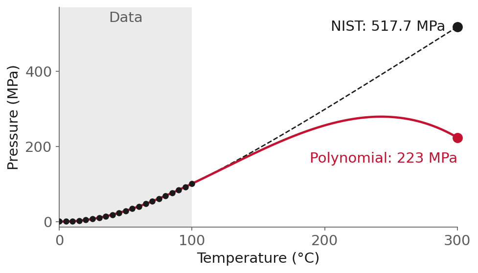<h4>What does it know?</h4><p><b>Only its data.</b></p><p class="ev">The polynomial scored R<sup>2</sup> = 0.9999975 on the water data, and gave 223 MPa at 300 &deg;C, where NIST gives 517.7.</p></div>
<div class="card">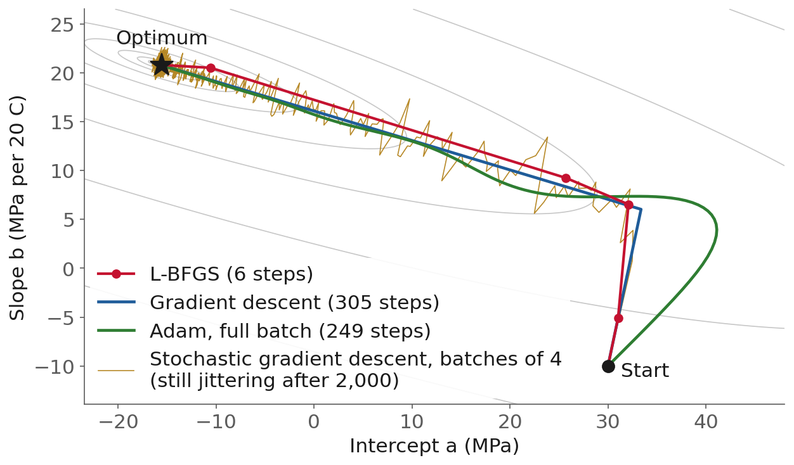<h4>What did training solve?</h4><p><b>An optimization problem, and the family picks it.</b></p><p class="ev">A line has one minimum and a network many; a GP tunes a few bounded hyperparameters.</p></div>
<div class="card">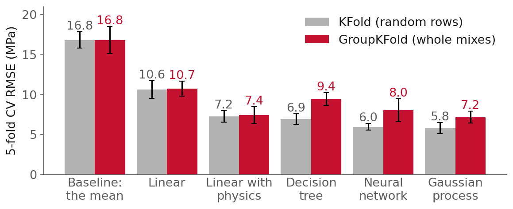<h4>What did the score measure?</h4><p><b>The question your split asked.</b></p><p class="ev">The tree beat the line on random folds and lost to it by 2 MPa on grouped folds.</p></div>
<div class="card">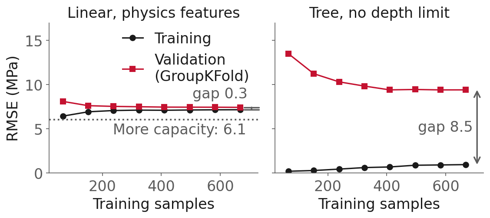<h4>What is holding it back?</h4><p><b>A gap is variance, a high level is bias.</b></p><p class="ev">The tree kept a gap of 8.5&nbsp;MPa. The line closed its gap but ended 1.4&nbsp;MPa above a model with more capacity.</p></div>
</div>

<p class="recap-close"><b>Start simple, and put what you know into the features:</b> a line with two physics features came within 0.3 MPa of a Gaussian process on grouped folds.</p>

<!--
Same four cards from the end of last time: what a model knows, what training solved, what
the score measured, what was holding it back. These apply to the classifier we build today
too, so I want them fresh before we start.
-->

---

## Model capacity

**Capacity** is the range of functions a model can represent. More capacity fits more complicated relationships, and more of the noise.

Every family from last time turns a different knob:

* Polynomial **degree**, for the line
* Tree **depth**
* The number of **hidden units**, for the network
* The ridge or lasso penalty **$\alpha$**
* A kernel's **length scale**, for the Gaussian process

<!--
Same five knobs as last time, named one at a time: degree, depth, hidden units, alpha,
length scale.
-->

---

## Model capacity, overfitting and underfitting

A model **overfits** when its training error is much lower than its validation error. It has learned the noise and the particular rows it was given. It **underfits** when both errors are high and close together, because it is too simple for the relationship.

The **bias-variance trade-off**: more capacity lowers bias and raises variance, so the validation error is lowest somewhere in between.

<span class="source"><a href="https://hastie.su.domains/ElemStatLearn/download.html">Hastie, Tibshirani and Friedman, section 7.3, eq. 7.9</a></span>

<!--
Overfit and underfit again, plus the bias-variance line underneath them, since I went past
this fast last time. A straight line on the concrete strength dataset is the high-bias end, an unlimited tree
the high-variance end.
-->

---

## Model capacity, validation curves

A **validation curve** plots training and validation error against one capacity knob, with the data held fixed.

<style scoped>section p, section ul { font-size: 0.86em; }</style>

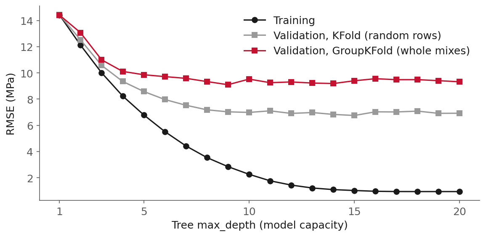

- Training error keeps falling as a tree gets deeper, and validation error stops improving past depth 9

<!--
One figure, one story: the black training curve keeps falling, the red validation curve
flattens past depth nine. Looking only at the training score is misleading.
-->

---

## Model capacity, learning curves

A **learning curve** plots training and validation error against training-set size, model fixed.

<style scoped>table { font-size: 0.55em; } table th, table td { padding: 2px 8px; } .cols-lc { grid-template-columns: 1.45fr 1fr; font-size: 0.66em; } .cols-lc p:has(> img:only-child) { margin: 0; } .cols-lc ul { margin: 0; }</style>

<div class="cols cols-lc">
<div>


</div>
<div>

- The **gap** between the curves, at the right edge, is **variance**
- The **level** where they meet is **bias**, plus noise
- A closing gap is good news: more data has already done its job
- The **level** tells underfitting from a good fit; the gap only tells you whether more data would help

</div>
</div>

| The curves show | Diagnosis | What helps | Here |
|---|---|---|---|
| Gap closed, error still high | Underfitting (high bias) | More capacity, better features | The line (left) |
| Gap closed, error low | A good fit | Stop, and test once | |
| Big gap: training low, validation much higher | Overfitting (high variance) | Less capacity, regularization | The tree (right) |
| Validation still falling at the right edge | Limited by data | More training samples | |

<!--
Gap is variance, level is bias. The line's gap closed but its level is still a bit high, so
it underfits. The tree's gap never closed. Same four rows as last time, reread slower.
-->

---

<!-- _class: section -->

# Classification

---

## Classification, what it is

<div class="definition">

**Classification** predicts a category, usually by first predicting a probability for each class.

</div>

* **Regression** (Lecture 9) predicts a **number**: a strength, a pressure
* **Classification** predicts a **category**: normal or faulty, pass or fail
* Most classifiers work in two steps: a **probability**, then a **threshold**

<div class="flow" data-marpit-fragment>
<div class="step">52 plant channels<br>at one moment</div>
<div class="arrow">&rarr;</div>
<div class="step">The model</div>
<div class="arrow">&rarr;</div>
<div class="step">A probability,<br><i>P</i>(fault)</div>
<div class="arrow">&rarr;</div>
<div class="step">The threshold:<br>is <i>P</i>(fault) &ge; 0.5?</div>
<div class="arrow">&rarr;</div>
<div class="step"><b>Fault</b> or <b>normal</b></div>
</div>

<!--
Same fit and predict as Lecture 9. What changes is the output: a probability first, then a
threshold turns it into a class.
-->

---

## Classification, the plant

<style scoped>
.plant-grid { display: grid; grid-template-columns: 1fr 1fr; gap: 0.15em 1.4em; font-size: 0.74em; margin: 0.1em 0 0.2em; }
.plant-grid p { margin: 0; }
section p.plant-lead { font-size: 0.8em; margin: 0 0 0.2em; }
section p.plant-note { font-size: 0.7em; text-align: center; margin: 0.1em 0 0; }
</style>

<p class="plant-lead">The Tennessee Eastman process (TEP), the simulated plant from Lecture 5 on. The question: <b>is the plant faulty right now?</b></p>

<div class="plant-grid">

**One sample**: one 3-minute snapshot of the plant

**Features**: the 52 channels at that moment

**Target**: normal (0) or faulty (1)

**Split** by whole run, as in Lectures 8 and 9

</div>

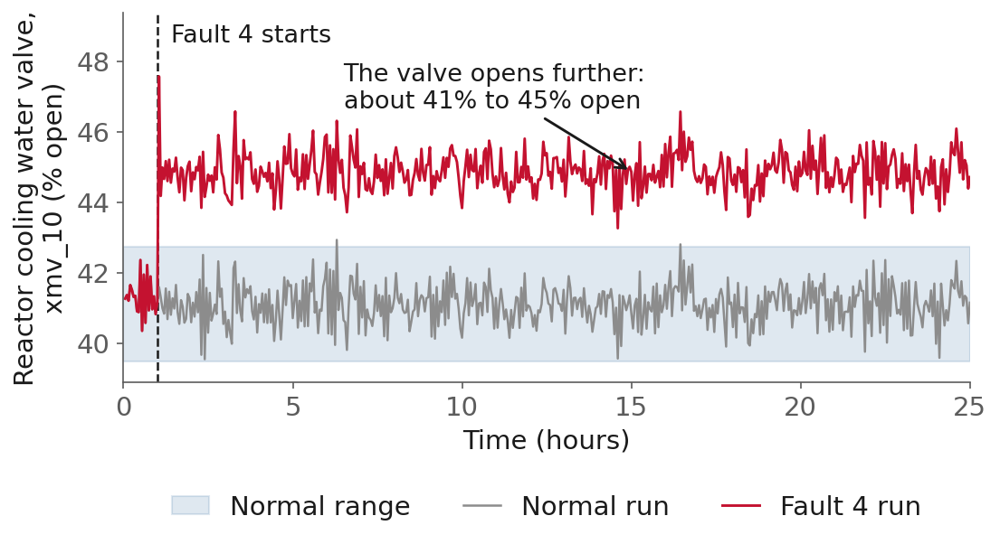

<p class="plant-note">Fault 4: the cooling water entering the reactor gets warmer, so the controller opens the cooling water valve, <code>xmv_10</code>, further.</p>

<!--
One channel and one fault first: the valve sits near 41% open in normal runs and near 45%
under fault 4. All 52 channels come in later, for the classifier we measure.
-->

---

## Classification, logistic regression

<div class="definition">

**Logistic regression** turns a weighted sum of the inputs into a probability between 0 and 1.

</div>

<style scoped>
/* copied from lectures/l09/slides.md's .opt-ann block (the "Training as optimization"
   slides); L10's deck does not define this yet, so it is scoped to this one slide rather
   than added globally. Three labels here, not four: two sit above the equation, pointing
   down into it, and one sits below, pointing up into the cutoff line. */
.opt-ann { position: relative; width: 1100px; height: 380px; margin: 0 auto; }
.opt-ann svg.opt-svg { position: absolute; left: 0; top: 0; }
.opt-ann ul { list-style: none; margin: 0; padding: 0; }
.opt-ann li { position: absolute; font-size: 20px; line-height: 1.3; background: #f7f7f7;
  border-left: 5px solid #5c5c5c; border-radius: 0 6px 6px 0; padding: 6px 12px; margin: 0; }
.opt-ann li:nth-child(1) { left: 700px; top: 0; width: 380px; border-color: #1f5c99; }
.opt-ann li:nth-child(2) { left: 0; top: 0; width: 380px; border-color: #b07d12; }
.opt-ann li:nth-child(3) { left: 520px; top: 306px; width: 560px; border-color: #2e7d32; }
.opt-ann .arr { opacity: 0; transition: opacity 0.3s; }
section:not(:has([data-bespoke-marp-fragment])) .opt-ann .arr { opacity: 1; }
section:has(.opt-ann li[data-marpit-fragment="1"][data-bespoke-marp-fragment="active"]) .opt-ann .arr1,
section:has(.opt-ann li[data-marpit-fragment="2"][data-bespoke-marp-fragment="active"]) .opt-ann .arr2,
section:has(.opt-ann li[data-marpit-fragment="3"][data-bespoke-marp-fragment="active"]) .opt-ann .arr3 { opacity: 1; }
</style>

<div class="opt-ann">

<svg class="opt-svg" viewBox="0 0 1100 380" width="1100" height="380">
<defs><marker id="logi-head" viewBox="0 0 10 10" refX="9" refY="5" markerWidth="8" markerHeight="8" orient="auto-start-reverse"><path d="M0,0 L10,5 L0,10 z" fill="#5c5c5c"/></marker></defs>
<g font-family="'Times New Roman', Times, serif" fill="#1a1a1a">
<text x="230" y="195" font-size="46"><tspan font-style="italic">p</tspan> =</text>
<text x="660" y="140" text-anchor="middle" font-size="40">1</text>
<line x1="460" y1="170" x2="860" y2="170" stroke="#1a1a1a" stroke-width="3"/>
<text x="660" y="228" text-anchor="middle" font-size="36">1 + <tspan font-style="italic">e</tspan><tspan font-size="24" dy="-15">&#8722;(<tspan font-style="italic">wx</tspan> + <tspan font-style="italic">b</tspan>)</tspan></text>
<text x="550" y="292" text-anchor="middle" font-size="30"><tspan font-style="italic">p</tspan> &#8805; 0.5 &#8594; fault<tspan dx="40"><tspan font-style="italic">p</tspan> &lt; 0.5 &#8594; normal</tspan></text>
</g>
<path class="arr arr1" d="M 760 64 C 745 110, 735 160, 728 195" fill="none" stroke="#1f5c99" stroke-width="3" marker-end="url(#logi-head)"/>
<path class="arr arr2" d="M 380 64 C 430 100, 470 125, 505 148" fill="none" stroke="#b07d12" stroke-width="3" marker-end="url(#logi-head)"/>
<path class="arr arr3" d="M 800 306 C 800 288, 800 268, 800 253" fill="none" stroke="#2e7d32" stroke-width="3" marker-end="url(#logi-head)"/>
</svg>

* **Weighted sum** $wx + b$: the valve opening $x$ (`xmv_10`) times a weight $w$ plus an offset $b$
* **The fraction** squashes any number into a probability between 0 and 1
* **Threshold at 0.5**: call it a fault when $p$ is at least 0.5, otherwise normal

</div>


<!--
Same weighted sum as linear regression. The fraction and the threshold are the new parts.
0.5 is only a starting choice; the threshold slider moves it later.
-->

---

## Classification, one cut on the valve

<style scoped>
.cols-lc { grid-template-columns: 1.35fr 1fr; }
.cols-lc p:has(> img:only-child) { margin: 0; }
</style>

<div class="cols cols-lc">
<div>

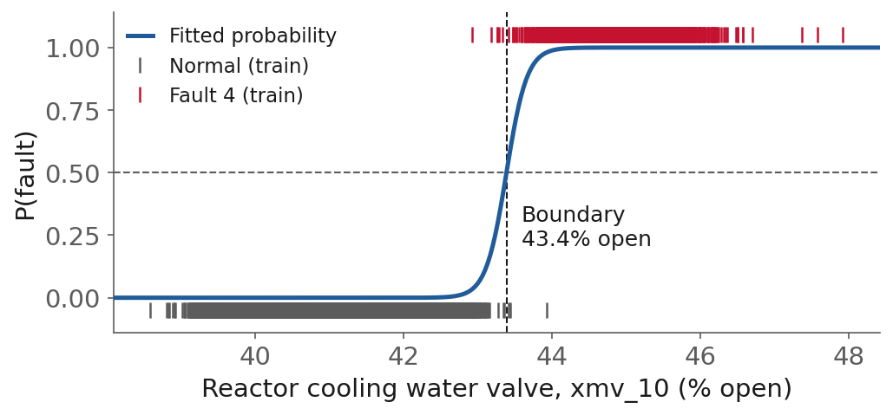

</div>
<div class="readbox">

* **Blue curve**: the fitted $p$ at each valve opening
* **Ticks**: training samples, normal at the bottom, fault 4 at the top
* **Training found** $w = 7.24$ and $b = -314.1$
* **Boundary**: $p = 0.5$ where $x = -b/w = 43.4\%$ open

</div>
</div>

<p class="takeaway" data-marpit-fragment>Below 43.4% open: normal. Above: fault 4. On 51,000 test samples, this one cut is wrong once.</p>

<!--
The boundary is where the weighted sum is zero, so x = -b/w. Normal runs average 41.1% open,
fault 4 runs 44.9%, and they barely overlap. The one mistake is a single false alarm.
-->

---

## Classification, fault 14

<p class="plant-lead"><b>Fault 14</b>: the same valve <b>sticks</b>. It swings far open and far closed, around the same average.</p>

<style scoped>
section p.plant-lead { font-size: 0.8em; margin: 0 0 0.2em; }
</style>

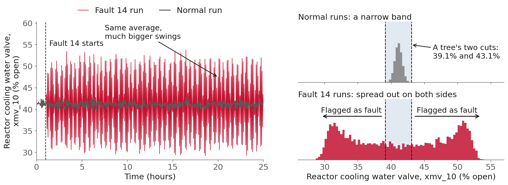

<div class="readbox" data-marpit-fragment>

The fault samples fall on **both sides** of the normal band. One straight cut cannot separate that: logistic regression catches **0%**. A tree's two cuts flag both sides and catch **88%**.

</div>

<!--
Left panel: same average, much bigger swings. Right panel: the normal samples sit in a narrow
band, the fault 14 samples spread from about 29% to 54%. A tree of depth 8 catches 99.7%.
-->

---

## Classification, four model families

<style scoped>
.card .katex-display { font-size: 1.25em; margin: 0.3em 0 0; }
</style>

<div class="cards">

<div class="card" data-marpit-fragment="1">

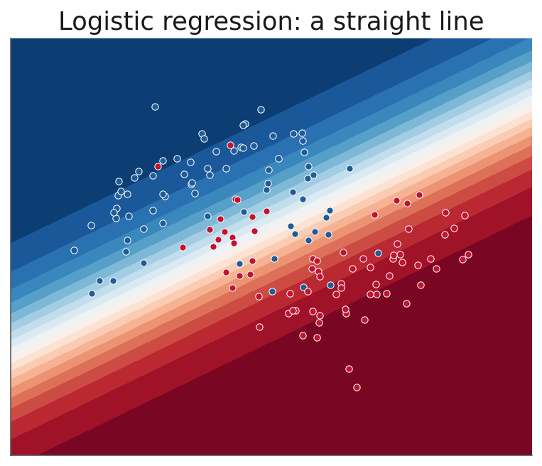

#### Logistic regression

Minimizes the log loss, also called cross-entropy: small when the true class gets a high probability.

$$-[\,y \log p + (1-y)\log(1-p)\,]$$

</div>

<div class="card" data-marpit-fragment="2">

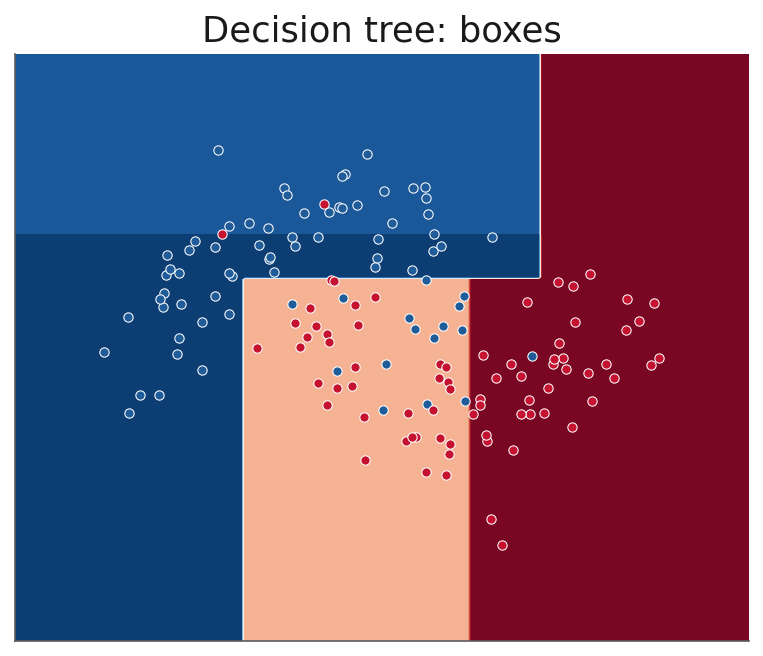

#### Decision tree

Splits to lower the Gini impurity of each box: zero when a box holds one class.

$$G = 1 - \sum_k p_k^2$$

</div>

<div class="card" data-marpit-fragment="3">

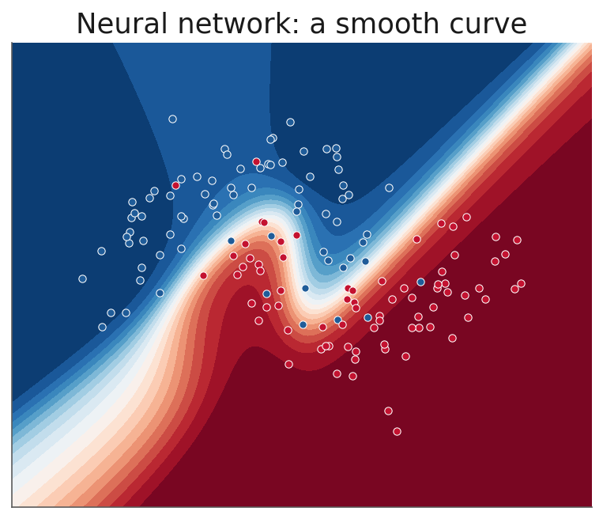

#### Neural network

A softmax turns its scores into probabilities; training minimizes the cross-entropy.

$$-\sum_j y_j \log p_j$$

</div>

<div class="card" data-marpit-fragment="4">

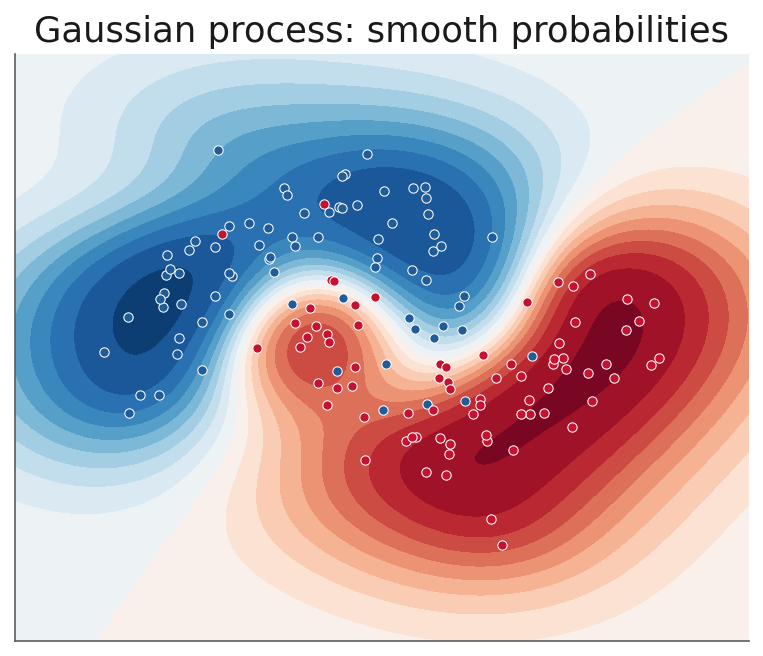

#### Gaussian process

A smooth random function $f(x)$ goes through a link $\sigma$. It also gives an uncertainty.

$$p = \sigma(f(x))$$

</div>

</div>

<!--
Same fit and predict for all four. The loss and the shape of the boundary change: a straight
line, boxes, a smooth curve, then smooth probabilities that fade away from the data.
-->

---

<!-- _class: section -->

# Measuring a classifier

---

## Measuring a classifier, accuracy

<style scoped>
.accbar { display: flex; width: 1000px; height: 86px; margin: 0.4em auto 0.3em; border-radius: 8px; overflow: hidden; font-size: 0.66em; line-height: 1.2; }
.accbar div { display: flex; align-items: center; justify-content: center; text-align: center; color: #1a1a1a; }
.accbar .acc-n { background: rgba(92, 92, 92, 0.22); }
.accbar .acc-f { background: rgba(196, 18, 48, 0.4); }
</style>

<div class="definition">

**Accuracy**: the fraction of predictions that are correct.

</div>

$$
\text{accuracy} = \frac{\text{correct predictions}}{\text{all predictions}}
$$

* A "detector" that always answers **normal**, on the 59,000 test samples:

<div class="accbar" data-marpit-fragment>
<div class="acc-n" style="width: 85.4%">85.4% of the samples are normal: the detector is right on all of them</div>
<div class="acc-f" style="width: 14.6%">14.6% faulty:<br>all missed</div>
</div>

* Accuracy **85.4%**, and it never catches a fault
* So count each **kind** of mistake separately

<!--
A plant runs normally most of the time, so answering "normal" is right most of the time.
Accuracy cannot tell this detector from a useful one.
-->

---

## Measuring a classifier, the confusion matrix

<div class="definition">

A **confusion matrix** counts, for every sample, what really happened against what the model said. Call a fault a **positive** and a normal sample a **negative**.

</div>

<style scoped>
.cm-wrap { display: grid; grid-template-columns: 600px 1fr; gap: 1.4em; align-items: center; margin-top: 0.3em; }
</style>

<div class="cm-wrap">

<svg viewBox="150 4 640 300" width="600" height="281">
<g font-family="Arial, Helvetica, sans-serif">

<g data-marpit-fragment="1">
<rect x="330" y="70" width="210" height="105" rx="6" fill="none" stroke="#999" stroke-width="2"/>
<rect x="554" y="70" width="210" height="105" rx="6" fill="none" stroke="#999" stroke-width="2"/>
<rect x="330" y="189" width="210" height="105" rx="6" fill="none" stroke="#999" stroke-width="2"/>
<rect x="554" y="189" width="210" height="105" rx="6" fill="none" stroke="#999" stroke-width="2"/>
<text x="435" y="26" text-anchor="middle" font-size="18" fill="#1a1a1a">What the model</text>
<text x="435" y="47" text-anchor="middle" font-size="18" fill="#1a1a1a">said: fault</text>
<text x="659" y="26" text-anchor="middle" font-size="18" fill="#1a1a1a">What the model</text>
<text x="659" y="47" text-anchor="middle" font-size="18" fill="#1a1a1a">said: normal</text>
<text x="316" y="115" text-anchor="end" font-size="18" fill="#1a1a1a">What really</text>
<text x="316" y="136" text-anchor="end" font-size="18" fill="#1a1a1a">happened: fault</text>
<text x="316" y="234" text-anchor="end" font-size="18" fill="#1a1a1a">What really</text>
<text x="316" y="255" text-anchor="end" font-size="18" fill="#1a1a1a">happened: normal</text>
</g>

<g data-marpit-fragment="2">
<rect x="330" y="70" width="210" height="105" rx="6" fill="#2e7d32" fill-opacity="0.5"/>
<text x="435" y="105" text-anchor="middle" font-size="17" font-weight="700" fill="#1a1a1a">True positive (TP)</text>
<text x="435" y="126" text-anchor="middle" font-size="15" fill="#1a1a1a">fault caught</text>
<text x="435" y="163" text-anchor="middle" font-size="27" fill="#1a1a1a">8,300</text>
</g>

<g data-marpit-fragment="3">
<rect x="554" y="70" width="210" height="105" rx="6" fill="#c41230" fill-opacity="0.5"/>
<text x="659" y="105" text-anchor="middle" font-size="17" font-weight="700" fill="#1a1a1a">False negative (FN)</text>
<text x="659" y="126" text-anchor="middle" font-size="15" fill="#1a1a1a">fault missed</text>
<text x="659" y="163" text-anchor="middle" font-size="27" fill="#1a1a1a">340</text>
</g>

<g data-marpit-fragment="4">
<rect x="330" y="189" width="210" height="105" rx="6" fill="#b07d12" fill-opacity="0.5"/>
<text x="435" y="224" text-anchor="middle" font-size="17" font-weight="700" fill="#1a1a1a">False positive (FP)</text>
<text x="435" y="245" text-anchor="middle" font-size="15" fill="#1a1a1a">false alarm</text>
<text x="435" y="282" text-anchor="middle" font-size="27" fill="#1a1a1a">13</text>
</g>

<g data-marpit-fragment="5">
<rect x="554" y="189" width="210" height="105" rx="6" fill="#1f5c99" fill-opacity="0.5"/>
<text x="659" y="224" text-anchor="middle" font-size="17" font-weight="700" fill="#1a1a1a">True negative (TN)</text>
<text x="659" y="245" text-anchor="middle" font-size="15" fill="#1a1a1a">left alone</text>
<text x="659" y="282" text-anchor="middle" font-size="27" fill="#1a1a1a">50,347</text>
</g>


</g>
</svg>

<div class="readbox">

- **Read across a row**: what really happened
- **Read down a column**: what the model said
- **The diagonal**, TP and TN: the model was right
- **Off the diagonal**, FN and FP: the two kinds of mistake

</div>

</div>

<!--
8,300 faults caught, 340 missed, and only 13 false alarms among 50,360 normal samples. Top
left and bottom right are right; the other two boxes are the two kinds of mistake.
-->

---

## Measuring a classifier, precision and recall

<style scoped>
section .katex-display { margin: 0.3em 0; }
section ul { font-size: 0.86em; }
</style>

<div class="definition">

**Precision**: the share of the model's alarms that were real faults. **Recall**: the share of the real faults that the model caught.

</div>

$$
\text{accuracy} = \frac{TP + TN}{TP + TN + FP + FN}
\qquad
\text{precision} = \frac{TP}{TP + FP}
\qquad
\text{recall} = \frac{TP}{TP + FN}
$$

* **Why two numbers**: an alarm you cannot trust (low precision) and a fault you miss (low recall) cost different things
* The network: of its **8,313** alarms, **8,300** were real faults, so precision is **0.998**
* Of the **8,640** real faults, it caught **8,300**, so recall is **0.961**

<!--
Precision: when it raises an alarm, can I trust it? Recall: of the real faults, how many did
it catch? Both numbers come from the same four boxes.
-->

---

## Measuring a classifier, four classifiers

| Classifier, on the 59,000 test samples | Accuracy | Precision | Recall |
|---|---|---|---|
| Always normal | 0.854 | 0 | 0 |
| Logistic regression, 52 channels | 0.970 | 0.993 | 0.803 |
| Decision tree, 52 channels | 0.977 | 0.988 | 0.855 |
| Neural network, 52 channels | 0.994 | 0.998 | 0.961 |

* **Always normal** never predicts a fault, so TP = 0 and recall is 0
* It raises no alarm at all, so precision is 0/0, which scikit-learn reports as 0
* Accuracy barely separates the last three rows. **Recall does.**

<!--
The baseline is the "always normal" detector from the accuracy slide. Logistic regression
misses one fault sample in five; the network misses one in twenty-five.
-->

---

## Measuring a classifier, the threshold

<p class="thr-note"><code>predict(X)</code> gives the class, with a threshold of 0.5. <code>predict_proba(X)</code> gives the probability, so you choose the threshold.</p>

<style scoped>
/* prefixed to this slide only, in the L9 widget conventions (reg-widget, optw-widget):
   an IIFE with a dataset.ready guard, a unique id prefix, sliders styled the same way. */
.thr-widget { font-size: 21px; }
.thr-controls { display: flex; gap: 1em; align-items: center; justify-content: center; margin: 0 0 0.1em; }
.thr-controls input[type=range] { width: 380px; accent-color: #c41230; }
.thr-controls button { font: inherit; font-size: 19px; min-width: 5.2em; padding: 0.1em 0.6em;
  color: #c41230; background: #fff; border: 2px solid #c41230; border-radius: 6px; cursor: pointer; }
.thr-t { min-width: 5em; color: #1a1a1a; font-variant-numeric: tabular-nums; }
.thr-widget svg { display: block; margin: 0 auto; }
.thr-readout { text-align: center; color: #5c5c5c; margin-top: 0.15em; }
section p.thr-note { font-size: 0.72em; margin: 0.1em 0 0.25em; text-align: center; }
</style>

<div class="thr-widget">
<div class="thr-controls">
<span>Threshold on <i>P</i>(fault)</span>
<input type="range" id="thr-slider" min="1" max="99" step="1" value="50">
<span class="thr-t" id="thr-t">t = 0.50</span>
<button type="button" id="thr-play">Play</button>
</div>
<svg id="thr-svg" viewBox="0 0 1100 335" width="990" height="301"></svg>
<div class="thr-readout" id="thr-readout"></div>
</div>

<script>
(() => {
  const svg = document.getElementById("thr-svg");
  if (!svg || svg.dataset.ready) return;
  svg.dataset.ready = "1";
  // Printed by lectures/l10/figures/make_figures.py, group "widgets": the TEP threshold
  // sweep on the 52-channel classifier, 59,000 held-out test rows, 14.6% faulty (8,640
  // faulty, 50,360 normal), t = 0.01 .. 0.99 in steps of 0.01. Precision and recall are the
  // printed values, not recomputed here, so the readout always matches the run log exactly.
  const THR = [0.01, 0.02, 0.03, 0.04, 0.05, 0.06, 0.07, 0.08, 0.09, 0.1, 0.11, 0.12, 0.13, 0.14, 0.15, 0.16, 0.17, 0.18, 0.19, 0.2, 0.21, 0.22, 0.23, 0.24, 0.25, 0.26, 0.27, 0.28, 0.29, 0.3, 0.31, 0.32, 0.33, 0.34, 0.35, 0.36, 0.37, 0.38, 0.39, 0.4, 0.41, 0.42, 0.43, 0.44, 0.45, 0.46, 0.47, 0.48, 0.49, 0.5, 0.51, 0.52, 0.53, 0.54, 0.55, 0.56, 0.57, 0.58, 0.59, 0.6, 0.61, 0.62, 0.63, 0.64, 0.65, 0.66, 0.67, 0.68, 0.69, 0.7, 0.71, 0.72, 0.73, 0.74, 0.75, 0.76, 0.77, 0.78, 0.79, 0.8, 0.81, 0.82, 0.83, 0.84, 0.85, 0.86, 0.87, 0.88, 0.89, 0.9, 0.91, 0.92, 0.93, 0.94, 0.95, 0.96, 0.97, 0.98, 0.99];
  const TP = [8438, 8417, 8407, 8399, 8390, 8386, 8380, 8377, 8375, 8368, 8366, 8363, 8361, 8360, 8357, 8355, 8355, 8352, 8348, 8341, 8341, 8341, 8338, 8336, 8334, 8331, 8331, 8330, 8330, 8329, 8328, 8328, 8325, 8319, 8318, 8318, 8318, 8314, 8313, 8312, 8309, 8307, 8307, 8305, 8305, 8305, 8303, 8303, 8303, 8300, 8298, 8298, 8297, 8294, 8293, 8291, 8291, 8289, 8289, 8286, 8284, 8283, 8280, 8277, 8273, 8270, 8268, 8268, 8267, 8264, 8263, 8259, 8252, 8248, 8246, 8243, 8239, 8235, 8233, 8226, 8223, 8218, 8211, 8208, 8206, 8201, 8195, 8190, 8185, 8176, 8168, 8156, 8143, 8137, 8121, 8092, 8066, 8011, 7917];
  const FP = [3664, 1914, 1254, 894, 680, 557, 436, 365, 308, 265, 228, 197, 173, 159, 141, 130, 119, 107, 97, 86, 80, 75, 72, 66, 63, 59, 56, 52, 45, 44, 41, 39, 36, 31, 29, 26, 25, 23, 20, 20, 20, 17, 15, 15, 15, 14, 14, 13, 13, 13, 13, 11, 11, 10, 8, 8, 8, 7, 5, 5, 4, 4, 4, 4, 4, 4, 2, 2, 2, 1, 1, 1, 0, 0, 0, 0, 0, 0, 0, 0, 0, 0, 0, 0, 0, 0, 0, 0, 0, 0, 0, 0, 0, 0, 0, 0, 0, 0, 0];
  const FN = [202, 223, 233, 241, 250, 254, 260, 263, 265, 272, 274, 277, 279, 280, 283, 285, 285, 288, 292, 299, 299, 299, 302, 304, 306, 309, 309, 310, 310, 311, 312, 312, 315, 321, 322, 322, 322, 326, 327, 328, 331, 333, 333, 335, 335, 335, 337, 337, 337, 340, 342, 342, 343, 346, 347, 349, 349, 351, 351, 354, 356, 357, 360, 363, 367, 370, 372, 372, 373, 376, 377, 381, 388, 392, 394, 397, 401, 405, 407, 414, 417, 422, 429, 432, 434, 439, 445, 450, 455, 464, 472, 484, 497, 503, 519, 548, 574, 629, 723];
  const TN = [46696, 48446, 49106, 49466, 49680, 49803, 49924, 49995, 50052, 50095, 50132, 50163, 50187, 50201, 50219, 50230, 50241, 50253, 50263, 50274, 50280, 50285, 50288, 50294, 50297, 50301, 50304, 50308, 50315, 50316, 50319, 50321, 50324, 50329, 50331, 50334, 50335, 50337, 50340, 50340, 50340, 50343, 50345, 50345, 50345, 50346, 50346, 50347, 50347, 50347, 50347, 50349, 50349, 50350, 50352, 50352, 50352, 50353, 50355, 50355, 50356, 50356, 50356, 50356, 50356, 50356, 50358, 50358, 50358, 50359, 50359, 50359, 50360, 50360, 50360, 50360, 50360, 50360, 50360, 50360, 50360, 50360, 50360, 50360, 50360, 50360, 50360, 50360, 50360, 50360, 50360, 50360, 50360, 50360, 50360, 50360, 50360, 50360, 50360];
  const PREC = [0.697, 0.815, 0.87, 0.904, 0.925, 0.938, 0.951, 0.958, 0.965, 0.969, 0.973, 0.977, 0.98, 0.981, 0.983, 0.985, 0.986, 0.987, 0.989, 0.99, 0.99, 0.991, 0.991, 0.992, 0.992, 0.993, 0.993, 0.994, 0.995, 0.995, 0.995, 0.995, 0.996, 0.996, 0.997, 0.997, 0.997, 0.997, 0.998, 0.998, 0.998, 0.998, 0.998, 0.998, 0.998, 0.998, 0.998, 0.998, 0.998, 0.998, 0.998, 0.999, 0.999, 0.999, 0.999, 0.999, 0.999, 0.999, 0.999, 0.999, 1.0, 1.0, 1.0, 1.0, 1.0, 1.0, 1.0, 1.0, 1.0, 1.0, 1.0, 1.0, 1.0, 1.0, 1.0, 1.0, 1.0, 1.0, 1.0, 1.0, 1.0, 1.0, 1.0, 1.0, 1.0, 1.0, 1.0, 1.0, 1.0, 1.0, 1.0, 1.0, 1.0, 1.0, 1.0, 1.0, 1.0, 1.0, 1.0];
  const REC = [0.977, 0.974, 0.973, 0.972, 0.971, 0.971, 0.97, 0.97, 0.969, 0.969, 0.968, 0.968, 0.968, 0.968, 0.967, 0.967, 0.967, 0.967, 0.966, 0.965, 0.965, 0.965, 0.965, 0.965, 0.965, 0.964, 0.964, 0.964, 0.964, 0.964, 0.964, 0.964, 0.964, 0.963, 0.963, 0.963, 0.963, 0.962, 0.962, 0.962, 0.962, 0.961, 0.961, 0.961, 0.961, 0.961, 0.961, 0.961, 0.961, 0.961, 0.96, 0.96, 0.96, 0.96, 0.96, 0.96, 0.96, 0.959, 0.959, 0.959, 0.959, 0.959, 0.958, 0.958, 0.958, 0.957, 0.957, 0.957, 0.957, 0.956, 0.956, 0.956, 0.955, 0.955, 0.954, 0.954, 0.954, 0.953, 0.953, 0.952, 0.952, 0.951, 0.95, 0.95, 0.95, 0.949, 0.948, 0.948, 0.947, 0.946, 0.945, 0.944, 0.942, 0.942, 0.94, 0.937, 0.934, 0.927, 0.916];

  const NS = "http://www.w3.org/2000/svg";
  const el = (tag, attrs, text) => {
    const e = document.createElementNS(NS, tag);
    for (const k in attrs) e.setAttribute(k, attrs[k]);
    if (text !== undefined) e.textContent = text;
    return e;
  };
  const add = (tag, attrs, text, parent = svg) => parent.appendChild(el(tag, attrs, text));
  const fmt = n => n.toLocaleString("en-US");

  // ---- the confusion matrix, TP top-left / FN top-right / FP bottom-left / TN bottom-right,
  // widened to CW=225 (from 195) so a spelled-out name plus its acronym fits on one line ----
  const GX = 120, GY = 50, CW = 225, CH = 112, GAP = 10;
  const COL = { tp: "#2e7d32", fn: "#c41230", fp: "#b07d12", tn: "#1f5c99" };
  const cellPos = { tp: [GX, GY], fn: [GX + CW + GAP, GY], fp: [GX, GY + CH + GAP], tn: [GX + CW + GAP, GY + CH + GAP] };
  add("text", { x: GX + CW / 2, y: GY - 34, "text-anchor": "middle", "font-size": 19, fill: "#1a1a1a" }, "Predicted faulty");
  add("text", { x: GX + CW + GAP + CW / 2, y: GY - 34, "text-anchor": "middle", "font-size": 19, fill: "#1a1a1a" }, "Predicted normal");
  [["Actually", "faulty", GY + CH / 2], ["Actually", "normal", GY + CH + GAP + CH / 2]].forEach(([a, b, y]) => {
    add("text", { x: GX - 14, y: y - 8, "text-anchor": "end", "font-size": 19, fill: "#1a1a1a" }, a);
    add("text", { x: GX - 14, y: y + 14, "text-anchor": "end", "font-size": 19, fill: "#1a1a1a" }, b);
  });
  const cells = {};
  [["tp", "True positive (TP)", "fault caught"], ["fn", "False negative (FN)", "fault missed"],
   ["fp", "False positive (FP)", "false alarm"], ["tn", "True negative (TN)", "left alone"]].forEach(([k, l1, l2]) => {
    const [x, y] = cellPos[k];
    const rect = add("rect", { x, y, width: CW, height: CH, rx: 6, fill: COL[k], "fill-opacity": 0.5 });
    add("text", { x: x + CW / 2, y: y + 30, "text-anchor": "middle", "font-size": 18, "font-weight": 700, fill: "#1a1a1a" }, l1);
    add("text", { x: x + CW / 2, y: y + 52, "text-anchor": "middle", "font-size": 18, "font-weight": 700, fill: "#1a1a1a" }, l2);
    const num = add("text", { x: x + CW / 2, y: y + 96, "text-anchor": "middle", "font-size": 30, fill: "#1a1a1a" }, "0");
    cells[k] = { rect, num };
  });
  const OWN_MAX = { tp: Math.max(...TP), fn: Math.max(...FN), fp: Math.max(...FP), tn: Math.max(...TN) };
  const VALS = { tp: TP, fn: FN, fp: FP, tn: TN };

  // ---- the precision-recall curve (right), from the same table ----
  const P = { x0: 660, x1: 1080, y0: 20, y1: 284, xa: 0.905, xb: 0.985, ya: 0.65, yb: 1.03 };
  const sx = v => P.x0 + (v - P.xa) / (P.xb - P.xa) * (P.x1 - P.x0);
  const sy = v => P.y1 - (v - P.ya) / (P.yb - P.ya) * (P.y1 - P.y0);
  add("rect", { x: P.x0, y: P.y0, width: P.x1 - P.x0, height: P.y1 - P.y0, fill: "none", stroke: "#bbb" });
  [0.92, 0.94, 0.96, 0.98].forEach(v => {
    add("line", { x1: sx(v), x2: sx(v), y1: P.y1, y2: P.y1 + 6, stroke: "#5c5c5c" });
    add("text", { x: sx(v), y: P.y1 + 22, "text-anchor": "middle", "font-size": 17, fill: "#5c5c5c" }, v.toFixed(2));
  });
  [0.7, 0.8, 0.9, 1.0].forEach(v => {
    add("line", { x1: P.x0 - 6, x2: P.x0, y1: sy(v), y2: sy(v), stroke: "#5c5c5c" });
    add("text", { x: P.x0 - 10, y: sy(v) + 6, "text-anchor": "end", "font-size": 17, fill: "#5c5c5c" }, v.toFixed(1));
  });
  add("text", { x: (P.x0 + P.x1) / 2, y: P.y1 + 46, "text-anchor": "middle", "font-size": 19, fill: "#1a1a1a" }, "Recall");
  add("text", { x: P.x0 - 46, y: (P.y0 + P.y1) / 2, "text-anchor": "middle", "font-size": 19, fill: "#1a1a1a",
    transform: `rotate(-90 ${P.x0 - 46} ${(P.y0 + P.y1) / 2})` }, "Precision");
  const curvePts = REC.map((r, i) => `${sx(r).toFixed(1)},${sy(PREC[i]).toFixed(1)}`).join(" ");
  add("polyline", { points: curvePts, fill: "none", stroke: "#9a9a9a", "stroke-width": 2 });
  const dot = add("circle", { r: 7, fill: "#1a1a1a", stroke: "#fff", "stroke-width": 2 });

  // ---- controls ----
  const slider = document.getElementById("thr-slider");
  const btn = document.getElementById("thr-play");
  const tLabel = document.getElementById("thr-t");
  const readout = document.getElementById("thr-readout");
  const draw = () => {
    const i = parseInt(slider.value, 10) - 1;
    for (const k of ["tp", "fn", "fp", "tn"]) {
      const v = VALS[k][i];
      cells[k].rect.setAttribute("fill-opacity", (0.15 + 0.7 * v / OWN_MAX[k]).toFixed(3));
      cells[k].num.textContent = fmt(v);
    }
    dot.setAttribute("cx", sx(REC[i]));
    dot.setAttribute("cy", sy(PREC[i]));
    tLabel.textContent = `t = ${THR[i].toFixed(2)}`;
    readout.textContent = `Precision ${PREC[i].toFixed(3)}, recall ${REC[i].toFixed(3)}`;
  };

  // pos is the continuous position; slider.value is only its rounded display twin. Advancing
  // the slider's own (integer) value by a fraction each frame and reading it back would round
  // away anything under 0.5 every time, so the slider would never move at all.
  let pos = parseFloat(slider.value), playing = false, dir = 1, last = null, raf = 0;
  const setPlaying = on => {
    playing = on;
    btn.textContent = on ? "Pause" : "Play";
    cancelAnimationFrame(raf);
    if (on) { pos = parseFloat(slider.value); last = null; raf = requestAnimationFrame(tick); }
  };
  const tick = t => {
    if (!playing) return;
    // the presentation template changes slides without firing hashchange, so check visibility
    if (svg.checkVisibility && !svg.checkVisibility()) { setPlaying(false); return; }
    if (last !== null) {
      pos += dir * 14 * Math.min(t - last, 100) / 1000;
      if (pos >= 99) { pos = 99; dir = -1; } else if (pos <= 1) { pos = 1; dir = 1; }
      slider.value = Math.round(pos);
      draw();
    }
    last = t;
    raf = requestAnimationFrame(tick);
  };
  // blur after the click: a focused button or slider keeps the arrow keys from the deck
  btn.addEventListener("click", () => { setPlaying(!playing); btn.blur(); });
  slider.addEventListener("keydown", e => e.stopPropagation());
  slider.addEventListener("input", () => { setPlaying(false); draw(); });
  slider.addEventListener("change", () => slider.blur());
  window.addEventListener("hashchange", () => setPlaying(false));
  draw();
})();
</script>

<p class="thr-note">The slider moves only the threshold. The classifier and the 59,000 test samples stay the same.</p>

<!--
At 0.01, 8,438 of the 8,640 faults are caught, with 3,664 false alarms. At 0.99 there are no
false alarms, and 7,917 are caught. Recall moves little and precision a lot, because this
classifier already separates the two classes well.
-->

---

## Measuring a classifier, faults it never saw

<style scoped>
.cols-lc { grid-template-columns: 1.5fr 1fr; }
.cols-lc p:has(> img:only-child) { margin: 0; }
</style>

<div class="cols cols-lc">
<div>

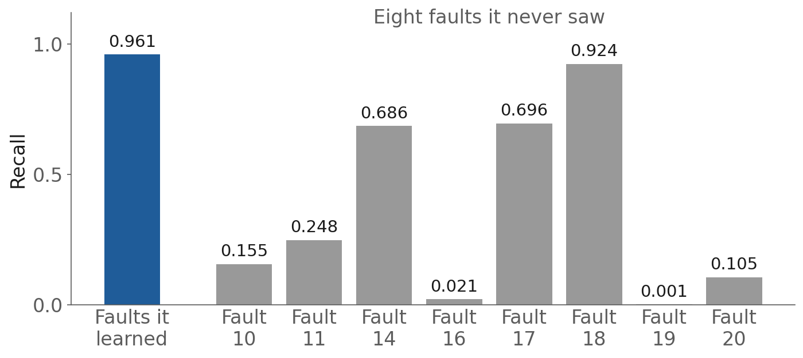

</div>
<div class="readbox">

* The network trained on **nine** faults, and meets **eight new** ones here
* Each bar: the share of that fault's samples it flagged, its recall
* **Fault 18**: 92% caught
* **Fault 19**: 0.1% caught, it passes as normal

</div>
</div>

<p class="takeaway" data-marpit-fragment>A classifier only knows the faults it was shown.</p>

<!--
The blue bar is the nine faults it trained on, 0.961. Nothing in the classifier says in advance
which new faults it will catch.
-->

---

<!-- _class: section -->

# Tracking and search

---

## Tracking and search, back to Lecture 9

Lecture 9 picked the tree's depth by eye. Its RMSE (root mean squared error) over grouped folds: **9.42 MPa** with no depth limit, **9.10 MPa** at depth 9.

$$
\begin{aligned}
\min_{\lambda} \quad & L_{\text{val}}\big(\theta^*(\lambda)\big) \\
\text{s.t.} \quad & \theta^*(\lambda) = \arg\min_{\theta} \; L_{\text{train}}(\theta; \lambda)
\end{aligned}
$$

* $\lambda$: the **hyperparameters**, such as the tree depth and the minimum leaf size
* $\theta$: the model's **parameters**, the tree's splits, found by training
* Every evaluation of the outer problem trains a model: a search needs many, and a record of each

<!--
Choosing hyperparameters is an optimization problem with training inside it. The outer
problem is what a search solves.
-->

---

## Tracking and search, Optuna and MLflow

<style>
.oi-wrap { display: flex; gap: 1.8em; align-items: flex-start; justify-content: center; margin: 0.2em 0 0; font-size: 21px; }
.oi-logo { flex: 0 0 auto; text-align: center; padding-top: 0.3em; }
.oi-logo img { width: 190px; display: block; margin: 0 auto; }
.oi-links { margin-top: 0.4em; font-size: 0.86em; line-height: 1.4; }
.oi-text { flex: 1 1 auto; max-width: 720px; }
.oi-text .definition { padding: 0.35em 0.7em; margin: 0.2em 0 0.4em; }
.oi-text .definition p { line-height: 1.3; }
.oi-flow { display: flex; align-items: stretch; gap: 0.4em; margin: 0.35em 0 0.3em; }
.oi-flow .step { flex: 1; text-align: center; background: #f7f7f7; border: 2px solid #5c5c5c; border-radius: 8px; padding: 0.3em 0.4em; line-height: 1.25; }
.oi-flow .arrow { flex: 0 0 auto; font-size: 1.2em; color: #5c5c5c; align-self: center; }
</style>

<div class="oi-wrap">
<div class="oi-logo">


<div class="oi-links">
<a href="https://optuna.org">optuna.org</a><br>
<a href="https://optuna.readthedocs.io">optuna.readthedocs.io</a>
</div>

</div>
<div class="oi-text">

<div class="definition">

**Optuna**: an open source Python library that searches hyperparameters for you.

</div>

You write an **objective function**; Optuna proposes the trials and keeps the best. **MLflow**, from Lectures 1 and 2, records runs. A search uses both:

<div class="oi-flow">
<div class="step">You write an <b>objective function</b></div>
<div class="arrow">&rarr;</div>
<div class="step"><b>Optuna proposes</b> a trial, runs it</div>
<div class="arrow">&rarr;</div>
<div class="step"><b>MLflow records</b> it as a run</div>
</div>

Every trial stays on record, and the best model is registered.

</div>
</div>

<!--
Two jobs: Optuna decides what to try next, MLflow writes down what happened.
-->

---

## Tracking and search, grid versus random

<p class="grs-note">Two hyperparameters and nine trials for each search. Only the horizontal one changes the score.</p>

<style>
/* grid versus random search: nine trials each, same budget, Bergstra and Bengio's picture,
   now with the fabricated validation-score curve drawn in and labeled on the slide itself */
.grs-widget { font-size: 20px; }
.grs-controls { display: flex; gap: 0.9em; align-items: center; justify-content: center; margin: 0 0 0.1em; }
.grs-controls input[type=range] { width: 300px; accent-color: #c41230; }
.grs-controls button { font: inherit; font-size: 19px; min-width: 5.4em; padding: 0.1em 0.6em; color: #c41230; background: #fff; border: 2px solid #c41230; border-radius: 6px; cursor: pointer; }
.grs-n { min-width: 9em; color: #1a1a1a; font-variant-numeric: tabular-nums; }
.grs-readout { text-align: center; color: #5c5c5c; margin-top: 0.1em; font-size: 0.86em; }
.grs-widget svg { display: block; margin: 0 auto; }
section p.grs-note { font-size: 0.72em; margin: 0.1em 0; text-align: center; }
</style>
<div class="grs-widget">
<div class="grs-controls">
<button type="button" id="grs-play">Play</button>
<input type="range" id="grs-n" min="0" max="9" step="1" value="0">
<span class="grs-n" id="grs-nlabel">0 of 9 trials</span>
</div>
<svg id="grs-svg" viewBox="0 0 1120 300" width="1120" height="300"></svg>
<div class="grs-readout" id="grs-readout"></div>
</div>

<script>
(() => {
  const svg = document.getElementById("grs-svg");
  if (!svg || svg.dataset.ready) return;
  svg.dataset.ready = "1";
  // A 3x3 grid against nine random draws in the unit square, same budget of nine trials,
  // plus the fabricated validation-score curve over the important parameter alone.
  // Printed by lectures/l10/figures/make_figures.py, group "widgets".
  const GRID_X = [0.1, 0.5, 0.9, 0.1, 0.5, 0.9, 0.1, 0.5, 0.9];
  const GRID_Y = [0.1, 0.1, 0.1, 0.5, 0.5, 0.5, 0.9, 0.9, 0.9];
  const RAND_X = [0.6233, 0.2928, 0.0869, 0.0649, 0.7819, 0.8715, 0.596, 0.7065, 0.5393];
  const RAND_Y = [0.8916, 0.7843, 0.0525, 0.8217, 0.0802, 0.7067, 0.2081, 0.8269, 0.5373];
  const SCORE_PEAK = 0.7, SCORE_WIDTH = 0.12, SCORE_AMP = 0.35, SCORE_BASE = 0.55;
  const hpScore = x => SCORE_BASE + SCORE_AMP * Math.exp(-((x - SCORE_PEAK) ** 2) / (2 * SCORE_WIDTH ** 2));
  const SCORE_CURVE_X = Array.from({length: 101}, (_, i) => i / 100);
  const SCORE_CURVE_Y = SCORE_CURVE_X.map(hpScore);
  const BLUE = "#1f5c99", GOLD = "#b07d12", MUTED = "#5c5c5c", INK = "#1a1a1a";
  const NS = "http://www.w3.org/2000/svg";
  const el = (tag, attrs, text) => {
    const e = document.createElementNS(NS, tag);
    for (const k in attrs) e.setAttribute(k, attrs[k]);
    if (text !== undefined) e.textContent = text;
    return e;
  };
  const layer = el("g", {transform: "translate(0, 14)"});
  svg.appendChild(layer);
  const add = (tag, attrs, text) => layer.appendChild(el(tag, attrs, text));

  // top row: each strategy's nine trials in the plane of both hyperparameters
  const G = {x0: 60, x1: 300, y0: 10, y1: 95}, R = {x0: 800, x1: 1040, y0: 10, y1: 95};
  const sxTop = (P, v) => P.x0 + v * (P.x1 - P.x0), syTop = (P, v) => P.y1 - v * (P.y1 - P.y0);
  const panel = (P, title, color) => {
    add("rect", {x: P.x0, y: P.y0, width: P.x1 - P.x0, height: P.y1 - P.y0, fill: "none", stroke: "#bbb"});
    add("text", {x: (P.x0 + P.x1) / 2, y: P.y0 - 8, "text-anchor": "middle", "font-size": 19, "font-weight": 700, fill: color}, title);
    add("line", {x1: P.x0, x2: P.x1, y1: P.y1 + 10, y2: P.y1 + 10, stroke: "#bbb"});
    add("text", {x: (P.x0 + P.x1) / 2, y: P.y1 + 26, "text-anchor": "middle", "font-size": 18, fill: MUTED}, "Important hyperparameter");
  };
  panel(G, "Grid search", BLUE);
  panel(R, "Random search", GOLD);
  add("text", {x: G.x0 - 18, y: (G.y0 + G.y1) / 2, "text-anchor": "middle", "font-size": 18, fill: MUTED,
    transform: `rotate(-90 ${G.x0 - 18} ${(G.y0 + G.y1) / 2})`}, "Unimportant");
  const topDots = (P, xs, ys, color) => xs.map((x, i) => add("circle",
    {cx: sxTop(P, x), cy: syTop(P, ys[i]), r: 7, fill: color, visibility: "hidden"}));
  const gridTop = topDots(G, GRID_X, GRID_Y, BLUE);
  const randTop = topDots(R, RAND_X, RAND_Y, GOLD);

  // bottom: one shared score curve, both strategies' tried points on it, revealed together
  const C = {x0: 150, x1: 1030, y0: 162, y1: 227};
  const sx = v => C.x0 + v * (C.x1 - C.x0), sy = v => C.y1 - (v - 0.5) / 0.45 * (C.y1 - C.y0);
  add("rect", {x: C.x0, y: C.y0, width: C.x1 - C.x0, height: C.y1 - C.y0, fill: "none", stroke: "#bbb"});
  add("text", {x: (C.x0 + C.x1) / 2, y: C.y1 + 36, "text-anchor": "middle", "font-size": 18, fill: MUTED},
    "Important hyperparameter");
  add("text", {x: (C.x0 + C.x1) / 2, y: C.y0 - 8, "text-anchor": "middle", "font-size": 18, "font-weight": 700, fill: INK},
    "Validation score (higher is better): made up for the picture");
  add("polyline", {points: SCORE_CURVE_X.map((x, i) => `${sx(x)},${sy(SCORE_CURVE_Y[i])}`).join(" "),
    fill: "none", stroke: MUTED, "stroke-width": 3});
  // "Best setting": the true peak of the curve, marked once, independent of what either search tried
  const peakX = sx(SCORE_PEAK), peakY = sy(hpScore(SCORE_PEAK));
  add("line", {x1: peakX, x2: peakX, y1: peakY, y2: C.y1, stroke: GOLD, "stroke-width": 2, "stroke-dasharray": "5 4"});
  add("text", {x: peakX + 12, y: (peakY + C.y1) / 2 + 6, "font-size": 18, "font-weight": 700, fill: GOLD},
    "Best setting");
  const tickY0 = C.y1 + 4, tickY1 = C.y1 + 14;
  const ticks = (xs, color) => xs.map(x => add("line",
    {x1: sx(x), x2: sx(x), y1: tickY0, y2: tickY1, stroke: color, "stroke-width": 3, visibility: "hidden"}));
  const gridTicks = ticks(GRID_X, BLUE), randTicks = ticks(RAND_X, GOLD);
  const dotsOnCurve = (xs, color) => xs.map(x => add("circle",
    {cx: sx(x), cy: sy(hpScore(x)), r: 6, fill: color, "fill-opacity": 0.75, visibility: "hidden"}));
  const gridDots = dotsOnCurve(GRID_X, BLUE), randDots = dotsOnCurve(RAND_X, GOLD);
  const gridBest = add("circle", {r: 12, fill: "none", stroke: BLUE, "stroke-width": 3, visibility: "hidden"});
  const randBest = add("circle", {r: 12, fill: "none", stroke: GOLD, "stroke-width": 3, visibility: "hidden"});

  const slider = document.getElementById("grs-n");
  const nlabel = document.getElementById("grs-nlabel");
  const readout = document.getElementById("grs-readout");
  const bestOf = (xs, n) => {
    let bi = 0;
    for (let i = 1; i < n; i++) if (hpScore(xs[i]) > hpScore(xs[bi])) bi = i;
    return bi;
  };
  const draw = () => {
    const n = +slider.value;
    [gridTop, randTop, gridTicks, randTicks, gridDots, randDots].forEach(list =>
      list.forEach((el, i) => el.setAttribute("visibility", i < n ? "visible" : "hidden")));
    nlabel.textContent = `${n} of 9 trials`;
    if (n === 0) {
      gridBest.setAttribute("visibility", "hidden");
      randBest.setAttribute("visibility", "hidden");
      readout.textContent = "No trials run yet.";
      return;
    }
    const gi = bestOf(GRID_X, n), ri = bestOf(RAND_X, n);
    gridBest.setAttribute("cx", sx(GRID_X[gi])); gridBest.setAttribute("cy", sy(hpScore(GRID_X[gi])));
    randBest.setAttribute("cx", sx(RAND_X[ri])); randBest.setAttribute("cy", sy(hpScore(RAND_X[ri])));
    gridBest.setAttribute("visibility", "visible");
    randBest.setAttribute("visibility", "visible");
    readout.textContent = `After ${n} trial${n === 1 ? "" : "s"}: grid's best so far scores `
      + `${hpScore(GRID_X[gi]).toFixed(3)}, random's best so far scores ${hpScore(RAND_X[ri]).toFixed(3)}.`;
  };
  let playing = false, timer = 0;
  const btn = document.getElementById("grs-play");
  const setPlaying = p => {
    playing = p;
    btn.textContent = p ? "Pause" : (+slider.value >= 9 ? "Replay" : "Play");
    clearInterval(timer);
    if (p) timer = setInterval(advance, 700);
  };
  const advance = () => {
    // pause once the slide is off screen: the presentation template changes slides with
    // history.replaceState, which fires no hashchange, and hides the old one from checkVisibility
    if (svg.checkVisibility && !svg.checkVisibility()) { setPlaying(false); return; }
    const n = Math.min(9, +slider.value + 1);
    slider.value = n;
    draw();
    if (n >= 9) setPlaying(false);
  };
  btn.addEventListener("click", () => {
    if (playing) setPlaying(false);
    else {
      if (+slider.value >= 9) { slider.value = 0; draw(); }
      setPlaying(true);
    }
    btn.blur();
  });
  slider.addEventListener("keydown", e => e.stopPropagation());
  slider.addEventListener("input", () => { setPlaying(false); draw(); });
  slider.addEventListener("change", () => slider.blur());
  window.addEventListener("hashchange", () => setPlaying(false));
  draw();
})();
</script>

<p class="grs-note">The bump: the validation score against the important hyperparameter, made up for the picture. Its peak is the best setting. Grid tries 3 values of it and random tries 9, so random lands closer to the peak.</p>
<span class="source"><a href="https://www.jmlr.org/papers/v13/bergstra12a.html">Bergstra and Bengio (2012)</a>, JMLR 13</span>

<!--
Nine trials either way. Grid repeats each value of the important hyperparameter three times,
so it tries only 3 values of it. Random almost never repeats a value, so its nine trials cover
that axis better.
-->

---

## Tracking and search, how Optuna picks the next trial

<div class="definition">

**TPE** stands for Tree-structured Parzen Estimator. It is Optuna's default search strategy: the rule it uses to pick the next trial to run.

</div>

<style>
.tpe-wrap { display: flex; gap: 1.6em; align-items: center; margin-top: 0.3em; }
.tpe-steps { flex: 0 0 auto; width: 390px; font-size: 22px; }
.tpe-steps ul { margin: 0; padding-left: 1.1em; }
.tpe-steps li { margin: 0.7em 0; }
.tpe-fig { flex: 1 1 auto; text-align: center; }
.tpe-fig img { width: 600px; }
</style>

<div class="tpe-wrap">
<div class="tpe-steps">

* Split the trials so far: the best 10% are **good**, the rest are **bad**
* See where each group's values fall, with a smoothed histogram for each: a **Parzen estimator**
* Try next where good trials are common and bad ones are rare

</div>
<div class="tpe-fig">

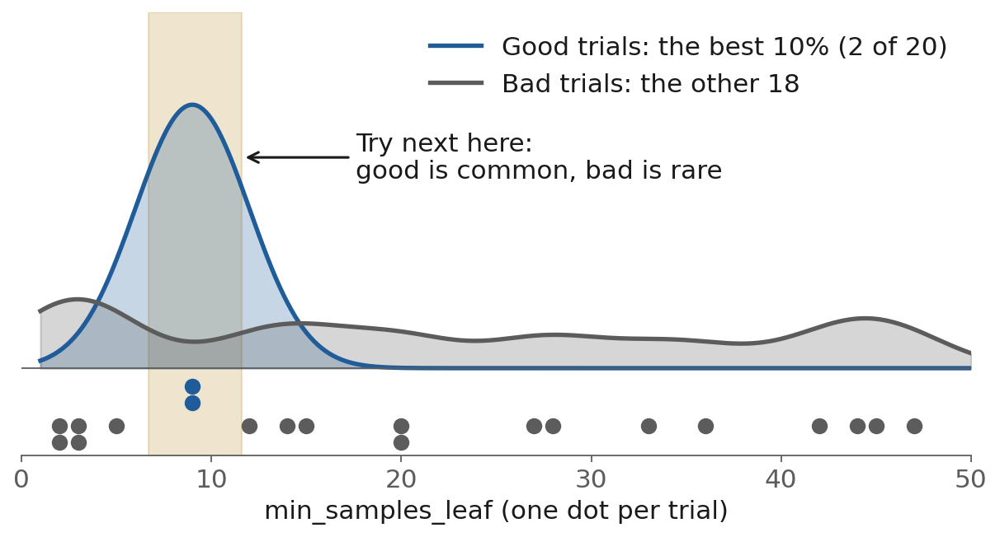

</div>
</div>

<span class="source"><a href="https://papers.nips.cc/paper_files/paper/2011/hash/86e8f7ab32cfd12577bc2619bc635690-Abstract.html">Bergstra et al. (2011)</a>, where TPE comes from</span>

<!--
The first 20 trials of the search on the concrete strength dataset. Good means the best 10%: 2 of 20, both with leaf
size 9. The bad ones spread from 2 to 47. Trials 21 to 26 use leaf sizes 8 to 13. Optuna's own
curves are smoother than these.
-->

---

## Tracking and search, Optuna on the concrete strength dataset

<p class="opr-note">Each dot: one trial's validation RMSE. Each line: the best RMSE so far, so it only goes down.</p>

<style>
/* Optuna replay: random search against TPE, forty trials each, tuning Lecture 9's own
   decision tree (max_depth, min_samples_leaf) on the concrete strength dataset */
.opr-widget { font-size: 20px; }
.opr-controls { display: flex; gap: 0.9em; align-items: center; justify-content: center; margin: 0 0 0.1em; }
.opr-controls input[type=range] { width: 340px; accent-color: #c41230; }
.opr-controls button { font: inherit; font-size: 19px; min-width: 5.4em; padding: 0.1em 0.6em; color: #c41230; background: #fff; border: 2px solid #c41230; border-radius: 6px; cursor: pointer; }
.opr-n { min-width: 8em; color: #1a1a1a; font-variant-numeric: tabular-nums; }
.opr-readout { text-align: center; color: #5c5c5c; margin-top: 0.1em; font-size: 0.82em; line-height: 1.3; }
.opr-widget svg { display: block; margin: 0 auto; }
section p.opr-note { font-size: 0.74em; margin: 0.15em 0; text-align: center; }
</style>
<div class="opr-widget">
<div class="opr-controls">
<button type="button" id="opr-play">Play</button>
<input type="range" id="opr-n" min="0" max="40" step="1" value="0">
<span class="opr-n" id="opr-nlabel">0 of 40 trials</span>
</div>
<svg id="opr-svg" viewBox="0 0 1120 235" width="1120" height="235"></svg>
<div class="opr-readout" id="opr-readout"></div>
</div>

<script>
(() => {
  const svg = document.getElementById("opr-svg");
  if (!svg || svg.dataset.ready) return;
  svg.dataset.ready = "1";
  // Two Optuna studies on the concrete strength dataset's GroupKFold(5) RMSE, DecisionTreeRegressor(random_state=0)
  // over max_depth and min_samples_leaf, RandomSampler(seed=0) against TPESampler(seed=0), 40
  // trials each. Printed by lectures/l10/figures/make_figures.py, group "widgets".
  const RANDOM = [{"depth": 12, "leaf": 36, "rmse": 10.4789}, {"depth": 13, "leaf": 28, "rmse": 9.9641}, {"depth": 10, "leaf": 33, "rmse": 10.2052}, {"depth": 10, "leaf": 45, "rmse": 10.9482}, {"depth": 20, "leaf": 20, "rmse": 9.4946}, {"depth": 17, "leaf": 27, "rmse": 9.9552}, {"depth": 12, "leaf": 47, "rmse": 10.8242}, {"depth": 3, "leaf": 5, "rmse": 10.9984}, {"depth": 2, "leaf": 42, "rmse": 13.0665}, {"depth": 16, "leaf": 44, "rmse": 10.7797}, {"depth": 20, "leaf": 40, "rmse": 10.6662}, {"depth": 10, "leaf": 40, "rmse": 10.6662}, {"depth": 4, "leaf": 32, "rmse": 10.8051}, {"depth": 4, "leaf": 48, "rmse": 11.3536}, {"depth": 11, "leaf": 21, "rmse": 9.7254}, {"depth": 7, "leaf": 39, "rmse": 10.5998}, {"depth": 10, "leaf": 29, "rmse": 10.0220}, {"depth": 2, "leaf": 31, "rmse": 13.0671}, {"depth": 13, "leaf": 31, "rmse": 10.1825}, {"depth": 19, "leaf": 35, "rmse": 10.4996}, {"depth": 8, "leaf": 22, "rmse": 9.7743}, {"depth": 15, "leaf": 4, "rmse": 9.1911}, {"depth": 14, "leaf": 34, "rmse": 10.2337}, {"depth": 5, "leaf": 7, "rmse": 10.0017}, {"depth": 7, "leaf": 19, "rmse": 9.3881}, {"depth": 12, "leaf": 22, "rmse": 9.7743}, {"depth": 20, "leaf": 6, "rmse": 9.7142}, {"depth": 5, "leaf": 9, "rmse": 9.5483}, {"depth": 14, "leaf": 13, "rmse": 9.1092}, {"depth": 10, "leaf": 13, "rmse": 9.1092}, {"depth": 5, "leaf": 6, "rmse": 10.0577}, {"depth": 14, "leaf": 7, "rmse": 9.5733}, {"depth": 5, "leaf": 19, "rmse": 9.8182}, {"depth": 17, "leaf": 5, "rmse": 9.3271}, {"depth": 17, "leaf": 5, "rmse": 9.3271}, {"depth": 20, "leaf": 24, "rmse": 9.7513}, {"depth": 20, "leaf": 31, "rmse": 10.1825}, {"depth": 16, "leaf": 2, "rmse": 9.0050}, {"depth": 7, "leaf": 7, "rmse": 9.7364}, {"depth": 7, "leaf": 6, "rmse": 9.8103}];
  const TPE = [{"depth": 12, "leaf": 36, "rmse": 10.4789}, {"depth": 13, "leaf": 28, "rmse": 9.9641}, {"depth": 10, "leaf": 33, "rmse": 10.2052}, {"depth": 10, "leaf": 45, "rmse": 10.9482}, {"depth": 20, "leaf": 20, "rmse": 9.4946}, {"depth": 17, "leaf": 27, "rmse": 9.9552}, {"depth": 12, "leaf": 47, "rmse": 10.8242}, {"depth": 3, "leaf": 5, "rmse": 10.9984}, {"depth": 2, "leaf": 42, "rmse": 13.0665}, {"depth": 16, "leaf": 44, "rmse": 10.7797}, {"depth": 13, "leaf": 9, "rmse": 8.9003}, {"depth": 20, "leaf": 15, "rmse": 9.3706}, {"depth": 13, "leaf": 12, "rmse": 9.2414}, {"depth": 15, "leaf": 3, "rmse": 9.1203}, {"depth": 15, "leaf": 2, "rmse": 8.9548}, {"depth": 20, "leaf": 2, "rmse": 9.0050}, {"depth": 9, "leaf": 20, "rmse": 9.4946}, {"depth": 11, "leaf": 3, "rmse": 9.2408}, {"depth": 16, "leaf": 14, "rmse": 9.1885}, {"depth": 9, "leaf": 9, "rmse": 8.8987}, {"depth": 10, "leaf": 13, "rmse": 9.1092}, {"depth": 15, "leaf": 8, "rmse": 9.5019}, {"depth": 18, "leaf": 9, "rmse": 8.9003}, {"depth": 18, "leaf": 8, "rmse": 9.5019}, {"depth": 5, "leaf": 12, "rmse": 9.8809}, {"depth": 9, "leaf": 8, "rmse": 9.5027}, {"depth": 11, "leaf": 19, "rmse": 9.3457}, {"depth": 20, "leaf": 39, "rmse": 10.5998}, {"depth": 5, "leaf": 18, "rmse": 10.0348}, {"depth": 5, "leaf": 25, "rmse": 10.0999}, {"depth": 8, "leaf": 3, "rmse": 9.1933}, {"depth": 20, "leaf": 27, "rmse": 9.9552}, {"depth": 13, "leaf": 1, "rmse": 9.2265}, {"depth": 18, "leaf": 17, "rmse": 9.4165}, {"depth": 20, "leaf": 8, "rmse": 9.5019}, {"depth": 16, "leaf": 4, "rmse": 9.1911}, {"depth": 16, "leaf": 22, "rmse": 9.7743}, {"depth": 15, "leaf": 11, "rmse": 9.0608}, {"depth": 13, "leaf": 7, "rmse": 9.5733}, {"depth": 14, "leaf": 22, "rmse": 9.7743}];
  const RANDOM_BEST = [10.4789, 9.9641, 9.9641, 9.9641, 9.4946, 9.4946, 9.4946, 9.4946, 9.4946, 9.4946, 9.4946, 9.4946, 9.4946, 9.4946, 9.4946, 9.4946, 9.4946, 9.4946, 9.4946, 9.4946, 9.4946, 9.1911, 9.1911, 9.1911, 9.1911, 9.1911, 9.1911, 9.1911, 9.1092, 9.1092, 9.1092, 9.1092, 9.1092, 9.1092, 9.1092, 9.1092, 9.1092, 9.005, 9.005, 9.005];
  const TPE_BEST = [10.4789, 9.9641, 9.9641, 9.9641, 9.4946, 9.4946, 9.4946, 9.4946, 9.4946, 9.4946, 8.9003, 8.9003, 8.9003, 8.9003, 8.9003, 8.9003, 8.9003, 8.9003, 8.9003, 8.8987, 8.8987, 8.8987, 8.8987, 8.8987, 8.8987, 8.8987, 8.8987, 8.8987, 8.8987, 8.8987, 8.8987, 8.8987, 8.8987, 8.8987, 8.8987, 8.8987, 8.8987, 8.8987, 8.8987, 8.8987];
  const GOLD = "#b07d12", RED = "#c41230", MUTED = "#5c5c5c", INK = "#1a1a1a";
  const NS = "http://www.w3.org/2000/svg";
  const el = (tag, attrs, text) => {
    const e = document.createElementNS(NS, tag);
    for (const k in attrs) e.setAttribute(k, attrs[k]);
    if (text !== undefined) e.textContent = text;
    return e;
  };
  const add = (tag, attrs, text) => svg.appendChild(el(tag, attrs, text));
  const P = {x0: 90, x1: 1030, y0: 12, y1: 165}, YLO = 8.5, YHI = 13.5;
  const sx = i => P.x0 + i / 39 * (P.x1 - P.x0);
  const sy = v => P.y1 - (v - YLO) / (YHI - YLO) * (P.y1 - P.y0);
  add("rect", {x: P.x0, y: P.y0, width: P.x1 - P.x0, height: P.y1 - P.y0, fill: "none", stroke: "#bbb"});
  for (let v = 9; v <= 13; v++) {
    add("line", {x1: P.x0, x2: P.x1, y1: sy(v), y2: sy(v), stroke: "#eee"});
    add("text", {x: P.x0 - 10, y: sy(v) + 6, "text-anchor": "end", "font-size": 18, fill: MUTED}, String(v));
  }
  [1, 10, 20, 30, 40].forEach(t => add("text", {x: sx(t - 1), y: P.y1 + 24, "text-anchor": "middle", "font-size": 18, fill: MUTED}, String(t)));
  add("text", {x: (P.x0 + P.x1) / 2, y: P.y1 + 46, "text-anchor": "middle", "font-size": 19, fill: INK}, "Trial number");
  add("text", {x: P.x0 - 46, y: (P.y0 + P.y1) / 2, "text-anchor": "middle", "font-size": 19, fill: INK,
    transform: `rotate(-90 ${P.x0 - 46} ${(P.y0 + P.y1) / 2})`}, "RMSE, MPa");
  // Lecture 9's own trees on this same split, for scale: no depth limit, and depth 9 by eye.
  // The two values are close (9.42 and 9.10), so one label sits above its line and the other
  // below, or they would overlap.
  const refLine = (val, label, color, dy) => {
    add("line", {x1: P.x0, x2: P.x1, y1: sy(val), y2: sy(val), stroke: color, "stroke-width": 2, "stroke-dasharray": "3 4"});
  };
  refLine(9.42, "Lecture 9: no depth limit, 9.42 MPa", "#2e7d32", -7);
  refLine(9.10, "Lecture 9: depth 9 by eye, 9.10 MPa", "#2e7d32", 19);
  // ten trials of plain random sampling open both studies alike: the boundary where they can diverge
  const bx = (sx(9) + sx(10)) / 2;
  add("line", {x1: bx, x2: bx, y1: P.y0, y2: P.y1, stroke: MUTED, "stroke-width": 2, "stroke-dasharray": "6 5"});
  add("text", {x: bx + 8, y: P.y0 + 18, "font-size": 18, fill: MUTED}, "Trials 1 to 10: the same random start");
  // legend
  const LX = P.x1 - 300, LY = [P.y0 + 4, P.y0 + 28];
  [["Random search", GOLD, LY[0]], ["TPE", RED, LY[1]]].forEach(([label, color, y]) => {
    add("line", {x1: LX, x2: LX + 30, y1: y, y2: y, stroke: color, "stroke-width": 3});
    add("circle", {cx: LX + 15, cy: y, r: 4, fill: color, "fill-opacity": 0.6});
    add("text", {x: LX + 38, y: y + 6, "font-size": 16, fill: INK}, label);
  });
  const dots = (table, color) => table.map((t, i) => add("circle", {cx: sx(i), cy: sy(t.rmse), r: 4, fill: color, "fill-opacity": 0.55, visibility: "hidden"}));
  const randomDots = dots(RANDOM, GOLD), tpeDots = dots(TPE, RED);
  const randomLine = add("polyline", {fill: "none", stroke: GOLD, "stroke-width": 3});
  const tpeLine = add("polyline", {fill: "none", stroke: RED, "stroke-width": 3});
  const slider = document.getElementById("opr-n");
  const nlabel = document.getElementById("opr-nlabel");
  const readout = document.getElementById("opr-readout");
  const fmt = (t) => `max depth ${t.depth}, min leaf ${t.leaf}, RMSE ${t.rmse.toFixed(3)} MPa`;
  const draw = () => {
    const n = +slider.value;
    randomDots.forEach((d, i) => d.setAttribute("visibility", i < n ? "visible" : "hidden"));
    tpeDots.forEach((d, i) => d.setAttribute("visibility", i < n ? "visible" : "hidden"));
    randomLine.setAttribute("points", RANDOM_BEST.slice(0, n).map((v, i) => `${sx(i)},${sy(v)}`).join(" "));
    tpeLine.setAttribute("points", TPE_BEST.slice(0, n).map((v, i) => `${sx(i)},${sy(v)}`).join(" "));
    nlabel.textContent = `${n} of 40 trials`;
    if (n === 0) {
      readout.textContent = "No trials run yet.";
    } else {
      const i = n - 1;
      readout.textContent = `Trial ${n}: random tried ${fmt(RANDOM[i])}. TPE tried ${fmt(TPE[i])}. `
        + `Best so far: random ${RANDOM_BEST[i].toFixed(3)} MPa, TPE ${TPE_BEST[i].toFixed(3)} MPa.`;
    }
  };
  let playing = false, timer = 0;
  const btn = document.getElementById("opr-play");
  const setPlaying = p => {
    playing = p;
    btn.textContent = p ? "Pause" : (+slider.value >= 40 ? "Replay" : "Play");
    clearInterval(timer);
    if (p) timer = setInterval(advance, 220);
  };
  const advance = () => {
    if (svg.checkVisibility && !svg.checkVisibility()) { setPlaying(false); return; }
    const n = Math.min(40, +slider.value + 1);
    slider.value = n;
    draw();
    if (n >= 40) setPlaying(false);
  };
  btn.addEventListener("click", () => {
    if (playing) setPlaying(false);
    else {
      if (+slider.value >= 40) { slider.value = 0; draw(); }
      setPlaying(true);
    }
    btn.blur();
  });
  slider.addEventListener("keydown", e => e.stopPropagation());
  slider.addEventListener("input", () => { setPlaying(false); draw(); });
  slider.addEventListener("change", () => slider.blur());
  window.addEventListener("hashchange", () => setPlaying(false));
  draw();
})();
</script>

<p class="opr-note">Green dotted lines: Lecture 9's two trees, 9.42 and 9.10 MPa. TPE's best, 8.90 MPa, beats both.</p>
<span class="source"><a href="https://arxiv.org/abs/1907.10902">Akiba et al. (2019)</a>, the Optuna paper</span>

<!--
Trials 1 to 10 are the same for both: TPE starts with 10 random trials. From trial 11, TPE tries
leaf sizes of 2 to 20, where the good trials were; random keeps drawing 21 to 48. TPE reaches
8.90 at trial 11, random gets to 9.00 only at trial 38.
-->

---

## Tracking and search, the run hierarchy

A search trains a model once per trial. MLflow keeps every one of them, in one place:

<style>
/* the MLflow run hierarchy for a search: experiment, parent run, child runs, registry */
.mlf-diagram { position: relative; width: 1120px; height: 310px; margin: 0.3em auto 0.5em; font-size: 19px; }
.mlf-box {
  position: absolute; margin: 0; border-radius: 10px; display: flex; flex-direction: column;
  align-items: center; justify-content: center; text-align: center; line-height: 1.25; padding: 8px; color: #1a1a1a;
}
.mlf-diagram .mlf-sub { display: block; font-size: 0.82em; font-weight: 400; color: #5c5c5c; margin-top: 4px; }
.mlf-exp {
  left: 20px; top: 10px; width: 760px; height: 285px; align-items: flex-start; justify-content: flex-start;
  text-align: left; border: 3px dashed #1f5c99; color: #1f5c99; font-weight: 700; padding: 12px 18px;
}
.mlf-parent {
  left: 60px; top: 80px; width: 340px; height: 62px; border: 3px solid #1f5c99;
  background: rgba(31, 92, 153, 0.08); font-weight: 700;
}
.mlf-child {
  top: 172px; width: 170px; height: 90px; border: 3px solid #b07d12; background: rgba(176, 125, 18, 0.08);
  font-size: 0.86em; font-weight: 700;
}
.mlf-child1 { left: 60px; }
.mlf-child2 { left: 245px; }
.mlf-child3 { left: 430px; }
.mlf-dots {
  left: 615px; top: 172px; width: 170px; height: 90px; border: 3px dashed #5c5c5c; color: #5c5c5c;
  font-size: 0.86em; font-weight: 700;
}
.mlf-registry {
  left: 820px; top: 172px; width: 260px; height: 90px; border: 3px solid #2e7d32;
  background: rgba(46, 125, 50, 0.08); font-weight: 700;
}
.mlf-registry::before {
  content: "\2192"; position: absolute; left: -46px; top: 50%; transform: translateY(-50%);
  font-size: 34px; color: #1a1a1a;
}
</style>
<div class="mlf-diagram">
<div class="mlf-box mlf-exp" data-marpit-fragment="1">Experiment<span class="mlf-sub">this search and all its runs</span></div>
<div class="mlf-box mlf-parent" data-marpit-fragment="2">Parent run<span class="mlf-sub">the whole Optuna study</span></div>
<div class="mlf-box mlf-child mlf-child1" data-marpit-fragment="3">Child run: trial 0<span class="mlf-sub">its settings, its validation RMSE</span></div>
<div class="mlf-box mlf-child mlf-child2" data-marpit-fragment="4">Child run: trial 1<span class="mlf-sub">its settings, its validation RMSE</span></div>
<div class="mlf-box mlf-child mlf-child3" data-marpit-fragment="5">Child run: trial 2<span class="mlf-sub">its settings, its validation RMSE</span></div>
<div class="mlf-box mlf-dots" data-marpit-fragment="6">&hellip;<span class="mlf-sub">one child run per trial</span></div>
<div class="mlf-box mlf-registry" data-marpit-fragment="7">Model registry<span class="mlf-sub">the best settings, refit and saved by name</span></div>
</div>

The registry holds the model to use, with a name and a version anyone can load.
<span class="source"><a href="https://mlflow.org/docs/latest/ml/traditional-ml/tutorials/hyperparameter-tuning/notebooks/hyperparameter-tuning-with-child-runs/">MLflow, hyperparameter tuning with child runs</a></span>

<!--
One run per trial, as in Lectures 1 and 2, now grouped under a parent. Every child run stays
on record. The registry is where the chosen model goes.
-->

---

## Tracking and search, one trial in code

<style scoped>
.cda { position: relative; width: 1140px; height: 490px; margin: 0.1em auto 0; }
.cda pre { position: absolute; left: 0; top: 0; width: 670px; margin: 0; padding: 8px 12px;
  font-size: 15.5px; line-height: 20.15px; box-sizing: border-box; }
.cda pre code { font-size: 15.5px; line-height: 20.15px; padding: 0; background: none; }
.cda svg { position: absolute; left: 0; top: 0; }
.cda ul { list-style: none; margin: 0; padding: 0; }
.cda li { position: absolute; left: 715px; width: 425px; font-size: 17px; line-height: 1.28; background: #f7f7f7;
  border-left: 5px solid #5c5c5c; border-radius: 0 6px 6px 0; padding: 6px 12px; margin: 0; box-sizing: border-box; }
.cda li code { font-size: 15px; }
.cda li:nth-child(1) { top: 0px;   border-color: #1f5c99; }
.cda li:nth-child(2) { top: 64px;  border-color: #b07d12; }
.cda li:nth-child(3) { top: 150px; border-color: #2e7d32; }
.cda li:nth-child(4) { top: 236px; border-color: #c41230; }
.cda li:nth-child(5) { top: 344px; border-color: #1f5c99; }
.cda li:nth-child(6) { top: 430px; border-color: #b07d12; }
.cda .arr { opacity: 0; transition: opacity 0.3s; }
section:not(:has([data-bespoke-marp-fragment])) .cda .arr { opacity: 1; }
section:has(.cda li[data-marpit-fragment="1"][data-bespoke-marp-fragment="active"]) .cda .arr1,
section:has(.cda li[data-marpit-fragment="2"][data-bespoke-marp-fragment="active"]) .cda .arr2,
section:has(.cda li[data-marpit-fragment="3"][data-bespoke-marp-fragment="active"]) .cda .arr3,
section:has(.cda li[data-marpit-fragment="4"][data-bespoke-marp-fragment="active"]) .cda .arr4,
section:has(.cda li[data-marpit-fragment="5"][data-bespoke-marp-fragment="active"]) .cda .arr5,
section:has(.cda li[data-marpit-fragment="6"][data-bespoke-marp-fragment="active"]) .cda .arr6 { opacity: 1; }
</style>

<div class="cda">

```python
def objective(trial):
    params = dict(
        max_depth=trial.suggest_int('max_depth', 2, 20),
        min_samples_leaf=trial.suggest_int('min_samples_leaf', 1, 50),
    )
    model = DecisionTreeRegressor(
        random_state=SEED,
        **params,
    )
    rmse = -cross_val_score(
        model,
        X_tr,
        y_tr,
        groups=groups_tr,
        cv=GroupKFold(5),
        scoring='neg_root_mean_squared_error',
    ).mean()
    with mlflow.start_run(nested=True):
        mlflow.log_params(params)
        mlflow.log_metric('val_rmse', rmse)
    return rmse
```

<svg viewBox="0 0 1140 490" width="1140" height="490">
<defs><marker id="cda-head" viewBox="0 0 10 10" refX="9" refY="5" markerWidth="7" markerHeight="7" orient="auto-start-reverse"><path d="M0,0 L10,5 L0,10 z" fill="#5c5c5c"/></marker></defs>
<path class="arr arr1" d="M 226 18 L 708 27" fill="none" stroke="#1f5c99" stroke-width="3" marker-end="url(#cda-head)"/>
<path class="arr arr2" d="M 657 79 L 708 91" fill="none" stroke="#b07d12" stroke-width="3" marker-end="url(#cda-head)"/>
<path class="arr arr3" d="M 255 139 L 708 178" fill="none" stroke="#2e7d32" stroke-width="3" marker-end="url(#cda-head)"/>
<path class="arr arr4" d="M 265 300 L 708 285" fill="none" stroke="#c41230" stroke-width="3" marker-end="url(#cda-head)"/>
<path class="arr arr5" d="M 402 361 L 708 382" fill="none" stroke="#1f5c99" stroke-width="3" marker-end="url(#cda-head)"/>
<path class="arr arr6" d="M 167 421 L 708 448" fill="none" stroke="#b07d12" stroke-width="3" marker-end="url(#cda-head)"/>
</svg>

* **`def objective(trial)`**: Optuna calls it once per trial. It returns the score to minimize.
* **`trial.suggest_int(name, low, high)`**: Optuna picks an integer in that range, a new one each trial.
* **Lecture 9's tree**: `random_state=SEED` fixes its randomness, `**params` passes this trial's settings.
* **`cross_val_score`**, as in Lecture 9: `cv=GroupKFold(5)` makes five folds, `groups=` keeps each mix in one fold, `scoring=` asks for the RMSE (negative, hence the minus sign).
* **`mlflow.start_run(nested=True)`**: a child run inside the parent run, with this trial's settings and score.
* **`return rmse`**: the number Optuna minimizes.

</div>

<!--
The same objective as the notebook, one piece at a time. Everything inside it is Lecture 9's
grouped cross-validation; the two new parts are suggest_int and the nested run.
-->

---

## Tracking and search, the search in code

<style scoped>
.cdb { position: relative; width: 1140px; height: 490px; margin: 0.1em auto 0; }
.cdb pre { position: absolute; left: 0; top: 0; width: 670px; margin: 0; padding: 8px 12px;
  font-size: 16.5px; line-height: 1.3; box-sizing: border-box; }
.cdb pre code { font-size: 16.5px; line-height: 21.45px; padding: 0; background: none; }
.cdb svg { position: absolute; left: 0; top: 0; }
.cdb ul { list-style: none; margin: 0; padding: 0; }
.cdb li { position: absolute; left: 715px; width: 425px; font-size: 17px; line-height: 1.28; background: #f7f7f7;
  border-left: 5px solid #5c5c5c; border-radius: 0 6px 6px 0; padding: 6px 12px; margin: 0; box-sizing: border-box; }
.cdb li code { font-size: 15px; }
.cdb li:nth-child(1) { top: 0px;   border-color: #1f5c99; }
.cdb li:nth-child(2) { top: 86px;  border-color: #b07d12; }
.cdb li:nth-child(3) { top: 172px; border-color: #2e7d32; }
.cdb li:nth-child(4) { top: 237px; border-color: #c41230; }
.cdb li:nth-child(5) { top: 330px; border-color: #1f5c99; }
.cdb li:nth-child(6) { top: 424px; border-color: #b07d12; }
.cdb .arr { opacity: 0; transition: opacity 0.3s; }
section:not(:has([data-bespoke-marp-fragment])) .cdb .arr { opacity: 1; }
section:has(.cdb li[data-marpit-fragment="1"][data-bespoke-marp-fragment="active"]) .cdb .arr1,
section:has(.cdb li[data-marpit-fragment="2"][data-bespoke-marp-fragment="active"]) .cdb .arr2,
section:has(.cdb li[data-marpit-fragment="3"][data-bespoke-marp-fragment="active"]) .cdb .arr3,
section:has(.cdb li[data-marpit-fragment="4"][data-bespoke-marp-fragment="active"]) .cdb .arr4,
section:has(.cdb li[data-marpit-fragment="5"][data-bespoke-marp-fragment="active"]) .cdb .arr5,
section:has(.cdb li[data-marpit-fragment="6"][data-bespoke-marp-fragment="active"]) .cdb .arr6 { opacity: 1; }
</style>

<div class="cdb">

```python
parent = mlflow.start_run(run_name='concrete-tree-search')
study = optuna.create_study(
    direction='minimize',
    sampler=optuna.samplers.TPESampler(seed=SEED),
)
study.optimize(
    objective,
    n_trials=20,
)

winner = DecisionTreeRegressor(
    random_state=SEED,
    **study.best_params,
).fit(X_tr, y_tr)
mlflow.sklearn.log_model(
    winner,
    name='model',
    registered_model_name='concrete-tree',
    skops_trusted_types=['sklearn.tree._tree.Tree'],
)
mlflow.end_run()
```

<svg viewBox="0 0 1140 490" width="1140" height="490">
<defs><marker id="cdb-head" viewBox="0 0 10 10" refX="9" refY="5" markerWidth="7" markerHeight="7" orient="auto-start-reverse"><path d="M0,0 L10,5 L0,10 z" fill="#5c5c5c"/></marker></defs>
<path class="arr arr1" d="M 598 19 L 708 38" fill="none" stroke="#1f5c99" stroke-width="3" marker-end="url(#cdb-head)"/>
<path class="arr arr2" d="M 519 83 L 708 124" fill="none" stroke="#b07d12" stroke-width="3" marker-end="url(#cdb-head)"/>
<path class="arr arr3" d="M 192 169 L 708 200" fill="none" stroke="#2e7d32" stroke-width="3" marker-end="url(#cdb-head)"/>
<path class="arr arr4" d="M 262 276 L 708 265" fill="none" stroke="#c41230" stroke-width="3" marker-end="url(#cdb-head)"/>
<path class="arr arr5" d="M 440 383 L 708 368" fill="none" stroke="#1f5c99" stroke-width="3" marker-end="url(#cdb-head)"/>
<path class="arr arr6" d="M 182 448 L 708 444" fill="none" stroke="#b07d12" stroke-width="3" marker-end="url(#cdb-head)"/>
</svg>

* **`mlflow.start_run(run_name=...)`**: opens the parent run. It stays open for the whole search.
* **`create_study`**: `direction='minimize'`, since a lower RMSE is better. `sampler=` picks TPE, seeded so the search repeats.
* **`study.optimize`**: runs 20 trials, so 20 child runs.
* **The winner**: `study.best_params`, refit on all 835 training rows.
* **`log_model`**: saves the tree and registers it as `concrete-tree`. `skops_trusted_types=` lets MLflow save a tree.
* **`mlflow.end_run()`**: closes the parent run.

</div>

<!--
The parent run is opened before the study and closed after the registration, so the twenty
child runs, the best settings and the registered model all sit under it.
-->

---

## Tracking and search, test once

<style scoped>
.flow .step { max-width: 300px; font-size: 0.74em; padding: 0.5em 0.6em; }
section p.takeaway { margin-top: 0.8em; }
section p.small-note { font-size: 0.66em; text-align: center; color: #5c5c5c; margin-top: 0.4em; }
</style>

<div class="flow">
<div class="step" data-marpit-fragment><b>1. Search</b><br>on the training mixes only<br>20 trials, best validation RMSE <b>8.90 MPa</b></div>
<div class="pair" data-marpit-fragment><div class="arrow">&rarr;</div><div class="step"><b>2. Refit and register</b><br>the winner, on all 835 training rows<br><code>concrete-tree</code>, version 1</div></div>
<div class="pair" data-marpit-fragment><div class="arrow">&rarr;</div><div class="step"><b>3. Test once</b><br>on the 195 held-out rows<br>test RMSE <b>7.41 MPa</b></div></div>
</div>

<p class="takeaway" data-marpit-fragment>Report the test number, 7.41 MPa. The test mixes never took part in the search.</p>

<p class="small-note" data-marpit-fragment>It is lower than 8.90 here: 195 rows from 86 mixes is a small test set, and its score depends on which mixes landed in it.</p>

<!--
Same rule as Lecture 9, now for the winner of a search: the test set is touched once, after
the search is over.
-->

---

<!-- _class: demo -->

# Demos

`l10-classification.ipynb`: the 52-channel classifier, its confusion matrix, three thresholds, and its recall on faults it never saw.

`l10-tracking-search.ipynb`: a 20-trial Optuna search on the concrete strength dataset, one MLflow child run per trial, the winner registered and tested once.

<a href="../../lectures/l10/l10-classification.html">Classification notebook</a> / <a href="../../lectures/l10/l10-tracking-search.html">Tracking and search notebook</a>

<!--
About five minutes each. The first run of the classification notebook downloads 45 MB of
plant data.
-->

---

## Recap

<style scoped>
.cards-recap { grid-template-columns: repeat(4, 1fr); }
.cards-recap .card { font-size: 0.62em; }
.cards-recap .card img { height: 118px; width: 100%; object-fit: contain; background: #fff; border-radius: 4px; }
.cards-recap .card h4 { font-size: 1.3em; margin: 6px 0 4px; min-height: 2.5em; }
.cards-recap .card p { margin: 0 0 6px; }
.cards-recap .card p.ev { color: #5c5c5c; }
p.recap-lead { margin: 0 0 0.2em; }
p.recap-close { font-size: 0.8em; margin-top: 0.7em; text-align: center; }
</style>

<p class="recap-lead">Four questions this session added to Lecture 9's four:</p>

<div class="cards cards-recap">
<div class="card"><h4>What turns a number into a category?</h4><p><b>A threshold on a probability.</b></p><p class="ev">Fault 4's boundary sits at 43.4% open; fault 14 needs more than one straight cut.</p></div>
<div class="card">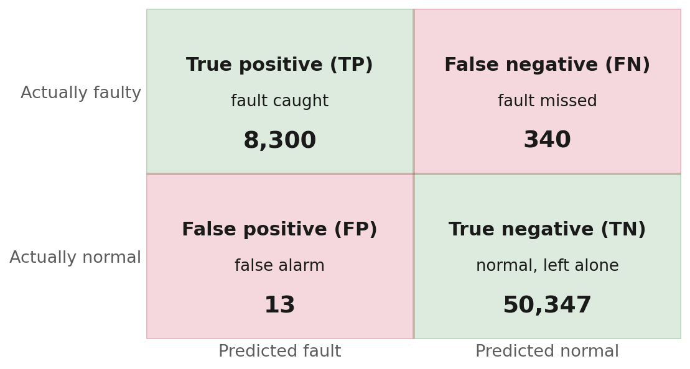<h4>How do you judge a detector?</h4><p><b>Its confusion matrix, not accuracy alone.</b></p><p class="ev">The baseline scores 85.4% accuracy and 0 recall; precision and recall expose it.</p></div>
<div class="card"><h4>What can a classifier recognize?</h4><p><b>Only the faults it was shown.</b></p><p class="ev">Two faults it never saw: fault 18 was caught 92% of the time, fault 19 only 0.1%.</p></div>
<div class="card">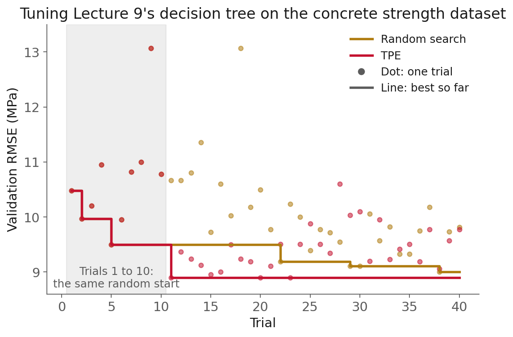<h4>How do you trust a search?</h4><p><b>Track every trial, test the winner once.</b></p><p class="ev">TPE reached 8.90 MPa at trial 11, random search 9.00 at trial 38. The test set gave 7.41.</p></div>
</div>

<p class="recap-close"><b>Report the confusion matrix with its threshold, track every trial, and test once.</b></p>

<!--
Each card's picture is the slide where the room saw the answer. The closing line is the three
habits under the four cards.
-->

---

## This week

**Practice module** for this session, for participation credit
**Demos** `l10-classification.ipynb` and `l10-tracking-search.ipynb`, to rerun after class
