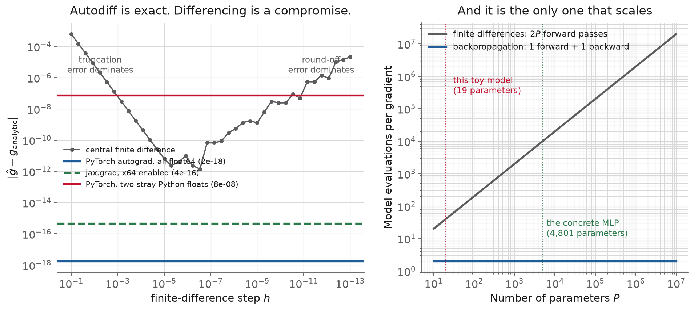
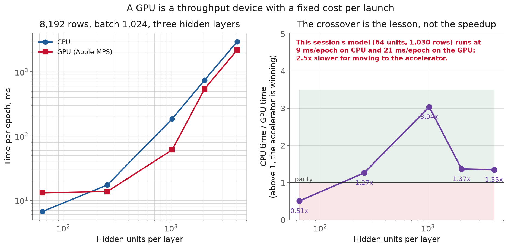
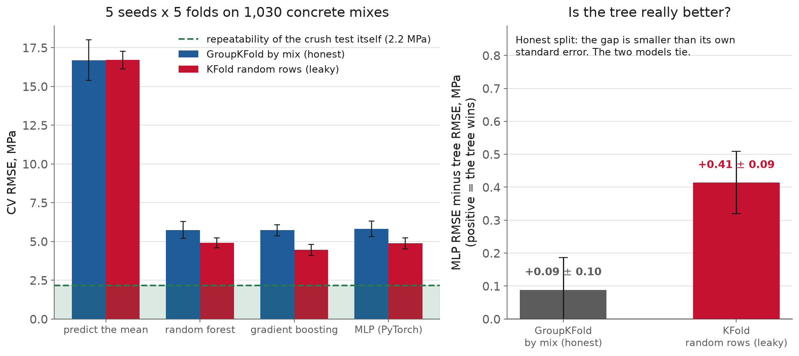
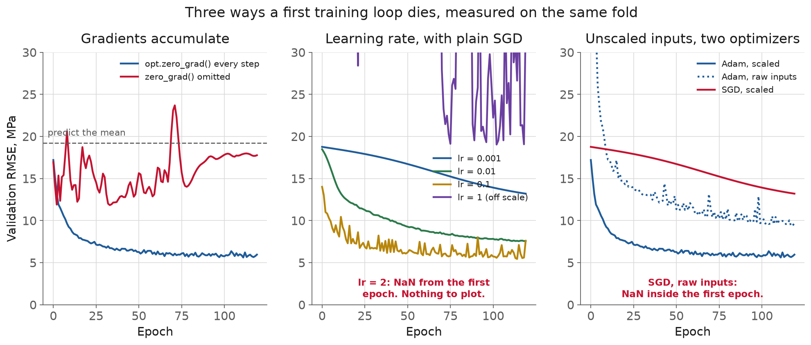

<!-- _class: title -->

# L11 · Tensors, autodiff, training loops, GPUs

## Week 6 · Machine learning & deep learning

**Systems and Toolchains for AI Engineers**

---

## Roadmap

1. Tensors, and the dtype that will bite you
2. Automatic differentiation, demystified
3. The anatomy of a training loop
4. Devices, and what an accelerator actually buys
5. Does the net beat the tree?
6. Three ways a first training loop dies
7. Live demo: a gradient by hand, a loop by hand

<!-- 110 min. Budget roughly 10 / 22 / 15 / 15 / 15 / 10 / 20 demo.
     Dataset: UCI Concrete Compressive Strength, 1,030 mixes, 8 inputs, MPa out.
     If running long, cut the JAX contrast slides, not the pathologies. -->

---

<!-- _class: section -->

# Why this matters

---

## Why this matters

Today you finally write the model.

A training loop is ~15 lines
and about six ways to go silently wrong.

**You have met this failure mode before.**

A leaky scaler does not raise.
A grouped split does not raise.

A missing `zero_grad()` does not raise either.

---

## Why this matters, what it costs, measured today

| run | validation RMSE |
|---|---|
| the loop, correct | **6.0 MPa** |
| the same loop, one line removed | **17.8 MPa** |
| predicting the training mean | 19.2 MPa |

One line → **11% of the available improvement.**

**The uncomfortable property.**

Every other tool in this course rejects bad input.
A database refuses a malformed query.
A schema check fails loudly.

`loss.backward()` will differentiate **whatever
graph you built**, including the accidental one.

---

<!-- _class: section -->

# Tensors and dtype

---

## Tensors and dtype

<div class="definition">

**Tensor**: an n-dimensional array with a dtype and a device, which is the unit every framework operation consumes and returns.

</div>

**Which device** it lives on.
**What was done to it**, so it can be differentiated.

And it has a `dtype` NumPy would not have chosen.

---

## Tensors and dtype, the batch dimension comes first

`(N, features)` for an MLP
`(N, channels, H, W)` for a 2D conv
`(N, channels, time)` for a sensor window

Not a law: a **convention**, so a batch is one
contiguous slab you can ship to a device.

**Read a shape error as a sentence.**

```
mat1 and mat2 shapes cannot be multiplied
(64x8 and 64x1)
```

Batch is 64. Features are 8. Something
downstream wanted a different orientation.

<!-- The (N,1) vs (N,) broadcast into (N,N) is the single most common cause of
     a loss that will not go down. Ask who has hit it. -->

---

## Tensors and dtype, now the trap

```python
torch.tensor(3.14).dtype            # torch.float32
torch.tensor(np.float64(3.14)).dtype  # torch.float64
```

NumPy defaults to float64.
PyTorch defaults to float32.

**This is not hypothetical.**

Today's autodiff figure was drafted to show
"torch and JAX both match the analytic gradient."

JAX matched at **4.4 × 10⁻¹⁶**.
PyTorch disagreed at **7.5 × 10⁻⁸**.

For an hour that looked like a real difference
between the two libraries.

---

## Tensors and dtype, it was two Python floats

`1.234` and a bare `rng.normal()`, both stored
as float32 by `torch.tensor`.

Relative error: **1.25 × 10⁻⁷**.
float32 epsilon: **1.19 × 10⁻⁷**.

Fix the two scalars → PyTorch matches at 1.7 × 10⁻¹⁸.

**Why nothing warned you.**

float32 **promotes** to float64 on contact.

So every dtype *downstream* of the mistake
reads `float64` and looks correct.

Checking `.dtype` afterwards would not have
found it. Checking it at the boundary would.

---

<!-- _class: section -->

# Automatic differentiation

---

## Automatic differentiation

<div class="definition">

**Automatic differentiation**: recording each operation on a tape, then replaying it backwards to get exact gradients without hand-deriving anything.

</div>

$$z = Wx + b, \quad a = \tanh(z)$$
$$\hat{y} = v \cdot a + c, \quad L = (\hat{y} - y)^2$$

Four parameter blocks. One example. One scalar loss.

---

## Automatic differentiation, the chain rule, in four lines

$$\frac{\partial L}{\partial \hat{y}} = 2(\hat{y}-y)$$
$$\frac{\partial L}{\partial v} = \frac{\partial L}{\partial \hat{y}}\, a
\qquad
\frac{\partial L}{\partial z} = \left(\frac{\partial L}{\partial \hat{y}} v\right) \odot (1-a^2)$$
$$\frac{\partial L}{\partial W} = \frac{\partial L}{\partial z}\, x^{\top}$$

**Each step reuses the one before it.**

---

## Automatic differentiation, that reuse *is* reverse-mode autodiff

Forward pass: compute and **remember** each intermediate.

Backward pass: walk the recorded operations in
reverse, multiplying by each local derivative.

The loss is a scalar, so **one** backward walk
gives every parameter's derivative.

[Goodfellow et al., *Deep Learning*, §6.5](https://www.deeplearningbook.org/contents/mlp.html)

**The alternative: just perturb it.**

Two forward passes per parameter.
And it is not exact: you are trading
**truncation** against **round-off**.

Too big a step, bad approximation.
Too small, catastrophic cancellation.

---

## Automatic differentiation, four ways to get the same gradient



<!-- Ask them to predict where the finite-difference V bottoms out before
     revealing. Almost nobody says 1e-12; most say "machine precision". -->

---

## Automatic differentiation, the numbers

| method | error vs analytic |
|---|---|
| PyTorch autograd (float64) | **1.7 × 10⁻¹⁸** |
| `jax.grad` (x64 on) | **4.4 × 10⁻¹⁶** |
| torch vs jax, to each other | 4.4 × 10⁻¹⁶ |
| best central difference | 1.4 × 10⁻¹² at *h* = 3 × 10⁻⁷ |

And you only know that *h* was best because
the exact answer was available.

---

## Automatic differentiation, two designs, same mathematics

**PyTorch records a tape.** Operations on tensors with
`requires_grad` are appended to a graph.

**JAX transforms functions.** `jax.grad(f)` returns a
*new function* that computes the gradient.

**PyTorch: mutable, accumulating.**

```python
loss = loss_fn(model(x), y)
optimizer.zero_grad()   # because .grad += is the semantics
loss.backward()         # walks the tape, ADDS into every .grad
optimizer.step()
```

---

## Automatic differentiation, JAX: functional, nothing to zero

```python
def loss(params, x, y):
    a = jnp.tanh(params["W"] @ x + params["b"])
    return (params["v"] @ a + params["c"] - y) ** 2

grads = jax.grad(loss)(params, x, y)
```

No tape. No mutable `.grad`. **Nothing to forget.**

[The JAX Autodiff Cookbook](https://docs.jax.dev/en/latest/notebooks/autodiff_cookbook.html)

---

## Automatic differentiation, so *why* does PyTorch accumulate?

Not an oversight.

Accumulation is what lets you split a batch too
big for memory into micro-batches, call
`backward()` on each, and step once on the sum.

The API optimises for that. The common case
pays one extra line.

**`zero_grad()` is the line everyone omits once.**

Gradient at step *k* becomes the **sum** of steps 1…*k*.
The effective step size grows through the epoch.

It does not crash. It **wanders**, so it looks
like a hyperparameter problem.

---

## Automatic differentiation, two more pieces of the API

`torch.no_grad()`: stop recording the tape.
Wrap every evaluation pass in it.

`model.eval()`: **a different thing.** It switches
dropout and batch-norm to inference behaviour.

Confusing them is a classic source of a
validation score another script cannot reproduce.

[A gentle introduction to torch.autograd](https://docs.pytorch.org/tutorials/beginner/blitz/autograd_tutorial.html)

---

<!-- _class: section -->

# Anatomy of a training loop

---

## Anatomy of a training loop

<div class="definition">

**Training loop**: forward pass, loss, backward pass, optimizer step, and zeroing the gradient accumulator before the next iteration.

</div>

**`Dataset`**: `__len__` and `__getitem__`
**`DataLoader`**: batching, shuffling, `num_workers`
**`nn.Module`**: parameters and `forward`
**optimizer**: turns `.grad` into an update

For a table in memory you can skip the first two.
[Datasets & DataLoaders](https://docs.pytorch.org/tutorials/beginner/basics/data_tutorial.html)

---

## Anatomy of a training loop, five lines

```python
for xb, yb in loader:
    xb, yb = xb.to(device), yb.to(device)
    loss = loss_fn(model(xb), yb)   # forward
    optimizer.zero_grad()           # clear
    loss.backward()                 # backward
    optimizer.step()                # update
```

---

## Anatomy of a training loop, losses and optimizers

`MSELoss`: large errors hurt quadratically
`L1Loss`: they do not
`CrossEntropyLoss`: wants **logits**, applies softmax itself

**SGD + momentum**: classical, still standard for vision
**Adam / AdamW**: adapts a per-parameter step size

<!-- The CrossEntropyLoss detail produces a lot of quietly mistrained
     classifiers. Say it twice. -->

---

## Anatomy of a training loop, JAX writes the same loop inside out

```python
def predict_one(params, x):        # no batch dimension at all
    return params["v"] @ jnp.tanh(params["W"] @ x
                                  + params["b"]) + params["c"]

predict_batch = jax.vmap(predict_one, in_axes=(None, 0))
```

`vmap` names what the batch dimension **is**:
an axis you are mapping over, not a model property.

---

## Anatomy of a training loop, and it agrees with the loop it replaces

`vmap` vs an explicit Python loop over 256 examples:

# 2.2 × 10⁻¹⁵

Faster, too: one batched kernel instead of 256 small ones.

---

## Anatomy of a training loop, `jax.jit` is not a free lunch

| workload | eager | jit | |
|---|---|---|---|
| one 512×512 matmul + `tanh` | 2.8 ms | 3.6 ms | **0.8×** |
| elementwise chain, 2M floats | 16.8 ms | 14.6 ms | 1.2× |
| 10-step `lax.fori_loop` | 83.3 ms | 30.3 ms | **2.8×** |

Compiling one big BLAS call makes it **slower**.
Fusion pays when there are many small ops.

<!-- An earlier draft of these notes claimed a flat 3x. That was a badly timed
     benchmark. Own it out loud; it is the same lesson as the dtype bug. -->

---

<!-- _class: section -->

# Devices and accelerators

---

## Devices and accelerators

<div class="definition">

**Device**: where a tensor lives. Moving between CPU and GPU is an explicit copy, and it costs more than the arithmetic on small models.

</div>

`model.to(device)`, `x.to(device)`: same device, or an error
Anything you print or plot needs `.cpu()`
Doing that **inside** the loop serialises everything

Timing without `synchronize()` measures how fast
you **queued** the work.

---

## Devices and accelerators, the thing to internalise

# A GPU is a throughput device
# with a fixed cost per launch.

It does not make operations faster.
It makes **wide** operations cheaper per element.

---

## Devices and accelerators, so where is the crossover?



<!-- Ask them to guess where the lines cross before revealing. Most say
     "the GPU is always faster". -->

---

## Devices and accelerators, today's model on the accelerator

| | ms/epoch |
|---|---|
| CPU | **8.6** |
| GPU (Apple MPS) | **21.1** |

**2.5× slower** for moving to the accelerator.
The crossover sits between 64 and 256 hidden units.

**An honest caveat about these numbers.**

Apple MPS on a laptop, because that is what
generated these figures. A datacentre CUDA card
(what A6 gives you) reaches 10 to 50× on a big model.

What transfers is the **shape**, not the magnitude:
every accelerator has a per-launch cost, so
every accelerator has a crossover.

---

## Devices and accelerators, which gives the practical rule

Debug on **CPU**, tiny subset, few epochs.
Then launch the real run on the GPU.

For a model this size the CPU is not a fallback.
It is the correct choice.

[Bourke, *Learn PyTorch for Deep Learning*](https://www.learnpytorch.io/)

**Mixed precision, in one slide.**

`torch.autocast` runs the arithmetic in fp16/bf16
while keeping fp32 weights. Halves memory,
often doubles throughput on tensor cores.

`GradScaler` exists because fp16 has a narrow
exponent and small gradients **underflow to zero**.

Reach for it when a model does not fit. Not before.

---

<!-- _class: section -->

# Does the net beat the tree?

---

## Does the net beat the tree?

**UCI Concrete Compressive Strength**, Yeh 1998.
1,030 mixes → cement, slag, fly ash, water,
superplasticizer, 2 aggregates, age → MPa.

Predict a **28-day destructive test** from the recipe.
Exactly the trade a surrogate exists to make.

[UCI 165](https://archive.ics.uci.edu/dataset/165/concrete+compressive+strength) · [Yeh 1998](https://doi.org/10.1016/S0008-8846(98)00165-3)

---

## Does the net beat the tree?, first: are these rows exchangeable?

Group by the **seven mix components**, ignoring age.

1,030 rows → **428 distinct mixes**.
182 mixes tested at more than one age.
Those cover **76% of all rows.**

Plus **25 exact duplicate rows.**

**You have seen this shape before.**

The same batch of concrete appears at
3, 7, 28 and 90 days as separate rows.

A random k-fold asks the model to predict a
curing curve **it has already seen most of**.

That is L9's wind-tunnel frequency sweep,
in a different material.

---

## Does the net beat the tree?, how much scatter is even there?

8 settings have the same mix and age measured twice:
differences of 0.89, 1.28, 1.48, 1.68, 1.97, 2.86, 3.44, 6.60 MPa.

Repeatability ≈ **2.2 MPa**, on **8 degrees of freedom**.

An order of magnitude, not a number. But enough
to know a model claiming 2 MPa is claiming to beat
the test's own reproducibility.

---

## Does the net beat the tree?, the comparison, run honestly



<!-- 5 seeds x 5 folds = 25 measurements per bar. Ask them to predict the
     right-hand panel before revealing it. -->

---

## Does the net beat the tree?, random k-fold: the tree wins

| model | RMSE |
|---|---|
| gradient boosting | **4.46** |
| MLP (PyTorch) | 4.88 |

Gap **+0.41 ± 0.09** MPa. Over four standard errors.
This is the result everyone expects.

**GroupKFold by mix: they tie.**

| model | RMSE |
|---|---|
| gradient boosting | **5.73** |
| MLP (PyTorch) | 5.81 |

Gap **+0.09 ± 0.10** MPa.
Smaller than its own standard error.

---

## Does the net beat the tree?, what changed, and why

Both got worse. The **tree got worse faster**:
it gained 1.27 MPa from the leak, the MLP 0.94.

Gradient boosting is better at exploiting a
near-duplicate row than a small MLP is.

# Part of "trees beat nets" was
# a statement about the split.

---

## Does the net beat the tree?, do not over-read this

One dataset, 1,030 rows, is not a refutation.

[Grinsztajn, Oyallon & Varoquaux](https://arxiv.org/abs/2207.08815) benchmarked
**45 datasets**, 20,000 compute hours of search
per learner: trees remain state of the art
on medium-sized tabular data.

The narrower claim is the useful one: **check
it is not a split artefact first.**

**And one seed is not a result.**

The first version of this comparison ran one seed
and showed the **MLP winning** under the honest split.

Five seeds show a tie.

Initialisation, batch order, dropout: the seed
spread here is as large as the model-family gap.

---

<!-- _class: section -->

# Three ways a training loop dies

---

## Three ways a training loop dies

<div class="definition">

**Exploding and vanishing gradients**: updates so large the loss becomes NaN, or so small the parameters never move.

</div>



<!-- Same architecture, same fold, one thing changed at a time. -->

---

## Three ways a training loop dies, 1. Forgetting `zero_grad()`

17.8 MPa against 6.0, where predicting the
training mean scores **19.2**.

The broken run keeps ~**11%** of what the
working one earned.

And it **oscillates** rather than diverging,
so it reads as a tuning problem.

**2. The learning rate.**

With plain SGD:

- 0.001: too small, 13.2 MPa and still descending
- 0.01, 0.1: both fine, about 7.6
- 1.0: diverges to 33.7
- **2.0: NaN from the first epoch**

Total failure, not gradual. Nothing to diagnose.

---

## Three ways a training loop dies, but the boundary is fuzzy

At **lr = 1.0**, across six seed-and-loop
combinations: `nan` in three, and divergence
to 90 or 170 MPa in the others.

A learning rate is not "stable". It is stable
**for this initialisation**.

<!-- Which is the reproducibility argument again, arriving from a new direction.
     A single surviving run is not evidence. -->

**3. Unscaled inputs.**

Cement is in the hundreds of kg/m³.
Superplasticizer is in single digits.

**SGD** gives `nan` inside the first epoch.
**Adam** does not diverge at all: 9.7 MPa
instead of 6.0.

---

## Three ways a training loop dies, read that again

Adam's per-parameter step size **absorbs** the bug.

You get a model that works, is nearly twice as
bad as it should be, and says nothing is wrong.

# Forgiveness is not always a kindness.

---

<!-- _class: section -->

# Where this pushes back

---

## Where this pushes back

The tree trains in under a second, has no learning
rate, no scaling requirement, no device to place,
and **ties** the network.

Learn PyTorch because it is the only option once
the input has structure a tree cannot exploit.
That is L12.

**Autodiff is exact, not free, not universal.**

Reverse mode **stores every forward intermediate**,
so memory scales with graph depth (hence checkpointing).

And it needs differentiability: `argmax`, a hard
threshold, a sampling step have zero or undefined
gradient, and nothing warns you.

---

## Where this pushes back, JAX and PyTorch are not interchangeable

PyTorch: pretrained models, deployment tooling,
the volume of examples. A6 assumes it.

JAX: when the thing you differentiate is **not a net**,
a simulator, an ODE solve, a physical model.
`jax.grad(jax.grad(f))` is a one-liner.

Cost: purity, `lax.cond`, immutable arrays,
float32 by default. [Read Sharp Bits first.](https://docs.jax.dev/en/latest/notebooks/Common_Gotchas_in_JAX.html)

**And the GPU is a tool, not a virtue.**

A model that runs 2.5× slower on the accelerator
is not an unusual case.

It is the normal case for tabular engineering data.

**Measure before you migrate.**

---

<!-- _class: demo -->

# Demo

## `l11-tensors-autograd.ipynb`

The gradient by hand, the loop by hand,
and three deliberate breakages.

---

## What to watch

- Hand gradient vs `backward()` vs `jax.grad` vs finite differences
- The mix groups: **76% of rows** share a mix with another row
- `zero_grad()` removed: **6.0 → 17.8 MPa**, against a 19.2 do-nothing baseline
- Adam on raw inputs: no crash, just 9.7 instead of 6.0
- The same code on GPU: same answer, **2.5× slower**
- MLP vs tree under both splits

**Come with a prediction:** net or tree on 1,030 rows,
and does your answer change if the split changes?

---

## Recap

- A tensor knows its device and its history; its default dtype is not NumPy's
- Reverse-mode autodiff: every gradient for ~2 forward passes, **exactly**
- PyTorch accumulates into a mutable `.grad`; that is *why* `zero_grad()` exists
- JAX transforms pure functions, so there is nothing to forget
- A GPU has a fixed cost per launch, so today's model is **2.5× slower** on one
- Honest split → net and tree **tie**; leaky split → the tree "wins"

---

## Three things measurement changed today

- "Both frameworks match to machine precision" was **false** until two Python floats were fixed
- "Trees beat nets on tabular data" became **a tie** when the split was fixed
- "`jax.jit` gives 3×" was a badly timed benchmark; on one matmul it gives **0.8×**

Every one of those was a draft claim a run corrected.

---

## Next

**Assignment** [A6](../../course/assignments/a06.md), out today, due ~1 week · A5 due now
**Reading** [PyTorch: Learn the Basics](https://docs.pytorch.org/tutorials/beginner/basics/intro.html) · [autograd tutorial](https://docs.pytorch.org/tutorials/beginner/blitz/autograd_tutorial.html) · [Grinsztajn et al. 2022](https://arxiv.org/abs/2207.08815)
**L12** Architectures that match the structure of the
input: MLP, CNN for fields, 1D-CNN and RNN for sensor
time series, where a net does what a tree cannot

Full notes, with all sources: `lectures/l11/notes.md`
