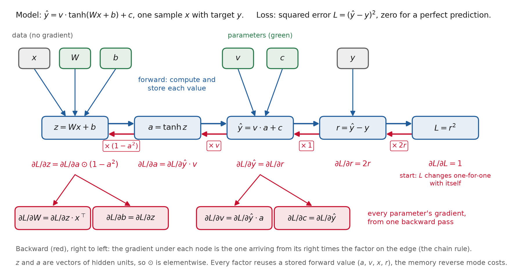
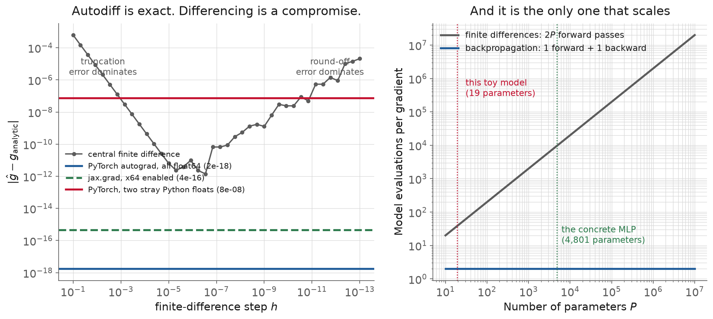
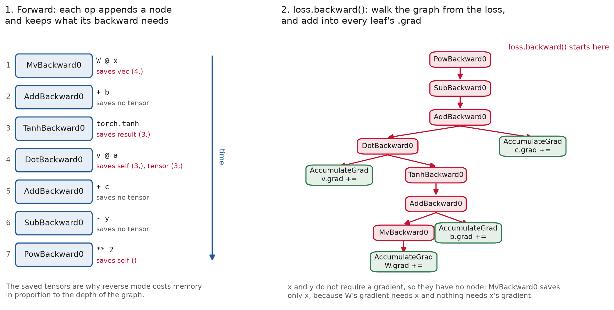
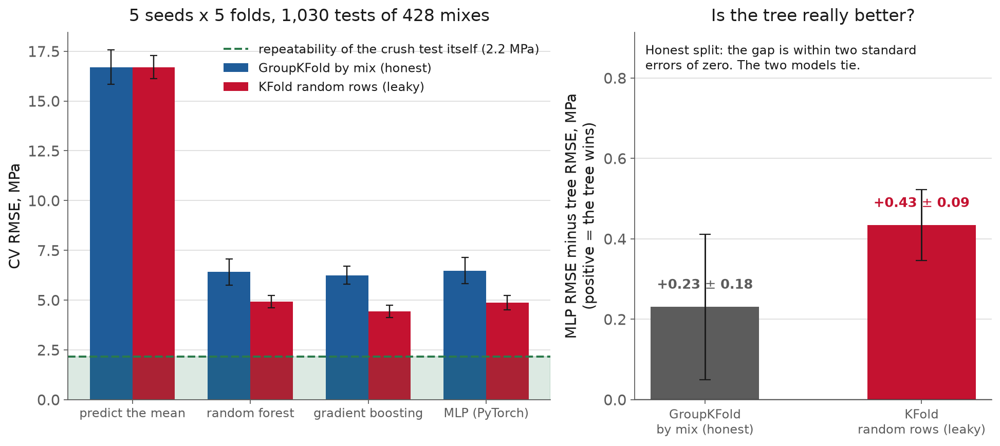
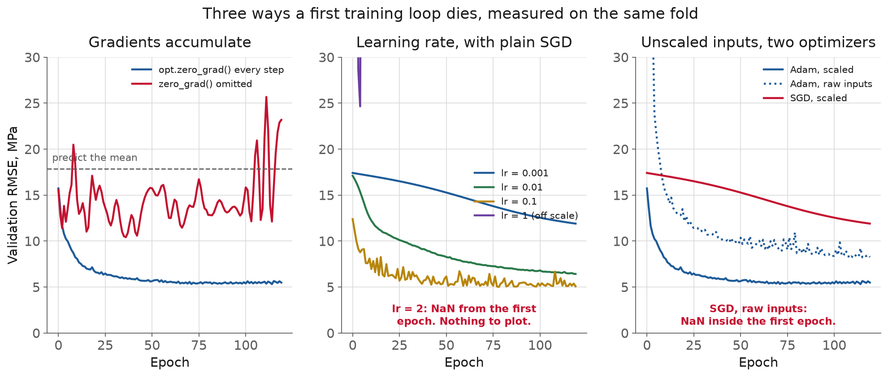
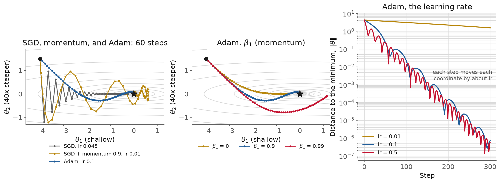
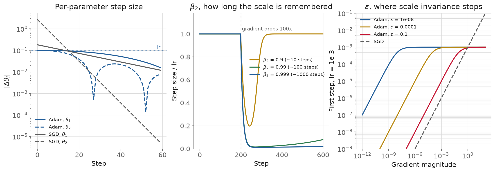
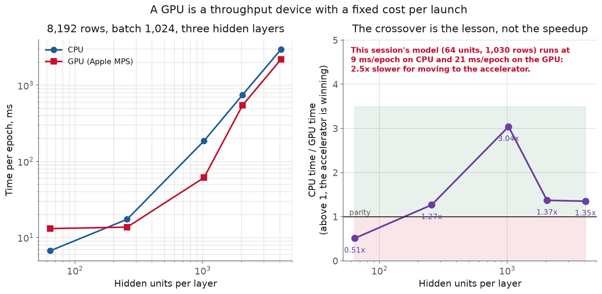

<!-- _class: title -->

# Lecture 11: Tensors, autodiff, training loops, GPUs

## Week 6, Machine learning and deep learning

**Systems and Toolchains for AI Engineers**

---

## Roadmap

1. Automatic differentiation, the idea under every framework
2. PyTorch and JAX, two designs for the same mathematics
3. Tensors: shapes, dtypes, indices, and a first story
4. Models that looked fine: two more stories
5. The training loop, and what Adam's knobs do
6. Accelerators, and when they lose

<!--
90 minutes of deck, then 20 of notebook and questions.
Budget: AD 12, PyTorch/JAX 18, tensors 14, stories 18, loop + Adam 15, devices 8, recap 5.
Four clicker questions: slides marked "a question". Each takes about 3 minutes with the re-vote.
Dataset all session: UCI concrete compressive strength, 1,030 rows, 8 inputs, MPa out.
If running long, cut the Adam-steps slide and the side-by-side table, never a story.
-->

---

<!-- _class: section -->

# Automatic differentiation

---

## Automatic differentiation

- Training needs $\partial L / \partial \theta$ for **every** parameter, every step
- Millions of parameters, one scalar loss
- Three ways to get a derivative:
  - Symbolic algebra: exact, but expressions blow up
  - Finite differences: 2 evaluations **per parameter**, and approximate
  - Automatic differentiation: exact, about **2 forward passes total**

<div class="definition">

**Automatic differentiation**: the chain rule applied to each elementary operation a program actually executed.

</div>

<!-- Open with the scale problem. The answer is the chain rule, done by bookkeeping. -->

---

## Automatic differentiation, a network small enough to do by hand

$$
z = Wx + b, \quad a = \tanh(z), \quad \hat{y} = v \cdot a + c, \quad L = (\hat{y} - y)^2
$$

One hidden layer. Data: input $x$, target $y$. Parameters: $W, b, v, c$. Loss: squared error.
Chain rule, one step at a time, each reusing the last:

$$
\frac{\partial L}{\partial \hat{y}} = 2(\hat{y} - y), \quad
\frac{\partial L}{\partial a} = \frac{\partial L}{\partial \hat{y}}\, v, \quad
\frac{\partial L}{\partial z} = \frac{\partial L}{\partial a} \odot (1 - a^2), \quad
\frac{\partial L}{\partial W} = \frac{\partial L}{\partial z}\, x^{\top}
$$

$1 - a^2$ is the derivative of $\tanh$, and it needs $a$ from the forward pass

<!-- Write these on the board if there is one. Point out that 1 - a^2 needs a, the stored forward value. -->

---

## Automatic differentiation, the graph



<!--
Walk the red arrows right to left from dL/dL = 1: gradient arriving from the right, times the factor on the edge. Two things to say:
1. One backward walk gives every parameter's gradient, because the loss is a scalar.
2. The backward pass needs a and x from the forward pass. That is why training uses more memory than inference.
-->

---

## Automatic differentiation, reverse and forward mode

| | reverse mode | forward mode |
|---|---|---|
| direction | output back to inputs | inputs forward to outputs |
| one pass gives | gradient of **one output** w.r.t. all inputs | derivative of all outputs along **one input** |
| wins when | many parameters, one loss | few inputs, many outputs |
| JAX | `jax.vjp`, `jax.grad`, `jacrev` | `jax.jvp`, `jacfwd` |
| PyTorch | `loss.backward()`, `torch.func.vjp` | `torch.func.jvp` |

Training is reverse mode. A 3-variable simulator with 1,000 outputs is forward mode.

<!-- In deep learning, reverse mode is called backpropagation. Baydin et al. 2018 has the history: https://arxiv.org/abs/1502.05767 -->

---

## Automatic differentiation, against finite differences



- Best finite difference over 40 steps: 1.4 × 10⁻¹², and the best step is unknowable in advance
- It also costs 2 evaluations per parameter: **use it only to spot-check autodiff**

<!--
The V: truncation error on the right, round-off on the left. You only know where the bottom is
because the exact answer was available. PyTorch 1.7e-18, JAX 4.4e-16 (x64). Leave the red "careless" line for now; it is the first story.
-->

---

<!-- _class: section -->

# PyTorch and JAX

---

## PyTorch and JAX, two designs

| | PyTorch | JAX |
|---|---|---|
| idea | **record** what the code did to tensors | **transform** the function you wrote |
| gradient | `loss.backward()` fills `.grad` | `jax.grad(f)` returns a new function |
| state | inside the module and optimizer | values you pass in and get back |
| arrays | mutable | immutable |

Same numbers either way: the two agree to 4.4 × 10⁻¹⁶, float64 epsilon.

Docs: [autograd mechanics](https://docs.pytorch.org/docs/stable/notes/autograd.html), [JAX key concepts](https://docs.jax.dev/en/latest/key-concepts.html)

<!-- The rest of this section is the consequence of the first row. -->

---

## PyTorch and JAX, the PyTorch tape



Read off a real `loss.grad_fn`. Rebuilt from scratch on every call: **define-by-run**.

<!--
Left: seven nodes in the order the forward pass made them, and what each saved.
Right: the graph backward() walks. Point at AccumulateGrad at the bottom: += into .grad.
x and y get no nodes because nobody asked for their gradient.
-->

---

## PyTorch and JAX, `.grad` accumulates

```python
loss = loss_fn(model(x), y)
loss.backward()                  # AccumulateGrad: W.grad += dL/dW
```

- The leaves of the tape **add** into `.grad`; they do not overwrite it
- Deliberate: split a big batch into micro-batches, `backward()` each, step once
- The cost: every loop must clear it, `optimizer.zero_grad()`

<div class="definition">

**Gradient accumulation**: summing gradients from several backward passes before one optimizer step.

</div>

---

## PyTorch and JAX, a question

<div class="clicker" data-tag="l11-accumulate" data-seconds="45" data-answer="C" data-hint="Look at what the leaves of the tape do to .grad on the previous slide: add, or overwrite?" data-why="C. AccumulateGrad adds into .grad, so the second call adds the same gradient again. The demo measures the ratio at exactly 2.0." data-read="https://clicker.f26-06763.workers.dev">
<div class="clicker-main">

**You call `loss.backward()` twice on the same loss (with `retain_graph=True`), with no `zero_grad()` in between. What is `W.grad` now?**

<ol class="clicker-opts">
<li>The same gradient as after one call</li>
<li>Zero, the second call cancels the first</li>
<li>Exactly twice the gradient</li>
<li>An error: a gradient can only be computed once</li>
</ol>

</div>
<aside class="clicker-panel">

<div class="clicker-url">clicker.f26-06763.workers.dev</div>
<button class="clicker-start">Start voting</button>
<div class="clicker-timer">45</div>
<div class="clicker-count">no votes yet</div>
</aside>
</div>

<!-- retain_graph is there so D is wrong for the right reason. Without it the second call errors because the saved tensors were freed, which is a good aside if someone asks. -->

---

## PyTorch and JAX, why switch the tape off

The tape keeps **every intermediate** until `backward()` uses it. No `backward()`, no release.

```python
total = 0
for x, y in val_loader:
    loss = loss_fn(model(x), y)
    total += loss          # keeps this batch's whole graph alive
```

| 1,024-unit MLP, 50 validation batches | memory held |
|---|---|
| `total += loss` | **478 MB**, growing ~10 MB per batch |
| `total += loss.item()` | 8 MB (the last batch's graph) |
| inside `torch.no_grad()` | 0 MB |

<!-- Measured on this laptop's MPS GPU, torch 2.7. One forward pass at batch 8,192 holds 67 MB with the tape, 0.03 MB without. The session's 64-unit model holds 0.8 MB, which is why nobody notices on a small problem: this is the out-of-memory crash halfway through an epoch on a real one. -->

---

## PyTorch and JAX, when to switch the tape off

| scenario | why | how |
|---|---|---|
| validation, test, serving | no gradient coming; the graph is pure memory | `with torch.no_grad():` |
| a hand-written update | `W -= lr * W.grad` **raises**: in-place on a leaf | inside `no_grad()`, as `optimizer.step()` does |
| part of the model frozen | pretrained layers, a target that must not move | `p.requires_grad_(False)`, `.detach()` |

`torch.inference_mode()` is a stricter, slightly faster `no_grad()` for serving.

<!-- The in-place error text: "a leaf Variable that requires grad is being used in an in-place operation." If it were allowed, the update itself would be recorded as part of the model. -->

---

## PyTorch and JAX, switching the tape off

```python
model.eval()                 # dropout off, batch norm uses running statistics
with torch.no_grad():        # record nothing
    total = sum(loss_fn(model(x), y).item() for x, y in val_loader)
model.train()                # back to training behavior
```

- `eval()` and `no_grad()` are **different switches**: layers versus the tape. Evaluation needs both
- Forget `eval()`: a validation score another script cannot reproduce
- JAX: nothing is recorded outside `jax.grad`, and arrays are immutable, so only freezing needs code: `jax.lax.stop_gradient(x)`

<!-- Students conflate these two constantly. no_grad is about the tape; eval is about layer behavior. -->

---

## PyTorch and JAX, a JAX gradient is a function

```python
def loss(params, x, y):
    a = jnp.tanh(params["W"] @ x + params["b"])
    return (params["v"] @ a + params["c"] - y) ** 2

grads = jax.grad(loss)(params, x, y)   # same structure as params
```

- No tape, no `.grad`, **nothing to zero**
- `jax.grad(jax.grad(f))` differentiates twice; `jax.jit` compiles it through [XLA](https://openxla.org/xla)

<!-- Same network as the graph slide. grads is a dict with W, b, v, c. -->

---

## PyTorch and JAX, the jaxpr

```text
g = dot_general a e      # W @ x
h = add g b              # + b
i = tanh h
j = dot_general d i      # v · a
k = add j c
l = sub k f              # - y
m = integer_pow[y=2] l
```

- `jax.make_jaxpr(loss)` prints this: **7 equations**, the same 7 nodes as PyTorch's tape
- `jax.grad` rewrites it into a **16-equation** program: forward and backward together

Docs: [Understanding jaxprs](https://docs.jax.dev/en/latest/jaxpr.html)

---

## PyTorch and JAX, limits of tracing

- JAX calls your function once with placeholders and writes down one path
- A Python `if` on an array's **value** cannot be traced: use `jax.lax.cond`
- A data-dependent loop: `jax.lax.while_loop`
- The function must be **pure**: a `print` or list append runs once, at trace time
- Arrays are immutable: `x[0] = 1.0` is a `TypeError`, use `x = x.at[0].set(1.0)`

PyTorch pays none of this. Define-by-run means any Python works.

---

## PyTorch and JAX, `vmap` and `jit`

`vmap`: write it for **one** example, map the batch axis. Agrees with a Python loop over 256 examples to **2.2 × 10⁻¹⁵**.

| `jit` on | eager | jit | |
|---|---|---|---|
| one 512×512 matmul + `tanh` | 2.8 ms | 3.6 ms | **0.8×** |
| elementwise chain, 2M floats | 16.8 ms | 14.6 ms | 1.2× |
| 10-step `lax.fori_loop` | 83.3 ms | 30.3 ms | **2.8×** |

Compilation pays where there are many small operations to fuse.

<!-- A single matmul is already one BLAS call; jit only adds dispatch. Wall-clock on a laptop: a rerun gave 1.2x and 4.3x for the ends. Trust the order. -->

---

## PyTorch and JAX, side by side

| | PyTorch | JAX |
|---|---|---|
| default float | float32 | float32 |
| float64 | on request (`dtype=`, `set_default_dtype`); not on Apple MPS | only with `jax_enable_x64`; else truncated |
| batch | leading dimension in every module | `vmap` over a per-example function |
| compile | `torch.compile`, optional | `jax.jit`, the normal path |
| transforms | `torch.func.grad`, `vmap`, `jvp` | `grad`, `vmap`, `jvp`, native |
| randomness | global, `torch.manual_seed` | explicit keys, `jax.random.split` |
| optimizers | `torch.optim` | [optax](https://optax.readthedocs.io/en/latest/) |

The gap is now mostly defaults: PyTorch starts eager and opts in; JAX starts functional.

---

<!-- _class: section -->

# Tensors, shapes and dtypes

---

## Tensors, what a tensor is

<div class="definition">

**Tensor**: an n-dimensional array with a shape, a dtype and a device, which in PyTorch can also record the operations applied to it.

</div>

- Batch first: `(N, features)`, `(N, channels, time)`
- Broadcasting follows NumPy: trailing dimensions line up, size 1 stretches
- Broadcasting raises no error when shapes are compatible, even when the result is not what you meant

---

## Tensors, a question

<div class="clicker" data-tag="l11-shape" data-seconds="45" data-answer="C" data-hint="Line up the trailing dimensions: 1 against 64. What does a size-1 dimension do under broadcasting?" data-why="C. (64, 1) against (64,) broadcasts to (64, 64): every prediction minus every target. The mean of that is minimized by predicting the batch mean." data-read="https://clicker.f26-06763.workers.dev">
<div class="clicker-main">

**The model returns predictions shaped `(64, 1)`. The targets are `(64,)`. What shape is `pred - target`?**

<ol class="clicker-opts">
<li><code>(64, 1)</code></li>
<li><code>(64,)</code></li>
<li><code>(64, 64)</code></li>
<li>An error: the shapes do not match</li>
</ol>

</div>
<aside class="clicker-panel">

<div class="clicker-url">clicker.f26-06763.workers.dev</div>
<button class="clicker-start">Start voting</button>
<div class="clicker-timer">45</div>
<div class="clicker-count">no votes yet</div>
</aside>
</div>

<!-- The broadcasting rule is on the previous slide. Expect a lot of D. This is the bug behind a model in the notebook that learned a constant: nn.MSELoss on these shapes averages every prediction minus every target. -->


---

## Tensors, reading a shape error

```python
model = nn.Sequential(nn.Linear(8, 64), nn.ReLU(), nn.Linear(64, 1))
model[2](x)    # x: 32 mixes x 8 features, but the first layer was skipped
```

`mat1 and mat2 shapes cannot be multiplied (32x8 and 64x1)`

| piece | what it is |
|---|---|
| `mat1`, 32x8 | **your input**: 32 rows, 8 features |
| `mat2`, 64x1 | **the layer's weight**, transposed: it expects 64 features |
| the rule | inner dimensions must agree, and 8 ≠ 64 |

Fix the model, not the input: a skipped layer, or a stale `in_features`.

<!-- nn.Linear(64, 1) stores weight (1, 64) and computes x @ W.T, which is why mat2 reads 64x1. Batch 32 on purpose: with a batch of 64 the two 64s read alike and the message is much harder to parse. The tempting wrong fix is x.reshape(...) until it runs. -->

---

## Tensors, default dtypes disagree

| call | dtype |
|---|---|
| `np.array(3.14)` | float64 |
| `torch.tensor(3.14)` | **float32** |
| `torch.tensor(np.float64(3.14))` | float64 |
| `jnp.asarray(np.ones(3))`, x64 off (the default) | **float32**, no warning |

- Mixing float32 with float64 gives float64, so **every dtype downstream reads float64**
- JAX: `jax.config.update("jax_enable_x64", True)` before any array exists

---

## Tensors, JAX will not raise

- Out-of-bounds read **clamps**: `jnp.arange(3.0)[10]` returns `2.0`
- Out-of-bounds write `.at[10].set(v)` is **silently dropped**
- Raising from compiled accelerator code is expensive, so JAX does not

Read before writing any JAX: [the Sharp Bits](https://docs.jax.dev/en/latest/notebooks/Common_Gotchas_in_JAX.html)

---

## Story 1, the gradient that disagreed

A story: code that ran, a number that looked fine, then the cause. Three today.

**How it looked**

- Autodiff checked against a hand-derived gradient, in float64
- JAX agrees to **4.4 × 10⁻¹⁶**
- PyTorch disagrees at **7.5 × 10⁻⁸**
- Every `tensor.dtype` printed: `float64`
- Conclusion drafted: "PyTorch's autograd is less precise"

<!-- This happened while the notes were being written. The figure was going to say "both match to machine precision". -->

---

## Story 1, a question

<div class="clicker" data-tag="l11-dtype" data-seconds="45" data-answer="B" data-hint="The default-dtypes slide: what does torch.tensor do with a bare Python float, and what does promotion do to the dtypes you print afterwards?" data-why="B. Two Python floats became float32 tensors. Promotion made everything downstream float64, so every printed dtype looked right. The error, 1.25e-7, is float32 epsilon." data-read="https://clicker.f26-06763.workers.dev">
<div class="clicker-main">

**PyTorch is off by 7.5e-8, JAX by 4.4e-16, and every dtype prints float64. Most likely cause?**

<ol class="clicker-opts">
<li>PyTorch's autograd is less careful numerically than JAX's</li>
<li>A value entered as float32 somewhere, and promotion hid it</li>
<li>The hand-derived gradient was copied wrong</li>
<li>Non-deterministic GPU kernels</li>
</ol>

</div>
<aside class="clicker-panel">

<div class="clicker-url">clicker.f26-06763.workers.dev</div>
<button class="clicker-start">Start voting</button>
<div class="clicker-timer">45</div>
<div class="clicker-count">no votes yet</div>
</aside>
</div>

<!-- D is ruled out: it ran on the CPU. C is ruled out because JAX matched the same reference. -->

---

## Story 1, debugged

- Two scalars were Python floats: `1.234`, and a bare `rng.normal()`
- `torch.tensor` stored both as **float32**
- The fingerprint: relative error **1.25 × 10⁻⁷**, float32 epsilon to two figures
- Fixed, `dtype=torch.float64` on both: **1.7 × 10⁻¹⁸**

**Check dtypes where data enters, not after.** An error near 10⁻⁷ means float32.

<!-- The red line on the finite-difference figure is this bug. Checking tensor.dtype at the end would never have found it. -->

---

<!-- _class: section -->

# Models that looked fine

---

## Models that looked fine, the setup

**Predict concrete strength** from the mix and its age: 1,030 rows, 8 inputs, a crush test that takes weeks

| any real model must beat | a working MLP gets |
|---|---|
| **17.9 MPa**: predict the training mean for every row | **5.5 MPa** |

- 428 mixes; **76%** of rows belong to a mix tested at more than one age
- Each story, like story 1: the code as written, the number, why it looked fine, the cause, the fix

<!-- Keep 17.9 in view: it is the number every broken model gets compared with. The mix structure is what story 2 turns on. Numbers: fold 0 of a GroupKFold by mix (Lecture 9). -->

---

## Story 2, the tree that won

```python
folds = KFold(5, shuffle=True, random_state=0).split(X)
for seed in range(5):
    for tr, va in folds:
        tree = HistGradientBoostingRegressor(random_state=seed).fit(X[tr], y[tr])
        net  = train(X[tr], y[tr], X[va], y[va], seed=seed)
```

- Gradient boosting **4.44 MPa**, MLP **4.87**: the tree wins by 0.43 ± 0.09, nearly five standard errors
- Five seeds, five folds, matches the received wisdom. **Where is the bug?**

<!-- Give them a minute. The answer is the first line, and nothing in the output points at it. -->

---

## Story 2, debugged

- Under `KFold`, **75%** of validation rows share a **mix** with training: the same concrete at another age
- `GroupKFold` by mix: tree **6.25**, MLP **6.48**, a **tie**; the leak was worth 1.81 MPa to the tree, 1.61 to the net



<!--
Nothing about either model changed, only the split.
Part of "trees beat nets on small tabular data" was, here, a statement about the split.
A single-seed version of this showed the MLP winning. Five seeds: a tie.
-->

---

## Story 2, what about the leaky scaler?

The textbook leak: `StandardScaler` fitted on all rows before splitting (Lecture 7)

| scaler fitted on | RMSE, 3 seeds × 5 folds |
|---|---|
| training rows only | 6.27 MPa |
| all rows (leaky) | 6.23 MPa |
| difference | −0.04 ± 0.06 |

- Eight means and eight standard deviations barely move. Still a bug
- **The leak that changed the conclusion was the split**
- Grinsztajn et al., [45 datasets](https://arxiv.org/abs/2207.08815): trees do lead on tabular data. Check the split before crediting the model family

<!-- I expected the scaler to be the story. Measured, it is noise here. Say that honestly. -->

---

## Story 3, the noisy run

```python
for xb, yb in loader:
    loss = loss_fn(model(xb), yb)
    loss.backward()
    opt.step()
```

- No NaN, no exception; validation RMSE wanders between 10 and 17 MPa, under the 17.9 baseline
- Reads as "noisy, lower the learning rate". **Where is the bug?**

<!-- Four lines. The missing one is opt.zero_grad(). The clicker earlier was the same fact. -->

---

## Story 3, debugged



No `opt.zero_grad()`: `.grad` sums every past step, so each update follows the sum of all past gradients. Ends at **23.2 MPa**, worse than the mean. Fixed: **5.5**.

<!--
Left panel. Where it ends depends on where you stop; several epochs earlier it sat near 12.
The notebook prints the size of .grad step by step with and without zeroing.
Middle and right panels come back in the loop section.
-->

---

## Models that looked fine, what caught each

| story | looked like | caught by |
|---|---|---|
| dtype | a library difference | an exact reference, 10⁻⁷ fingerprint |
| leaky split | trees beat nets | a split grouped by mix |
| no `zero_grad` | a noisy learning rate | reading the loop |
| target shape `(N,)` | a weak first model | the mean baseline, prediction spread |
| raw inputs + Adam | a respectable model | the input scales, or trying SGD |

None raised an error. All four models, rerun and taken apart: <a href="../../lectures/l11/l11-four-models.html">`l11-four-models.ipynb`</a>

<!-- The last two rows are in the notebook only: target shape 17.7 -> 5.5 MPa with predictions spread 0.26 MPa and 1,560 warnings; Adam on raw inputs 8.3 -> 5.5, SGD on the same inputs NaN in the first epoch. -->

---

<!-- _class: section -->

# The training loop

---

## The training loop, PyTorch

```python
for epoch in range(n_epochs):
    model.train()
    for xb, yb in loader:
        xb, yb = xb.to(device), yb.to(device)
        loss = loss_fn(model(xb), yb)   # forward
        optimizer.zero_grad()           # clear the accumulator
        loss.backward()                 # backward
        optimizer.step()                # update
```

- One optimizer step per mini-batch; an **epoch** is one pass over the rows
- Four objects: `DataLoader`, `nn.Module`, loss function, optimizer. Story 3 was one missing line here

---

## The training loop, JAX and optax

```python
@jax.jit
def step(params, opt_state, xb, yb):
    loss, grads = jax.value_and_grad(loss_fn)(params, xb, yb)
    updates, opt_state = optimizer.update(grads, opt_state, params)
    return optax.apply_updates(params, updates), opt_state, loss
```

- No `zero_grad`, no `.to(device)`: state goes in and comes out
- Same network, same fold, 5 seeds: PyTorch **5.70 ± 0.29**, JAX **5.66 ± 0.24** MPa

---

## The training loop, Adam

$$
m_t = \beta_1 m_{t-1} + (1-\beta_1) g_t, \qquad v_t = \beta_2 v_{t-1} + (1-\beta_2) g_t^2
$$
$$
\theta_t = \theta_{t-1} - \eta\, \frac{\hat{m}_t}{\sqrt{\hat{v}_t} + \epsilon}, \qquad \hat{m}_t = \frac{m_t}{1-\beta_1^t},\ \hat{v}_t = \frac{v_t}{1-\beta_2^t}
$$

<div class="definition">

**Adam**: momentum on the gradient, divided by a running root-mean-square of the gradient, so each parameter gets its own step size.

</div>

$g_t$ gradient, $\eta$ learning rate, $m_t$ and $v_t$ running averages (this $v$ is Adam's, not the network's). [Kingma and Ba, 2015](https://arxiv.org/abs/1412.6980)

---

## The training loop, what Adam's knobs do



Narrow bowl, 40× steeper in $\theta_2$. Adam's first step is $\eta$ in **both** coordinates; SGD's are 0.18 and 2.7.

<!--
Left: SGD zig-zags, momentum curls, Adam walks diagonally. This per-coordinate rescaling is why Adam survived raw inputs in the notebook's fourth model (8.3 MPa, where SGD gave NaN), and why it hid the bug.
Middle: beta1 = 0.99 overshoots, loss 5.3 after 100 steps vs 0.0011.
Right: lr = 0.01 is still 1.6 away after 300 steps.
Rotate the bowl 45 degrees and Adam's loss goes from 0.0011 to 1.1: it rescales axes, it cannot unrotate.
-->

---

## The training loop, $\beta_2$ and $\epsilon$



Gradient drops 100× at step 200: with $\beta_2 = 0.999$ the step collapses about 60× for hundreds of steps. Large $\epsilon$ turns Adam back into SGD.

<!-- Bias correction: without it the first step is about 3.2 times the learning rate. Cut this slide if short on time. -->

---

## The training loop, defaults that differ

| | `torch.optim` | `optax` |
|---|---|---|
| Adam learning rate | 1e-3 | **required** |
| $\beta_1$, $\beta_2$, $\epsilon$ | 0.9, 0.999, 1e-8 | 0.9, 0.999, 1e-8 |
| AdamW weight decay | **0.01** | **0.0001** |

- AdamW decays the weights outside the adaptive scaling ([Loshchilov and Hutter](https://arxiv.org/abs/1711.05101))
- Port with defaults and the regularization changes **100×**, silently

---

## The training loop, the learning rate

SGD on the same fold, 120 epochs:

| lr | 0.001 | 0.01 | 0.1 | 1.0 | 2.0 |
|---|---|---|---|---|---|
| RMSE, MPa | 11.9 | 6.4 | 5.1 | 91 | `nan` from epoch 1 |

- At **lr = 1.0**, six seeds: `nan` in two, 91 to 1,235 MPa in the other four
- Stable is a property of *this initialization*. One surviving run proves little

---

<!-- _class: section -->

# Accelerators

---

## Accelerators, the rules

- PyTorch: `model.to(device)`, `x.to(device)`; mismatch is a loud error, the good case
- JAX: arrays go to the default device; `jax.devices()` shows it
- `.cpu()` or `print` inside the loop forces a sync and serializes everything
- GPU calls return when **queued**: time with `torch.cuda.synchronize()` or `x.block_until_ready()`
- A GPU has a **fixed cost per kernel launch**; it pays only with enough arithmetic behind each launch

---

## Accelerators, a question

<div class="clicker" data-tag="l11-gpu" data-seconds="45" data-answer="D" data-hint="Last slide: a fixed cost per kernel launch. How much arithmetic does a 64-unit MLP on 1,030 rows put behind each launch?" data-why="D. 8.6 ms per epoch on the CPU, 21.1 ms on the GPU. The launch overhead is larger than the arithmetic for a model this small." data-read="https://clicker.f26-06763.workers.dev">
<div class="clicker-main">

**Today's MLP (two hidden layers of 64, 1,030 rows) moves from the laptop CPU to its GPU. Time per epoch?**

<ol class="clicker-opts">
<li>About 10× faster</li>
<li>About 3× faster</li>
<li>About the same</li>
<li>About 2.5× slower</li>
</ol>

</div>
<aside class="clicker-panel">

<div class="clicker-url">clicker.f26-06763.workers.dev</div>
<button class="clicker-start">Start voting</button>
<div class="clicker-timer">45</div>
<div class="clicker-count">no votes yet</div>
</aside>
</div>

---

## Accelerators, the crossover



Today's model: **8.6 ms per epoch on the CPU, 21.1 ms on the GPU**. The GPU wins past a few hundred hidden units.

<!--
Apple MPS on a laptop. A datacenter CUDA card moves the crossover and raises the plateau; it does not remove the fixed cost.
Minimum over repeated trials, because interference only ever makes a timing slower.
Debug on CPU with a tiny subset, then launch the real run on the GPU.
-->

---

## Trade-offs

| | PyTorch | JAX |
|---|---|---|
| strongest at | standard architectures, pretrained models, deployment | differentiating simulators, ODE solves, physical models |
| composes | eager code, plus `torch.func` and `torch.compile` | `vmap(grad(f))`, `jax.hessian`, one line each |
| costs you | hidden state: `.grad`, `train()`/`eval()`, global seed | purity, `lax.cond`, tracing and recompiles |
| fails quietly with | missing `zero_grad`, float32 from a Python float | float32 by default, clamped indices |

And on 1,030 rows of concrete, gradient boosting ties the MLP in under a second, with no learning rate.

---

<!-- _class: demo -->

# Demo

## `l11-tensors-autograd.ipynb`

A gradient by hand, checked against `backward()` and `jax.grad`. A loop by hand, broken three ways. The same loop on the GPU. Net against tree, under both splits.

<!-- The last 20 minutes, notebook then questions. Ask for a prediction before the net-vs-tree cell prints. -->

---

## Recap

- Reverse-mode AD: every gradient, exactly, for about two forward passes
- PyTorch **records** a tape and accumulates into `.grad`; JAX **transforms** pure functions
- Default float32 in both; check dtypes where data enters
- Three stories, no errors raised; each was caught by a comparison: an exact reference, a grouped split, a correct loop
- Adam gives each parameter its own step size; it tolerates unscaled inputs, and so hides them
- The GPU is 2.5× slower on today's model; measure before you migrate

---

## Standings

Nicknames only. Everyone who skipped one still counted in every bar you saw.

<div class="clicker-leaderboard"
     data-read="https://clicker.f26-06763.workers.dev"
     data-top="8"
     data-hours="6"
     data-title="Standings"></div>

<!--
Skip this slide if no clicker questions were run.
-->

---

## Before you go

**Practice module** for this session, for participation credit
**Reading** [PyTorch: Learn the Basics](https://docs.pytorch.org/tutorials/beginner/basics/intro.html), [JAX Sharp Bits](https://docs.jax.dev/en/latest/notebooks/Common_Gotchas_in_JAX.html), [Grinsztajn et al. 2022](https://arxiv.org/abs/2207.08815)

Full notes, with all sources: `lectures/l11/notes.md`

<script src="clicker-slide.js"></script>
