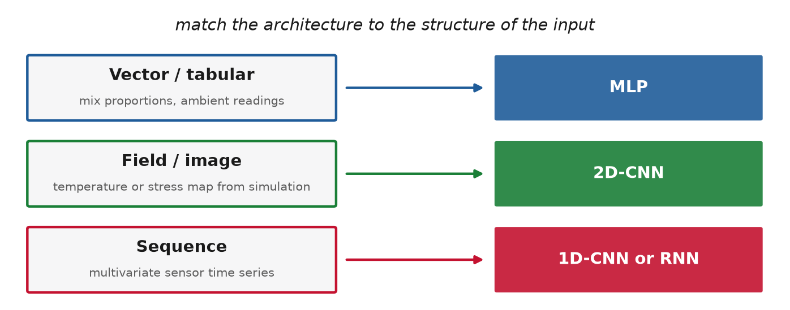
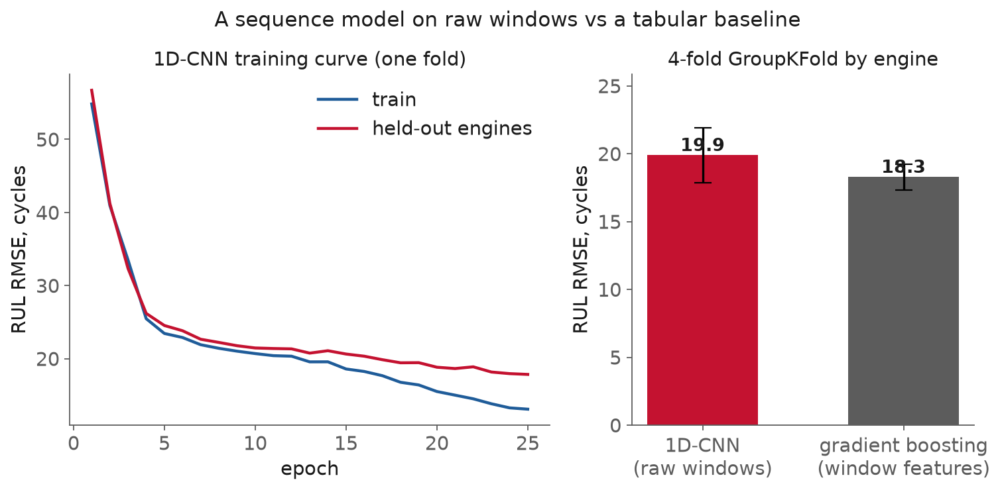

<!-- _class: title -->

# Lecture 12: Architectures for engineering data

## Week 6, Deep learning

**Systems and Toolchains for AI Engineers**

---

## Roadmap

1. Match the architecture to the input
2. MLPs, briefly
3. CNNs for fields and images
4. Sequence models for sensor data
5. Training a deep net well
6. Does the architecture earn its keep?
7. Live demo: a 1D-CNN for turbofan RUL

---

<!-- _class: section -->

# Match the architecture to the input

---

## Match the architecture to the input

An MLP treats its input as a flat vector, no relationships among the numbers.

Right for tabular data. Wrong for data with a shape:

- a temperature field is a grid; a pixel's neighbors matter
- a vibration trace is a sequence; the recent past matters

Flatten either and the model relearns, from scratch, structure you already knew.

---

---

<!-- _class: section -->

# MLPs, briefly

---

## MLPs, briefly

Lecture 11 built one. The choices that shape it:

- **width** and **depth**: capacity, and overfitting past what the data supports
- **activation**: ReLU or GELU, not saturating sigmoids
- **regularizers**: dropout, weight decay, batch/layer norm

Scaling still matters: fit the scaler on **training data only** (Lecture 7). A neural net does not repeal the leakage rules.

---

<!-- _class: section -->

# CNNs for fields and images

---

## CNNs for fields and images

For data on a grid: an image, or a stress / temperature / velocity field from simulation.

- **kernel**: a small grid of weights slid across the input
- **stride, padding**: how it moves, and the border
- **channels**: stacked feature maps
- **pooling**: downsample, so deeper layers see a coarser, wider view

---

## CNNs for fields and images, the receptive field

**Convolution**: apply the same small kernel at every position, so a feature learned in one place is detected everywhere. The **receptive field** is the region of input that can influence a unit.

Goodfellow: convolution leverages **sparse interactions, parameter sharing, and equivariant representations**.

---

## CNNs for fields and images, why fewer parameters

**Parameter sharing**: the same kernel weights are reused at every position, "using the same parameter for more than one function in a model."

An MLP would learn each position's edge detector separately, from far more data.

Encoder-decoder / **U-Net** shapes map a whole field to a whole field.

[Goodfellow, ch. 9](https://www.deeplearningbook.org/), [CS231n](https://cs231n.github.io/convolutional-networks/)

---

<!-- _class: section -->

# Sequence models for sensor data

---

## Sequence models, 1D-CNN and RNN

A sensor time series is a 1D grid, time, with a channel per sensor.

**1D convolution** (`Conv1d`): slide a kernel along time; learn local patterns (a spike, a ramp) and stack them into longer features.

- **Recurrent network** (LSTM, GRU): walk the sequence step by step, carrying a gated hidden state that remembers the past

---

## Sequence models, which one

The reflex was an RNN for anything sequential. That has shifted.

Bai et al. (2018): "a simple convolutional architecture outperforms canonical recurrent networks such as LSTMs across a diverse range of tasks."

- **temporal CNN**: fixed windows, faster (timesteps compute in parallel), the sensible default
- **LSTM / GRU**: genuinely long-range, variable dependence
- **attention / Transformers**: long-range and complex

Normalize on train stats only; never window across a unit boundary (Lecture 8).

---

<!-- _class: section -->

# Training a deep net well

---

## Training a deep net well, the schedule

The learning-rate schedule is the most consequential knob. Large steps early, precise steps late.

- **step**: drop by a factor every few epochs
- **cosine**: anneal smoothly to near zero
- **one-cycle**: up to a max and back down in one run (Smith)

---

## Training a deep net well, the rest

**Early stopping**: stop when validation loss stops improving, keep the best epoch. The cheapest regularizer. Uses the validation split; the test set is still touched once.

- **gradient clipping** (`clip_grad_norm_`): cap the update, matters for RNNs
- **weight decay**: the L2 penalty, renamed
- **checkpointing**: save the best model so a crash does not cost the run

---

## Training a deep net well, reading the curves

| loss curve | diagnosis | fix |
|---|---|---|
| both high, falling slowly | underfitting | more capacity, higher LR |
| train low, val rising | overfitting | regularize, stop earlier |
| oscillating or exploding | bad optimization | lower LR, normalize inputs |

Lecture 11's broken loops were all the third kind, the one mistaken for a modeling problem.

---

<!-- _class: section -->

# Does the architecture earn its keep?

---

## Does the architecture earn its keep?, the setup

**Remaining useful life** on C-MAPSS FD001 turbofans (from Lecture 8):

- sliding **30-cycle windows** over 17 sensor/setting channels
- piecewise-linear RUL target (constant at 125, then linear)
- **GroupKFold by engine**: no engine in both train and validation (Lecture 8)

Two models: a **1D-CNN** on raw windows vs **gradient boosting** on window features (mean, std, last).

---

## Does the architecture earn its keep?, the result

**1D-CNN 19.9 ± 2.0** vs **baseline 18.3 ± 1.0** cycles RMSE, four engine-grouped folds. The quick sequence model does not beat the baseline, and the gap is inside its own spread.

---

## Does the architecture earn its keep?, the lesson

A deep net is **not a default**.

Grinsztajn et al. (45 datasets): "tree-based models remain state-of-the-art on medium-sized data" (~10K samples).

The CNN earns its advantage from **scale**, from **tuning** (schedule, regularization), and from raw structure a hand-crafted feature cannot capture. On a small, well-summarized benchmark, the baseline is the model to beat.

---

<!-- _class: section -->

# Where this pushes back

---

## Where this pushes back

- **A matched architecture is a prior, not a guarantee.** A CNN assumes locality and translation invariance; a global constraint or symmetry can make that a liability.
- **Depth needs data.** A hundred engines is small; parameter sharing reduces but does not remove the appetite. Small data favors a strong classical model.
- **The accelerator is not free** (Lecture 11: GPU 2.5x slower on a small model), and bigger is not better past the capacity the data supports. Debug on CPU.

---

<!-- _class: demo -->

# Demo

## `l12-cnn-rul.ipynb`

C-MAPSS FD001: 30-cycle sensor windows, piecewise-linear RUL, `GroupKFold` by engine. A small 1D-CNN in PyTorch, trained with a schedule and early stopping, per-epoch loss logged to MLflow, best checkpoint saved. Compared against the tabular baseline on the same grouped folds.

---

## What to watch

The comparison, on a grouped split.

The sequence model does not automatically win.

The grouping by engine is what keeps the comparison honest instead of flattering.

---

## Recap

- Match architecture to input structure: vector to MLP, field to 2D-CNN, sequence to 1D-CNN or RNN
- CNN economy = sparse interactions + parameter sharing; the receptive field grows with depth
- Temporal CNN is the sensible default over an RNN for fixed windows
- Train well: LR schedule, early stopping, clipping, weight decay, read the loss curves
- A deep net is not a default; run a strong baseline, grouped by unit

---

## Next

**Assignment 6** (from Lecture 11): build, train, and honestly evaluate a deep model
**Reading** PyTorch CNN/LSTM tutorials; Goodfellow ch. 9-10; Grinsztajn et al.

Full notes, with all sources: `lectures/l12/notes.md`
