<!-- _class: title -->

# Lecture 12: Architectures for engineering data

## Week 6, Deep learning

**Systems and Toolchains for AI Engineers**

---

## Roadmap

1. Match the architecture to the input
2. MLPs, briefly
3. CNNs for fields and images
4. Sequence models for sensor data
5. Training a deep net well
6. Does the architecture earn its keep?
7. Live demo: a 1D-CNN for turbofan RUL

---

<!-- _class: section -->

# Match the architecture to the input

---

## Match the architecture to the input

An MLP treats its input as a flat vector, no relationships among the numbers.

Right for tabular data. Wrong for data with a shape:

- a temperature field is a grid; a pixel's neighbors matter
- a vibration trace is a sequence; the recent past matters

Flatten either and the model relearns, from scratch, structure you already knew.

---

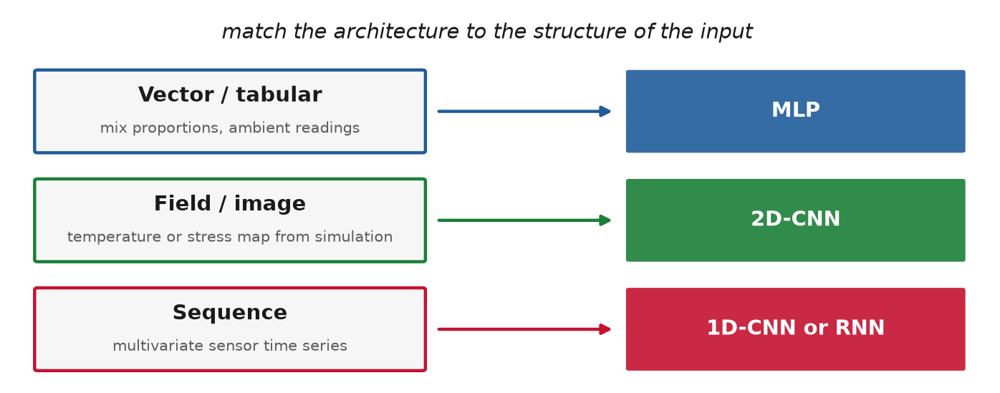

---

<!-- _class: section -->

# MLPs, briefly

---

## MLPs, briefly

Lecture 11 built one. The choices that shape it:

- **width** and **depth**: capacity, and overfitting past what the data supports
- **activation**: ReLU or GELU, not saturating sigmoids
- **regularizers**: dropout, weight decay, batch/layer norm

Scaling still matters: fit the scaler on **training data only** (Lecture 7). A neural net does not repeal the leakage rules.

---

<!-- _class: section -->

# CNNs for fields and images

---

## CNNs for fields and images

For data on a grid: an image, or a stress / temperature / velocity field from simulation.

- **kernel**: a small grid of weights slid across the input
- **stride, padding**: how it moves, and the border
- **channels**: stacked feature maps
- **pooling**: downsample, so deeper layers see a coarser, wider view

---

## CNNs for fields and images, kernel

<div class="cw compact" data-widget="conv2d" data-mode="kernel">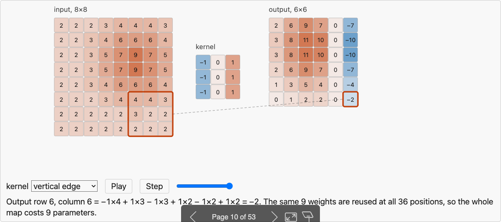</div>

<!-- Play: the box walks the field, one output per position. Step twice and read the sum aloud. Switch to horizontal edge, then blur. Same 9 weights everywhere: 9 parameters for the map. -->

---

## CNNs for fields and images, stride and padding

<div class="cw compact" data-widget="conv2d" data-mode="stride">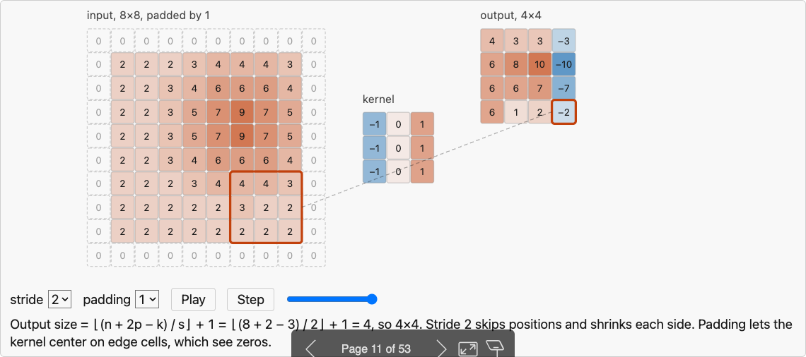</div>

<!-- Start at stride 2, padding 1: 4x4. Set padding 0: 3x3, edge cells never centered. Stride 1, padding 1: 8x8, the 'same' convolution. Formula in the readout. -->

---

## CNNs for fields and images, channels

<div class="cw compact" data-widget="conv2d" data-mode="channels">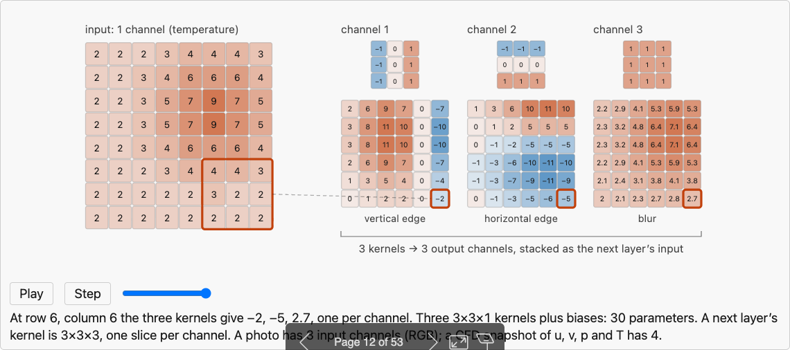</div>

<!-- One input channel, three kernels, three output maps. Next layer's kernel is 3x3x3. Engineering inputs: u, v, p, T from CFD are 4 input channels, the same way RGB is 3. -->

---

## CNNs for fields and images, pooling

<div class="cw compact" data-widget="conv2d" data-mode="pooling">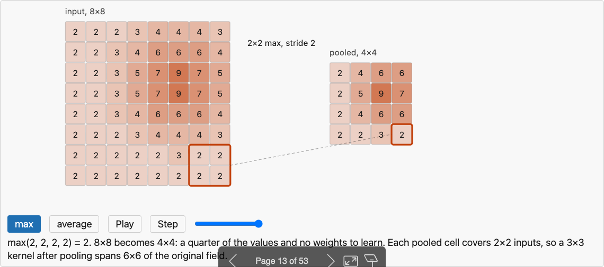</div>

<!-- Max vs average. No weights. 8x8 to 4x4; a 3x3 kernel after pooling spans 6x6 of the original, which is how deep layers get a wide view. -->

---

## CNNs for fields and images, the receptive field

<div class="definition">

**Convolution**: apply the same small kernel at every position, so a feature learned in one place is detected everywhere. The **receptive field** is the region of input that can influence a unit.

</div>

Goodfellow: convolution leverages **sparse interactions, parameter sharing, and equivariant representations**.

---

## CNNs for fields and images, why fewer parameters

<div class="definition">

**Parameter sharing**: the same kernel weights are reused at every position, "using the same parameter for more than one function in a model."

</div>

An MLP would learn each position's edge detector separately, from far more data.

- the kernel slide: **9** weights for all 36 outputs; a dense layer from 8×8 to 6×6 needs 64 × 36 = **2,304**
- the vertical-edge kernel is a finite-difference stencil for ∂T/∂x, summed over three rows ([Prewitt](https://en.wikipedia.org/wiki/Prewitt_operator))

[Goodfellow, ch. 9](https://www.deeplearningbook.org/), [CS231n](https://cs231n.github.io/convolutional-networks/)

---

<!-- _class: section -->

# Sequence models for sensor data

---

## Sequence models, 1D-CNN and RNN

A sensor time series is a 1D grid, time, with a channel per sensor.

<div class="definition">

**1D convolution** (`Conv1d`): slide a kernel along time; learn local patterns (a spike, a ramp) and stack them into longer features.

</div>

- **Recurrent network** (LSTM, GRU): walk the sequence step by step, carrying a gated hidden state that remembers the past

---

## Sequence models, a 1D convolution

<div class="cw compact" data-widget="conv1d" data-source="l12">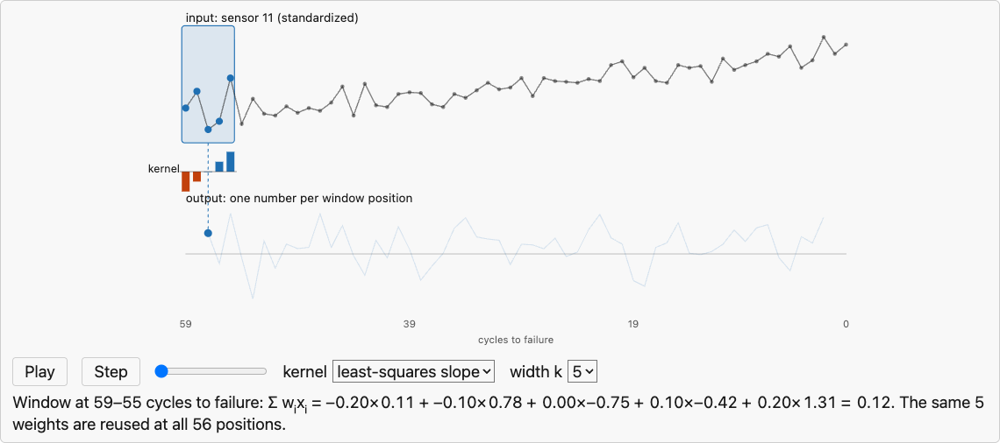</div>

<!-- Step with the slope kernel: output climbs toward failure. Switch to average, then random. Same k weights at every position. -->

---

## Sequence models, the receptive field

<div class="cw compact" data-widget="receptive" data-source="l12">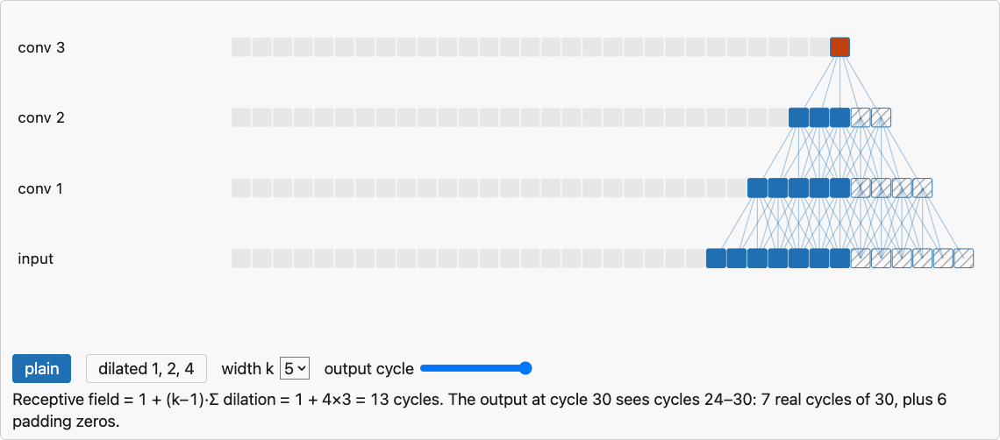</div>

<!-- 3 layers x k=5 = 13 cycles. Last output: 7 real cycles, 6 padding zeros. Toggle dilation: 29 cycles, same weights. -->

---

## Sequence models, recurrence

<div class="cw compact" data-widget="recurrence" data-source="l12">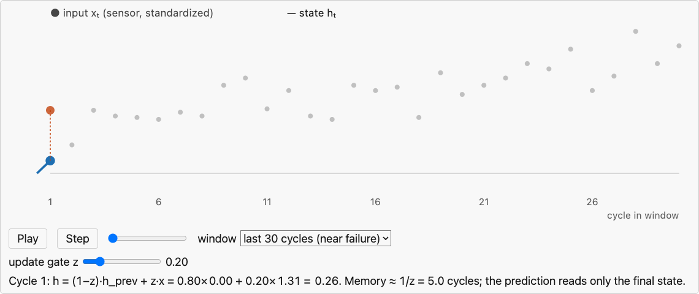</div>

<!-- Play at z=0.2, then drag z to 1 and to 0.05. Memory ~ 1/z. A GRU learns z per step from the input. -->

---

## Sequence models, gradients through time

<div class="cw compact" data-widget="gradient-flow" data-source="l12">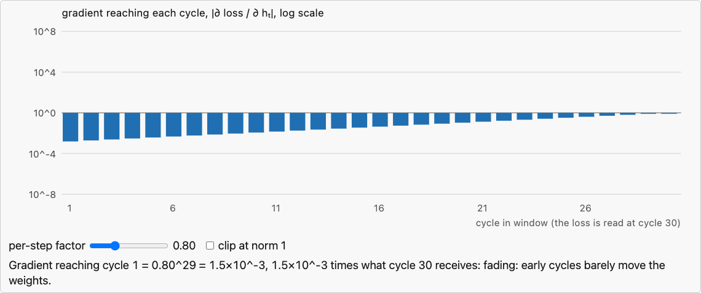</div>

<!-- Factor 0.8: cycle 1 gets ~1e-3. 1.3: explodes; tick clip. Clipping fixes explosion, nothing fixes vanishing; the GRU gate does. -->

---

## Sequence models, four wirings

<div class="cw compact" data-widget="connectivity">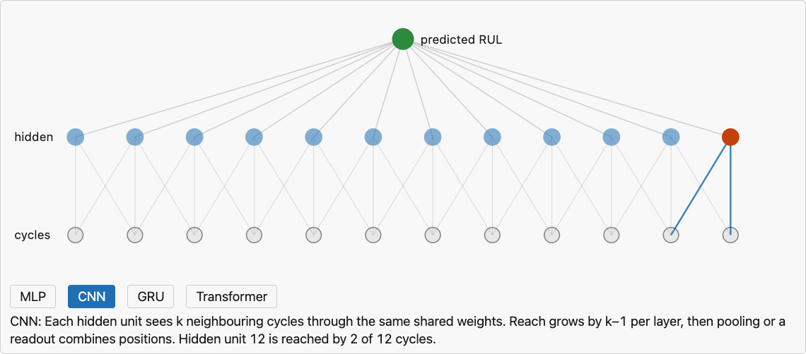</div>

<!-- Click through MLP, CNN, GRU, Transformer; hover the last hidden unit in each. -->

---

## Sequence models, which one

The reflex was an RNN for anything sequential. That has shifted.

Bai et al. (2018): "a simple convolutional architecture outperforms canonical recurrent networks such as LSTMs across a diverse range of tasks."

- **temporal CNN**: fixed windows, faster (timesteps compute in parallel), the sensible default
- **LSTM / GRU**: genuinely long-range, variable dependence
- **attention / transformers**: next, and they assume the least

Normalize on train stats only; never window across a unit boundary (Lecture 8).

---

<!-- _class: section -->

# Attention and transformers

---

## Attention and transformers

<div class="definition">

**Self-attention**: each cycle's output is a weighted average of every cycle, with weights from comparing its query to their keys.

</div>

- every cycle reads every other in one step; weights computed from the data
- "based solely on attention mechanisms, dispensing with recurrence and convolutions entirely" ([Vaswani et al. 2017](https://arxiv.org/abs/1706.03762))
- message passing on a complete graph: $h_i \leftarrow \phi\big(h_i, \sum_{j} \psi(h_i, h_j)\big)$ ([Gilmer et al. 2017](https://arxiv.org/abs/1704.01212))
- a convolution is the same update on a grid, with fixed weights per neighbour

---

## Attention and transformers, one step

$$ s_{ij} = \frac{q_i \cdot k_j}{\sqrt{d}}, \qquad \alpha_{ij} = \mathrm{softmax}_j(s_{ij}), \qquad \text{out}_i = \sum_j \alpha_{ij} v_j $$

- token = one cycle: 14 sensors → linear → 32 numbers
- query $q = W_Q h$, key $k = W_K h$, value $v = W_V h$, all learned
- $\sqrt{d}$ keeps large dot products from saturating the softmax
- 4 heads of 8 dimensions in parallel; then residual, layer norm, per-cycle MLP

---

## Attention and transformers, by hand

<div class="cw compact" data-widget="self-attention" data-source="l12">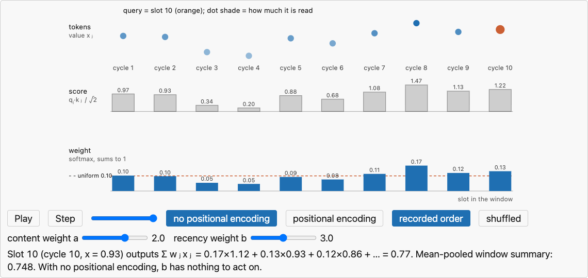</div>

<!-- Step the query. Raise a: weights favour similar values. Toggle "shuffled" with no positional encoding: pooled summary identical. Turn positions on, shuffle: it changes. -->

---

## Attention and transformers, order

<div class="definition">

**Positional encoding**: a vector added to each slot of the window, so the same reading means something different at cycle 3 and cycle 30.

</div>

- without it, attention + averaging is blind to order: a window is a bag of readings
- "we must inject some information about the relative or absolute position" (Vaswani)
- sinusoidal or learned: "nearly identical results"; ours is a learned 30 × 32 table

---

## Attention and transformers, does order matter?

| RMSE (cycles), 5 folds | Recorded | Reversed | Shuffled |
|---|---|---|---|
| Transformer, no positions | 17.87 | 17.87 | 17.87 |
| Transformer, learned positions | 16.23 | 24.88 | 19.36 |
| GRU | 13.91 | **59.32** | 31.25 |

- no positions: identical on every fold; order-blindness is exact
- positions help (1.6 cycles), but the GRU relies on order far more

<!-- experiments.py order, seed 0. Reversed GRU is worse than predicting the mean (41.8). -->

---

## Attention and transformers, in PyTorch

```python
self.inp = nn.Linear(14, 32)
self.pos = nn.Parameter(torch.zeros(1, 30, 32))
layer = nn.TransformerEncoderLayer(32, 4, dim_feedforward=64, dropout=0.1,
                                   batch_first=True, norm_first=True)
self.enc = nn.TransformerEncoder(layer, 2)
self.head = nn.Linear(32, 1)

h = self.enc(self.inp(x.transpose(1, 2)) + self.pos)
return self.head(h.mean(1))
```

18,561 parameters (GRU: 15,425); 960 of them are the position table.

---

## Attention and transformers, what it learned

<div class="cw compact" data-widget="attention" data-source="l12">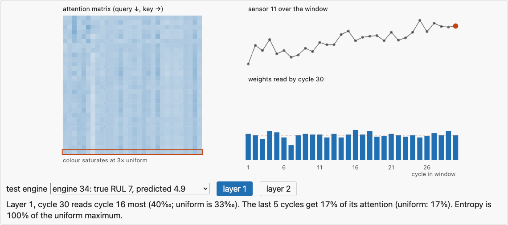</div>

<!-- Layer 1: entropy >= 99% of uniform. Layer 2, near-failure engine: last cycle gives 28% to last 5 cycles vs 17% uniform. Nearly uniform + mean pooling ~ a function of window averages, which boosting gets as features. -->

---

## Attention and transformers, the weakest prior

| | CV RMSE | best epoch | train–val gap |
|---|---|---|---|
| boosted trees | 13.29 | | |
| GRU | 14.03 | 16 | 1.7 |
| transformer | 16.39 | 6 | 3.2 |

- assumes almost nothing, so it must learn order and locality from about 70 engines
- the same weak prior is why it wins at LLM scale
- [Zeng et al. 2023](https://arxiv.org/abs/2205.13504): one linear layer beat five forecasting transformers "in all cases" on nine datasets

<!-- Test set: transformer 16.28, GRU 14.00. Last-cycle readout: 16.16, no help. -->

---

<!-- _class: section -->

# Training a deep net well

---

## Training a deep net well, the schedule

Minibatch gradient = true gradient + noise, and the step scales both. Near the minimum only the noise is left, so a constant rate never settles.

- **step**: drop by a factor every few epochs
- **cosine**: anneal smoothly to near zero ([SGDR](https://arxiv.org/abs/1608.03983), `CosineAnnealingLR`)
- **one-cycle**: up to a max and back down in one run ([Smith](https://arxiv.org/abs/1803.09820))

---

## Training a deep net well, the schedule on a noisy bowl

<div class="cw compact" data-widget="lr-schedule">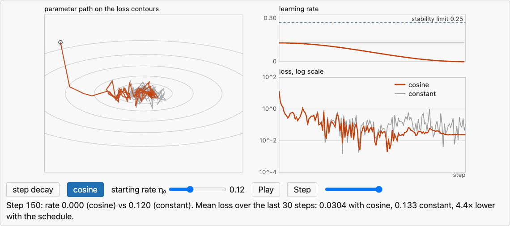</div>

<!-- Same noise for both runs. At 0.12: last-30-step loss 0.030 cosine vs 0.133 constant. Drag the rate above 0.25: constant diverges, the stability limit along the steep axis is 2/8. Toggle step decay. -->

---

## Training a deep net well, the schedule on our GRU

Five seeds, 60 epochs, stopping off; validation RMSE in cycles:

| | cosine | constant |
|---|---|---|
| best epoch, no stopping | 13.01 | 12.91 |
| early stopping, patience 10 | **13.04** | **13.04** |
| last epoch (60) | 14.55 | 15.54 |

The kept epoch is 9 to 17; with `T_max = 60`, cosine is still at **83%** of its rate at epoch 17. Check the rate at the epoch you keep.

<!-- Honest null result. The schedule acts in epochs early stopping throws away. Seed spread is 1.8 cycles, so 13.01 vs 12.91 is a tie. -->

---

## Training a deep net well, early stopping

<div class="definition">

**Early stopping**: stop when validation loss stops improving for *patience* epochs, and keep the best epoch's weights.

</div>

- training error keeps falling; validation turns up once the net fits the training engines
- seed 1: train 12.1 → 9.7, validation 13.4 → **16.1** from epoch 17 to 60
- for a linear model under gradient descent it is L2 regularization ([Goodfellow 7.8](https://www.deeplearningbook.org/contents/regularization.html))
- uses the validation split; the test set is still touched once
- **checkpointing**: keep the best weights on disk, so a crash costs nothing

---

## Training a deep net well, early stopping replayed

<div class="cw compact" data-widget="early-stopping" data-source="l12">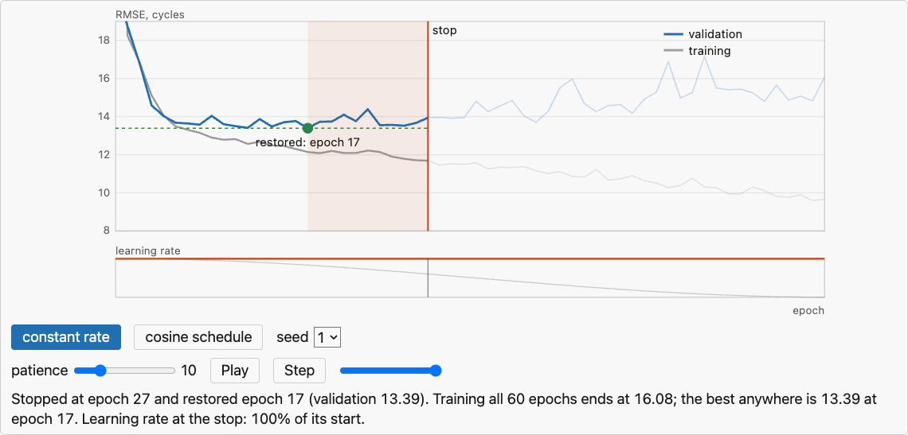</div>

<!-- Play from epoch 1 and watch the counter. Seed 4, constant: patience 10 stops at 27 (13.74); the run reaches 13.06 at epoch 48, which needs patience 24. Is that real on 15 validation engines? Toggle cosine: same stop. -->

---

## Training a deep net well, gradient clipping

$$ g \leftarrow g \cdot \min\left(1, c / \lVert g \rVert\right) $$

- one factor for the whole gradient: **direction kept, length capped**
- `clip_grad_norm_(model.parameters(), c)` between `backward()` and `step()`
- recurrent nets have steep walls in the loss; a step at a wall "would bring us very far" ([Pascanu et al. 2013](https://arxiv.org/abs/1211.5063))
- set `c` above ordinary norms; `clip_grad_norm_` returns the norm, so log it

---

## Training a deep net well, gradient clipping at a wall

<div class="cw compact" data-widget="clipping" data-source="l12">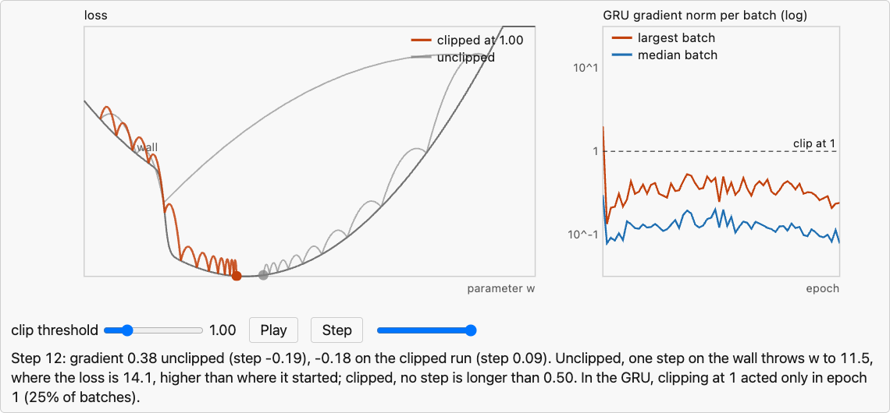</div>

<!-- Unclipped: one step on the wall throws w from 1.5 to 11.5, loss 14.1, worse than the start. Right panel is our GRU: only epoch 1 had batches above 1.0 (a quarter); after that the max is 0.54. Insurance here. -->

---

## Training a deep net well, weight decay

$$ w \leftarrow (1 - \eta\lambda)\, w - \eta \nabla L $$

- the ridge penalty $\tfrac{1}{2}\lambda\lVert w \rVert^2$ from Lecture 9: shrink every weight by a fixed fraction each step
- shrinks most where the data is weakest: factor $\lambda_i/(\lambda_i+\alpha)$ per Hessian direction ([Goodfellow 7.1.1](https://www.deeplearningbook.org/contents/regularization.html))
- `Adam(weight_decay=...)` is coupled L2; `AdamW` is true decay ([Loshchilov and Hutter](https://arxiv.org/abs/1711.05101), Lecture 11)

---

## Training a deep net well, weight decay shrinks the weak direction

<div class="cw compact" data-widget="weight-decay">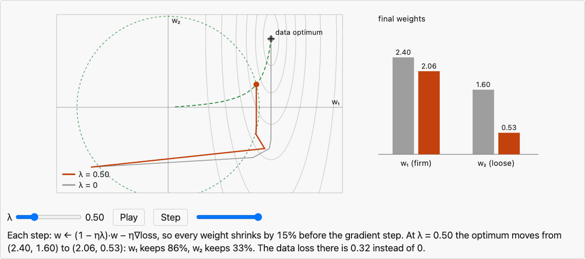</div>

<!-- lambda 0.5: optimum moves (2.40,1.60) -> (2.06,0.53). Firm weight keeps 86%, loose keeps 33%. Drag lambda: the green curve is the optimum for every lambda. -->

---

## Training a deep net well, reading the curves

| loss curve | diagnosis | fix |
|---|---|---|
| both high, falling slowly | underfitting | more capacity, higher LR |
| train low, val rising | overfitting | regularize, stop earlier |
| oscillating or exploding | bad optimization | lower LR, normalize inputs |

Lecture 11's broken loops were all the third kind, the one mistaken for a modeling problem.

---

<!-- _class: section -->

# Does the architecture earn its keep?

---

## Does the architecture earn its keep?, the setup

**Remaining useful life** on C-MAPSS FD001 turbofans (from Lecture 8):

- sliding **30-cycle windows** over 17 sensor/setting channels
- piecewise-linear RUL target (constant at 125, then linear)
- **GroupKFold by engine**: no engine in both train and validation (Lecture 8)

Two models: a **1D-CNN** on raw windows vs **gradient boosting** on window features (mean, std, last).

---

## Does the architecture earn its keep?, the result

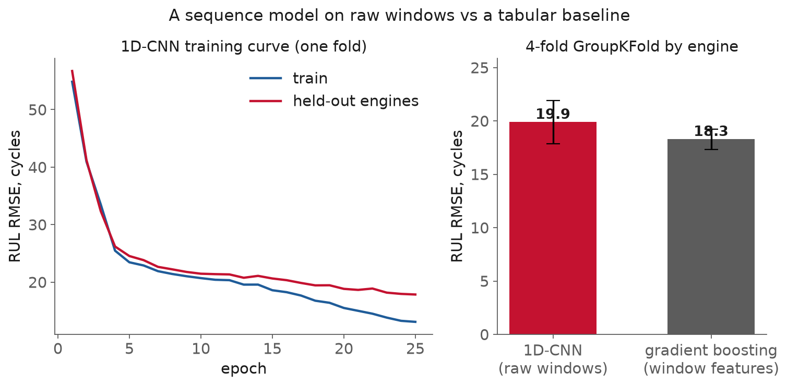

**1D-CNN 19.9 ± 2.0** vs **baseline 18.3 ± 1.0** cycles RMSE, four engine-grouped folds. The quick sequence model does not beat the baseline, and the gap is inside its own spread.

---

## Does the architecture earn its keep?, the lesson

A deep net is **not a default**.

Grinsztajn et al. (45 datasets): "tree-based models remain state-of-the-art on medium-sized data" (~10K samples).

The CNN earns its advantage from **scale**, from **tuning** (schedule, regularization), and from raw structure a hand-crafted feature cannot capture. On a small, well-summarized benchmark, the baseline is the model to beat.

---

<!-- _class: section -->

# Limitations and trade-offs

---

## Limitations and trade-offs

- **An architecture is an assumption to check.** A CNN assumes locality and translation invariance; a global constraint or symmetry can make that a liability.
- **Depth needs data.** A hundred engines is small; parameter sharing reduces but does not remove the appetite. Small data favors a strong classical model.
- **Accelerators and larger models have costs** (Lecture 11: GPU 2.5x slower on a small model). Past the capacity the data supports, more layers buy overfitting. Debug on CPU.

---

<!-- _class: demo -->

# Demo

## `l12-cnn-rul.ipynb`

C-MAPSS FD001: 30-cycle sensor windows, piecewise-linear RUL, `GroupKFold` by engine. A small 1D-CNN in PyTorch, trained with a schedule and early stopping, per-epoch loss logged to MLflow, best checkpoint saved. Compared against the tabular baseline on the same grouped folds.

---

## What to watch

The comparison, on a grouped split.

The sequence model does not automatically win.

The grouping by engine is what keeps the comparison honest instead of flattering.

---

## Recap

- Match architecture to input structure: vector to MLP, field to 2D-CNN, sequence to 1D-CNN or RNN
- CNN economy = sparse interactions + parameter sharing; the receptive field grows with depth
- Temporal CNN is the sensible default over an RNN for fixed windows
- Train well: LR schedule, early stopping, clipping, weight decay, read the loss curves
- A deep net is not a default; run a strong baseline, grouped by unit

---

## Next

**Reading** PyTorch CNN/LSTM tutorials; Goodfellow ch. 9-10; Grinsztajn et al.

Full notes, with all sources: `lectures/l12/notes.md`

<script src="l12-widget-data.js"></script>
<script src="widgets.js"></script>
