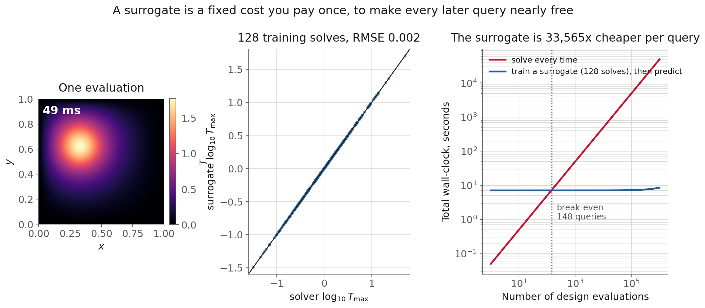
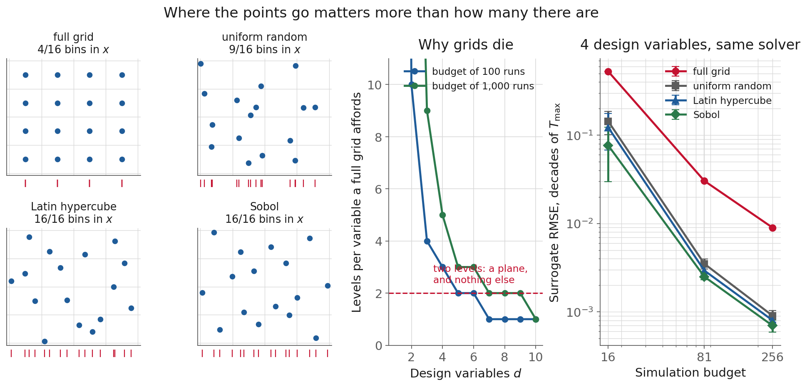
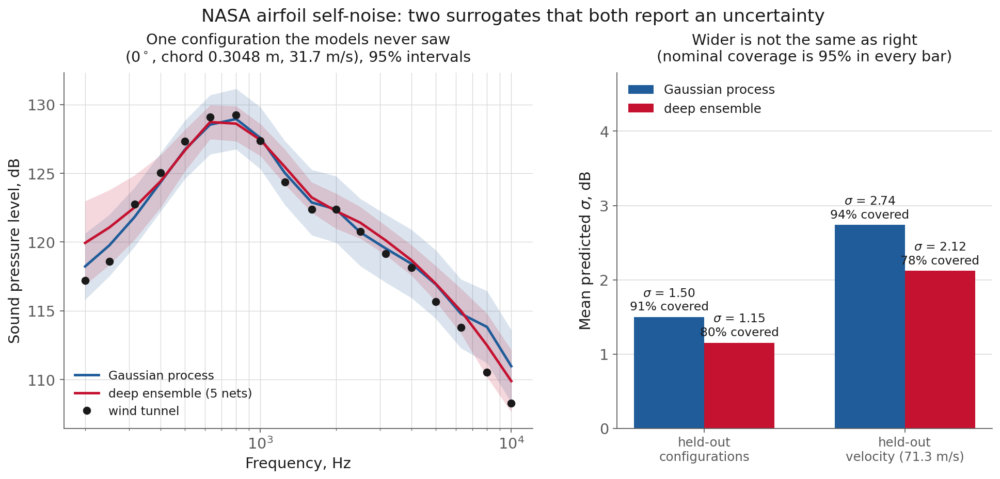
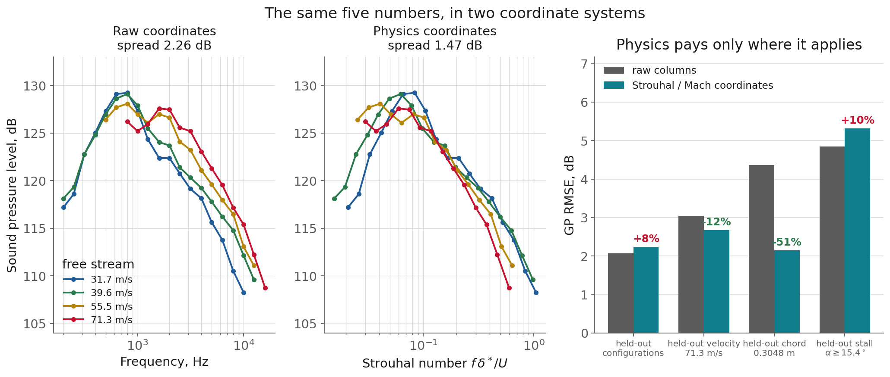
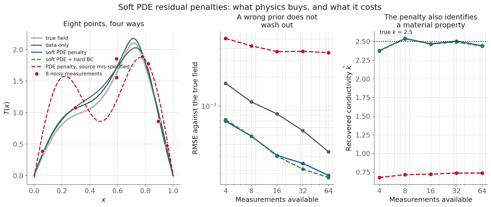
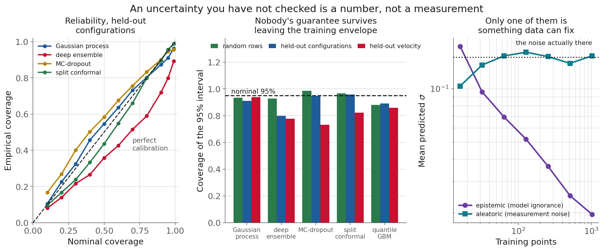

<!-- _class: title -->

# L13 · Surrogates, physics, and uncertainty

## Week 7 · Machine learning & deep learning

**Systems & Toolchains for AI in Engineering**

---

## Roadmap

1. What a surrogate is, and when it pays for itself
2. Spending a simulation budget
3. Choosing a surrogate family
4. Putting physics into the model
5. Two kinds of uncertainty
6. Checking it: coverage and sharpness
7. Live demo: two surrogates, and whether they mean it

<!-- 110 min. Budget roughly 8 / 14 / 14 / 20 / 10 / 16 / 20 demo.
     Dataset: NASA airfoil self-noise, 1,503 rows, 106 tunnel configurations.
     The miniproject launches today: hold 5 min at the end for it.
     If running long, cut the surrogate-family survey, not the calibration table. -->

---

<!-- _class: section -->

# Why this matters

---

## The situation

A CFD run takes six hours. A DFT calculation
takes a day. A tunnel campaign takes a technician.

You want to search a design space:
**thousands of evaluations.**
You have budget for **a hundred.**

So you fit a cheap model to the hundred.
Measured today: **33,000×** faster per query.

---

## And then the trouble starts

An optimizer does **not** sample evenly. It goes
exactly where the surrogate says the answer is best,
which is exactly where the surrogate is most likely
to be **wrong**.

Every design loop is an adversarial search
against your own model's optimism.

<!-- The largest predictions of a model fitted to sparse noisy data are
     disproportionately the ones that got lucky. Say that slowly. -->

---

## Today's uncomfortable number

Two surrogates. Same data. Same split.

| | RMSE | covers a "95%" interval |
|---|---|---|
| Gaussian process | 2.07 dB | **91%** |
| deep ensemble | 2.61 dB | **80%** |

The **worse** model reports the **narrower** error bar.
Accuracy will never show you that.

---

<!-- _class: section -->

# What a surrogate is,
## and when it pays for itself

---

## Definitions, and the one that matters

**Surrogate** = emulator = response surface = metamodel.
A cheap function fitted to the input-output behaviour
of an expensive one. It knows **no physics**.

It is almost always a *worse* model of reality. What it
is, is a model whose evaluation cost is **unrelated**
to the cost of the thing it imitates.

---

## Where it earns its keep

- **optimization inner loops**, thousands of objective calls
- **real-time / embedded control**, where latency disqualifies the solver
- **design sweeps and sensitivity**, Sobol indices without a factorial
- **uncertainty propagation**, Monte Carlo through the model

If you cannot name the loop, you are probably
building the wrong thing.

<!-- The lifecycle: design of experiments -> train -> validate -> deploy ->
     refine. Sampling has the most leverage and gets the least attention, and
     that is the next section. Refinement is L14. -->

---

## The economics, measured

<!-- Today's stand-in for an expensive solve: -div(k grad T) = q on the unit
     square, k = exp(ax+by), Gaussian source at (x0,y0), 129x129 grid, direct
     sparse solve. Four design variables, QoI = peak temperature.
     Ask them to guess the break-even before revealing. Most say "immediately". -->

---

## The numbers, and the one that matters

| one solve | **49 ms** |
|---|---|
| one surrogate prediction | **1.5 µs** |
| speedup | **33,000×** |
| surrogate RMSE | 0.0018 decades of $T_{\max}$ |

But it costs **128 solves + a fit** before it answers
anything, so: **break-even at 148 queries** ≈ the size
of your training set. Write down how many queries
you need, before you build anything.

---

<!-- _class: section -->

# Spending a
## simulation budget

---

## You have 100 runs. Where do they go?

The instinct is a **full factorial grid**. In 1-2
dimensions: excellent, do it. In 4: a disaster.

$L$ levels in $d$ dimensions costs $L^d$, so a budget
of $N$ affords $L = \lfloor N^{1/d} \rfloor$.

With 100 runs: **10** levels in 1D, **4** in 3D,
**2** in 5D, **1** in 7D.

# Two levels is a plane.

No curvature, no optimum, no interaction beyond
first order, at the dimensions engineering has.

---

## The fix: space-filling designs

**Latin hypercube** (McKay, Beckman & Conover 1979):
$N$ bins per variable, one point in each, paired at
random. The guarantee is **one-dimensional**: every
marginal is stratified whatever the others do.

**Sobol** and other low-discrepancy sequences fill
deterministically, and are **extensible**.

[`scipy.stats.qmc`](https://docs.scipy.org/doc/scipy/reference/stats.qmc.html) does all of these in one line.

---

## Look at the projections

<!-- The tick marks under each scatter are the 1D projection. A 4x4 grid of 16
     points occupies 4 of 16 bins in x. LHS occupies all 16, by construction. -->

---

## What that costs, on the heat problem

| budget | grid | random | LHS | Sobol |
|---|---|---|---|---|
| 16 | 0.526 | 0.143 | 0.122 | **0.076** |
| 81 | 0.030 | 0.0035 | 0.0029 | **0.0025** |
| 256 | 0.0090 | 0.0009 | 0.0008 | **0.0007** |

The grid is **10× worse than plain random** at every
budget, and it is free to fix.

<!-- Do NOT over-read the right-hand columns. Random -> LHS -> Sobol is real but
     small and narrows with budget: ~2x at n=16, within 20% at n=256, and the
     spread across repeats at n=16 is large enough that one run would miss it. -->

---

## A footgun worth knowing

**Sobol wants a power-of-two sample size.**
Mean discrepancy over 8 scrambles:

| n | discrepancy |
|---|---|
| 64 | 1.04 × 10⁻³ |
| **81** | **1.17 × 10⁻³** |
| 128 | 3.52 × 10⁻⁴ |

# Adding 17 points made it worse.

---

## Interpolation is not extrapolation

Inside the convex hull of your training points:
the easy case. Outside it: error can be arbitrarily
large, with **no warning from any random-split CV**.

So validate a surrogate differently:
**hold out a region, not a sample of rows.**
And report extrapolation error **separately**.

| the same GP, three questions | RMSE |
|---|---|
| random rows | 1.97 dB |
| held-out configurations | 2.07 dB |
| held-out velocity (71.3 m/s) | **3.04 dB** |

---

## And write the split down yourself

Today's grouped split is four lines in the repo,
not `GroupKFold`, because **scikit-learn 1.8 and 1.9
assign groups to folds by different rules**: same
signature, same `shuffle=False`, no warning.

The figures and the demo notebook disagreed at
**2.08 vs 1.50 dB** and **91% vs 94%** coverage before
this was caught: bigger than most of today's effects.

<!-- This is L1's np.trapz lesson in a new costume. Ask whether anyone has been
     bitten by a library default changing under them. -->

---

## Count the knobs, not the columns

**NASA airfoil self-noise**, from L9: 1,503 tunnel
measurements, [Brooks, Pope & Marcolini, NASA RP-1218](https://ntrs.nasa.gov/citations/19890016302),
5 inputs → scaled SPL in dB. [(UCI 291)](https://archive.ics.uci.edu/dataset/291/airfoil+self+noise)

Five feature columns. **Four design variables.**
Displacement thickness is the boundary layer that
*results*: one value in **106 of 106** configurations.

Latin-hypercube over all five → most of your points
describe a tunnel that cannot exist, and the surrogate
answers anyway.

# The design space is what you can set.

---

<!-- _class: section -->

# Choosing a
## surrogate family

---

## Gaussian process (kriging)

The default for smooth, low-dimensional, expensive.

Prior over functions → condition on data →
posterior that is again Gaussian.

**Mean and variance from the same algebra.**
The uncertainty is not bolted on. It falls out.

[Rasmussen & Williams, ch. 2 (free)](https://gaussianprocess.org/gpml/chapters/RW.pdf)

---

## The kernel is the modelling assumption

`Matern(nu=2.5)`: twice differentiable. Weaker and
safer than RBF's infinite smoothness.

**ARD**: one length scale per input, so the fit tells you
which variables matter. One pinned at its bound means
"this input does nothing."

Cost: $O(n^3)$ to fit. Caps you at a few thousand points.
[scikit-learn: Gaussian Processes](https://scikit-learn.org/stable/modules/gaussian_process.html)

---

## The other three families

**RBF interpolants**: same idea, no probability. Fast, exact, **no uncertainty.**

**Polynomial chaos**: expand in polynomials orthogonal to the *input* distribution → moments and Sobol indices analytically.

**Neural surrogates**: high-dimensional inputs, or outputs that are **fields**.

---

## Fields, and then function spaces

A CNN or U-Net maps an input field (geometry, source,
boundary condition) to an output field. That is what
L12's architectures were for.

**Neural operators** go further: maps between *function
spaces*, so one model handles any discretisation.
[DeepONet](https://arxiv.org/abs/1910.03193) · [Fourier Neural Operator](https://arxiv.org/abs/2010.08895), which claims up to
three orders of magnitude over traditional solvers.

---

## Today: a GP and a deep ensemble

**GP**: sklearn, Matern 5/2 + ARD + `WhiteKernel`.

**Deep ensemble**: 5 small PyTorch nets, each
predicting a **mean and a variance**, trained by
Gaussian NLL rather than MSE.

[Lakshminarayanan, Pritzel & Blundell 2017](https://arxiv.org/abs/1612.01474)

---

## Both, on a sweep neither model saw

<!-- Ask them to predict the right-hand panel before revealing it. Almost
     everyone expects the narrower interval to belong to the better model. -->

---

## The point predictions tie. The intervals do not.

| | RMSE | mean σ | covers "95%" |
|---|---|---|---|
| Gaussian process | **2.07 dB** | 1.50 dB | **91.0%** |
| deep ensemble | 2.61 dB | 1.15 dB | **79.9%** |
| predict the training mean | 6.75 dB | | |

The less accurate model reports the **narrower**
interval. One point in five falls outside one
that was meant to miss one in twenty.

---

## Now leave the training envelope

Hold out **every row at 71.3 m/s**:

| | RMSE | σ | covers |
|---|---|---|---|
| GP | 3.04 | 2.74 (**1.83×**) | **93.8%** |
| ensemble | 3.55 | 2.12 (**1.84×**) | **77.6%** |

Identical responsiveness, opposite outcomes.
Growing the interval is not the hard part.

---

## Why the GP widens

A stationary kernel has a finite correlation length,
so far from any training point there is nothing to
condition on and the posterior relaxes back to the
**prior**: prior mean, prior variance.

# By construction, not by cleverness.

Which also means it is **conservative**, not correct.
It tells you it does not know, not the right answer.

---

<!-- _class: section -->

# Putting physics
## into the model

<!-- Three versions, three prices, and we go in this order:
     1. change of coordinates, free, before the model sees anything
     2. hard constraint, free at run time, cannot be traded away
     3. soft PDE penalty, a whole project and a real failure mode -->

---

## The cheapest version

Trailing-edge noise does not depend on frequency
and velocity separately. It depends on the
**Strouhal number**

$$St = \frac{f\,\delta^*}{U}$$

Three of your five columns are not three axes.
Nothing added, nothing removed: new coordinates.

---

## Watch it collapse

<!-- The high-frequency roll-off lands on one line. The low-frequency side does
     not, and that is the honest half of this figure. -->

---

## Measured, and only partly

Largest chord, zero incidence: spread **2.26 → 1.47 dB**.
All 33 settings with >1 velocity: **2.91 → 2.34 dB**,
tighter in **20 of 33**.

Dramatic at 22.2° on the smallest chord: **6.45 → 1.55**.
**Worse** at low incidence on that same chord: **2.10 → 3.46**.

BPM has separate suction-side, pressure-side and
separation terms. One group cannot carry three.

---

## And the GP follows exactly that structure

| hold-out | raw | Strouhal/Mach | |
|---|---|---|---|
| configurations | 2.07 | 2.24 | +8% |
| velocity 71.3 m/s | 3.04 | 2.68 | −12% |
| chord 0.3048 m | 4.37 | **2.15** | **−51%** |
| stall, α ≥ 15.4° | 4.84 | 5.31 | **+10%** |

Chord is a variable $St$ involves, so an unseen chord
becomes **interpolation**. Stall is a different mechanism.

---

## So say it out loud

# A physics feature is a claim,
# not a free improvement.

Name the regime where you expect it to hold,
and test inside and outside it **separately**.
"−51% on chord, +10% on stall" is a far more useful
sentence than the roughly-zero average of that table.

---

## A warning that changed this lecture

Trailing-edge intensity ~ $U^5$, so the level should
rise like $50\log_{10}U$. Fitted from this data, over
settings with 3+ velocities, the median exponent is

# 0.31

The UCI column reads "**scaled** sound pressure level."
The shape collapse is there. The level scaling is not.

---

## The lesson is not aeroacoustics

A physics prior we were about to impose as a hard
constraint was, in this dataset, **false**.

# Measure the constraint on your
# training data before you impose it.

Five lines of code. Nothing else would have told you,
and a wrong constraint is not a small mistake.

---

## The expensive version: PINNs

$$\mathcal{L} = \underbrace{\textstyle\sum_i (T_\theta(x_i) - T_i)^2}_{\text{data}}
+ \lambda \underbrace{\textstyle\sum_j \mathcal{R}[T_\theta](x_j)^2}_{\text{PDE residual}}
+ \text{BCs}$$

Residual by autodiff at **collocation points** where no
measurement exists. L11's autodiff, but differentiating
the **inputs**, inside the **loss**.

[Raissi, Perdikaris & Karniadakis, JCP 378 (2019)](https://doi.org/10.1016/j.jcp.2018.10.045)

---

## One implementation detail that is not a detail

# Use `tanh`, not ReLU.

The loss differentiates the network **twice**, and the
second derivative of a ReLU network is zero almost
everywhere.

A PINN on ReLU has a residual it structurally
cannot reduce.

---

## When is a PINN actually the right tool?

Know the equation, the BCs **and** the source? The
physics loss alone determines the answer, you need
no data, and you have written a slow FE solver.

**The engineering case is the inverse problem.**
Today: $-k\,T'' = q(x)$, known source, **unknown $k$**,
a handful of noisy temperatures. $k$ is a learnable scalar.

---

## Four ways, same eight points

<!-- Ask what they expect the mis-specified-source curve to do with more data
     before you show the middle panel. -->

---

## What physics buys

**Roughly halves the field error at every budget.**

Better reading: with **4** measurements the penalised
net matches what the data-only net needs about
**21** measurements to reach.

And it recovers the conductivity: $\hat{k}$ = 2.38 at four
points, 2.54 at eight, against a true **2.5**.

---

## Now the failure

Omit the localised hot spot from the source term.
A plausible modelling oversight.

| measurements | mis-specified | no physics at all |
|---|---|---|
| 4 | **0.505** | 0.172 |
| 64 | **0.359** | 0.033 |

Eleven times worse than no physics, essentially flat
in the amount of data, and $\hat{k}$ settles near **0.7**
against a true 2.5. A wrong prior does not average out:
it is a **systematic** error the optimizer will defend
against the evidence, because you said it was true.

---

## Soft against hard constraints

Boundary condition as a **penalty**: soft.
By **construction**: $T_\theta(x) = x(1-x)\,N_\theta(x)$,
which holds for every possible value of the weights.

| | mean boundary violation |
|---|---|
| soft penalty | 1.0 × 10⁻² |
| hard, by construction | **exactly 0** |

Same field accuracy. Cosmetic, until something
downstream divides by it.

---

## Hard constraints you already know how to write

**Positivity**: predict $\log y$, or softplus the output.
**Monotonicity**: monotone architecture, or a gradient-sign penalty.
**Conservation**: predict a potential, take its curl.

# Prefer them.

Free at run time, and they cannot be traded away.
A soft penalty carries a λ that **competes with your
data term**; getting λ wrong is the main reason
PINNs fail to train. [(Wang, Teng & Perdikaris)](https://arxiv.org/abs/2001.04536)

<!-- Today's heat surrogate predicts log10(Tmax) for exactly this reason, and
     the mean-variance nets softplus their variance head. Point both out. -->

---

<!-- _class: section -->

# Two kinds
## of uncertainty

---

## Aleatoric

Scatter in the **process**: sensor noise, batch
variation, turbulence, two identical specimens
that do not fail at the same load.

More data gives a better *estimate* of it,
never a smaller one. To shrink it you need
a better instrument.

---

## Epistemic

The **model's ignorance**: regions of the design
space too few points constrain. More data removes it.

And it is what a design loop should chase: large
epistemic uncertainty marks an experiment that
would actually teach you something.

---

## The law of total variance splits them

$$\underbrace{\mathrm{Var}[y]}_{\text{total}}
= \underbrace{\mathbb{E}_m[\sigma_m^2]}_{\text{aleatoric}}
+ \underbrace{\mathrm{Var}_m[\mu_m]}_{\text{epistemic}}$$

The average of what the members think the noise is,
plus **how much the members disagree**.

A GP does it directly: the `WhiteKernel` level, and the rest.

---

## On a problem where we know the answer

<!-- Right panel is synthetic ON PURPOSE: the airfoil file has zero repeated
     settings, so nothing in it can say how much scatter is noise. -->

---

## And on the real data, it misbehaves

Same GP decomposition, airfoil:

| training rows | epistemic | "aleatoric" |
|---|---|---|
| 58 | 3.39 dB | 0.88 dB |
| 235 | 2.20 dB | **1.23 dB** |
| 1,179 | 1.24 dB | **0.78 dB** |

Epistemic falls, as it should. The "noise" wanders
with no trend and a spread as big as itself: it is
whatever the kernel **could not explain**, relabelled.

# The split belongs to the model,
# not to the data.

**Without replicates you cannot separate noise from
model error**, and the airfoil file has none. Three
replicates at a few settings beat a hundred unique runs.

---

<!-- _class: section -->

# Checking it:
## coverage and sharpness

---

## Five ways to get an interval

| method | cost | gives you |
|---|---|---|
| GP posterior | $O(n^3)$ | exact split, small $n$ |
| deep ensemble | $M$ trainings | both parts, parallel |
| MC-dropout | one model | cheapest, rate-sensitive |
| quantile regression | 2 fits | asymmetric, no split |
| conformal | one calibration set | a **guarantee** |

[Gal & Ghahramani on dropout](https://arxiv.org/abs/1506.02142)

---

## Conformal prediction, in five lines

Hold out a calibration set. Compute $|y - \hat{y}|$.
Take the $\lceil (n{+}1)(1{-}\alpha)\rceil/n$ quantile.
Use it as the interval half-width.

$$1-\alpha \le \mathbb{P}(Y \in \mathcal{C}(X)) \le 1-\alpha+\tfrac{1}{n+1}$$

Any model. Any distribution. [Angelopoulos & Bates](https://arxiv.org/abs/2107.07511)

---

## Two numbers, and you need both

**PICP**: the fraction of held-out points actually
inside the nominal interval.
**Width**: how wide it is on average.

$\pm\infty$ has perfect coverage and no content.
Zero width is maximally sharp and always wrong.

# Maximise sharpness
# subject to calibration.

[Gneiting, Balabdaoui & Raftery, JRSS-B 69 (2007)](https://sites.stat.washington.edu/raftery/Research/PDF/Gneiting2007jrssb.pdf)

---

## Everything, same data, nominal 95%

| method | random rows | held-out configs | held-out velocity |
|---|---|---|---|
| Gaussian process | 93% | 91% | **94%** |
| deep ensemble | 93% | **80%** | **78%** |
| MC-dropout | 99% | 95% | **73%** |
| split conformal | 97% | 96% | **82%** |
| quantile GBM | 88% | 89% | 86% |

**On a random row split, everything looks fine.** Four
of five land between 88% and 99%. Validate that way and
you will ship an overconfident model.

---

## One column over, the ensemble has failed

**79.9%** coverage on held-out configurations.

From a method whose paper title contains the words
"predictive uncertainty," at an RMSE within
0.3 dB of the GP's.

Five members understates the disagreement between
all the nets you might have trained.
[Ovadia et al. 2019 benchmarked this](https://arxiv.org/abs/1906.02530)

---

## Under extrapolation, two intervals got *narrower*

| method | held-out configs | held-out velocity |
|---|---|---|
| MC-dropout | 7.08 dB | **6.98 dB** |
| split conformal | 8.41 dB | **7.12 dB** |
| GP | 5.87 dB | 10.73 dB |

While the actual error rose by **half**.

# More wrong and more confident.

---

## But conformal has a *proof*. What happened?

Fix the model. Re-partition a held-out pool into
calibration and test **at random**, 400 times, so that
exchangeability holds by construction:

Mean coverage **95.41%**, guaranteed band 95.000 to 95.221%.
The theory works.

Now stop re-partitioning at random. Calibration set
from the training rows, as the recipe says; test set =
a whole held-out velocity.

# Coverage: 82.2%

Nothing failed except an assumption: the guarantee
needs the two sets **exchangeable**, and holding out a
design region is a declaration that they are not.

---

## And it fails in the wrong direction

Calibration residuals come from the **easy**
interpolation regime.

→ they are small
→ the interval is narrow
→ **a model facing harder questions
issues more confident answers.**

<!-- Sections 4.5 and 4.6 of Angelopoulos & Bates cover covariate shift and
     distribution drift. Point people there for what to do about it. -->

---

## Which is the shape of every failure today

The method is fine. The **claim** it makes is
conditional on a property of your data, and it is
always the same property.

L7: the scaler fitted on everything.
L9: the split that shared a tunnel run.
L11: the fold that shared a concrete mix.
Today: the calibration set that shared a velocity.

---

<!-- _class: section -->

# Where this
## pushes back

---

## A surrogate models your simulator, not reality

Every error the solver makes, the surrogate
reproduces. Then it adds its own.

CFD 8% off the tunnel + surrogate 2% off the CFD
= a **10% model that reports 2%**.

Validate surrogate↔solver and solver↔reality
**separately**.

---

## Neither of today's models scales

**GPs**, in two directions. $O(n^3)$ is the famous one and
the easier one: sparse methods handle it. The harder
limit is **input dimension**, where a stationary kernel in
20-D has no interpolation power at all.

**Deep ensembles** cost 5× the training for uncertainty
you still have to check: today, **80% coverage** where
95% was claimed. More members help, linearly.

---

## PINNs are seductive and finicky

Elegant in a paper. Two weeks of debugging a
loss weight in practice.

Competing terms, wildly different gradient scales,
stiff PDEs, and a failure mode that is
**smooth and wrong**.

For a two-week project: a hard constraint, not a PINN.

---

## Calibration does not transfer

A model calibrated on one operating regime
is not calibrated on the next.

Re-calibrating needs labelled data from the new
regime, which in an extrapolating loop is exactly
what you do not have.

**Detect it**: monitor the input distribution.

---

## And the honest limit

Without a surrogate you would have
**run the experiment**.

With an overconfident one you run the
**wrong** experiment and believe the result.

# A confident wrong surrogate
# is worse than none.

---

<!-- _class: demo -->

# Demo

## `l13-surrogates-uq.ipynb`

Two surrogates, three splits,
and a guarantee we break three ways.

---

## What to watch

- **106 configurations, 5 columns, 4 knobs**
- GP length scales, read as a sampling plan for the next campaign
- Bands on a held-out sweep: **91% vs 80%** coverage
- σ off the training envelope: **1.83× vs 1.84×**, and why that is not the point
- Conformal at **96.7% → 95.7% → 82.2%**
- Strouhal coordinates: **−51%** on chord, **+10%** on stall

**Come with a prediction:** which model has the
narrower interval, and which actually contains 95%?

---

## Recap

- Break-even ≈ your training-set size, not the speedup
- A full grid was **10× worse than random** at every budget; LHS/Sobol fix it free
- Validate by holding out a **region**, and report it separately
- GP σ grows away from data **by construction**; that is L14's lever
- Physics is a **claim**: −51% on chord, +10% on stall
- A wrong physics prior does **not** wash out with data
- On a random split everything looks calibrated. It is not.

---

## Four things measurement changed today

- "The BPM $U^5$ scaling is in this data" → the fitted exponent is **0.31**
- "Deep ensembles are the well-calibrated option" → **80%** of a nominal 95%
- "Conformal has a guarantee" → it has one, and we broke it to **82%**
- "`GroupKFold` gives me a split" → it gave two, **2.08 and 1.50 dB**, by version

Each was a draft claim that a run corrected.

---

## Next

**Assignment** A6 due now · **[Miniproject (A7)](../../course/miniproject.md) launches today**, due end of Wk 8
**Reading** [Rasmussen & Williams ch. 2](https://gaussianprocess.org/gpml/chapters/RW.pdf) · [Angelopoulos & Bates](https://arxiv.org/abs/2107.07511) · [Lakshminarayanan et al.](https://arxiv.org/abs/1612.01474)
**L14** Bayesian optimization and active learning: turning
the posterior variance into a rule for choosing the
next expensive experiment

Full notes, with all sources: `lectures/l13/notes.md`
