<style>
/* a figure alone in its paragraph is centered, and so is every table */
section p:has(> img:only-child) { text-align: center; }
section table { margin-left: auto; margin-right: auto; }

.cols { display: grid; gap: 1.1em; align-items: center; }
.cols-even { grid-template-columns: 1fr 1fr; }
.cols-lc { grid-template-columns: 1.25fr 1fr; }
.cols-cl { grid-template-columns: 1fr 1.25fr; }
.cards { display: grid; grid-template-columns: repeat(4, 1fr); gap: 16px; margin-top: 0.3em; }
.card { background: #f7f7f7; border-top: 5px solid #c41230; border-radius: 6px; padding: 10px 12px; font-size: 0.66em; }
.card:nth-child(2) { border-top-color: #1f5c99; }
.card:nth-child(3) { border-top-color: #b07d12; }
.card:nth-child(4) { border-top-color: #2e7d32; }
.card h4 { margin: 4px 0 6px; font-size: 1.25em; }
.card p { margin: 0.3em 0; }
.card img { width: 100%; height: 150px; object-fit: contain; background: #fff; border-radius: 4px; margin: 0 0 6px; }

/* a box that says how to read a figure, and a closing line under it */
.readbox { background: #f7f7f7; border-left: 5px solid #1f5c99; border-radius: 0 6px 6px 0;
  padding: 0.35em 0.8em; font-size: 0.7em; line-height: 1.35; }
.readbox ul { margin: 0; padding-left: 1.1em; }
.readbox li { margin: 0.25em 0; }
.readbox p { margin: 0.2em 0; }
section p.takeaway { text-align: center; font-weight: 700; font-size: 0.82em; margin: 0.5em 0 0; }
.small { font-size: 0.72em; }
.source { font-size: 0.6em; color: #5c5c5c; }
.red { color: #c41230; }
.blue { color: #1f5c99; }
.orange { color: #c2410c; }
.green { color: #2e7d32; }

/* code with callouts that appear one at a time: each .lay is a fragment holding a
   highlight over some lines and the note that explains them */
.ca { display: grid; grid-template-columns: 1fr 380px; gap: 22px; align-items: start; position: relative; }
.ca pre { font-size: 15px; line-height: 21px; margin: 0; padding: 8px 12px; position: relative; z-index: 1; }
.ca pre code { font-size: 15px; line-height: 21px; }
.ca .lay { position: absolute; inset: 0; pointer-events: none; z-index: 3; }
.ca .hl { position: absolute; left: 0; right: 402px; border-radius: 4px; box-sizing: border-box; }
.ca .cn { position: absolute; left: calc(100% - 380px); width: 360px; font-size: 16px; line-height: 1.3;
  background: #f7f7f7; border-left: 5px solid #1f5c99; border-radius: 0 6px 6px 0; padding: 5px 10px; }
.cn::before { content: ''; position: absolute; left: -22px; top: var(--ay, 9px); border: 8px solid transparent; border-right: 12px solid #1f5c99; }
.cn.c2 { border-left-color: #2e7d32; } .cn.c2::before { border-right-color: #2e7d32; }
.cn.c3 { border-left-color: #b07d12; } .cn.c3::before { border-right-color: #b07d12; }
.cn.c4 { border-left-color: #c41230; } .cn.c4::before { border-right-color: #c41230; }
.hl.c1 { background: rgba(31, 92, 153, 0.10); border: 2px solid rgba(31, 92, 153, 0.6); }
.hl.c2 { background: rgba(46, 125, 50, 0.10); border: 2px solid rgba(46, 125, 50, 0.6); }
.hl.c3 { background: rgba(176, 125, 18, 0.10); border: 2px solid rgba(176, 125, 18, 0.6); }
.hl.c4 { background: rgba(196, 18, 48, 0.08); border: 2px solid rgba(196, 18, 48, 0.55); }

/* big numbers */
.kpis { display: grid; gap: 18px; margin-top: 0.4em; }
.kpi { background: #f7f7f7; border-radius: 8px; padding: 10px 14px; text-align: center; border-top: 6px solid #8a8a8a; }
.kpi .v { font-size: 1.5em; font-weight: 700; line-height: 1.15; }
.kpi .l { font-size: 0.62em; color: #5c5c5c; }
.kpi img { width: 78%; margin: 2px auto; }

/* logos */
.logos { display: flex; align-items: center; justify-content: center; gap: 26px; flex-wrap: wrap; }
.logos img { height: 64px; margin: 0; }
</style>

<!-- _class: title -->

# Lecture 13: Scientific machine learning: PINNs, neural ODEs and neural DAEs

## Week 7, Machine learning and deep learning

**Systems and Toolchains for AI Engineers**

<!--
Why physics 12, PINNs 16, RNN to neural ODE 16, physics enforced 7, seq vs sim 10, neural DAEs + SiNDAE + mAb 16, layers 8, close 5. Long deck: skip the code slides live if late, they are in the notebooks.
-->

---

## What today is about

1. **Why physics**: a bioreactor model that fits, then predicts the impossible
2. **Gen 0 to Gen 2**: from surrogates to scientific machine learning
3. **PINNs**: physics in the loss
4. **From RNNs to neural ODEs**: learning the vector field
5. **Physics-enforced machine learning**: from a penalty to a constraint
6. **Sequential or simultaneous**: two ways to train a dynamic model
7. **Neural DAEs**, SiNDAE, and monoclonal antibodies
8. **Constraints inside the network**: projection layers

<!--
One bioreactor at both ends. One spring-mass in the middle.
-->

---

<!-- _class: section -->

# Why physics

---

## Why physics, a fed-batch bioreactor

<div class="cols" style="grid-template-columns: 1.1fr 1fr;">
<div>

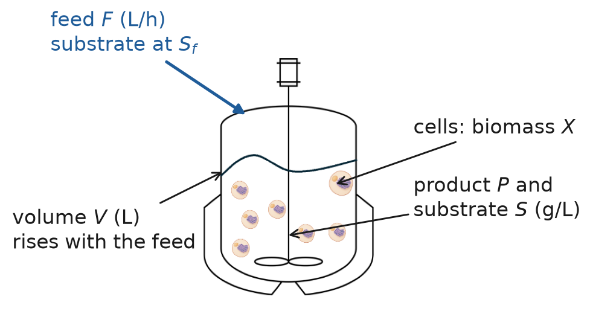

</div>
<div class="small">

* **Fed-batch**: start with cells and medium, **feed** substrate during the run, harvest at the end
* Nothing leaves before harvest, so the **volume grows**
* The feed sets how much food the cells see, so it steers growth and product
* **Used for**: monoclonal antibodies (mAbs) and other therapeutic proteins, recombinant proteins in *E. coli*, baker's yeast, penicillin ([summary](https://en.wikipedia.org/wiki/Fed-batch_culture))
* **Why it matters**: fed-batch is still "the most commonly utilized process type for biomanufacturing" ([Bioprocess Biosyst. Eng., 2024](https://pmc.ncbi.nlm.nih.gov/articles/PMC11269418/))
* CHO (Chinese hamster ovary) cells make about **80%** of U.S.-licensed mAb products ([mAbs, 2025](https://pmc.ncbi.nlm.nih.gov/articles/PMC12118382/))

</div>
</div>

<!--
The drawing is from my seminar. mAbs come back at the end with glycosylation.
-->

---

## Why physics, the balances term by term

<style scoped>
.bal { display: grid; grid-template-columns: 1fr 1fr; gap: 0 30px; }
.bal mjx-container[display="true"] { font-size: 82%; margin: 0.15em 0; }
.bal li { margin: 0.1em 0; }
</style>

<div class="bal">
<div>

* Biomass $X$

  $$
  \underbrace{\frac{dX}{dt}}_{\text{accumulation}} = \underbrace{{\color{#c41230}\mu}\,X}_{\text{growth}} - \underbrace{\frac{F}{V}\,X}_{\text{dilution by the feed}}
  $$

* Product $P$

  $$
  \underbrace{\frac{dP}{dt}}_{\text{accumulation}} = \underbrace{Y_{P/X}\,{\color{#c41230}\mu}\,X}_{\text{made by growing cells}} - \underbrace{\frac{F}{V}\,P}_{\text{dilution}}
  $$

</div>
<div>

* Substrate $S$

  $$
  \underbrace{\frac{dS}{dt}}_{\text{accumulation}} = \underbrace{\frac{F}{V}\,(S_f - S)}_{\text{fed in}} - \underbrace{\frac{{\color{#c41230}\mu}\,X}{Y_{X/S}}}_{\text{eaten by the cells}}
  $$

* Volume $V$

  $$
  \underbrace{\frac{dV}{dt}}_{\text{accumulation}} = \underbrace{F}_{\text{feed rate}}
  $$

</div>
</div>

<div class="readbox" data-marpit-fragment>

$X, P, S$: concentrations (g/L). $V$: volume (L). $F$: feed rate (L/h). $S_f$: substrate in the feed (g/L). $Y_{P/X}$, $Y_{X/S}$: yields (g per g). <b class="red">$\mu$: specific growth rate (1/h), the kinetics. Not known: we learn it.</b>

</div>

<!--
Mass balances: accumulation = in - out + made - used. Every term is bookkeeping except mu.
-->

---

## Why physics, why learn the kinetics?

<div class="cols" style="grid-template-columns: 1.45fr 1fr;">
<div>

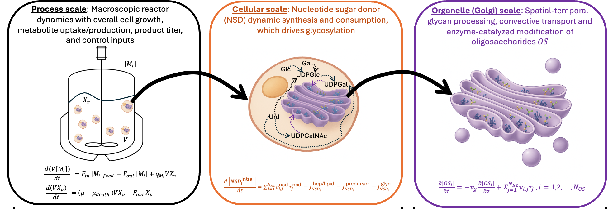

<div class="small">

* **Balances**: conservation of mass, certain
* **Rates**: uncertain. Even a simplified CHO network has **30 reaction rates**, $v_1$ to $v_{30}$, each with its own law and parameters
* $\mu$ in our reactor is one of these rates: learn it from data

</div>
</div>
<div>

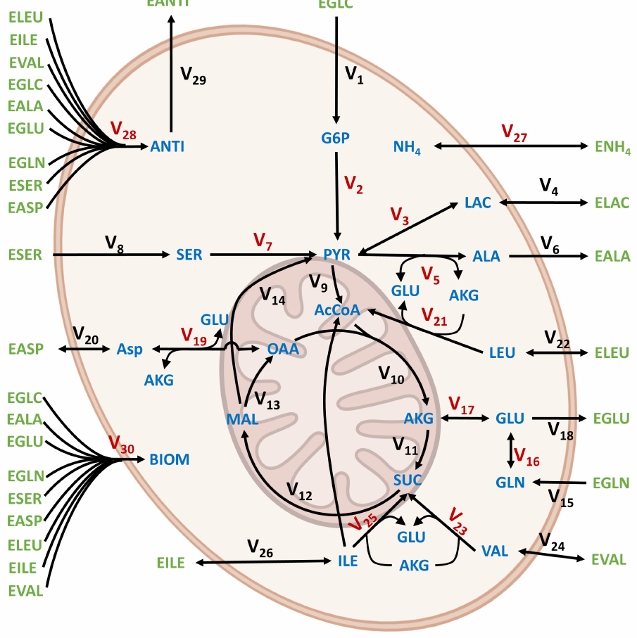

<p class="source">Simplified CHO metabolic network, Fig. 5 of <a href="https://arxiv.org/abs/2412.03883">Wang, Harcum and Xie (2025)</a>, CC BY 4.0.</p>

</div>
</div>

<!--
Left: my multiscale picture, process to cell to Golgi. Right: what one cell looks like inside, simplified.
-->

---

## Why physics, inference on unseen data

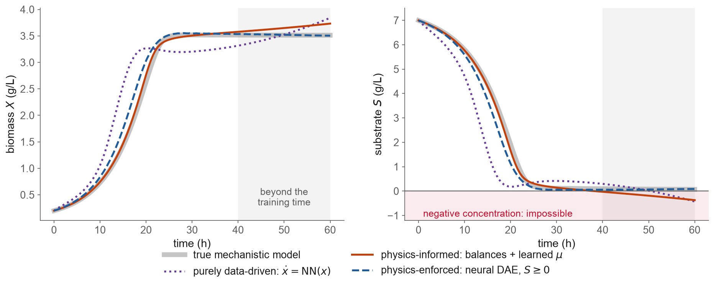

<div class="readbox">

* Three models, all trained on the **same three batches** (0 to 40 h), predict a **new batch** for 60 h
* **Purely data-driven**, no physics: substrate down to <b class="red">−0.85 g/L</b>, biomass off by 0.19 g/L on average
* **Physics-informed**, the balances with a learned $\mu$: closer, but still <b class="red">−0.41 g/L</b>
* **Physics-enforced**, a neural DAE: $S \ge 0$ holds, lowest value 0.04 g/L

</div>

<!--
The gray band is time the training batches never reached. Today: how to get from the purple curve to the blue one.
-->

---

## Machine learning in science and engineering, Gen 0 and Gen 1

<div class="cols cols-even small">
<div>

**Gen 0: surrogate models**

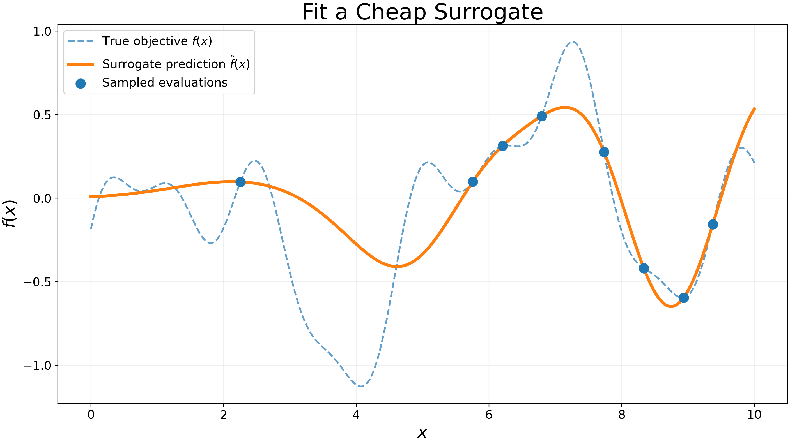

* "Often, the codes are computationally expensive to run, and a common objective of an experiment is to fit a cheaper predictor of the output to the data" ([Sacks et al., 1989](https://doi.org/10.1214/ss/1177012413))
* Goal: a cheap stand-in for an expensive model

</div>
<div data-marpit-fragment>

**Gen 1: machine learning with intention**

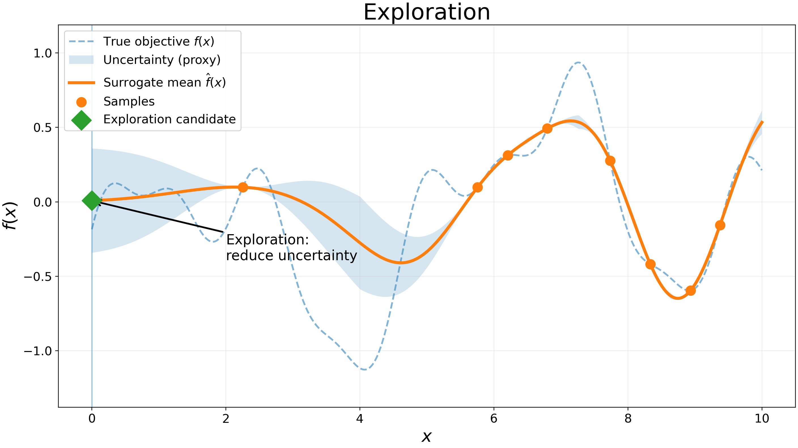

* The surrogate also says how **uncertain** it is, and that decides where to sample next ([Jones, Schonlau and Welch, 1998](https://doi.org/10.1023/A:1008306431147))
* This is the idea behind **Bayesian optimization**: a cheap surrogate with its uncertainty chooses the next expensive experiment or simulation


</div>
</div>

<p class="takeaway" data-marpit-fragment>Neither generation knows any physics: everything comes from the data.</p>

<!--
Plots from my seminar. Gen 1: exploration, the green diamond is where the uncertainty is largest.
-->

---

## Machine learning in science and engineering, Gen 2

<style scoped>
h2 { margin-bottom: 0.3em; }
section p.takeaway { font-size: 0.72em; margin: 0.1em 0 0; }
section p.source { margin: 0.1em 0 0; }
.sm { position: relative; width: 1120px; height: 456px; margin: 0 auto; font-size: 0.76em; }
.sm-l { position: absolute; inset: 0; }
.sm-box { position: absolute; top: 40px; width: 355px; height: 380px; border: 3px solid #1a1a1a; border-radius: 20px; }
.sm-glow { box-shadow: 0 0 0 7px rgba(158, 197, 234, 0.75), 0 0 22px 12px rgba(158, 197, 234, 0.6); }
.sm-arrow { position: absolute; left: 0; width: 1120px; height: 70px; background: #b5121b; }
.sm-right { clip-path: polygon(0 22%, 95.5% 22%, 95.5% 0, 100% 50%, 95.5% 100%, 95.5% 78%, 0 78%); }
.sm-left { clip-path: polygon(4.5% 0, 4.5% 22%, 100% 22%, 100% 78%, 4.5% 78%, 4.5% 100%, 0 50%); }
.sm-at { position: absolute; width: 355px; text-align: center; color: #fff; font-size: 1.25em; line-height: 70px; }
.sm-t { position: absolute; width: 355px; text-align: center; }
.sm-t p { margin: 0.06em 0; }
.sm-lab { position: absolute; top: 424px; width: 355px; text-align: center; font-size: 1.35em; }
.sm-note { position: absolute; top: 291px; width: 355px; text-align: center; color: #5c5c5c; font-size: 0.9em; line-height: 1.2; }
.sm-gen { position: absolute; top: 0; width: 355px; text-align: center; font-size: 1.3em; }
.sm img { position: absolute; }
</style>

<div class="sm">

<div class="sm-l">
<div class="sm-box" style="left:0"></div>
<div class="sm-box" style="left:765px"></div>
<div class="sm-t" style="left:0; top:128px; font-size:0.95em">

$mC_p\,\dfrac{dT}{dt} = f(T, C, k_1, k_2, \ldots)$

$\vdots$

$\dfrac{dC}{dt} = g(T, C, k_1, k_2, \ldots)$

</div>
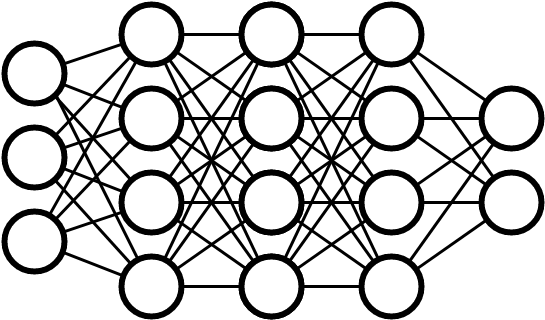
<div class="sm-t" style="left:765px; top:246px; font-size:1.0em">

$\hat C = \mathrm{ML}(T, C, k_1, k_2, \ldots)$

</div>
<div class="sm-lab" style="left:0">First-principles</div>
<div class="sm-lab" style="left:765px">Data-driven (ML)</div>
<div class="sm-gen" style="left:765px">Gen 0, Gen 1</div>
</div>

<div class="sm-l" data-marpit-fragment>
<div class="sm-arrow sm-right" style="top:56px"></div>
<div class="sm-at" style="left:0; top:56px">Minimal data</div>
<div class="sm-at" style="left:765px; top:56px">Extensive data</div>
</div>

<div class="sm-l" data-marpit-fragment>
<div class="sm-arrow sm-left" style="top:350px"></div>
<div class="sm-at" style="left:0; top:350px">No ML</div>
<div class="sm-at" style="left:765px; top:350px">No physics</div>
</div>

<div class="sm-l" data-marpit-fragment>
<div class="sm-note" style="left:0"><b>Challenges</b><br>unknown physics<br>time to impact</div>
<div class="sm-note" style="left:765px"><b>Challenges</b><br>no gained insight<br>cost to impact</div>
</div>

<div class="sm-l" data-marpit-fragment>
<div class="sm-box sm-glow" style="left:382px"></div>

<div class="sm-t" style="left:382px; top:210px; font-size:0.9em">

$mC_p\,\dfrac{dT}{dt} = f_1(T, C, k_1, \ldots)$

$\dfrac{dC}{dt} = \mathrm{ML}(T, C, k_1, \ldots)$

$h(T, C) = 0, \;\; g(T, C) \le 0$

</div>
<div class="sm-at" style="left:382px; top:56px">Moderate data</div>
<div class="sm-at" style="left:382px; top:350px">Physics + ML</div>
<div class="sm-lab" style="left:382px"><b>Hybrid</b></div>
<div class="sm-gen" style="left:382px"><b>Gen 2</b></div>
</div>

</div>

<p class="takeaway blue" data-marpit-fragment>Gen 2: guaranteed constraints and interpretability. Missing: tools to train, optimize, quantify uncertainty.</p>

<p class="source">Schematic: V. Alves, after Fig. 1 of Shah et al. (2025), Comput. Chem. Eng.</p>

<!--
Click order: arrows, the two challenges, then the hybrid box, then what Gen 2 promises.
-->

---

## Scientific machine learning

<div class="definition">

**Scientific machine learning (SciML)** combines mechanistic, first-principles models with machine learning: the network learns only what the physics does not already say.

</div>

<style scoped>
.ex { display: grid; grid-template-columns: repeat(4, 1fr); gap: 14px; margin-top: 0.2em; }
.ex > div { background: #f7f7f7; border-radius: 6px; padding: 6px 8px; font-size: 0.6em; text-align: center; }
.ex img { width: 100%; margin: 0; }
.ex mjx-container[display="true"] { margin: 0.1em 0; font-size: 92%; }
.ex p { margin: 0.15em 0; }
</style>

<div class="ex">
<div data-marpit-fragment>

**Pendulum**: unknown friction

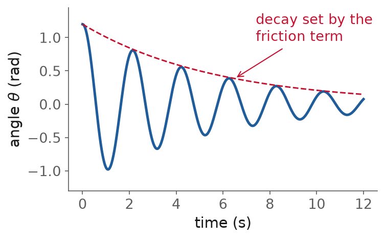

$$mL\ddot\theta = -mg\sin\theta - {\color{#c41230}F_f(\dot\theta)}$$

</div>
<div data-marpit-fragment>

**Heat conduction**: unknown source

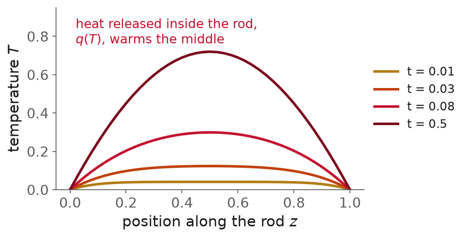

$$\rho c_p\frac{\partial T}{\partial t} = \kappa\frac{\partial^2 T}{\partial z^2} + {\color{#c41230}q(T)}$$

</div>
<div data-marpit-fragment>

**CSTR**: unknown kinetics

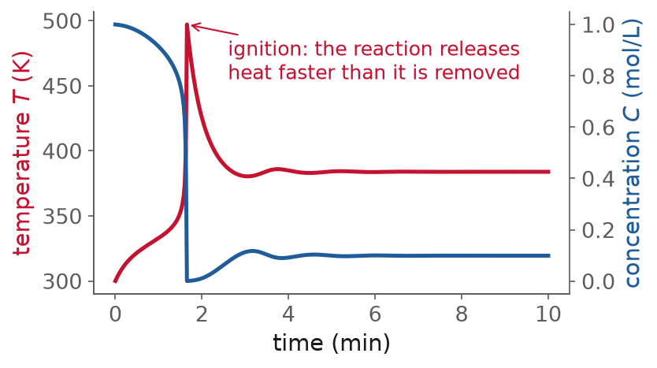

$$\frac{dC}{dt} = \frac{q}{V}(C_f - C) - {\color{#c41230}r(C, T)}$$

</div>
<div data-marpit-fragment>

**Tank**: unknown valve law

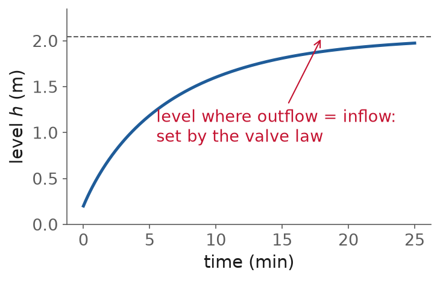

$$A\frac{dh}{dt} = q_\text{in} - {\color{#c41230}q_\text{out}(h)}$$

</div>
</div>

<p class="takeaway" data-marpit-fragment>Black: conservation laws, known. <span class="red">Red: a closure term, a job for scientific machine learning.</span></p>

<!--
CSTR: continuous stirred-tank reactor (Bequette's exothermic example), the spike is ignition. Same pattern as mu in the bioreactor.
-->

---

## Scientific machine learning, four ways to add the physics

<style scoped>
.card mjx-container[display="true"] { font-size: 84%; margin: 0.25em 0; }
.card .f { background: #fff; border-radius: 4px; padding: 2px 4px; min-height: 92px; display: flex; flex-direction: column; justify-content: center; }
</style>

<div class="cards">
<div class="card">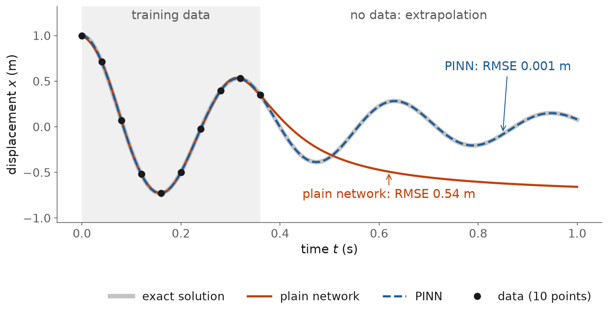<h4>PINN</h4><div class="f">

$$L = L_\text{data} + \lambda\,{\color{#2e7d32}L_\text{physics}}$$

</div><p>Physics in the <b>loss</b>: a penalty, small, not zero.</p></div>
<div class="card">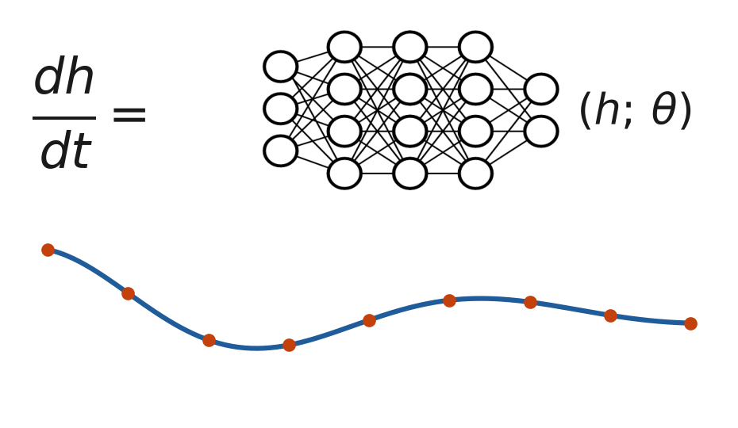<h4>Neural ODE</h4><div class="f">

$$\frac{dx}{dt} = {\color{#2e7d32}f\big(}x,\ \mathrm{NN}(x;\theta){\color{#2e7d32}\big)}$$

</div><p>Network <b>inside</b> the equations. Bounds not enforced.</p></div>
<div class="card">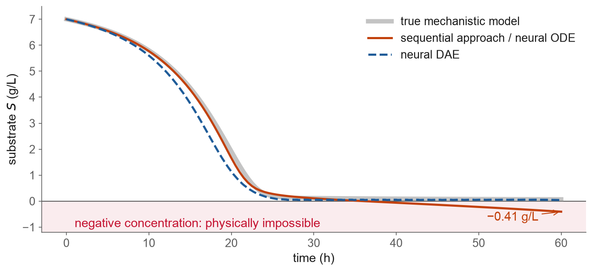<h4>Neural DAE</h4><div class="f">

$$\min_\theta L_\text{data}\ \ \text{s.t.}\ \ {\color{#2e7d32}\dot x = f,\ h = 0,\ g \le 0}$$

</div><p>One optimization problem: constraints <b>enforced</b>.</p></div>
<div class="card">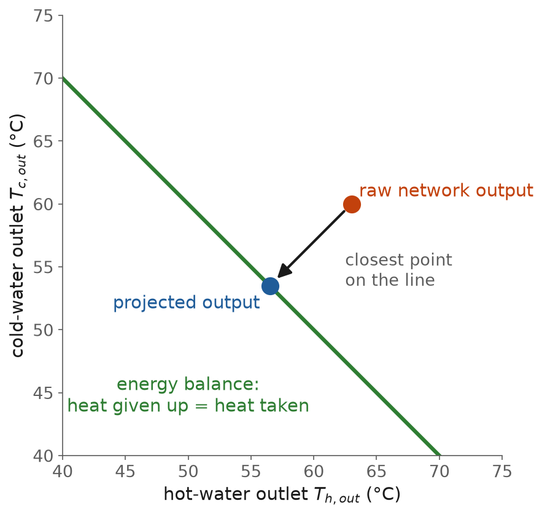<h4>Projection layer</h4><div class="f">

$$y = {\color{#2e7d32}P_{\{Ay = b\}}}\big(\mathrm{NN}(u;\theta)\big)$$

</div><p>Constraints in the <b>last layer</b>, one output at a time.</p></div>
</div>

<p class="takeaway" data-marpit-fragment>Same ingredients each time: data, a network, and the physics in green. Where the green sits decides what it guarantees.</p>

---

<!-- _class: section -->

# PINNs

---

## Physics-informed neural networks (PINNs), introductory example

<div class="cols" style="grid-template-columns: 1.75fr 1fr;">
<div>

<div class="cw compact" data-widget="spring-drag">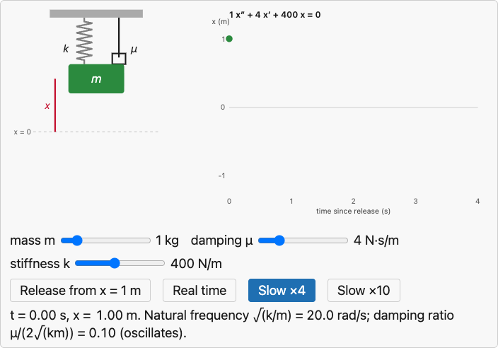</div>

</div>
<div>

<div class="definition" style="font-size:0.78em">

**PINN** (physics-informed neural network): a network trained to fit the data and, at the same time, to make the residual of the governing equation small ([Raissi, Perdikaris and Karniadakis, 2019](https://doi.org/10.1016/j.jcp.2018.10.045)).

</div>

<div class="small">

- **Drag** the green mass, **let go**
- Our case: $m = 1$ kg, $\mu = 4$ N·s/m, $k = 400$ N/m, from $x = 1$ m

</div>
</div>
</div>

<!--
Let a student drag it. About 3 oscillations per second; use slow x4.
-->

---

## PINNs, the equation of motion

<style scoped>
.eom mjx-container[display="true"] { margin: 0.2em 0; font-size: 125%; }
.eom .r { font-size: 0.82em; }
</style>

<div class="cols eom" style="grid-template-columns: 0.9fr 1.25fr;">
<div>

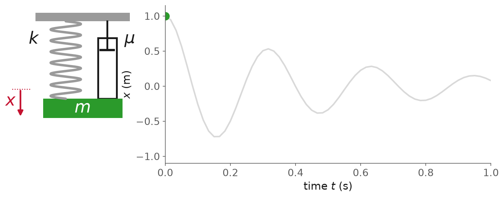

<div style="font-size:0.62em; line-height:1.5">

$x$: displacement from rest (m), up is positive. $x' = dx/dt$: velocity (m/s). $x'' = d^2x/dt^2$: acceleration (m/s²). $m$: mass (kg). $k$: spring stiffness (N/m). $\mu$: damping coefficient (N·s/m).

</div>
</div>
<div class="r">

* Newton's second law: $\;m\,x'' = F_\text{spring} + F_\text{damper}$
* Spring (Hooke's law) pulls back toward rest: $\;F_\text{spring} = -k\,x$
* Damper (viscous friction) opposes the motion: $\;F_\text{damper} = -\mu\,x'$
* Move both forces to the left:

  $$\underbrace{m\,x''}_{\text{inertia}} + \underbrace{\mu\,x'}_{\text{damper force}} + \underbrace{k\,x}_{\text{spring force}} = 0$$

* Released from rest at 1 m: $\;x(0) = 1$ m, $\;x'(0) = 0$

</div>
</div>

<!--
Gravity only shifts the rest position, so x is measured from rest and gravity drops out.
-->

---

## PINNs, the task

<div class="cols" style="grid-template-columns: 1.2fr 1fr;">
<div>

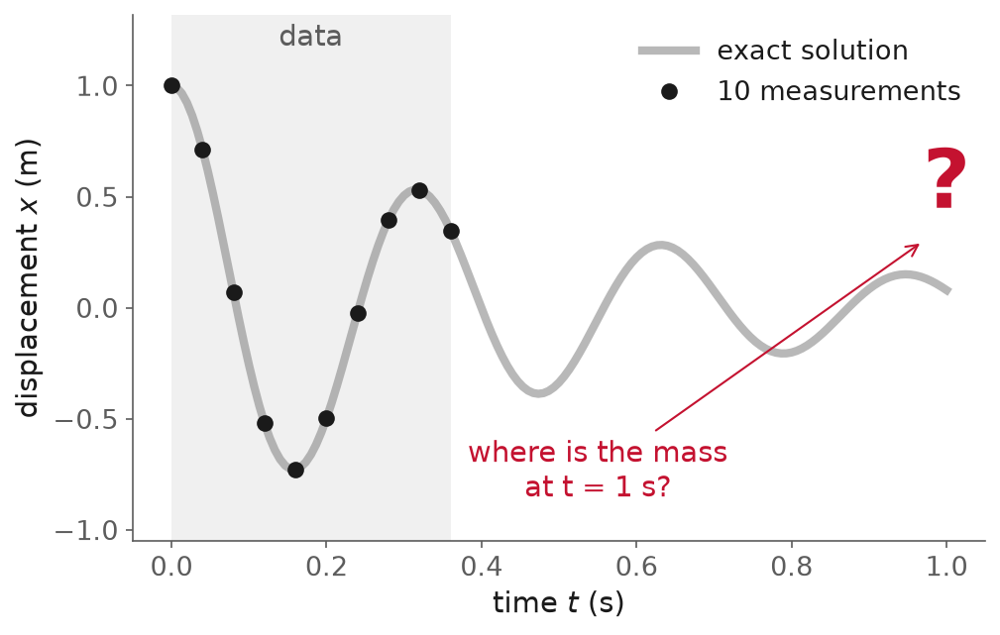

</div>
<div>

* We measure $x$ at **10 times**, all in the **first 0.36 s**: about one oscillation
* We want $x(t)$ for the **whole second**, including $t = 0.36$ to $1$ s, where there are **no measurements**
* We know the equation of motion, and $m$, $\mu$, $k$
* Question: can a network use that knowledge where it has no data?

</div>
</div>

<!--
The gray band is all the data there is. Everything to its right is extrapolation.
-->

---

## PINNs, a plain network first

<div class="cols cols-lc">
<div>

* A network $x_\text{NN}(t;\theta)$: input the time, output the displacement
* Trained on the data alone, by mean squared error over the $N = 10$ points:

  $$
  L_\text{data}(\theta) = \frac{1}{N}\sum_{i=1}^{N} \big(x_\text{NN}(t_i;\theta) - x_i\big)^2
  $$

* It fits the 10 points
* After the last one it has **nothing to go on**

</div>
<div>


</div>
</div>

---

## PINNs, physics in the loss

<style scoped>
.pi { display: grid; grid-template-columns: 1fr 0.12fr 1fr 0.12fr 1.2fr; align-items: center; }
.pi .ar { font-size: 2em; color: #5c5c5c; text-align: center; }
.pi .box { border: 3px solid #1a1a1a; border-radius: 16px; padding: 6px 8px; text-align: center; font-size: 0.7em; }
.pi .box img { width: 150px; margin: 0 auto; }
.pi mjx-container { font-size: 92%; }
.loss mjx-container[display="true"] { font-size: 78%; }
.fav { border: 2px solid #b07d12; border-radius: 8px; padding: 4px 10px; font-size: 0.66em; display: inline-block; }
</style>

<div class="pi">
<div>


</div>
<div class="ar">→</div>
<div class="box">

$m\,x'' + \mu\,x' + k\,x = 0$


**Physics + ML**

</div>
<div class="ar">→</div>
<div>

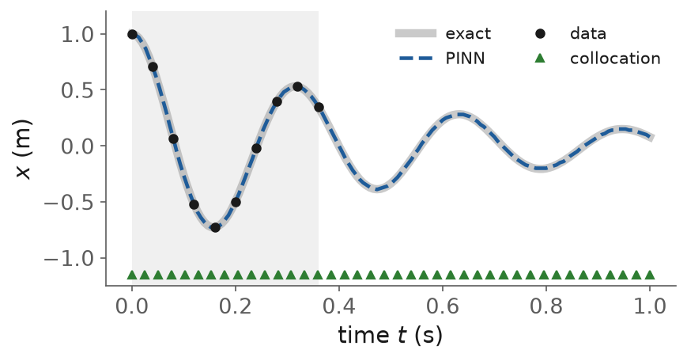

</div>
</div>

<style scoped>
.lrow { display: flex; align-items: flex-start; justify-content: center; gap: 6px; margin-top: 0.1em; }
.lrow .lt { padding-top: 22px; font-size: 0.9em; }
.lrow .tm { display: flex; flex-direction: column; align-items: stretch; }
.lrow .tm mjx-container[display="true"] { margin: 0.1em 0; font-size: 82%; }
.lrow .br { text-align: center; color: #5c5c5c; font-size: 0.62em; line-height: 1.1; }
.lrow .br svg { display: block; width: 100%; height: 16px; }
.lrow .grp { display: flex; align-items: flex-start; gap: 4px; }
.lrow .lam { padding-top: 22px; font-size: 0.9em; }
</style>

<div class="lrow">
<div class="lt">

$L(\theta) =$

</div>
<div class="tm">
<div data-marpit-fragment>

$$\frac{1}{N}\sum_{i=1}^{N}\big(x_\text{NN}(t_i;\theta) - x_i\big)^2$$

</div>
<div class="br" data-marpit-fragment><svg viewBox="0 0 100 16" preserveAspectRatio="none"><path d="M1 1 Q1 8 8 8 L44 8 Q50 8 50 15 Q50 8 56 8 L92 8 Q99 8 99 1" fill="none" stroke="#1f5c99" stroke-width="2" vector-effect="non-scaling-stroke"/></svg><b style="color:#1f5c99">data loss</b></div>
</div>
<div class="grp" data-marpit-fragment>
<div class="lam">

$+\;\lambda$

</div>
<div class="tm">
<div>

$$\frac{1}{M}\sum_{j=1}^{M}\Big(\Big[m\frac{d^2}{dt^2} + \mu\frac{d}{dt} + k\Big]\,x_\text{NN}(t_j;\theta)\Big)^2$$

</div>
<div class="br" data-marpit-fragment><svg viewBox="0 0 100 16" preserveAspectRatio="none"><path d="M1 1 Q1 8 8 8 L44 8 Q50 8 50 15 Q50 8 56 8 L92 8 Q99 8 99 1" fill="none" stroke="#2e7d32" stroke-width="2" vector-effect="non-scaling-stroke"/></svg><b style="color:#2e7d32">physics loss</b></div>
</div>
</div>
</div>

<p style="text-align:center; margin: 0.2em 0" data-marpit-fragment><span class="fav">Physics is <b>favored, not enforced</b>: a penalty, made small but not zero</span></p>

<!--
Same layout comes back for neural DAEs. Raissi, Perdikaris, Karniadakis 2019.
-->

---

## PINNs, collocation points

<div class="definition">

**Collocation point**: a time at which we ask the equation to hold. It needs no measurement, so we can place as many as we like, anywhere.

</div>

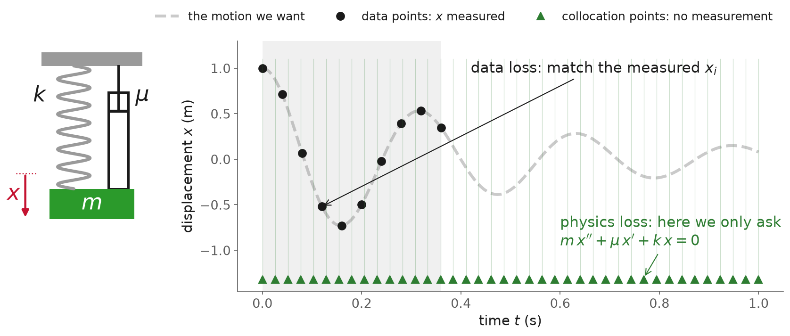

<!--
The physics loss only sees the green points. Between them the equation is not checked at all.
-->

---

## PINNs, the loss term by term

<style scoped>
.pa { position: relative; width: 1100px; height: 420px; margin: 0 auto; }
.pa > div { position: absolute; inset: 0; }
.pa svg { position: absolute; left: 0; top: 0; }
.pa .note { position: absolute; font-size: 19px; line-height: 1.3; background: #f7f7f7; border-left: 5px solid #5c5c5c;
  border-radius: 0 6px 6px 0; padding: 6px 12px; }
</style>

<div class="pa">

<div>
<svg viewBox="0 0 1100 420" width="1100" height="420">
<g font-family="'Times New Roman', Times, serif" fill="#1a1a1a" font-size="34">
<text x="10" y="205"><tspan font-style="italic">L</tspan>(<tspan font-style="italic">θ</tspan>) =</text>
<text x="160" y="188" font-size="26">1</text><line x1="152" y1="196" x2="180" y2="196" stroke="#1a1a1a" stroke-width="2"/><text x="156" y="224" font-size="26" font-style="italic">N</text>
<text x="190" y="215" font-size="46">Σ</text>
<text x="226" y="205">(<tspan font-style="italic">x</tspan><tspan font-size="20" dy="8">NN</tspan><tspan dy="-8">(</tspan><tspan font-style="italic">t</tspan><tspan font-size="20" dy="8" font-style="italic">i</tspan><tspan dy="-8">) − </tspan><tspan font-style="italic">x</tspan><tspan font-size="20" dy="8" font-style="italic">i</tspan><tspan dy="-8">)</tspan><tspan font-size="22" dy="-14">2</tspan></text>
<text x="522" y="205">+</text>
<text x="556" y="205" font-style="italic">λ</text>
<text x="594" y="188" font-size="26">1</text><line x1="586" y1="196" x2="616" y2="196" stroke="#1a1a1a" stroke-width="2"/><text x="588" y="224" font-size="26" font-style="italic">M</text>
<text x="624" y="215" font-size="46">Σ</text>
<text x="660" y="205">(<tspan font-style="italic">m x″</tspan><tspan font-size="20" dy="8">NN</tspan><tspan dy="-8"> + </tspan><tspan font-style="italic">μ x′</tspan><tspan font-size="20" dy="8">NN</tspan><tspan dy="-8"> + </tspan><tspan font-style="italic">k x</tspan><tspan font-size="20" dy="8">NN</tspan><tspan dy="-8">)</tspan><tspan font-size="22" dy="-14">2</tspan></text>
</g>
</svg>
</div>

<div data-marpit-fragment>
<svg viewBox="0 0 1100 420" width="1100" height="420"><defs><marker id="pa1" viewBox="0 0 10 10" refX="9" refY="5" markerWidth="8" markerHeight="8" orient="auto"><path d="M0,0 L10,5 L0,10 z" fill="#1f5c99"/></marker></defs>
<rect x="148" y="150" width="364" height="90" rx="10" fill="none" stroke="#1f5c99" stroke-width="3"/>
<path d="M 200 92 L 230 146" fill="none" stroke="#1f5c99" stroke-width="3" marker-end="url(#pa1)"/></svg>
<div class="note" style="left:20px; top:0; width:360px; border-color:#1f5c99"><b>Fit the data</b>: the 10 measurements, as before</div>
</div>

<div data-marpit-fragment>
<svg viewBox="0 0 1100 420" width="1100" height="420"><defs><marker id="pa2" viewBox="0 0 10 10" refX="9" refY="5" markerWidth="8" markerHeight="8" orient="auto"><path d="M0,0 L10,5 L0,10 z" fill="#2e7d32"/></marker></defs>
<rect x="582" y="150" width="512" height="90" rx="10" fill="none" stroke="#2e7d32" stroke-width="3"/>
<path d="M 840 92 L 840 146" fill="none" stroke="#2e7d32" stroke-width="3" marker-end="url(#pa2)"/></svg>
<div class="note" style="left:600px; top:0; width:480px; border-color:#2e7d32"><b>Obey the equation</b>: its residual at the M = 40 collocation points</div>
</div>

<div data-marpit-fragment>
<svg viewBox="0 0 1100 420" width="1100" height="420"><defs><marker id="pa3" viewBox="0 0 10 10" refX="9" refY="5" markerWidth="8" markerHeight="8" orient="auto"><path d="M0,0 L10,5 L0,10 z" fill="#b07d12"/></marker></defs>
<path d="M 470 306 L 556 222" fill="none" stroke="#b07d12" stroke-width="3" marker-end="url(#pa3)"/></svg>
<div class="note" style="left:220px; top:310px; width:400px; border-color:#b07d12"><b>λ = 0.0001</b> weighs physics against data: the residual is in newtons, hundreds of times larger than x</div>
</div>

<div data-marpit-fragment>
<svg viewBox="0 0 1100 420" width="1100" height="420"><defs><marker id="pa4" viewBox="0 0 10 10" refX="9" refY="5" markerWidth="8" markerHeight="8" orient="auto"><path d="M0,0 L10,5 L0,10 z" fill="#c41230"/></marker></defs>
<path d="M 760 306 L 712 224" fill="none" stroke="#c41230" stroke-width="3" marker-end="url(#pa4)"/></svg>
<div class="note" style="left:660px; top:310px; width:420px; border-color:#c41230"><b>Derivatives</b> x″ and x′ of the network with respect to its input t, by automatic differentiation (Lecture 11)</div>
</div>

</div>

<!--
Residual is zero for any function that obeys the equation.
-->

---

## PINNs in JAX, the network

<div class="ca">
<div>

```python
def init(key, sizes):
    params = []
    for n_in, n_out in zip(sizes[:-1], sizes[1:]):
        key, sub = jax.random.split(key)
        W = jax.random.normal(sub, (n_in, n_out)) * np.sqrt(1 / n_in)
        params.append((W, jnp.zeros(n_out)))
    return params

def net(params, t):
    h = t[:, None]
    for W, b in params[:-1]:
        h = jnp.tanh(h @ W + b)
    W, b = params[-1]
    return (h @ W + b)[:, 0]

def x_nn(params, t):
    return net(params, jnp.array([t]))[0]

params0 = init(jax.random.PRNGKey(0), [1, 32, 32, 32, 1])
```

</div>
<div></div>
<div class="lay" data-marpit-fragment><div class="hl c1" data-lines="1-7" style="top:6px; height:151px"></div><div class="cn c1" style="top:40px">Weights: one (W, b) per layer. W has spread 1/√(inputs), so each weighted sum stays near 1 and tanh starts in its linear range, not saturated (<a href="http://yann.lecun.com/exdb/publis/pdf/lecun-98b.pdf">LeCun et al., 1998</a>)</div></div>
<div class="lay" data-marpit-fragment><div class="hl c2" data-lines="9-14" style="top:174px; height:130px"></div><div class="cn c2" style="top:200px">Forward pass: times in, three tanh layers, displacements out. tanh is smooth, so x″ exists</div></div>
<div class="lay" data-marpit-fragment><div class="hl c3" data-lines="16-17" style="top:321px; height:46px"></div><div class="cn c3" style="top:316px">One time in, one x out: the form <code>jax.grad</code> needs</div></div>
<div class="lay" data-marpit-fragment><div class="hl c4" data-lines="19-19" style="top:384px; height:25px"></div><div class="cn c4" style="top:384px">1 input, 3 × 32 hidden units, 1 output</div></div>
</div>

<!--
From scratch on purpose, no Flax or Equinox here. Same code as l13-pinn-jax.ipynb, section 2.
-->

---

## PINNs in JAX, the physics

<div class="ca">
<div>

```python
dx = jax.grad(x_nn, argnums=1)      # dx/dt
ddx = jax.grad(dx, argnums=1)       # d2x/dt2

def residual(params, ts):
    x = jax.vmap(lambda t: x_nn(params, t))(ts)
    v = jax.vmap(lambda t: dx(params, t))(ts)
    a = jax.vmap(lambda t: ddx(params, t))(ts)
    return m * a + mu * v + k * x

def data_loss(params):
    return jnp.mean((net(params, jnp.array(t_data)) - x_data) ** 2)

def physics_loss(params):
    return jnp.mean(residual(params, jnp.array(t_phys)) ** 2)

lam = 1e-4

def pinn_loss(params):
    return data_loss(params) + lam * physics_loss(params)
```

</div>
<div></div>
<div class="lay" data-marpit-fragment><div class="hl c1" data-lines="1-2" style="top:6px; height:46px"></div><div class="cn c1" style="top:6px"><code>argnums=1</code>: differentiate with respect to <b>t</b>, not the weights. Twice: x″</div></div>
<div class="lay" data-marpit-fragment><div class="hl c2" data-lines="4-8" style="top:69px; height:109px"></div><div class="cn c2" style="top:96px"><code>vmap</code>: evaluate at all collocation points at once. Returns m x″ + μ x′ + k x</div></div>
<div class="lay" data-marpit-fragment><div class="hl c3" data-lines="10-14" style="top:195px; height:109px"></div><div class="cn c3" style="top:214px">Mean squared error on the 10 measurements; mean squared residual at the 40 collocation points</div></div>
<div class="lay" data-marpit-fragment><div class="hl c4" data-lines="16-19" style="top:321px; height:88px"></div><div class="cn c4" style="top:340px">The PINN loss: data plus λ times physics</div></div>
</div>

---

## PINNs in JAX, training

<div class="ca">
<div>

```python
def train(loss, steps=30_000):
    opt = optax.adam(1e-3)
    params = params0
    state = opt.init(params)

    @jax.jit
    def step(params, state):
        grads = jax.grad(loss)(params)
        updates, state = opt.update(grads, state, params)
        return optax.apply_updates(params, updates), state

    for _ in range(steps):
        params, state = step(params, state)
    return params

p_nn = train(data_loss)
p_pinn = train(pinn_loss)
```

</div>
<div></div>
<div class="lay" data-marpit-fragment><div class="hl c1" data-lines="2-4" style="top:27px; height:67px"></div><div class="cn c1" style="top:34px">Adam, learning rate 0.001, from the same starting weights</div></div>
<div class="lay" data-marpit-fragment><div class="hl c2" data-lines="6-10" style="top:111px; height:109px"></div><div class="cn c2" style="top:128px">One step: gradient of the loss with respect to the weights, then Adam's update. <code>jit</code> compiles it</div></div>
<div class="lay" data-marpit-fragment><div class="hl c3" data-lines="12-14" style="top:237px; height:67px"></div><div class="cn c3" style="top:244px">30,000 steps, a few seconds for each network</div></div>
<div class="lay" data-marpit-fragment><div class="hl c4" data-lines="16-17" style="top:321px; height:46px"></div><div class="cn c4" style="top:322px">Same network, same steps: only the loss differs</div></div>
</div>

<!--
Lecture 11's training loop, unchanged. The only new thing is the loss.
-->

---

## PINNs, training

<div class="cols" style="grid-template-columns: 1.75fr 1fr;">
<div>

<div class="cw compact" data-widget="pinn-train" data-source="l13">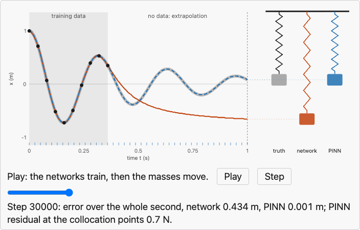</div>

</div>
<div class="small">

* **Play**: the curves train, then the three masses move with what each model predicts
* **First 1,000 steps**: both fit the 10 points; after 0.36 s both are wrong (error over the second about 0.36 m)
* **Steps 1,300 to 8,500**: the physics term pulls the PINN onto the oscillation, error 0.34 m → 0.01 m
* **Plain network**: never improves after the data, about 0.45 m
* **Residual** at the collocation points: 109 N → 0.7 N

</div>
</div>

<!--
One Play: training, then the masses. Watch the orange mass stop oscillating after 0.36 s.
-->

---

## PINNs, result and limits

<div class="cols" style="grid-template-columns: 0.85fr 1.15fr;">
<div>

<div class="kpis" style="grid-template-columns: 1fr 1fr;">
<div class="kpi" style="border-top-color:#c2410c"><div class="v orange">0.54 m</div><div class="l">plain network: error after the data</div></div>
<div class="kpi" style="border-top-color:#1f5c99"><div class="v blue">0.001 m</div><div class="l">PINN: error after the data</div></div>
<div class="kpi" style="border-top-color:#c2410c"><div class="v orange">163 N</div><div class="l">plain network: residual of the equation</div></div>
<div class="kpi" style="border-top-color:#1f5c99"><div class="v blue">5.3 N</div><div class="l">PINN: residual, small but not zero</div></div>
</div>

<p class="source">Error: RMSE against the exact solution, 0.36 to 1 s. Residual: RMS over 0 to 1 s. Same experiment as <a href="https://benmoseley.blog/my-research/so-what-is-a-physics-informed-neural-network/">Ben Moseley's blog post</a>.</p>

</div>
<div class="small">

* **A penalty**: the equation holds approximately, and only where you evaluate it
* **λ** trades physics against data. A different λ gives a different model
* **Training can fail** on harder problems ([Krishnapriyan et al., 2021](https://arxiv.org/abs/2109.01050)); the two loss terms compete ([Wang et al., 2021](https://arxiv.org/abs/2001.04536))
* **One trained PINN is one solution** $x(t)$, for this release from 1 m with these $m$, $\mu$, $k$. Release from 0.5 m and you must train again: the network learned a trajectory, not the law of motion

</div>
</div>

---

<!-- _class: section -->

# From RNNs to neural ODEs

<!--
A PINN learns one solution. From here on we learn the right-hand side, which works for any starting point.
-->

---

## From RNNs to neural ODEs, the residual update

* Residual networks and recurrent networks build a long computation from many small updates of a hidden state $h$:

  $$
  h_{t+1} = h_t + f(h_t, \theta_t) \qquad\text{(Chen et al., 2018, Eq. 1)}
  $$

* An **RNN** over time: the same $f$ at every step, steps of a fixed size $\Delta t$:

  $$
  h_{k+1} = h_k + \Delta t\, f(h_k;\theta)
  $$

* For the spring-mass, $h = (x, v)$: the network learns how the state jumps **from one sample to the next**
* "These iterative updates can be seen as an Euler discretization of a continuous transformation" ([Chen et al., 2018](https://arxiv.org/abs/1806.07366))

<!--
Euler: new state = old state + step size x slope at the old state.
-->

---

## From RNNs to neural ODEs, two pictures

<style scoped>
.pic { font-size: 0.7em; }
.pic .lab { font-weight: 700; margin: 0.3em 0 0.2em; }
.chain { display: flex; align-items: center; justify-content: center; gap: 8px; }
.chain .h { border: 2.5px solid #1a1a1a; border-radius: 50%; width: 70px; height: 70px; display: flex; align-items: center; justify-content: center; background: #fff; font-style: italic; font-size: 1.15em; }
.chain .f { border: 2.5px solid #c2410c; background: #fbeee6; border-radius: 8px; padding: 6px 10px; text-align: center; line-height: 1.25; }
.chain .ar { color: #5c5c5c; font-size: 1.5em; }
.chain .solver { border: 2.5px solid #1f5c99; background: #eaf1f8; border-radius: 12px; padding: 6px 14px; text-align: center; line-height: 1.25; }
.pic .note { text-align: center; color: #5c5c5c; margin: 0.25em 0 0.6em; }
</style>

<div class="pic">
<div class="lab orange">Recurrent network: a fixed step Δt, one jump at a time</div>
<div class="chain">
<div class="h">h₀</div><div class="ar">→</div><div class="f">h₀ + Δt f(h₀; θ)</div><div class="ar">→</div><div class="h">h₁</div><div class="ar">→</div><div class="f">h₁ + Δt f(h₁; θ)</div><div class="ar">→</div><div class="h">h₂</div><div class="ar">→</div><div class="f">h₂ + Δt f(h₂; θ)</div><div class="ar">→</div><div class="h">h₃</div>
</div>
<div class="note">The same network f, with the same weights θ, at every step. It learns the jump for this Δt.</div>

<div data-marpit-fragment>
<div class="lab blue">Neural ODE: a vector field f, integrated by an ODE solver</div>
<div class="chain">
<div class="h">h(t₀)</div><div class="ar">→</div>
<div class="solver">
<svg viewBox="0 0 300 110" width="300" height="110">
<g stroke="#8a8a8a" stroke-width="1.6" fill="none">
<path d="M20 20 l16 6"/><path d="M70 22 l16 4"/><path d="M120 28 l16 2"/><path d="M170 36 l16 -1"/><path d="M220 40 l16 -3"/><path d="M270 40 l16 -4"/>
<path d="M20 60 l16 2"/><path d="M70 60 l16 0"/><path d="M120 62 l16 -2"/><path d="M170 62 l16 -4"/><path d="M220 60 l16 -6"/><path d="M270 56 l16 -6"/>
<path d="M20 95 l16 -4"/><path d="M70 92 l16 -6"/><path d="M120 88 l16 -8"/><path d="M170 82 l16 -8"/><path d="M220 76 l16 -8"/><path d="M270 70 l16 -8"/>
</g>
<path d="M10 90 C 80 70, 150 60, 290 45" stroke="#1f5c99" stroke-width="3" fill="none"/>
<g fill="#1f5c99"><circle cx="10" cy="90" r="4"/><circle cx="48" cy="80" r="4"/><circle cx="115" cy="68" r="4"/><circle cx="200" cy="56" r="4"/><circle cx="290" cy="45" r="4"/></g>
</svg>
<div>ODE solver: dh/dt = f(h, t; θ)</div>
</div>
<div class="ar">→</div><div class="h" style="width:130px; border-radius:40px">h(t), any t</div>
</div>
<div class="note">The network learns the arrows f. The solver takes as many steps as it needs, and returns h at any time.</div>
</div>
</div>

<!--
Top: what an RNN computes. Bottom: what a neural ODE computes. Next slide: why the bottom is the limit of the top.
-->

---

## From RNNs to neural ODEs, the limit

* Read the hidden state as a function of time: $h_k = h(t_k)$, with $t_{k+1} = t_k + \Delta t$
* The recurrent update, divided by the step:

  $$
  \frac{h(t_k + \Delta t) - h(t_k)}{\Delta t} = f\big(h(t_k), t_k, \theta\big)
  $$

* Let $\Delta t \to 0$. The left side tends to the derivative of $h$:

  $$
  \lim_{\Delta t \to 0} \frac{h(t + \Delta t) - h(t)}{\Delta t} = \frac{dh}{dt}(t) = f\big(h(t), t, \theta\big) \qquad\text{(Chen et al., Eq. 2)}
  $$

* "In the limit, we parameterize the continuous dynamics of hidden units using an ordinary differential equation (ODE) specified by a neural network" ([Chen et al., 2018](https://arxiv.org/abs/1806.07366))

<!--
Same f on both sides. The recurrent network is the forward Euler discretization of this ODE.
-->

---

## From RNNs to neural ODEs, shrinking the step

<style scoped>
.cw.compact svg { max-height: 350px; }
.cw.compact > img { max-height: 380px; width: auto; display: block; margin: 0 auto; }
</style>

<div class="readbox" style="margin-bottom:0.3em">

**What it shows**: the spring-mass, with the **true** $f$. **Orange**: a recurrent network stepping $\Delta t$ at a time. **Blue**: the ODE. Press Play: as $\Delta t$ shrinks, the orange steps fall onto the blue curve. With a large step they even spiral out.

</div>

<div class="cw compact" data-widget="phase-plane">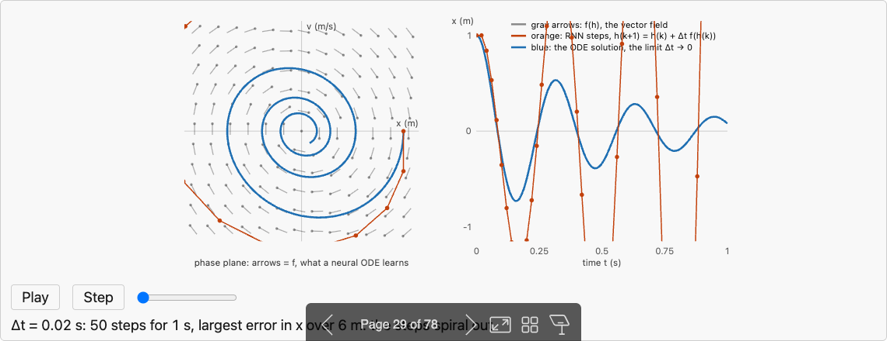</div>

<!--
Left: phase plane, position against velocity; the arrows are f. Right: x(t). Errors 0.85, 0.25, 0.106, 0.049, 0.024 m: halving the step halves the error.
-->

---

## From RNNs to neural ODEs, what is learned

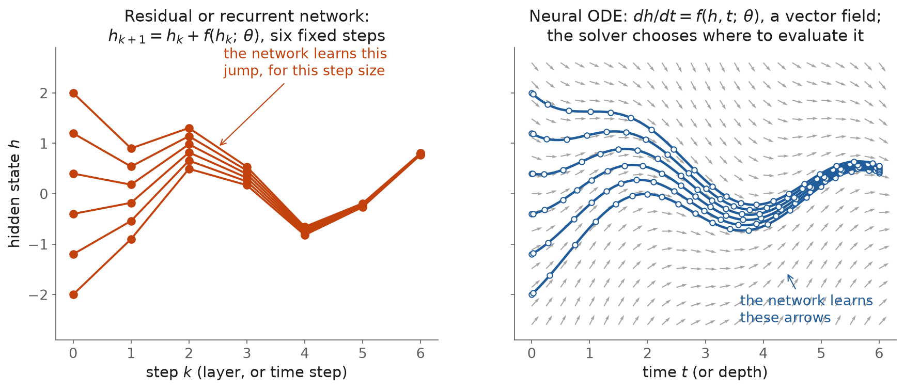

<div class="definition">

**A neural ODE learns the right-hand side $f$: the vector field of the system.** A recurrent network learns one time-discrete realization of it, tied to its step $\Delta t$.

</div>

<!--
Redrawn after Chen et al. Fig. 1. Same arrows work for any starting state and any sampling times.
-->

---

## Neural ODEs, training through the solver

<div class="definition">

**Neural ODE**: a differential equation whose right-hand side is a neural network, $\;dh/dt = f(h, t;\theta)$. An ODE solver computes the output.

</div>

<style scoped>
.tr { position: relative; width: 1120px; height: 270px; margin: 0.2em auto 0; font-size: 0.66em; }
.tr > div { position: absolute; inset: 0; }
.tr .b { position: absolute; display: flex; align-items: center; justify-content: center; text-align: center; line-height: 1.25; border-radius: 10px; }
.tr .st { top: 90px; width: 150px; height: 66px; background: #eaf1f8; border: 2px solid #1f5c99; }
.tr .hh { top: 90px; width: 92px; height: 66px; border: 2.5px solid #1a1a1a; border-radius: 50%; background: #fff; font-style: italic; }
.tr .ln { position: absolute; top: 122px; height: 3px; background: #1a1a1a; }
.tr .ln::after { content: ''; position: absolute; right: -2px; top: -6px; border: 7.5px solid transparent; border-left: 12px solid #1a1a1a; }
.tr .dn { position: absolute; top: 44px; width: 0; height: 44px; border-left: 2px dashed #5c5c5c; }
.tr .bk { position: absolute; top: 166px; height: 36px; border: 3px dashed #c41230; border-top: none; border-radius: 0 0 12px 12px; }
.tr .bt { position: absolute; color: #c41230; }
</style>

<div class="tr">
<div>
<div class="b" style="left:220px; top:0; width:580px; height:42px; background:#f7f7f7; border:2px solid #5c5c5c">network weights θ: the same f(h, t; θ) in every solver step</div>
<div class="dn" style="left:345px"></div><div class="dn" style="left:525px"></div><div class="dn" style="left:705px"></div>
<div class="b hh" style="left:0">h(t₀)</div>
<div class="ln" style="left:94px; width:170px"></div>
<div class="b st" style="left:270px">solver step</div>
<div class="ln" style="left:422px; width:26px"></div>
<div class="b st" style="left:450px">solver step</div>
<div class="ln" style="left:602px; width:26px"></div>
<div class="b st" style="left:630px">solver step</div>
<div class="ln" style="left:782px; width:26px"></div>
<div class="b hh" style="left:812px">h(tᵢ)</div>
<div class="ln" style="left:906px; width:26px"></div>
<div class="b" style="left:936px; top:84px; width:184px; height:78px; background:#f7f7f7; border:2px solid #5c5c5c">loss L: compare h(tᵢ) with the data</div>
</div>
<div data-marpit-fragment>
<div class="bk" style="left:330px; width:700px"></div>
<div class="bt" style="left:250px; top:212px">∂L/∂θ: back through every solver step, by reverse-mode automatic differentiation (Lecture 11)</div>
<div class="bt" style="left:250px; top:240px; color:#5c5c5c">a <b>differentiable integrator</b>: every step is made of JAX operations</div>
</div>
</div>

<!--
Forward: simulate. Backward: the gradient goes through the solver. Over an RNN: data at any times, the solver picks the steps, the state can be physical.
-->

---

## Neural ODEs, Patrick Kidger's work

* Oxford thesis, [On Neural Differential Equations](https://arxiv.org/abs/2202.02435) (2021): networks and differential equations are "two sides of the same coin"
* **Neural CDEs**: "the continuous time analogue of an RNN", for irregular time series ([2020](https://arxiv.org/abs/2005.08926))
* At Google X: [Diffrax](https://docs.kidger.site/diffrax/), differentiable ODE solvers in JAX, and [Equinox](https://docs.kidger.site/equinox/), neural networks in JAX
* Both are what the bioreactor below is built with

---

## Neural ODEs for the bioreactor, the network

<style scoped>
.mdl mjx-container[display="true"] { font-size: 92%; margin: 0.05em 0; }
</style>

<div class="mdl" style="margin-bottom:0.5em">

$$
\frac{dX}{dt} = {\color{#c41230}\mu} X - \frac{F}{V}X, \quad
\frac{dP}{dt} = Y_{P/X}\,{\color{#c41230}\mu} X - \frac{F}{V}P, \quad
\frac{dS}{dt} = \frac{F}{V}(S_f - S) - \frac{{\color{#c41230}\mu} X}{Y_{X/S}}, \quad
\frac{dV}{dt} = F
$$

$$
{\color{#c41230}\mu = \mathrm{NN}(x;\theta)}, \qquad x = (X, P, S, V)
$$

</div>


<div class="ca">
<div>

```python
mu_scale = 0.3                                 # 1/h: sets the size of mu
x_typical = jnp.array([5.0, 1.0, 10.0, 3.0])   # typical X, P, S, V

class GrowthRate(eqx.Module):
    mlp: eqx.nn.MLP

    def __call__(self, x):
        out = self.mlp(x / x_typical)[0]       # any real number
        return mu_scale * jax.nn.softplus(out) # mu >= 0, of order mu_scale
```

</div>
<div></div>
<div class="lay" data-marpit-fragment><div class="hl c1" data-lines="1-2" style="top:6px; height:46px"></div><div class="cn c1" style="top:6px">Two scales. Each state is divided by a typical value, so the network sees numbers near 1. <b>mu_scale</b> sets the size of μ</div></div>
<div class="lay" data-marpit-fragment><div class="hl c2" data-lines="4-5" style="top:69px; height:46px"></div><div class="cn c2" style="top:90px">The unknown term: a small <b>Equinox</b> network (Equinox: neural networks in JAX)</div></div>
<div class="lay" data-marpit-fragment><div class="hl c4" data-lines="7-9" style="top:132px; height:67px"></div><div class="cn c4" style="top:150px">softplus(out) is always positive and about 0.7 at the start, so μ starts near 0.2 1/h, a sensible growth rate. Nothing keeps S ≥ 0</div></div>
</div>

<div class="readbox" style="margin-top:0.5em" data-marpit-fragment>

Known balances with one learned term: also called a **universal differential equation (UDE)**, "defined in full or part by a universal approximator" ([Rackauckas et al., 2020](https://arxiv.org/abs/2001.04385)). Neural ODE, UDE and hybrid model are used interchangeably.

</div>

---

## Neural ODEs for the bioreactor, the balances

<div class="ca">
<div>

```python
def balances(t, x, args):
    mu_net, Sf = args
    X, P, S, V = x
    mu = mu_net(x)                               # the learned term
    dX = mu * X - F / V * X
    dP = Ypx * mu * X - F / V * P
    dS = F / V * (Sf - S) - mu * X / Yxs
    dV = F
    return jnp.array([dX, dP, dS, dV])
```

</div>
<div></div>
<div class="lay" data-marpit-fragment><div class="hl c1" data-lines="1-3" style="top:6px; height:67px"></div><div class="cn c1" style="top:6px">The right-hand side f(t, x) in the form Diffrax wants. <code>args</code> carries the network and the feed concentration S<sub>f</sub></div></div>
<div class="lay" data-marpit-fragment><div class="hl c4" data-lines="4-4" style="top:69px; height:25px"></div><div class="cn c4" style="top:76px">The network gives μ from the four states</div></div>
<div class="lay" data-marpit-fragment><div class="hl c2" data-lines="5-8" style="top:90px; height:88px"></div><div class="cn c2" style="top:118px">One line per balance, as on the board: dX/dt = μX − (F/V)X, ..., dV/dt = F</div></div>
<div class="lay" data-marpit-fragment><div class="hl c3" data-lines="9-9" style="top:174px; height:25px"></div><div class="cn c3" style="top:210px">The four derivatives, stacked</div></div>
</div>

---

## Neural ODEs in Diffrax, the solve

<div class="ca">
<div>

```python
def simulate(mu_net, x0, ts):
    sol = diffrax.diffeqsolve(
        diffrax.ODETerm(balances),
        diffrax.Tsit5(),
        t0=0.0,
        t1=ts[-1],
        dt0=0.1,
        y0=x0,
        args=(mu_net, x0[2]),
        saveat=diffrax.SaveAt(ts=ts),
        stepsize_controller=diffrax.PIDController(
            rtol=1e-6,
            atol=1e-8,
        ),
    )
    return sol.ys
```

</div>
<div></div>
<div class="lay" data-marpit-fragment><div class="hl c1" data-lines="3-3" style="top:48px; height:25px"></div><div class="cn c1" style="top:30px">The right-hand side: our balances</div></div>
<div class="lay" data-marpit-fragment><div class="hl c2" data-lines="4-4" style="top:69px; height:25px"></div><div class="cn c2" style="top:72px">Tsitouras' fifth-order Runge-Kutta method</div></div>
<div class="lay" data-marpit-fragment><div class="hl c3" data-lines="5-9" style="top:90px; height:109px"></div><div class="cn c3" style="top:118px">From 0 to the last sample, first step 0.1 h, from the initial state. <code>args</code> passes the network to <code>balances</code></div></div>
<div class="lay" data-marpit-fragment><div class="hl c4" data-lines="10-14" style="top:195px; height:109px"></div><div class="cn c4" style="top:240px">Return the states at the sample times; adapt the step to keep the error below the tolerances</div></div>
</div>

* Every operation is JAX, so `jax.grad` of anything computed from `sol.ys` goes back through the solver

---

## Neural ODEs for the bioreactor, training

<div class="ca">
<div>

```python
def loss(mu_net):
    pred = jax.vmap(simulate, in_axes=(None, 0, None))(mu_net, x0s, ts)
    return jnp.mean(((pred - ys) / y_scale) ** 2)

mu_net = GrowthRate(eqx.nn.MLP(
    in_size=4,
    out_size=1,
    width_size=16,
    depth=2,
    activation=jnp.tanh,
    key=jax.random.PRNGKey(0),
))
opt = optax.adam(optax.cosine_decay_schedule(1e-2, steps, alpha=0.05))
state = opt.init(eqx.filter(mu_net, eqx.is_array))

@eqx.filter_jit
def step(mu_net, state):
    value, grads = eqx.filter_value_and_grad(loss)(mu_net)
    updates, state = opt.update(grads, state, mu_net)
    return eqx.apply_updates(mu_net, updates), state, value

for _ in range(10_000):
    mu_net, state, value = step(mu_net, state)
```

</div>
<div></div>
<div class="lay" data-marpit-fragment><div class="hl c1" data-lines="1-3" style="top:6px; height:67px"></div><div class="cn c1" style="top:6px">Simulate all three batches, compare with their 31 samples, each state divided by its spread</div></div>
<div class="lay" data-marpit-fragment><div class="hl c2" data-lines="5-12" style="top:90px; height:172px"></div><div class="cn c2" style="top:130px">4 inputs, two hidden layers of 16 tanh units, 1 output</div></div>
<div class="lay" data-marpit-fragment><div class="hl c3" data-lines="13-14" style="top:258px; height:46px"></div><div class="cn c3" style="top:262px">Adam, with a learning rate that decays from 0.01</div></div>
<div class="lay" data-marpit-fragment><div class="hl c4" data-lines="16-23" style="top:321px; height:172px"></div><div class="cn c4" style="top:360px"><b>Sequential</b>: every step simulates, then updates θ. 10,000 steps, 33 s</div></div>
</div>

---

## Neural ODEs for the bioreactor, the fit

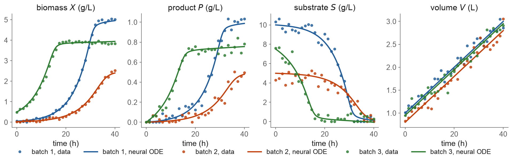

<div class="readbox">

* Dots: three batches, **31 noisy samples** of each state. Lines: the trained neural ODE, simulated from each batch's start
* Error against the true model: 0.045 g/L in $X$ and 0.09 g/L in $S$, within the measurement noise (0.05 and 0.5 g/L)

</div>

---

## Neural ODEs for the bioreactor, the learned growth rate

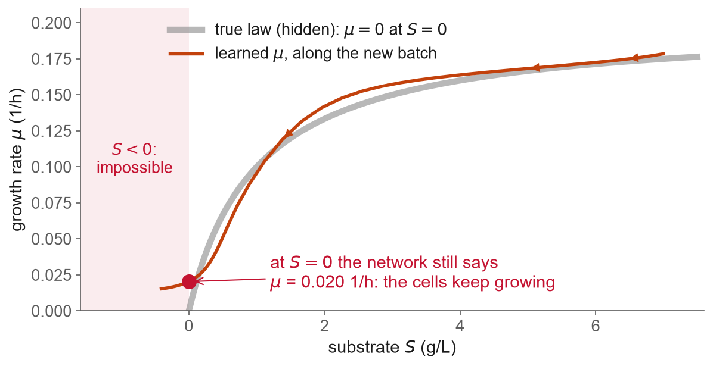

<div class="readbox">

**Takeaway**: the network learned $\mu$ well where the data were. It was never told that cells cannot grow without substrate, so at $S = 0$ it still gives $\mu = 0.020$ 1/h, and the balances drive $S$ below zero.

</div>

---

<!-- _class: section -->

# Physics-enforced machine learning

---

## Physics-enforced machine learning, Gen 2

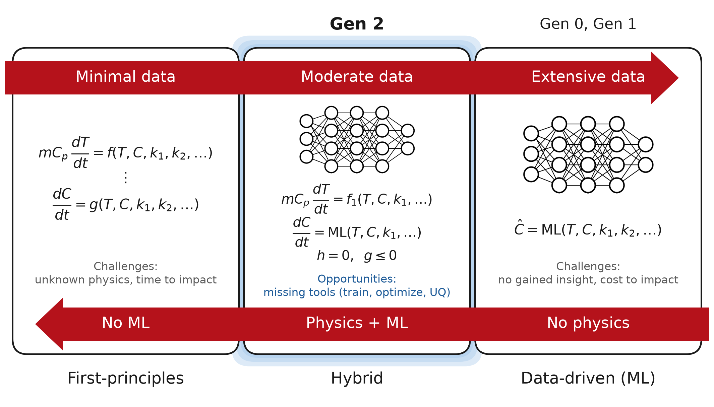

<p class="takeaway">Gen 2 promised <b>guaranteed constraints</b>. A PINN informs the training with the physics; we want the physics <b>enforced</b>.</p>

---

## Physics-enforced machine learning, from a penalty to a constraint

<style scoped>
.pc { display: grid; grid-template-columns: 1fr 70px 1fr; align-items: center; }
.pc > div { border-radius: 10px; padding: 6px 12px; text-align: center; }
.pc .ar { font-size: 2.2em; color: #5c5c5c; }
.pc mjx-container[display="true"] { font-size: 86%; }
</style>

<div class="pc">
<div style="background:#fbf3e3; border:2px solid #b07d12">

**Informed** (PINN)

$$\min_\theta\; L_\text{data} + \lambda\,\lVert r \rVert^2$$

$r$ small, traded against the data

</div>
<div class="ar" data-marpit-fragment>→</div>
<div style="background:#e8f3e9; border:2px solid #2e7d32" data-marpit-fragment>

**Enforced**

$$\min_\theta\; L_\text{data} \quad \text{s.t.}\quad r = 0,\;\; g \le 0$$

$r = 0$ to solver tolerance, every bound held

</div>
</div>

<div class="small">

**Why enforce?**

* **Conservation**: mass and energy balances must close
* **Safety**: a reactor temperature or a pressure must stay below its limit at every instant
* **Physical bounds**: concentrations cannot be negative, the $S < 0$ we just saw
* **Quality and regulation**: a product specification must be met, not approached
* **No λ to tune**, and the guarantee holds outside the training data too

</div>

---

## Physics-enforced machine learning, path constraints

<div class="definition">

**Path constraint**: an inequality on the states that must hold at every instant, $\;g\big(x(t)\big) \le 0$ for all $t$.

</div>

* "Problems of dynamic optimisation with inequality path constraints are common in industrial plants" ([Souza et al., 2006](https://skoge.folk.ntnu.no/prost/proceedings/escape16-pse2006/Part%20A/Volume%2021A/N52257-Topic1/Topic1-%20Oral/1577.pdf))
* **Batch reactor**: limits on cooling duty and "an adiabatic temperature rise constraint that enforces safe operation even if cooling is lost" ([Biegler, 2017](https://skoge.folk.ntnu.no/prost/proceedings/focapo-cpc-2017/FOCAPO-CPC%202017%20Invited%20Papers/78_CPC_Invited.pdf))
* **Plate reactor start-up**: "a temperature path constraint, which is straight forward to enforce using a simultaneous method" ([Haugwitz et al., 2007](https://folk.ntnu.no/skoge/prost/proceedings/dycops2007-and-cab2007/DYCOPS/Wednesday/DynamicOptimization/C1_W51_162_Paperstamped_no.pdf))
* **Our bioreactor**: $S(t) \ge 0$ for all $t$

<!--
Remember "simultaneous": it is the next section.
-->

---

## Physics-enforced machine learning, DAEs

<div class="definition">

**DAE** (differential-algebraic equation): differential equations plus algebraic equations that hold at every instant.

</div>

<div class="cols" style="grid-template-columns: 1fr 1.05fr;">
<div>

<div class="small">

$$
\frac{dx}{dt} = f(x, y), \qquad 0 = g(x, y)
$$


* $x$: **differential states**: levels, concentrations, temperatures
* $y$: **algebraic variables**: flows, pressures, rates, fixed at every instant by $g = 0$
* Process models are full of them: flash equilibrium, flows that balance at a node, a valve equation

</div>

</div>
<div>

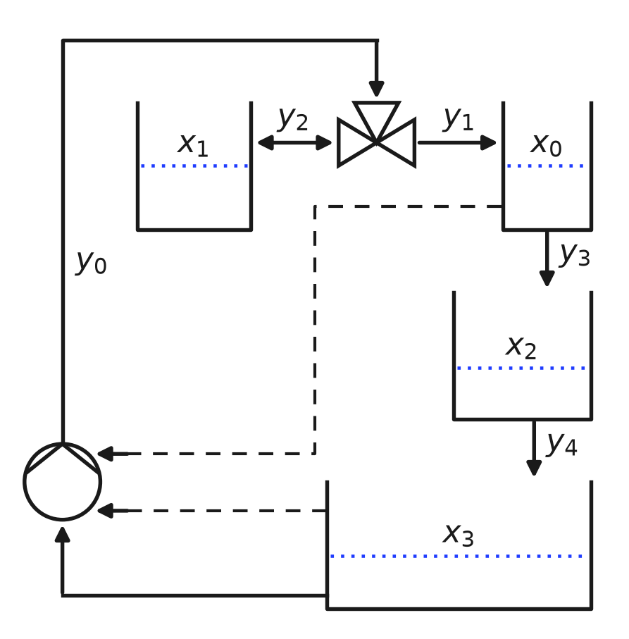

<p class="source">Tank manifold, redrawn from <a href="https://doi.org/10.1007/s10589-026-00823-y">Lueg et al. (2026)</a>, Fig. 1 (CC BY 4.0). Levels x<sub>0</sub> to x<sub>3</sub>, flows y<sub>0</sub> to y<sub>4</sub>; the algebraic equation x<sub>0</sub> = x<sub>1</sub> fixes the flow y<sub>2</sub>.</p>

</div>
</div>

<!--
Algebraic equations are constraints that hold all the time: exactly what we want to enforce.
-->

---

<!-- _class: section -->

# Sequential or simultaneous

---

## Training a dynamic model, the problem

* Fit a dynamic model to data: an optimization problem with the model as a **constraint**

  $$
  \min_{\theta}\; \sum_i \big(x(t_i) - \hat x_i\big)^2
  \quad \text{s.t.} \quad
  \frac{dx}{dt} = f(x;\theta), \quad x(0) = x_0
  $$

* $\hat x_i$: measurements. $\theta$: parameters, or network weights
* A **dynamic optimization** problem. Two classic ways to solve it ([Biegler, 2007](https://doi.org/10.1016/j.cep.2006.06.021)):
  * **Sequential**: simulate, then optimize
  * **Simultaneous**: discretize, then optimize

---

## Sequential approach, simulate then optimize

<style scoped>
.loop { display: grid; grid-template-columns: 1fr 44px 1fr 44px 1fr 44px 1fr; align-items: center; margin-top: 0.2em; }
.loop .st { background: #f7f7f7; border-radius: 8px; border-top: 5px solid #c2410c; padding: 4px 6px; text-align: center; font-size: 0.6em; min-width: 0; overflow: hidden; }
.loop .st p { margin: 0.1em 0; }
.loop .st img { width: 100%; max-width: 100%; margin: 2px 0 0; }
.loop .st mjx-container { font-size: 100%; }
.loop .ar { position: relative; height: 22px; }
.loop .ar::before { content: ''; position: absolute; left: 5px; right: 17px; top: 9px; height: 4px; background: #c2410c; }
.loop .ar::after { content: ''; position: absolute; right: 5px; top: 3px; border-top: 8px solid transparent; border-bottom: 8px solid transparent; border-left: 13px solid #c2410c; }
.back { margin: 6px auto 0; width: 86%; border: 3px solid #c2410c; border-top: none; height: 20px; border-radius: 0 0 14px 14px; position: relative; }
.back::before { content: ''; position: absolute; left: -10px; top: -12px; border: 8px solid transparent; border-bottom: 12px solid #c2410c; }
.back span { position: absolute; left: 50%; top: 18px; transform: translateX(-50%); font-size: 0.6em; color: #c2410c; white-space: nowrap; }
</style>

<div class="definition">

**Sequential approach** (single shooting): guess $\theta$, simulate with an ODE solver, compute the loss and its gradient, update $\theta$, repeat.

</div>

<div class="loop">
<div class="st" data-marpit-fragment>

**1. Guess** $\theta_0 = (\mu, k)$

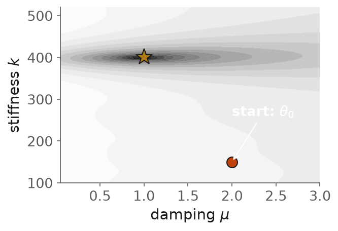

The loss over $(\mu, k)$: one narrow valley

</div>
<div class="ar" data-marpit-fragment></div>
<div class="st" data-marpit-fragment>

**2. Simulate**

$x(t;\theta) =$<br>$\mathrm{ODESolve}(f, x_0, \theta)$

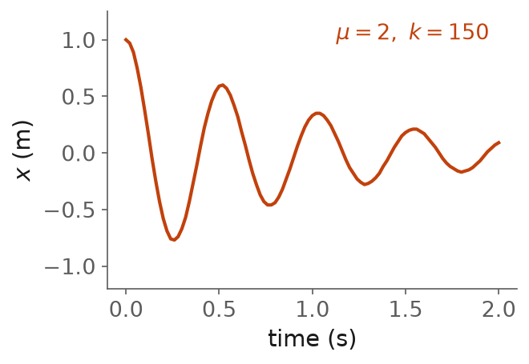

</div>
<div class="ar" data-marpit-fragment></div>
<div class="st" data-marpit-fragment>

**3. Loss and gradient**

$L = \sum_i \big(x(t_i;\theta) - \hat x_i\big)^2$<br>and its gradient $\nabla_\theta L$

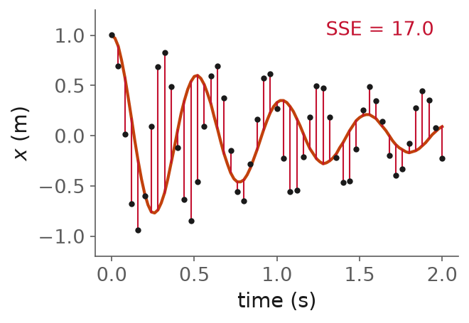

</div>
<div class="ar" data-marpit-fragment></div>
<div class="st" data-marpit-fragment>

**4. Update**

$\theta \leftarrow \theta - \eta\,\nabla_\theta L$ (BFGS: a quasi-Newton step)

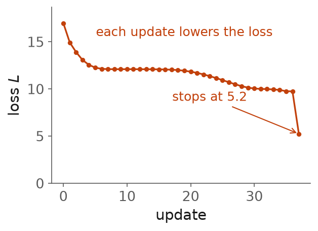

The loss after each update

</div>
</div>

<div class="back" data-marpit-fragment><span>Repeat: every iterate is a full ODE simulation, costly!</span></div>

<!--
Biegler 2017: sequential approaches are known to fail on unstable dynamic systems. Here: stuck at SSE 5.2.
-->

---

## From sequential to simultaneous

<style scoped>
.stack { position: relative; width: 1100px; height: 400px; margin: 0.2em auto 0; }
.stack img { position: absolute; left: 0; top: 0; width: 1100px; margin: 0; background: #fff; }
</style>

<div class="stack">
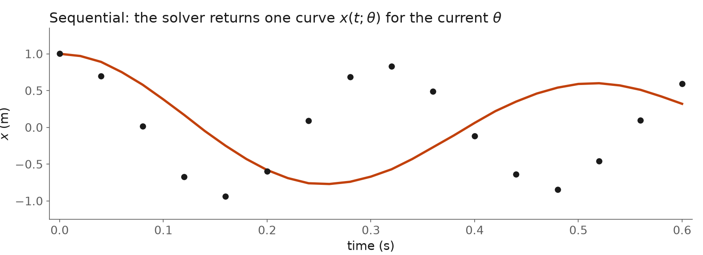
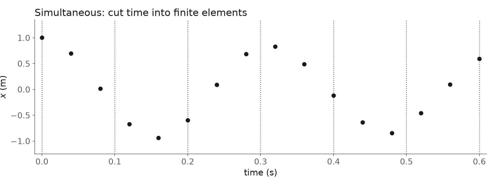
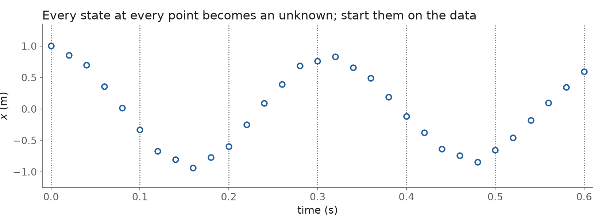
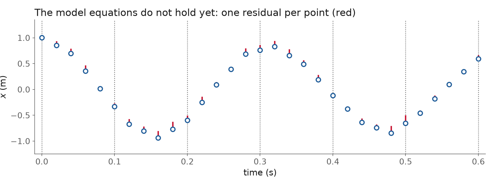
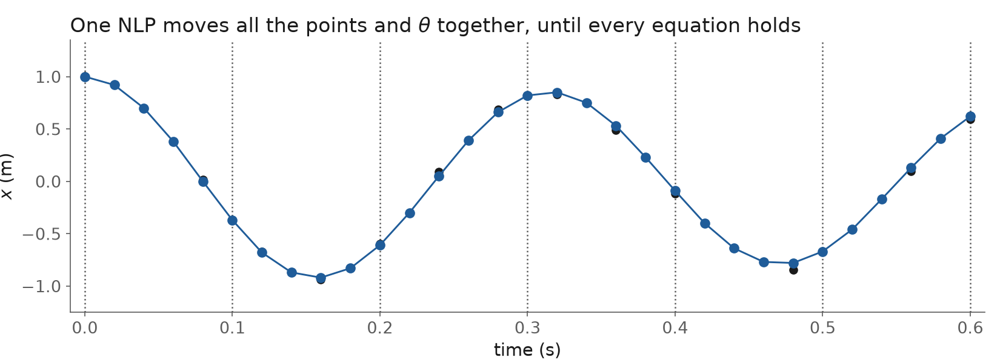
</div>

<p class="takeaway" data-marpit-fragment>Discretize first, then optimize: the states become variables, the ODE becomes algebraic equations.</p>

<!--
Five clicks. Frame 4: red bars are the residuals of the trapezoid rule at the starting point. Frame 5: the POUNCE solution.
-->

---

## Simultaneous approach, discretize then optimize

<div class="definition">

**Simultaneous approach** (collocation): every state at every time point is an unknown, the ODE becomes algebraic equations, and one optimization problem solves for the states and $\theta$ together.

</div>

<style scoped>
.nl mjx-container[display="true"] { font-size: 80%; margin: 0.1em 0; }
.remind { font-size: 0.62em; background: #f7f7f7; border-radius: 8px; padding: 2px 12px; }
.ov { position: relative; }
.ov .lbl { position: absolute; left: 0; top: 0; right: 0; }
.lg { display: inline-flex; align-items: center; gap: 12px; }
</style>

<div class="cols nl" style="grid-template-columns: 0.42fr 1fr;">
<div class="remind" data-marpit-fragment>

**Lecture 9**: a constrained optimization problem

$$
\begin{aligned}
\min_{z} \quad & f(z) \\
\text{s.t.} \quad & h(z) = 0 \\
& g(z) \le 0
\end{aligned}
$$

Here $z$ is every state value and $\theta$

</div>
<div class="ov">
<div data-marpit-fragment>

$$
\begin{aligned}
\min_{\theta,\;x_{ij}}\quad & \sum_i \big(x(t_i) - \hat x_i\big)^2 && \phantom{\text{fit the data}} \\
\text{s.t.}\quad & \sum_{l} x_{il}\,\ell_l'(\tau_j) = h_i\, f(x_{ij};\theta) && \phantom{\text{polynomial slope = model slope}} \\
& x_{i,K} = x_{i+1,0} && \phantom{\text{elements join}} \\
& x_{0,0} = x_0 && \phantom{\text{initial condition}} \\
& g(x_{ij}) \le 0 && \phantom{\text{path constraints}}
\end{aligned}
$$

</div>
<div class="lbl" data-marpit-fragment>

$$
\begin{aligned}
\phantom{\min_{\theta,\;x_{ij}}}\quad & \phantom{\sum_i \big(x(t_i) - \hat x_i\big)^2} && \text{fit the data} \\
\phantom{\text{s.t.}}\quad & \phantom{\sum_{l} x_{il}\,\ell_l'(\tau_j) = h_i\, f(x_{ij};\theta)} && \text{polynomial slope = model slope} \\
& \phantom{x_{i,K} = x_{i+1,0}} && \text{elements join} \\
& \phantom{x_{0,0} = x_0} && \text{initial condition} \\
& \phantom{g(x_{ij}) \le 0} && \text{path constraints}
\end{aligned}
$$

</div>
</div>
</div>

<div class="logos" style="gap:40px; font-size:0.6em">
<div class="lg" data-marpit-fragment><span><a href="https://pyomo.readthedocs.io/en/stable/explanation/modeling/dae.html">Pyomo.DAE</a> writes the model in continuous time and discretizes it</span></div>
<div class="lg" data-marpit-fragment><span><a href="https://coin-or.github.io/Ipopt/">IPOPT</a> solves the NLP</span></div>
</div>

<!--
x_ij: state in element i at point j. l: Lagrange polynomials. h_i: element length. Next slide: what these polynomials look like.
-->

---

## Simultaneous approach, polynomials on finite elements

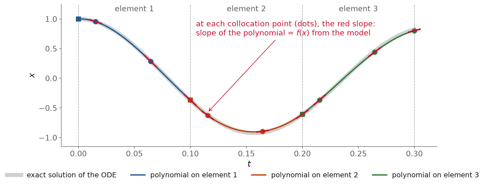

<div class="readbox">

* In each element the state is a **polynomial** (here a cubic) through four points; their values are variables of the NLP
* At each **collocation point** the polynomial's slope must equal the slope the model gives, $f(x)$: this is how the ODE becomes algebraic equations
* Gray: the solution of the ODE. Element by element, the polynomials approximate it

</div>

---

## Sequential or simultaneous, iteration by iteration

<style scoped>
.cw.compact svg { max-height: 330px; }
.cw.compact > img { max-height: 360px; width: auto; display: block; margin: 0 auto; }
.ex mjx-container[display="true"] { margin: 0; }
</style>

<div class="ex small cols" style="grid-template-columns: 1fr 1.3fr; gap: 0.5em">
<div>

$$m\,x'' + {\color{#c41230}\mu}\,x' + {\color{#c41230}k}\,x = 0$$

</div>
<div>

Estimate the damping $\color{#c41230}\mu$ and stiffness $\color{#c41230}k$ from 51 noisy samples over 2 s, starting from $\mu = 2$, $k = 150$. True: $\mu = 1$, $k = 400$

</div>
</div>

<div class="cw compact" data-widget="seq-sim" data-source="l13">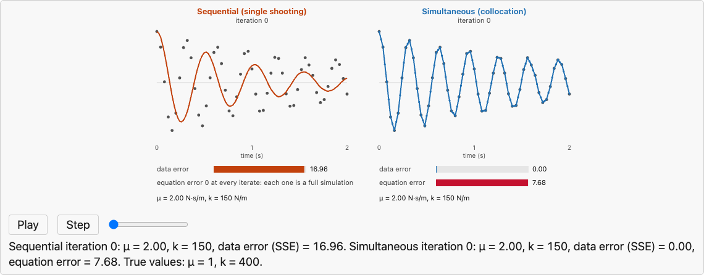</div>

<!--
Same data, start, model. Sequential: Runge-Kutta inside BFGS. Simultaneous: trapezoid on 200 steps, POUNCE, 404 unknowns. Iteration 0: simultaneous on the data, ODE broken.
-->

---

## Sequential or simultaneous, the result

<div class="kpis" style="grid-template-columns: 1fr 1fr;">
<div class="kpi" style="border-top-color:#c2410c">

**Sequential**: 37 BFGS iterations

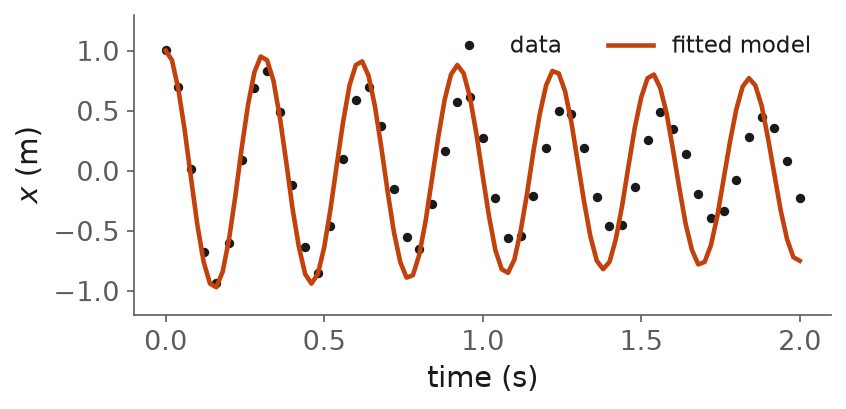

<span class="orange">$\mu = 0.29,\ k = 419$, SSE 5.23</span>: a local minimum

</div>
<div class="kpi" style="border-top-color:#1f5c99" data-marpit-fragment>

**Simultaneous**: 29 interior-point iterations

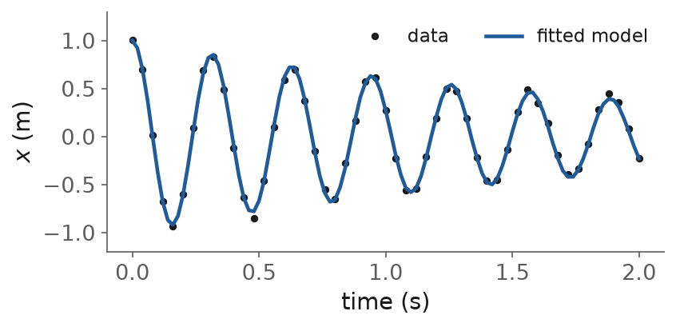

<span class="blue">$\mu = 0.99,\ k = 402$, SSE 0.036</span>: the truth gives 0.038

</div>
</div>

<p class="takeaway" data-marpit-fragment>A slightly wrong oscillation fits the data badly everywhere. The simultaneous states stay pinned to the data while the model equations are repaired.</p>

<!--
From k = 250, 350 or 450 both methods find mu 0.98, k 400: the sequential failure is about the start.
-->

---

## Sequential or simultaneous, side by side

<style scoped>
.vs { width: 1100px; margin: 0 auto; font-size: 0.66em; }
.vs .row { display: grid; grid-template-columns: 1fr 330px 1fr; gap: 10px; align-items: center; margin: 7px 0; }
.vs .c { text-align: center; font-weight: 700; }
.vs .p { border-radius: 20px; padding: 6px 14px; text-align: center; }
.vs .g { background: #e8f3e9; border: 2px solid #2e7d32; }
.vs .a { background: #fbf3e3; border: 2px solid #b07d12; }
.vs .h { font-size: 1.3em; font-weight: 700; text-align: center; }
</style>

<div class="vs">
<div class="row"><div class="h orange">Sequential</div><div></div><div class="h blue">Simultaneous</div></div>
<div class="row" data-marpit-fragment><div class="p g">at every iterate</div><div class="c">Model equations hold</div><div class="p a">only at convergence</div></div>
<div class="row" data-marpit-fragment><div class="p g">the parameters θ</div><div class="c">Unknowns</div><div class="p a">θ and every state at every point</div></div>
<div class="row" data-marpit-fragment><div class="p a">can stall in a local minimum</div><div class="c">Oscillating or unstable dynamics</div><div class="p g">states pinned to the data</div></div>
<div class="row" data-marpit-fragment><div class="p a">penalties, checked afterwards</div><div class="c">Path constraints, S ≥ 0</div><div class="p g">rows of the NLP, enforced</div></div>
<div class="row" data-marpit-fragment><div class="p a">rewritten as ODEs first</div><div class="c">DAEs</div><div class="p g">written at the collocation points</div></div>
<div class="row" data-marpit-fragment><div class="p g">adaptive, error-controlled</div><div class="c">Time steps</div><div class="p a">a fixed grid, chosen beforehand</div></div>
<div class="row" data-marpit-fragment><div class="p g">mini-batches on GPUs</div><div class="c">Big data, big networks</div><div class="p a">the NLP grows with the data</div></div>
</div>

<!--
Green: the better side for that row. Multiple shooting sits between the two.
-->

---

<!-- _class: section -->

# Neural DAEs

---

## Neural DAEs, the same spring-mass

<style scoped>
.pi { display: grid; grid-template-columns: 1fr 0.12fr 1.6fr; align-items: center; }
.pi .ar { font-size: 2em; color: #5c5c5c; text-align: center; }
.pi .box { border: 3px solid #1a1a1a; border-radius: 16px; padding: 6px 14px; font-size: 0.74em; display: grid; grid-template-columns: auto 160px; align-items: center; gap: 10px; }
.pi .box img { width: 150px; margin: 0; }
.enf { border: 2px solid #2e7d32; border-radius: 8px; padding: 4px 10px; font-size: 0.66em; display: inline-block; }
</style>

<div class="pi">
<div>


</div>
<div class="ar">→</div>
<div class="box">
<div>

$$
\begin{aligned}
\min_\theta\ \ & \sum_i \big(x(t_i) - \hat x_i\big)^2 \\
\text{s.t.}\ \ & m\,x'' + {\color{#c41230}z}\,x' + k\,x = 0 \\
& {\color{#c41230}z} = \mathrm{NN}(x, x';\theta) \\
& h(x) = 0,\ \ g(x) \le 0
\end{aligned}
$$

</div>

</div>
</div>

* Same data, same physics. The unknown part, here the damping, is the network output ${\color{#c41230}z}$
* The equation is a **constraint**, not a term in the loss

<p style="text-align:center; margin: 0.3em 0" data-marpit-fragment><span class="enf">Physics is now <b>enforced, rather than informed</b>; constraints are written into the NLP</span></p>

<!--
Compare with the PINN slide: the physics moved from the loss to the constraints.
-->

---

## Neural DAEs, the training problem

<style scoped>
.nlp ul { list-style: none; padding: 0; margin: 0.2em auto; width: 1120px; font-size: 0.76em; }
.nlp li { display: grid; grid-template-columns: 60px 520px 70px 1fr; align-items: center; gap: 8px; margin: 5px 0; }
.nlp li::before { content: none; }
.nlp .k { text-align: right; }
.nlp .ar { height: 3px; background: #c41230; position: relative; }
.nlp .ar::before { content: ''; position: absolute; left: -12px; top: -6px; border: 7.5px solid transparent; border-right: 12px solid #c41230; }
.nlp .lab { background: #c41230; color: #fff; border-radius: 8px; padding: 4px 12px; font-size: 0.85em; text-align: center; }
</style>

<div class="definition">

**Neural DAE**: a DAE in which some unknown terms are neural networks, trained with the simultaneous approach ([Lueg, Alves, Schicksnus, Kitchin, Laird and Biegler, 2026](https://doi.org/10.1007/s10589-026-00823-y), open access).

</div>

<div class="nlp">

* <span class="k">$\min$</span><span class="eq">$\sum_s \sum_i \lVert x^{(s)}(t_i) - \hat x^{(s)}_i \rVert^2 + \alpha_r \tfrac{1}{2}\lVert\theta\rVert^2$</span><span class="ar"></span><span class="lab">Every trajectory + regularization</span>
* <span class="k">$\text{s.t.}$</span><span class="eq">$\dfrac{dx^{(s)}}{dt} = f\big(x^{(s)}, y^{(s)}, z^{(s)}\big)$</span><span class="ar"></span><span class="lab">Differential equations</span>
* <span class="k"></span><span class="eq">$0 = h\big(x^{(s)}, y^{(s)}, z^{(s)}\big)$</span><span class="ar"></span><span class="lab">Algebraic equations</span>
* <span class="k"></span><span class="eq">$0 \ge g\big(x^{(s)}, y^{(s)}, z^{(s)}\big)$</span><span class="ar"></span><span class="lab">Inequalities, such as S ≥ 0</span>
* <span class="k"></span><span class="eq">$z^{(s)} = f_\text{NN}\big(x^{(s)};\theta\big)$</span><span class="ar"></span><span class="lab">The network: the unknown terms</span>
* <span class="k"></span><span class="eq">$x^{(s)}(t_0) = x^{(s)}_0$</span><span class="ar"></span><span class="lab">Initial conditions</span>

</div>

<div class="small">

- **Every line at every collocation point of every batch $s$** → the physics holds exactly at the solution
- **One $\theta$ for all batches** → one network, reusable for new starting charges and feed profiles

</div>

<!--
The paper's Eq. 4. Smooth activations (tanh): the solver uses second derivatives of the network.
-->

---

## Neural DAEs, the fed-batch reactor again

<div class="cols" style="grid-template-columns: 1.1fr 1fr;">
<div>


</div>
<div>

<div class="definition">

**Inference**: use the trained model to predict a case it has never seen, with the network weights fixed.

</div>

<div class="small">

* Same three training batches for both models
* **New batch**: 0.2 g/L of cells, 7 g/L of substrate, 0.9 L, for 60 h
* **Neural ODE**: integrate the learned model (sequential)
* **Neural DAE**: solve the balances as an NLP, with $S \ge 0$ (simultaneous)

</div>

</div>
</div>

---

## Neural DAEs, inference on a new batch

<div class="cw compact" data-widget="fedbatch-run" data-source="l13">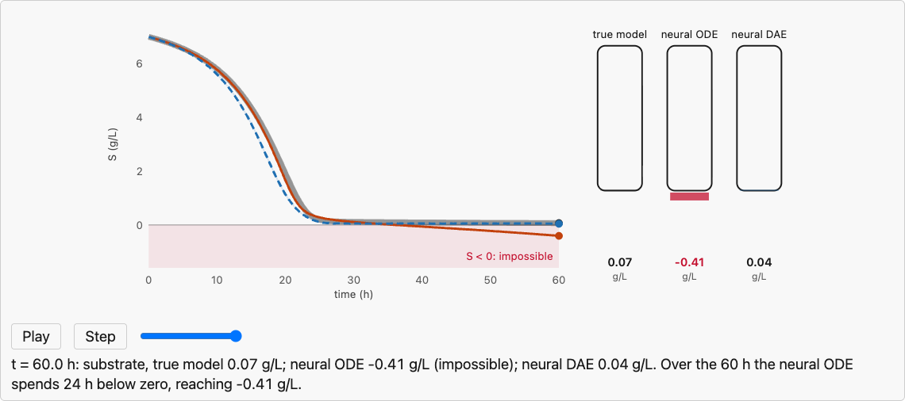</div>

<!--
Play. The neural ODE vessel drains through the floor at 25 h. The neural DAE sits on the floor.
-->

---

## Neural DAEs, the result

<div class="kpis" style="grid-template-columns: repeat(3, 1fr);">
<div class="kpi"><div class="v">0.07 g/L</div><div class="l">lowest substrate, <b>true mechanistic model</b></div></div>
<div class="kpi" style="border-top-color:#c2410c" data-marpit-fragment><div class="v orange">−0.41 g/L</div><div class="l"><b>sequential approach / neural ODE</b>: below zero for 24 of 60 h</div></div>
<div class="kpi" style="border-top-color:#1f5c99" data-marpit-fragment><div class="v blue">0.04 g/L</div><div class="l"><b>neural DAE</b>: never below zero</div></div>
</div>


<p class="takeaway" data-marpit-fragment>Feasible is not the same as accurate: the substrate error (RMSE) is 0.20 g/L for the neural ODE and 0.29 g/L for the neural DAE.</p>

---

## SiNDAE

<style scoped>
.tools { display: grid; grid-template-columns: repeat(3, 1fr); gap: 14px; margin-top: 0.3em; }
.grp { background: #f7f7f7; border-radius: 10px; padding: 6px 10px; border-top: 6px solid #5c5c5c; }
.grp .gh { font-weight: 700; font-size: 0.7em; text-align: center; margin-bottom: 4px; }
.tl { display: grid; grid-template-columns: 120px 1fr; gap: 8px; align-items: center; margin: 6px 0; font-size: 0.56em; line-height: 1.25; }
.tl img { width: 120px; max-height: 52px; object-fit: contain; margin: 0; background: #fff; border-radius: 4px; }
.tl span { position: relative; padding-left: 14px; }
.tl span::before { content: '◀'; position: absolute; left: 0; color: #5c5c5c; font-size: 0.8em; top: 1px; }
</style>

<div class="cols" style="grid-template-columns: 0.55fr 1.45fr; gap: 0.8em;">
<div>

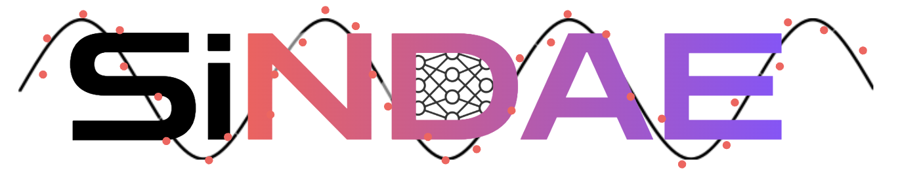

</div>
<div class="small">

**SiNDAE**: Simultaneous Neural Differential-Algebraic Systems of Equations. A Python package that learns unknown terms in dynamical systems from noisy time series while fully satisfying the constraints. `pip install sindae`, free and open source: [code](https://github.com/Alves-research-group/SiNDAE), [documentation](https://alves-research-group.github.io/SiNDAE/)

</div>
</div>

<div class="tools">
<div class="grp" style="border-top-color:#1f5c99" data-marpit-fragment>
<div class="gh">Physics modeling</div>
<div class="tl"><span><b>Pyomo</b>: write the model's equations and constraints</span></div>
<div class="tl"><span><b>Pyomo.DAE</b>: derivatives in time, and their discretization</span></div>
</div>
<div class="grp" style="border-top-color:#2e7d32" data-marpit-fragment>
<div class="gh">Machine learning</div>
<div class="tl"><span><b>JAX</b>: the network and its derivatives</span></div>
<div class="tl"><span><b>ONNX</b>: a file format to export the trained network</span></div>
<div class="tl"><span><b>OMLT</b>: puts trained networks into Pyomo models</span></div>
</div>
<div class="grp" style="border-top-color:#c41230" data-marpit-fragment>
<div class="gh">Constrained optimization</div>
<div class="tl"><span><b>IPOPT</b>: interior-point solver for the NLP</span></div>
<div class="tl"><span><b>POUNCE</b>: interior-point solver, no license needed</span></div>
</div>
</div>

---

## SiNDAE, the problem in code: the class

<div class="ca">
<div>

```python
class FedBatchBioreactorProblem(ProblemDefinition):
    def __init__(
        self,
        params,
        ics,
        input_dim,
        z_dim,
        t_span,
        nfe,
        ncp,
        obs_times=None,
        obs_values=None,
        obs_dim=None,
    ):
        super().__init__(ics, input_dim, z_dim, t_span, nfe, ncp,
                         obs_times, obs_values, obs_dim)
        self.params = params
```

</div>
<div></div>
<div class="lay" data-marpit-fragment><div class="hl c1" data-lines="1-1" style="top:6px; height:21px"></div><div class="cn c1" style="top:6px">A problem is a subclass of SiNDAE's <b>ProblemDefinition</b></div></div>
<div class="lay" data-marpit-fragment><div class="hl c2" data-lines="2-14" style="top:27px; height:273px"></div><div class="cn c2" style="top:27px">Its arguments: the initial charge of each batch, 4 states and 1 learned term, the time span, the finite elements and collocation points, and the measurements</div></div>
<div class="lay" data-marpit-fragment><div class="hl c3" data-lines="15-16" style="top:300px; height:42px"></div><div class="cn c3" style="top:300px"><b>ProblemDefinition</b> stores them</div></div>
<div class="lay" data-marpit-fragment><div class="hl c4" data-lines="17-17" style="top:342px; height:21px"></div><div class="cn c4" style="top:342px">Plus our parameters: feed rate and yields</div></div>
</div>

<!--
As in the SiNDAE fed-batch example, with F P / V in the product balance. This and the next two slides are one cell of l13-neural-dae.ipynb.
-->

---

## SiNDAE, the problem in code: the variables

<div class="ca">
<div>

```python
    def build_trajectory(self, block, traj_idx):
        p = self.params
        t0 = self.t_span[0]
        x0 = self.ics[traj_idx]
        Sf = float(x0[2])                # feed concentration = initial substrate
        Feed, Ypx, Yxs = p["Feed"], p["Ypx"], p["Yxs"]

        block.t = dae.ContinuousSet(bounds=self.t_span)
        block.x = pyo.Var(
            block.t,
            range(self.input_dim),
            domain=pyo.NonNegativeReals,
            initialize=1.0,
        )
        block.z = pyo.Var(block.t, range(self.z_dim), initialize=0.1)
        block.dxdt = dae.DerivativeVar(block.x, wrt=block.t)
```

</div>
<div></div>
<div class="lay" data-marpit-fragment><div class="hl c1" data-lines="1-6" style="top:6px; height:126px"></div><div class="cn c1" style="top:6px">Called once per batch: that batch's initial charge, feed and yields</div></div>
<div class="lay" data-marpit-fragment><div class="hl c2" data-lines="8-8" style="top:153px; height:21px"></div><div class="cn c2" style="top:153px">Time, continuous: Pyomo.DAE discretizes it later</div></div>
<div class="lay" data-marpit-fragment><div class="hl c3" data-lines="9-14" style="top:174px; height:126px"></div><div class="cn c3" style="top:174px">The states X, P, S, V at every time, <b>non-negative</b>: here is S ≥ 0</div></div>
<div class="lay" data-marpit-fragment><div class="hl c4" data-lines="15-16" style="top:300px; height:42px"></div><div class="cn c4" style="top:300px">z = μ: a free variable the network will set. dx/dt: the derivatives of the states</div></div>
</div>

---

## SiNDAE, the problem in code: the balances

<div class="ca">
<div>

```python
        @block.Constraint(block.t, range(self.input_dim))
        def diffeq(b, t, s):
            mu = b.z[t, 0]               # growth rate, learned by the network
            X, P, S, V = b.x[t, 0], b.x[t, 1], b.x[t, 2], b.x[t, 3]
            if s == 0:
                return b.dxdt[t, 0] == mu * X - Feed * (X / V)
            elif s == 1:
                return b.dxdt[t, 1] == Ypx * mu * X - Feed * (P / V)
            elif s == 2:
                return b.dxdt[t, 2] == Feed * (Sf - S) / V - mu * (X / Yxs)
            else:
                return b.dxdt[t, 3] == Feed

        for j in range(self.input_dim):
            block.x[t0, j].fix(float(x0[j]))

    def get_input_vars(self, block, t):
        return [block.x[t, j] for j in range(self.input_dim)]

    def get_output_vars(self, block, t):
        return [block.z[t, 0]]
```

</div>
<div></div>
<div class="lay" data-marpit-fragment><div class="hl c1" data-lines="1-4" style="top:6px; height:84px"></div><div class="cn c1" style="top:6px">A constraint for every time t and every state s: these are rows of the NLP</div></div>
<div class="lay" data-marpit-fragment><div class="hl c2" data-lines="5-12" style="top:90px; height:168px"></div><div class="cn c2" style="top:90px">The four balances, one per branch, as on the board. No formula for μ</div></div>
<div class="lay" data-marpit-fragment><div class="hl c3" data-lines="14-15" style="top:279px; height:42px"></div><div class="cn c3" style="top:279px">Fix the initial charge of the batch</div></div>
<div class="lay" data-marpit-fragment><div class="hl c4" data-lines="17-21" style="top:342px; height:105px"></div><div class="cn c4" style="top:342px">The network: the states in, z = μ out</div></div>
</div>

---

## SiNDAE, the network and the training stages

<div class="ca">
<div>

```python
mlp = SimpleMLP(
    in_size=INPUT_DIM,
    out_size=Z_DIM,
    widths=[20, 20],
    activations=[jax.nn.softplus] * 2,
    key=jax.random.PRNGKey(SEED),
)
smoother_config = SmootherConfig(smooth_coef=10.0)
pretrain_config = PretrainConfig(
    epochs=200,
    batch_size=32,
    reg_coef=1e-3,
)
simul_config = SimultaneousConfig(
    use_gbm=True,
    reg_coef=1e-3,
)
solver_options = SolverConfig(
    tol=1e-6,
    max_iter=1000,
    hessian_approximation="limited-memory",
)
```

</div>
<div></div>
<div class="lay" data-marpit-fragment><div class="hl c1" data-lines="1-7" style="top:6px; height:147px"></div><div class="cn c1" style="top:6px">The network: 4 states in, μ out, two hidden layers of 20 softplus units, smooth as the solver needs</div></div>
<div class="lay" data-marpit-fragment><div class="hl c2" data-lines="8-8" style="top:153px; height:21px"></div><div class="cn c2" style="top:153px">Stage 1, smoother: smooth trajectories through the data, μ free</div></div>
<div class="lay" data-marpit-fragment><div class="hl c3" data-lines="9-13" style="top:174px; height:105px"></div><div class="cn c3" style="top:174px">Stage 2, pretraining: fit the network to the smoother's states and μ, with Adam</div></div>
<div class="lay" data-marpit-fragment><div class="hl c4" data-lines="14-22" style="top:279px; height:189px"></div><div class="cn c4" style="top:279px">Stage 3, simultaneous: one NLP with the weights, every state and the balances. The network is evaluated in JAX, so the solver approximates second derivatives (L-BFGS)</div></div>
</div>

---

## SiNDAE, training

<style scoped>
.ca pre, .ca pre code { font-size: 14px; line-height: 19px; }
.ca + .ca { margin-top: 10px; }
</style>

<div class="ca">
<div>

```python
problem = FedBatchBioreactorProblem(
    params=FB_PARAMS,
    ics=BATCH_ICS,
    input_dim=INPUT_DIM,
    z_dim=Z_DIM,
    t_span=T_SPAN,
    nfe=NFE_TRAIN,
    ncp=NCP_TRAIN,
    obs_dim=OBS_DIM,
    obs_times=obs_times,
    obs_values=obs_values,
)
```

</div>
<div></div>
<div class="lay" data-marpit-fragment><div class="hl c1" data-lines="2-9" style="top:27px; height:168px"></div><div class="cn c1" style="top:27px">The three batches over 40 h, cut into 40 finite elements of 3 collocation points</div></div>
<div class="lay" data-marpit-fragment><div class="hl c2" data-lines="10-11" style="top:195px; height:42px"></div><div class="cn c2" style="top:195px">The measurements: 31 samples of the 4 states in each batch</div></div>
</div>

<div class="ca">
<div>

```python
model = HybridDAE(
    method="simultaneous",
    nlp_solver="pounce",
    net=mlp,
    smoother=smoother_config,
    pretrain=pretrain_config,
    train=simul_config,
    solver_options=solver_options,
    unfix_io=True,
)
model.fit(problem)
```

</div>
<div></div>
<div class="lay" data-marpit-fragment><div class="hl c3" data-lines="2-9" style="top:27px; height:168px"></div><div class="cn c3" style="top:27px">Simultaneous training, solved by POUNCE, with the network and the three stages</div></div>
<div class="lay" data-marpit-fragment><div class="hl c4" data-lines="11-11" style="top:216px; height:21px"></div><div class="cn c4" style="top:216px"><b>fit</b>: smoother, pretraining, then the full NLP. About a minute</div></div>
</div>

---

## SiNDAE, prediction

<div class="ca">
<div>

```python
new_problem = FedBatchBioreactorProblem(
    params=FB_PARAMS,
    ics=np.array([[0.20, 0.0, 7.0, 0.90]]),
    input_dim=INPUT_DIM,
    z_dim=Z_DIM,
    t_span=(0.0, 60.0),
    nfe=45,
    ncp=3,
    obs_dim=OBS_DIM,
)
prediction = model.predict(
    new_problem,
    slack_coef=1e-5,
)
```

</div>
<div></div>
<div class="lay" data-marpit-fragment><div class="hl c1" data-lines="1-3" style="top:6px; height:63px"></div><div class="cn c1" style="top:6px">The same class, a new batch: 0.2 g/L of cells, 7 g/L of substrate, 0.9 L</div></div>
<div class="lay" data-marpit-fragment><div class="hl c2" data-lines="6-8" style="top:111px; height:63px"></div><div class="cn c2" style="top:111px">60 h, 20 h past the training batches, and no measurements</div></div>
<div class="lay" data-marpit-fragment><div class="hl c4" data-lines="11-14" style="top:216px; height:84px"></div><div class="cn c4" style="top:216px"><b>predict</b>: the network fixed, the DAE solved with S ≥ 0 held. <b>slack_coef</b>: the price on moving μ off the network where a constraint would break</div></div>
</div>

---

## Monoclonal antibodies, why glycosylation

<div class="cols" style="grid-template-columns: 1.3fr 1fr;">
<div>


</div>
<div class="small">

- **Monoclonal antibodies (mAbs)**: medicines for cancers, autoimmune and infectious diseases, mostly made by CHO cells in fed-batch reactors
* **Glycosylation**: sugar chains (glycans) attached to the antibody inside the cell, in the Golgi
* The glycans are a **critical quality attribute** (CQA): "the terminal sugars of Fc glycans have been shown to be critical for safety or efficacy" ([Reusch and Tejada, 2015](https://pmc.ncbi.nlm.nih.gov/articles/PMC4634315/))
* They also change how long the drug stays in the body, and immune reactions to it

</div>
</div>

<!--
CQA: must stay within a range for the product to be released. Process scale is mechanistic; Golgi scale is poorly known.
-->

---

## Monoclonal antibodies, a hybrid glycosylation model

<div class="cols" style="grid-template-columns: 1fr 1fr;">
<div>

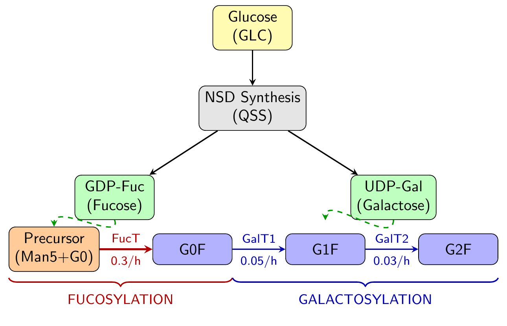

</div>
<div class="small">

* **9 states**: viable cells, glucose, glutamine, lactate, ammonia, antibody, and three glycoforms G0F, G1F, G2F
* **Mechanistic**: six culture balances, and three glycan equations with the rates above
* **Algebraic**: nucleotide sugar donors (NSD) at quasi-steady state, set by glucose at every instant: a **DAE**
* **Learned**: the growth rate, $\;{\color{#c41230}\mu = f_\text{NN}(x;\theta)}$, 9 → 16 → 16 → 1, tanh
* **Why $\mu$**: it is never measured, and its usual law (Monod, inhibited by lactate and ammonia) is an assumption

</div>
</div>

<!--
Proof of concept from my group: model after Kotidis et al. 2019. Precursor -> G0F (fucosylation) -> G1F -> G2F (galactosylation).
-->

---

## Monoclonal antibodies, the multiscale equations

<style scoped>
.ms { display: grid; grid-template-columns: 190px 1fr; gap: 8px 14px; align-items: center; font-size: 0.8em; }
.ms .lab { border-radius: 8px; padding: 8px 10px; color: #fff; font-weight: 700; text-align: center; line-height: 1.2; font-size: 0.8em; }
.ms mjx-container[display="true"] { margin: 0.05em 0; text-align: left !important; }
.ms .eq { background: #f7f7f7; border-radius: 8px; padding: 2px 12px; }
</style>

<div class="ms">
<div class="lab" style="background:#1f5c99">Process scale<br><span style="font-weight:400">the bioreactor, 6 ODEs</span></div>
<div class="eq">

$$
\frac{dX_v}{dt} = ({\color{#c41230}\mu} - \mu_d)\,X_v, \qquad
\frac{dGLC}{dt} = -\Big(\frac{{\color{#c41230}\mu} - \mu_d}{Y_{X_v/glc}} + m_{glc}\frac{GLC}{K_{glc} + GLC}\Big)X_v, \quad \dots \qquad {\color{#c41230}\mu = f_\text{NN}(x;\theta)}
$$

</div>
<div class="lab" style="background:#2e7d32" data-marpit-fragment>Cell scale<br><span style="font-weight:400">sugar donors, algebraic</span></div>
<div class="eq" data-marpit-fragment>

$$
\text{UDP-Gal} = \frac{V_{max,Gal}\,GLC}{K_{M,Gal} + GLC}, \qquad \text{GDP-Fuc} = \frac{V_{max,Fuc}\,GLC}{K_{M,Fuc} + GLC}
$$

</div>
<div class="lab" style="background:#c2410c" data-marpit-fragment>Golgi scale<br><span style="font-weight:400">glycans, 3 ODEs</span></div>
<div class="eq" data-marpit-fragment>

$$
\begin{aligned}
\frac{dG0F}{dt} &= k_{FucT}\,\text{Pre}\;\phi_{Fuc} - k_{GalT1}\,G0F\;\phi_{Gal}, \qquad \text{Pre} = 1 - G0F - G1F - G2F \\
\frac{dG1F}{dt} &= k_{GalT1}\,G0F\;\phi_{Gal} - k_{GalT2}\,G1F\;\phi_{Gal}, \qquad \frac{dG2F}{dt} = k_{GalT2}\,G1F\;\phi_{Gal}
\end{aligned}
$$

</div>
</div>

<div class="small" style="margin-top:0.4em">

$\phi_{Gal} = \dfrac{\text{UDP-Gal}}{K_{UDP\text{-}Gal} + \text{UDP-Gal}}$, $\;\phi_{Fuc} = \dfrac{\text{GDP-Fuc}}{K_{GDP\text{-}Fuc} + \text{GDP-Fuc}}$. <b class="red">Red: the learned term.</b> The algebraic sugar donors make the whole model a DAE.

</div>

<!--
Six culture ODEs: viable cells, glucose, glutamine, lactate, ammonia, antibody. Glycan rates from Kotidis et al. 2019.
-->

---

## Monoclonal antibodies, results

<div class="cols" style="grid-template-columns: 1fr 1.05fr;">
<div>

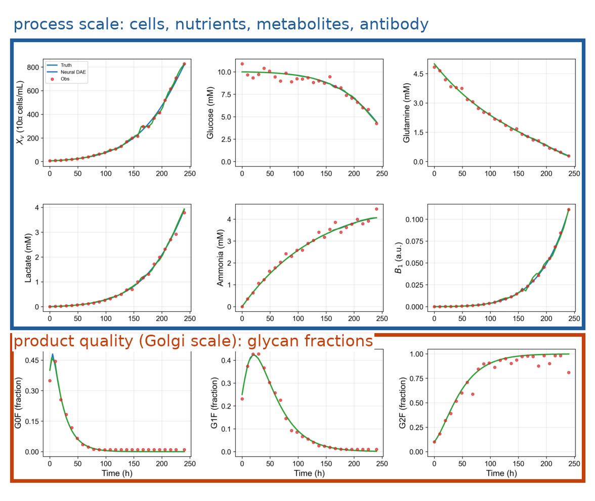

</div>
<div>

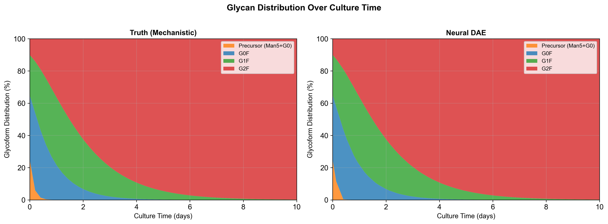

<div class="small">

* **Data at two scales, one model**: process measurements (blue box) and product-quality measurements, the glycan fractions (orange box)
* **Synthetic data**: the mechanistic model plus noise, half of the samples kept, three runs of 10 days
* Blue: true model. Green: neural DAE. Red dots: noisy data. **Limits**: 3 of more than 33 glycoforms; quasi-steady sugar donors; the learned $\mu(t)$ oscillates

</div>
</div>
</div>

---

<!-- _class: section -->

# Constraints inside the network

---

## Projection layers

<div class="definition">

**Projection layer**: a last layer that moves the network's raw output $\tilde y$ to the closest point that satisfies the constraints.

</div>

<style scoped>
.arch { position: relative; width: 1120px; height: 196px; margin: 0.1em auto 0; font-size: 0.7em; }
.arch > div { position: absolute; inset: 0; }
.arch .b { position: absolute; top: 8px; height: 84px; border-radius: 10px; display: flex; align-items: center; justify-content: center; text-align: center; line-height: 1.25; padding: 0 6px; }
.arch .ln { position: absolute; top: 47px; height: 3px; background: #1a1a1a; }
.arch .ln::after { content: ''; position: absolute; right: -2px; top: -6px; border: 7.5px solid transparent; border-left: 12px solid #1a1a1a; }
.arch .bk { position: absolute; top: 112px; height: 40px; border: 3px dashed #c41230; border-top: none; border-radius: 0 0 12px 12px; }
.arch .bt { position: absolute; top: 160px; color: #c41230; }
</style>

<div class="cols" style="grid-template-columns: 300px 1fr; gap: 0.8em; align-items: center;">
<div>

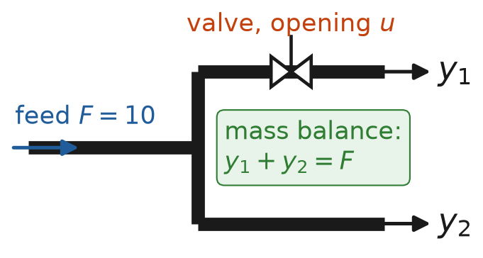

</div>
<div class="small">

* **Input** $u$: the valve opening. **Outputs** $y_1, y_2$: the two outlet flows
* **Balance**: $y_1 + y_2 = F$, with feed $F = 10$, whatever the opening
* The network predicts $y_1, y_2$ from $u$; a projection layer makes them obey the balance

</div>
</div>

<div class="arch">
<div>
<div class="b" style="left:0; width:100px; background:#f7f7f7; border:2px solid #5c5c5c">input&nbsp;<i>u</i></div>
<div class="ln" style="left:102px; width:36px"></div>
<div class="b" style="left:142px; width:150px; background:#eaf1f8; border:2px solid #1f5c99">network<br>weights θ</div>
<div class="ln" style="left:294px; width:36px"></div>
<div class="b" style="left:334px; width:100px; background:#fbeee6; border:2px solid #c2410c">raw ỹ</div>
</div>
<div data-marpit-fragment>
<div class="ln" style="left:436px; width:36px"></div>
<div class="b" style="left:476px; width:330px; background:#e8f3e9; border:2px solid #2e7d32">projection, fixed<br>violation v = ỹ₁ + ỹ₂ − F<br>y = ỹ − v/2 for each flow</div>
<div class="ln" style="left:808px; width:36px"></div>
<div class="b" style="left:848px; width:80px; background:#eaf1f8; border:2px solid #1f5c99">y</div>
</div>
<div data-marpit-fragment>
<div class="ln" style="left:930px; width:36px"></div>
<div class="b" style="left:970px; width:150px; background:#f7f7f7; border:2px solid #5c5c5c">loss against the data</div>
</div>
<div data-marpit-fragment>
<div class="bk" style="left:217px; width:828px"></div>
<div class="bt" style="left:260px">gradient ∂L/∂θ flows back through the projection, a linear map with no weights</div>
</div>
</div>

<!--
The projection shares the violation equally between the two flows, so y1 + y2 = F exactly. Any linear balance works the same way. It is part of the network in training and in prediction, not a fix-up afterwards.
-->

---

## Projection layers, training

<div class="cols" style="grid-template-columns: 1.75fr 1fr;">
<div>

<div class="cw compact" data-widget="proj-train" data-source="l13">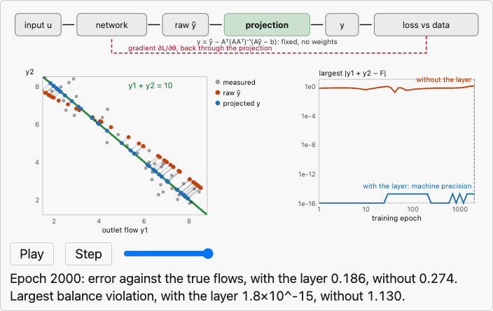</div>

</div>
<div class="small">

* Noisy data: the measured flows break the balance by 0.48 on average
* **Without the layer**: outputs break it by up to **1.13**
* **With the layer**: **$1.8 \times 10^{-15}$**, at every epoch
* Error against the true flows: 0.274 → **0.186**: the layer removes the noise that breaks the balance

</div>
</div>

<!--
Play: the pulse runs forward through the layers, the red one back through the projection.
-->

---

## Four approaches side by side

<style scoped>
.five { display: grid; grid-template-columns: repeat(4, 1fr); gap: 10px; }
.five > div { background: #f7f7f7; border-radius: 8px; border-top: 6px solid #5c5c5c; padding: 8px 10px; font-size: 0.7em; }
.five h4 { margin: 2px 0 4px; font-size: 1.3em; }
.five mjx-container[display="true"] { font-size: 100%; margin: 0.3em 0; min-height: 2.6em; }
.five p { margin: 0.25em 0; }
.five .tag { display: inline-block; border-radius: 12px; padding: 2px 10px; font-weight: 700; }
.five .fav { background: #fbf3e3; border: 2px solid #b07d12; }
.five .enf { background: #e8f3e9; border: 2px solid #2e7d32; }
</style>

<div class="five">
<div data-marpit-fragment style="border-top-color:#b07d12">

#### PINN

$$\min_\theta L_\text{data} + \lambda\lVert{\color{#2e7d32}r}\rVert^2$$

**Physics in**: the loss

**Learns**: one solution $x(t)$

**Trained with**: Adam

<span class="tag fav">physics favored, not enforced</span>

</div>
<div data-marpit-fragment style="border-top-color:#c2410c">

#### Neural ODE

$$\dot x = {\color{#2e7d32}f}(x, \mathrm{NN})$$

**Physics in**: the right-hand side

**Learns**: the vector field

**Trained with**: unconstrained solver + Adam (sequential)

<span class="tag fav">balances held; bounds not</span>

</div>
<div data-marpit-fragment style="border-top-color:#1f5c99">

#### Neural DAE

$$\begin{aligned}&\min L_\text{data}\ \text{s.t.}\\ &{\color{#2e7d32}\dot x = f,\ h = 0,\ g \le 0}\end{aligned}$$

**Physics in**: the constraints of one NLP

**Learns**: the unknown terms

**Trained with**: nonlinear constrained optimization solver (simultaneous)

<span class="tag enf">physics enforced, training and prediction</span>

</div>
<div data-marpit-fragment style="border-top-color:#2e7d32">

#### Projection layer

$$y = {\color{#2e7d32}P_{\{Ay=b\}}}(\mathrm{NN}(u))$$

**Physics in**: the last layer

**Learns**: a static map

**Trained with**: Adam

<span class="tag enf">physics enforced: linear balances; nonlinear ones in new work (KKT-Hardnet)</span>

</div>
</div>

<!--
Green: where the physics sits in each formulation.
-->

---

## Four approaches, as optimization problems

<style scoped>
.op { position: relative; width: 1120px; height: 470px; margin: 0.2em auto 0; }
.op > div { position: absolute; inset: 0; background: #fff; }
.op .hd { font-size: 0.8em; font-weight: 700; margin: 0 0 0.2em; }
.op .pb { background: #f7f7f7; border-radius: 10px; padding: 6px 16px; border-left: 6px solid #5c5c5c; }
.op mjx-container[display="true"] { margin: 0.25em 0; font-size: 92%; }
.op .what { display: grid; grid-template-columns: 1fr 1fr 1fr; gap: 12px; margin-top: 0.4em; font-size: 0.6em; }
.op .what div { background: #f7f7f7; border-radius: 8px; padding: 6px 10px; }
.op .note { font-size: 0.62em; color: #5c5c5c; margin-top: 0.4em; }
</style>

<div class="op">
<div>
<div class="hd" style="color:#b07d12">PINN: physics in the objective</div>
<div class="pb" style="border-left-color:#b07d12">

$$
\min_{\theta}\;\; \sum_i \big(x_\text{NN}(t_i;\theta) - \hat x_i\big)^2 \;+\; {\color{#b07d12}\lambda \sum_j r\big(x_\text{NN}(t_j;\theta)\big)^2}
$$

</div>
<div class="what"><div><b>Variables</b>: the weights θ</div><div><b>Constraints</b>: none</div><div><b>Solver</b>: Adam, unconstrained</div></div>
<div class="note">The physics is one more term to make small: the residual r is traded against the data through λ.</div>
</div>
<div data-marpit-fragment>
<div class="hd" style="color:#c2410c">Neural ODE: physics inside a simulation</div>
<div class="pb" style="border-left-color:#c2410c">

$$
\min_{\theta}\;\; \sum_i \big(x(t_i;\theta) - \hat x_i\big)^2, \qquad {\color{#c2410c}x(\cdot\,;\theta) = \mathrm{ODESolve}\big(f(x, \mathrm{NN}(x;\theta)),\, x_0\big)}
$$

</div>
<div class="what"><div><b>Variables</b>: the weights θ</div><div><b>Constraints</b>: none; the ODE is solved inside the objective</div><div><b>Solver</b>: ODE solver + Adam (sequential)</div></div>
<div class="note">The balances hold at every iterate, because every iterate is a simulation. Bounds such as S ≥ 0 are not in the problem.</div>
</div>
<div data-marpit-fragment>
<div class="hd" style="color:#1f5c99">Neural DAE: physics as constraints</div>
<div class="pb" style="border-left-color:#1f5c99">

$$
\begin{aligned}
\min_{\theta,\,x,\,z}\;\; & \sum_i \big(x(t_i) - \hat x_i\big)^2 \\
\text{s.t.}\;\; & {\color{#1f5c99}\dot x = f(x, z), \quad 0 = h(x, z), \quad g(x, z) \le 0, \quad z = \mathrm{NN}(x;\theta)}
\end{aligned}
$$

</div>
<div class="what"><div><b>Variables</b>: θ, and every state at every collocation point</div><div><b>Constraints</b>: the equations and bounds, at every point</div><div><b>Solver</b>: nonlinear constrained optimization (simultaneous)</div></div>
<div class="note">The physics holds at the solution, to solver tolerance, in training and in prediction.</div>
</div>
<div data-marpit-fragment>
<div class="hd" style="color:#2e7d32">Projection layer: physics in the last layer</div>
<div class="pb" style="border-left-color:#2e7d32">

$$
\min_{\theta}\;\; \sum_i \big(y(u_i;\theta) - \hat y_i\big)^2, \qquad {\color{#2e7d32}y(u;\theta) = \arg\min_{y}\,\lVert y - \mathrm{NN}(u;\theta)\rVert^2 \;\;\text{s.t.}\;\; Ay = b}
$$

</div>
<div class="what"><div><b>Variables</b>: the weights θ</div><div><b>Constraints</b>: none outside; the layer solves a small problem in closed form</div><div><b>Solver</b>: Adam, unconstrained</div></div>
<div class="note">Every output satisfies Ay = b exactly. Nonlinear balances need the layer to solve a nonlinear problem (KKT-Hardnet).</div>
</div>
</div>

<!--
Click through. Same data-fit term every time; what changes is where the physics sits and what the solver must handle.
-->

---

## Limitations and trade-offs

* **PINNs**: a penalty, fragile training, one solution per condition. Good with few data, a known equation, and approximate physics being acceptable
* **Neural ODEs (sequential)**: bounds not enforced; local minima on oscillating dynamics. Scale to big data and GPUs
* **Neural DAEs (simultaneous)**: the NLP grows with network and data; smooth activations; a fixed time grid. Use when constraints must hold exactly: safety, quality, balances, DAEs
* **Projection layers**: one prediction at a time; inequalities and nonlinear constraints cost a solve per pass
* **All hybrids**: the mechanistic part must be right; feasible is not the same as accurate

---

<!-- _class: demo -->

# Worked examples

Every code block on today's slides is a cell in these two notebooks, in the same order:

- `l13-pinn-jax.ipynb`: the spring-mass PINN from scratch in JAX, against a plain network
- `l13-neural-dae.ipynb`: the fed-batch bioreactor as a neural ODE in Diffrax and as a neural DAE in SiNDAE

---

## Recap

<style scoped>
.rc { width: 1140px; margin: 0 auto; }
.rc .scale { height: 40px; border-radius: 20px; background: linear-gradient(90deg, #f3d9a4, #b9dcae); display: flex; justify-content: space-between; align-items: center; padding: 0 18px; font-size: 0.68em; font-weight: 700; position: relative; }
.rc .scale::after { content: ''; position: absolute; right: -16px; top: -6px; border: 26px solid transparent; border-left: 18px solid #b9dcae; border-right: none; }
.rc .cols4 { display: grid; grid-template-columns: repeat(4, 1fr); gap: 14px; margin-top: 14px; }
.rc .c { background: #f7f7f7; border-radius: 8px; padding: 6px 10px; font-size: 0.66em; text-align: center; border-top: 7px solid #5c5c5c; min-height: 150px; }
.rc .c h4 { margin: 0 0 6px; font-size: 1.3em; }
.rc .c .n { font-size: 1.5em; font-weight: 700; margin: 10px 0 6px; }
.rc .train { display: grid; grid-template-columns: 1fr 1fr; gap: 14px; margin-top: 12px; font-size: 0.7em; }
.rc .train div { border-radius: 8px; padding: 10px 12px; text-align: center; }
</style>

<div class="rc">
<div class="scale"><span>physics favored</span><span>where the physics lives</span><span>physics enforced</span></div>
<div class="cols4">
<div class="c" style="border-top-color:#b07d12"><h4>PINN</h4>in the <b>loss</b><div class="n" style="color:#b07d12">5.3 N</div>residual left over</div>
<div class="c" style="border-top-color:#c2410c"><h4>Neural ODE</h4>in the <b>right-hand side</b>: learns the vector field<div class="n" style="color:#c2410c">S = −0.41 g/L</div>bounds not held</div>
<div class="c" style="border-top-color:#1f5c99"><h4>Neural DAE</h4>in the <b>constraints of one NLP</b><div class="n" style="color:#1f5c99">S ≥ 0</div>held in training and prediction; balance violation 0, to solver tolerance</div>
<div class="c" style="border-top-color:#2e7d32"><h4>Projection layer</h4>in the <b>last layer</b><div class="n" style="color:#2e7d32">10⁻¹⁵</div>balance violation</div>
</div>
<div class="train">
<div style="background:#fbeee6; border:2px solid #c2410c"><b>Sequential</b>: simulate, then update θ. The model holds at every iterate; constraints do not</div>
<div style="background:#eaf1f8; border:2px solid #1f5c99"><b>Simultaneous</b>: discretize, then solve one NLP for states and θ. Constraints enforced at the solution</div>
</div>
</div>

<p class="takeaway" style="font-weight:400">SciML: keep the mechanistic model, learn only the unknown term. RNN → neural ODE: let the step go to zero; learn f, the vector field.</p>

---

## Before next time

* The **miniproject** is due **Friday 10-09**
* Practice module for this session: on the course site
* Run both worked examples; the neural DAE one installs SiNDAE and Diffrax with `pip install sindae diffrax`

<script>
/* Code slides: put each highlight on its lines and each callout beside them, measured
   on the rendered code, so the boxes follow the code whatever its font, line height or
   Marp's shrink-to-fit. A slide is laid out once it is visible. */
(function () {
  function layout(ca) {
    var pre = ca.querySelector('marp-pre, pre');
    if (!pre || ca.getAttribute('data-placed')) return;
    var box = ca.getBoundingClientRect();
    if (!box.width || !ca.offsetWidth) return;
    var k = box.width / ca.offsetWidth;
    var code = pre.querySelector('code') || pre;
    var nodes = [], walk = document.createTreeWalker(code, NodeFilter.SHOW_TEXT);
    while (walk.nextNode()) nodes.push(walk.currentNode);
    var text = code.textContent, starts = [0];
    for (var i = 0; i < text.length; i++) if (text[i] === '\n') starts.push(i + 1);
    function topAt(off) {
      var a = 0;
      for (var j = 0; j < nodes.length; j++) {
        var t = nodes[j];
        if (off < a + t.length) {
          var r = document.createRange();
          r.setStart(t, off - a);
          r.setEnd(t, off - a + 1);
          var q = r.getBoundingClientRect();
          return q.height ? [(q.top - box.top) / k, q.height / k] : null;
        }
        a += t.length;
      }
      return null;
    }
    var tops = starts.map(function (o) { return text[o] === '\n' || o >= text.length ? null : topAt(o); });
    var known = tops.filter(Boolean);
    if (known.length < 2) return;
    var lh = (known[known.length - 1][0] - known[0][0]) / (tops.lastIndexOf(known[known.length - 1]) - tops.indexOf(known[0]));
    var first = tops.indexOf(known[0]);
    function lineTop(n) { var t = tops[n - 1]; return t ? t[0] : known[0][0] + (n - 1 - first) * lh; }
    /* the top of line n's line box: the glyph sits (lh - glyph height) / 2 below it, so
       highlights over consecutive lines tile with a 1 px gap and never overlap */
    var pad = Math.max(0, (lh - known[0][1]) / 2);
    function boxTop(n) { return lineTop(n) - pad; }
    var prevBottom = -1e9;
    ca.querySelectorAll('.lay').forEach(function (lay) {
      var hl = lay.querySelector('.hl'), cn = lay.querySelector('.cn');
      var span = (hl.getAttribute('data-lines') || '').split('-').map(Number);
      if (span.length !== 2) return;
      var top = boxTop(span[0]), bottom = boxTop(span[1] + 1) - 1;
      hl.style.top = top + 'px';
      hl.style.height = (bottom - top) + 'px';
      if (!cn) return;
      var mid = (top + bottom) / 2, h = cn.offsetHeight;
      var t = Math.max(mid - h / 2, prevBottom + 8, 0);
      cn.style.top = t + 'px';
      cn.style.setProperty('--ay', Math.max(4, Math.min(h - 20, mid - t - 8)) + 'px');
      prevBottom = t + h;
    });
    ca.setAttribute('data-placed', '1');
  }
  function run() { document.querySelectorAll('.ca').forEach(layout); }
  function start() {
    run();
    new MutationObserver(function () { requestAnimationFrame(run); })
      .observe(document.body, { attributes: true, subtree: true, attributeFilter: ['class'] });
    if (document.fonts && document.fonts.ready) document.fonts.ready.then(run);
  }
  if (document.readyState === 'complete') start(); else window.addEventListener('load', start);
})();
</script>
<script src="l13-widget-data.js"></script>
<script src="widgets.js"></script>
