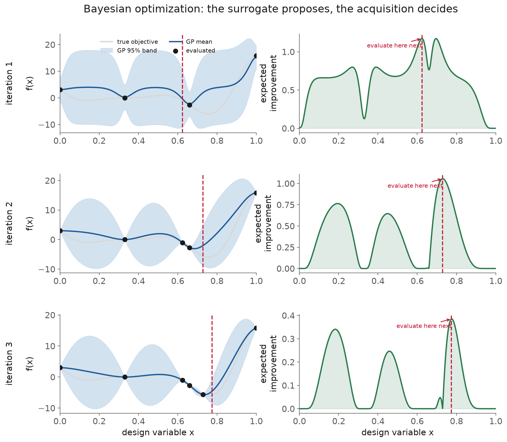
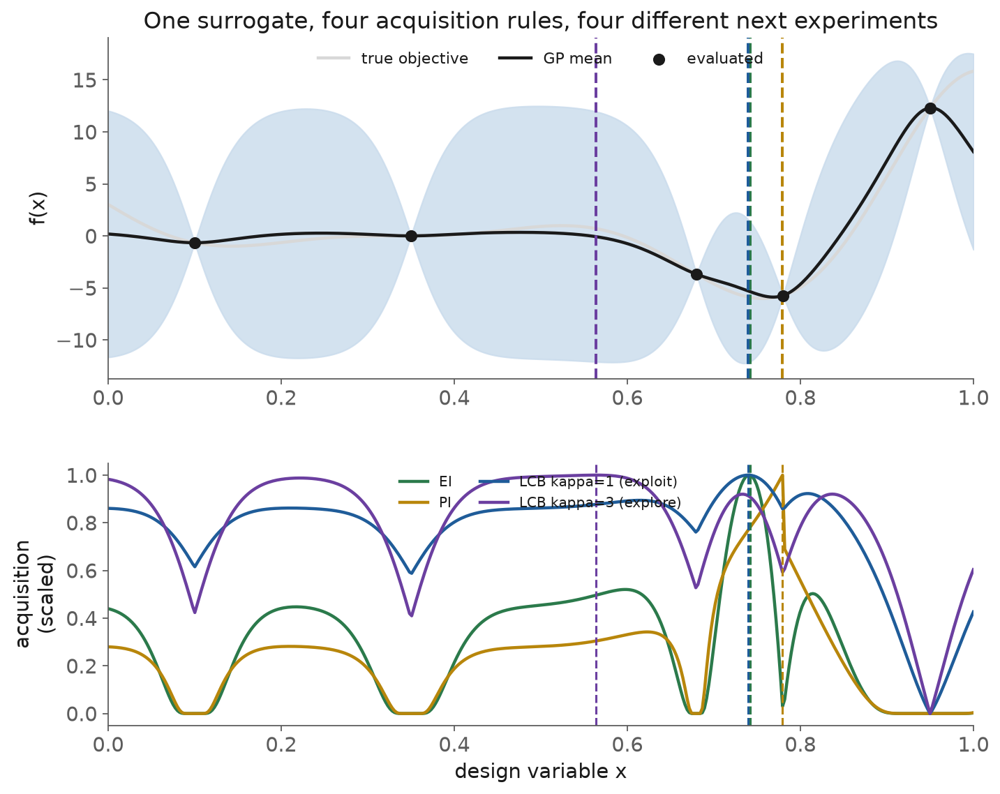
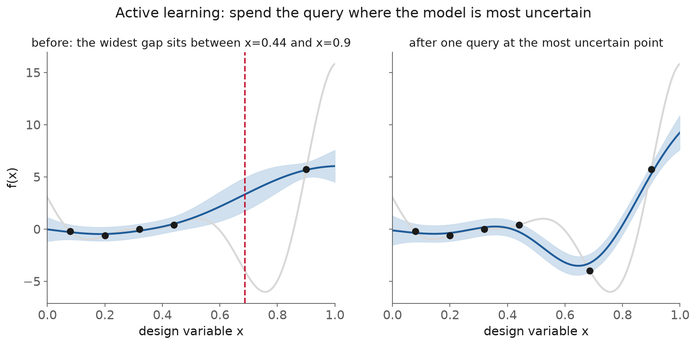
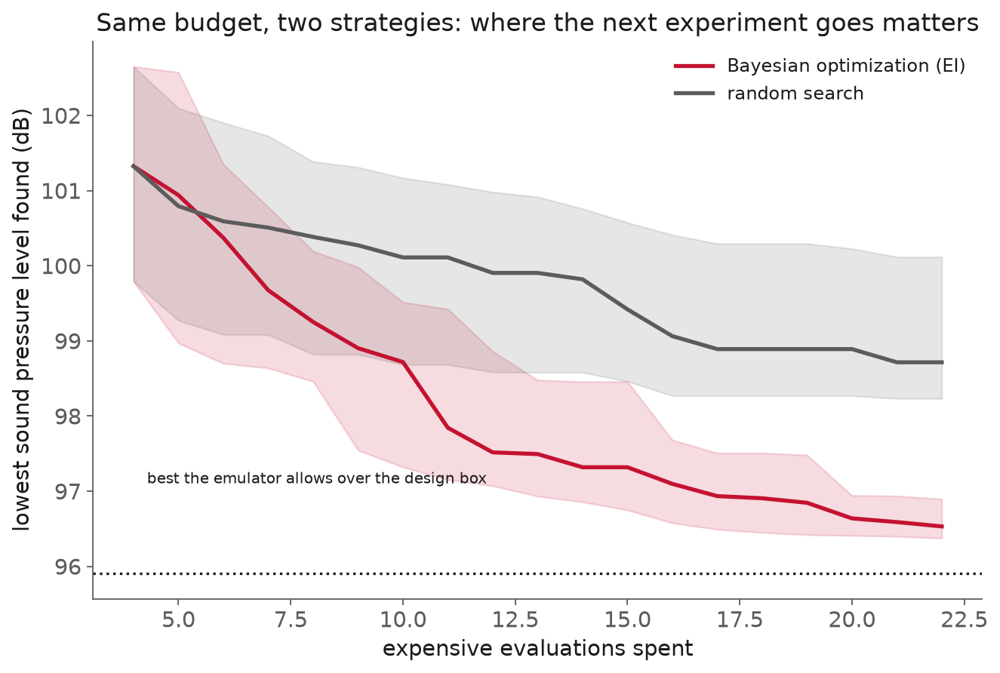

<!-- _class: title -->

# Lecture 14: Bayesian optimization and active learning

## Week 7, Machine learning & deep learning

**Systems and Toolchains for AI Engineers**

---

## Roadmap

1. Why this matters
2. The expensive black-box problem
3. The Bayesian optimization loop
4. Acquisition functions
5. Extensions engineers actually need
6. Active learning
7. Where it pushes back
8. Live demo: the loop by hand, then in BoTorch

<!-- 110 min. Budget roughly 8 / 12 / 14 / 16 / 12 / 14 / 12 / 20 demo.
     Dataset: NASA airfoil self-noise, carried over from Lecture 13.
     The miniproject (Assignment 7) is under way; tie the demo back to it at the end.
     If running long, cut the extensions survey, not the honest-evaluation slide. -->

---

<!-- _class: section -->

# Why this matters

---

## Why this matters

Every evaluation is expensive:

- a six-hour CFD run
- a twenty-eight-day concrete cure
- a wind-tunnel booking, a materials synthesis

You want the best design: **thousands** of candidates.
Your budget: **a few dozen** evaluations.

---

## Why this matters

The question is no longer "what is my model."

It is **"which single experiment do I run next?"**

Lecture 13 gave you a surrogate that reports where it is unsure.
This session spends that uncertainty.

---

## Why this matters

Two numbers, one from the demo, one from the literature:

- On the airfoil emulator, BO reaches within 1 dB of the floor in a median of **16** evaluations, in **75%** of seeds. Random search: **3%**.
- [Shields et al., *Nature* 2021](https://b-shields.github.io/files/2021-02-03-Nature.pdf): a GP with expected improvement beat **50 expert chemists** on a real reaction, on efficiency and consistency.

---

<!-- _class: section -->

# The expensive black-box problem

---

## The expensive black-box problem

**Black-box objective**: you can evaluate it at a point and read a number, but you have no formula, no gradient, the number may be noisy, and each call costs real time or money.

No gradient to follow. No cheap re-evaluation. Only search.

---

## The expensive black-box problem

Grid search fails first:

- 10 levels per variable, 4 variables = **10,000** evaluations
- more than 100x the budget
- cost grows as levels^dimensions: the curse of dimensionality

A fixed space-filling design (LHS, Sobol) is no better:
it **commits the whole budget before seeing any result.**

---

## The expensive black-box problem

Random search is the baseline to beat.

- [Bergstra & Bengio, JMLR 2012](https://www.jmlr.org/papers/v13/bergstra12a.html): random matches or beats grid at a fraction of the cost
- why: **low effective dimensionality**, only a few knobs matter, and grid wastes resolution on the rest
- cheap, parallel, strong: if BO cannot beat it, BO is not earning its surrogate

---

<!-- _class: section -->

# The Bayesian optimization loop

---

## The Bayesian optimization loop

**Acquisition function**: a rule that turns the surrogate's mean and uncertainty into one score for how worth it is to evaluate a candidate.

The surrogate proposes, the acquisition decides.

---

## The Bayesian optimization loop

Four steps, repeated:

1. fit a probabilistic surrogate (usually a GP) to the data so far
2. maximize the acquisition function over the design space
3. evaluate the true, expensive objective there
4. add the observation, refit, repeat

The GP returns $\mu(x)$ and $\sigma(x)$ everywhere: exactly what step 2 needs.

---

## The Bayesian optimization loop

From a start that misses the optimum, EI walks into the global basin in three steps.

---

## The Bayesian optimization loop

**When a surrogate beat fifty chemists.**

- [Shields et al., *Nature* 2021](https://b-shields.github.io/files/2021-02-03-Nature.pdf): a Pd-catalyzed reaction framed as black-box optimization
- 50 expert chemists chose their next experiment by intuition
- a GP + EI (their tool, EDBO) beat them on efficiency and consistency
- the win is consistency: the optimizer never forgets a result

---

<!-- _class: section -->

# Acquisition functions

---

## Acquisition functions

Two competing instincts:

- **exploit**: sample where the mean is best (near the incumbent)
- **explore**: sample where the uncertainty is high

Pure exploit gets stuck. Pure explore wastes budget.
The acquisition is a rule for trading them off.

---

## Acquisition functions, expected improvement

**Expected improvement**: the expected amount a candidate beats the incumbent best. The default: no tuning knob, balances explore and exploit on its own.

$$
\mathrm{EI}(x) = (\tau - \mu)\,\Phi(Z) + \sigma\,\phi(Z), \quad Z = \frac{\tau - \mu}{\sigma}
$$

Zero where $\sigma = 0$: never re-evaluates a known point.

---

## Acquisition functions, confidence bound

The explore/exploit dial, made explicit:

$$
\text{score}(x) = \mu(x) \pm \kappa\,\sigma(x)
$$

- small $\kappa$: lean on the mean, **exploit**
- large $\kappa$: lean on the uncertainty, **explore**

UCB makes you own the trade-off; EI hides it inside the expectation.

---

## Acquisition functions, PI and Thompson

- **Probability of improvement**: $\Phi\big((\tau-\mu)/\sigma\big)$. Oldest, greediest: treats a tiny win like a huge one, over-exploits without a margin.
- **Thompson sampling**: draw one function from the posterior, optimize *that*. The randomness supplies the exploration.

---

## Acquisition functions

One surrogate, four rules, four next experiments. Raising $\kappa$ sends the fourth out to explore.

---

## Acquisition functions

<!-- _class: definition -->

The sign of the improvement is the bug you will actually hit.

Minimization uses $\tau - \mu$; maximization uses $\mu - \tau$. Mixing them throws no error, it just walks the wrong way. Check EI by hand at a good point and a bad one before you trust it.

---

<!-- _class: section -->

# Extensions engineers actually need

---

## Extensions engineers actually need

**Constrained** optimization:

- maximize strength subject to a cost ceiling and a carbon budget
- fit a separate model for each constraint
- weight the acquisition by the predicted probability of feasibility

---

## Extensions engineers actually need

**Pareto front**: in a multi-objective problem, the set of designs where no objective can improve without another getting worse. There is no single best.

Strength and cost and carbon at once: map the front with expected hypervolume improvement (qEHVI / qNEHVI).

---

## Extensions engineers actually need

- **Batch / parallel BO**: propose $q$ points at once for $q$ autoclaves, built to be diverse rather than $q$ copies of the greedy pick
- **Multi-fidelity BO**: mix a coarse cheap sim with a fine expensive one, spend cheap queries to place the expensive ones

---

## Extensions engineers actually need

Tooling:

- [**BoTorch**](https://botorch.org/docs/introduction): GP models + Monte Carlo acquisitions (`q...`) on PyTorch
- [**Ax**](https://ax.dev/docs/tutorials/quickstart/): a campaign manager wrapping BoTorch
- **scikit-optimize** for lightweight problems

Caution: Ax 1.0 replaced `AxClient` with a new `Client`; check a tutorial's version.

---

<!-- _class: section -->

# Active learning

---

## Active learning

**Active learning**: the same loop aimed at improving the surrogate everywhere, not finding one optimum. Query where the model is most ignorant.

Sometimes the deliverable is the emulator, and its worst region is what bites.

---

## Active learning

- **Uncertainty sampling**: query the point of highest posterior variance
- **Query-by-committee**: query where an ensemble disagrees most

This is Lecture 13's **epistemic** uncertainty at work: the reducible kind, the part a well-chosen experiment removes.

---

## Active learning

Query the widest gap; conditioning on that one point shrinks the band by 6.5%.

---

## Active learning

**An autonomous lab, and a number worth checking.**

- [A-Lab, Szymanski et al., *Nature* 2023](https://escholarship.org/uc/item/4w49b5cb): robotic synthesis, active learning grounded in thermodynamics
- verified throughput: **41 of 58 targets in 17 days**, no human in the inner loop
- the "novel compounds" claim is **contested** (Palgrave, Schoop): cite the throughput, flag the novelty

---

<!-- _class: section -->

# Where it pushes back

---

## Where it pushes back

BO is stochastic: random start, GP fit, acquisition search.
A single lucky run is a sample of size one.

Report over many seeds, against random search. The bands are why.

---

## Where it pushes back

- **GP scaling**: $O(n^3)$ in observations. Fine for dozens to hundreds, a wall beyond
- **High dimensions**: past ~15-20 variables the acquisition search itself gets hard
- **Over-exploitation**: too small a $\kappa$ sticks in the first decent basin

---

## Where it pushes back, when not to use it

| Reach for BO | Reach for something else |
|---|---|
| each evaluation is expensive | objective is cheap: grid or gradient |
| budget of dozens to hundreds | huge budget: random / evolutionary |
| low-to-moderate dimension | very high dimension |

The whole point is to avoid the expensive call, so **count and report the budget.**

---

<!-- _class: demo -->

# Demo

## `l14-bayesopt-design.ipynb`

The loop by hand, then in BoTorch, then raced against random search.

---

## Demo: what to watch

1. **By hand on Forrester**: a GP + a five-line EI, proposals walk to the optimum
2. **In BoTorch on the airfoil emulator**: same four steps, production tool
3. **Honest evaluation**: BO vs random over 20 seeds, with bands
4. **One active-learning step**: query the most uncertain point, watch the band shrink

Two moments: the **sign check** on EI, and how wide the **seed bands** are.

---

<!-- _class: section -->

# Recap

---

## Recap

- BO keeps a probabilistic surrogate and lets an **acquisition** choose the next expensive experiment
- **EI** is the no-knob default; **UCB** exposes the explore/exploit dial as $\kappa$
- **Active learning** is the same loop aimed at the model, spending queries on epistemic uncertainty
- Always beat random search, report over seeds, and count the budget

---

## Next

**Reading** Frazier's tutorial and the Shahriari review, linked in the notes
**Assignment** the miniproject (Assignment 7) is under way, due Week 8
**Next session** Lecture 15, foundation models and LLMs at a systems level

Notes for this lecture: `lectures/l14/notes.md`
