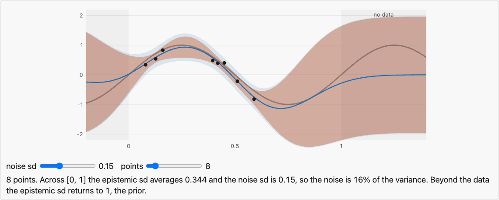
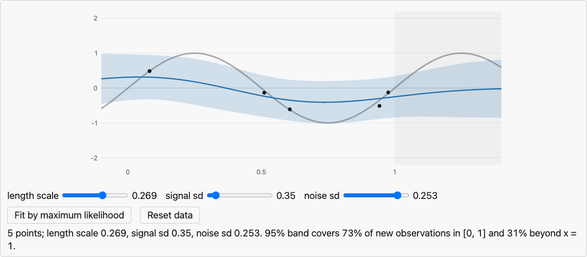
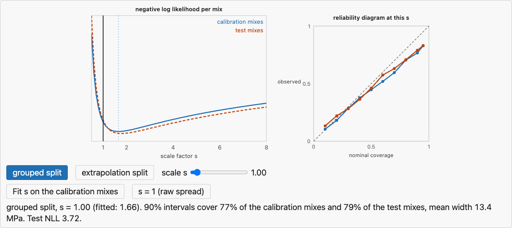
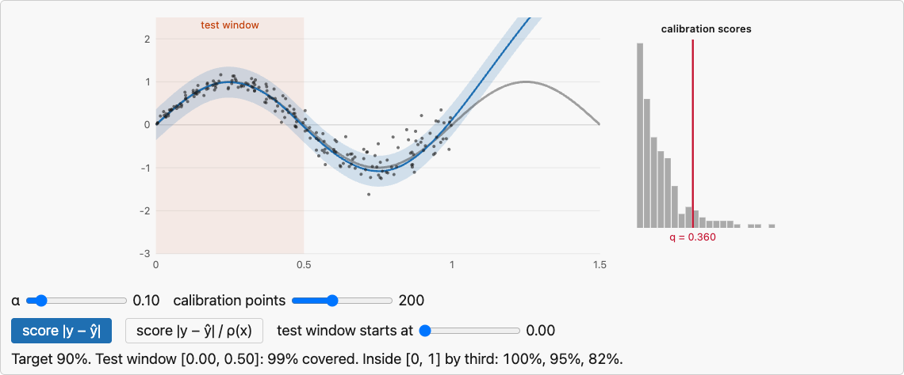
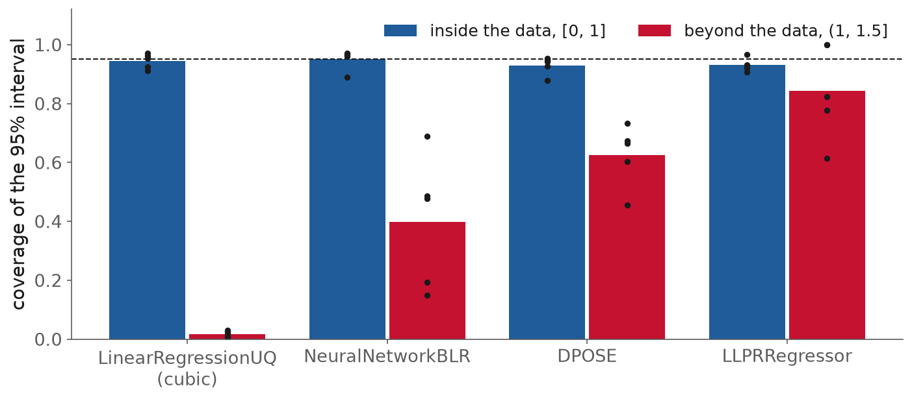

<style>
/* a figure alone in its paragraph is centered, and so is every table */
section p:has(> img:only-child) { text-align: center; }
section table { margin-left: auto; margin-right: auto; font-size: 0.78em; }
.cols { display: grid; gap: 1.1em; align-items: center; }
.cols-even { grid-template-columns: 1fr 1fr; }
.cols-lc { grid-template-columns: 1.25fr 1fr; }
.small { font-size: 0.72em; }
.source { font-size: 0.6em; color: #5c5c5c; }
.red { color: #c41230; }
/* widgets here carry two rows of controls, so give the plot a little less height */
section .cw.compact svg { max-height: 350px; }
section p.takeaway { text-align: center; font-weight: 700; font-size: 0.82em; margin: 0.5em 0 0; }
</style>

<!-- _class: title -->

# Lecture 14: Uncertainty quantification in machine learning

## Week 7, Machine learning and deep learning

**Systems and Toolchains for AI Engineers**

<!--
Why 6, what UQ is 12, calibration 10, GPs 17, ensembles 14, conformal 13, pycse 7, close 5.
About 84 minutes, then the notebook and questions.
-->

---

## The course so far, where we are

<svg viewBox="0 0 1180 500" width="100%" role="img" aria-label="A map of the course as a journey: a trail through the data lowlands (lectures 1 to 7) and the machine-learning highlands (lectures 8 to 13), a fall-break camp, a pin at lecture 14 marked you are here, and a dotted trail into fog toward the final projects" style="font-family: Georgia, 'Times New Roman', serif; display:block; margin: 0 auto;">
<defs><radialGradient id="jm-p" cx="50%" cy="45%" r="75%"><stop offset="0%" stop-color="#f8f1df"/><stop offset="100%" stop-color="#e6d6b0"/></radialGradient><linearGradient id="jm-fog" x1="0" x2="1"><stop offset="0%" stop-color="#f3ead4" stop-opacity="0"/><stop offset="100%" stop-color="#f3ead4" stop-opacity="0.75"/></linearGradient></defs>
<rect x="4" y="4" width="1172" height="492" rx="14" fill="url(#jm-p)" stroke="#5b4a32" stroke-width="2"/>
<rect x="12" y="12" width="1156" height="476" rx="10" fill="none" stroke="#a89878" stroke-width="1" stroke-dasharray="2 4"/>
<ellipse cx="225" cy="395" rx="215" ry="78" fill="#7d9a5c" opacity="0.18"/>
<ellipse cx="585" cy="225" rx="190" ry="90" fill="#b49a6a" opacity="0.18"/>
<path d="M940,488 C965,430 1040,412 1166,420 L1166,478 Q1166,488 1156,488 Z" fill="#6f93b3" opacity="0.22"/>
<path d="M150,454 L143,470 L157,470 Z" fill="#7d9a5c" stroke="#5b4a32" stroke-width="0.8"/><line x1="150" y1="470" x2="150" y2="474" stroke="#5b4a32" stroke-width="1.2"/>
<path d="M300,446 L293,462 L307,462 Z" fill="#7d9a5c" stroke="#5b4a32" stroke-width="0.8"/><line x1="300" y1="462" x2="300" y2="466" stroke="#5b4a32" stroke-width="1.2"/>
<path d="M60,344 L53,360 L67,360 Z" fill="#7d9a5c" stroke="#5b4a32" stroke-width="0.8"/><line x1="60" y1="360" x2="60" y2="364" stroke="#5b4a32" stroke-width="1.2"/>
<path d="M420,379 L413,395 L427,395 Z" fill="#7d9a5c" stroke="#5b4a32" stroke-width="0.8"/><line x1="420" y1="395" x2="420" y2="399" stroke="#5b4a32" stroke-width="1.2"/>
<path d="M30,234 L23,250 L37,250 Z" fill="#7d9a5c" stroke="#5b4a32" stroke-width="0.8"/><line x1="30" y1="250" x2="30" y2="254" stroke="#5b4a32" stroke-width="1.2"/>
<path d="M458.0,200 L480,170.0 L502.0,200 Z" fill="#cbbd9a" stroke="#5b4a32" stroke-width="1.2"/><path d="M473.0,180.0 L480,170.0 L487.0,180.0 Z" fill="#fbf7ec"/>
<path d="M507.5,175 L535,137.5 L562.5,175 Z" fill="#cbbd9a" stroke="#5b4a32" stroke-width="1.2"/><path d="M526.25,150.0 L535,137.5 L543.75,150.0 Z" fill="#fbf7ec"/>
<path d="M575.8,165 L600,132.0 L624.2,165 Z" fill="#cbbd9a" stroke="#5b4a32" stroke-width="1.2"/><path d="M592.3,143.0 L600,132.0 L607.7,143.0 Z" fill="#fbf7ec"/>
<path d="M643.0,150 L665,120.0 L687.0,150 Z" fill="#cbbd9a" stroke="#5b4a32" stroke-width="1.2"/><path d="M658.0,130.0 L665,120.0 L672.0,130.0 Z" fill="#fbf7ec"/>
<path d="M542.4,300 L560,276.0 L577.6,300 Z" fill="#cbbd9a" stroke="#5b4a32" stroke-width="1.2"/><path d="M554.4,284.0 L560,276.0 L565.6,284.0 Z" fill="#fbf7ec"/>
<path d="M634.6,275 L650,254.0 L665.4,275 Z" fill="#cbbd9a" stroke="#5b4a32" stroke-width="1.2"/><path d="M645.1,261.0 L650,254.0 L654.9,261.0 Z" fill="#fbf7ec"/>
<path d="M990,466 q8,-6 16,0 t16,0" fill="none" stroke="#6f93b3" stroke-width="1.6"/>
<path d="M1035,466 q8,-6 16,0 t16,0" fill="none" stroke="#6f93b3" stroke-width="1.6"/>
<path d="M1080,466 q8,-6 16,0 t16,0" fill="none" stroke="#6f93b3" stroke-width="1.6"/>
<path d="M1125,466 q8,-6 16,0 t16,0" fill="none" stroke="#6f93b3" stroke-width="1.6"/>
<text x="70" y="490" font-size="21" font-style="italic" fill="#5b4a32">The data lowlands</text>
<text x="70" y="318" font-size="13" fill="#5b4a32" opacity="0.85">L1 to L7: toolchain, databases,</text>
<text x="70" y="334" font-size="13" fill="#5b4a32" opacity="0.85">pipelines, streams, features</text>
<text x="420" y="92" font-size="21" font-style="italic" fill="#5b4a32">The machine-learning highlands</text>
<text x="420" y="112" font-size="13" fill="#5b4a32" opacity="0.85">L8 to L13: the ML workflow, PyTorch and JAX, architectures, scientific ML</text>
<path d="M55,420 C64.2,415.3 90.8,392.3 110,392 C129.2,391.7 150.3,419.3 170,418 C189.7,416.7 208.7,385.7 228,384 C247.3,382.3 267.0,410.0 286,408 C305.0,406.0 324.3,385.7 342,372 C359.7,358.3 375.7,340.3 392,326 C408.3,311.7 422.7,297.3 440,286 C457.3,274.7 477.3,265.7 496,258 C514.7,250.3 533.3,247.7 552,240 C570.7,232.3 589.3,220.3 608,212 C626.7,203.7 645.3,192.7 664,190 C682.7,187.3 702.3,189.7 720,196 C737.7,202.3 753.3,217.0 770,228 C786.7,239.0 811.7,256.3 820,262" fill="none" stroke="#8a5a2b" stroke-width="4" stroke-linecap="round" stroke-dasharray="10 6"/>
<path d="M820,262 C830.0,268.3 858.3,290.3 880,300 C901.7,309.7 927.5,322.0 950,320 C972.5,318.0 995.8,302.7 1015,288 C1034.2,273.3 1049.2,251.7 1065,232 C1080.8,212.3 1102.5,180.3 1110,170" fill="none" stroke="#a89878" stroke-width="3" stroke-linecap="round" stroke-dasharray="2 8"/>
<circle cx="55" cy="420" r="11" fill="#8a5a2b" stroke="#fbf7ec" stroke-width="2"/>
<text x="55" y="424" font-size="11" text-anchor="middle" fill="#fbf7ec" font-family="sans-serif" font-weight="700">1</text>
<circle cx="110" cy="392" r="11" fill="#8a5a2b" stroke="#fbf7ec" stroke-width="2"/>
<text x="110" y="396" font-size="11" text-anchor="middle" fill="#fbf7ec" font-family="sans-serif" font-weight="700">2</text>
<circle cx="170" cy="418" r="11" fill="#8a5a2b" stroke="#fbf7ec" stroke-width="2"/>
<text x="170" y="422" font-size="11" text-anchor="middle" fill="#fbf7ec" font-family="sans-serif" font-weight="700">3</text>
<circle cx="228" cy="384" r="11" fill="#8a5a2b" stroke="#fbf7ec" stroke-width="2"/>
<text x="228" y="388" font-size="11" text-anchor="middle" fill="#fbf7ec" font-family="sans-serif" font-weight="700">4</text>
<circle cx="286" cy="408" r="11" fill="#8a5a2b" stroke="#fbf7ec" stroke-width="2"/>
<text x="286" y="412" font-size="11" text-anchor="middle" fill="#fbf7ec" font-family="sans-serif" font-weight="700">5</text>
<circle cx="342" cy="372" r="11" fill="#8a5a2b" stroke="#fbf7ec" stroke-width="2"/>
<text x="342" y="376" font-size="11" text-anchor="middle" fill="#fbf7ec" font-family="sans-serif" font-weight="700">6</text>
<circle cx="392" cy="326" r="11" fill="#8a5a2b" stroke="#fbf7ec" stroke-width="2"/>
<text x="392" y="330" font-size="11" text-anchor="middle" fill="#fbf7ec" font-family="sans-serif" font-weight="700">7</text>
<circle cx="440" cy="286" r="11" fill="#8a5a2b" stroke="#fbf7ec" stroke-width="2"/>
<text x="440" y="290" font-size="11" text-anchor="middle" fill="#fbf7ec" font-family="sans-serif" font-weight="700">8</text>
<circle cx="496" cy="258" r="11" fill="#8a5a2b" stroke="#fbf7ec" stroke-width="2"/>
<text x="496" y="262" font-size="11" text-anchor="middle" fill="#fbf7ec" font-family="sans-serif" font-weight="700">9</text>
<circle cx="552" cy="240" r="11" fill="#8a5a2b" stroke="#fbf7ec" stroke-width="2"/>
<text x="552" y="244" font-size="11" text-anchor="middle" fill="#fbf7ec" font-family="sans-serif" font-weight="700">10</text>
<circle cx="608" cy="212" r="11" fill="#8a5a2b" stroke="#fbf7ec" stroke-width="2"/>
<text x="608" y="216" font-size="11" text-anchor="middle" fill="#fbf7ec" font-family="sans-serif" font-weight="700">11</text>
<circle cx="664" cy="190" r="11" fill="#8a5a2b" stroke="#fbf7ec" stroke-width="2"/>
<text x="664" y="194" font-size="11" text-anchor="middle" fill="#fbf7ec" font-family="sans-serif" font-weight="700">12</text>
<circle cx="720" cy="196" r="11" fill="#8a5a2b" stroke="#fbf7ec" stroke-width="2"/>
<text x="720" y="200" font-size="11" text-anchor="middle" fill="#fbf7ec" font-family="sans-serif" font-weight="700">13</text>
<path d="M756,234 L770,214 L784,234 Z" fill="#d9a441" stroke="#5b4a32" stroke-width="1.2"/>
<path d="M770,214 L767,234 L773,234 Z" fill="#5b4a32"/>
<text x="758" y="252" font-size="12" text-anchor="end" fill="#5b4a32" font-style="italic">fall-break camp</text>
<rect x="860" y="13" width="306" height="474" fill="url(#jm-fog)"/>
<g opacity="0.85" fill="#fbf8f0"><ellipse cx="930" cy="250" rx="55.199999999999996" ry="21.599999999999998"/><ellipse cx="896.4" cy="257.2" rx="36.0" ry="16.8"/><ellipse cx="966.0" cy="256.0" rx="38.4" ry="16.8"/></g>
<g opacity="0.85" fill="#fbf8f0"><ellipse cx="1030" cy="350" rx="46.0" ry="18.0"/><ellipse cx="1002.0" cy="356.0" rx="30.0" ry="14.0"/><ellipse cx="1060.0" cy="355.0" rx="32.0" ry="14.0"/></g>
<g opacity="0.85" fill="#fbf8f0"><ellipse cx="1000" cy="200" rx="41.4" ry="16.2"/><ellipse cx="974.8" cy="205.4" rx="27.0" ry="12.6"/><ellipse cx="1027.0" cy="204.5" rx="28.8" ry="12.6"/></g>
<g opacity="0.85" fill="#fbf8f0"><ellipse cx="1110" cy="300" rx="50.6" ry="19.8"/><ellipse cx="1079.2" cy="306.6" rx="33.0" ry="15.400000000000002"/><ellipse cx="1143.0" cy="305.5" rx="35.2" ry="15.400000000000002"/></g>
<g opacity="0.85" fill="#fbf8f0"><ellipse cx="900" cy="380" rx="36.800000000000004" ry="14.4"/><ellipse cx="877.6" cy="384.8" rx="24.0" ry="11.200000000000001"/><ellipse cx="924.0" cy="384.0" rx="25.6" ry="11.200000000000001"/></g>
<text x="960" y="232" font-size="15" font-style="italic" fill="#5b4a32" opacity="0.75" text-anchor="middle">design &amp; experiments?</text>
<text x="1060" y="410" font-size="15" font-style="italic" fill="#5b4a32" opacity="0.75" text-anchor="middle">the language-model coast?</text>
<line x1="1000" y1="150" x2="1000" y2="192" stroke="#5b4a32" stroke-width="2.5"/>
<path d="M996,132 L1092,132 L1104,144 L1092,156 L996,156 Z" fill="#d8c393" stroke="#5b4a32" stroke-width="1.2"/>
<text x="1048" y="148" font-size="11.5" text-anchor="middle" fill="#5b4a32">still being surveyed</text>
<line x1="1110" y1="170" x2="1110" y2="124" stroke="#5b4a32" stroke-width="2.5"/>
<path d="M1110,124 L1144,133 L1110,142 Z" fill="#c41230"/>
<text x="1110" y="192" font-size="15" text-anchor="middle" fill="#5b4a32" font-weight="700">final projects</text>
<circle cx="820" cy="262" r="22" fill="#c41230" opacity="0.18"/>
<path d="M820,262 C804,242 804,220 820,218 C836,220 836,242 820,262 Z" fill="#c41230" stroke="#7a0c1f" stroke-width="1.2"/>
<circle cx="820" cy="232" r="6" fill="#fbf7ec"/>
<rect x="702" y="278" width="236" height="50" rx="8" fill="#fbf7ec" stroke="#c41230" stroke-width="2"/>
<text x="820" y="299" font-size="16" text-anchor="middle" fill="#c41230" font-weight="700">You are here: L14</text>
<text x="820" y="318" font-size="13" text-anchor="middle" fill="#5b4a32">how much to trust a prediction</text>
<circle cx="1110" cy="70" r="30" fill="#fbf7ec" stroke="#5b4a32" stroke-width="1.2"/>
<path d="M1110,42 L1117,70 L1110,98 L1103,70 Z" fill="#5b4a32"/>
<path d="M1082,70 L1110,63 L1138,70 L1110,77 Z" fill="#a89878"/>
<text x="1110" y="36" font-size="13" text-anchor="middle" fill="#5b4a32" font-weight="700">N</text>
<line x1="40" y1="40" x2="80" y2="40" stroke="#8a5a2b" stroke-width="4" stroke-dasharray="10 6"/>
<text x="90" y="45" font-size="13" fill="#5b4a32">the trail so far</text>
<line x1="40" y1="64" x2="80" y2="64" stroke="#a89878" stroke-width="3" stroke-dasharray="2 8" stroke-linecap="round"/>
<text x="90" y="69" font-size="13" fill="#5b4a32">the route ahead, not yet fixed</text>
</svg>

<!--
Thirty seconds. Thirteen sessions behind us; this one decides how far to trust what the
models from the highlands tell us. The route past here is deliberately vague: say it is
still being surveyed, which is true.
-->

---

## Roadmap

1. **Why**: calibrated intervals that covered 26% on new chemistry
2. **What UQ is**: aleatoric, epistemic, and three kinds of interval
3. **Calibration**: how to check any uncertainty, before choosing a method
4. **Gaussian processes**: what the band promises, and three ways it fails
5. **Bootstrap and ensembles**: what the spread measures, and a worked recalibration
6. **Conformal prediction**: a guarantee, and the one condition it needs
7. **Models with uncertainty built in**: pycse

---

<!-- _class: section -->

# Why this matters

---

## Intervals that held, until the chemistry changed

- Neural-network force fields: DFT-quality energies, far cheaper
- Useful only if you know when to trust them
- Conformal prediction + distances in the network's latent space
- In distribution: **calibrated and sharp**; calibration takes minutes against ~11,000 GPU-hours of training
- Trained on QM9 **without fluorine**, tested **with** it: 90% intervals covered **26%**

<p class="source"><a href="https://arxiv.org/abs/2208.08337">Hu, Musielewicz, Ulissi &amp; Medford, MLST 2022</a> (CMU ChemE co-authors)</p>

<!--
Nothing in the method broke. Its one condition, that test structures resemble calibration
structures, was not met. Come back to this case in the conformal section.
-->

---

## Three numbers from today

| Method | Claimed | Measured |
|---|---|---|
| GP on 5 points, settings by maximum likelihood | 95% | **78%** (median of 200 data sets) |
| Five-network ensemble, concrete strength | 90% | **79%**, then **90%** after one scale factor |
| Split conformal, strongest mixes held out | 90% | **56%** |

All from `lectures/l14/figures/make_figures.py`

---

<!-- _class: section -->

# What uncertainty quantification is

---

<!-- _class: definition -->

## Uncertainty quantification

<div class="definition">

**Uncertainty quantification**: attaching to each prediction a distribution or an interval, together with a claim about how often the truth falls inside it.

</div>

- "42 ± 6 MPa" says nothing on its own
- "... and intervals stated this way contain the measured strength 90% of the time" can be checked

---

## Aleatoric and epistemic

<div class="definition">

**Aleatoric**: scatter in the data itself, which more data does not remove. **Epistemic**: what the model does not know yet, which more data in the right place reduces.

</div>

- Practical test: epistemic if the modeler "sees a possibility to reduce" it
- From structural reliability, carried into ML as reducible against irreducible

<p class="source"><a href="https://doi.org/10.1016/j.strusafe.2008.06.020">Der Kiureghian &amp; Ditlevsen, Struct. Saf. 2009</a> (paywalled) · <a href="https://arxiv.org/abs/1910.09457">Hüllermeier &amp; Waegeman, Mach. Learn. 2021</a></p>

---

## Aleatoric and epistemic, live

<div class="cw compact" data-widget="uq-sources"></div>

<!--
Push points up: the dark band collapses, the light band does not. Then push noise up.
Point at the gray region: no data, the dark band returns to the prior.
-->

---

## Aleatoric and epistemic, the split depends on the model

- Concrete strength scatters at fixed proportions, partly from **curing temperature**
- No temperature input: that scatter is noise (aleatoric)
- Temperature as an input: the same scatter is learnable (epistemic)
- Two more sources for a surrogate:
  - **Model inadequacy**: "No model is perfect"
  - **Code uncertainty**: the simulator was not run at this input

<p class="source"><a href="https://arxiv.org/abs/1910.09457">Hüllermeier &amp; Waegeman sec. 2.3</a> · <a href="https://www.asc.ohio-state.edu/statistics/comp_exp/jour.club/kennedy01.pdf">Kennedy &amp; O'Hagan 2001</a>, sec. 2.1, six sources</p>

---

## Three kinds of interval

| Interval | Covers | Meaning |
|---|---|---|
| Confidence | the function $f(x)$ | the procedure covers in repeated use |
| Credible | the function $f(x)$ | posterior probability |
| **Prediction** | a new measurement $f(x) + \varepsilon$ | includes the noise |

- "A prediction interval necessarily encloses the corresponding confidence interval"
- A specimen tested against a 40 MPa spec is a **new measurement**
- Every coverage number today is for prediction intervals

<p class="source"><a href="https://proceedings.neurips.cc/paper/1996/hash/7940ab47468396569a906f75ff3f20ef-Abstract.html">Heskes, NIPS 1996</a> · <a href="https://sites.stat.columbia.edu/gelman/book/">Gelman et al., BDA3 sec. 1.1</a></p>

---

## Why ML makes this hard

- **Training residuals are too small**: maximum likelihood "systematically underestimates σ²"
- **Big networks are overconfident**: ResNet confidence "substantially higher than its accuracy"
- **ReLU networks extrapolate in straight lines**: proved for classifiers, Theorem 3.1
- **No data describes the region without data**: every method substitutes an assumption

<p class="source"><a href="https://proceedings.mlr.press/v121/laves20a.html">Laves et al., MIDL 2020</a> · <a href="https://arxiv.org/abs/1706.04599">Guo et al., ICML 2017</a> · <a href="https://arxiv.org/abs/1812.05720">Hein et al., CVPR 2019</a></p>

---

## Aleatoric and epistemic, a question

<div class="clicker" data-tag="l14-more-data" data-seconds="40" data-answer="C" data-hint="Think about what happens to the light band and the dark band when the n slider goes up." data-why="C. Repeating measurements at the same conditions pins down f there, so the model's own uncertainty shrinks. The scatter between repeats is the noise, and no number of repeats removes it." data-read="https://clicker.f26-06763.workers.dev">
<div class="clicker-main">

**You re-test 50 more cylinders of mixes you already tested. Which uncertainty in the strength prediction for those mixes goes down?**

<ol class="clicker-opts">
<li>Aleatoric only</li>
<li>Both, equally</li>
<li>Epistemic only</li>
<li>Neither, since the mixes are not new</li>
</ol>

</div>
<aside class="clicker-panel">

<div class="clicker-url">clicker.f26-06763.workers.dev</div>
<button class="clicker-start">Start voting</button>
<div class="clicker-timer">40</div>
<div class="clicker-count">no votes yet</div>
</aside>
</div>

<!--
Common wrong answer: D, from students who think only new inputs help. Repeats sharpen f at
those inputs. Second most common: B, confusing a better estimate of the noise with less noise.
-->

---

<!-- _class: section -->

# Calibration: checking an uncertainty

---

## Calibration

<div class="definition">

**Calibrated**: stated probabilities match what happens; 90% intervals contain the measured value 90% of the time.

</div>

- **Coverage**: fraction of held-out points inside their interval
- **Reliability diagram**: observed against nominal coverage at several levels
- Below the diagonal: **overconfident**, intervals too narrow

<p class="source"><a href="https://arxiv.org/abs/1807.00263">Kuleshov, Fenner &amp; Ermon, ICML 2018</a>, Eq. 3</p>

---

## Calibration, sharpness

<div class="definition">

**Sharpness**: how narrow the predictive distributions are, a property of the forecasts alone.

</div>

- Goal: "maximizing the sharpness ... subject to calibration"
- **Climatological forecaster**: ignore the inputs, always issue the long-run spread

| Concrete, 90% intervals | Coverage | Width |
|---|---|---|
| Climatology (training 5% to 95% quantiles) | 91% | 55.9 MPa |
| Rescaled ensemble (this lecture) | 90% | 22.2 MPa |

<p class="source"><a href="https://www.stat.washington.edu/raftery/Research/PDF/Gneiting2007jrssb.pdf">Gneiting, Balabdaoui &amp; Raftery, JRSS B 2007</a> (author's copy)</p>

---

## Calibration, proper scoring rules

- **Proper**: the expected score is best when the forecast is the true distribution
- **NLL**: $\tfrac12\log(2\pi\sigma^2) + \tfrac{(y-\mu)^2}{2\sigma^2}$; punishes a confident miss; unbounded
- **CRPS**: distance between predicted CDF and a step at $y$; "generalizes the absolute error"
- Report one of them **with** coverage and width

<p class="source"><a href="https://sites.stat.washington.edu/raftery/Research/PDF/Gneiting2007jasa.pdf">Gneiting &amp; Raftery, JASA 2007</a> (author's copy)</p>

---

## Calibration, on average and locally

- 90% overall can be 100% on easy points and 70% on hard ones
- **Consistency**: calibrated given the predicted σ
- **Adaptivity**: calibrated given the input $x$
- Good consistency "does not imply a good adaptivity"
- A held-out **region** of input space is an adaptivity check

<p class="source"><a href="https://arxiv.org/abs/2309.06240">Pernot, APL Mach. Learn. 2023</a> · <a href="https://arxiv.org/abs/1905.11659">Levi et al., Sensors 2022</a></p>

---

## Calibration, recalibration and its limit

- **Scaling**: multiply every σ by one factor $s$ fitted on held-out data
- **Isotonic**: a monotone map from predicted to observed probability
- Both assume future data resemble the held-out data
  - Kuleshov: needs "enough i.i.d. data"
  - Ovadia: temperature-scaling error "increases significantly as the shift increases"
- Catalysis example: several metrics side by side ([Tran et al. 2020](https://arxiv.org/abs/1912.10066), CMU ChemE)

<p class="source"><a href="https://proceedings.mlr.press/v121/laves20a.html">Laves 2020</a> · <a href="https://arxiv.org/abs/1807.00263">Kuleshov 2018</a> · <a href="https://arxiv.org/abs/1906.02530">Ovadia et al., NeurIPS 2019</a></p>

---

<!-- _class: section -->

# Gaussian processes

---

## Gaussian processes

<div class="definition">

**Gaussian process**: a probability distribution over functions, set by a kernel that says how strongly values at two inputs are correlated.

</div>


<p class="source">After <a href="https://gaussianprocess.org/gpml/">Rasmussen &amp; Williams 2006</a>, Fig. 2.2 (free online)</p>

---

## Gaussian processes, the predictive variance

$$
\sigma^2(x_*) = k(x_*, x_*) - k_*^\top (K + \sigma_n^2 I)^{-1} k_*
$$

- Far from data, $k_* \to 0$: the band returns to the **prior**
- No $y$ in it: depends "only on the inputs" (R&W p. 18)
- At fixed settings, a bad fit gets the **same band** as a good one
- Fitted settings bring $y$ in "implicitly" ([Deringer et al. 2021](https://pmc.ncbi.nlm.nih.gov/articles/PMC8391963/))

---

## Gaussian processes, fitting the settings

<div class="cw compact" data-widget="gp-explorer" data-source="l14" data-mode="smooth"></div>

<!--
Press Fit. Noise comes out 0.044 against a true 0.1: 66% coverage inside, 96% beyond.
Overconfident where there is data, honest where there is none. Click to add points and refit.
-->

---

## Gaussian processes, failure 1: noise that grows

<div class="cw compact" data-widget="gp-explorer" data-source="l14" data-mode="hetero"></div>

<!--
Noise sd 0.02 + 0.3x. Overall 95% looks fine; by third 100%, 98%, 88%. Then switch to
"noise learned per point".
-->

---

## Gaussian processes, fixing heteroscedastic noise


- Fixes: second GP on the log noise ([Goldberg et al. 1998](https://proceedings.neurips.cc/paper/1997/hash/afe434653a898da20044041262b3ac74-Abstract.html)); a cheap alternation ([Kersting et al. 2007](https://doi.org/10.1145/1273496.1273546)); variational ([Lázaro-Gredilla &amp; Titsias 2011](https://icml.cc/2011/papers/456_icmlpaper.pdf))
- Surprise: $\mathbb{E}[\log\varepsilon^2] = \log\sigma^2 - 1.27$, so the first try learned noise 0.7× too small

---

## Gaussian processes, a scikit-learn trap

- `alpha=array` sets a noise variance **per training point**
- It does not give the GP a noise model at new inputs
- `WhiteKernel` estimates "the global noise level"
- Input-dependent noise at prediction time needs a **model** of the noise

<p class="source"><a href="https://scikit-learn.org/stable/modules/gaussian_process.html">scikit-learn user guide, Gaussian processes</a></p>

---

## Gaussian processes, failure 2: the wrong kernel

<div class="cw compact" data-widget="gp-explorer" data-source="l14" data-mode="step"></div>

<!--
98% away from the step, 72% within 0.1 of it. Note the fitted length scale: 0.05.
-->

---

## Gaussian processes, the shrinking length scale

<div class="cols cols-lc">
<div>


</div>
<div class="small">

- Smooth truth: about 0.2 to 0.4 at every size
- Step: 0.088 at 10 points, 0.025 at 320
- A length scale that "never stops becoming smaller as you add more data" is "a classic sign of model misspecification"
- GPs "can be miscalibrated in practice"

</div>
</div>

<p class="source"><a href="https://www.cs.toronto.edu/~duvenaud/cookbook/">Duvenaud, kernel cookbook</a> · <a href="https://arxiv.org/abs/2302.11961">Capone, Pleiss &amp; Hirche, NeurIPS 2023</a></p>

---

## Gaussian processes, failure 3: five points

<div class="cw compact" data-widget="gp-explorer" data-source="l14" data-mode="few"></div>

---

## Gaussian processes, how often five points mislead

| Training points | Median 95% coverage | Below 80% | Below 50% |
|---|---|---|---|
| 5 | 78% | 52% | **26%** |
| 12 | 92% | 21% | 1% |
| 40 | 95% | 0% | 0% |

- 200 data sets each, settings by maximum likelihood, exact coverage
- Little data: "both short and long lengthscales explain the data consistently"
- GP error bars are Bayesian, not frequentist guarantees

<p class="source"><a href="https://arxiv.org/abs/2109.02606">Capone, Lederer &amp; Hirche, ICML 2022</a> · <a href="https://arxiv.org/abs/2105.02796">Fiedler, Scherer &amp; Trimpe, AAAI 2021</a> · R&amp;W sec. 5.4.1</p>

---

## Gaussian processes, cost and a case

- Exact inference $O(n^3)$; inducing points: "from $O(n^3)$ to $O(nm^2)$" ([Titsias 2009](https://proceedings.mlr.press/v5/titsias09a.html))
- High dimension: the prior "simply says too little" ([Binois &amp; Wycoff 2022](https://arxiv.org/abs/2111.05040))
- **Case**: a silicon GP potential's predicted error "rises notably" on a path to a defect, and it still misses a minimum DFT finds

<p class="source"><a href="https://pmc.ncbi.nlm.nih.gov/articles/PMC8391963/">Deringer et al., Chem. Rev. 2021</a>, sec. 5.2, Fig. 24 (open access)</p>

---

## Gaussian processes, what to do

- Look at the fitted noise; compare with replicate measurements
- Check coverage **by region**, not only overall
- Watch the length scale as data arrive
- Under about a dozen points: a rough guide, not a 95% statement

---

<!-- _class: section -->

# Bootstrap and ensembles

---

## Bootstrap

<div class="definition">

**Bootstrap**: resample the training data with replacement, refit, and use the spread of the refitted models.

</div>

- Estimates the **variance** of the fit ([Efron 1979](https://doi.org/10.1214/aos/1176344552))
- Misses the **noise**: a confidence interval, not a prediction interval
- Misses the **bias**: "the bias component ... is negligible" is an assumption ([Heskes 1997](https://proceedings.neurips.cc/paper_files/paper/1996/file/7940ab47468396569a906f75ff3f20ef-Paper.pdf))
- "May ... fail entirely when bias is a dominant source of error" ([Palmer et al. 2022](https://www.nature.com/articles/s41524-022-00794-8))

---

## Deep ensembles

<div class="definition">

**Deep ensemble**: several networks that differ only in random starting weights and data order, with their predictions combined.

</div>

- Each sees **all** the data: "bagging deteriorated performance"
- Each predicts a mean **and a variance**, trained on Gaussian NLL
- The spread alone is the epistemic part only
- Different starts land in different modes of the loss surface

<p class="source"><a href="https://arxiv.org/abs/1612.01474">Lakshminarayanan, Pritzel &amp; Blundell, NeurIPS 2017</a> · <a href="https://arxiv.org/abs/1912.02757">Fort, Hu &amp; Lakshminarayanan 2019</a></p>

---

## Ensembles, what the spread measures

<div class="cw compact" data-widget="ensemble-members" data-source="l14"></div>

<!--
Spread only, inside: 29%. Toggle the noise estimate: 93%. Beyond the data the members fan out
here, 85%. Say clearly that fanning out is not guaranteed.
-->

---

## Ensembles, the toy results

| 95% intervals | Inside the data | Beyond the data |
|---|---|---|
| Seeds, spread only | **29%** | 85% |
| Seeds, spread + noise | 93% | 93% |
| Bootstrap, spread only | 52% | 81% |
| Bootstrap, spread + noise | 94% | 87% |

- Inside: members agree to 0.021; the noise is 0.1
- Beyond: spread 0.63 against error 0.61, in **this** 1-D example

---

## Ensembles, the evidence

- **Best baseline**: "deep ensembles seem to perform the best across most metrics" ([Ovadia 2019](https://arxiv.org/abs/1906.02530)); [Scalia 2020](https://arxiv.org/abs/1910.03127), [Tan 2023](https://arxiv.org/abs/2305.01754) agree for molecules
- **Overconfident in level**: "consistently underestimates uncertainty" ([Hirschfeld 2020](https://arxiv.org/abs/2005.10036)); "require to be calibrated for each system" ([Kahle &amp; Zipoli 2022](https://arxiv.org/abs/2108.05748))
- **Weakest where it matters**: scaffold-split coverage "always underestimated" (Scalia)
- **Cost**: $M$ times one model

<p class="takeaway">A useful relative signal; not an interval until it has noise and a check.</p>

---

## Ensembles, a question

<div class="clicker" data-tag="l14-members-agree" data-seconds="45" data-answer="D" data-hint="What would the members have to share for all of them to be wrong the same way?" data-why="D. Agreement measures only how much the members differ from each other. Members with the same architecture, data and features can extrapolate the same wrong way, so agreement beyond the data is evidence of a shared assumption, not of accuracy." data-read="https://clicker.f26-06763.workers.dev">
<div class="clicker-main">

**Five ensemble members agree to three decimals at an input far outside the training data. What does that tell you?**

<ol class="clicker-opts">
<li>The prediction is accurate there</li>
<li>The noise is small there</li>
<li>The model has seen similar inputs</li>
<li>Only that the members extrapolate alike</li>
</ol>

</div>
<aside class="clicker-panel">

<div class="clicker-url">clicker.f26-06763.workers.dev</div>
<button class="clicker-start">Start voting</button>
<div class="clicker-timer">45</div>
<div class="clicker-count">no votes yet</div>
</aside>
</div>

<!--
A is the popular wrong answer. Tie it back to Palmer: when bias dominates, the spread can be small
and the error large.
-->

---

## Ensembles, recalibrating on concrete

- Concrete strength, Lecture 9's network, five seeds
- **Grouped split**: random 20% of mixes held out
- **Extrapolation split**: lowest water/cement 20% of mixes held out
- A quarter of the training mixes set aside to **calibrate**

$$
z_i = \frac{y_i - \mu_i}{\sigma_i}, \qquad \text{NLL}(s) = \frac1n\sum_i \Big[\log(s\sigma_i) + \frac{z_i^2}{2s^2}\Big] \;\Rightarrow\; s^2 = \overline{z^2}
$$

<p class="source">Same fix four times: σ scaling (Laves), STD scaling (Levi), <a href="https://arxiv.org/abs/1809.07653">Musil et al. 2019</a>, <a href="https://arxiv.org/abs/2402.16621">Kellner &amp; Ceriotti 2024</a> Eq. 8</p>

---

## Ensembles, recalibrating on concrete, live

<div class="cw compact" data-widget="sigma-scale" data-source="l14"></div>

<!--
Start at s = 1, press Fit: 1.66. Then switch to the extrapolation split and fit again.
-->

---

## Ensembles, recalibrating on concrete, results

| 90% intervals | Grouped raw | Grouped × 1.66 | Extrap. raw | Extrap. × 1.44 |
|---|---|---|---|---|
| Coverage | 79% | **90%** | 89% | 96% |
| Width (MPa) | 13.4 | 22.2 | 35.3 | 50.9 |
| NLL | 3.72 | **3.22** | 3.74 | 3.81 |

- Grouped: most of $s$ is the missing noise (replicate scatter 5.0 MPa)
- Extrapolation: spread already large; the factor **over**-widens
- Rank correlation of error with spread: 0.29 and 0.17

---

## Ensembles, what to do

- Never report the spread alone as an interval
- Recalibration costs a **third** data split
- Fit $s$ on data like where the model will be used
- Otherwise report coverage on a held-out region, and expect error in either direction

---

<!-- _class: section -->

# Conformal prediction

---

## Split conformal prediction

<div class="definition">

**Split conformal prediction**: set the interval width from the model's errors on a held-out calibration set, so it covers a new point with a stated probability.

</div>

1. Fit any model on the fitting set
2. Scores on $n$ calibration points: $s_i = |y_i - \hat\mu(x_i)|$
3. $\hat q$ = the $\lceil (n+1)(1-\alpha) \rceil$-th smallest score
4. Interval: $\hat\mu(x) \pm \hat q$

<p class="source"><a href="https://arxiv.org/abs/1604.04173">Lei et al., JASA 2018</a> (CMU) · <a href="https://arxiv.org/abs/2107.07511">Angelopoulos &amp; Bates</a></p>

---

## Split conformal prediction, the guarantee

<div class="definition">

**Exchangeable**: the joint distribution does not change if the points are reordered; calibration and test points were generated the same way.

</div>

$$
1 - \alpha \;\le\; P\big(y_{\text{new}} \in \hat\mu(x_{\text{new}}) \pm \hat q\big) \;\le\; 1 - \alpha + \tfrac{1}{n+1}
$$

- Any model, any distribution, any finite $n$
- At $\alpha = 0.1$ you need $n \ge 9$, or the interval is infinite

---

## Split conformal prediction, live

<div class="cw compact" data-widget="conformal" data-source="l14"></div>

<!--
Drop n below 9 at alpha 0.1. Then show the thirds: 100, 95, 82. Toggle the normalized score.
Leave the window slide for the out-of-domain slide.
-->

---

## Conformal prediction, marginal not conditional

- Split conformal: "the width is exactly constant over x" (Lei sec. 5.2)
- Toy, 90% target: **100%, 95%, 82%** by third
- Exact conditional coverage cannot be had without assumptions ([Vovk 2012](https://arxiv.org/abs/1209.2673); [Foygel Barber et al. 2021](https://arxiv.org/abs/1903.04684))
- **Normalized scores** $|y - \hat\mu| / \hat\rho(x)$: 94%, 91%, 90%
- **CQR**: conformalize quantile regressions, "fully adaptive to heteroscedasticity" ([Romano et al. 2019](https://arxiv.org/abs/1905.03222))

---

## Jackknife+ and CV+

- Split conformal spends data on calibration
- **Jackknife+**: leave each point out, refit, record $R_i$
  - Interval from the quantiles of $\hat\mu_{-i}(x) \mp R_i$
- **CV+**: the same with $K$ folds
- Guarantee $1 - 2\alpha$, and the 2 is tight; "in practice" about $1 - \alpha$
- Plain jackknife: coverage "may actually vanish"
- Cost: $n$ or $K$ fits. Small data, cheap model: CV+. Otherwise split

<p class="source"><a href="https://arxiv.org/abs/1905.02928">Barber, Candès, Ramdas &amp; Tibshirani, Ann. Stat. 2021</a></p>

---

## Conformal prediction on concrete

| 90% intervals | Grouped | Width | Extrapolation | Width |
|---|---|---|---|---|
| Split conformal | 94% | 20.9 | **56%** | 13.9 |
| Normalized by ensemble spread | 90% | 22.0 | 95% | 49.4 |
| CV+ | 98% | 23.0 | 74% | 20.1 |
| Climatology | 91% | 55.9 | 54% | 43.7 |

- Grouped: every conformal method meets 90%, as guaranteed
- Extrapolation: split conformal **56%**; widths in MPa

---

## Conformal prediction, out of domain

- Strongest mixes are **not** exchangeable with calibration mixes: held out because different
- The guarantee did not fail; its condition was not met
- Toy, window sliding out: 99%, 94%, 86%, 56%, **16%**
- Normalizing rescued concrete only because the spread grew there; toy: 23%
- The fluorine case from the opening is this failure
- Weighted conformal needs the likelihood ratio and overlapping support ([Tibshirani et al. 2019](https://arxiv.org/abs/1904.06019)); beyond exchangeability, a bound you cannot compute ([Barber et al. 2023](https://arxiv.org/abs/2202.13415))

---

## Conformal prediction in code, MAPIE

```python
from mapie.regression import SplitConformalRegressor, CrossConformalRegressor

split = SplitConformalRegressor(model, confidence_level=0.9, prefit=True)
split.conformalize(X_cal, y_cal)
y_pred, y_int = split.predict_interval(X_test)

cvplus = CrossConformalRegressor(model, confidence_level=0.9,
                                 method="plus", cv=GroupKFold(10))
cvplus.fit_conformalize(X_train, y_train, groups=groups_train)
```

- Version 1 renamed `MapieRegressor` and `alpha`; most tutorials use the old names

<p class="source"><a href="https://mapie.readthedocs.io/en/stable/content/conformal-prediction/regression/">MAPIE docs</a> · <a href="https://arxiv.org/abs/2207.12274">Taquet et al. 2022</a></p>

---

## Conformal prediction, a question

<div class="clicker" data-tag="l14-conformal-condition" data-seconds="45" data-answer="B" data-hint="The guarantee holds for any model and any noise distribution. What is left that it could depend on?" data-why="B. Split conformal needs nothing about the model or the noise, only that calibration and test points are exchangeable. A design loop picks test points because they differ from the data, which breaks exactly that." data-read="https://clicker.f26-06763.workers.dev">
<div class="clicker-main">

**An optimizer proposes mixes using a conformal surrogate. Which condition of the 90% guarantee does that break?**

<ol class="clicker-opts">
<li>The noise must be Gaussian</li>
<li>Test points must be exchangeable with calibration points</li>
<li>The model must be calibrated first</li>
<li>The calibration set must exceed 1,000 points</li>
</ol>

</div>
<aside class="clicker-panel">

<div class="clicker-url">clicker.f26-06763.workers.dev</div>
<button class="clicker-start">Start voting</button>
<div class="clicker-timer">45</div>
<div class="clicker-count">no votes yet</div>
</aside>
</div>

---

<!-- _class: section -->

# UQ built into models: pycse

---

## pycse, the last-layer idea

- Treat the network's last layer as a **linear model on learned features**
- Use linear regression's uncertainty there; `predict(X, return_std=True)`
- Bishop's warning: with localized features the model "becomes very confident ... when extrapolating"

| Model | Idea | Source |
|---|---|---|
| `LinearRegressionUQ` | $s^2 + x_*^\top(X^\top X)^{-1}x_*\,s^2$ | Bishop Eq. 3.59 |
| `NeuralNetworkBLR` | Bayesian regression on last hidden layer | [Snoek et al. 2015](https://proceedings.mlr.press/v37/snoek15.html) |
| `DPOSE` | shallow ensemble, spread fitted | [Kellner &amp; Ceriotti 2024](https://arxiv.org/abs/2402.16621) |
| `LLPRRegressor` | prediction rigidity, after training | [Bigi et al. 2024](https://arxiv.org/abs/2403.02251) |

---

## pycse, inside and beyond the data

<div class="cols cols-lc">
<div>



</div>
<div class="small">

| 95%, 5 seeds | Inside | Beyond |
|---|---|---|
| `LinearRegressionUQ` | 94% | **2%** |
| `NeuralNetworkBLR` | 95% | 40% |
| `DPOSE` | 93% | 63% |
| `LLPRRegressor` | 93% | 84%, band 5× wider |

- `NeuralNetworkBLR` printed "✓ Model is well-calibrated" each time: checked on $[0, 1]$

</div>
</div>

---

## pycse, an import trap

```python
from pycse.sklearn import NNBR            # ImportError in pycse 2.11.1

from pycse.sklearn.nnbr import NeuralNetworkBLR
from pycse.sklearn.llpr_regressor import LLPRRegressor
from pycse.sklearn.dpose import DPOSE
from pycse.sklearn.lr_uq import LinearRegressionUQ
```

---

<!-- _class: section -->

# Trade-offs

---

## Trade-offs

| Method | Assumes | Guarantee | Beyond the data | Cost |
|---|---|---|---|---|
| GP | data look like the prior; one noise | Bayesian | back to the prior | $O(n^3)$ |
| Ensemble spread | members disagree where wrong | none | sometimes fans out | $M$ models |
| Rescaled spread | calibration data like use | empirical | factor does not transfer | a data split |
| Split conformal | exchangeable | finite-sample, marginal | none | a data split |
| CV+ | exchangeable | $\ge 1 - 2\alpha$ | none | $K$ fits |
| Last layer (pycse) | features stay informative | none | often overconfident | one model |

---

<!-- _class: demo -->

# Worked example

## `l14-uq.ipynb`

- The concrete ensemble, its raw coverage, and the scale factor
- Split conformal and CV+ by hand, then with MAPIE
- Four pycse regressors inside and beyond their data

Watch for 79% becoming 90%, and 90% becoming 56%.

---

## Recap

- UQ is a claim about coverage; check it on held-out data, with width and a proper score
- GP: honest about missing data only if the prior is right; fails with varying noise, the wrong kernel, few points
- Ensembles: the best common baseline; add noise, then rescale
- Conformal: an exact guarantee that needs exchangeability
- No method checks itself outside the range where it was checked

---

## Standings

Nicknames only. Everyone who skipped one still counted in every bar you saw.

<div class="clicker-leaderboard"
     data-read="https://clicker.f26-06763.workers.dev"
     data-top="8"
     data-hours="6"
     data-title="Standings"></div>

---

## Before next time

* **Reading**: [Angelopoulos &amp; Bates](https://arxiv.org/abs/2107.07511), sections 1 and 2; [Palmer et al. 2022](https://www.nature.com/articles/s41524-022-00794-8)
* **Practice module** for this session: on the course site
* **Run** `l14-uq.ipynb`; it installs MAPIE and pycse

Notes for this lecture: `lectures/l14/notes.md`

<script src="clicker-slide.js"></script>
<script src="l14-widget-data.js"></script>
<script src="widgets.js"></script>
