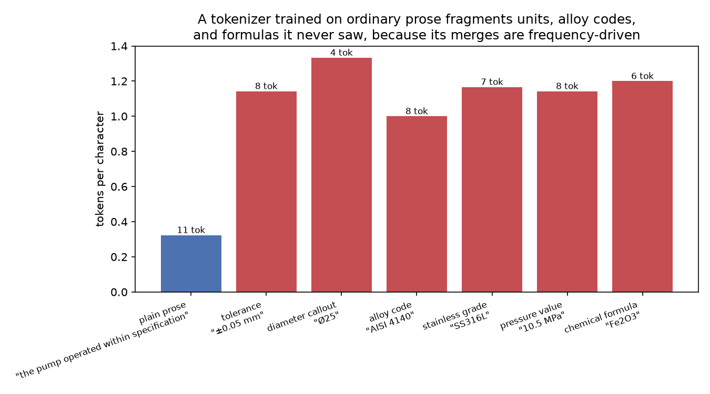
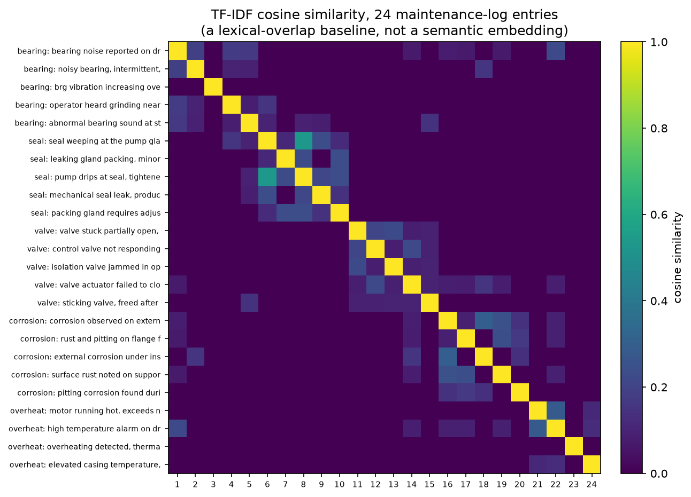

<!-- _class: title -->

# L15 · Foundation models and LLMs as a system

## Week 9 · LLM & agentic engineering

**Systems & Toolchains for AI in Engineering**

---

## Roadmap

1. Why this matters
2. Inside a decoder-only transformer
3. Why it predicts the next token
4. The context window is a hard budget
5. Tokenization: where engineering text breaks
6. Embeddings: text as vectors
7. Live demo: a datasheet's tokens, a log's clusters

<!-- 110 min. Budget roughly 10 / 20 / 15 / 10 / 20 / 15 / 20 demo.
     A7 (miniproject) was due at the end of last week; A8 releases today.
     This is the first session of the LLM & agentic arc: set that framing
     up front, this is not "more machine learning," it is a new kind of
     system with different failure modes. -->

---

<!-- _class: section -->

# Why this matters

---

## Every prior session ended with a residual

RMSE. Coverage. Wall-clock. A number
you could check against something.

This arc's output is a **paragraph**.
A paragraph does not come with a residual.

---

## The failure to hold onto

An engineer pastes a 40-page manual into a chat
window. Asks for the max operating pressure.

The model answers. Confidently. Right units.
Reads exactly like every other sentence it wrote.

# The number is wrong.

---

## And nothing tells you

The manual was longer than the context window.
The interface truncated the tail. Silently.

The real rating was on page 31.

No exception. No null. No warning icon.
Just a **plausible paragraph with a wrong number
quietly inside it**.

---

## Today's job

Open the box enough that two properties become
things you **check for**, not things that surprise you:

1. There is a hard token budget.
2. The model predicts the next token, not the truth.

Neither needs the full math of the architecture.

---

<!-- _class: section -->

# Inside a decoder-only
## transformer

---

## The unglamorous signature

Strip the chat UI, the streaming animation, the
sense of conversation. What is left:

**a function that takes a token sequence and
returns a distribution over the next token.**

Everything else is scaffolding, called in a loop.

---

## Text to tokens to vectors

1. A **tokenizer** splits text into subword pieces
   from a fixed vocabulary, maps each to an integer id
2. Each id indexes an **embedding table**: one learned
   vector per vocabulary entry
3. **Positional information** is added, since attention
   alone has no sense of order

---

## Positional encoding, then and now

Vaswani et al. 2017: fixed sinusoidal signals.

Most current decoder-only models: **rotary position
embeddings (RoPE)**, which rotates each vector by an
angle proportional to position.

Turns "how far apart are these tokens" into an
algebra the model can extrapolate past training length.

---

## The block, twice per layer

**Self-attention**: every position computes a weighted
combination of every *earlier* position's vector.
Masked, so it cannot look ahead.

**Feed-forward MLP**: applied identically and
independently at every position.

Residual connections + normalization around both,
dozens of these stacked.

---

## Why attention won

A word at paragraph start can inform a word at
paragraph end in **one step**.

No information has to survive a long recurrent
chain, unlike the RNN/LSTM architectures attention
replaced.

Computed **fresh for every input**, not fixed in advance.

---

## From vectors back to a word

Final linear layer → one logit per vocabulary entry.

Softmax → a probability distribution over
the next token.

Sample (or pick greedily) → append → run the whole
sequence through again.

# That loop is generation.

---

## The autoregressive loop

```
tokens -> embed + position -> [attention + MLP] x N -> logits -> sample
   ^                                                                |
   └────────────────────── append token, repeat ──────────────────┘
```

One token out per full forward pass, glued end to end
until a stop condition fires.

<!-- Draw this live on the board rather than reading the ASCII box. Do not
     spend board time on KV-caching; one sentence is enough: it is why cost
     scales roughly linearly per generated token instead of quadratically. -->

---

## One cost fact worth keeping

A longer response costs proportionally more to
generate than a short one.

**No step where the model plans the whole paragraph
in advance.** One token, one full pass, every time.

---

<!-- _class: section -->

# Why it predicts
## the next token

---

## The training objective, stated plainly

Given an enormous corpus, adjust parameters so the
probability assigned to the token that **actually
comes next** is as high as possible.

No labels. No annotation. Text predicting itself,
at trillions of tokens.

---

## That is strange, and it explains everything

The same mechanism that makes an email draft
**fluent** is the mechanism that makes a wrong
number **plausible**.

No separate "is this true" signal exists.
Only "is this likely given everything before it."

---

## Hallucination is not a bug

# It is the same generative mechanism,
# running where the plausible continuation
# happens to be false.

The model always has *some* distribution.
It always samples from it.

---

## What actually fixes this

Not better training. **Engineering controls
external to the architecture:**

- Ground the model in retrieved/provided text (L17)
- Instruct it explicitly: say "not found," do not guess
- Low temperature for extraction, so it does not improvise

---

## Two knobs on the same distribution

**Temperature**: rescales logits before softmax.
Below 1 sharpens toward the top token (0 ≈
deterministic). Above 1 flattens, more variety,
more risk.

**Top-p (nucleus)**: sample only from the smallest
set of tokens whose cumulative probability exceeds
`p`; discard the long unlikely tail entirely.

---

## The boring rule for extraction work

# Low temperature, narrow top-p,
# whenever you want the same input
# to produce the same output.

The two compose. Most APIs expose both.

---

<!-- _class: section -->

# The context window
## is a hard budget

---

## Prompt tokens + response tokens ≤ limit

Not a soft guideline. An architectural limit,
tied to training and (for some architectures)
to attention's own cost.

Every provider enforces it. **Not the same way.**

---

## Two ways providers hit the limit

| behavior | what happens |
|---|---|
| explicit error | request rejected, you know immediately |
| silent truncation | oldest turns dropped, no signal |

Which one you get is a property of the **product**,
not of language models in general.

---

## So: count before you send

# Never assume. Read the current
# behavior of your interface.

Token counting is a required step,
not a nice-to-have.

---

<!-- _class: section -->

# Tokenization: where
## engineering text breaks

---

## Not whitespace splitting

A fixed vocabulary of tens of thousands to a few
hundred thousand subword fragments, learned in
advance by **byte-pair encoding (BPE)**.

[Sennrich, Haddow & Birch 2016](https://aclanthology.org/P16-1162/):
adapted a decades-old compression algorithm to NLP.

---

## How BPE is trained

Repeatedly merge the **most frequent adjacent pair**
of symbols in a training corpus, until the vocabulary
hits its target size.

GPT-family and Claude-family tokenizers: same idea,
different corpora, different vocabularies.

---

## Frequency-driven means bias-driven

Common English fragments: short, often
one-token representations.

Statistically rare relative to the training
corpus: fragmented into several short pieces,
sometimes down to single characters.

# Numbers. Units. Alloy codes. Chemical
# formulas. Part numbers. Code identifiers.

---

## Measured here, offline



<!-- A toy BPE trained from scratch on 12 sentences of engineering prose,
     80 merges, 76-word vocabulary. Not a production tokenizer; same
     algorithm, small enough to run without network access. -->

---

## The gap, in one number

Plain prose: **0.32 tokens/character**
(11 tokens for "the pump operated within
specification," 34 letters).

"AISI 4140," "±0.05 mm," "Ø25," "SS316L,"
"10.5 MPa," "Fe2O3": all between **1.00 and 1.33**
tokens/character.

# Three to four times denser.

---

## Why this sandbox built its own tokenizer

Network policy here blocks Anthropic's, OpenAI's,
and Hugging Face's endpoints. Only package
registries are reachable.

So: a real BPE trainer, run on a corpus written
for this file, not a number recalled from memory.

`l15-tokenization-embeddings.ipynb` calls the real
API, in class, with a real key.

---

## What a practitioner should take from this

# A word count is not a token budget.

Worst exactly where engineering documents are
richest: units, tolerances, part numbers, formulas.

**Count with the tokenizer you will actually call,
on the actual document**, before building a pipeline
around an assumed budget.

---

## Never cross tokenizers

Anthropic and OpenAI train **separate vocabularies**
on **separate corpora**.

The same string produces a different count on each.
A count from the wrong tokenizer is not an
approximation — it describes a different tokenizer.

Use the provider's own counting endpoint/library.
Every time.

---

## One more footgun: whitespace and casing

`"pressure"`, `" pressure"`, `"Pressure"`:
often **three distinct tokens**.

No automatic normalization. A prompt template
inconsistent about a leading space changes what
a downstream extraction step actually sees.

---

<!-- _class: section -->

# Embeddings: text
## as vectors

---

## Two different things share the name

**Token embeddings**: per-token, *contextual*,
live inside the model. "Bearing" in "the bearing
failed" ≠ "bearing" in "bearing the pain."

**Sentence/document embeddings**: an entire
passage pooled into one vector, via an API call.
This is what "embed your data" means in practice.

---

## Comparing two vectors: cosine similarity

Normalize both to unit length, take the dot
product. Measures **angle**, not magnitude.

Magnitude is mostly a training artifact;
direction carries the semantic content.

---

## Dimensionality is not a quality score

A few hundred to a few thousand components,
depending on the model.

More dimensions ≠ automatically better retrieval.
Quality is empirical, benchmarked
([MTEB](https://huggingface.co/spaces/mteb/leaderboard)), not a function
of vector length.

---

## When to reach for embeddings, not a completion

Not every task is "generate new text."

**"Find the text I already have that is most like
this one"**: dedup near-identical reports, cluster
logs by failure mode, retrieve relevant paragraphs.

A single forward pass to a vector. Cheap. Fast.
The mechanism behind L17's RAG.

---

## Measured here: a lexical baseline



<!-- TF-IDF, computed offline, deliberately NOT a semantic embedding. Same
     network constraint as the tokenization figure. Ask the room to predict
     which entries cluster before revealing the mean-similarity numbers. -->

---

## The real signal, and how weak it is

24 maintenance-log entries, 5 true fault
categories, TF-IDF cosine similarity:

| | mean cosine similarity |
|---|---|
| within true category | **0.130** |
| between categories | 0.009 |

A 14× gap. Real. And weak.

---

## Where lexical overlap fails completely

"brg vibration increasing over past week."

Shares **zero words** with any of the other 23
entries, including the four other bearing reports.

# Cosine similarity to everything: 0.000.

Including its own true cluster.

---

## Why an embedding model is expected to do better

TF-IDF: surface word overlap, nothing else.

A semantic embedding: meaning learned from a
large corpus. Expected to place "brg vibration"
near "noisy bearing" and "bearing noise" despite
zero shared words.

**That is the whole reason retrieval moved past
keyword matching.**

---

## Predict before you run it

`l15-tokenization-embeddings.ipynb` calls a real
embedding API on these same 24 entries.

# Does "brg vibration" finally
# land next to its cluster?

---

<!-- _class: section -->

# Where this
## pushes back

---

## "Next-token prediction" is a floor, not a ceiling

Correctly predicts truncation and hallucination.

Does **not** by itself explain why scaling the same
objective produces new abilities at particular
scales rather than smoothly. Emergence is real and
only partially understood.

---

## Fitting in context ≠ using it well

Context windows: thousands → hundreds of thousands
of tokens. That growth does not mean every token
gets equal attention.

[Liu et al., "Lost in the Middle"](https://arxiv.org/abs/2307.03172)
(next session's reading): a fact placed mid-context
can be recalled far worse than one at the start
or end. No error. No truncation. Just worse.

---

## Tokenizers and embeddings do not travel

A new model release can **retokenize entirely**,
silently invalidating a cost estimate.

Embeddings from two different models (or two
versions of one model) live in **unrelated vector
spaces**. Comparing them is not inaccurate — it is
meaningless. Re-embed your corpus when you switch.

---

## Every specific number here goes stale

Context limits, pricing, exposed sampling
parameters: all move as providers ship.

# Read the current page.
# Pin the model ID you tested.

"It worked" is a claim about one dated version
of a system that will not stay still.

---

<!-- _class: demo -->

# Demo

## `l15-tokenization-embeddings.ipynb`

A datasheet's real token count,
and a maintenance log's real clusters.

---

## What to watch

- Token count vs. naive word-count guess, on a
  real datasheet-style page and a much longer one
- Where the naive estimate and the real count
  diverge, and by how much
- The same 24 log entries, embedded for real
- Does the real embedding rescue "brg vibration"?

**Requires a provider key and network access** —
this sandbox has neither; written to run once you
supply a key, same pattern as L5's data download cell.

---

## Recap

- An LLM is a next-token predictor in a loop:
  tokens → vectors → attention/MLP stack → logits → sample
- Fluency and hallucination are the **same mechanism**
- Context window: a hard, shared token budget
- Tokenization is frequency-driven: engineering text
  fragments 3-4× more densely than ordinary prose
- Embeddings: vectors + cosine similarity, for
  "find similar," not "generate new"
- A lexical baseline completely misses paraphrases
  with no shared words — the case for embeddings

---

## Two things measurement changed today

- "Word count roughly tracks token count" →
  measured 3-4× fragmentation on unit/code strings
- "TF-IDF will at least partly cluster the logs" →
  it does, weakly (0.130 vs 0.009), and it puts
  one real entry at **zero similarity to everything**,
  including its own category

---

## Next

**Assignment** A8 released today, due ~1 week later
**Reading** [Vaswani et al. 2017](https://arxiv.org/abs/1706.03762) ·
[Alammar, Illustrated Transformer](https://jalammar.github.io/illustrated-transformer/) ·
[Bommasani et al. 2021](https://arxiv.org/abs/2108.07258)
**L16** The API/prompt/structured-output interface;
context, cost, latency; prompting methodically instead
of eyeballing it

Full notes, with all sources: `lectures/l15/notes.md`
