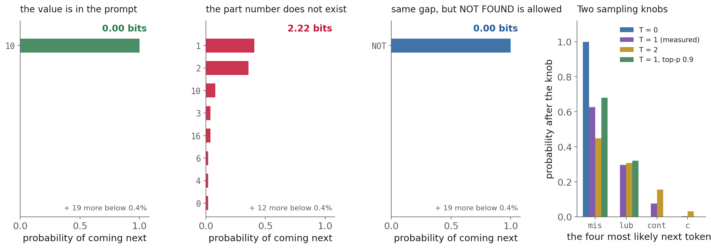
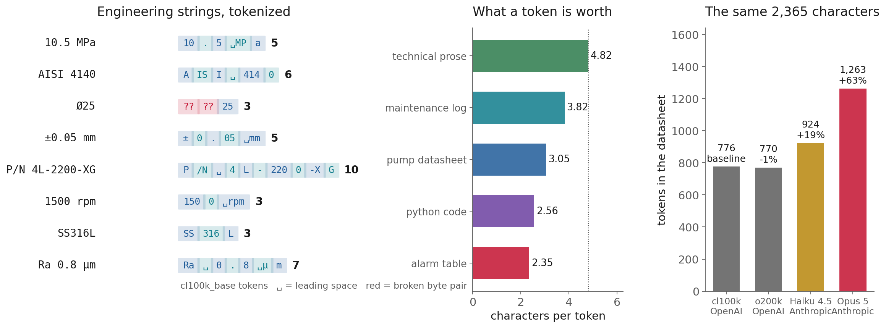
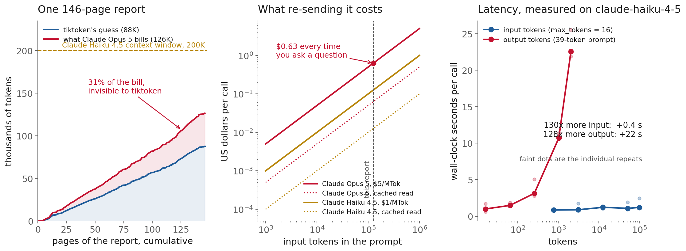
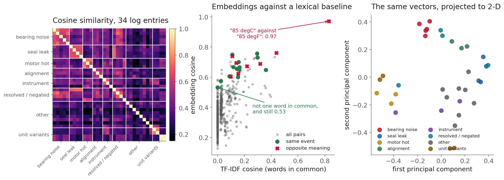
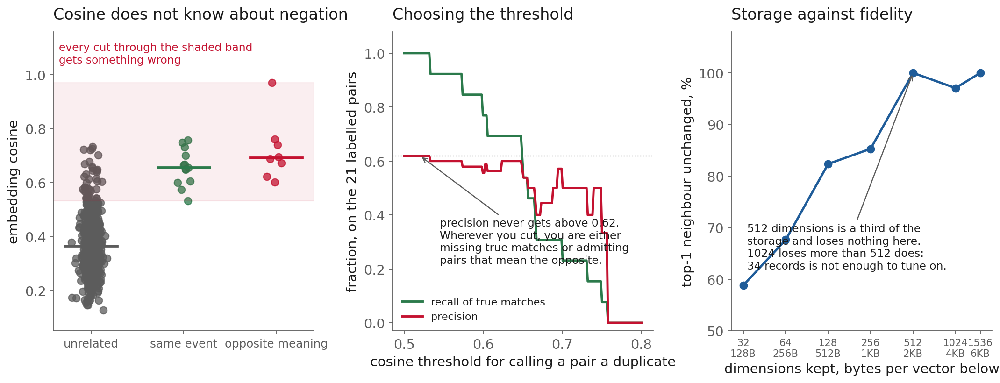

<!-- _class: title -->

# Lecture 15: Tokens, context, and vectors

## Week 9, LLM & agentic engineering

**Systems and Toolchains for AI Engineers**

---

## Roadmap

1. What a decoder-only model actually does
2. Predict the next token: fluency and hallucination
3. Tokenization, and what it does to engineering text
4. The context window as a budget
5. Embeddings and cosine similarity
6. Where cosine pushes back
7. Live demo: a datasheet and a log book

<!-- 110 min. Budget roughly 10 / 15 / 22 / 18 / 18 / 12 / 20 demo.
     Assignment 8 is released today: hold 5 min at the end for it.
     If running long, cut the sampling-knob slides, not the negation result. -->

---

<!-- _class: section -->

# Why this matters

---

## Why this matters

# `±0.05 mm`

---

## Why this matters, what the model receives

```
'±'   '0'   '.'   '05'   ' mm'
```

Five tokens. **Not one of them is `0.05`.**

The number the specification is about does not
exist in the model's input.

<!-- The fragment '05' is the same fragment it sees in 2005, in 0.5, and in a
     serial number. Let that sit for a second before moving on. -->

---

## Why this matters, and it costs a different amount everywhere

The same 2,365-character datasheet:

| tokenizer | tokens |
|---|---|
| `tiktoken` / `cl100k_base` | 776 |
| Claude Haiku 4.5 | 924 |
| Claude Opus 5 | **1,263** |

**+63%** over the local estimate.
**+37%** over another model from the same vendor.

**Today's claim.**

An LLM is a **next-token predictor over subword
fragments.**

What fits, what it costs, how long it takes,
and what it gets wrong about numbers
all fall out of that one sentence.

---

<!-- _class: section -->

# What the model actually does

---

## What the model actually does

<div class="definition">

**Decoder-only language model**: a next-token predictor: it consumes a sequence of tokens and returns a distribution over the token that follows.

</div>

1. **Tokenize** → integers from a fixed vocabulary
2. **Embed + position** → one vector per token
3. **Stack of blocks** → attention + feed-forward, ×100
4. **Logits** → one number per vocabulary entry
5. **Softmax, sample, append, repeat**

[Vaswani et al. 2017](https://arxiv.org/abs/1706.03762)

---

## What the model actually does, attention, in one slide

Each position emits a **query**.
Every position exposes a **key** and a **value**.

Query dot keys → weights.
Weights × values → what this position attends to.

That is how "it" three sentences later
still refers to the pump.

<!-- Do not derive it. The Alammar post is in the notes for anyone who wants
     the picture; the paper for anyone who wants the algebra. -->

---

## What the model actually does, you already built the pieces

Lecture 11: tensors, matmul on a GPU, autodiff, batching.

A transformer block is **those operations,
in a particular order, repeated.**

What is new is the scale and the training
objective, not the machinery.

**The one structural fact that matters.**

**Reading input is parallel.**
All of it at once.

**Writing output is serial.**
500 tokens = 500 forward passes, in order.

No hardware makes step 200 start
before step 199 finishes.

<!-- Flag this now; the latency measurement in 40 minutes is the payoff. -->

---

## What the model actually does, "Foundation model"

[Bommasani et al. 2021](https://arxiv.org/abs/2108.07258):
trained once on broad data, adapted to many tasks.

Names the **economics**, not the architecture.

Consequence for you: you will not train one.
The interface, the budget, and the failure
modes are your engineering problem.

---

<!-- _class: section -->

# Predict the next token

---

## Predict the next token

Not an answer. A **probability for every token
in the vocabulary.**

Then something samples from it.

Everything good and everything bad
about an LLM comes from this.

---

## Predict the next token, measured, four ways



<!-- Real top-20 logprobs from gpt-4.1-mini. Walk left to right. -->

---

## Predict the next token, answer is in the prompt

| token | probability |
|---|---|
| `10` | **1.000** |

**0.00 bits** of entropy.

Not reasoning about pressure. Completing a
pattern the context made overwhelming.

**Part number does not exist.**

`Kessler-Voss KV-7710/B`, a pump that does not exist

| token | probability |
|---|---|
| `1` | 0.405 |
| `2` | 0.358 |
| `10` | 0.080 |

**2.22 bits.** Less certain. **Still emitting a digit.**

---

## Predict the next token, why it cannot say "I don't know"

There is **no token** in the vocabulary
that means *not in the source*.

So the probability mass that should go there
has nowhere to go except onto plausible numbers.

# Hallucination is a missing output symbol.

---

## Predict the next token, give it the token

Add eleven words:

> *...or with the words NOT FOUND if the answer
> is not in the text below.*

| token | probability |
|---|---|
| `NOT` | **1.000** |

**0.00 bits.** Highest-leverage line in an extraction prompt.

---

## Predict the next token, temperature and top-p

**Temperature** divides the logits: <1 sharpens, >1 flattens.
**Top-p** keeps the smallest set whose mass exceeds *p*.

| what they do | what they do not do |
|---|---|
| reshape a computed distribution | add information |
| trade repeatability for variety | improve accuracy |
| `T=0` → most likely token, always | make output deterministic |

---

## Predict the next token, "It worked once" is not a passing test

Same prompt, byte identical, sent **5 times**.
Reading the returned distribution, not the sample:

| | range across 5 calls |
|---|---|
| leading token probability | **0.626 → 0.858** |
| entropy | **0.71 → 1.26 bits** |

Batching, reduced precision, heterogeneous
hardware. Float addition is not associative.

<!-- This is the module's non-determinism pitfall, measured. Evaluate on a set,
     never on an anecdote, and re-run the set when anything changes. -->

---

<!-- _class: section -->

# Tokenization

---

## Tokenization

<div class="definition">

**Token**: the subword unit a model actually reads. Token counts, not characters or words, are what you are billed for.

</div>

Nobody decided that ` MP` should be a token
and `MPa` should not.

**Byte-pair encoding**: start from bytes, merge
the most frequent adjacent pair, repeat ~50k times,
freeze the merge list.

[Gage 1994](https://en.wikipedia.org/wiki/Byte_pair_encoding) as compression,
[Sennrich et al. 2016](https://arxiv.org/abs/1508.07909) for language

---

## Tokenization, everything follows from the corpus

Frequent on the web → merged early → one token.

Frequent in **your documents**, rare on the web
→ never merged at all.

# Engineering notation is the second case.

---

## Tokenization, look at it



<!-- Ask them to guess "P/N 4L-2200-XG" before revealing. Nobody says ten. -->

---

## Tokenization, four ways engineering text breaks

- **Units detach**: `10.5 MPa` → `10` `.` `5` ` MP` `a`
- **Digits group by three, not by meaning**: `1500` → `150` `0`
- **Part numbers shatter**: `P/N 4L-2200-XG` = 14 chars, **10 tokens**
- **Some characters are not tokens**: `Ø25` → two *broken bytes* + `25`

---

## Tokenization, why LLMs are bad at arithmetic

`1500` → `150` + `0`
`4140` → `414` + `0`
`2200` → `220` + `0`

The representation does not respect place value.

The model never sees the number.
It sees a chunk and a leftover.

**Case and spacing are not free.**

| string | tokens |
|---|---|
| `bearing` | 1 |
| `Bearing` | 2 |
| `BEARING` | 2 |

Maintenance logs are written in capitals.
They cost more, and the model sees different symbols.

---

## Tokenization, what it adds up to per page

| kind of text | chars / token |
|---|---|
| technical prose | **4.82** |
| maintenance log | 3.82 |
| pump datasheet | 3.05 |
| Python source | 2.56 |
| table flattened out of a PDF | **2.35** |

A datasheet page costs **1.6×** a prose page.
A table costs **2×**.

**So the rule of thumb is wrong.**

"About four characters per token"
is a fact about **English prose**.

Your documents are not English prose.

Any budget built on it is wrong
in the expensive direction.

---

## Tokenization, count, do not estimate

| tokenizer | datasheet | vs `cl100k` |
|---|---|---|
| `cl100k_base` | 776 | baseline |
| `o200k_base` | 770 | −1% |
| Claude Haiku 4.5 | 924 | +19% |
| Claude Opus 5 | **1,263** | **+63%** |

The gap that catches people is the **last two rows**:
same vendor, 37% apart.

---

## Tokenization, two providers, opposite trade-offs

| | OpenAI `tiktoken` | Anthropic `count_tokens` |
|---|---|---|
| where | local library | network endpoint |
| cost | free, instant | free, own rate limit |
| exactness | exact for their models | documented as an *estimate* |
| offline | yes | no |

Neither is wrong. Using one to predict
the other's bill always is.

[docs](https://platform.claude.com/docs/en/build-with-claude/token-counting)

---

## Tokenization, the measured cost of guessing

146-page report, one document:

| | tokens |
|---|---|
| `tiktoken` says | 87,556 |
| Claude Opus 5 bills | **126,452** |

**The estimate is 31% low.**

Multiply by ten thousand documents.

---

<!-- _class: section -->

# The context window as a budget

---

## The context window as a budget

<div class="definition">

**Context window**: the hard limit on tokens a model can attend to at once, shared between what you send and what it generates.

</div>

Send 190K to a 200K-window model and you have
left room for 10K of answer, whatever
`max_tokens` says.

Exceeding it is a **request error**, not a
silent truncation. That is the merciful case.

**The truncation that actually bites you.**

Is in **your** code:

- a chunker with an off-by-one
- a PDF extractor that gives up on page 40
- a `[:8000]` somebody added while debugging

Nobody gets an error. The answer is just wrong.

---

## The context window as a budget, a real document



<!-- NASA RP-1218, the report behind the airfoil data from Lecture 9 and Lecture 13. 1989
     scan, so the text layer is OCR: figure axis labels, running heads, garbage
     like 'TEj LE'. You pay tokens for whatever the extractor emits. -->

---

## The context window as a budget, three numbers, three decisions

| | |
|---|---|
| **126,452 tokens** on Opus 5 | 13% of a 1M window, **half** of Haiku's 200K |
| **$0.63 per question** | ×50 questions = $31 on one report |
| **+0.4 s of latency** | over 130× more input |

Windows got big. **Cost replaced capacity**
as the binding constraint.

**Input is cheap in time. Output is not..**

| varied | from | to | median latency |
|---|---|---|---|
| **input** tokens | 769 | 100,456 | 0.85 s → **1.21 s** |
| **output** tokens | 16 | 2,048 | 1.00 s → **22.55 s** |

130× more input: **+0.4 s** (inside the scatter)
128× more output: **+22 s**

---

## The context window as a budget, the ratio to remember

# 1 output token ≈ 1000 input tokens
# of wall-clock time

Generation ran at ~90 tokens/second.
That is the serial loop, and you cannot buy your way out.

---

## The context window as a budget, so optimize the right term

| you want | you trim |
|---|---|
| lower bill | the input |
| lower latency | the **output** |

Trimming the pasted document to "make it faster"
optimizes the wrong budget.

<!-- For an extraction task returning small JSON: you pay input tokens in
     dollars and output tokens in seconds. Two budgets, two fixes. -->

**Before you build anything.**

Three numbers, for **one** representative document:

1. tokens, under the model you will actually call
2. dollars per call
3. seconds per call

All three are one API call away.
None can be guessed reliably.

---

<!-- _class: section -->

# Embeddings

---

## Embeddings

<div class="definition">

**Embedding**: a fixed-length vector for a piece of text, positioned so that similar meanings sit close together.

</div>

**Token embeddings**: the lookup table at the model's
input. One row per *fragment*. `SS316L` has three.

**Sentence / document embeddings**: one vector for the
whole input, from a **separate model** trained so that
distance means similarity.

Averaging the first is not the second.
[Reimers & Gurevych 2019](https://arxiv.org/abs/1908.10084)

---

## Embeddings, who has one

| provider | embedding model |
|---|---|
| OpenAI | `text-embedding-3-small` (1536), `-large` (3072) |
| Voyage | `voyage-4` family (1024 default) |
| Anthropic | **none**, [docs point you elsewhere](https://platform.claude.com/docs/en/build-with-claude/embeddings) |

Today's numbers are `text-embedding-3-small`.
They are properties of *that model*, not of embeddings.

---

## Embeddings, cosine similarity

$$\cos(\mathbf{u}, \mathbf{v}) = \frac{\mathbf{u} \cdot \mathbf{v}}{\|\mathbf{u}\|\,\|\mathbf{v}\|}$$

Most APIs return unit vectors already,
so it is just a dot product.

Values are **not comparable across models.**

---

## Embeddings, 34 maintenance log entries



<!-- The middle panel is the argument. Vertical spread at the left edge is
     pairs with no words in common. -->

---

## Embeddings, the pair that makes the case

> `brg vibration p101 high at startup`
> `Operator reports growling from the drive end bearing on P-101`

| | |
|---|---|
| TF-IDF cosine | **0.000** |
| embedding cosine | **0.532** |

Same event. **Not one word in common.**
Every keyword search misses this.

---

## Embeddings, when embeddings beat an LLM call

Deduplicating 34 entries pairwise:

| | calls | cost | time |
|---|---|---|---|
| LLM, pairwise | 561 | ~$1 | minutes |
| embeddings | **1** | **<$0.01** | one matmul |

At 100,000 records the first is not expensive,
it is **arithmetically impossible**.

**The rule.**

**"Which of these are alike?"** → embeddings
dedup, clustering, retrieval

**"What does this one say?"** → an LLM call
extraction, summarization, judgment

Real pipelines: narrow millions to tens with vectors,
then spend tokens on the tens.

---

## Embeddings, dimensionality is a storage decision

1M chunks × 1536 float32 = **6 GB** before indexing.

Matryoshka training: truncate from the end,
renormalize, and it still works.

| dims | bytes | top-1 neighbour unchanged |
|---|---|---|
| 1536 | 6144 | 100% |
| **512** | **2048** | **100%** |
| 256 | 1024 | 85.3% |
| 64 | 256 | 67.6% |

**Read that table honestly.**

1024 dims scored **97.1%**.
512 dims scored **100%**.

The curve is **not monotonic**,
because 34 records is not a sample.

Tuning a storage decision on this
would be tuning on noise.

---

## Embeddings, changing embedding model is a migration

Vectors from two models are **not comparable**,
and there is no conversion.

- re-embed the entire corpus (full token cost again)
- re-tune every threshold downstream
- pin the model id next to the vectors, like a schema version

Also: `input_type` for asymmetric models, and
8K to 32K token input limits, so chunk first.

---

<!-- _class: section -->

# Where cosine pushes back

---

## Where cosine pushes back

> `Mechanical seal leaking, approx 8 drops/min, pump P-101`
> `P-101 seal inspected, no leak found`

One is a fault. The other is its refutation.

## cosine = 0.694

---

## Where cosine pushes back, compare

| pair | means | cosine |
|---|---|---|
| `brg vibration` / `growling from the DE bearing` | **the same** | 0.532 |
| `seal leaking` / `no leak found` | **the opposite** | **0.694** |

# The opposite pair scores higher.

---

## Where cosine pushes back, not a near miss



<!-- All 8 opposite-meaning pairs score above the weakest true match. Medians
     0.691 vs 0.655. The groups sit on top of each other. -->

---

## Where cosine pushes back, there is no threshold

Not a badly chosen one. **There is no value.**

Sweeping the cut across the labelled pairs,
precision never exceeds **0.62**.

Cosine measures *what a text is about*.
A leak and a no-leak are maximally about the same thing.

**Units are invisible.**

> `Bearing temperature 85 degC steady on the drive end`
> `Bearing temperature 85 degF steady on the drive end`

## cosine = 0.971

One is at its alarm limit. One is room temperature.

`10.5 MPa` vs `10.5 bar`: **0.761**

---

## Where cosine pushes back, which is about Assignment 8

Unit normalization cannot be delegated to:

- semantic similarity (0.971, see above)
- the model's good judgment

It is an **explicit, typed, tested** pipeline stage.
Units in the schema. Original *and* normalized retained.

**The principled objection.**

[Steck, Ekanadham & Kallus 2024](https://arxiv.org/abs/2403.05440),
*Is Cosine-Similarity of Embeddings Really About Similarity?*

Cosine between learned embeddings can be
"arbitrary and therefore meaningless", governed
by **regularization**, not semantics.

Not "never use it". "It carries no guarantee."

---

## Where cosine pushes back, and the ground moves

Model ids deprecate. Tokenizers get revised.
Prices and windows change.

Anything depending on a token count is a
**hardcoded assumption about a model version**:
chunk size, cost estimate, context-fit check, rate budget.

Pin the id. Record it in your output. Re-measure on upgrade.

---

<!-- _class: demo -->

# Demo

## `l15-tokens-embeddings.ipynb`

**Predict before we compute.**
Which pairs cluster? How many tokens is that part number?

---

## Recap

- Tokens are **subword fragments**, and engineering
  notation gets the worst of them
- Count with the **model you will call**, not the library you have
- Context is a shared budget; **cost binds before capacity**
- **Input is cheap in time, output is not** (1000:1)
- Hallucination is a **missing output symbol**; give it one
- Cosine finds near-duplicates and **cannot see negation or units**

---

## Next

**Reading** linked at the end of the notes
**Assignment 8** released today, due 2026-11-04

Notes for this lecture: `lectures/l15/notes.md`
