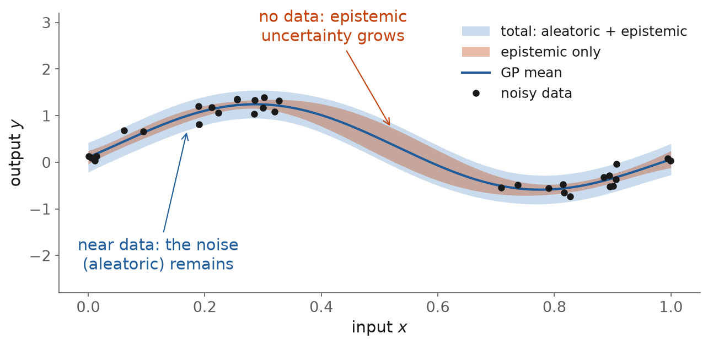
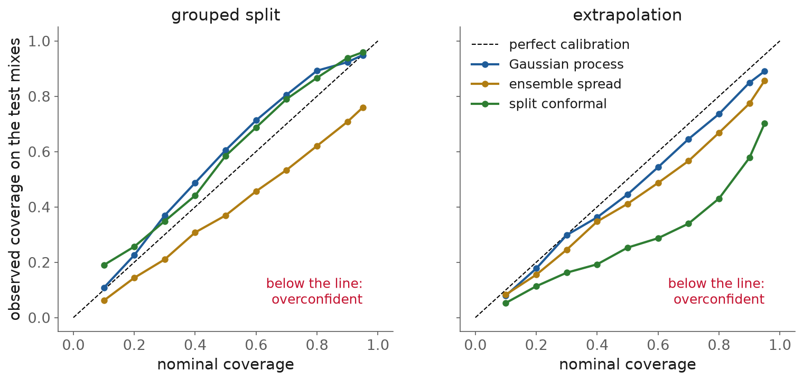
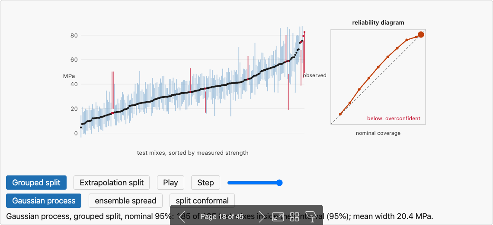
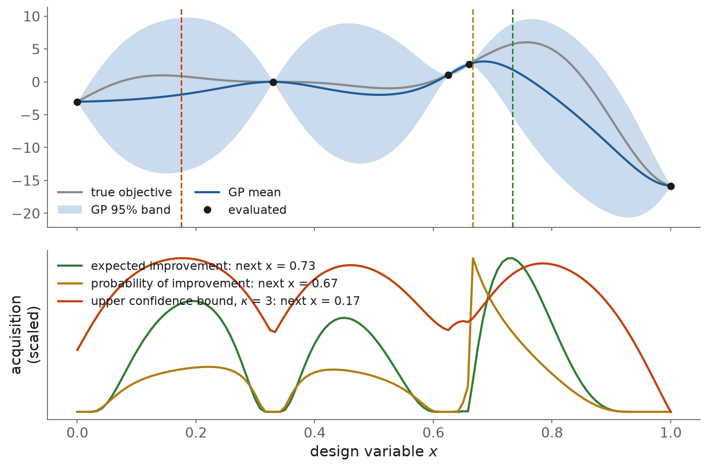
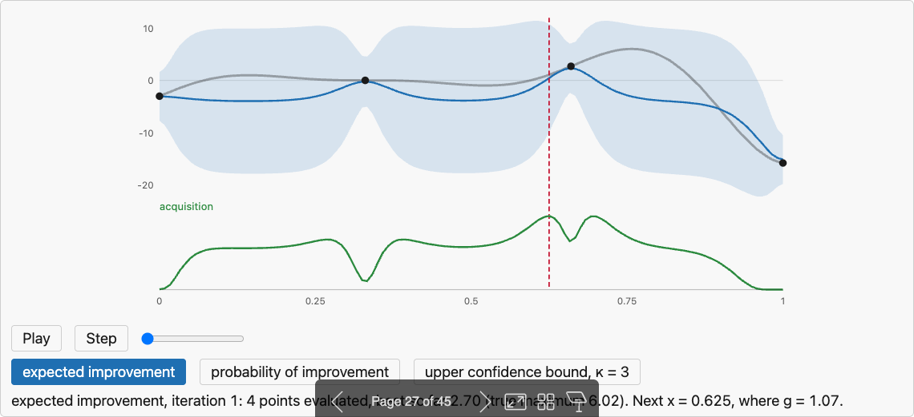
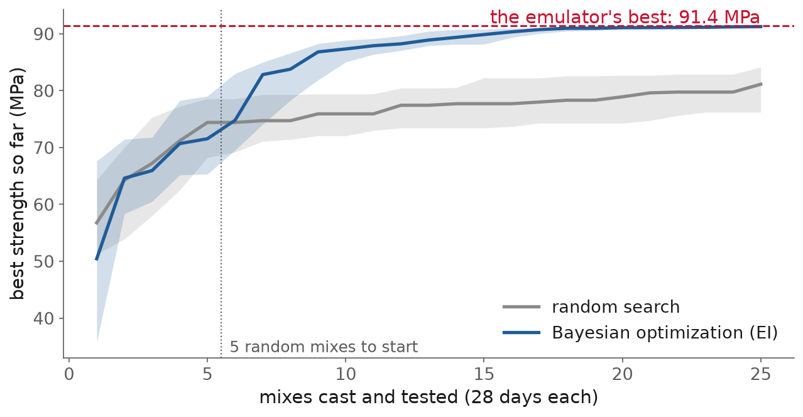
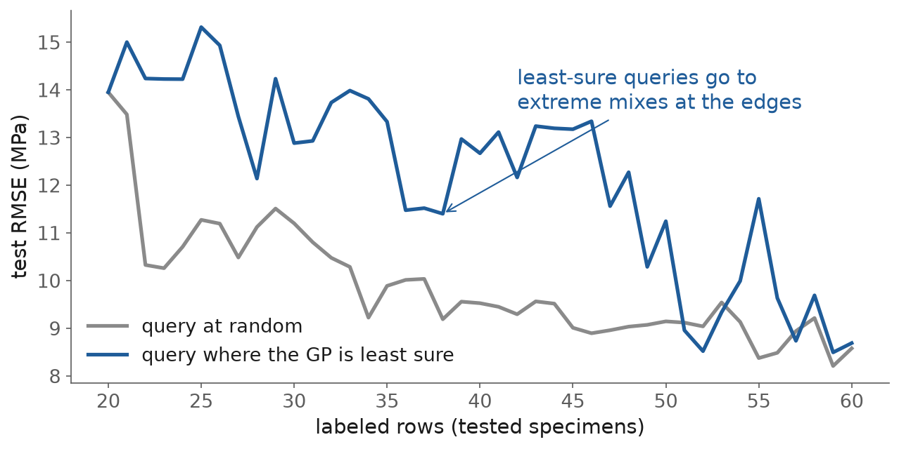

<style>
/* a figure alone in its paragraph is centered, and so is every table */
section p:has(> img:only-child) { text-align: center; }
section table { margin-left: auto; margin-right: auto; }

.cols { display: grid; gap: 1.1em; align-items: center; }
.cols-even { grid-template-columns: 1fr 1fr; }
.cols-lc { grid-template-columns: 1.25fr 1fr; }
.cards { display: grid; grid-template-columns: repeat(3, 1fr); gap: 16px; margin-top: 0.3em; }
.card { background: #f7f7f7; border-top: 5px solid #1f5c99; border-radius: 6px; padding: 10px 12px; font-size: 0.66em; }
.card:nth-child(2) { border-top-color: #b07d12; }
.card:nth-child(3) { border-top-color: #2e7d32; }
.card h4 { margin: 4px 0 6px; font-size: 1.25em; }
.card p { margin: 0.3em 0; }

.flow { display: flex; align-items: center; justify-content: center; gap: 0.45em; margin: 0.6em 0 0.3em; }
.flow .step { flex: 1; max-width: 230px; text-align: center; background: #f7f7f7; border: 2px solid #5c5c5c;
  border-radius: 8px; padding: 0.35em 0.5em; line-height: 1.3; font-size: 0.68em; }
.flow .arrow { font-size: 1.2em; color: #5c5c5c; }

.readbox { background: #f7f7f7; border-left: 5px solid #1f5c99; border-radius: 0 6px 6px 0;
  padding: 0.35em 0.8em; font-size: 0.7em; line-height: 1.35; }
.readbox ul { margin: 0; padding-left: 1.1em; }
.readbox li { margin: 0.25em 0; }
.readbox p { margin: 0.2em 0; }
section p.takeaway { text-align: center; font-weight: 700; font-size: 0.82em; margin: 0.5em 0 0; }
.small { font-size: 0.72em; }
.source { font-size: 0.6em; color: #5c5c5c; }
.red { color: #c41230; }
</style>

<!-- _class: title -->

# Lecture 15: Uncertainty quantification, Bayesian optimization and active learning

## Week 7, Machine learning and deep learning

**Systems and Toolchains for AI Engineers**

<!--
Why 5, two kinds 10, intervals 15, calibration 15, BO 30, active learning 10, close 5. 90 min, notebook after.
-->

---

## What today is about

1. **Two kinds of uncertainty**: aleatoric and epistemic
2. **Three ways to get an interval**: Gaussian process, deep ensemble, split conformal
3. **Is it right?** Calibration, on the mixes you will actually use
4. **Bayesian optimization**: spend the uncertainty to choose the next experiment
5. **Active learning**: label where the model is least sure, and when that fails

<!--
One dataset all session: the concrete strength dataset, Lecture 9's GP.
-->

---

## Why this matters, the 28-day test

* A concrete cylinder is tested after **28 days** of curing
* Every new mix: a month of waiting, materials, lab time
* Lecture 9's **Gaussian process** (GP) predicts a strength **and** an uncertainty for any mix
* So the model can choose which mixes to cast next
* **Whether that works depends on whether its uncertainty is right**

---

## Why this matters, two numbers from today

<div class="cards">
<div class="card"><h4>70%</h4><p>How often one method's "95%" intervals contain the true strength, on the strongest mixes.</p></div>
<div class="card"><h4>91.6 ± 18.0 MPa</h4><p>An optimizer's best mix, according to the GP.</p></div>
<div class="card"><h4>82.6 MPa</h4><p>The strongest specimen in the whole dataset.</p></div>
</div>

<p class="takeaway">Measure the uncertainty, check it, then spend it.</p>

---

<!-- _class: section -->

# Two kinds of uncertainty

---

## Two kinds of uncertainty

<div class="definition">

**Aleatoric**: the scatter in the data itself, which no amount of data removes. **Epistemic**: what the model does not know yet, which more data in the right place reduces.

</div>



<!--
Blue: total. Orange: epistemic only. In the gap, orange swells. Near data, blue stays: that is the noise.
-->

---

## Two kinds of uncertainty, on the concrete strength dataset

* **Aleatoric**: 19 settings (same mix, same age) tested more than once, 53 rows: they scatter by **5.0 MPa**
* No model predicts better than that
* The GP's noise term, fitted on its own: **3.9 MPa**
* **Epistemic**: the rest of the GP's uncertainty
  * Test mixes like the training mixes: **3.2 MPa** on average
  * The strongest mixes, held out: **10.8 MPa**
* Epistemic tells you **where new data would help**

---

<!-- _class: section -->

# Three ways to get an interval

---

## Prediction intervals, the Gaussian process

* A **prediction interval** should contain the true value with a stated probability, for example 95%
* Lecture 9's GP: a mean $\mu(x)$ and a standard deviation $\sigma(x)$ at every mix

$$
\text{95\% interval} = \mu(x) \pm 1.96\,\sigma(x)
$$

* $\sigma$ carries both parts: the noise term (aleatoric) and the posterior spread (epistemic)
* It assumes the error is Gaussian

---

## Prediction intervals, a deep ensemble

<div class="definition">

**Deep ensemble**: several networks that differ only in their random starting weights; the spread of their predictions is the uncertainty.

</div>

* Five copies of Lecture 9's network (16 tanh units), seeds 0 to 4
* Mean of the five: the prediction. Their standard deviation: the spread
* The data pin the function down: the networks agree. They do not: they disagree
* So the spread is **epistemic only** ([Lakshminarayanan et al., 2017](https://arxiv.org/abs/1612.01474) add a noise output for the rest)

---

## Prediction intervals, split conformal

<div class="definition">

**Split conformal prediction**: the interval width comes from the model's errors on a held-out calibration set, with no assumption about their distribution.

</div>

* Fit any model on 625 rows; compute errors $s_i = |y_i - \hat y(x_i)|$ on 210 calibration rows
* $q$ = the $\lceil (n+1)(1-\alpha) \rceil / n$ quantile of the $s_i$; interval $\hat y(x) \pm q$
* **Guarantee**: coverage at least $1 - \alpha$, if test and calibration points are **exchangeable**
* Same width everywhere: it does not grow where the model is unsure

<!--
Exchangeable: drawn the same way from the same population, order does not matter. Angelopoulos and Bates for the gentle version.
-->

---

## Prediction intervals, a question

<div class="clicker" data-tag="l15-ensemble" data-seconds="45" data-answer="C" data-hint="Where do five networks trained on the same data agree? Is the scatter between replicate specimens something they disagree about?" data-why="C. The networks agree wherever the data pin the function down, including where the measurements are noisy, so their spread misses the 5 MPa scatter between replicates: it is epistemic only." data-read="https://clicker.f26-06763.workers.dev">
<div class="clicker-main">

**Five networks, five seeds, the same training mixes. What does the spread of their predictions miss?**

<ol class="clicker-opts">
<li>The error from too few training mixes</li>
<li>Disagreement far from the training data</li>
<li>The scatter between replicate specimens</li>
<li>Nothing: the spread is the full uncertainty</li>
</ol>

</div>
<aside class="clicker-panel">

<div class="clicker-url">clicker.f26-06763.workers.dev</div>
<button class="clicker-start">Start voting</button>
<div class="clicker-timer">45</div>
<div class="clicker-count">no votes yet</div>
</aside>
</div>

<!-- A and B are what the spread does catch. -->

---

<!-- _class: section -->

# Is the uncertainty right?

---

## Calibration

<div class="definition">

**Calibrated**: stated probabilities match what happens. 95% intervals contain the truth 95% of the time.

</div>

$$
\text{PICP} = \frac{1}{N}\sum_{i=1}^{N} \mathbf{1}\big[\, y_i \in [\,L(x_i),\, U(x_i)\,] \big]
$$

* **PICP** (prediction interval coverage probability): the fraction of test points inside their interval
* **Reliability diagram**: PICP against the nominal level. Below the diagonal: **overconfident**
* Report the **width** too: 0 to 100 MPa always covers

---

## Calibration, two test sets

* **Grouped split**: Lecture 9's split, 20% of the mixes held out at random (195 rows)
* **Extrapolation split**: the 20% of mixes with the **lowest water/cement ratio** held out (265 rows)
  * The strongest mixes: 49.5 MPa on average, against 31.1 kept
  * Where a design loop pushes a surrogate

---

## Calibration, the reliability diagrams



<div class="readbox">

**Left**: GP and conformal on the diagonal; the ensemble's spread well below. **Right**: everything below; conformal lowest.

</div>

---

## Calibration, the numbers

| 95% intervals | Grouped: coverage | Grouped: width | Extrapolation: coverage | Extrapolation: width |
|---|---|---|---|---|
| Gaussian process | 95% | 20.4 MPa | 89% | 43.8 MPa |
| Ensemble spread | **76%** | 12.1 MPa | 86% | 30.9 MPa |
| Split conformal | 96% | 26.9 MPa | **70%** | 18.1 MPa |

* **Ensemble**: epistemic only, misses the 5 MPa scatter
* **GP**: closest on the strong mixes; its intervals double in width
* **Conformal**: strong mixes are not exchangeable with the calibration mixes, and its width does not grow

---

## Calibration, explore it

<div class="cw compact" data-widget="coverage" data-source="l15"></div>

<!--
Extrapolation split, conformal, 95%: red bars on the right, the strongest mixes. Then GP: wider bars, fewer misses.
-->

---

## Calibration, a question

<div class="clicker" data-tag="l15-conformal" data-seconds="45" data-answer="B" data-hint="What does conformal's guarantee assume about the calibration mixes and the test mixes?" data-why="B. Conformal sets its width on calibration mixes that look like the training mixes. The strongest mixes are not exchangeable with them, so the guarantee does not hold, and the constant width does not grow where the model is unsure." data-read="https://clicker.f26-06763.workers.dev">
<div class="clicker-main">

**Split conformal promised 95% and covered 70% of the strongest mixes. Why?**

<ol class="clicker-opts">
<li>The calibration set was too small</li>
<li>The strong mixes are not exchangeable with the calibration mixes</li>
<li>Conformal assumes the errors are Gaussian</li>
<li>The networks underneath were badly trained</li>
</ol>

</div>
<aside class="clicker-panel">

<div class="clicker-url">clicker.f26-06763.workers.dev</div>
<button class="clicker-start">Start voting</button>
<div class="clicker-timer">45</div>
<div class="clicker-count">no votes yet</div>
</aside>
</div>

<!-- C is the tempting one: conformal makes no distributional assumption. -->

---

## Calibration, what to do with it

* Check coverage on a test set like **where the model will be used**, not only where it trained
* An ensemble's spread is epistemic: add the noise before calling it an interval
* Conformal's guarantee is real, **and needs exchangeability**. A design loop breaks that on purpose

---

<!-- _class: section -->

# Bayesian optimization

---

## Bayesian optimization, the problem

* Find the mix $x$ that maximizes an **expensive** $f(x)$: the 28-day strength
* No formula, no gradient, a few dozen evaluations: **black-box optimization**
* A grid: 10 levels of 4 ingredients = 10,000 mixes, **770 years** of 28-day tests in a row

<div class="definition">

**Bayesian optimization (BO)**: fit a probabilistic surrogate to the evaluations so far, and use an **acquisition function** of its mean and uncertainty to choose the next point.

</div>

---

## Bayesian optimization, the loop

<div class="flow">
<div class="step">1. Fit a GP to the data so far</div><div class="arrow">→</div>
<div class="step">2. Maximize the acquisition</div><div class="arrow">→</div>
<div class="step">3. Evaluate f there (cast the mix)</div><div class="arrow">→</div>
<div class="step">4. Add the result</div><div class="arrow">↺</div>
</div>

* The acquisition trades **exploitation** (mean high) against **exploration** (uncertainty high)
* $f^*$: the best value found so far

---

## Bayesian optimization, expected improvement

$$
\text{EI}(x) =
\underbrace{\big(\mu(x) - f^*\big)\,\Phi(z)}_{\text{exploit: mean above the best}}
+ \underbrace{\sigma(x)\,\phi(z)}_{\text{explore: room to be better}},
\qquad z = \frac{\mu(x) - f^*}{\sigma(x)}
$$

* $\Phi$: standard normal cumulative distribution; $\phi$: its density
* Large when the mean is above $f^*$, or $\sigma$ is large, or both

---

## Bayesian optimization, other acquisitions

* **Probability of improvement (PI)**: $\Phi(z)$, the chance of beating $f^*$ by any margin. Small sure gains: stays near the best
* **Upper confidence bound (UCB)**: $\mu(x) + \kappa\,\sigma(x)$. Large $\kappa$ explores
* **Thompson sampling**: draw one function from the GP, evaluate at its maximum. The random draw explores

---

## Bayesian optimization, one GP, three choices



<div class="readbox">

Same five points. **EI** → 0.73, near the true peak. **PI** → 0.67, next to the best point. **UCB (κ = 3)** → 0.17, the widest band.

</div>

---

## Bayesian optimization, the loop on a test function

<div class="cw compact" data-widget="bo-loop" data-source="l15"></div>

<!--
EI first: peak at the 5th pick. Then PI: creeps 0.66, 0.67, 0.68... Then UCB: goes to 0.18 first.
-->

---

## Bayesian optimization, eight picks each

| Acquisition | Picks | Best found (true max 6.02) |
|---|---|---|
| EI | 0.63, 0.73, 0.78, 0.18, 0.76, ... | 6.02 from the 5th pick |
| PI | 0.66, 0.67, 0.68, 0.68, ... 0.72 | 5.26 |
| UCB, $\kappa = 3$ | 0.59, 0.18, 0.78, 0.45, 0.73, ... | 6.02 |

* **PI** exploits: tiny steps uphill
* **UCB** explores first, then finds the peak
* **EI** balances, and gets there fastest here

<p class="source">Test function: Forrester et al. (2008), flipped to a maximization.</p>

---

## Bayesian optimization, a mix design

* The "lab": a GP fitted to all 1,030 rows plays the 28-day test
* **Design**: cement, slag, water, superplasticizer (kg/m³), within the 5th to 95th percentile of the 28-day mixes
* **BO**: 5 random mixes, then 20 by EI. **Random search**: 25 random mixes
* **30 seeds** each: one run of either is luck

---

## Bayesian optimization, against random search

<div class="cols cols-lc">
<div>



</div>
<div class="small">

| After 25 tests | BO (EI) | Random |
|---|---|---|
| Median best | **91.3 MPa** | 81.1 MPa |
| Within 1 MPa of the emulator's best | **29 of 30** | 0 of 30 |

</div>
</div>

---

## Bayesian optimization, check the answer

* The emulator's best mix: 472 cement, 235 slag, 162 water, 11 superplasticizer
* Predicted: **91.6 ± 18.0 MPa** (95%)
* The strongest specimen ever tested: **82.6 MPa**
* The optimizer went where the emulator is most **optimistic**: a corner, far from any tested mix
* **The ±18 MPa says so.** The next step is to cast that mix, update the GP, and continue

<p class="takeaway">On a fixed surrogate, BO exploits the surrogate's errors. Its answer is a proposal to test.</p>

---

## Bayesian optimization, a question

<div class="clicker" data-tag="l15-acq" data-seconds="45" data-answer="A" data-hint="The PI row of the table: how far apart are its picks, and where are they?" data-why="A. PI scores the chance of beating the best by any margin, so it favors points right next to the best one: its picks crept from 0.66 to 0.72 and stopped at 5.26." data-read="https://clicker.f26-06763.workers.dev">
<div class="clicker-main">

**Which acquisition is most likely to get stuck near the best point found so far?**

<ol class="clicker-opts">
<li>Probability of improvement</li>
<li>Expected improvement</li>
<li>Upper confidence bound with κ = 3</li>
<li>Thompson sampling</li>
</ol>

</div>
<aside class="clicker-panel">

<div class="clicker-url">clicker.f26-06763.workers.dev</div>
<button class="clicker-start">Start voting</button>
<div class="clicker-timer">45</div>
<div class="clicker-count">no votes yet</div>
</aside>
</div>

---

## Bayesian optimization in Optuna

<div class="cols cols-lc">
<div>

```python
study = optuna.create_study(
    direction="maximize",
    sampler=optuna.samplers.GPSampler(
        seed=0,
        n_startup_trials=5,
    ),
)
study.optimize(
    objective,
    n_trials=25,
)
```

</div>
<div class="small">

* **Optuna** (Lecture 10) used TPE by default
* [`GPSampler`](https://optuna.readthedocs.io/en/stable/reference/samplers/generated/optuna.samplers.GPSampler.html): BO with a GP surrogate
* `n_startup_trials=5`: 5 random points, then the GP chooses
* `objective(trial)` suggests a mix with `trial.suggest_float` and returns its strength

</div>
</div>

---

## Bayesian optimization, against fifty chemists

* [Shields et al. (2021)](https://b-shields.github.io/files/2021-02-03-Nature.pdf), *Nature*: a palladium-catalyzed reaction as a black box
* Inputs: ligand, base, solvent, temperature, concentration. Output: yield. Each evaluation: a real reaction
* A GP with expected improvement (EDBO) against **fifty expert chemists and engineers**
* BO won on both average efficiency and consistency
* It applies the same rule every time and never forgets a result

---

<!-- _class: section -->

# Active learning

---

## Active learning

<div class="definition">

**Active learning**: choose which points to label (measure) next, to make the model as accurate as possible with as few labels as possible.

</div>

* BO wants **one** best point. Active learning wants a model good **everywhere** you will use it
* **Uncertainty sampling**: label where the GP's $\sigma$ is largest
* **Query-by-committee**: label where an ensemble disagrees most

---

## Active learning, on the concrete strength dataset

<div class="cols cols-lc">
<div>



</div>
<div class="small">

| Test RMSE | 20 rows | 40 rows | 60 rows |
|---|---|---|---|
| Least sure | 13.9 | 12.7 | 8.7 |
| Random | 13.9 | **9.5** | 8.6 |

MPa, median of 8 seeds.

</div>
</div>

---

## Active learning, why it lost here

* The GP is least sure at the **edges**: extreme mixes, ages and doses
* 45% of the least-sure queries: age 3 days or 180 days and more. In the pool: **19%**
* The test mixes, like the pool, are mostly in the middle
* Random queries cover where the test mixes are
* Helps when queries go where the model will be **used**: weight by how likely an input is, or restrict the pool

---

## Active learning, an autonomous lab

* A-Lab ([Szymanski et al., 2023](https://pmc.ncbi.nlm.nih.gov/articles/PMC10700133/), *Nature*): robots synthesize inorganic materials; active learning picks the next recipe
* First reported: 41 of 58 targets in 17 days
* [2026 author correction](https://doi.org/10.1038/s41586-025-09992-y): re-analysis confirmed **36 of 40** reported successes, 4 inconclusive; materials "new to the prediction platform, not necessarily new to science"
* Check whether the loop's measurements say what it concluded

---

## Extensions engineers need

* **Constrained BO**: a second GP for a constraint (cost, CO₂, slump)
* **Multi-objective BO**: strength **and** cost; the answer is a **Pareto front**
* **Batch BO**: several experiments at once
* **Multi-fidelity BO**: cheap 7-day tests with expensive 28-day tests
* [BoTorch](https://botorch.org/) and [Ax](https://ax.dev/) do all four

---

## Limitations and trade-offs

<div class="small">

| | Gaussian process | Deep ensemble | Split conformal |
|---|---|---|---|
| Uncertainty it reports | aleatoric + epistemic | epistemic only | total, constant width |
| Guarantee | if the GP's assumptions hold | none | coverage, if exchangeable |
| Grows away from data | yes | yes | no |
| Large data | poorly ($O(n^3)$) | yes | yes, wraps any model |

</div>

* **BO**: a few dozen to hundreds of evaluations, up to ~15 to 20 variables; report several seeds and a random baseline
* **Active learning**: unsure may not be where the model is used. Count the **expensive** evaluations

---

<!-- _class: demo -->

# Worked example

* `l15-uq-bayesopt.ipynb`: GP, ensemble and conformal intervals with their coverage on two test sets; BO of a mix with EI by hand, against random search, and in Optuna's `GPSampler`

---

## Recap

* **Aleatoric**: scatter in the data (5.0 MPa). **Epistemic**: what the model does not know yet
* **GP**: both. **Ensemble spread**: epistemic. **Conformal**: coverage, if exchangeable
* **Calibration**: PICP and reliability diagrams, on where the model will be used. Strong mixes: conformal 70%
* **BO**: GP + acquisition (EI, PI, UCB, Thompson). 29 of 30 seeds vs 0 for random
* The emulator's best, **91.6 ± 18.0 MPa**: a proposal to test
* **Active learning**: least sure went to the edges; random did better here

---

## Standings

Nicknames only. Everyone who skipped one still counted in every bar you saw.

<div class="clicker-leaderboard"
     data-read="https://clicker.f26-06763.workers.dev"
     data-top="8"
     data-hours="6"
     data-title="Standings"></div>

---

## Before next time

* Practice module for this session: on the course site
* Run the worked example: the Optuna part needs `torch`, which Colab already has

<script src="l15-widget-data.js"></script>
<script src="widgets.js"></script>
<script src="clicker-slide.js"></script>
