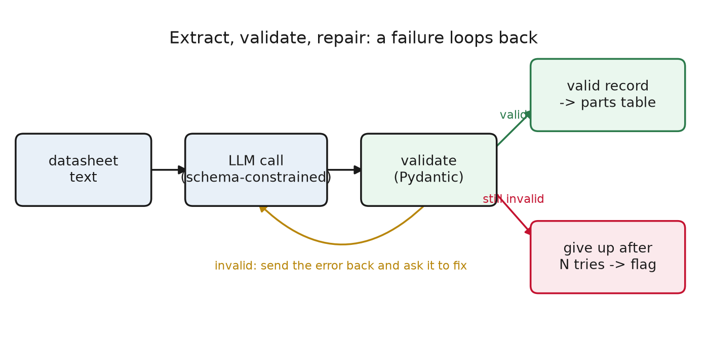
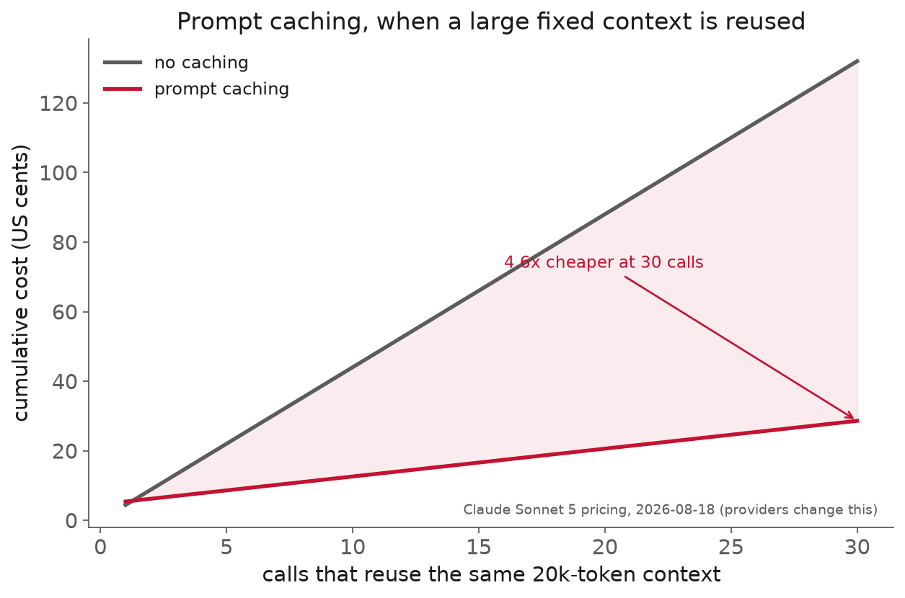
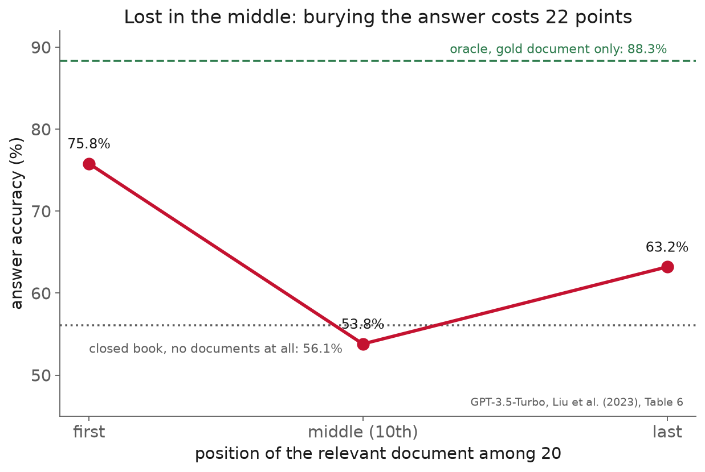

<!-- _class: title -->

# Lecture 16: The API, prompt, and structured-output interface

## Week 9, LLM & agentic engineering

**Systems and Toolchains for AI Engineers**

---

## Roadmap

1. Why this matters
2. The request and response interface
3. Structured output you can trust
4. Context, cost, and latency
5. Prompting you can measure
6. Reliability engineering
7. Where it pushes back
8. Live demo: a datasheet to a validated record

<!-- 110 min. Budget roughly 10 / 12 / 20 / 16 / 14 / 8 / 10 / 20 demo.
     Task throughout: component datasheets -> a normalized parts table (Assignment 8).
     Assignment 8 was released last session; tie the demo back to it at the end. -->

---

<!-- _class: section -->

# Why this matters

---

## Why this matters

The task behind Assignment 8: a few hundred component datasheets,
one clean parts table.

Part number, material, max pressure (MPa),
temperature range, mass.

An LLM can read a datasheet and produce that record.
The trouble is what "produce that record" hides.

---

## Why this matters

Three ways it goes wrong, none of which raise an error:

- datasheet says **40 bar**, model writes `42` MPa: off by 10x, silently
- datasheet omits pressure, model **invents** 16 MPa
- 60-page PDF overruns the context, the end is **silently truncated**

<div class="definition">

"The model returned JSON" is not the same claim as "the JSON is correct."

</div>

---

## Why this matters

So make the interface an engineering artifact:

- **structured output** you can validate mechanically
- **cost and latency** as first-class numbers
- **prompting** measured on a labeled set, not eyeballed

Those three are the spine of the session.

---

<!-- _class: section -->

# The request and response interface

---

## The request and response interface

Every hosted model exposes the same shape:

- **messages** with roles: system (standing instructions), user (the input)
- `max_tokens`, `temperature`, stop conditions
- streaming vs non-streaming
- a **usage** block: tokens in, tokens out, cached

Reading usage on every call is how you know what a pipeline costs.

---

## The request and response interface

Two settings that trade off:

- **temperature ~ 0** for extraction (there is a right answer)
- larger `max_tokens` and streaming change *when* tokens arrive, not the total

The interface is provider-agnostic; the specifics are not.
**Pin the model ID** you used; read current docs for limits and price.

---

## The request and response interface

```python
resp = client.messages.create(
    model="claude-sonnet-5",        # pin it
    max_tokens=512, temperature=0,  # extraction: deterministic
    system="You extract component data as JSON...",
    messages=[{"role": "user", "content": datasheet_text}],
)
text = resp.content[0].text
usage = resp.usage                  # input_tokens, output_tokens: the meter
```

Read on a slide, run in the demo. The usage block is the cost meter.

---

<!-- _class: section -->

# Structured output you can trust

---

## Structured output you can trust

Asking for JSON in the prompt and hoping fails just often enough
to corrupt a batch. Two better routes, both hand the model a schema:

<div class="definition">

**Structured output**: constrain decoding to a schema so the reply parses and conforms, via schema-enforced JSON or a typed tool call.

</div>

---

## Structured output you can trust

- **schema-enforced JSON**: Anthropic `output_config.format`, OpenAI `text.format` with `strict`
- **tool / function calling**: a tool with a typed `input_schema`

Close cousins: both send a schema, both return a payload shaped to it.
Tool calling is older, universal, and reused for agents.

---

## Structured output you can trust

A schema guarantees **shape**, never **truth**.

- `max_pressure_MPa` is present and a number: yes
- the number is right, units converted, not invented: **not checked**

So the schema is only the first check. Validate the content with **Pydantic**:
typed fields, plus custom checks (pressure positive, temp low < high).

---

## Structured output, the validator

```python
class Component(BaseModel):
    part_number: str
    material: str
    max_pressure_MPa: float | None = None   # None when not stated

    @field_validator("max_pressure_MPa")
    @classmethod
    def plausible(cls, v):
        if v is not None and not (0 < v < 1000):
            raise ValueError("pressure out of range")
        return v
```

A typed class is the contract; a validator turns shape-checking into fact-checking.

---

## Structured output, and how it drifts

The parameters themselves are a live example of provider drift:

- Anthropic added `output_config.format`, **deprecating** the old `output_format`
- OpenAI moved the canonical shape from Chat `response_format` to Responses `text.format`

Both changed inside a year. Read the current docs; pin what you used.

---

## Structured output, the repair loop



<div class="definition">

A validation failure feeds the error back to the model as a repair request. Cap the retries; after N, flag for a human.

</div>

---

<!-- _class: section -->

# Context, cost, and latency

---

## Context, cost, and latency

Cost is near-linear in tokens: predictable once measured, invisible until then.

- read usage on every call; log cost per call and per document
- anchor (Sonnet 5, 2026-08-18): **$2 / Mtok in, $10 / Mtok out**
- a one-page datasheet is a fraction of a cent; 10,000 of them is real money

---

## Context, cost, and latency, the levers

- **prompt caching** for a large fixed prefix (next slide)
- **right-size the model**: a small fast model for easy subtasks
- **sane `max_tokens`**: you pay for output length
- **batching** when latency does not matter

Measure first: log usage per call, then pull the lever that helps.

---

## Context, cost, and latency, caching

<div class="definition">

**Prompt caching**: mark a large fixed prefix (instructions, schema, examples) cacheable; pay once to write, a tenth to read.

</div>



Break-even at the second call; ~4.6x cheaper by 30.

---

## Context, cost, and latency, lost in the middle



[Liu et al. 2023](https://arxiv.org/abs/2307.03172): burying the answer mid-context drops accuracy 22 points, below closed-book. More context is not free.

---

<!-- _class: section -->

# Prompting you can measure

---

## Prompting you can measure

The techniques are mundane:

- clear role and instructions in the system prompt
- **zero-shot** vs **few-shot**; few-shot when the format is fiddly
- ground in the provided text; instruct it to say "not found"
- ask for the source span; keep temperature low

---

## Prompting you can measure, the gold set

<div class="definition">

**Gold set**: 10-30 examples with the correct extraction written by hand, so a prompt change is scored, not guessed.

</div>

"Field accuracy 71% -> 89%, cost +4%" is a sentence you can act on.
"Seems better" is not.

---

## Prompting you can measure, the delta

| | naive prompt | improved prompt |
|---|---|---|
| instruction | "extract fields as JSON" | roles, units rule, "say null", one example |
| `40 bar` | left as 40 MPa | converted to 4.0 MPa |
| bolt pressure | invented 16 MPa | null |
| field accuracy | 80% | 100% |
| cost / 4 sheets | 0.21 cents | 0.34 cents |

More accurate and more expensive: the decision is accuracy per dollar.

---

<!-- _class: section -->

# Reliability engineering

---

## Reliability engineering

An LLM API is a networked service. Treat it like one:

- **retry with backoff** on 429 / 5xx, with jitter and a cap
- make writes **idempotent** so a retry does not double-charge
- log prompt + response + usage (reuse the week 5 tracking discipline)
- count tokens before sending; never truncate an input silently

---

<!-- _class: section -->

# Where it pushes back

---

## Where it pushes back

| Looks like it guarantees | Actually guarantees |
|---|---|
| the answer is correct | the answer has the right shape |
| "it worked in the demo" | it worked once, at that temperature |
| the parameter you learned | a parameter that already drifted |

Schema-valid is not correct; low temperature is not determinism.

---

## Where it pushes back

- **units and numbers** are where extraction quietly fails: bar vs MPa, "2.5" str vs float
- **provider drift**: model IDs, limits, prices, even these structured-output params change
- **no answer in the prompt?** no schema conjures it, and stuffing context invites lost-in-the-middle

The fix for the last one is retrieval.

---

<!-- _class: demo -->

# Demo

## `l16-structured-extraction.ipynb`

Datasheets to a validated parts table. Runs offline; real API with a key.

---

## Demo: what to watch

1. the **repair loop**: a bad `mass_kg` string is fed back and fixed on retry
2. the **incomplete bolt**: pressure comes back `null`, not a hallucinated number
3. **cost accounting**: token usage and cents printed per call
4. **gold set**: naive 80% vs improved 100%, with the cost delta beside it

---

<!-- _class: section -->

# Recap

---

## Recap

- getting structured data out reliably is a loop: constrain, validate, repair
- read usage every call; caching and model choice are the cost levers
- a schema guarantees shape, never truth: units, "not found", and the gold set do the rest
- score prompts on a gold set; pin the model; count tokens

---

## Next

**Reading** Liu et al., "Lost in the Middle", and your provider's structured-output guide
**Assignment 8**, the structured extractor, due about a week out

Notes for this lecture: `lectures/l16/notes.md`
