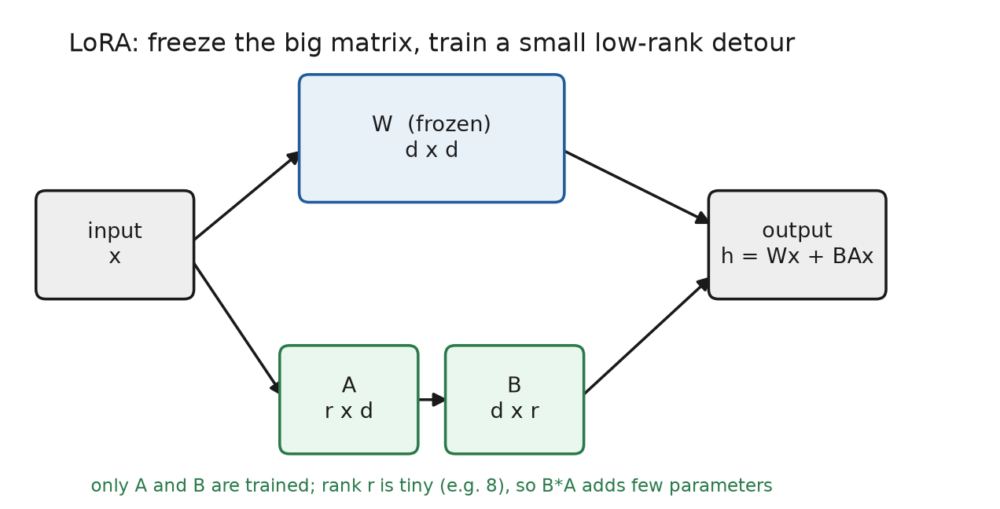
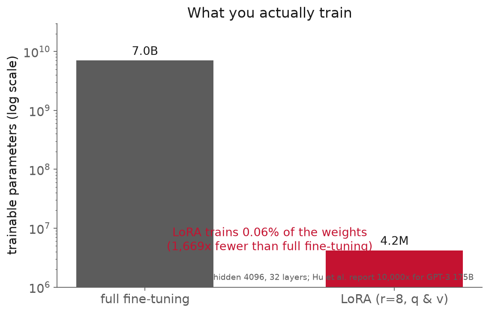
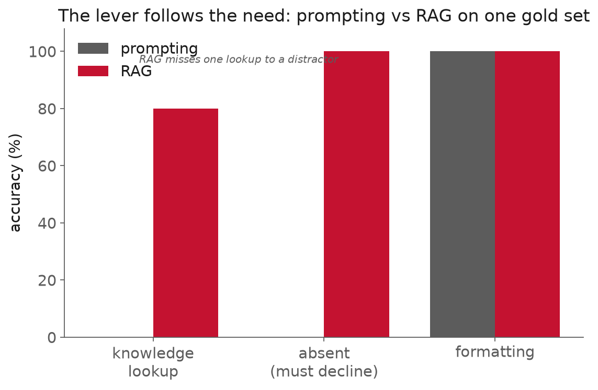

<!-- _class: title -->

# Lecture 18: Prompting, RAG, or fine-tuning

## Week 10, LLM & agentic engineering

**Systems & Toolchains for AI in Engineering**

---

## Roadmap

1. Why this matters
2. Three levers, and when each wins
3. What fine-tuning and LoRA actually do
4. Why fine-tuning is the wrong lever for knowledge
5. Evaluating adaptation apples-to-apples
6. Cost, latency, and ops
7. Where it pushes back
8. Live demo: prompting vs RAG, measured

<!-- 110 min. Budget roughly 10 / 16 / 16 / 14 / 12 / 8 / 8 / 18 demo.
     The hands-on LoRA fine-tune was moved to an optional GPU lab; this session is
     the decision framework. Keep the knowledge-vs-behavior split front and centre. -->

---

<!-- _class: section -->

# Why this matters

---

## Why this matters

A team wants an assistant that knows their equipment:
the specs, the standards, the internal manuals.

They **fine-tune a model on the PDFs.**

The result: it sounds like their domain, but still gets
the numbers wrong, invents part codes, and **cannot cite a source.**
Weeks of GPU time bought a model confidently wrong about the facts.

---

## Why this matters

The tool was wrong for the job. Three levers, three kinds of gap:

- gap is **knowledge** the model lacks -> retrieval
- gap is **behavior / format** -> fine-tuning
- still figuring out what you need -> prompting

The practitioner skill is the choice, not any one technique.

---

<!-- _class: section -->

# Three levers, and when each wins

---

## Three levers, and when each wins

| Need | Lever | Cost |
|---|---|---|
| knowledge (proprietary, changing, must cite) | **RAG** | index + retrieval latency |
| behavior / format / style, consistently | **fine-tuning** | labeled data + training + serving |
| quick iteration, latent knowledge | **prompting** | tokens per call |

They combine: RAG for the facts, a light fine-tune for the format.

---

## Three levers, and when each wins

<div class="definition">

**Model adaptation**: closing the gap between a general model and your task, by prompting, retrieval, fine-tuning, or a combination.

</div>

Microsoft's own guide splits it the same way:
fine-tuning for stable/specialized behavior, RAG for dynamic/current knowledge.

---

## Three levers, and when each wins

| Engineering task | Lever |
|---|---|
| "what is the MAWP of this pipe?" (spec lookup) | RAG |
| always emit our inspection-report schema | fine-tuning |
| classify a maintenance log's failure mode | few-shot, then fine-tune |
| summarize this one datasheet | prompting |
| answer from 10,000 changing standards, with citations | RAG |

The task names the lever. Most engineering gaps are knowledge, so most are RAG.

---

<!-- _class: section -->

# What fine-tuning and LoRA actually do

---

## What fine-tuning and LoRA actually do

- **full fine-tuning**: update every weight. Big GPU, full-size checkpoint, mostly impractical.
- **PEFT**: train far fewer parameters.

<div class="definition">

**LoRA**: freeze the base weights `W`, train a small low-rank detour `BA` beside them, so `h = Wx + BAx`. Only `A` and `B` train.

</div>

---

## What fine-tuning and LoRA actually do



Rank `r` is tiny (8, 16). At inference `BA` folds into `W`: no added latency.

---

## What fine-tuning and LoRA actually do



Under 1% of the weights train. Hu et al.: **10,000x fewer** params than full fine-tuning of GPT-3, quality on par or better.

---

## What fine-tuning and LoRA actually do

```python
from peft import LoraConfig
cfg = LoraConfig(
    r=8, lora_alpha=16,                    # rank and scaling
    target_modules=["q_proj", "v_proj"],   # which matrices get a detour
    lora_dropout=0.05,
)
# wrap the frozen base with adapters, then train as usual
```

Few knobs; the base never moves. Read aloud, run in the optional lab.

---

## What fine-tuning and LoRA actually do

- **QLoRA**: quantize the frozen base to 4-bit, train adapters on top
- Dettmers et al.: fine-tuned a **65B model on one 48GB GPU**; Guanaco hit **99.3% of ChatGPT** on one benchmark in 24 h
- knobs: rank `r`, alpha, target modules, LR, epochs
- the real risk on small data: **overfitting**

Cheap to run does not make it the right tool for knowledge.

---

<!-- _class: section -->

# Why fine-tuning is the wrong lever for knowledge

---

## Why fine-tuning is the wrong lever for knowledge

Facts baked into weights:

- **cannot be cited** (fatal for a code/spec answer)
- **go stale** the moment the data changes
- risk **catastrophic forgetting** of what the model knew

Updating a fact means another training run, not an index write.

---

## Why fine-tuning is the wrong lever for knowledge

<div class="definition">

**Knowledge injection**: getting new facts into a model's answers, by fine-tuning on them or by retrieving them at query time.

</div>

[Ovadia et al. 2023](https://arxiv.org/abs/2312.05934): across models and tasks, **RAG consistently beat fine-tuning** for knowledge, and models "struggle to learn new factual information through unsupervised fine-tuning."

---

## Why fine-tuning is the wrong lever for knowledge

What fine-tuning is actually good at: **behavior and format.**

- always emit your exact schema
- adopt a house style or domain convention
- a narrow classification, consistently

The rule: **knowledge -> retrieval; behavior/format -> fine-tuning.**

---

<!-- _class: definition -->

Knowledge is retrieval's job.

Behavior and format are fine-tuning's.

Prompting is how you find out which one you need.

---

<!-- _class: section -->

# Evaluating adaptation apples-to-apples

---

## Evaluating adaptation apples-to-apples

The comparison only counts if it is fair:
**same held-out set, same metric, every candidate.**

A tuned model at 90% on its own validation data
tells you nothing against a prompt scored on different questions.

---

## Evaluating adaptation apples-to-apples



Prompting guesses every lookup; RAG grounds and cites, and declines on the absent one. On formatting they tie.

---

## Evaluating adaptation apples-to-apples

Two honest details in that bake-off:

- RAG scores **4 of 5**, not a sweep: a distractor sentence outranked the answer (Lecture 17's lesson)
- on formatting, RAG and prompting **tie**: the gap there was never knowledge

The framework, measured.

---

<!-- _class: section -->

# Cost, latency, and ops

---

## Cost, latency, and ops

| Lever | Ongoing cost |
|---|---|
| prompting | tokens per call (long few-shot adds up) |
| RAG | index to maintain + retrieval latency |
| fine-tuning | training up front, then serving a GPU |

Self-hosting a tuned model wins only at high volume, or under latency / data-residency limits. Count total cost of ownership.

---

## The levers combine

- RAG for the facts **+** a light fine-tune for the format
- **RAFT**: fine-tune the model to *use* retrieval well, cite the right passage, ignore distractors
- "knowledge means RAG" forbids fine-tuning *instead of* retrieving, not *alongside* it

The decision is rarely one of three; it is which primary lever, and what you add.

---

<!-- _class: section -->

# Where it pushes back

---

## Where it pushes back

- the levers **combine**: RAFT fine-tunes a model to use retrieval well and ignore distractors, beating either alone
- RAG has its own misses: a distractor outranks the answer (the demo)
- fine-tuning can overfit small data or forget general skill
- eval goes wrong quietly: a leaked held-out set, a flattering metric

Measure every adaptation claim, including your own.

---

<!-- _class: demo -->

# Demo

## `l18-prompt-vs-rag.ipynb`

One corpus, one gold set, two systems scored the same way. No GPU, no key.

---

## Demo: what to watch

1. the **absent query**: RAG declines; the bare prompt invents a flash point
2. the **distractor miss**: RAG's one wrong lookup, retrieval outranked by a near-miss sentence
3. the **tie** on formatting: retrieval adds nothing when the gap is not knowledge

Fine-tuning is discussed, not trained: that is the optional GPU lab.

---

<!-- _class: section -->

# Recap

---

## Recap

- the lever follows the need: knowledge -> RAG, behavior/format -> fine-tuning, iterate -> prompting
- LoRA/QLoRA make fine-tuning cheap, training <1% of weights, but cheap does not make it right for knowledge
- the strongest systems combine levers
- prove the choice on one fair gold set

---

## Next

**Reading** Ovadia et al. (fine-tuning vs retrieval); Hu et al. (LoRA)
**Assignment 9**, the RAG system, due about a week out
**Next session** Lecture 19, agent fundamentals: tool use and planning loops

Notes for this lecture: `lectures/l18/notes.md`
